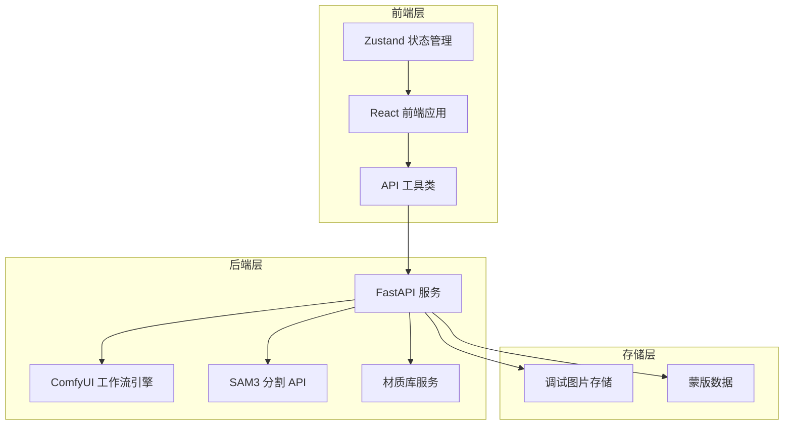
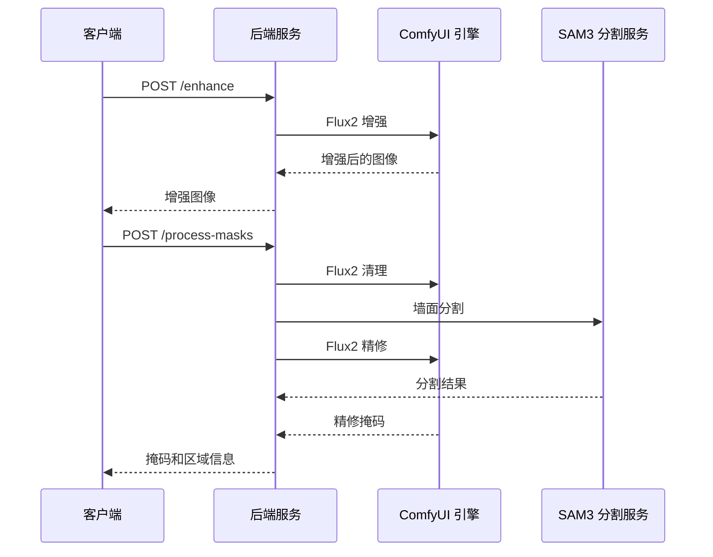
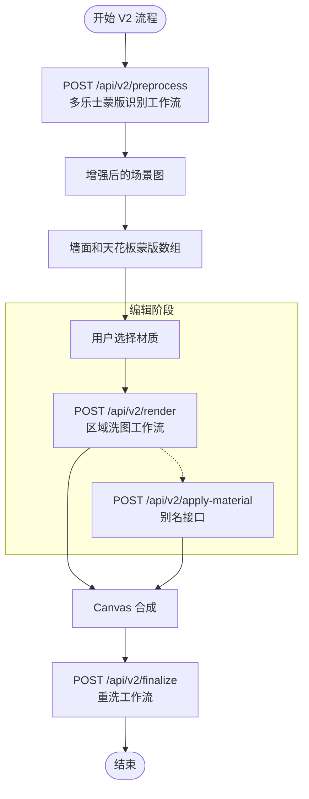
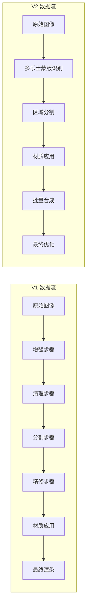
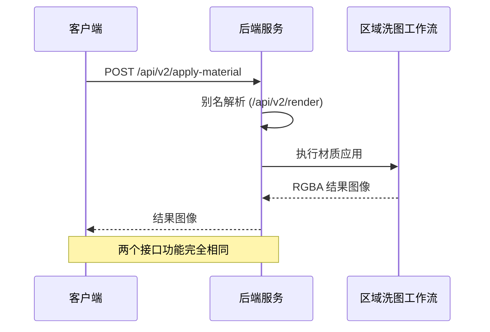
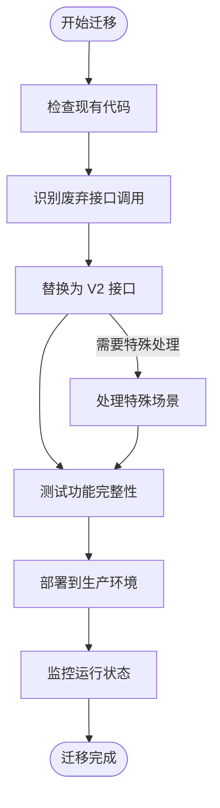
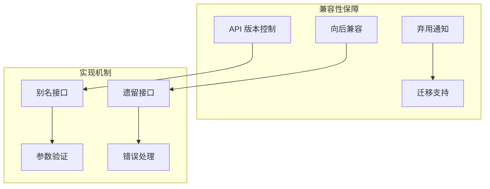
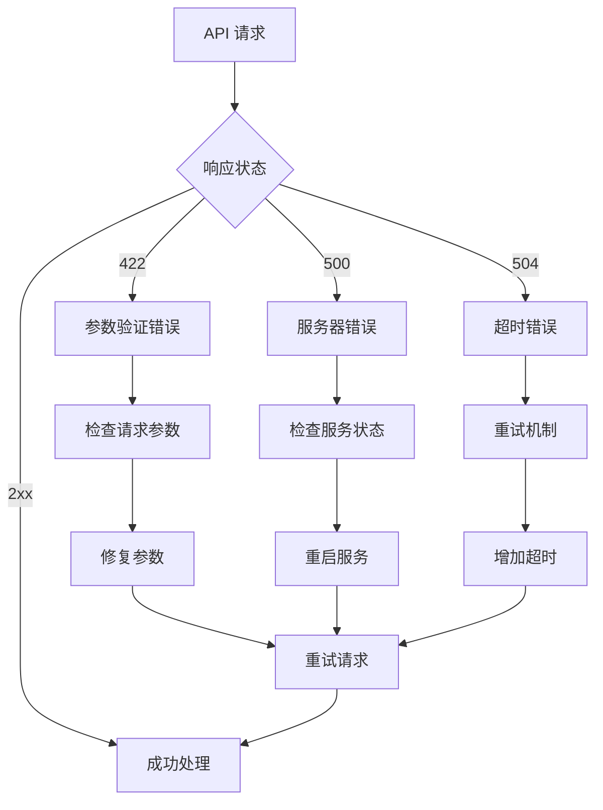
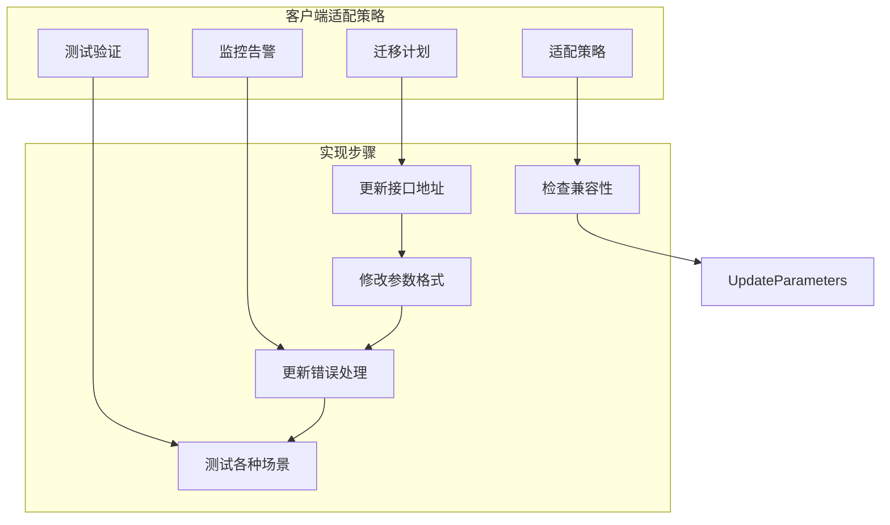
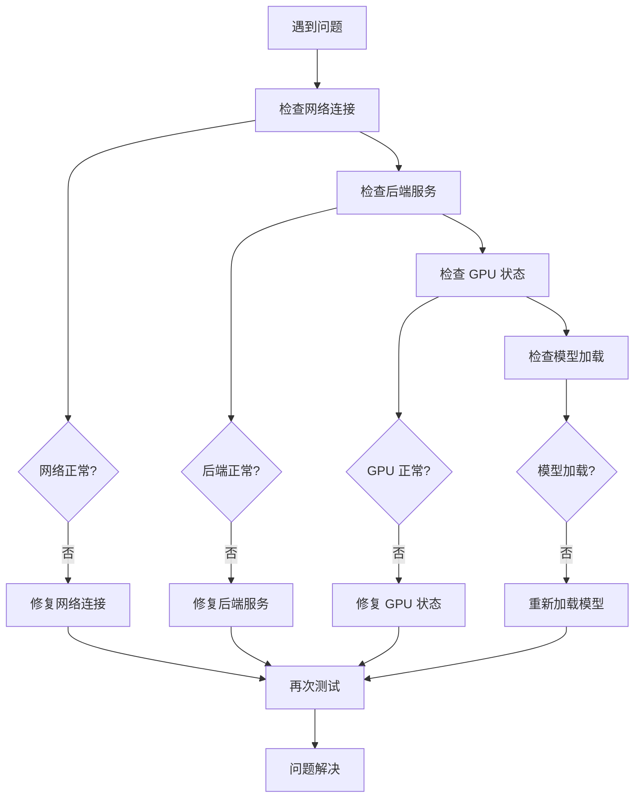

# API 兼容性与版本管理

<cite>
**本文档引用的文件**
- [docs/api-v2.md](file://docs/api-v2.md)
- [docs/api.md](file://docs/api.md)
- [docs/frontend-api-guide.md](file://docs/frontend-api-guide.md)
- [backend/main.py](file://backend/main.py)
- [src/utils/api.ts](file://src/utils/api.ts)
- [src/types.ts](file://src/types.ts)
- [backend/requirements.txt](file://backend/requirements.txt)
- [README.md](file://README.md)
</cite>

## 目录
1. [简介](#简介)
2. [项目架构概览](#项目架构概览)
3. [API 版本演进历史](#api-版本演进历史)
4. [V1 与 V2 接口对比分析](#v1-与-v2-接口对比分析)
5. [别名接口兼容性](#别名接口兼容性)
6. [废弃接口迁移指南](#废弃接口迁移指南)
7. [向后兼容性保证](#向后兼容性保证)
8. [错误码与异常处理](#错误码与异常处理)
9. [性能优化与最佳实践](#性能优化与最佳实践)
10. [客户端适配策略](#客户端适配策略)
11. [故障排除指南](#故障排除指南)
12. [结论](#结论)

## 简介

WallChanger 是一款基于 AI 的室内墙面材质替换应用，采用前后端分离架构设计。项目实现了完整的 API 版本管理体系，从 V1 的传统工作流演进到 V2 的现代化流水线，提供了完善的向后兼容性和迁移路径。

本项目的核心技术栈包括：
- **后端**: Python FastAPI + ComfyUI + SAM3
- **前端**: React + TypeScript + Vite + Zustand
- **AI 引擎**: Flux2-Klein 9B + 多乐士蒙版识别

## 项目架构概览



**图表来源**
- [backend/main.py:31-49](file://backend/main.py#L31-L49)
- [src/utils/api.ts:1-197](file://src/utils/api.ts#L1-L197)

## API 版本演进历史

### V1 版本（传统工作流）

V1 版本采用分步骤的处理流程，每个步骤都有独立的接口：



**图表来源**
- [backend/main.py:563-622](file://backend/main.py#L563-L622)
- [docs/api.md:108-145](file://docs/api.md#L108-L145)

### V2 版本（现代化流水线）

V2 版本引入了 headless 流水线，简化了 API 接口并提升了性能：



**图表来源**
- [backend/main.py:1066-1132](file://backend/main.py#L1066-L1132)
- [docs/api-v2.md:11-21](file://docs/api-v2.md#L11-L21)

**章节来源**
- [docs/api.md:275-290](file://docs/api.md#L275-L290)
- [docs/frontend-api-guide.md:47-131](file://docs/frontend-api-guide.md#L47-L131)

## V1 与 V2 接口对比分析

### 核心接口对比

| 接口类别 | V1 接口 | V2 接口 | 主要差异 | 性能影响 |
|---------|---------|---------|----------|----------|
| 预处理 | `/enhance` + `/process-masks` + `/process-upload` | `/api/v2/preprocess` | 单一接口集成 | 显著提升 |
| 材质应用 | `/apply-material` | `/api/v2/render` + `/api/v2/apply-material` | 区域精确匹配 + 别名支持 | 中等提升 |
| 最终渲染 | `/finalize` | `/api/v2/finalize` | 工作流优化 | 轻微提升 |
| 区域分割 | 无 | `/api/v2/split-mask` | 新增功能 | 无影响 |

### 数据流对比



**图表来源**
- [backend/main.py:1066-1132](file://backend/main.py#L1066-L1132)
- [docs/api-v2.md:25-84](file://docs/api-v2.md#L25-L84)

**章节来源**
- [docs/api.md:106-290](file://docs/api.md#L106-L290)
- [backend/main.py:682-775](file://backend/main.py#L682-L775)

## 别名接口兼容性

### /api/v2/apply-material 别名机制

V2 版本提供了 `/api/v2/apply-material` 作为 `/api/v2/render` 的别名接口，确保向后兼容性：



**图表来源**
- [backend/main.py:1095-1117](file://backend/main.py#L1095-L1117)
- [docs/api.md:197-242](file://docs/api.md#L197-L242)

### 别名接口的使用场景

1. **向后兼容**: 保持现有客户端代码不变
2. **语义清晰**: `apply-material` 更直观地表达接口意图
3. **开发便利**: 提供两种调用方式，满足不同开发习惯

**章节来源**
- [docs/api.md:197-242](file://docs/api.md#L197-L242)
- [backend/main.py:1095-1117](file://backend/main.py#L1095-L1117)

## 废弃接口迁移指南

### 废弃接口清单

| 废弃接口 | 替代方案 | 迁移建议 | 预计影响 |
|---------|---------|----------|----------|
| `/enhance` | `/api/v2/preprocess` | 直接替换调用 | 无 |
| `/process-masks` | `/api/v2/preprocess` | 直接替换调用 | 无 |
| `/process-upload` | `/api/v2/preprocess` | 直接替换调用 | 无 |
| `/debug-segment` | `/api/v2/preprocess` | 直接替换调用 | 无 |
| `/apply-material` | `/api/v2/render` | 更新接口地址 | 无 |
| `/finalize` | `/api/v2/finalize` | 直接替换调用 | 无 |
| `/api/v2/segment` | `/api/v2/preprocess` | 直接替换调用 | 无 |

### 迁移实施步骤



**图表来源**
- [docs/api.md:275-289](file://docs/api.md#L275-L289)
- [docs/frontend-api-guide.md:1095-1110](file://docs/frontend-api-guide.md#L1095-L1110)

### 迁移注意事项

1. **数据格式一致性**: 确保请求和响应格式符合 V2 规范
2. **错误处理**: 更新错误码处理逻辑
3. **性能优化**: 利用 V2 的批量处理能力
4. **测试验证**: 全面测试迁移后的功能

**章节来源**
- [docs/api.md:275-289](file://docs/api.md#L275-L289)
- [docs/frontend-api-guide.md:1095-1110](file://docs/frontend-api-guide.md#L1095-L1110)

## 向后兼容性保证

### 兼容性策略



### 兼容性保证措施

1. **别名接口**: 保持原有接口名称和行为
2. **参数兼容**: 确保参数格式向后兼容
3. **错误码一致**: 维持相同的错误响应格式
4. **文档更新**: 及时更新 API 文档和迁移指南

**章节来源**
- [backend/main.py:1095-1117](file://backend/main.py#L1095-L1117)
- [docs/api.md:275-290](file://docs/api.md#L275-L290)

## 错误码与异常处理

### 统一错误响应格式

所有 API 接口使用统一的错误响应格式：

```json
{
  "detail": "错误描述信息"
}
```

### 错误码对照表

| 状态码 | 含义 | 常见场景 | 处理建议 |
|--------|------|----------|----------|
| 200 | 成功 | 请求正常处理完成 | 正常处理响应 |
| 400 | 请求参数错误 | 缺少必填字段 | 检查请求参数 |
| 422 | 参数校验失败 | Base64 格式错误 | 验证数据格式 |
| 500 | 服务器内部错误 | AI 推理失败 | 检查后端服务 |
| 504 | 网关超时 | ComfyUI 处理超时 | 重试或增加超时 |
| 503 | 服务不可用 | 模型未加载完成 | 等待服务就绪 |

### 错误处理最佳实践



**图表来源**
- [docs/frontend-api-guide.md:1017-1069](file://docs/frontend-api-guide.md#L1017-L1069)
- [docs/api-v2.md:240-253](file://docs/api-v2.md#L240-L253)

**章节来源**
- [docs/frontend-api-guide.md:1017-1069](file://docs/frontend-api-guide.md#L1017-L1069)
- [docs/api-v2.md:240-253](file://docs/api-v2.md#L240-L253)

## 性能优化与最佳实践

### 性能指标对比

| 接口 | V1 耗时 | V2 耗时 | 性能提升 |
|------|---------|---------|----------|
| `/health` | < 100ms | < 100ms | 基本一致 |
| `/api/materials` | < 100ms | < 100ms | 基本一致 |
| `/api/v2/preprocess` | 2-3 分钟 | 2-3 分钟 | 基本一致 |
| `/api/v2/render` | 20-40 秒 | 20-40 秒 | 基本一致 |
| `/api/v2/finalize` | 20-40 秒 | 20-40 秒 | 基本一致 |
| `/api/v2/render-all` | - | (20-40s × N) + 20-40s | 显著提升 |

### 最佳实践建议

1. **批量处理**: 使用 `/api/v2/render-all` 减少请求次数
2. **并发控制**: 实现互斥锁防止重复调用
3. **缓存策略**: 缓存增强后的图像和材质
4. **超时配置**: 合理设置请求超时时间
5. **错误重试**: 实现智能重试机制

**章节来源**
- [docs/frontend-api-guide.md:1000-1014](file://docs/frontend-api-guide.md#L1000-L1014)
- [docs/api-v2.md:268-274](file://docs/api-v2.md#L268-L274)

## 客户端适配策略

### 前端适配指南



### 适配要点

1. **接口地址更新**: 将 `/apply-material` 更新为 `/api/v2/render`
2. **参数格式调整**: 确保 base64 数据格式正确
3. **错误处理改进**: 适配新的错误码和响应格式
4. **性能优化**: 利用批量处理功能提升用户体验

**章节来源**
- [src/utils/api.ts:171-183](file://src/utils/api.ts#L171-L183)
- [src/types.ts:56-87](file://src/types.ts#L56-L87)

## 故障排除指南

### 常见问题诊断



### 诊断工具和方法

1. **健康检查**: 使用 `/health` 接口检查服务状态
2. **日志分析**: 查看后端日志定位问题
3. **网络监控**: 检查 API 调用链路
4. **性能分析**: 监控接口响应时间和资源使用

**章节来源**
- [docs/frontend-api-guide.md:1071-1092](file://docs/frontend-api-guide.md#L1071-L1092)
- [backend/main.py:545-548](file://backend/main.py#L545-L548)

## 结论

WallChanger 的 API 版本管理体现了现代 Web 应用的最佳实践：

### 主要成就

1. **平滑演进**: 从 V1 到 V2 的无缝过渡，确保现有客户端不受影响
2. **性能提升**: 通过工作流优化和批量处理显著提升用户体验
3. **向后兼容**: 通过别名接口和参数兼容性保证长期稳定性
4. **文档完善**: 提供详细的迁移指南和故障排除方案

### 未来发展方向

1. **持续优化**: 进一步提升处理速度和质量
2. **功能扩展**: 支持更多材质类型和应用场景
3. **性能监控**: 建立更完善的性能监控和告警机制
4. **用户体验**: 持续改进界面和交互体验

通过完善的 API 版本管理和兼容性保证，WallChanger 为用户和开发者提供了稳定可靠的服务基础。