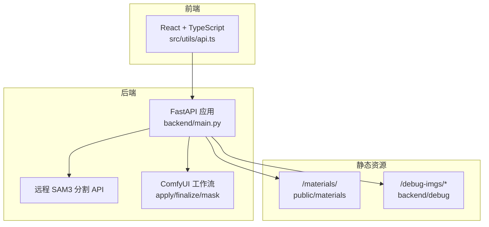
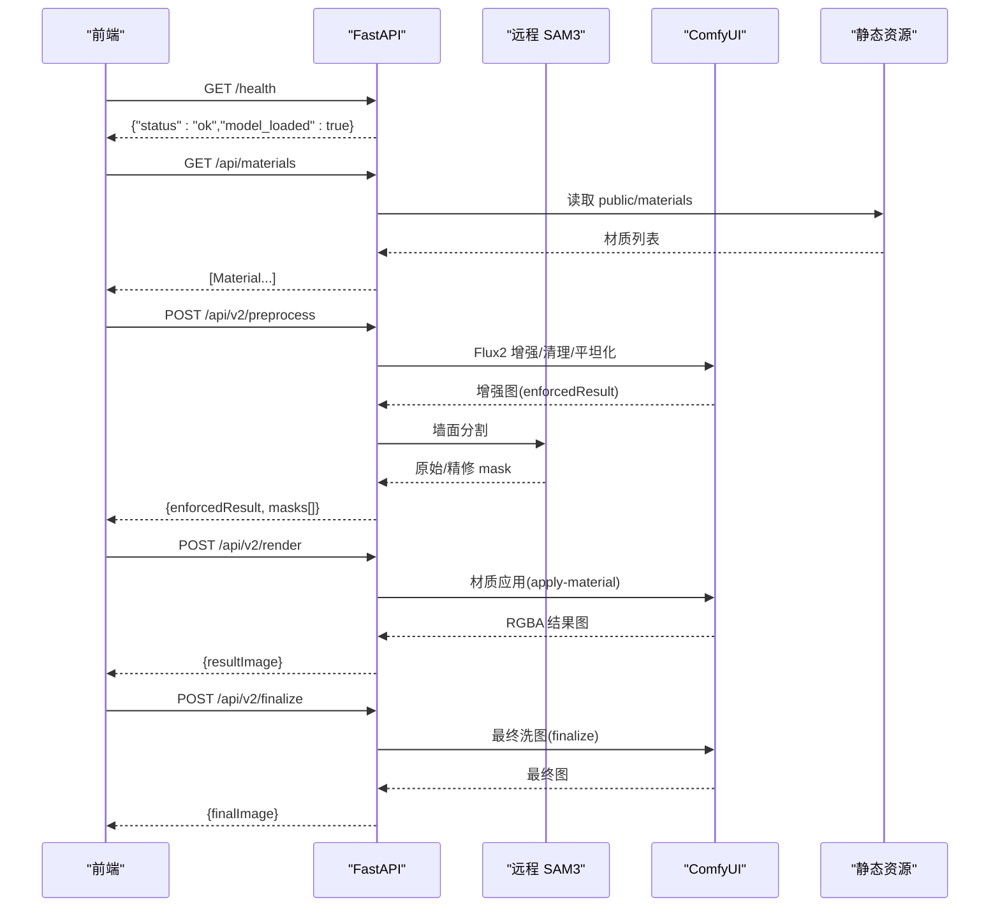
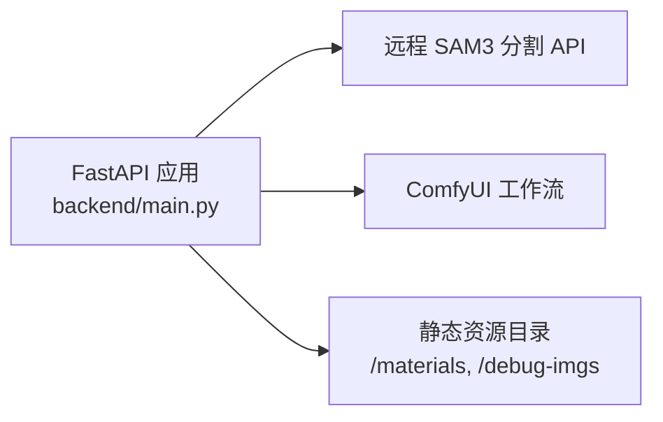

# API 接口文档

<cite>
**本文引用的文件**
- [backend/main.py](file://backend/main.py)
- [backend/comfyui_apply_material_workflow.json](file://backend/comfyui_apply_material_workflow.json)
- [backend/comfyui_finalize_workflow.json](file://backend/comfyui_finalize_workflow.json)
- [backend/comfyui_mask_workflow.json](file://backend/comfyui_mask_workflow.json)
- [docs/api.md](file://docs/api.md)
- [docs/api-v2.md](file://docs/api-v2.md)
- [docs/frontend-api-guide.md](file://docs/frontend-api-guide.md)
- [src/utils/api.ts](file://src/utils/api.ts)
- [src/types.ts](file://src/types.ts)
- [README.md](file://README.md)
</cite>

## 目录
1. [简介](#简介)
2. [项目结构](#项目结构)
3. [核心组件](#核心组件)
4. [架构总览](#架构总览)
5. [详细组件分析](#详细组件分析)
6. [依赖关系分析](#依赖关系分析)
7. [性能考量](#性能考量)
8. [故障排查指南](#故障排查指南)
9. [结论](#结论)
10. [附录](#附录)

## 简介
本文件为 WallChanger 后端 API 的完整接口文档，覆盖健康检查、材质库、图像预处理、材质应用以及最终渲染等端点。文档同时提供前端 API 客户端使用指南、版本兼容性、速率限制与安全认证机制说明，并给出请求/响应示例与常见使用场景。

## 项目结构
后端采用 FastAPI 提供 RESTful API，前端通过 src/utils/api.ts 调用后端接口，后端内部通过 ComfyUI 执行图像生成与处理工作流。

图表来源
- [backend/main.py:31-49](file://backend/main.py#L31-L49)
- [backend/main.py:550-561](file://backend/main.py#L550-L561)
- [backend/main.py:42-48](file://backend/main.py#L42-L48)

章节来源
- [backend/main.py:31-49](file://backend/main.py#L31-L49)
- [backend/main.py:550-561](file://backend/main.py#L550-L561)
- [backend/main.py:42-48](file://backend/main.py#L42-L48)

## 核心组件
- 健康检查：GET /health
- 材质库：GET /api/materials、GET /materials/{filename}
- 预处理与分割：POST /api/v2/preprocess、POST /api/v2/segment、POST /api/v2/split-mask
- 材质应用：POST /api/v2/render、POST /api/v2/apply-material
- 最终渲染：POST /api/v2/finalize
- 废弃接口（兼容保留）：/enhance、/process-masks、/process-upload、/debug-segment、/apply-material、/finalize、/api/v2/segment（旧）、/api/v2/split-mask（旧）

章节来源
- [docs/api.md:13-104](file://docs/api.md#L13-L104)
- [docs/api-v2.md:25-274](file://docs/api-v2.md#L25-L274)
- [docs/frontend-api-guide.md:135-433](file://docs/frontend-api-guide.md#L135-L433)

## 架构总览
后端负责接收前端请求，调用远程 SAM3 进行分割，再通过 ComfyUI 执行多步图像生成与处理，最终返回 base64 图像数据。静态资源目录提供材质图片与调试图片访问。

图表来源
- [backend/main.py:545-561](file://backend/main.py#L545-L561)
- [backend/main.py:550-561](file://backend/main.py#L550-L561)
- [backend/main.py:682-717](file://backend/main.py#L682-L717)
- [backend/main.py:720-775](file://backend/main.py#L720-L775)
- [backend/main.py:778-800](file://backend/main.py#L778-L800)

## 详细组件分析

### 健康检查接口
- 方法与路径：GET /health
- 请求参数：无
- 响应：包含服务状态与模型加载状态
- 错误码：无（健康检查不抛异常）
- 用途：前端启动时探测后端可用性

章节来源
- [docs/api.md:61-72](file://docs/api.md#L61-L72)
- [docs/frontend-api-guide.md:135-171](file://docs/frontend-api-guide.md#L135-L171)
- [backend/main.py:545-547](file://backend/main.py#L545-L547)

### 材质库接口
- 获取材质列表：GET /api/materials
  - 响应：数组，元素包含 name、filename、url
  - 用途：前端展示材质缩略图与选择
- 获取材质图片：GET /materials/{filename}
  - 响应：二进制图片流
  - 用途：直接展示或下载后转 base64

章节来源
- [docs/api.md:76-103](file://docs/api.md#L76-L103)
- [docs/frontend-api-guide.md:175-262](file://docs/frontend-api-guide.md#L175-L262)
- [backend/main.py:550-561](file://backend/main.py#L550-L561)
- [backend/main.py:42-48](file://backend/main.py#L42-L48)

### 图像预处理接口
- POST /api/v2/preprocess
  - 请求：image(raw base64)
  - 响应：enforcedResult(PNG)、masks
  - 说明：内部执行增强、清理、平坦化与分割，耗时较长
- POST /api/v2/segment（旧流程兼容）
  - 请求：image、promptEnhance、promptClean、promptRefine
  - 响应：enhancedImage、refinedMask、rawMask、masks[]
  - 说明：与 preprocess 功能等价，但参数更灵活

章节来源
- [docs/api.md:108-145](file://docs/api.md#L108-L145)
- [docs/api-v2.md:25-74](file://docs/api-v2.md#L25-L74)
- [docs/frontend-api-guide.md:265-317](file://docs/frontend-api-guide.md#L265-L317)
- [backend/main.py:682-717](file://backend/main.py#L682-L717)

### 图像预处理接口（V2）
- POST /api/v2/split-mask（可选）
  - 请求：maskImage、targetColor、x1/y1/x2/y2、existingColors
  - 响应：maskImage、newColor
  - 说明：纯像素计算，将目标区域沿线段切分为两个子区域
- POST /api/v2/render（核心渲染）
  - 请求：image、refinedMask、items[]（x、y、referenceImage、prompt）、promptFinalize
  - 响应：finalImage(PNG)
  - 说明：自动匹配点击坐标到 mask 颜色，去重后并行处理，合成后最终洗图

章节来源
- [docs/api-v2.md:87-218](file://docs/api-v2.md#L87-L218)
- [docs/frontend-api-guide.md:435-546](file://docs/frontend-api-guide.md#L435-L546)
- [backend/main.py:720-775](file://backend/main.py#L720-L775)

### 材质应用接口
- POST /api/v2/render（别名：/api/v2/apply-material）
  - 请求：enforcedImage、maskImage、materialImage
  - 响应：resultImage(RGBA PNG)
  - 说明：同步接口，前端需互斥控制；返回图像仅目标区域有像素
- POST /api/v2/apply-material（兼容别名）
  - 与 /api/v2/render 完全一致

章节来源
- [docs/api.md:148-242](file://docs/api.md#L148-L242)
- [docs/frontend-api-guide.md:320-383](file://docs/frontend-api-guide.md#L320-L383)
- [backend/main.py:720-775](file://backend/main.py#L720-L775)

### 最终渲染接口
- POST /api/v2/finalize
  - 请求：compositeImage(raw base64 PNG)
  - 响应：finalImage(PNG)
  - 说明：对合成图进行最终洗图优化

章节来源
- [docs/api.md:245-273](file://docs/api.md#L245-L273)
- [docs/frontend-api-guide.md:386-432](file://docs/frontend-api-guide.md#L386-L432)
- [backend/main.py:778-796](file://backend/main.py#L778-L796)

### 废弃接口（兼容保留）
- /enhance、/process-masks、/process-upload、/debug-segment、/apply-material、/finalize、/api/v2/segment（旧）、/api/v2/split-mask（旧）
- 说明：后端仍保留，但前端不再使用

章节来源
- [docs/api.md:275-289](file://docs/api.md#L275-L289)
- [docs/api-v2.md:256-274](file://docs/api-v2.md#L256-L274)

## 依赖关系分析
后端依赖关系与外部集成如下：

图表来源
- [backend/main.py:19-22](file://backend/main.py#L19-L22)
- [backend/main.py:31-49](file://backend/main.py#L31-L49)
- [backend/main.py:42-48](file://backend/main.py#L42-L48)

章节来源
- [backend/main.py:19-22](file://backend/main.py#L19-L22)
- [backend/main.py:31-49](file://backend/main.py#L31-L49)
- [backend/main.py:42-48](file://backend/main.py#L42-L48)

## 性能考量
- 同步约束：/api/v2/render 同一时刻仅能处理一个任务，前端需互斥控制
- 超时与等待：ComfyUI 默认最长等待约 10 分钟，超时返回 504
- 耗时分布：预处理约 2-3 分钟，单区域渲染约 20-40 秒，最终洗图约 20-40 秒
- 并行策略：/api/v2/render 支持对多个区域并行处理，但渲染接口本身为同步互斥

章节来源
- [docs/api.md:41-56](file://docs/api.md#L41-L56)
- [docs/api-v2.md:240-274](file://docs/api-v2.md#L240-L274)
- [docs/frontend-api-guide.md:751-771](file://docs/frontend-api-guide.md#L751-L771)

## 故障排查指南
- 常见错误格式：{"detail":"错误描述"}
- 常见 HTTP 状态码
  - 400：请求参数缺失或格式错误
  - 422：JSON 字段校验失败（Pydantic）
  - 500：模型推理失败 / SAM3 未检测到区域
  - 504：ComfyUI 超时（默认等待上限约 10 分钟）
- 健康检查：GET /health 用于确认后端可用与模型加载状态
- 日志与调试：后端会将中间结果保存至 backend/debug，前端可通过 /debug-imgs 访问

章节来源
- [docs/api.md:46-56](file://docs/api.md#L46-L56)
- [docs/api-v2.md:240-247](file://docs/api-v2.md#L240-L247)
- [backend/main.py:42-48](file://backend/main.py#L42-L48)

## 结论
本接口文档覆盖了 WallChanger 的完整 API 流程，从前端调用到后端处理与外部依赖均有明确说明。建议在生产环境中：
- 使用 /api/v2/preprocess + /api/v2/render + /api/v2/finalize 的组合流程
- 前端严格互斥控制 /api/v2/render 的并发
- 正确处理 base64 编码规范与错误响应
- 通过 /health 与 /debug-imgs 辅助诊断问题

## 附录

### 前端 API 客户端使用指南
- 基础配置：设置后端地址，调用 checkHealth 确认可用
- 获取材质：调用 getMaterials 获取材质列表，再通过 /materials/{filename} 下载或直接展示
- 预处理：调用 preprocessImage 获取 enforcedResult 与 masks
- 材质应用：对每个区域调用 renderRegion，叠加到 canvas
- 最终渲染：调用 finalizeV2 生成最终图
- 错误处理：捕获网络错误与后端返回的 detail

章节来源
- [docs/frontend-api-guide.md:1-18](file://docs/frontend-api-guide.md#L1-L18)
- [src/utils/api.ts:1-200](file://src/utils/api.ts#L1-L200)
- [src/types.ts:1-89](file://src/types.ts#L1-L89)

### API 版本兼容性
- 当前推荐使用 /api/v2/* 接口族
- 兼容保留旧接口，但不建议新调用
- /api/v2/split-mask 为可选功能，纯像素计算，响应极快

章节来源
- [docs/api.md:275-289](file://docs/api.md#L275-L289)
- [docs/api-v2.md:25-274](file://docs/api-v2.md#L25-L274)

### 速率限制与安全认证
- 速率限制：未在后端显式实现全局限流
- 安全认证：未在后端实现鉴权机制
- 建议：在生产环境通过反向代理或网关实现认证与限流

章节来源
- [backend/main.py:33-39](file://backend/main.py#L33-L39)
- [README.md:17-23](file://README.md#L17-L23)

### 请求/响应示例与常见场景
- 预处理：上传原图 base64，返回增强图与各墙面蒙版
- 材质应用：传入 enforcedImage、maskImage、materialImage，返回 RGBA 结果图
- 最终渲染：传入合成图 base64，返回最终优化图
- 批量渲染：一次性提交多个区域，后端自动去重并并行处理

章节来源
- [docs/api.md:108-273](file://docs/api.md#L108-L273)
- [docs/api-v2.md:25-218](file://docs/api-v2.md#L25-L218)
- [docs/frontend-api-guide.md:265-546](file://docs/frontend-api-guide.md#L265-L546)