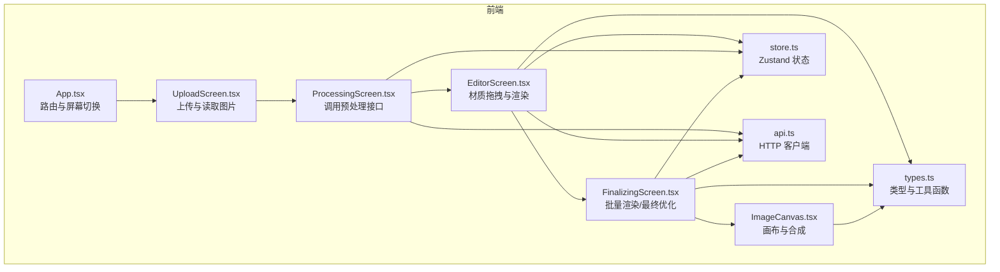
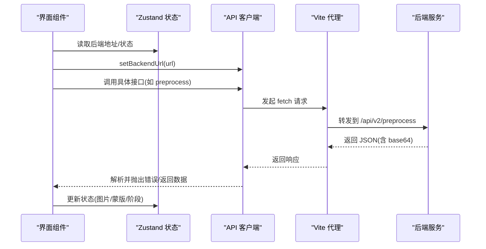
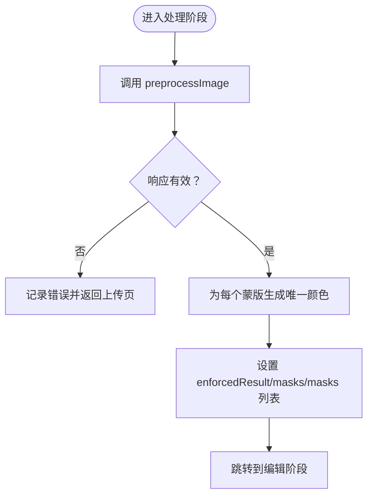
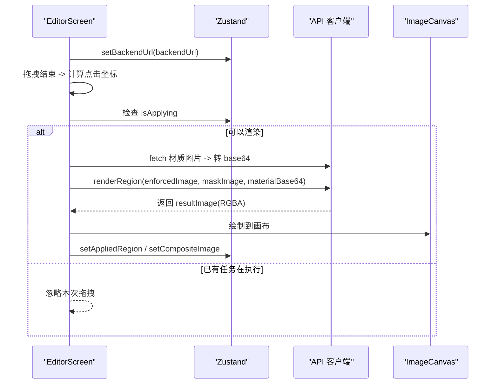
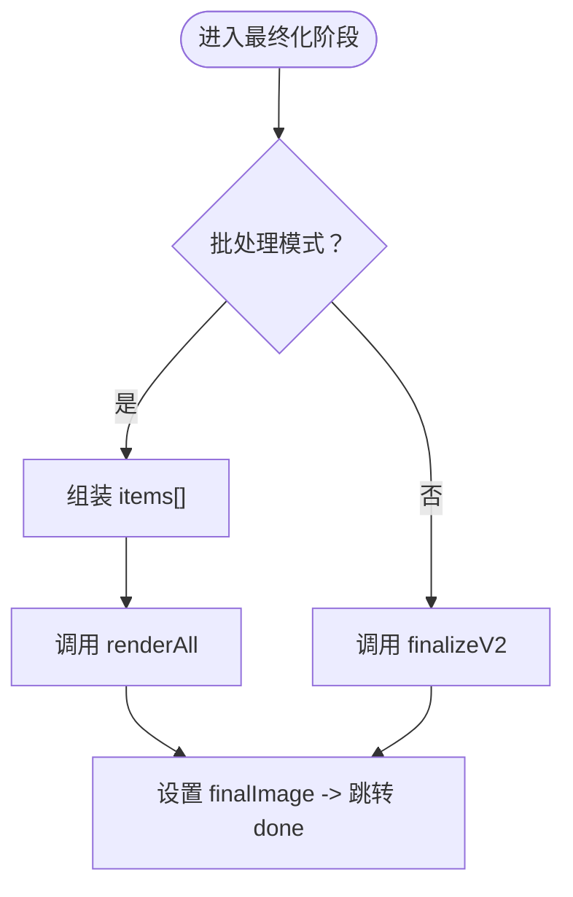
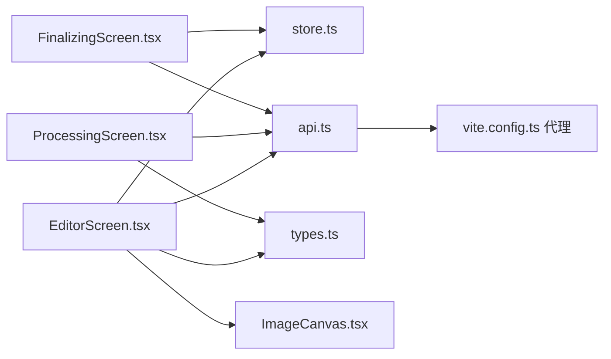

# 前端 API 客户端

<cite>
**本文引用的文件**
- [src/utils/api.ts](file://src/utils/api.ts)
- [src/store.ts](file://src/store.ts)
- [src/types.ts](file://src/types.ts)
- [src/components/ImageCanvas.tsx](file://src/components/ImageCanvas.tsx)
- [src/screens/EditorScreen.tsx](file://src/screens/EditorScreen.tsx)
- [src/screens/ProcessingScreen.tsx](file://src/screens/ProcessingScreen.tsx)
- [src/screens/FinalizingScreen.tsx](file://src/screens/FinalizingScreen.tsx)
- [vite.config.ts](file://vite.config.ts)
- [docs/frontend-api-guide.md](file://docs/frontend-api-guide.md)
- [package.json](file://package.json)
</cite>

## 目录
1. [简介](#简介)
2. [项目结构](#项目结构)
3. [核心组件](#核心组件)
4. [架构总览](#架构总览)
5. [详细组件分析](#详细组件分析)
6. [依赖关系分析](#依赖关系分析)
7. [性能考量](#性能考量)
8. [故障排查指南](#故障排查指南)
9. [结论](#结论)
10. [附录](#附录)

## 简介
本指南面向前端开发者，系统讲解 WallChanger 前端 API 客户端的使用方法与最佳实践。内容涵盖：
- 如何使用 API 客户端发起 HTTP 请求（请求构造、响应处理、错误处理、状态管理）
- API 客户端的配置选项、请求拦截器、响应解析与重试机制
- TypeScript 类型定义、接口调用示例与与 Zustand 状态管理的集成方式
- 异步处理模式与前端对后端返回 base64 图像数据的处理策略

## 项目结构
前端采用 React + TypeScript + Vite 构建，API 客户端集中于 utils/api.ts，状态管理由 Zustand 实现，屏幕组件负责编排业务流程。

图表来源
- [src/App.tsx:8-25](file://src/App.tsx#L8-L25)
- [src/screens/UploadScreen.tsx:6-121](file://src/screens/UploadScreen.tsx#L6-L121)
- [src/screens/ProcessingScreen.tsx:22-120](file://src/screens/ProcessingScreen.tsx#L22-L120)
- [src/screens/EditorScreen.tsx:21-758](file://src/screens/EditorScreen.tsx#L21-L758)
- [src/screens/FinalizingScreen.tsx:5-81](file://src/screens/FinalizingScreen.tsx#L5-L81)
- [src/components/ImageCanvas.tsx:15-91](file://src/components/ImageCanvas.tsx#L15-L91)
- [src/store.ts:63-177](file://src/store.ts#L63-L177)
- [src/types.ts:44-54](file://src/types.ts#L44-L54)
- [src/utils/api.ts:1-197](file://src/utils/api.ts#L1-L197)

章节来源
- [src/App.tsx:8-25](file://src/App.tsx#L8-L25)
- [src/utils/api.ts:1-197](file://src/utils/api.ts#L1-L197)
- [src/store.ts:63-177](file://src/store.ts#L63-L177)
- [src/types.ts:44-54](file://src/types.ts#L44-L54)

## 核心组件
- API 客户端（utils/api.ts）
  - 提供健康检查、材质列表、图像预处理、增强、掩码处理、上传处理、调试分割、批量渲染、单区域渲染、最终优化等接口
  - 统一设置后端地址，封装 fetch 请求与错误处理
- 状态管理（store.ts）
  - 使用 Zustand 管理应用状态（图片、蒙版、处理步骤、批处理模式、后端地址等）
  - 提供并发互斥锁（isApplying）保障同步接口安全
- 类型与工具（types.ts）
  - 定义 MaskInfo、Material、AppState 等核心类型
  - 提供 toImgSrc 工具函数，自动为 base64 添加 data URI 前缀
- 屏幕组件
  - UploadScreen：读取图片为 base64，进入处理阶段
  - ProcessingScreen：调用预处理接口，构建蒙版与颜色映射
  - EditorScreen：材质拖拽、单区域渲染、合成到画布
  - FinalizingScreen：批量渲染或最终优化
- 画布组件（ImageCanvas）
  - 初始化画布、加载基础图与蒙版，支持合成图覆盖

章节来源
- [src/utils/api.ts:1-197](file://src/utils/api.ts#L1-L197)
- [src/store.ts:63-177](file://src/store.ts#L63-L177)
- [src/types.ts:44-54](file://src/types.ts#L44-L54)
- [src/screens/UploadScreen.tsx:13-29](file://src/screens/UploadScreen.tsx#L13-L29)
- [src/screens/ProcessingScreen.tsx:41-75](file://src/screens/ProcessingScreen.tsx#L41-L75)
- [src/screens/EditorScreen.tsx:276-345](file://src/screens/EditorScreen.tsx#L276-L345)
- [src/screens/FinalizingScreen.tsx:18-59](file://src/screens/FinalizingScreen.tsx#L18-L59)
- [src/components/ImageCanvas.tsx:33-80](file://src/components/ImageCanvas.tsx#L33-L80)

## 架构总览
前端通过 Vite 代理将 /api 与旧版路由转发至后端，API 客户端统一使用 setBackendUrl 设置后端地址，随后按业务流程调用相应接口。

图表来源
- [vite.config.ts:8-46](file://vite.config.ts#L8-L46)
- [src/utils/api.ts:5-7](file://src/utils/api.ts#L5-L7)
- [src/screens/ProcessingScreen.tsx:34-75](file://src/screens/ProcessingScreen.tsx#L34-L75)
- [src/screens/EditorScreen.tsx:276-345](file://src/screens/EditorScreen.tsx#L276-L345)
- [src/screens/FinalizingScreen.tsx:18-59](file://src/screens/FinalizingScreen.tsx#L18-L59)

章节来源
- [vite.config.ts:8-46](file://vite.config.ts#L8-L46)
- [src/utils/api.ts:5-7](file://src/utils/api.ts#L5-L7)

## 详细组件分析

### API 客户端（utils/api.ts）
- 配置与初始化
  - setBackendUrl(url)：设置后端地址，后续所有接口均基于该地址
- 健康检查
  - checkHealth()：GET /health，返回 { status, model_loaded }
- 材质与图片
  - getMaterials()：GET /api/materials，返回材质列表
  - applyMaterial(...)：POST /apply-material，将材质应用到原图
- 预处理与增强
  - preprocessImage(image)：POST /api/v2/preprocess，返回增强图与蒙版数组
  - enhanceImage(image, width, height, prompt?)：POST /enhance
- 掩码处理
  - processMasks(enhancedImage, promptClean?, promptRefine?)：POST /process-masks
  - debugSegment(image)：POST /debug-segment
- 渲染与合成
  - renderRegion(enforcedImage, maskImage, materialImage)：POST /api/v2/render
  - renderAll(enforcedImage, masks[], items[])：POST /api/v2/render-all
  - finalizeV2(compositeImage)：POST /api/v2/finalize
  - finalize(compositeImage, prompt?)：POST /finalize
- 错误处理
  - 所有接口在 resp.ok 为 false 时抛出错误，包含状态码与响应文本
  - 部分接口在异常时输出详细日志便于诊断

章节来源
- [src/utils/api.ts:9-197](file://src/utils/api.ts#L9-L197)

### 状态管理（store.ts 与 types.ts）
- Zustand 状态键
  - 基础图片与尺寸、蒙版与掩码、合成图与最终图
  - 处理步骤、处理区域集合、已应用区域映射、批处理模式
  - 后端地址、调试提示词、调试开关、互斥锁 isApplying
- 关键动作
  - setBackendUrl：持久化到 localStorage，并更新状态
  - setOriginalImage/setMasks：清空历史结果，避免脏数据
  - add/removeProcessingRegion：跟踪当前渲染中的区域
  - setAppliedRegion：保存单区域渲染结果
  - setCompositeImage/setFinalImage：保存合成与最终图
  - setBatchMode/addBatchItem/removeBatchItem：批处理模式与收集项
- 并发控制
  - isApplying 互斥锁：保证 /api/v2/render 同步执行，避免后端队列冲突

章节来源
- [src/store.ts:63-177](file://src/store.ts#L63-L177)
- [src/types.ts:56-87](file://src/types.ts#L56-L87)

### 屏幕组件与业务流程

#### 上传与读取（UploadScreen）
- 将 File 读取为 base64（去除 data URI 前缀），设置原始图与尺寸，进入处理阶段
- 读取尺寸用于后续画布与蒙版尺寸匹配

章节来源
- [src/screens/UploadScreen.tsx:13-29](file://src/screens/UploadScreen.tsx#L13-L29)

#### 预处理（ProcessingScreen）
- 调用 preprocessImage，接收 enforcedResult 与 masks[]
- 为每个蒙版生成唯一颜色，构建 MaskInfo 列表
- 设置状态并跳转到编辑阶段

图表来源
- [src/screens/ProcessingScreen.tsx:41-75](file://src/screens/ProcessingScreen.tsx#L41-L75)

章节来源
- [src/screens/ProcessingScreen.tsx:41-75](file://src/screens/ProcessingScreen.tsx#L41-L75)

#### 编辑与单区域渲染（EditorScreen）
- 材质拖拽：将材质图片下载为 base64，调用 renderRegion
- 合成：将返回的 RGBA 结果直接绘制到画布，更新合成图
- 并发控制：使用 isApplying 互斥锁，避免同时发起多个渲染请求
- 批处理模式：收集点击坐标与材质，不立即渲染，待一键焕色时统一处理

图表来源
- [src/screens/EditorScreen.tsx:276-345](file://src/screens/EditorScreen.tsx#L276-L345)
- [src/utils/api.ts:139-154](file://src/utils/api.ts#L139-L154)
- [src/components/ImageCanvas.tsx:73-80](file://src/components/ImageCanvas.tsx#L73-L80)

章节来源
- [src/screens/EditorScreen.tsx:276-345](file://src/screens/EditorScreen.tsx#L276-L345)
- [src/utils/api.ts:139-154](file://src/utils/api.ts#L139-L154)
- [src/components/ImageCanvas.tsx:73-80](file://src/components/ImageCanvas.tsx#L73-L80)

#### 批量渲染与最终优化（FinalizingScreen）
- 批处理模式：将收集的 items[x, y, materialUrl] 传给 renderAll，返回 finalImage
- 传统模式：将合成图 compositeImage 传给 finalizeV2，返回 finalImage
- 失败回退：任一阶段失败，回到编辑阶段

图表来源
- [src/screens/FinalizingScreen.tsx:18-59](file://src/screens/FinalizingScreen.tsx#L18-L59)
- [src/utils/api.ts:109-137](file://src/utils/api.ts#L109-L137)

章节来源
- [src/screens/FinalizingScreen.tsx:18-59](file://src/screens/FinalizingScreen.tsx#L18-L59)
- [src/utils/api.ts:109-137](file://src/utils/api.ts#L109-L137)

### 类型定义与工具函数
- MaskInfo：蒙版标识与颜色
- Material：材质名称、文件名、URL
- AppState：应用状态总览（图片、蒙版、处理步骤、批处理、配置等）
- toImgSrc：将 raw base64 自动补全为 data:image/png;base64, 前缀，适配  src

章节来源
- [src/types.ts:1-88](file://src/types.ts#L1-L88)

### 与 Zustand 的集成与异步模式
- 状态驱动 UI：所有图片与处理状态均由 Zustand 管理，组件通过 hooks 访问
- 异步模式：屏幕组件在 useEffect 中触发 API 调用，成功后更新状态，失败记录错误
- 并发控制：EditorScreen 在渲染前检查 isApplying，防止多任务并发

章节来源
- [src/store.ts:63-177](file://src/store.ts#L63-L177)
- [src/screens/EditorScreen.tsx:299-345](file://src/screens/EditorScreen.tsx#L299-L345)

### 前端对 base64 图像数据的处理
- 输入规范：所有图片字段使用 raw base64（不含 data:image/...;base64, 前缀）
- 下载转换：从 URL 下载材质图片时，使用 Blob + FileReader 去除 data URI 前缀
- 展示与合成：toImgSrc 自动补全前缀；RGBA 结果直接绘制到画布；合成图导出时同样去除前缀

章节来源
- [docs/frontend-api-guide.md:613-616](file://docs/frontend-api-guide.md#L613-L616)
- [docs/frontend-api-guide.md:646-665](file://docs/frontend-api-guide.md#L646-L665)
- [src/types.ts:44-54](file://src/types.ts#L44-L54)
- [src/components/ImageCanvas.tsx:73-80](file://src/components/ImageCanvas.tsx#L73-L80)

## 依赖关系分析
- 组件依赖
  - EditorScreen 依赖 store、api、canvas 工具与 types
  - ProcessingScreen 依赖 api 与 types
  - FinalizingScreen 依赖 api 与 store
- 外部依赖
  - Vite 代理配置将 /api 与旧版路由转发至后端
  - Zustand 作为轻量状态库

图表来源
- [src/screens/EditorScreen.tsx:1-12](file://src/screens/EditorScreen.tsx#L1-L12)
- [src/screens/ProcessingScreen.tsx:1-6](file://src/screens/ProcessingScreen.tsx#L1-L6)
- [src/screens/FinalizingScreen.tsx:1-4](file://src/screens/FinalizingScreen.tsx#L1-L4)
- [src/utils/api.ts:1-7](file://src/utils/api.ts#L1-L7)
- [vite.config.ts:8-46](file://vite.config.ts#L8-L46)

章节来源
- [src/screens/EditorScreen.tsx:1-12](file://src/screens/EditorScreen.tsx#L1-L12)
- [src/screens/ProcessingScreen.tsx:1-6](file://src/screens/ProcessingScreen.tsx#L1-L6)
- [src/screens/FinalizingScreen.tsx:1-4](file://src/screens/FinalizingScreen.tsx#L1-L4)
- [src/utils/api.ts:1-7](file://src/utils/api.ts#L1-L7)
- [vite.config.ts:8-46](file://vite.config.ts#L8-L46)

## 性能考量
- 请求计时：renderAll 内部使用 console.time/console.timeEnd 记录网络耗时，便于性能分析
- 画布合成：RGBA 图层直接绘制，避免额外转换；合成图导出使用 toDataURL('image/png') 去除前缀
- 并发限制：isApplying 互斥锁避免后端队列拥堵，减少失败与重试
- 资源释放：上传屏幕在读取完成后及时 revokeObjectURL，避免内存泄漏

章节来源
- [src/utils/api.ts:121-130](file://src/utils/api.ts#L121-L130)
- [src/screens/UploadScreen.tsx:20-26](file://src/screens/UploadScreen.tsx#L20-L26)
- [src/screens/EditorScreen.tsx:299-345](file://src/screens/EditorScreen.tsx#L299-L345)

## 故障排查指南
- 常见错误码
  - 422：参数校验错误（如 base64 格式、分割线无效）
  - 500：服务器内部错误（AI 推理失败、服务不可用）
  - 504：网关超时（默认 10 分钟）
- 前端错误处理模板
  - 捕获 fetch 异常与非 OK 响应，解析 JSON 错误详情并分类提示
- 诊断建议
  - 检查后端地址与代理配置
  - 查看浏览器网络面板与控制台日志
  - 确认图片为 raw base64，且尺寸与蒙版一致

章节来源
- [docs/frontend-api-guide.md:1017-1077](file://docs/frontend-api-guide.md#L1017-L1077)
- [src/utils/api.ts:29-32](file://src/utils/api.ts#L29-L32)
- [src/utils/api.ts:64-68](file://src/utils/api.ts#L64-L68)
- [src/utils/api.ts:131-135](file://src/utils/api.ts#L131-L135)

## 结论
本文档提供了 WallChanger 前端 API 客户端的完整使用指南，涵盖请求构造、响应处理、错误处理、状态管理与 base64 图像处理策略。通过 Vite 代理与 Zustand 状态管理，前端能够稳定地编排复杂的 AI 图像处理流程，并在单区域渲染与批量渲染两种模式间灵活切换。

## 附录

### API 客户端配置选项
- 后端地址：setBackendUrl(url)，全局生效
- 代理配置：Vite 将 /api 与旧版路由转发至后端，默认地址为 http://localhost:8100

章节来源
- [src/utils/api.ts:5-7](file://src/utils/api.ts#L5-L7)
- [vite.config.ts:4-46](file://vite.config.ts#L4-L46)

### 请求拦截器与响应解析
- 拦截器：当前实现未内置拦截器，建议在 fetch 前统一封装（如添加鉴权头、重试逻辑）
- 响应解析：所有接口统一返回 JSON；错误时抛出包含状态码与文本的错误对象

章节来源
- [src/utils/api.ts:24-36](file://src/utils/api.ts#L24-L36)
- [src/utils/api.ts:144-153](file://src/utils/api.ts#L144-L153)

### 重试机制建议
- 建议在应用层封装重试逻辑（指数退避、最大次数），针对 504、网络异常与 500 场景
- 对于同步接口（/api/v2/render），需结合 isApplying 互斥锁，避免重复提交

章节来源
- [docs/frontend-api-guide.md:1017-1077](file://docs/frontend-api-guide.md#L1017-L1077)
- [src/store.ts:136-137](file://src/store.ts#L136-L137)

### TypeScript 类型定义与最佳实践
- 使用 toImgSrc 自动处理 base64 与 data URI 前缀
- 在组件中优先使用 Zustand 管理状态，避免重复拉取与渲染
- 对长耗时接口（preprocess/render/finalize）提供加载态与进度提示

章节来源
- [src/types.ts:44-54](file://src/types.ts#L44-L54)
- [src/store.ts:63-177](file://src/store.ts#L63-L177)
- [docs/frontend-api-guide.md:1012-1014](file://docs/frontend-api-guide.md#L1012-L1014)