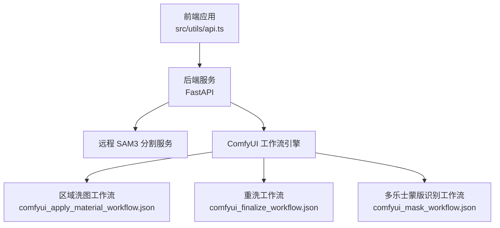
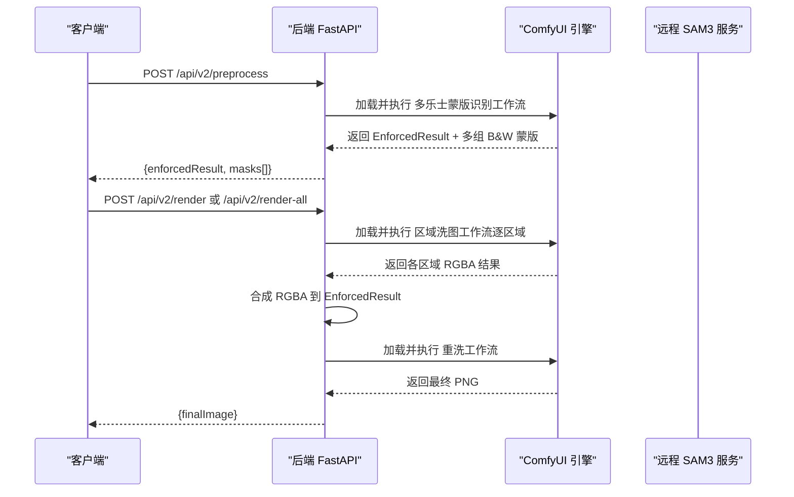
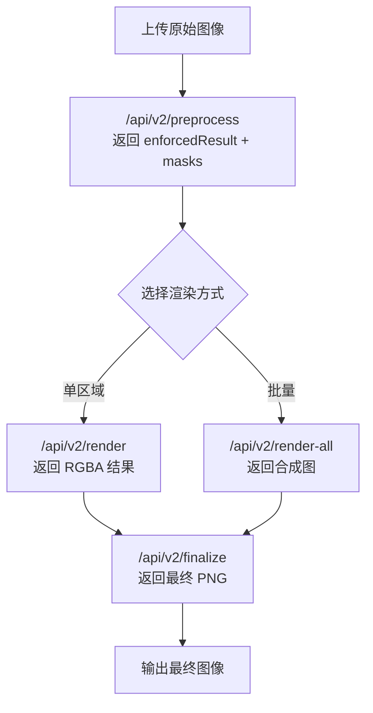
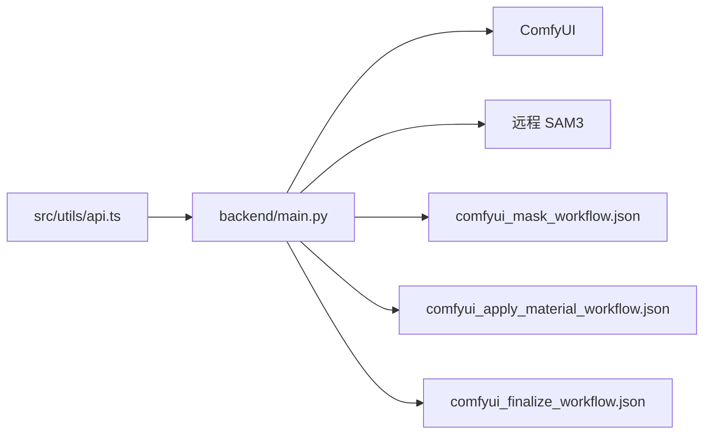

# 图像处理接口

<cite>
**本文引用的文件**
- [backend/main.py](file://backend/main.py)
- [docs/api-v2.md](file://docs/api-v2.md)
- [src/utils/api.ts](file://src/utils/api.ts)
- [src/types.ts](file://src/types.ts)
- [backend/comfyui_apply_material_workflow.json](file://backend/comfyui_apply_material_workflow.json)
- [backend/comfyui_finalize_workflow.json](file://backend/comfyui_finalize_workflow.json)
- [backend/comfyui_mask_workflow.json](file://backend/comfyui_mask_workflow.json)
</cite>

## 目录
1. [简介](#简介)
2. [项目结构](#项目结构)
3. [核心组件](#核心组件)
4. [架构总览](#架构总览)
5. [详细组件分析](#详细组件分析)
6. [依赖分析](#依赖分析)
7. [性能考虑](#性能考虑)
8. [故障排除指南](#故障排除指南)
9. [结论](#结论)
10. [附录](#附录)

## 简介
本文件为 WallChanger 图像处理接口的完整 API 文档，重点覆盖以下三个核心接口：
- 预处理接口：/api/v2/preprocess
- 渲染接口：/api/v2/render（单区域）与 /api/v2/render-all（批量区域）
- 最终渲染接口：/api/v2/finalize

文档内容包括：
- 接口功能与作用
- 请求参数与数据格式
- 响应结果结构
- 处理流程与调用顺序
- 图像编码要求（raw base64）
- 同步约束与并发策略
- 性能与超时说明
- 请求/响应示例与错误处理指南
- 接口间依赖关系与最佳实践

## 项目结构
后端采用 FastAPI 提供 REST API，前端通过 src/utils/api.ts 调用后端接口。ComfyUI 工作流通过 JSON 文件定义，后端在运行时动态加载并调用 ComfyUI。

图表来源
- [backend/main.py:1041-1186](file://backend/main.py#L1041-L1186)
- [backend/comfyui_apply_material_workflow.json:1-432](file://backend/comfyui_apply_material_workflow.json#L1-L432)
- [backend/comfyui_finalize_workflow.json:1-217](file://backend/comfyui_finalize_workflow.json#L1-L217)
- [backend/comfyui_mask_workflow.json:1-831](file://backend/comfyui_mask_workflow.json#L1-L831)

章节来源
- [backend/main.py:1041-1186](file://backend/main.py#L1041-L1186)
- [src/utils/api.ts:21-172](file://src/utils/api.ts#L21-L172)

## 核心组件
- 预处理组件：负责上传图像，调用多乐士蒙版识别工作流，返回强化后的场景图与多组 B&W 蒙版（含墙面与天花板）。
- 渲染组件：支持单区域材质替换（/api/v2/render）与批量区域渲染（/api/v2/render-all），内部并行执行材质替换，然后合成并进行最终洗图。
- 最终渲染组件：对合成后的图像进行最终优化，减少噪点与伪影，提升真实感。

章节来源
- [backend/main.py:1041-1186](file://backend/main.py#L1041-L1186)
- [backend/main.py:811-948](file://backend/main.py#L811-L948)

## 架构总览
整体处理流程分为三步：
1) 预处理：输入原始图像 → 多乐士蒙版识别工作流 → 输出 EnforcedResult 与多组 B&W 蒙版
2) 渲染：输入 EnforcedResult + 蒙版 + 材质参考图 → 区域洗图工作流 → 合成 RGBA 结果
3) 最终渲染：输入合成图 → 重洗工作流 → 输出最终 PNG

图表来源
- [backend/main.py:1041-1186](file://backend/main.py#L1041-L1186)
- [backend/comfyui_apply_material_workflow.json:1-432](file://backend/comfyui_apply_material_workflow.json#L1-L432)
- [backend/comfyui_finalize_workflow.json:1-217](file://backend/comfyui_finalize_workflow.json#L1-L217)

## 详细组件分析

### 预处理接口 /api/v2/preprocess
- 功能：接收原始图像，调用多乐士蒙版识别工作流，返回强化后的场景图（EnforcedResult）与一组 B&W 蒙版（墙面与天花板）。
- 请求参数
  - image: string（必填）——原始图像的 raw base64（不带 data URI 前缀）
- 响应结果
  - enforcedResult: string —— 强化后的 PNG base64
  - masks: array —— 蒙版数组，每个元素包含：
    - image: string —— B&W 蒙版 PNG base64
    - type: string —— "wall" 或 "ceiling"
- 处理流程
  - 解码 base64 为 PIL 图像
  - 调用多乐士蒙版识别工作流（comfyui_mask_workflow.json）
  - 保存调试图像
  - 返回 EnforcedResult 与 masks
- 图像编码要求
  - 所有 base64 字段为 raw base64，不带 data:image/...;base64, 前缀
- 同步约束
  - 该接口内部调用 ComfyUI，存在较长等待时间（约 5-10 分钟），建议异步调用并在完成后轮询结果
- 性能考虑
  - 单次调用可能耗时 5-10 分钟，建议在后台任务队列中执行
- 错误处理
  - 400：请求参数缺失或格式错误
  - 500：ComfyUI 返回无 EnforcedResult 或无蒙版
  - 504：ComfyUI 超时
- 调用示例
  - curl 示例请参考文档：[docs/api-v2.md](file://docs/api-v2.md)

章节来源
- [backend/main.py:1041-1067](file://backend/main.py#L1041-L1067)
- [backend/main.py:950-1038](file://backend/main.py#L950-L1038)
- [docs/api-v2.md:25-74](file://docs/api-v2.md#L25-L74)

### 渲染接口 /api/v2/render（单区域）
- 功能：对单个区域应用材质，返回该区域的 RGBA 结果（含透明度），用于后续合成。
- 请求参数
  - enforcedImage: string（必填）——来自 /api/v2/preprocess 的 EnforcedResult（PNG base64）
  - maskImage: string（必填）——目标区域的 B&W 蒙版（PNG base64）
  - materialImage: string（必填）——材质参考图（PNG base64）
  - maskType: string（可选，默认 "wall"）——"wall" 或 "ceiling"
- 响应结果
  - resultImage: string —— 应用了材质的 RGBA PNG base64
- 处理流程
  - 解码 enforcedImage、maskImage、materialImage
  - 调用区域洗图工作流（comfyui_apply_material_workflow.json）
  - 保存调试图像
  - 返回 RGBA 结果
- 同步约束
  - 该接口在 ComfyUI 侧为同步执行，同一时间仅允许一个请求处理，避免资源竞争
- 性能考虑
  - 单次生图耗时约 20-40 秒，建议串行调用或使用队列
- 错误处理
  - 400：请求参数缺失
  - 500：ComfyUI 返回无图像
  - 504：ComfyUI 超时
- 调用示例
  - curl 示例请参考文档：[docs/api-v2.md](file://docs/api-v2.md)

章节来源
- [backend/main.py:1070-1091](file://backend/main.py#L1070-L1091)
- [backend/main.py:811-889](file://backend/main.py#L811-L889)
- [docs/api-v2.md:156-218](file://docs/api-v2.md#L156-L218)

### 批量渲染接口 /api/v2/render-all（批量区域）
- 功能：根据多个点击坐标，匹配到对应的蒙版区域，逐区域并行应用材质，合成 RGBA 结果，最后进行最终洗图。
- 请求参数
  - enforcedImage: string（必填）——EnforcedResult（PNG base64）
  - masks: array（必填）——B&W 蒙版数组（每个元素为 PNG base64）
  - maskTypes: array（可选）——与 masks 对应的类型数组，"wall" 或 "ceiling"
  - items: array（必填）——要替换的区域列表，每项包含：
    - x: number（必填）——点击坐标 X（相对 enforcedImage 像素）
    - y: number（必填）——点击坐标 Y（相对 enforcedImage 像素）
    - materialImage: string（必填）——材质参考图（PNG base64）
    - prompt: string（可选）——该区域替换提示词（预留）
- 响应结果
  - finalImage: string —— 最终 PNG base64
- 处理流程
  - 将 items 中的坐标映射到对应 mask（白像素即目标区域）
  - 去重：同一 mask 只保留最后一个 item
  - 并行调用区域洗图工作流（每个区域独立任务）
  - 合成 RGBA：将每个区域的结果按 alpha 合成到 base
  - 调用最终洗图工作流（comfyui_finalize_workflow.json）
  - 返回最终 PNG
- 同步约束
  - 区域洗图阶段内部并行，但最终洗图阶段为同步
- 性能考虑
  - 区域数量越多，总耗时越长；建议控制同时渲染的区域数量
  - 合成阶段对 RGBA 图像进行 alpha 合成，注意内存占用
- 错误处理
  - 400：items 为空或无任何坐标匹配到蒙版
  - 500：所有区域渲染失败
  - 504：ComfyUI 超时
- 调用示例
  - curl 示例请参考文档：[docs/api-v2.md](file://docs/api-v2.md)

章节来源
- [backend/main.py:1110-1185](file://backend/main.py#L1110-L1185)
- [backend/main.py:811-948](file://backend/main.py#L811-L948)
- [docs/api-v2.md:156-237](file://docs/api-v2.md#L156-L237)

### 最终渲染接口 /api/v2/finalize
- 功能：对合成后的图像进行最终优化，减少噪点与伪影，提升真实感。
- 请求参数
  - compositeImage: string（必填）——合成后的 PNG base64
- 响应结果
  - finalImage: string —— 最终 PNG base64
- 处理流程
  - 解码 compositeImage
  - 调用重洗工作流（comfyui_finalize_workflow.json）
  - 保存调试图像
  - 返回 finalImage
- 同步约束
  - 该接口在 ComfyUI 侧为同步执行
- 性能考虑
  - 单次耗时约 20-40 秒
- 错误处理
  - 500：ComfyUI 返回无图像
  - 504：ComfyUI 超时

章节来源
- [backend/main.py:1094-1107](file://backend/main.py#L1094-L1107)
- [backend/main.py:891-947](file://backend/main.py#L891-L947)
- [docs/api-v2.md:219-236](file://docs/api-v2.md#L219-L236)

### 接口调用顺序与依赖关系
- 预处理 → 渲染（单区域或批量）→ 最终渲染
- 预处理输出的 enforcedResult 与 masks 作为后续渲染的输入
- 批量渲染内部会先进行区域匹配与去重，再并行渲染，最后合成并最终洗图

图表来源
- [backend/main.py:1041-1186](file://backend/main.py#L1041-L1186)
- [docs/api-v2.md:11-21](file://docs/api-v2.md#L11-L21)

## 依赖分析
- 后端依赖
  - FastAPI：提供 REST API
  - ComfyUI：通过 HTTP 调用执行工作流
  - 远程 SAM3：用于分割
- 前端依赖
  - src/utils/api.ts：封装后端接口调用，包含健康检查、材料列表、预处理、渲染、最终渲染等方法
- 工作流文件
  - comfyui_mask_workflow.json：多乐士蒙版识别
  - comfyui_apply_material_workflow.json：区域洗图
  - comfyui_finalize_workflow.json：重洗

图表来源
- [src/utils/api.ts:21-172](file://src/utils/api.ts#L21-L172)
- [backend/main.py:1041-1186](file://backend/main.py#L1041-L1186)
- [backend/comfyui_mask_workflow.json:1-831](file://backend/comfyui_mask_workflow.json#L1-L831)
- [backend/comfyui_apply_material_workflow.json:1-432](file://backend/comfyui_apply_material_workflow.json#L1-L432)
- [backend/comfyui_finalize_workflow.json:1-217](file://backend/comfyui_finalize_workflow.json#L1-L217)

章节来源
- [src/utils/api.ts:21-172](file://src/utils/api.ts#L21-L172)
- [backend/main.py:1041-1186](file://backend/main.py#L1041-L1186)

## 性能考虑
- 单次生图耗时：约 20-40 秒
- 预处理耗时：约 5-10 分钟
- 批量渲染：区域数量越多，总耗时越长；建议限制同时渲染的区域数量
- 同步约束：/api/v2/render 与 /api/v2/finalize 在 ComfyUI 侧为同步执行，避免并发冲突
- 内存与 CPU：合成 RGBA 图像与高分辨率图像会增加内存占用，建议控制图像尺寸与区域数量

## 故障排除指南
- 常见错误码
  - 400：请求参数缺失或格式错误
  - 404：资源未找到（如材料文件）
  - 422：字段校验失败（Pydantic）
  - 500：模型推理失败 / SAM3 未检测到区域
  - 504：ComfyUI 超时
- 健康检查
  - GET /health：确认后端与模型状态
- 建议排查步骤
  - 确认 base64 数据为 raw，不带 data URI 前缀
  - 检查 ComfyUI 服务是否正常运行
  - 检查远程 SAM3 服务连通性
  - 对于批量渲染，确认 items 坐标在 enforcedImage 范围内且能匹配到蒙版

章节来源
- [docs/api-v2.md:240-264](file://docs/api-v2.md#L240-L264)
- [backend/main.py:1041-1186](file://backend/main.py#L1041-L1186)

## 结论
本文档系统梳理了 WallChanger 的图像处理接口，明确了预处理、渲染与最终渲染三个阶段的职责与调用关系。通过 raw base64 编码与明确的同步约束，确保了前后端交互的一致性与稳定性。建议在生产环境中采用异步任务与队列机制，合理控制并发与资源占用，以获得更佳的用户体验。

## 附录
- 前端调用封装参考：src/utils/api.ts
- 类型定义参考：src/types.ts
- 工作流文件参考：
  - comfyui_mask_workflow.json
  - comfyui_apply_material_workflow.json
  - comfyui_finalize_workflow.json