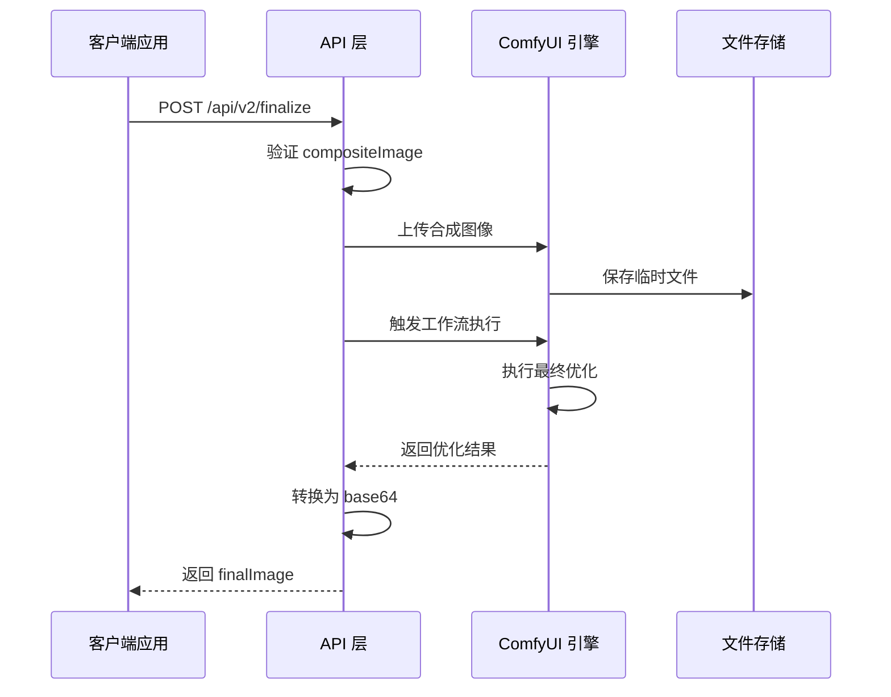
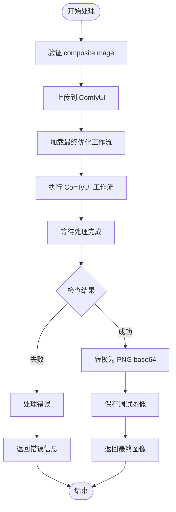
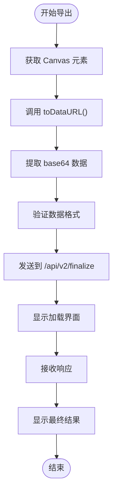
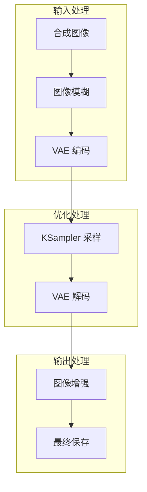
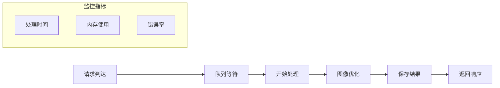
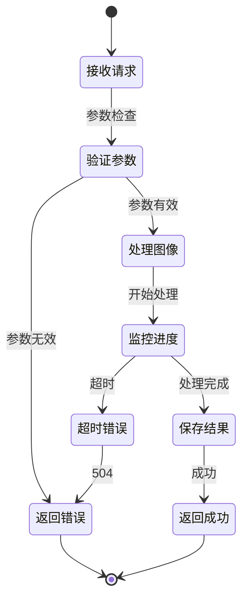

# 最终渲染接口

<cite>
**本文档引用的文件**
- [backend/main.py](file://backend/main.py)
- [backend/comfyui_finalize_workflow.json](file://backend/comfyui_finalize_workflow.json)
- [src/utils/api.ts](file://src/utils/api.ts)
- [src/screens/FinalizingScreen.tsx](file://src/screens/FinalizingScreen.tsx)
- [src/components/ImageCanvas.tsx](file://src/components/ImageCanvas.tsx)
- [src/utils/canvas.ts](file://src/utils/canvas.ts)
- [src/screens/ResultSheet.tsx](file://src/screens/ResultSheet.tsx)
- [docs/api-v2.md](file://docs/api-v2.md)
</cite>

## 目录
1. [简介](#简介)
2. [接口概述](#接口概述)
3. [请求参数](#请求参数)
4. [响应数据](#响应数据)
5. [调用流程](#调用流程)
6. [Canvas 导出方法](#canvas-导出方法)
7. [最终效果优化过程](#最终效果优化过程)
8. [性能特征](#性能特征)
9. [质量保证措施](#质量保证措施)
10. [使用示例](#使用示例)
11. [集成指南](#集成指南)
12. [故障排除](#故障排除)
13. [结论](#结论)

## 简介

最终渲染接口 `/api/v2/finalize` 是 WallChanger 应用程序中用户点击「一键焕色」后的最终处理步骤。该接口接收所有区域换材质后的合成图 `compositeImage`，通过 ComfyUI 工作流进行最终的洗稿优化，返回高质量的最终渲染结果 `finalImage`。

## 接口概述

### 基本信息
- **HTTP 方法**: POST
- **接口路径**: `/api/v2/finalize`
- **内容类型**: application/json
- **功能**: 对合成后的图像进行最终优化处理

### 输入参数

| 参数名 | 类型 | 必填 | 默认值 | 说明 |
|--------|------|------|--------|------|
| `compositeImage` | string | 是 | - | 合成后的图像 base64 编码（PNG 格式） |
| `promptFinalize` | string | 否 | `"realistic render"` | 最终优化阶段的提示词 |

### 输出参数

| 参数名 | 类型 | 说明 |
|--------|------|------|
| `finalImage` | string | 最终优化后的图像 base64 编码（PNG 格式） |

## 请求参数

### 数据格式要求

1. **图片编码**: 所有图片字段必须为 raw base64 字符串，不包含 `data:image/...;base64,` 前缀
2. **图像格式**: PNG 格式，确保支持透明度通道
3. **尺寸要求**: 图像尺寸应符合 ComfyUI 工作流的要求

### 参数验证

接口会对请求参数进行严格验证：
- `compositeImage`: 必须为有效的 base64 编码
- `promptFinalize`: 可选参数，默认使用预设的提示词

## 响应数据

### 成功响应

当请求成功时，接口返回包含以下字段的对象：

```json
{
  "finalImage": "iVBORw0KGgoAAAANSUhEUgAA..."
}
```

### 错误响应

接口可能返回以下错误状态码：

| 状态码 | 原因 | 描述 |
|--------|------|------|
| 400 | 请求参数错误 | `compositeImage` 为空或格式无效 |
| 500 | ComfyUI 推理失败 | 模型推理过程中发生错误 |
| 504 | ComfyUI 超时 | 等待 ComfyUI 响应超时（默认 10 分钟） |

## 调用流程

### 客户端调用流程



**图表来源**
- [backend/main.py:1120-1132](file://backend/main.py#L1120-L1132)
- [backend/main.py:916-966](file://backend/main.py#L916-L966)

### 服务端处理流程



**图表来源**
- [backend/main.py:1120-1132](file://backend/main.py#L1120-L1132)
- [backend/main.py:916-966](file://backend/main.py#L916-L966)

## Canvas 导出方法

### 前端导出流程



**图表来源**
- [src/components/ImageCanvas.tsx:25-31](file://src/components/ImageCanvas.tsx#L25-L31)
- [src/utils/api.ts:156-169](file://src/utils/api.ts#L156-L169)

### 导出实现细节

前端提供了多种导出方式：

1. **Canvas 导出**: 使用 `toDataURL('image/png')` 方法
2. **Base64 转换**: 移除 `data:image/png;base64,` 前缀
3. **错误处理**: 对空画布和导出失败进行处理

### 导出代码示例

```typescript
// 获取 Canvas 引用
const canvasRef = useRef<HTMLCanvasElement>(null);

// 导出为 base64
const exportBase64 = useCallback(() => {
  if (!canvasRef.current) return null;
  return canvasRef.current.toDataURL('image/png').split(',')[1];
}, []);

// 使用导出的图像调用 finalize 接口
const compositeBase64 = exportBase64();
if (compositeBase64) {
  finalizeV2(compositeBase64);
}
```

**章节来源**
- [src/components/ImageCanvas.tsx:25-31](file://src/components/ImageCanvas.tsx#L25-L31)
- [src/utils/api.ts:156-169](file://src/utils/api.ts#L156-L169)

## 最终效果优化过程

### ComfyUI 工作流配置

最终渲染使用专门的优化工作流，包含以下关键节点：

1. **图像模糊节点**: 对输入图像进行轻微模糊处理
2. **VAE 编码解码**: 将图像转换到潜在空间进行处理
3. **采样器**: 使用 KSampler 进行图像生成
4. **保存节点**: 保存最终结果

### 优化策略



**图表来源**
- [backend/comfyui_finalize_workflow.json:1-217](file://backend/comfyui_finalize_workflow.json#L1-L217)

### 关键参数设置

- **模糊半径**: 4 像素
- **采样步数**: 2 步
- **CFG 比例**: 1
- **采样器**: euler
- **调度器**: simple

## 性能特征

### 响应时间预期

- **单次处理时间**: 20-40 秒
- **超时限制**: 10 分钟（600 秒）
- **并发限制**: 同一时间只能处理一个请求

### 性能优化措施

1. **图像尺寸优化**: 自动调整到合适的分辨率
2. **内存管理**: 及时释放中间图像资源
3. **缓存机制**: 调试图像自动保存到本地
4. **异步处理**: 支持非阻塞的请求处理

### 性能监控



## 质量保证措施

### 多层质量控制

1. **输入验证**: 严格的参数格式检查
2. **图像完整性**: 确保 base64 数据有效
3. **ComfyUI 状态监控**: 实时跟踪处理进度
4. **错误恢复**: 自动重试和降级处理

### 质量保障流程



**图表来源**
- [backend/main.py:916-966](file://backend/main.py#L916-L966)

## 使用示例

### 基本使用流程

```javascript
// 1. 从 Canvas 导出合成图像
const canvas = document.getElementById('myCanvas');
const compositeBase64 = canvas.toDataURL('image/png').split(',')[1];

// 2. 调用最终渲染接口
const response = await fetch('/api/v2/finalize', {
  method: 'POST',
  headers: {
    'Content-Type': 'application/json',
  },
  body: JSON.stringify({
    compositeImage: compositeBase64,
    promptFinalize: 'realistic render, high detail'
  })
});

// 3. 处理响应
const result = await response.json();
const finalImage = result.finalImage;

// 4. 显示最终结果
document.getElementById('result').src = `data:image/png;base64,${finalImage}`;
```

### 完整的前端集成示例

```typescript
// 在 React 组件中使用
import { useStore } from '../store';
import { finalizeV2 } from '../utils/api';

function FinalizeButton() {
  const { compositeImage, setFinalImage, setPhase } = useStore();

  const handleFinalize = async () => {
    if (!compositeImage) return;

    try {
      setPhase('finalizing');
      
      const result = await finalizeV2(compositeImage);
      setFinalImage(result.finalImage);
      setPhase('done');
    } catch (error) {
      console.error('最终渲染失败:', error);
      setPhase('editing');
    }
  };

  return (
    <button onClick={handleFinalize}>
      一键焕色
    </button>
  );
}
```

**章节来源**
- [src/utils/api.ts:156-169](file://src/utils/api.ts#L156-L169)
- [src/screens/FinalizingScreen.tsx:18-58](file://src/screens/FinalizingScreen.tsx#L18-L58)

## 集成指南

### 后端集成步骤

1. **环境配置**: 设置 ComfyUI 主机地址
2. **依赖安装**: 安装 Python 依赖包
3. **启动服务**: 启动 FastAPI 应用程序

### 前端集成步骤

1. **API 调用封装**: 使用提供的 API 工具函数
2. **错误处理**: 实现完善的错误处理机制
3. **用户体验**: 添加加载状态和进度指示

### 配置选项

| 配置项 | 默认值 | 说明 |
|--------|--------|------|
| `COMFYUI_HOST` | `http://127.0.0.1:8188` | ComfyUI 服务地址 |
| `MATERIALS_PATH` | `../public/materials` | 材质图片存储路径 |
| `SAM3_API` | `https://sh-llm-api.tinttex.cn:8443/sam3/segment` | SAM3 分割 API 地址 |

## 故障排除

### 常见问题及解决方案

#### 1. ComfyUI 连接失败
- **症状**: HTTP 504 超时错误
- **原因**: ComfyUI 服务不可达或处理超时
- **解决方案**: 检查 ComfyUI 服务状态，增加超时时间

#### 2. 图像处理失败
- **症状**: HTTP 500 内部错误
- **原因**: base64 数据格式错误或图像损坏
- **解决方案**: 验证输入图像格式，重新生成 base64

#### 3. 内存不足
- **症状**: 处理过程中断
- **原因**: 图像尺寸过大或内存泄漏
- **解决方案**: 优化图像尺寸，清理临时文件

### 调试信息

接口会在调试目录保存中间结果：
- `v2_final.png`: 最终优化结果
- `v2_render_all_composite.png`: 合成过程图像
- `v2_split_mask.png`: 分割操作结果

**章节来源**
- [backend/main.py:916-966](file://backend/main.py#L916-L966)

## 结论

最终渲染接口 `/api/v2/finalize` 为 WallChanger 应用提供了高质量的图像优化能力。通过精心设计的工作流和严格的错误处理机制，确保了最终渲染结果的质量和稳定性。配合前端的 Canvas 导出功能，用户可以轻松实现从合成到最终渲染的完整流程。

该接口的设计充分考虑了性能和用户体验，在保证质量的同时提供了良好的响应时间。通过合理的错误处理和调试支持，开发者可以快速定位和解决问题，确保系统的稳定运行。