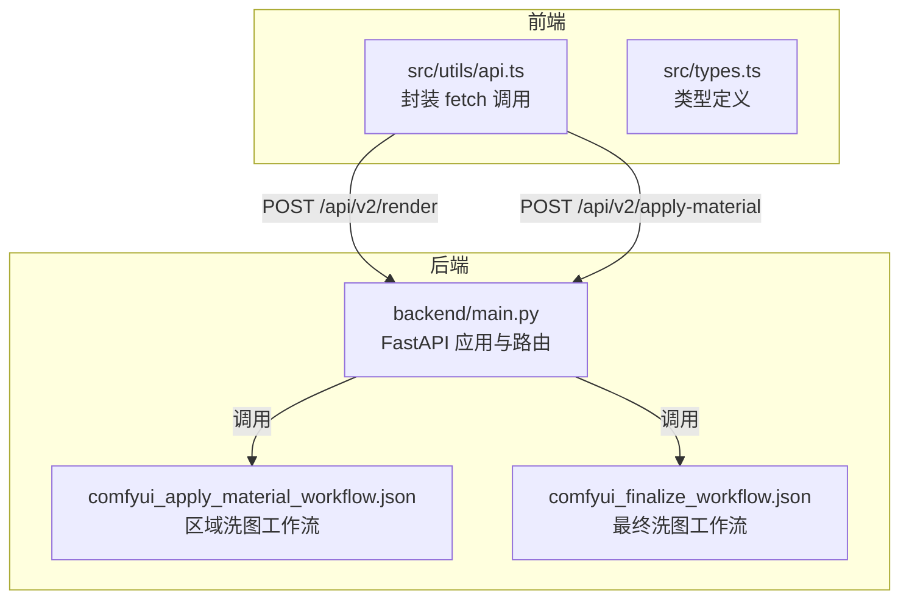
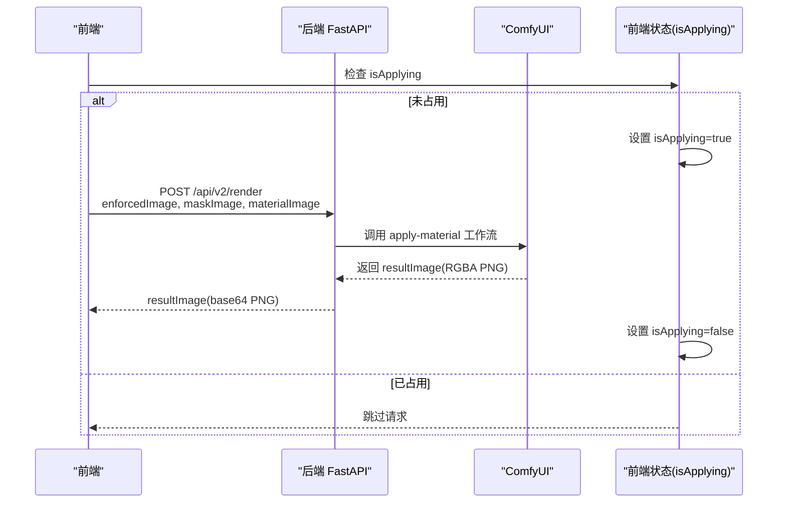
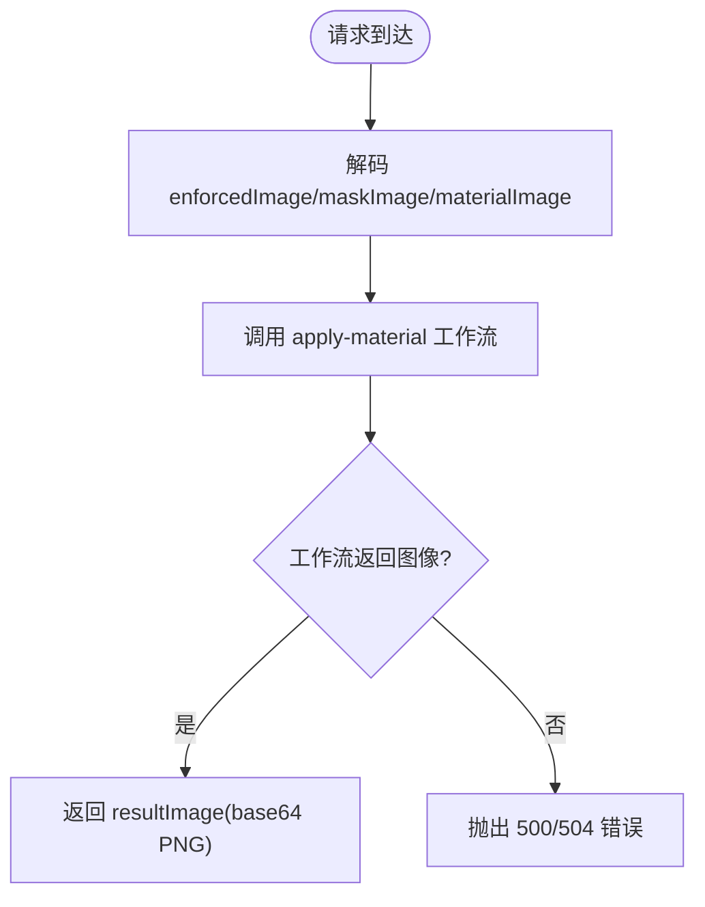
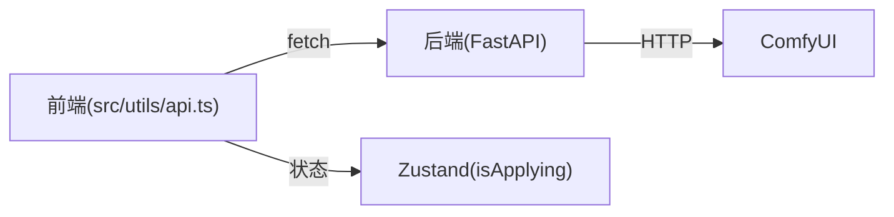

# 渲染接口

<cite>
**本文引用的文件**
- [backend/main.py](file://backend/main.py)
- [backend/comfyui_apply_material_workflow.json](file://backend/comfyui_apply_material_workflow.json)
- [backend/comfyui_finalize_workflow.json](file://backend/comfyui_finalize_workflow.json)
- [src/utils/api.ts](file://src/utils/api.ts)
- [src/types.ts](file://src/types.ts)
- [docs/api-v2.md](file://docs/api-v2.md)
- [docs/frontend-api-guide.md](file://docs/frontend-api-guide.md)
</cite>

## 目录
1. [简介](#简介)
2. [项目结构](#项目结构)
3. [核心组件](#核心组件)
4. [架构总览](#架构总览)
5. [详细组件分析](#详细组件分析)
6. [依赖分析](#依赖分析)
7. [性能考虑](#性能考虑)
8. [故障排查指南](#故障排查指南)
9. [结论](#结论)
10. [附录](#附录)

## 简介
本文档聚焦于 /api/v2/render 与 /api/v2/apply-material 两个功能相同的接口，详细说明它们如何将材质球应用到指定墙面区域。内容涵盖：
- 三个必需参数 enforcedImage、maskImage、materialImage 的格式要求
- 响应结果 resultImage（带 alpha 通道的 RGBA PNG）的合成方式与前端绘制方法
- 同步调用限制（isApplying 互斥锁）、ComfyUI 超时处理与错误状态码
- 完整的调用示例与性能优化建议

## 项目结构
后端采用 FastAPI 提供 REST 接口，前端通过 fetch 调用接口并与 Canvas 进行合成渲染。关键文件与职责如下：
- 后端主程序：提供 /api/v2/render 与 /api/v2/apply-material（二者路由指向同一处理函数）
- ComfyUI 工作流：区域洗图（apply-material）与最终洗图（finalize）
- 前端 API 封装：统一的 fetch 函数与类型定义
- 文档：接口规范与前端对接指南



图表来源
- [backend/main.py](file://backend/main.py)
- [src/utils/api.ts](file://src/utils/api.ts)
- [backend/comfyui_apply_material_workflow.json](file://backend/comfyui_apply_material_workflow.json)
- [backend/comfyui_finalize_workflow.json](file://backend/comfyui_finalize_workflow.json)

章节来源
- [backend/main.py](file://backend/main.py)
- [src/utils/api.ts](file://src/utils/api.ts)
- [src/types.ts](file://src/types.ts)

## 核心组件
- 后端路由与处理逻辑
  - /api/v2/render 与 /api/v2/apply-material：功能相同，均调用 call_comfyui_apply_material，返回带 alpha 通道的 RGBA PNG
  - /api/v2/finalize：对合成图进行最终洗图优化
- ComfyUI 工作流
  - apply-material：将 enforcedImage、maskImage、materialImage 输入，输出带 alpha 的区域结果图
  - finalize：对合成图进行最终优化
- 前端 API 封装
  - 提供 renderRegion、finalizeV2 等方法，统一错误处理与超时策略
  - 前端状态管理中包含 isApplying 互斥锁，防止并发调用

章节来源
- [backend/main.py](file://backend/main.py)
- [backend/comfyui_apply_material_workflow.json](file://backend/comfyui_apply_material_workflow.json)
- [backend/comfyui_finalize_workflow.json](file://backend/comfyui_finalize_workflow.json)
- [src/utils/api.ts](file://src/utils/api.ts)
- [src/types.ts](file://src/types.ts)

## 架构总览
渲染管线分为“区域洗图”和“最终洗图”两步。后端在 /api/v2/render 中直接返回带 alpha 的结果图层，前端可直接叠加到 Canvas；若走批量渲染，则由后端完成多区域合成与最终洗图，返回完整效果图。



图表来源
- [backend/main.py](file://backend/main.py)
- [src/utils/api.ts](file://src/utils/api.ts)
- [src/types.ts](file://src/types.ts)

## 详细组件分析

### 接口定义与参数说明
- 接口路径
  - /api/v2/render
  - /api/v2/apply-material（功能相同）
- 请求体字段
  - enforcedImage: base64 PNG（增强后的场景图）
  - maskImage: base64 PNG（目标墙面区域的黑白蒙版）
  - materialImage: base64 PNG（材质参考图）
- 响应体字段
  - resultImage: base64 PNG（RGBA，仅目标区域有像素，其余透明）

参数格式要点
- 所有图片字段均为 raw base64（不带 data:image/...;base64, 前缀）
- enforcedImage 与 maskImage 尺寸需匹配（或后端会按需缩放）
- maskImage 为黑白蒙版，白色区域表示目标墙面

章节来源
- [backend/main.py](file://backend/main.py)
- [docs/api-v2.md](file://docs/api-v2.md)

### 后端处理流程
- 解码三张图片：enforcedImage、maskImage、materialImage
- 调用 call_comfyui_apply_material 执行 apply-material 工作流
- 返回 resultImage（带 alpha 通道的 RGBA PNG）



图表来源
- [backend/main.py](file://backend/main.py)
- [backend/comfyui_apply_material_workflow.json](file://backend/comfyui_apply_material_workflow.json)

章节来源
- [backend/main.py](file://backend/main.py)
- [backend/comfyui_apply_material_workflow.json](file://backend/comfyui_apply_material_workflow.json)

### 响应结果合成与前端绘制
- resultImage 为 RGBA PNG，alpha 通道用于精确合成
- 前端可直接将 resultImage 作为图层绘制到 Canvas 上，无需额外裁剪
- 建议使用 canvas.toDataURL('image/png') 导出合成图，确保保留 alpha

```mermaid
sequenceDiagram
participant API as "后端 /api/v2/render"
participant Front as "前端"
participant Canvas as "Canvas"
API-->>Front : resultImage(base64 PNG)
Front->>Canvas : new Image()<br/>设置 src=data : image/png;base64,...
Canvas-->>Front : drawImage(图层, 0, 0)
Note over Front,Canvas : 多个区域依次叠加，形成最终合成图
```

图表来源
- [docs/frontend-api-guide.md](file://docs/frontend-api-guide.md)
- [src/utils/api.ts](file://src/utils/api.ts)

章节来源
- [docs/frontend-api-guide.md](file://docs/frontend-api-guide.md)
- [src/utils/api.ts](file://src/utils/api.ts)

### 同步调用限制与互斥锁
- 后端 /api/v2/render 为同步接口：ComfyUI 同一时刻只能处理一个任务
- 前端通过 isApplying 互斥锁避免并发请求
- 建议串行处理多面墙渲染，或在批量渲染场景下使用 /api/v2/render-all

章节来源
- [docs/frontend-api-guide.md](file://docs/frontend-api-guide.md)
- [src/types.ts](file://src/types.ts)

### ComfyUI 超时处理与错误状态码
- 超时时间：默认 600 秒（10 分钟）
- 可能的错误状态码
  - 504：ComfyUI 处理超时
  - 500：工作流未返回图像或内部错误
  - 422：参数校验失败（如分割线无效）
- 前端应捕获并提示用户重试或检查网络

章节来源
- [backend/main.py](file://backend/main.py)
- [docs/frontend-api-guide.md](file://docs/frontend-api-guide.md)

### 与 /api/v2/render-all 的关系
- /api/v2/render 适用于逐区域渲染（串行），便于预览
- /api/v2/render-all 一次性完成多区域渲染、合成与最终洗图，适合“一键焕色”
- 两者均基于相同的 apply-material 与 finalize 工作流

章节来源
- [backend/main.py](file://backend/main.py)
- [docs/api-v2.md](file://docs/api-v2.md)

## 依赖分析
- 后端依赖
  - FastAPI：提供路由与请求/响应模型
  - ComfyUI：执行图像生成与合成
  - httpx：异步 HTTP 客户端
- 前端依赖
  - fetch：调用后端接口
  - Zustand：状态管理（isApplying 互斥锁）
  - Canvas：图像合成



图表来源
- [src/utils/api.ts](file://src/utils/api.ts)
- [backend/main.py](file://backend/main.py)
- [src/types.ts](file://src/types.ts)

章节来源
- [src/utils/api.ts](file://src/utils/api.ts)
- [backend/main.py](file://backend/main.py)
- [src/types.ts](file://src/types.ts)

## 性能考虑
- 单次渲染耗时：约 20-40 秒
- 预处理耗时：约 2-3 分钟
- 最终洗图耗时：约 20-40 秒
- 建议
  - 使用 /api/v2/render-all 进行批量渲染，减少往返次数
  - 控制并发，避免触发后端同步限制
  - 使用 PNG 导出合成图，保留 alpha 通道
  - 合理设置 ComfyUI 资源，避免显存不足导致超时

章节来源
- [docs/frontend-api-guide.md](file://docs/frontend-api-guide.md)
- [docs/api-v2.md](file://docs/api-v2.md)

## 故障排查指南
- 504 超时
  - 检查 ComfyUI 是否正常运行
  - 确保 GPU 资源充足，避免长时间排队
- 500 错误
  - 检查 enforcedImage、maskImage、materialImage 是否为有效 PNG
  - 确认 maskImage 为黑白蒙版且目标区域为白色
- 422 参数校验失败
  - 确认 base64 字符串不含 data URI 前缀
  - 检查坐标与蒙版匹配关系
- 前端并发问题
  - 使用 isApplying 互斥锁，避免同时发起多个 /api/v2/render 请求

章节来源
- [docs/frontend-api-guide.md](file://docs/frontend-api-guide.md)
- [backend/main.py](file://backend/main.py)

## 结论
/api/v2/render 与 /api/v2/apply-material 提供了将材质球应用到指定墙面区域的核心能力。通过严格的参数格式、互斥锁控制与超时处理，配合前端 Canvas 合成，可实现高质量的墙面材质替换效果。建议在批量场景下优先使用 /api/v2/render-all，在需要逐区域预览时使用 /api/v2/render，并始终遵循同步调用与 PNG 导出的最佳实践。

## 附录
- 接口调用示例（后端）
  - [backend/main.py](file://backend/main.py)
- 前端调用封装
  - [src/utils/api.ts](file://src/utils/api.ts)
- 类型定义
  - [src/types.ts](file://src/types.ts)
- 接口规范与前端对接指南
  - [docs/api-v2.md](file://docs/api-v2.md)
  - [docs/frontend-api-guide.md](file://docs/frontend-api-guide.md)