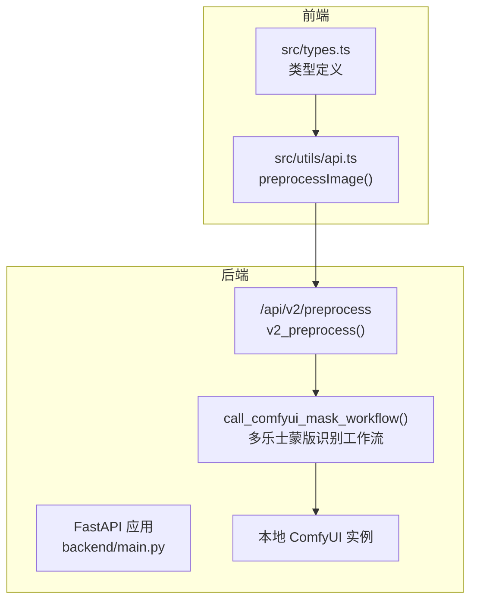
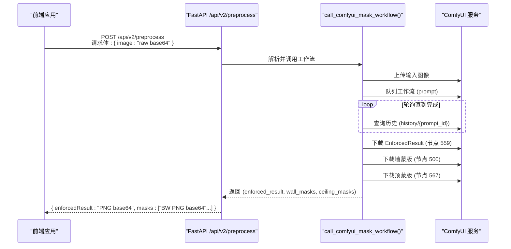
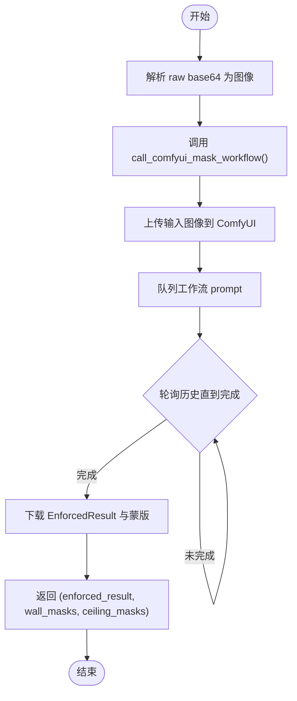
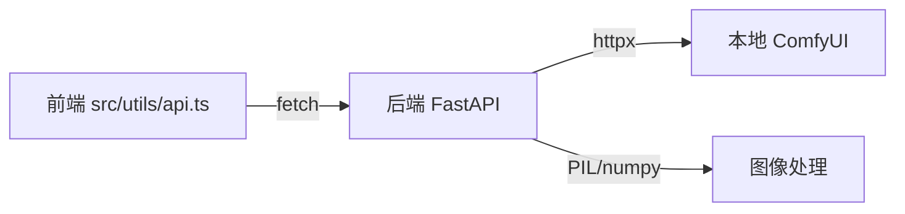

# 预处理接口

<cite>
**本文引用的文件**
- [backend/main.py](file://backend/main.py)
- [backend/comfyui_mask_workflow.json](file://backend/comfyui_mask_workflow.json)
- [docs/frontend-api-guide.md](file://docs/frontend-api-guide.md)
- [src/utils/api.ts](file://src/utils/api.ts)
- [src/types.ts](file://src/types.ts)
</cite>

## 目录
1. [简介](#简介)
2. [项目结构](#项目结构)
3. [核心组件](#核心组件)
4. [架构总览](#架构总览)
5. [详细组件分析](#详细组件分析)
6. [依赖分析](#依赖分析)
7. [性能考虑](#性能考虑)
8. [故障排查指南](#故障排查指南)
9. [结论](#结论)
10. [附录](#附录)

## 简介
本文件为 /api/v2/preprocess 预处理接口的权威技术文档。该接口是图像处理流程的第一步，负责调用 ComfyUI 中“多乐士蒙版识别”工作流，完成以下任务：
- 接收原始图像（base64，不含数据 URI 前缀）
- 执行增强、清理、平坦化与墙面/天花板分割
- 返回“强制增强图”（enforcedResult）与一组黑白蒙版图（masks）

响应中的 enforcedResult 可直接用于后续渲染流程；masks 数组中的每个元素都是一个 base64 PNG 黑白蒙版，白色区域代表对应墙面或天花板区域。

## 项目结构
后端采用 FastAPI 提供 REST API，核心逻辑集中在 backend/main.py 中，图像处理通过调用本地 ComfyUI 实例完成。前端通过 src/utils/api.ts 调用该接口。

**图表来源**
- [backend/main.py:1066-1092](file://backend/main.py#L1066-L1092)
- [backend/main.py:975-1063](file://backend/main.py#L975-L1063)
- [src/utils/api.ts:21-37](file://src/utils/api.ts#L21-L37)

**章节来源**
- [backend/main.py:1066-1092](file://backend/main.py#L1066-L1092)
- [src/utils/api.ts:21-37](file://src/utils/api.ts#L21-L37)

## 核心组件
- 预处理请求模型 PreprocessRequest：仅包含 image 字段（raw base64）。
- 预处理端点 v2_preprocess：接收图像，调用 call_comfyui_mask_workflow，返回 enforcedResult 与 masks。
- 工作流调用函数 call_comfyui_mask_workflow：读取 comfyui_mask_workflow.json，上传输入图像，队列工作流，轮询结果，下载 EnforcedResult 与墙/顶蒙版。
- ComfyUI 工作流文件 comfyui_mask_workflow.json：定义多节点处理链路，包括图像缩放、增强、清理、分割与保存节点。

**章节来源**
- [backend/main.py:778-784](file://backend/main.py#L778-L784)
- [backend/main.py:1066-1092](file://backend/main.py#L1066-L1092)
- [backend/main.py:975-1063](file://backend/main.py#L975-L1063)
- [backend/comfyui_mask_workflow.json:1-800](file://backend/comfyui_mask_workflow.json#L1-L800)

## 架构总览
预处理接口的端到端调用序列如下：

**图表来源**
- [backend/main.py:1066-1092](file://backend/main.py#L1066-L1092)
- [backend/main.py:975-1063](file://backend/main.py#L975-L1063)
- [backend/comfyui_mask_workflow.json:1-800](file://backend/comfyui_mask_workflow.json#L1-L800)

## 详细组件分析

### 接口定义与行为
- 方法与路径：POST /api/v2/preprocess
- 输入：PreprocessRequest
  - image: string（raw base64，不含 data:image/...;base64, 前缀）
- 输出：对象
  - enforcedResult: string（PNG base64，强制增强图）
  - masks: string[]（每个元素为 PNG base64 黑白蒙版，白色为目标区域）

前端调用封装位于 src/utils/api.ts 的 preprocessImage()，其返回 Promise<{ enforcedResult: string; masks: string[] }>。

**章节来源**
- [backend/main.py:778-784](file://backend/main.py#L778-L784)
- [backend/main.py:1066-1092](file://backend/main.py#L1066-L1092)
- [src/utils/api.ts:21-37](file://src/utils/api.ts#L21-L37)

### 请求参数与响应结构
- 请求参数
  - image: 原始图像的 raw base64 字符串（不带数据 URI 前缀）
- 响应字段
  - enforcedResult: base64 PNG（强制增强后的场景图）
  - masks: base64 PNG 黑白蒙版数组（每个元素对应一个墙面或天花板区域）

前端类型定义中，masks 为 string[]，每个元素为 base64 PNG；enforcedResult 为 base64 PNG。

**章节来源**
- [docs/frontend-api-guide.md:265-308](file://docs/frontend-api-guide.md#L265-L308)
- [src/types.ts:64-65](file://src/types.ts#L64-L65)
- [src/utils/api.ts:21-37](file://src/utils/api.ts#L21-L37)

### 调用流程与内部实现
- v2_preprocess
  - 将 raw base64 解码为 PIL Image
  - 调用 call_comfyui_mask_workflow 获取 (enforced_result, wall_masks, ceiling_masks)
  - 将 enforced_result 与 masks 转换为 base64 PNG 并返回
- call_comfyui_mask_workflow
  - 读取 comfyui_mask_workflow.json 作为工作流模板
  - 上传输入图像至 ComfyUI
  - 队列工作流并轮询历史，直至完成
  - 下载节点 559（EnforcedResult）、500（墙蒙版）、567（顶蒙版）输出
  - 返回三元组

**图表来源**
- [backend/main.py:1066-1092](file://backend/main.py#L1066-L1092)
- [backend/main.py:975-1063](file://backend/main.py#L975-L1063)

**章节来源**
- [backend/main.py:1066-1092](file://backend/main.py#L1066-L1092)
- [backend/main.py:975-1063](file://backend/main.py#L975-L1063)

### ComfyUI 工作流要点
- 工作流文件：backend/comfyui_mask_workflow.json
- 关键节点
  - 节点 559：保存 EnforcedResult（JPG）
  - 节点 500：保存墙蒙版（批量）
  - 节点 567：保存顶蒙版（批量）
- 节点 72：LoadImage 节点，运行前会动态注入上传后的文件名

**章节来源**
- [backend/comfyui_mask_workflow.json:1-800](file://backend/comfyui_mask_workflow.json#L1-L800)
- [backend/main.py:975-1063](file://backend/main.py#L975-L1063)

### 前端使用注意事项
- 图像格式：所有 base64 字段必须为 raw base64，不要带 data:image/...;base64, 前缀
- 超时与耗时：单次生图约 20-40 秒，预处理包含多次生图，总耗时约 2-3 分钟
- 坐标与范围：后续渲染阶段的坐标需在 enforcedResult 图片范围内
- 错误处理：前端已封装错误日志与状态码判断，建议在 UI 层显示“处理中”与错误提示

**章节来源**
- [docs/frontend-api-guide.md:268-275](file://docs/frontend-api-guide.md#L268-L275)
- [docs/frontend-api-guide.md:289-296](file://docs/frontend-api-guide.md#L289-L296)
- [src/utils/api.ts:21-37](file://src/utils/api.ts#L21-L37)

## 依赖分析
- 后端依赖
  - FastAPI：路由与请求/响应模型
  - httpx：异步 HTTP 客户端，调用本地 ComfyUI
  - PIL：图像编解码与尺寸处理
  - numpy：图像数组处理（辅助工具函数）
- 前端依赖
  - fetch：HTTP 请求
  - 类型定义：确保与后端模型一致

**图表来源**
- [src/utils/api.ts:21-37](file://src/utils/api.ts#L21-L37)
- [backend/main.py:1066-1092](file://backend/main.py#L1066-L1092)

**章节来源**
- [src/utils/api.ts:21-37](file://src/utils/api.ts#L21-L37)
- [backend/main.py:1066-1092](file://backend/main.py#L1066-L1092)

## 性能考虑
- 预处理总耗时约为 2-3 分钟，主要由多次 ComfyUI 生图调用决定
- 单次生图耗时约 20-40 秒，受硬件与模型大小影响
- 建议在前端显示进度条与预计剩余时间，提升用户体验
- 若网络或 ComfyUI 不稳定，可能出现 504 超时；建议增加重试与降级策略

[本节为通用性能讨论，不涉及具体文件分析]

## 故障排查指南
- 504 超时
  - 现象：ComfyUI 未在预期时间内完成工作流
  - 可能原因：模型加载、显存不足、磁盘 IO、网络不稳定
  - 建议：检查 ComfyUI 日志、释放显存、优化图像分辨率、重试请求
- 500 未返回图片
  - 现象：工作流节点未产生输出图像
  - 可能原因：节点配置错误、输入图像为空或损坏、工作流被修改
  - 建议：核对工作流文件、确认节点 ID 与输出名称一致
- 400/422 参数错误
  - 现象：请求体字段缺失或格式不符
  - 建议：确保 image 为 raw base64，且不带数据 URI 前缀
- 前端错误处理
  - 建议：捕获响应状态码与错误信息，向用户反馈“处理失败，请稍后重试”

**章节来源**
- [backend/main.py:1014-1024](file://backend/main.py#L1014-L1024)
- [backend/main.py:1038-1043](file://backend/main.py#L1038-L1043)
- [backend/main.py:1045-1061](file://backend/main.py#L1045-L1061)
- [src/utils/api.ts:29-32](file://src/utils/api.ts#L29-L32)

## 结论
/api/v2/preprocess 接口通过调用“多乐士蒙版识别”ComfyUI 工作流，为后续渲染提供高质量的强制增强图与精确的墙面/天花板蒙版。前端应遵循 raw base64 传输规范与超时处理策略，以获得稳定可靠的用户体验。

[本节为总结性内容，不涉及具体文件分析]

## 附录

### 请求/响应示例
- 请求
  - 方法：POST
  - 路径：/api/v2/preprocess
  - 请求体：{ "image": "<raw base64 字符串>" }
- 响应
  - 成功：{ "enforcedResult": "<PNG base64>", "masks": ["<BW PNG base64>","<BW PNG base64>",...] }
  - 错误：{ "detail": "错误描述" }

**章节来源**
- [docs/frontend-api-guide.md:277-308](file://docs/frontend-api-guide.md#L277-L308)
- [src/utils/api.ts:21-37](file://src/utils/api.ts#L21-L37)

### 最佳实践
- 前端
  - 使用 raw base64，避免数据 URI 前缀
  - 显示加载状态与预计耗时
  - 对 504/500 错误进行重试与用户提示
- 后端
  - 严格校验输入图像尺寸与模式
  - 保留中间产物（调试目录）便于问题定位
  - 控制轮询间隔与超时阈值，平衡稳定性与延迟

**章节来源**
- [docs/frontend-api-guide.md:268-275](file://docs/frontend-api-guide.md#L268-L275)
- [backend/main.py:1077-1084](file://backend/main.py#L1077-L1084)