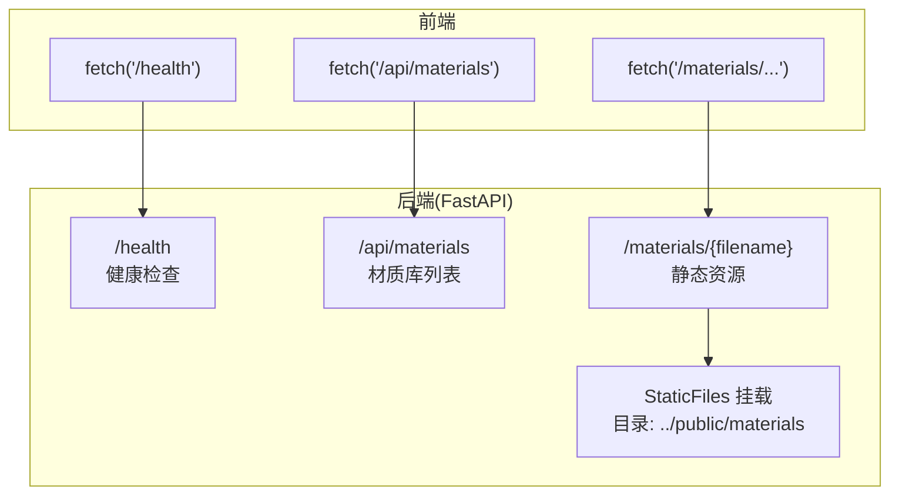
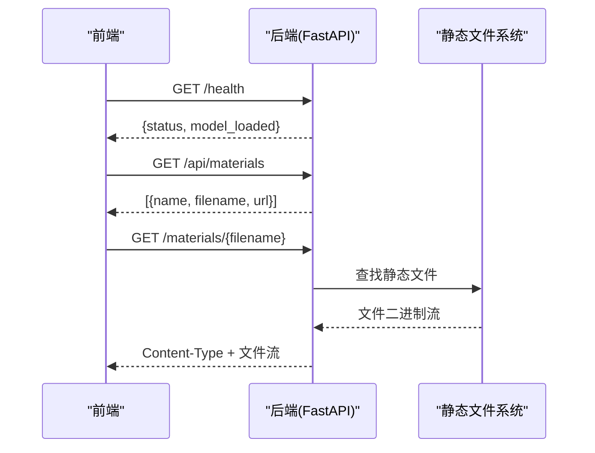
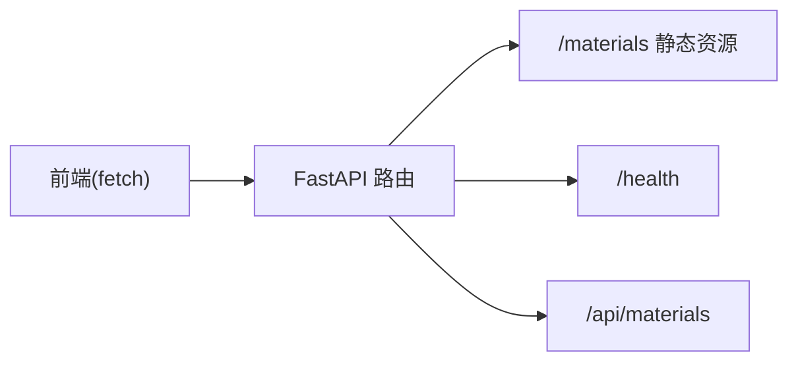

# 基础接口

<cite>
**本文引用的文件**
- [backend/main.py](file://backend/main.py)
- [src/utils/api.ts](file://src/utils/api.ts)
- [docs/api.md](file://docs/api.md)
- [docs/api-v2.md](file://docs/api-v2.md)
- [docs/frontend-api-guide.md](file://docs/frontend-api-guide.md)
- [src/types.ts](file://src/types.ts)
- [README.md](file://README.md)
</cite>

## 目录
1. [简介](#简介)
2. [项目结构](#项目结构)
3. [核心组件](#核心组件)
4. [架构总览](#架构总览)
5. [详细组件分析](#详细组件分析)
6. [依赖分析](#依赖分析)
7. [性能考虑](#性能考虑)
8. [故障排查指南](#故障排查指南)
9. [结论](#结论)
10. [附录](#附录)

## 简介
本文件聚焦于 WallChanger 的基础接口，围绕以下三个核心接口展开：
- 健康检查接口：/health
- 材质库接口：/api/materials
- 材质文件接口：/materials/{filename}

文档将详细说明每个接口的 HTTP 方法、请求参数、响应格式、错误处理、调用示例、返回数据结构说明、常见使用场景、设计目的、使用限制与最佳实践，并提供前端正确调用这些接口的指导。

## 项目结构
后端采用 FastAPI 提供 REST 接口，前端通过 fetch 调用后端接口。基础接口位于后端路由中，静态资源通过 FastAPI 的 StaticFiles 挂载到 /materials 路径，供前端直接访问材质图片。

图表来源
- [backend/main.py:545-42](file://backend/main.py#L545-L42)

章节来源
- [backend/main.py:545-42](file://backend/main.py#L545-L42)
- [docs/frontend-api-guide.md:135-263](file://docs/frontend-api-guide.md#L135-L263)

## 核心组件
- 健康检查接口 /health：用于检测后端服务是否在线，返回状态与模型加载状态。
- 材质库接口 /api/materials：返回服务器上可用的材质列表，包含名称、文件名与相对 URL。
- 材质文件接口 /materials/{filename}：静态资源接口，直接返回材质图片文件。

章节来源
- [backend/main.py:545-561](file://backend/main.py#L545-L561)
- [docs/api.md:61-104](file://docs/api.md#L61-L104)
- [docs/frontend-api-guide.md:135-263](file://docs/frontend-api-guide.md#L135-L263)

## 架构总览
基础接口的调用链路简洁清晰：前端通过 HTTP GET/POST 请求访问后端接口，后端返回 JSON 或静态文件流。/materials 路径下的静态资源由 FastAPI 的 StaticFiles 提供，无需后端业务逻辑参与。

图表来源
- [backend/main.py:545-42](file://backend/main.py#L545-L42)

## 详细组件分析

### 健康检查接口 /health
- 设计目的：快速验证后端服务可用性与模型加载状态，便于前端在启动时进行自检。
- HTTP 方法：GET
- 请求参数：无
- 响应格式：JSON
  - status: 字符串，正常为 "ok"
  - model_loaded: 布尔值，指示 AI 模型是否已加载
- 错误处理：无特殊错误分支，若服务异常将由 HTTP 状态码体现。
- 常见使用场景：
  - 应用启动时调用，确保后端可用后再允许用户操作
  - 定期心跳检测，监控服务稳定性
- 调用示例（前端）
  - fetch(`${API_BASE}/health`).then(r => r.json())
- 最佳实践：
  - 建议在应用初始化阶段调用，若 model_loaded 为 false，提示用户稍后再试
  - 可结合轮询策略实现心跳监控

章节来源
- [backend/main.py:545-547](file://backend/main.py#L545-L547)
- [docs/api.md:61-72](file://docs/api.md#L61-L72)
- [docs/frontend-api-guide.md:135-172](file://docs/frontend-api-guide.md#L135-L172)

### 材质库接口 /api/materials
- 设计目的：提供可用材质列表，前端据此展示材质缩略图与选择材质。
- HTTP 方法：GET
- 请求参数：无
- 响应格式：JSON 数组
  - name: 字符串，材质显示名称
  - filename: 字符串，文件名（含扩展名）
  - url: 字符串，材质图片的相对 URL（用于拼接后端地址）
- 错误处理：无特殊错误分支，若目录不存在或为空，返回空数组。
- 常见使用场景：
  - 初始化时拉取材质列表，渲染材质抽屉
  - 选择材质后，将 url 拼接为完整 URL 用于展示或下载
- 调用示例（前端）
  - fetch(`${API_BASE}/api/materials`).then(r => r.json())
- 最佳实践：
  - 支持的图片格式：.jpg、.jpeg、.png、.webp
  - 返回的 url 为相对路径，前端需拼接后端地址使用
  - 建议缓存材质列表，减少重复请求

章节来源
- [backend/main.py:550-561](file://backend/main.py#L550-L561)
- [docs/api.md:76-104](file://docs/api.md#L76-L104)
- [docs/frontend-api-guide.md:175-224](file://docs/frontend-api-guide.md#L175-L224)

### 材质文件接口 /materials/{filename}
- 设计目的：直接获取材质图片文件，供前端展示缩略图或下载后转换为 base64。
- HTTP 方法：GET
- 请求参数：
  - filename: 路径参数，材质文件名
- 响应格式：二进制流，Content-Type 为对应图片 MIME 类型
- 错误处理：
  - 若文件不存在，HTTP 404
  - 若路径非法，HTTP 404 或 403（取决于 FastAPI 行为）
- 常见使用场景：
  -  标签直接展示缩略图
  - 下载后转换为 base64 传给渲染接口
- 调用示例（前端）
  - 展示缩略图：
  - 下载并转 base64：fetch(`${API_BASE}/materials/${filename}`).then(r => r.blob())
- 最佳实践：
  - 前端应先调用 /api/materials 获取可用列表，再按 filename 访问静态资源
  - 若需在渲染接口中使用，建议先下载再转为 raw base64（不含 data URI 前缀）

章节来源
- [backend/main.py:42](file://backend/main.py#L42)
- [backend/main.py:550-561](file://backend/main.py#L550-L561)
- [docs/api.md:94-104](file://docs/api.md#L94-L104)
- [docs/frontend-api-guide.md:226-263](file://docs/frontend-api-guide.md#L226-L263)

## 依赖分析
- 后端依赖 FastAPI 提供路由与静态文件挂载
- 前端通过 fetch 调用后端接口
- 材质文件存储于 ../public/materials 目录，由 FastAPI 的 StaticFiles 提供服务

图表来源
- [backend/main.py:545-42](file://backend/main.py#L545-L42)

章节来源
- [backend/main.py:545-42](file://backend/main.py#L545-L42)
- [src/utils/api.ts:9-19](file://src/utils/api.ts#L9-L19)

## 性能考虑
- /health 接口为轻量级检查，响应迅速，适合频繁调用
- /api/materials 返回静态列表，建议前端缓存，避免重复请求
- /materials/{filename} 为静态文件传输，性能主要受网络与磁盘 IO 影响
- 前端应在首次加载时缓存材质列表与图片，减少后端压力

## 故障排查指南
- /health 返回非 200：
  - 检查后端进程是否正常运行
  - 确认端口与地址配置正确
- /api/materials 返回空数组：
  - 检查 ../public/materials 目录是否存在且包含支持格式的图片
  - 确认 MATERIALS_PATH 环境变量指向正确路径
- /materials/{filename} 返回 404：
  - 确认 filename 是否存在于材质目录
  - 确认前端拼接的 URL 正确（包含后端地址）
- 前端调用示例（参考）
  - 健康检查：fetch(`${API_BASE}/health`)
  - 材质列表：fetch(`${API_BASE}/api/materials`)
  - 材质图片：fetch(`${API_BASE}/materials/${filename}`)

章节来源
- [docs/frontend-api-guide.md:135-263](file://docs/frontend-api-guide.md#L135-L263)
- [src/utils/api.ts:9-19](file://src/utils/api.ts#L9-L19)

## 结论
基础接口设计简洁明确，职责单一：健康检查用于服务可用性验证，材质库列表用于前端展示与选择，静态资源接口用于直接访问材质文件。前端应遵循统一的调用流程与错误处理策略，确保用户体验稳定流畅。

## 附录
- 前端调用封装参考：src/utils/api.ts 中的 checkHealth 与 getMaterials 函数
- 类型定义参考：src/types.ts 中的 Material 接口
- 项目说明参考：README.md

章节来源
- [src/utils/api.ts:9-19](file://src/utils/api.ts#L9-L19)
- [src/types.ts:8-12](file://src/types.ts#L8-L12)
- [README.md:1-91](file://README.md#L1-L91)