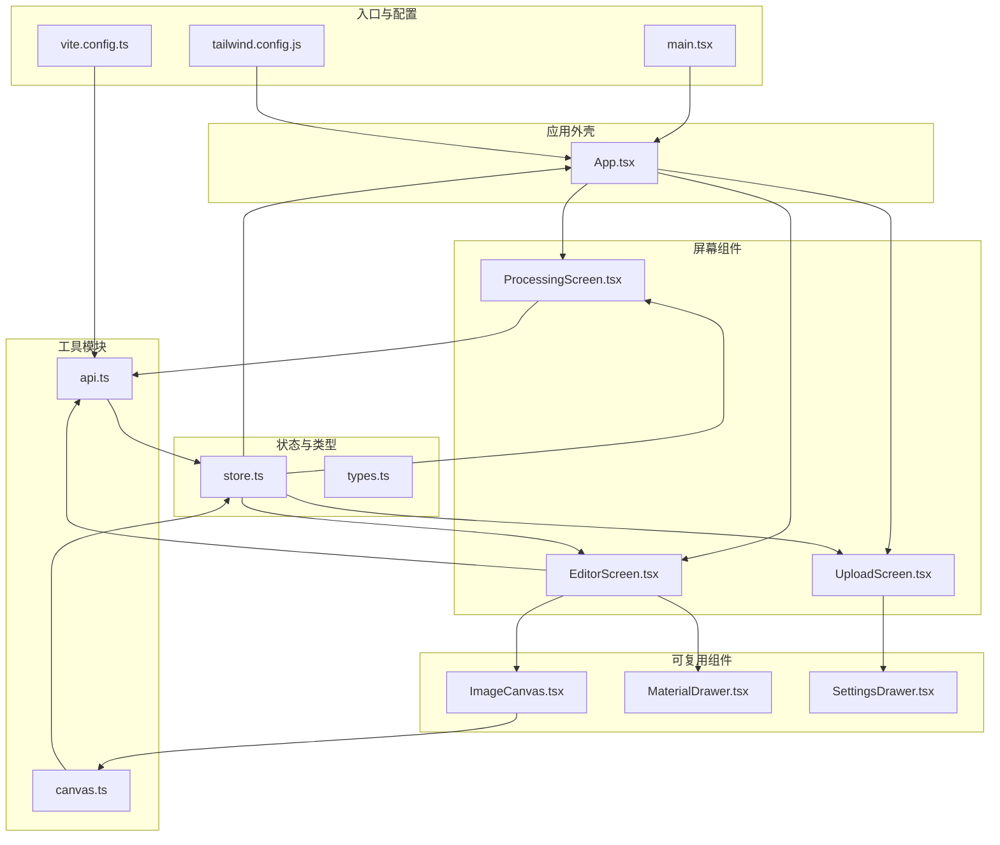
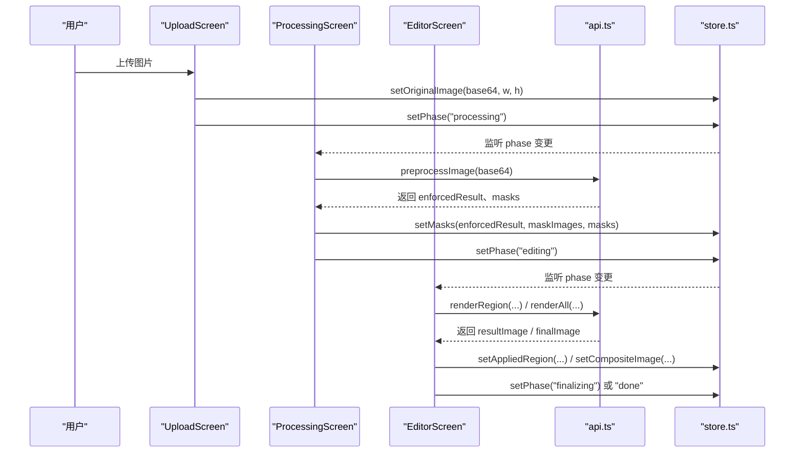
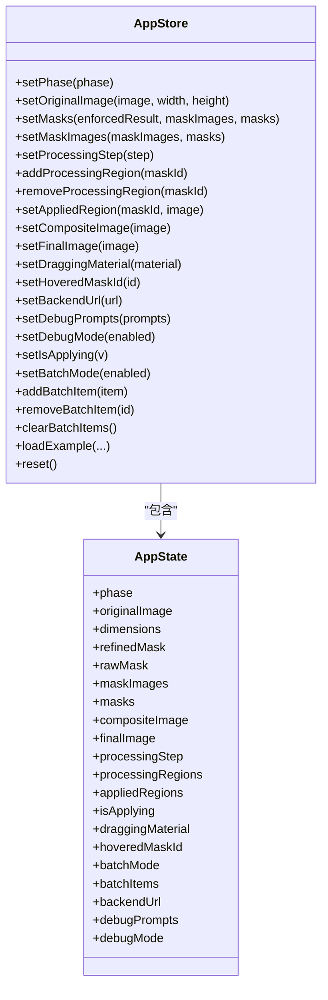
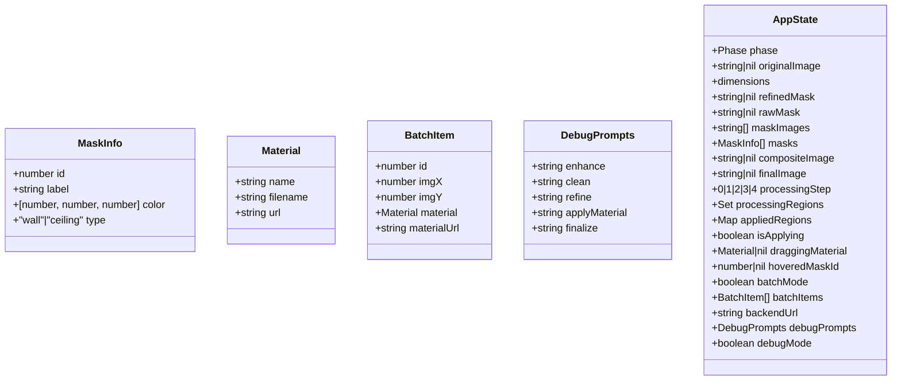
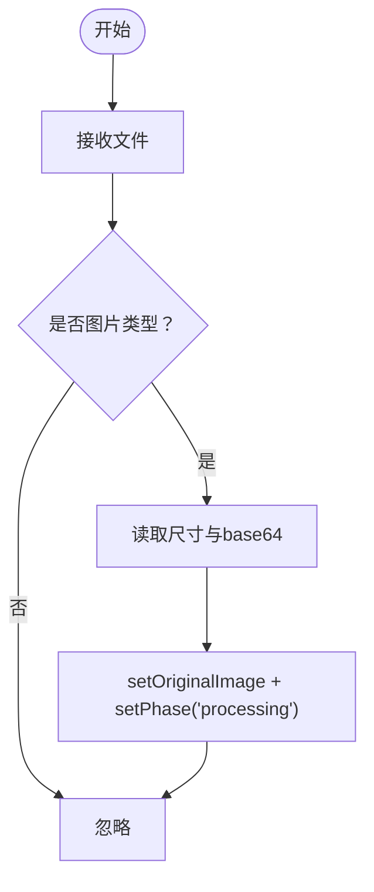
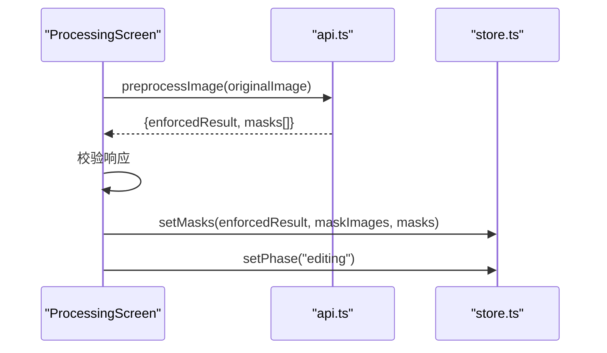
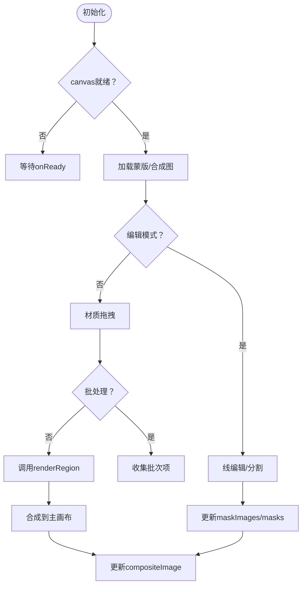
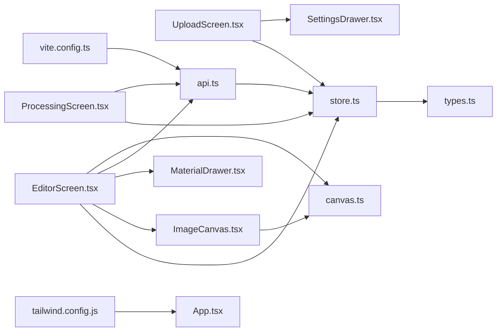

# 前端架构

<cite>
**本文引用的文件**
- [main.tsx](file://src/main.tsx)
- [App.tsx](file://src/App.tsx)
- [store.ts](file://src/store.ts)
- [types.ts](file://src/types.ts)
- [UploadScreen.tsx](file://src/screens/UploadScreen.tsx)
- [ProcessingScreen.tsx](file://src/screens/ProcessingScreen.tsx)
- [EditorScreen.tsx](file://src/screens/EditorScreen.tsx)
- [ImageCanvas.tsx](file://src/components/ImageCanvas.tsx)
- [MaterialDrawer.tsx](file://src/components/MaterialDrawer.tsx)
- [SettingsDrawer.tsx](file://src/components/SettingsDrawer.tsx)
- [api.ts](file://src/utils/api.ts)
- [canvas.ts](file://src/utils/canvas.ts)
- [tailwind.config.js](file://tailwind.config.js)
- [vite.config.ts](file://vite.config.ts)
- [package.json](file://package.json)
</cite>

## 目录
1. [简介](#简介)
2. [项目结构](#项目结构)
3. [核心组件](#核心组件)
4. [架构总览](#架构总览)
5. [详细组件分析](#详细组件分析)
6. [依赖关系分析](#依赖关系分析)
7. [性能考量](#性能考量)
8. [故障排查指南](#故障排查指南)
9. [结论](#结论)
10. [附录](#附录)

## 简介
本文件系统性梳理 WallChanger 前端架构，围绕基于 React + TypeScript + Vite + Tailwind CSS 的现代技术栈展开，重点阐释：
- 页面级组件与可复用 UI 组件的分层设计
- 基于 Zustand 的全局状态管理与持久化策略
- TypeScript 类型体系与 API 响应模型
- 组件间通信模式、路由设计与样式系统实现

## 项目结构
前端采用“屏幕组件 + 可复用组件 + 工具模块”的分层组织方式：
- 屏幕组件：负责流程阶段切换与业务编排（UploadScreen、ProcessingScreen、EditorScreen 等）
- 可复用组件：通用 UI 抽象（MaterialDrawer、SettingsDrawer、ImageCanvas 等）
- 工具模块：API 封装、画布与图像处理逻辑
- 全局状态：Zustand Store 统一管理应用状态与副作用

**图表来源**
- [main.tsx:1-11](file://src/main.tsx#L1-L11)
- [App.tsx:1-26](file://src/App.tsx#L1-L26)
- [store.ts:1-177](file://src/store.ts#L1-L177)
- [types.ts:1-89](file://src/types.ts#L1-L89)
- [UploadScreen.tsx:1-121](file://src/screens/UploadScreen.tsx#L1-L121)
- [ProcessingScreen.tsx:1-135](file://src/screens/ProcessingScreen.tsx#L1-L135)
- [EditorScreen.tsx:1-758](file://src/screens/EditorScreen.tsx#L1-L758)
- [ImageCanvas.tsx:1-91](file://src/components/ImageCanvas.tsx#L1-L91)
- [MaterialDrawer.tsx:1-136](file://src/components/MaterialDrawer.tsx#L1-L136)
- [SettingsDrawer.tsx:1-113](file://src/components/SettingsDrawer.tsx#L1-L113)
- [api.ts:1-200](file://src/utils/api.ts#L1-L200)
- [canvas.ts:1-905](file://src/utils/canvas.ts#L1-L905)
- [vite.config.ts:1-48](file://vite.config.ts#L1-L48)
- [tailwind.config.js:1-12](file://tailwind.config.js#L1-L12)

**章节来源**
- [main.tsx:1-11](file://src/main.tsx#L1-L11)
- [App.tsx:1-26](file://src/App.tsx#L1-L26)
- [vite.config.ts:1-48](file://vite.config.ts#L1-L48)
- [tailwind.config.js:1-12](file://tailwind.config.js#L1-L12)

## 核心组件
- 应用外壳与阶段路由
  - App.tsx 根据全局状态中的 phase 渲染不同屏幕，实现流程驱动的视图切换
- 全局状态管理
  - store.ts 定义 AppState 接口与一组动作函数，封装状态读写、持久化与批量操作
- 类型系统
  - types.ts 提供 MaskInfo、Material、AppState、DebugPrompts、BatchItem 等核心类型与工具函数 toImgSrc

关键要点
- 状态持久化：backendUrl、debugPrompts、debugMode 通过 localStorage 持久化
- 异步状态：processingRegions、appliedRegions、isApplying 用于并发控制与视觉反馈
- 批处理模式：batchMode、batchItems 支持批量渲染管线

**章节来源**
- [App.tsx:8-25](file://src/App.tsx#L8-L25)
- [store.ts:57-88](file://src/store.ts#L57-L88)
- [store.ts:30-38](file://src/store.ts#L30-L38)
- [types.ts:1-89](file://src/types.ts#L1-L89)

## 架构总览
前端采用“状态驱动 + 工具函数 + 组件组合”的架构模式：
- 状态驱动：Zustand Store 驱动屏幕切换与 UI 行为
- 工具函数：api.ts 封装后端交互；canvas.ts 实现蒙版解析、命中检测与动画效果
- 组件组合：屏幕组件编排可复用 UI，完成上传、处理、编辑、收尾与结果展示

**图表来源**
- [UploadScreen.tsx:13-29](file://src/screens/UploadScreen.tsx#L13-L29)
- [ProcessingScreen.tsx:41-90](file://src/screens/ProcessingScreen.tsx#L41-L90)
- [EditorScreen.tsx:276-345](file://src/screens/EditorScreen.tsx#L276-L345)
- [api.ts:21-37](file://src/utils/api.ts#L21-L37)
- [store.ts:68-89](file://src/store.ts#L68-L89)

## 详细组件分析

### Zustand 状态管理（store.ts）
- 设计理念
  - 将全局状态与动作集中在一个文件中，便于追踪状态变更来源
  - 使用局部更新与不可变数据结构（Set、Map）避免不必要的重渲染
- 关键能力
  - 图像与蒙版：setOriginalImage、setMasks、setMaskImages、setCompositeImage、setFinalImage
  - 处理流程：setProcessingStep、add/removeProcessingRegion、setAppliedRegion
  - 交互与调试：setDraggingMaterial、setHoveredMaskId、setDebugPrompts、setDebugMode
  - 批处理：setBatchMode、addBatchItem、removeBatchItem、clearBatchItems
  - 示例与重置：loadExample、reset
  - 持久化：setBackendUrl、setDebugPrompts、setDebugMode 写入 localStorage
- 异步状态处理
  - isApplying 作为互斥锁，确保一次仅执行一个渲染任务
  - processingRegions 与 appliedRegions 用于高亮与合成

**图表来源**
- [store.ts:5-28](file://src/store.ts#L5-L28)
- [store.ts:40-61](file://src/store.ts#L40-L61)
- [types.ts:57-88](file://src/types.ts#L57-L88)

**章节来源**
- [store.ts:63-177](file://src/store.ts#L63-L177)
- [types.ts:57-88](file://src/types.ts#L57-L88)

### TypeScript 类型体系（types.ts）
- 核心类型
  - MaskInfo：蒙版标识、标签、颜色与类型（墙/顶棚）
  - Material：材质名称、文件名与 URL
  - AppState：应用全局状态
  - DebugPrompts：调试提示词集合
  - BatchItem：批处理项（含材质与坐标）
- 工具函数
  - toImgSrc：统一处理 URL 与 base64，适配 img.src

**图表来源**
- [types.ts:1-89](file://src/types.ts#L1-L89)

**章节来源**
- [types.ts:1-89](file://src/types.ts#L1-L89)

### 屏幕组件：UploadScreen（上传）
- 功能职责
  - 文件拖拽/选择、预览尺寸读取、base64 转换
  - 触发 preprocessing 流程，自动进入 processing 阶段
  - 调出设置抽屉与示例抽屉
- 交互细节
  - 拖拽高亮、错误过滤、异步清理对象 URL

**图表来源**
- [UploadScreen.tsx:13-29](file://src/screens/UploadScreen.tsx#L13-L29)
- [store.ts:68-76](file://src/store.ts#L68-L76)

**章节来源**
- [UploadScreen.tsx:6-121](file://src/screens/UploadScreen.tsx#L6-L121)
- [store.ts:68-76](file://src/store.ts#L68-L76)

### 屏幕组件：ProcessingScreen（处理）
- 功能职责
  - 调用后端 preprocess 接口，生成 enforcedResult 与 masks
  - 为每个蒙版分配唯一颜色，构建 MaskInfo 列表
  - 设置状态并跳转到 editing 阶段
- 错误处理
  - 对响应进行校验，捕获异常并提示用户返回上传

**图表来源**
- [ProcessingScreen.tsx:41-90](file://src/screens/ProcessingScreen.tsx#L41-L90)
- [api.ts:21-37](file://src/utils/api.ts#L21-L37)
- [store.ts:78-89](file://src/store.ts#L78-L89)

**章节来源**
- [ProcessingScreen.tsx:22-135](file://src/screens/ProcessingScreen.tsx#L22-L135)
- [api.ts:21-37](file://src/utils/api.ts#L21-L37)

### 屏幕组件：EditorScreen（编辑）
- 功能职责
  - 渲染 ImageCanvas，叠加蒙版轮廓、闪烁高亮、处理中的辉光
  - 支持材质拖拽与单区域渲染，或批处理模式收集多个点位
  - 提供线编辑功能对选定区域进行分割
- 关键交互
  - 鼠标悬停命中检测与高亮
  - 拖拽预览与边界判断
  - 批处理 pin 管理与一键收尾
- 性能优化
  - 使用 offscreen canvas 与 SDF 预计算，提升命中检测与绘制效率
  - requestAnimationFrame 控制动画帧率

**图表来源**
- [EditorScreen.tsx:21-51](file://src/screens/EditorScreen.tsx#L21-L51)
- [EditorScreen.tsx:258-345](file://src/screens/EditorScreen.tsx#L258-L345)
- [canvas.ts:188-324](file://src/utils/canvas.ts#L188-L324)

**章节来源**
- [EditorScreen.tsx:21-758](file://src/screens/EditorScreen.tsx#L21-L758)
- [canvas.ts:188-324](file://src/utils/canvas.ts#L188-L324)

### 可复用组件

#### ImageCanvas（图像画布）
- 责任边界
  - 初始化主画布，绘制原始图
  - 加载蒙版（支持 B&W 与旧版彩色模式），恢复合成图
  - 暴露导出接口供上层使用
- 依赖
  - toImgSrc 统一资源格式
  - canvas.ts 的 offscreen 与蒙版加载

**章节来源**
- [ImageCanvas.tsx:15-91](file://src/components/ImageCanvas.tsx#L15-L91)
- [canvas.ts:720-789](file://src/utils/canvas.ts#L720-L789)

#### MaterialDrawer（材质抽屉）
- 责任边界
  - 拉取材质列表，提供拖拽交互
  - 滑动开合与拖拽关闭
- 依赖
  - api.ts 获取材质
  - store.ts 读取 backendUrl

**章节来源**
- [MaterialDrawer.tsx:15-136](file://src/components/MaterialDrawer.tsx#L15-L136)
- [api.ts:15-19](file://src/utils/api.ts#L15-L19)

#### SettingsDrawer（设置抽屉）
- 责任边界
  - 配置后端地址，健康检查
  - 本地持久化保存

**章节来源**
- [SettingsDrawer.tsx:12-113](file://src/components/SettingsDrawer.tsx#L12-L113)

### 工具模块

#### API 封装（api.ts）
- 路由覆盖
  - v2 API：/api/v2/preprocess、/api/v2/render、/api/v2/render-all、/api/v2/finalize
  - 传统路由：/health、/enhance、/process-masks、/process-upload、/debug-segment、/apply-material、/finalize
- 代理配置
  - vite.config.ts 将上述路径代理至后端地址

**章节来源**
- [api.ts:1-200](file://src/utils/api.ts#L1-L200)
- [vite.config.ts:10-45](file://vite.config.ts#L10-L45)

#### 画布与蒙版工具（canvas.ts）
- 核心能力
  - SDF 预计算：边缘距离场、平滑填充、羽化边缘
  - 命中检测：按像素分配蒙版 ID
  - 动画效果：轮廓辉光、闪烁、处理中辉光
  - 分割算法：按直线将蒙版分为两部分
  - offscreen canvas 管理：多 B&W 蒙版并行加载
- 性能特性
  - bilinear 采样保证缩放清晰
  - 分块队列 BFS 降低内存占用

**章节来源**
- [canvas.ts:1-905](file://src/utils/canvas.ts#L1-L905)

## 依赖关系分析

**图表来源**
- [store.ts:1-177](file://src/store.ts#L1-L177)
- [types.ts:1-89](file://src/types.ts#L1-L89)
- [UploadScreen.tsx:1-121](file://src/screens/UploadScreen.tsx#L1-L121)
- [ProcessingScreen.tsx:1-135](file://src/screens/ProcessingScreen.tsx#L1-L135)
- [EditorScreen.tsx:1-758](file://src/screens/EditorScreen.tsx#L1-L758)
- [ImageCanvas.tsx:1-91](file://src/components/ImageCanvas.tsx#L1-L91)
- [MaterialDrawer.tsx:1-136](file://src/components/MaterialDrawer.tsx#L1-L136)
- [SettingsDrawer.tsx:1-113](file://src/components/SettingsDrawer.tsx#L1-L113)
- [api.ts:1-200](file://src/utils/api.ts#L1-L200)
- [canvas.ts:1-905](file://src/utils/canvas.ts#L1-L905)
- [vite.config.ts:1-48](file://vite.config.ts#L1-L48)
- [tailwind.config.js:1-12](file://tailwind.config.js#L1-L12)

**章节来源**
- [package.json:11-26](file://package.json#L11-L26)
- [vite.config.ts:1-48](file://vite.config.ts#L1-L48)

## 性能考量
- 状态粒度与不可变更新
  - 使用 Set/Map 精准表达处理中区域与已应用区域，减少无关重渲染
- 画布与离屏缓存
  - offscreen canvas 与 SDF 预计算显著降低实时绘制成本
  - bilinear 采样与分块模糊避免锯齿与内存峰值
- 并发控制
  - isApplying 互斥锁防止后端过载
  - processingRegions 动画帧同步，避免多重动画叠加
- 资源加载
  - toImgSrc 统一格式，减少重复转换
  - 批处理模式合并请求，降低网络往返

[本节为通用指导，无需特定文件引用]

## 故障排查指南
- 后端连接问题
  - 在设置抽屉中测试连接，确认健康状态与模型加载情况
  - 若失败，检查 vite 代理配置与后端服务状态
- 处理失败
  - ProcessingScreen 对响应进行严格校验，若缺失 enforcedResult 或 masks，会回退到上传页
- 渲染异常
  - EditorScreen 中的 isApplying 互斥与 processingRegions 动画可帮助定位卡顿原因
  - 检查浏览器控制台与后端日志，确认 API 返回体结构
- 蒙版命中不准确
  - 确认蒙版加载顺序与预计算是否完成（precomputeMaskOutlines）
  - 检查 offscreen canvas 尺寸与原始图一致

**章节来源**
- [SettingsDrawer.tsx:18-28](file://src/components/SettingsDrawer.tsx#L18-L28)
- [ProcessingScreen.tsx:50-85](file://src/screens/ProcessingScreen.tsx#L50-L85)
- [EditorScreen.tsx:299-345](file://src/screens/EditorScreen.tsx#L299-L345)
- [canvas.ts:188-198](file://src/utils/canvas.ts#L188-L198)

## 结论
本前端架构以 Zustand 为核心，结合 TypeScript 类型系统与自研画布工具，实现了从上传、处理、编辑到收尾的完整工作流。通过状态驱动与工具函数解耦，既保证了开发效率，也兼顾了运行时性能与可维护性。

[本节为总结性内容，无需特定文件引用]

## 附录

### 组件通信模式
- 单向数据流：屏幕组件通过 store 动作修改全局状态，其他组件订阅状态变化
- 事件回调：MaterialDrawer 与 EditorScreen 之间通过回调传递拖拽事件
- 依赖注入：api.ts 通过 setBackendUrl 注入后端地址，避免硬编码

**章节来源**
- [MaterialDrawer.tsx:26-33](file://src/components/MaterialDrawer.tsx#L26-L33)
- [EditorScreen.tsx:258-274](file://src/screens/EditorScreen.tsx#L258-L274)
- [api.ts:5-7](file://src/utils/api.ts#L5-L7)

### 路由设计
- 基于 phase 的条件渲染，无需额外路由库
- 通过 store.setPhase 切换屏幕，保持 URL 与历史记录简洁

**章节来源**
- [App.tsx:8-25](file://src/App.tsx#L8-L25)

### 样式系统
- Tailwind CSS 通过 content 配置扫描源码，按需生成类名
- 主题扩展为空，样式集中在组件内联与工具类

**章节来源**
- [tailwind.config.js:3-11](file://tailwind.config.js#L3-L11)