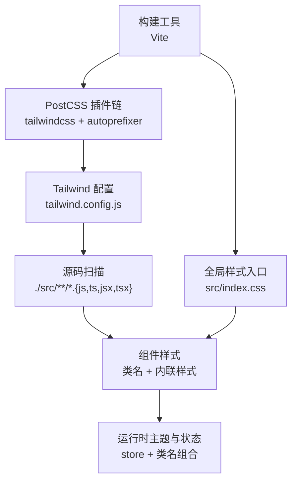
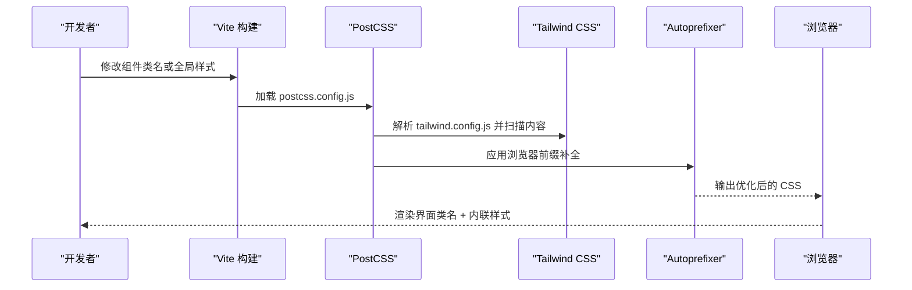
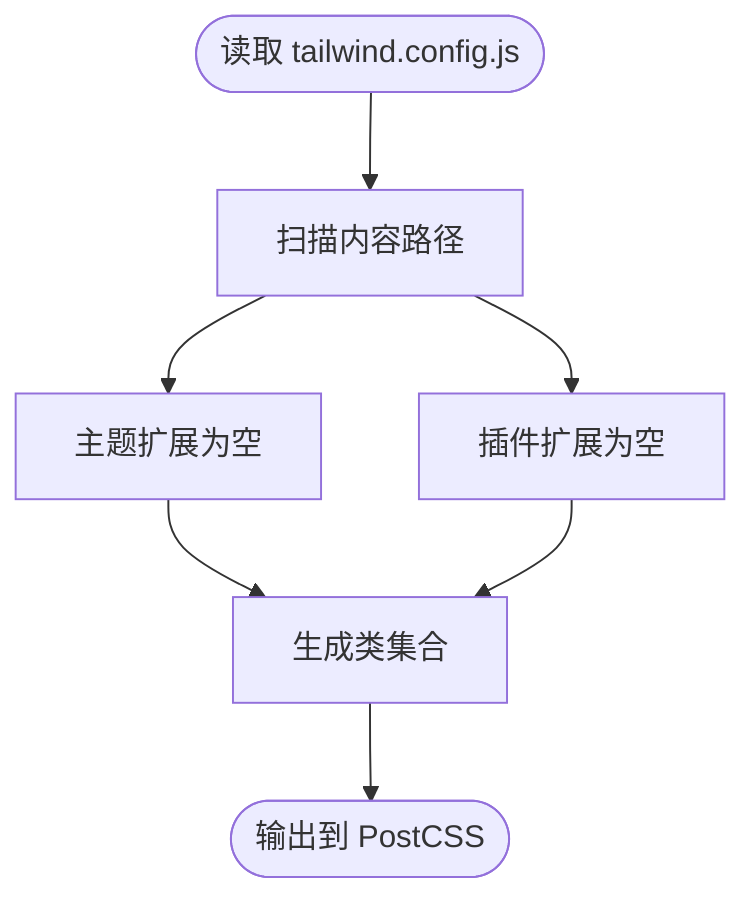
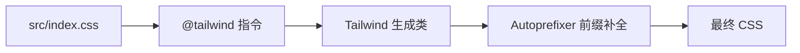
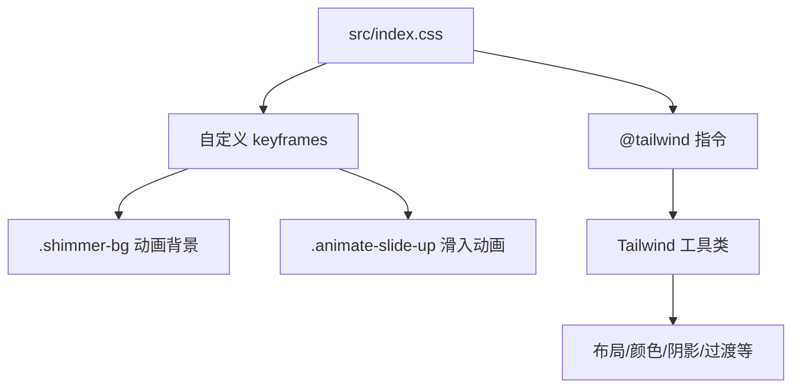
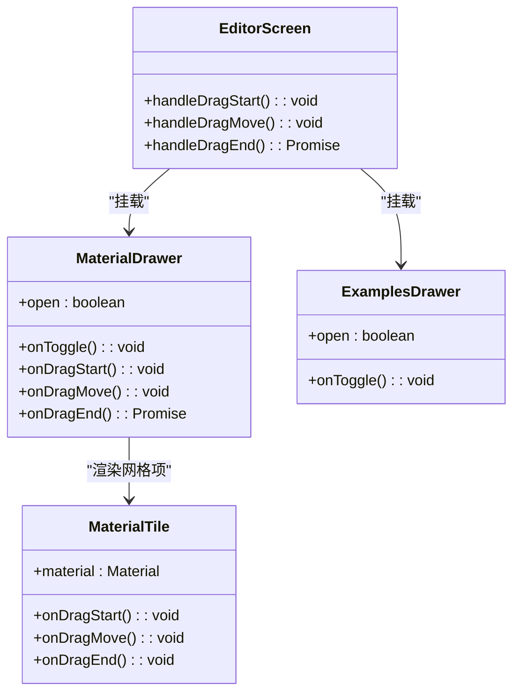
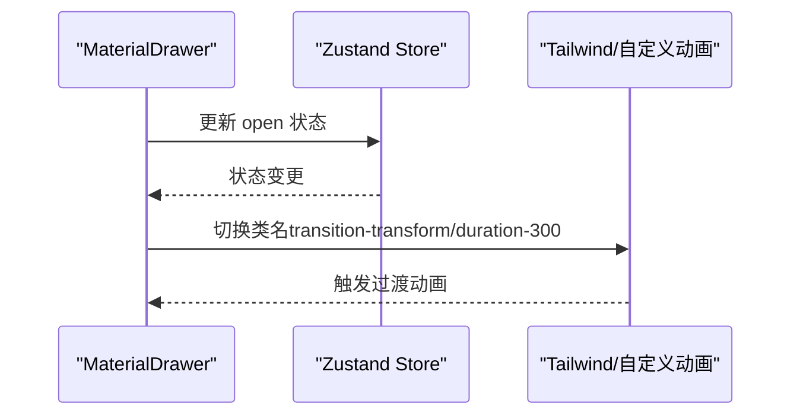
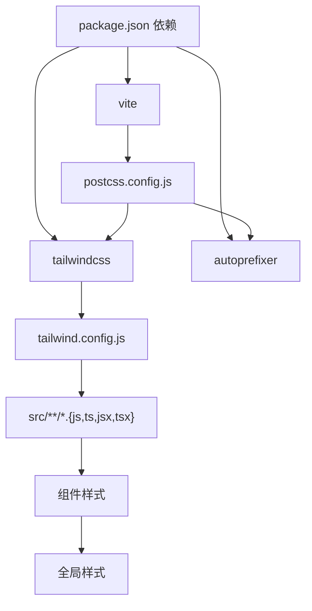

# 样式与主题系统

<cite>
**本文档引用的文件**
- [tailwind.config.js](file://tailwind.config.js)
- [postcss.config.js](file://postcss.config.js)
- [src/index.css](file://src/index.css)
- [vite.config.ts](file://vite.config.ts)
- [package.json](file://package.json)
- [src/App.tsx](file://src/App.tsx)
- [src/components/MaterialDrawer.tsx](file://src/components/MaterialDrawer.tsx)
- [src/components/ExamplesDrawer.tsx](file://src/components/ExamplesDrawer.tsx)
- [src/components/MaterialTile.tsx](file://src/components/MaterialTile.tsx)
- [src/screens/EditorScreen.tsx](file://src/screens/EditorScreen.tsx)
- [src/store.ts](file://src/store.ts)
- [src/types.ts](file://src/types.ts)
</cite>

## 目录
1. [简介](#简介)
2. [项目结构](#项目结构)
3. [核心组件](#核心组件)
4. [架构总览](#架构总览)
5. [详细组件分析](#详细组件分析)
6. [依赖关系分析](#依赖关系分析)
7. [性能考量](#性能考量)
8. [故障排查指南](#故障排查指南)
9. [结论](#结论)

## 简介
本文件面向 WallChanger 的样式与主题系统，系统性阐述以下内容：
- Tailwind CSS 在项目中的配置与使用边界：当前配置为最小可用集，未扩展自定义主题变量。
- PostCSS 配置及其插件链：Tailwind 和 Autoprefixer 的组合职责与作用范围。
- CSS-in-JS 使用策略：内联样式的场景、性能权衡与最佳实践。
- 组件样式组织原则：样式隔离、主题切换与可访问性支持。
- 动画与过渡效果：基于类名与内联样式的实现方式及跨浏览器兼容性建议。

## 项目结构
样式与主题系统由三部分构成：
- 构建与工具链：Vite、PostCSS、Tailwind CSS、Autoprefixer
- 样式入口与基础动画：全局 CSS 入口与自定义动画
- 组件层样式：通过 Tailwind 类名与少量内联样式实现交互态与布局

图表来源
- [vite.config.ts:1-48](file://vite.config.ts#L1-L48)
- [postcss.config.js:1-7](file://postcss.config.js#L1-L7)
- [tailwind.config.js:1-12](file://tailwind.config.js#L1-L12)
- [src/index.css:1-38](file://src/index.css#L1-L38)

章节来源
- [vite.config.ts:1-48](file://vite.config.ts#L1-L48)
- [postcss.config.js:1-7](file://postcss.config.js#L1-L7)
- [tailwind.config.js:1-12](file://tailwind.config.js#L1-L12)
- [src/index.css:1-38](file://src/index.css#L1-L38)

## 核心组件
- Tailwind 配置：最小化扩展，内容扫描路径覆盖根 HTML 与 src 下所有 TS/JS 文件，主题与插件均为空扩展。
- PostCSS 配置：启用 tailwindcss 与 autoprefixer，负责从基础到前缀补全的流水线。
- 全局样式：在入口中引入 Tailwind 基础、组件与工具类，并定义少量自定义动画（shimmer、slide-up）。
- 组件样式：大量使用 Tailwind 类名进行布局、颜色、阴影、圆角、过渡等；少量交互态采用内联样式（如抽屉拖拽时的 transform）。

章节来源
- [tailwind.config.js:1-12](file://tailwind.config.js#L1-L12)
- [postcss.config.js:1-7](file://postcss.config.js#L1-L7)
- [src/index.css:1-38](file://src/index.css#L1-L38)

## 架构总览
样式系统在构建期通过 PostCSS 将 Tailwind 生成的类注入到最终 CSS 中，运行期通过类名与少量内联样式控制视觉状态与交互行为。

图表来源
- [vite.config.ts:1-48](file://vite.config.ts#L1-L48)
- [postcss.config.js:1-7](file://postcss.config.js#L1-L7)
- [tailwind.config.js:1-12](file://tailwind.config.js#L1-L12)

## 详细组件分析

### Tailwind 配置与使用边界
- 内容扫描：仅扫描根 HTML 与 src 下 TS/JS 文件，确保按需生成类，避免无用 CSS。
- 主题扩展：当前为空，未定义自定义颜色、间距、字体或断点。
- 插件扩展：当前为空，未引入额外插件。

图表来源
- [tailwind.config.js:1-12](file://tailwind.config.js#L1-L12)

章节来源
- [tailwind.config.js:1-12](file://tailwind.config.js#L1-L12)

### PostCSS 插件链与 Autoprefixer
- 插件链：tailwindcss → autoprefixer
- 作用：先由 Tailwind 生成类，再由 Autoprefixer 补全浏览器前缀，保证兼容性。

图表来源
- [postcss.config.js:1-7](file://postcss.config.js#L1-L7)
- [src/index.css:1-38](file://src/index.css#L1-L38)

章节来源
- [postcss.config.js:1-7](file://postcss.config.js#L1-L7)
- [src/index.css:1-38](file://src/index.css#L1-L38)

### 全局样式与动画
- 自定义动画：定义了 shimmer 与 slide-up 两个动画，并提供对应的类名与使用示例。
- 使用场景：加载指示器、抽屉展开动画等。

图表来源
- [src/index.css:1-38](file://src/index.css#L1-L38)

章节来源
- [src/index.css:1-38](file://src/index.css#L1-L38)

### 组件样式组织与主题策略
- MaterialDrawer：固定底部抽屉，使用 Tailwind 实现背景、模糊、边框、圆角与阴影；通过类名控制打开/关闭与过渡；拖拽时使用内联 transform 控制位移。
- ExamplesDrawer：与 MaterialDrawer 类似，但层级较低，用于示例选择。
- MaterialTile：网格项卡片，使用 Tailwind 控制圆角、溢出、宽高比与光标状态。
- EditorScreen：主界面容器，使用 Tailwind 控制布局、背景与定位；通过内联样式动态设置图像容器位置与光标；按钮与控件使用 Tailwind 类名实现主题态与过渡。

图表来源
- [src/components/MaterialDrawer.tsx:1-136](file://src/components/MaterialDrawer.tsx#L1-L136)
- [src/components/ExamplesDrawer.tsx:1-207](file://src/components/ExamplesDrawer.tsx#L1-L207)
- [src/components/MaterialTile.tsx:1-106](file://src/components/MaterialTile.tsx#L1-L106)
- [src/screens/EditorScreen.tsx:1-758](file://src/screens/EditorScreen.tsx#L1-L758)

章节来源
- [src/components/MaterialDrawer.tsx:1-136](file://src/components/MaterialDrawer.tsx#L1-L136)
- [src/components/ExamplesDrawer.tsx:1-207](file://src/components/ExamplesDrawer.tsx#L1-L207)
- [src/components/MaterialTile.tsx:1-106](file://src/components/MaterialTile.tsx#L1-L106)
- [src/screens/EditorScreen.tsx:1-758](file://src/screens/EditorScreen.tsx#L1-L758)

### CSS-in-JS 使用策略与性能考量
- 使用场景
  - 抽屉拖拽：在拖拽过程中通过内联 transform 实时更新位移，避免频繁重排与类名切换带来的抖动。
  - 图像容器定位：根据窗口尺寸计算绝对定位与尺寸，使用内联样式一次性设置，减少布局计算。
- 性能权衡
  - 优点：交互流畅、状态更新即时。
  - 风险：内联样式会增加 DOM 属性数量，可能影响渲染性能；应避免在高频更新场景中过度使用。
- 最佳实践
  - 优先使用 Tailwind 类名表达静态与中等复杂度的样式。
  - 对于需要每帧更新的状态（如拖拽），可采用内联样式，但需限制更新频率与属性数量。
  - 对于复杂动画，优先使用 CSS 动画与过渡，保持渲染在合成层上。

章节来源
- [src/components/MaterialDrawer.tsx:84-87](file://src/components/MaterialDrawer.tsx#L84-L87)
- [src/screens/EditorScreen.tsx:496-504](file://src/screens/EditorScreen.tsx#L496-L504)

### 动画与过渡效果实现
- 类名驱动：大量使用 transition-*、duration-*、ease-* 等 Tailwind 工具类实现平滑过渡。
- 自定义动画：在全局样式中定义 keyframes，并通过类名应用到组件元素。
- 交互动画：抽屉展开/收起使用 slide-up 动画；加载指示器使用旋转动画。

图表来源
- [src/components/MaterialDrawer.tsx:84-87](file://src/components/MaterialDrawer.tsx#L84-L87)
- [src/index.css:26-37](file://src/index.css#L26-L37)

章节来源
- [src/components/MaterialDrawer.tsx:84-87](file://src/components/MaterialDrawer.tsx#L84-L87)
- [src/index.css:26-37](file://src/index.css#L26-L37)

### 主题切换与可访问性支持
- 当前状态
  - 未实现显式的“深浅主题”切换逻辑。
  - 组件多使用灰阶与半透明背景，具备一定对比度基础。
- 建议
  - 引入暗色/亮色主题变量，通过根节点类名切换实现主题切换。
  - 使用语义化颜色变量（如 text-primary、bg-surface），提升一致性与可维护性。
  - 关注对比度与键盘导航可达性，确保按钮与交互元素具备清晰焦点状态。

章节来源
- [src/components/MaterialDrawer.tsx:90-94](file://src/components/MaterialDrawer.tsx#L90-L94)
- [src/screens/EditorScreen.tsx:636-668](file://src/screens/EditorScreen.tsx#L636-L668)

## 依赖关系分析
- 构建依赖：Vite 作为开发服务器与打包器；Tailwind CSS 与 Autoprefixer 通过 PostCSS 集成。
- 运行时依赖：React 生态与 Zustand 状态管理，组件样式通过类名与少量内联样式协作。

图表来源
- [package.json:1-27](file://package.json#L1-L27)
- [vite.config.ts:1-48](file://vite.config.ts#L1-L48)
- [postcss.config.js:1-7](file://postcss.config.js#L1-L7)
- [tailwind.config.js:1-12](file://tailwind.config.js#L1-L12)

章节来源
- [package.json:1-27](file://package.json#L1-L27)
- [vite.config.ts:1-48](file://vite.config.ts#L1-L48)
- [postcss.config.js:1-7](file://postcss.config.js#L1-L7)
- [tailwind.config.js:1-12](file://tailwind.config.js#L1-L12)

## 性能考量
- Tailwind 体积控制
  - 通过内容扫描路径精确限定类使用范围，避免生成未使用类。
- 动画与过渡
  - 优先使用 transform 与 opacity 等可合成层属性，减少布局与绘制开销。
- 内联样式的边界
  - 在高频更新场景（如拖拽）使用内联样式可获得更顺滑体验，但需控制更新频率与属性数量。
- 浏览器兼容性
  - Autoprefixer 自动为关键属性添加前缀，降低手动维护成本。

## 故障排查指南
- 类名不生效
  - 检查 tailwind.config.js 的内容扫描路径是否包含对应文件。
  - 确认 PostCSS 是否正确加载 tailwindcss 插件。
- 动画无效
  - 检查自定义 keyframes 是否在全局样式中定义且类名拼写正确。
  - 确认动画属性（如 animation-duration、animation-timing-function）是否被覆盖。
- 抽屉拖拽卡顿
  - 检查是否在每次拖拽事件中都更新了大量内联样式。
  - 考虑将频繁更新的属性合并到单个 transform 属性中，减少重排。

章节来源
- [tailwind.config.js:3-6](file://tailwind.config.js#L3-L6)
- [postcss.config.js:2-5](file://postcss.config.js#L2-L5)
- [src/index.css:5-37](file://src/index.css#L5-L37)
- [src/components/MaterialDrawer.tsx:84-87](file://src/components/MaterialDrawer.tsx#L84-L87)

## 结论
- 当前样式系统以 Tailwind 为核心，PostCSS/Autoprefixer 提供编译与兼容性保障，全局样式补充必要的动画与过渡。
- 组件层广泛使用 Tailwind 类名，少量内联样式用于关键交互态，整体平衡了可维护性与交互流畅性。
- 建议后续引入主题变量与暗色模式支持，完善可访问性与一致性；同时持续监控动画与内联样式的性能表现。