# 状态管理系统

<cite>
**本文档引用的文件**
- [store.ts](file://src/store.ts)
- [types.ts](file://src/types.ts)
- [App.tsx](file://src/App.tsx)
- [UploadScreen.tsx](file://src/screens/UploadScreen.tsx)
- [ProcessingScreen.tsx](file://src/screens/ProcessingScreen.tsx)
- [EditorScreen.tsx](file://src/screens/EditorScreen.tsx)
- [FinalizingScreen.tsx](file://src/screens/FinalizingScreen.tsx)
- [ImageCanvas.tsx](file://src/components/ImageCanvas.tsx)
- [SettingsDrawer.tsx](file://src/components/SettingsDrawer.tsx)
- [ExamplesDrawer.tsx](file://src/components/ExamplesDrawer.tsx)
- [api.ts](file://src/utils/api.ts)
- [package.json](file://package.json)
</cite>

## 目录
1. [简介](#简介)
2. [项目结构](#项目结构)
3. [核心组件](#核心组件)
4. [架构概览](#架构概览)
5. [详细组件分析](#详细组件分析)
6. [依赖关系分析](#依赖关系分析)
7. [性能考虑](#性能考虑)
8. [故障排除指南](#故障排除指南)
9. [结论](#结论)

## 简介

WallChanger 是一个基于 React 和 Zustand 的墙面装饰效果预览应用。该应用采用现代化的状态管理模式，通过 Zustand 实现全局状态管理，支持复杂的异步处理流程和实时的用户交互。

本系统的核心特点包括：
- 基于 Zustand 的轻量级状态管理
- 完整的图像处理工作流（上传 → 预处理 → 编辑 → 最终化）
- 支持批量处理和单区域处理两种模式
- 实时的蒙版分割和材质应用功能
- 完善的调试和配置选项

## 项目结构

项目采用清晰的功能模块化组织，主要目录结构如下：

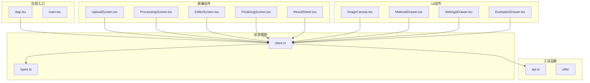

**图表来源**
- [store.ts:1-177](file://src/store.ts#L1-L177)
- [types.ts:57-89](file://src/types.ts#L57-L89)

**章节来源**
- [store.ts:1-177](file://src/store.ts#L1-L177)
- [types.ts:1-89](file://src/types.ts#L1-L89)

## 核心组件

### Zustand 状态存储设计

应用使用 Zustand 创建了类型安全的状态存储，实现了完整的状态管理和动作分发机制。

#### 状态接口设计

AppState 接口定义了应用的所有状态字段：

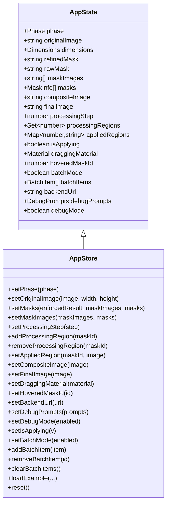

**图表来源**
- [types.ts:57-89](file://src/types.ts#L57-L89)
- [store.ts:5-28](file://src/store.ts#L5-L28)

#### 状态持久化策略

系统实现了多层状态持久化机制：

1. **后端 URL 持久化**：使用 localStorage 存储用户配置
2. **调试参数持久化**：保存调试提示词配置
3. **调试模式持久化**：保持调试模式开关状态

**章节来源**
- [store.ts:30-61](file://src/store.ts#L30-L61)
- [store.ts:121-134](file://src/store.ts#L121-L134)

## 架构概览

应用采用分层架构设计，实现了清晰的关注点分离：

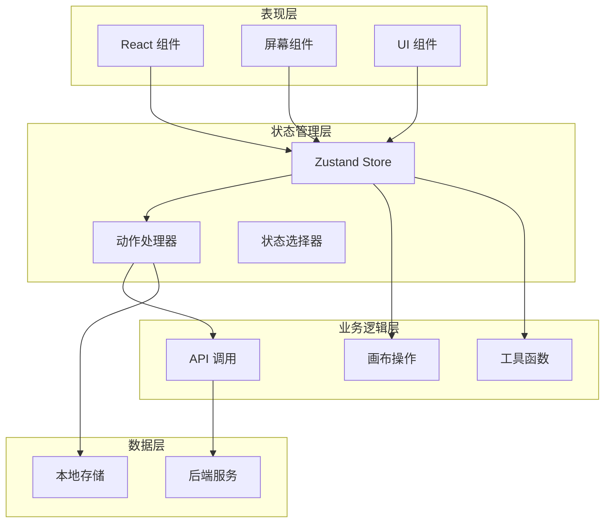

**图表来源**
- [store.ts:63-176](file://src/store.ts#L63-L176)
- [api.ts:1-200](file://src/utils/api.ts#L1-L200)

## 详细组件分析

### 状态管理核心实现

#### 初始化状态设计

初始状态确保了应用从干净的状态开始：

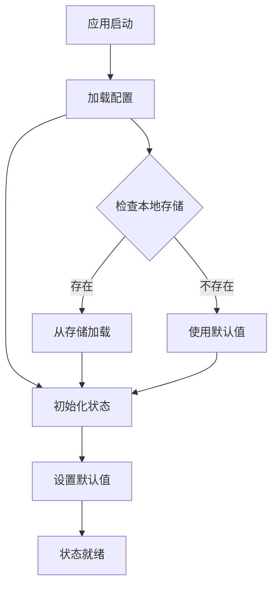

**图表来源**
- [store.ts:40-61](file://src/store.ts#L40-L61)
- [store.ts:30-38](file://src/store.ts#L30-L38)

#### 动作方法设计模式

所有状态更新都通过类型安全的动作方法进行：

| 动作类别 | 方法数量 | 功能描述 |
|---------|----------|----------|
| 图像处理 | 6 | 原始图像设置、蒙版处理、合成图像管理 |
| 区域管理 | 4 | 处理区域跟踪、应用区域管理 |
| 批处理 | 4 | 批量模式控制、项目管理 |
| 配置管理 | 4 | 后端配置、调试设置、模式切换 |

**章节来源**
- [store.ts:66-176](file://src/store.ts#L66-L176)

### 状态结构深度分析

#### 应用阶段管理

应用采用五阶段状态机模型：

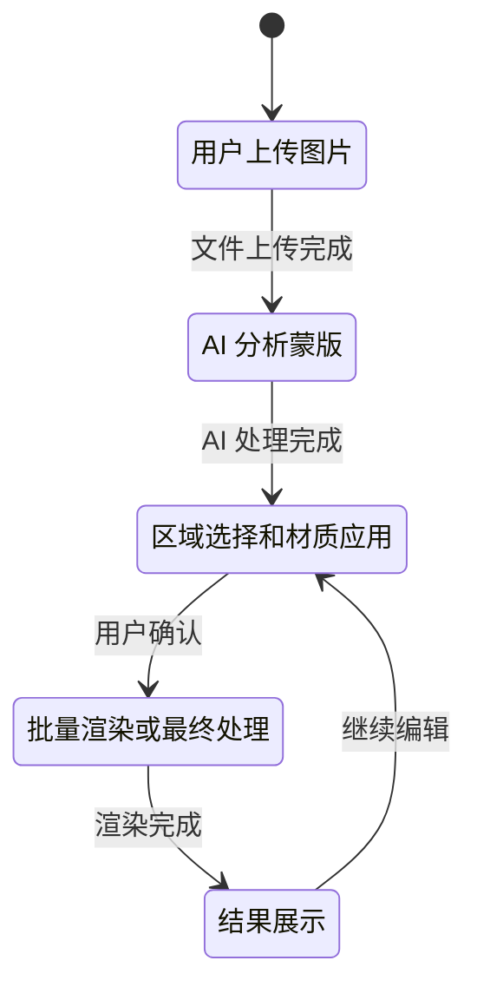

**图表来源**
- [types.ts:14](file://src/types.ts#L14)
- [store.ts:41](file://src/store.ts#L41)

#### 蒙版信息结构

蒙版系统支持复杂的颜色映射和类型分类：

| 字段名 | 类型 | 描述 | 用途 |
|--------|------|------|------|
| id | number | 蒙版唯一标识 | 区域识别 |
| label | string | 蒙版标签 | 用户界面显示 |
| color | [number, number, number] | RGB 颜色值 | 可视化区分 |
| type | 'wall' \| 'ceiling' | 蒙版类型 | 材质应用决策 |

**章节来源**
- [types.ts:1-6](file://src/types.ts#L1-L6)

### 异步状态处理机制

#### 后台处理流程

应用实现了完整的异步处理管道：

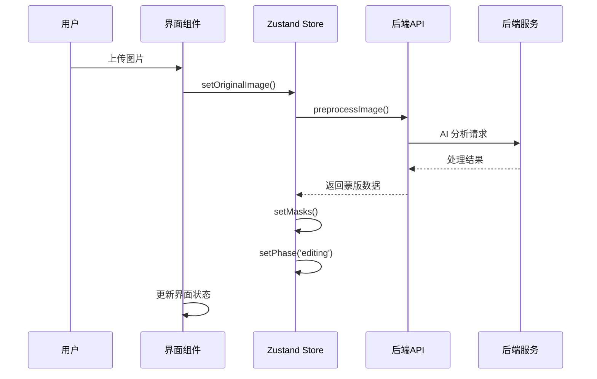

**图表来源**
- [ProcessingScreen.tsx:41-90](file://src/screens/ProcessingScreen.tsx#L41-L90)
- [api.ts:21-37](file://src/utils/api.ts#L21-L37)

#### 材质应用异步处理

材质应用采用了防重复提交的同步机制：

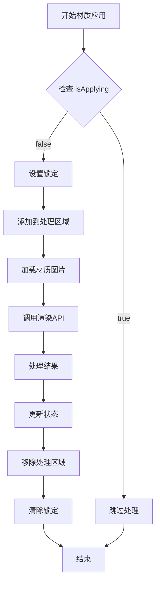

**图表来源**
- [EditorScreen.tsx:276-345](file://src/screens/EditorScreen.tsx#L276-L345)
- [store.ts:300-304](file://src/store.ts#L300-L304)

**章节来源**
- [EditorScreen.tsx:276-345](file://src/screens/EditorScreen.tsx#L276-L345)
- [store.ts:136](file://src/store.ts#L136)

### 状态订阅和组件绑定

#### 组件状态绑定模式

应用中的组件采用多种状态绑定策略：

| 组件类型 | 绑定策略 | 说明 |
|----------|----------|------|
| 屏幕组件 | 全状态绑定 | 访问应用阶段和核心状态 |
| UI 组件 | 片段状态绑定 | 仅访问必要状态片段 |
| 工具组件 | 单一状态绑定 | 访问特定配置状态 |

#### 状态选择器优化

组件通过精确的状态选择减少不必要的重渲染：

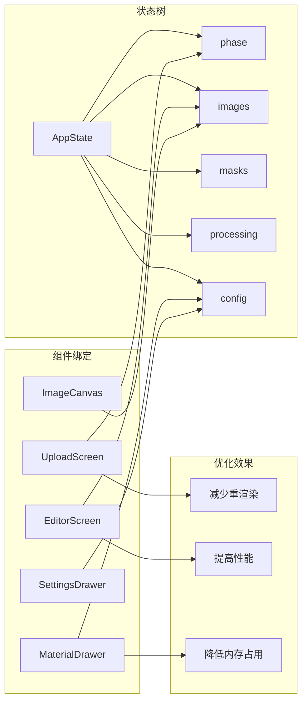

**图表来源**
- [UploadScreen.tsx:6-29](file://src/screens/UploadScreen.tsx#L6-L29)
- [EditorScreen.tsx:21-51](file://src/screens/EditorScreen.tsx#L21-L51)
- [ImageCanvas.tsx:16-31](file://src/components/ImageCanvas.tsx#L16-L31)

**章节来源**
- [UploadScreen.tsx:6-29](file://src/screens/UploadScreen.tsx#L6-L29)
- [EditorScreen.tsx:21-51](file://src/screens/EditorScreen.tsx#L21-L51)

### 批量处理状态管理

#### 批量模式设计

批量处理模式提供了高效的大规模材质应用能力：

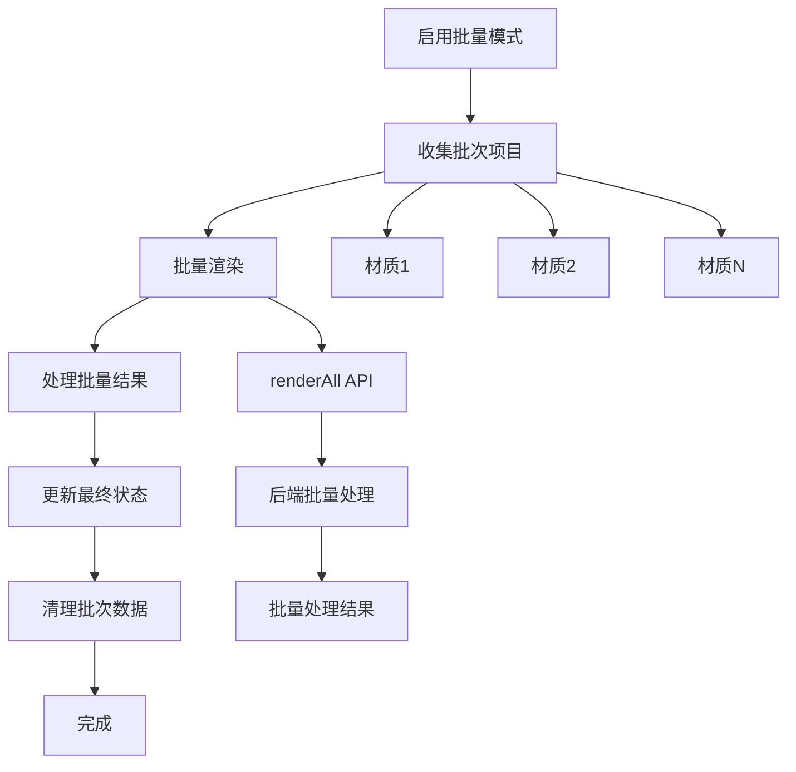

**图表来源**
- [FinalizingScreen.tsx:22-45](file://src/screens/FinalizingScreen.tsx#L22-L45)
- [store.ts:138-148](file://src/store.ts#L138-L148)

**章节来源**
- [FinalizingScreen.tsx:22-45](file://src/screens/FinalizingScreen.tsx#L22-L45)
- [store.ts:138-148](file://src/store.ts#L138-L148)

## 依赖关系分析

### 核心依赖关系

应用的依赖关系清晰且模块化：

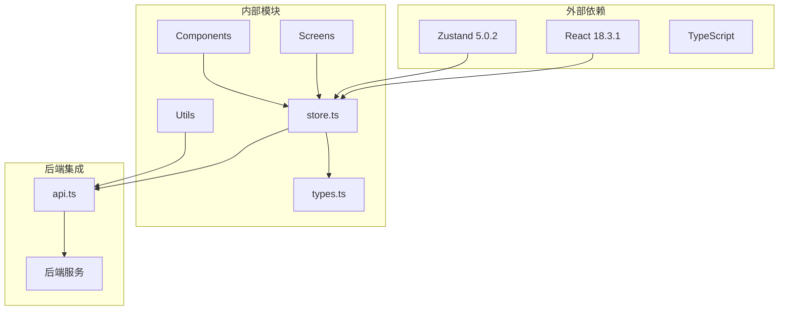

**图表来源**
- [package.json:11-25](file://package.json#L11-L25)
- [store.ts:1](file://src/store.ts#L1)

### 状态依赖图

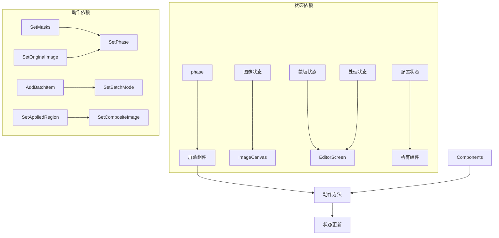

**图表来源**
- [store.ts:63-176](file://src/store.ts#L63-L176)
- [types.ts:57-89](file://src/types.ts#L57-L89)

**章节来源**
- [package.json:11-25](file://package.json#L11-L25)
- [store.ts:63-176](file://src/store.ts#L63-L176)

## 性能考虑

### 状态更新优化策略

#### 批量更新最佳实践

1. **原子性更新**：使用单个 set 调用进行相关状态的批量更新
2. **条件更新**：避免不必要的状态变更触发重渲染
3. **浅比较优化**：利用 Zustand 的浅比较机制减少重渲染

#### 内存管理策略

1. **及时清理**：在状态重置时清理大对象引用
2. **懒加载**：延迟加载大型资源直到需要时
3. **缓存策略**：合理使用浏览器缓存和本地存储

### 组件渲染优化

#### 精确状态绑定

组件应该只订阅必要的状态片段，避免全状态订阅导致的不必要重渲染。

#### 异步处理优化

1. **防抖处理**：对频繁的状态更新进行防抖
2. **并发控制**：限制同时进行的异步操作数量
3. **错误恢复**：实现完善的错误处理和状态恢复机制

## 故障排除指南

### 常见问题诊断

#### 状态不同步问题

**症状**：界面状态与实际状态不一致
**解决方案**：
1. 检查状态更新是否在正确的生命周期内执行
2. 验证异步操作的错误处理
3. 确认状态重置逻辑的完整性

#### 性能问题排查

**症状**：应用响应缓慢或内存泄漏
**解决方案**：
1. 分析组件的重渲染频率
2. 检查状态订阅的精确性
3. 优化大对象的状态存储

#### 后端通信问题

**症状**：API 调用失败或超时
**解决方案**：
1. 验证后端 URL 配置
2. 检查网络连接状态
3. 实现适当的重试机制

**章节来源**
- [SettingsDrawer.tsx:18-34](file://src/components/SettingsDrawer.tsx#L18-L34)
- [api.ts:9-13](file://src/utils/api.ts#L9-L13)

## 结论

WallChanger 的状态管理系统展现了现代前端应用的最佳实践：

### 设计优势

1. **类型安全**：完整的 TypeScript 类型定义确保编译时安全
2. **模块化设计**：清晰的职责分离便于维护和扩展
3. **性能优化**：精心设计的状态选择和更新策略
4. **用户体验**：流畅的异步处理和实时反馈机制

### 技术亮点

- 基于 Zustand 的轻量级状态管理
- 完整的图像处理工作流实现
- 灵活的批量处理和单区域处理模式
- 完善的调试和配置系统

### 发展建议

1. **状态持久化增强**：考虑实现更复杂的状态序列化机制
2. **性能监控**：添加状态更新和组件渲染的性能监控
3. **错误边界**：实现更完善的错误处理和恢复机制
4. **测试覆盖**：增加状态管理相关的单元测试和集成测试

该状态管理系统为复杂的图像处理应用提供了坚实的基础，其设计原则和实现模式可以作为其他类似应用的参考模板。