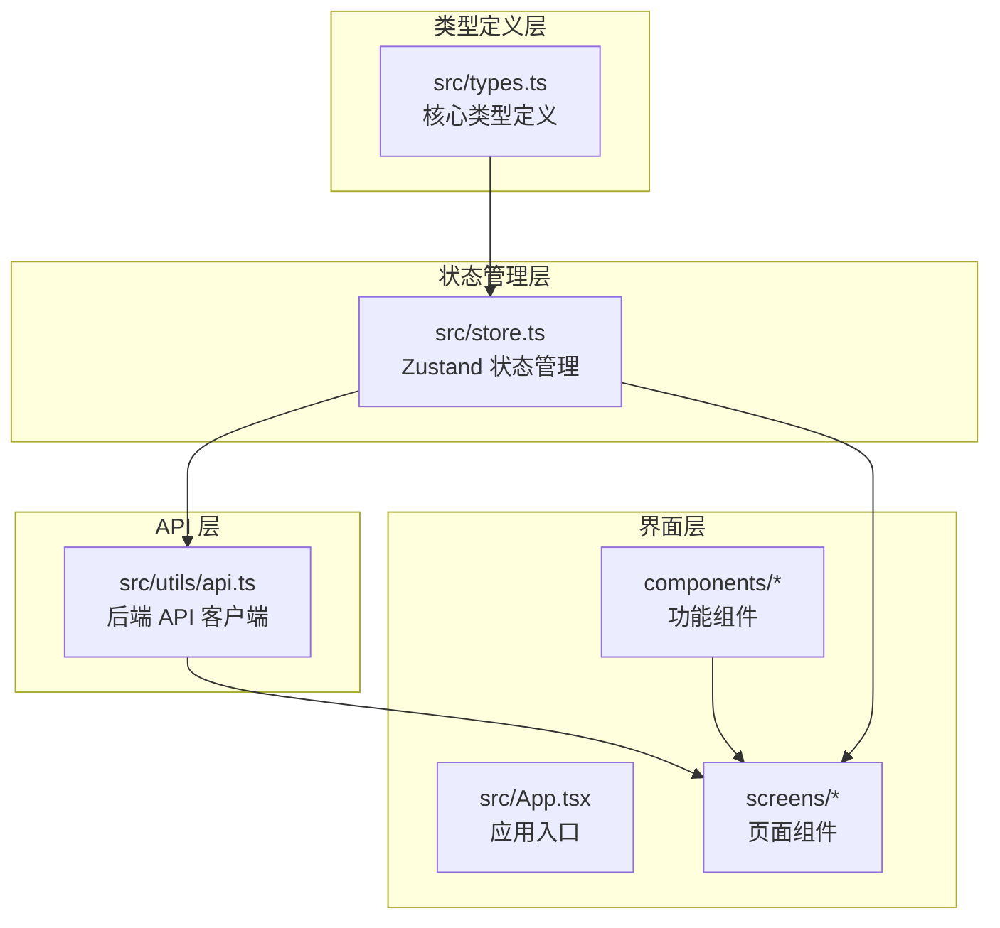
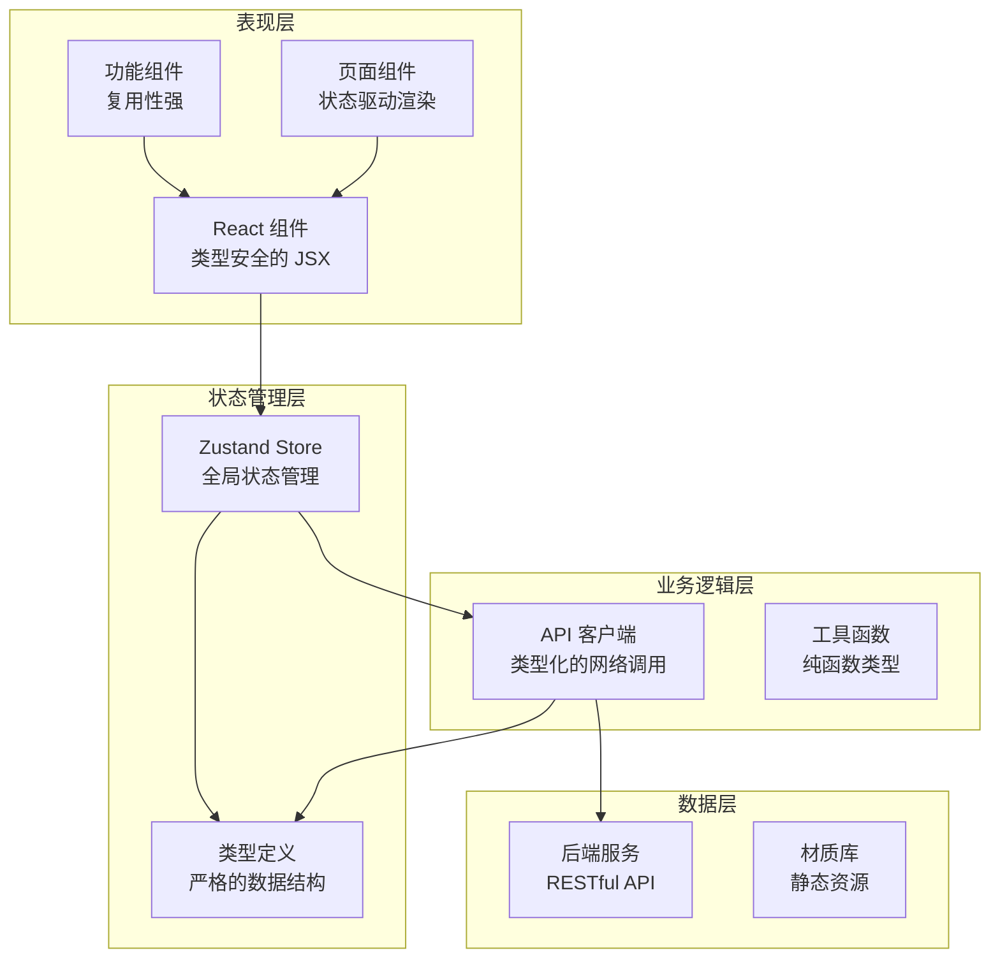
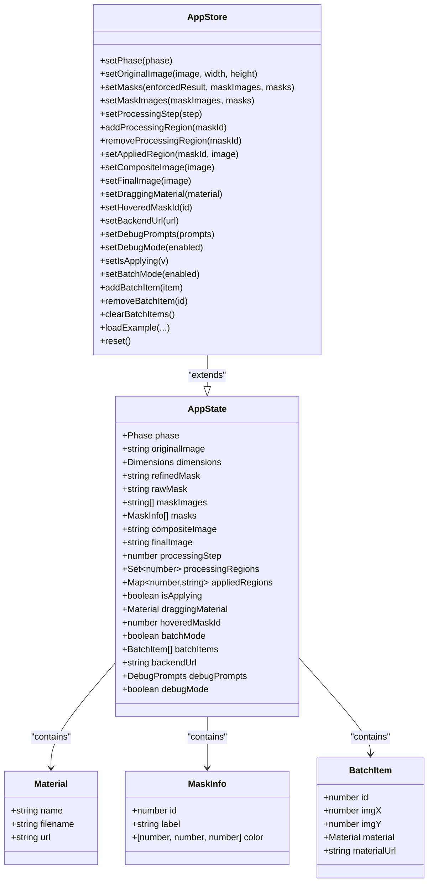
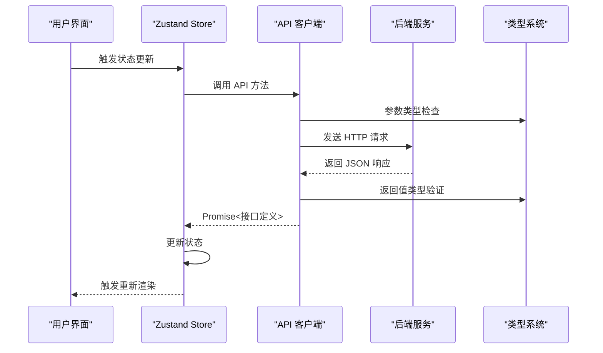
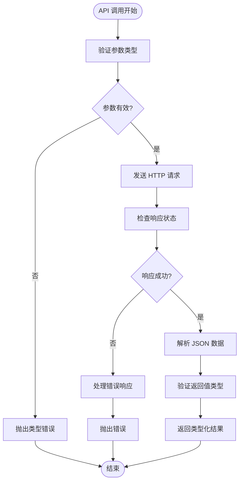

# 类型定义体系

<cite>
**本文档引用的文件**
- [src/types.ts](file://src/types.ts)
- [src/store.ts](file://src/store.ts)
- [src/utils/api.ts](file://src/utils/api.ts)
- [src/App.tsx](file://src/App.tsx)
- [src/screens/UploadScreen.tsx](file://src/screens/UploadScreen.tsx)
- [src/screens/ProcessingScreen.tsx](file://src/screens/ProcessingScreen.tsx)
- [src/screens/EditorScreen.tsx](file://src/screens/EditorScreen.tsx)
- [src/components/MaterialTile.tsx](file://src/components/MaterialTile.tsx)
- [package.json](file://package.json)
- [tsconfig.json](file://tsconfig.json)
</cite>

## 目录
1. [引言](#引言)
2. [项目结构](#项目结构)
3. [核心类型定义](#核心类型定义)
4. [AppState 接口深度解析](#appstate-接口深度解析)
5. [API 响应类型体系](#api-响应类型体系)
6. [类型安全编程实践](#类型安全编程实践)
7. [类型推导与兼容性](#类型推导与兼容性)
8. [架构概览](#架构概览)
9. [详细组件分析](#详细组件分析)
10. [性能考虑](#性能考虑)
11. [故障排除指南](#故障排除指南)
12. [结论](#结论)

## 引言

WallChanger 是一个基于 React 和 TypeScript 的墙面材质更换应用，通过 AI 技术实现智能墙面分割和材质替换。本项目在类型系统设计上采用了严格的 TypeScript 实践，建立了完整的类型定义体系，确保了代码的类型安全性和可维护性。

本文档将深入分析项目的类型定义体系，包括接口定义、类型别名、泛型使用以及类型安全编程的最佳实践，特别关注 AppState 接口的设计和 API 响应类型的定义。

## 项目结构

项目采用模块化的 TypeScript 架构，主要分为以下几个层次：



**图表来源**
- [src/types.ts:1-88](file://src/types.ts#L1-L88)
- [src/store.ts:1-177](file://src/store.ts#L1-L177)
- [src/utils/api.ts:1-197](file://src/utils/api.ts#L1-L197)

**章节来源**
- [src/types.ts:1-88](file://src/types.ts#L1-L88)
- [src/store.ts:1-177](file://src/store.ts#L1-L177)
- [src/utils/api.ts:1-197](file://src/utils/api.ts#L1-L197)

## 核心类型定义

项目的核心类型定义集中在 `src/types.ts` 文件中，主要包括以下几类：

### 接口定义

1. **MaskInfo 接口**：描述蒙版信息
   - `id`: number - 蒙版唯一标识
   - `label`: string - 蒙版标签
   - `color`: [number, number, number] - RGB 颜色数组

2. **Material 接口**：描述材质信息
   - `name`: string - 材质名称
   - `filename`: string - 材质文件名
   - `url`: string - 材质图片 URL

3. **BatchItem 接口**：批量处理项目
   - `id`: number - 项目唯一标识
   - `imgX/imgY`: number - 相对于强制图像的像素坐标
   - `material`: Material - 材质对象
   - `materialUrl`: string - 材质图片 URL

### 类型别名

1. **Phase 类型别名**：应用阶段枚举
   ```typescript
   export type Phase = 'upload' | 'processing' | 'editing' | 'finalizing' | 'done'
   ```

2. **DebugPrompts 接口**：调试提示词配置
   - `enhance`: string - 增强提示词
   - `clean`: string - 清理提示词
   - `refine`: string - 精炼提示词
   - `applyMaterial`: string - 应用材质提示词
   - `finalize`: string - 最终化提示词

### 工具函数类型

1. **toImgSrc 函数**：字符串类型判断和转换
   - 输入：`string` - 可能是 URL 或 base64 编码
   - 输出：`string` - 可用于 img.src 的字符串
   - 特殊处理：自动为 raw base64 添加 data URI 前缀

**章节来源**
- [src/types.ts:1-88](file://src/types.ts#L1-L88)

## AppState 接口深度解析

AppState 接口是整个应用状态的核心定义，包含了应用运行所需的全部状态信息。该接口设计体现了类型系统的强大能力，通过精确的类型约束确保了状态的一致性和安全性。

### 状态分组分析

#### 图像状态组
- `originalImage: string | null` - 原始上传图像的 base64 数据
- `dimensions: { width: number; height: number }` - 图像尺寸信息
- `refinedMask: string | null` - 经过精炼的蒙版图像
- `rawMask: string | null` - 原始蒙版图像
- `maskImages: string[]` - 来自 ComfyUI 的二值蒙版 PNG 数组（每个墙面区域一个）
- `masks: MaskInfo[]` - 蒙版信息数组
- `compositeImage: string | null` - 复合图像
- `finalImage: string | null` - 最终生成图像

#### 处理状态组
- `processingStep: 0 | 1 | 2 | 3 | 4` - 处理步骤枚举（严格字面量类型）
- `processingRegions: Set<number>` - 正在处理的区域集合
- `appliedRegions: Map<number, string>` - 已应用材质的区域映射
- `isApplying: boolean` - 互斥锁：同一时间只允许一个材质应用操作

#### 用户交互状态组
- `draggingMaterial: Material | null` - 拖拽中的材质
- `hoveredMaskId: number | null` - 鼠标悬停的蒙版 ID

#### 批量处理状态组
- `batchMode: boolean` - 批量模式开关
- `batchItems: BatchItem[]` - 批量处理项目列表

#### 配置状态组
- `backendUrl: string` - 后端服务 URL
- `debugPrompts: DebugPrompts` - 调试提示词配置
- `debugMode: boolean` - 调试模式开关

### 类型约束与设计原则

1. **严格字面量类型**：`processingStep` 使用联合类型确保只有预定义的步骤值
2. **集合类型约束**：使用 `Set` 和 `Map` 确保数据结构的完整性
3. **可选类型处理**：所有初始状态都支持 `null` 值，体现异步加载的特点
4. **类型一致性**：相关联的状态字段保持类型一致，如 `maskImages` 和 `masks` 的一一对应关系

### 状态初始化策略

应用状态通过 `initialState` 对象进行统一初始化，确保了应用启动时的完整性和一致性。初始化过程中考虑了：
- 默认阶段设置为 `'upload'`
- 空图像状态的正确初始化
- 集合类型的正确实例化
- 配置项的持久化恢复

**章节来源**
- [src/types.ts:56-87](file://src/types.ts#L56-L87)
- [src/store.ts:40-61](file://src/store.ts#L40-L61)

## API 响应类型体系

项目中的 API 响应类型定义体现了 TypeScript 类型系统的灵活性和精确性，通过明确的接口定义确保了前后端数据交换的类型安全。

### 核心 API 接口

#### 健康检查接口
```typescript
export async function checkHealth(): Promise<{ status: string; model_loaded: boolean }>
```
- 返回：包含状态信息和模型加载状态的对象
- 用途：验证后端服务可用性

#### 材质获取接口
```typescript
export async function getMaterials(): Promise<Material[]>
```
- 返回：Material 对象数组
- 用途：获取可用的材质库列表

#### 图像预处理接口
```typescript
export async function preprocessImage(
  image: string,
): Promise<{ enforcedResult: string; masks: string[] }>
```
- 输入：原始图像 base64 数据
- 返回：包含强制结果图像和蒙版数组的对象
- 用途：AI 预处理阶段的主要输出

#### 蒙版处理接口
```typescript
export async function processMasks(
  enhancedImage: string,
  promptClean?: string,
  promptRefine?: string,
): Promise<{ refinedMask: string; rawMask: string; masks: MaskInfo[] }>
```
- 输入：增强后的图像和可选提示词
- 返回：包含精炼蒙版、原始蒙版和蒙版信息数组的对象
- 用途：墙面区域分割和蒙版优化

#### 批量渲染接口
```typescript
export async function renderAll(
  enforcedImage: string,
  masks: string[],
  items: Array<{ x: number; y: number; materialImage: string; prompt?: string }>
): Promise<{ finalImage: string }>
```
- 输入：强制图像、蒙版数组和批量项目数组
- 返回：最终合成图像
- 用途：批量材质应用和渲染

### 类型安全的参数传递

API 客户端通过严格的类型定义确保了：
1. **参数类型验证**：所有 API 调用都有明确的参数类型
2. **返回值类型约束**：Promise 返回值具有精确的接口定义
3. **错误处理类型**：错误对象的结构得到保证
4. **JSON 序列化安全**：所有传输数据都是可序列化的纯对象

### 错误处理类型系统

API 函数实现了完善的错误处理机制：
- 使用 `throw new Error()` 抛出类型化的错误
- 包含详细的错误信息和状态码
- 支持文本和 JSON 响应的不同错误格式
- 提供友好的用户错误消息

**章节来源**
- [src/utils/api.ts:9-197](file://src/utils/api.ts#L9-L197)

## 类型安全编程实践

项目在类型安全编程方面采用了多种最佳实践，确保了代码的健壮性和可维护性。

### 类型断言的安全使用

1. **文件读取断言**
   ```typescript
   const base64 = (e.target?.result as string).split(',')[1]
   ```
   - 使用场景：从 FileReader 结果中提取 base64 数据
   - 安全考虑：结合条件检查确保类型安全

2. **DOM 元素断言**
   ```typescript
   const img = new Image()
   const url = URL.createObjectURL(file)
   img.onload = () => {
     const reader = new FileReader()
     reader.onload = (e) => {
       const base64 = (e.target?.result as string).split(',')[1]
       // 处理逻辑
     }
   }
   ```

### 条件类型的应用

项目中广泛使用了条件类型来处理可选属性和联合类型：

1. **可选属性处理**
   ```typescript
   if (file && file.type.startsWith('image/')) {
     // 处理逻辑
   }
   ```

2. **联合类型分支**
   ```typescript
   if (phase === 'upload') {
     return <UploadScreen />
   } else if (phase === 'processing') {
     return <ProcessingScreen />
   }
   ```

### 工具类型的使用

1. **Partial 工具类型**：用于部分更新状态
2. **Pick/Omit 工具类型**：从现有类型中选择或排除属性
3. **Record 工具类型**：用于键值对结构的类型定义

### 泛型的谨慎使用

项目中泛型使用相对保守，主要体现在：
- 简单的泛型约束用于 API 响应类型
- 避免过度复杂的泛型层级
- 优先使用具体类型而非泛型占位符

### 类型守卫的实现

```typescript
function handleFile(file: File) {
  if (!file.type.startsWith('image/')) return
  
  // 类型守卫确保 file 是有效的图像文件
  const img = new Image()
  // 处理逻辑
}
```

**章节来源**
- [src/screens/UploadScreen.tsx:13-29](file://src/screens/UploadScreen.tsx#L13-L29)
- [src/utils/api.ts:21-37](file://src/utils/api.ts#L21-L37)

## 类型推导与兼容性

TypeScript 的类型推导系统在项目中发挥了重要作用，减少了显式类型注解的需求，同时保持了类型安全。

### 自动类型推导

1. **变量类型推导**
   ```typescript
   const { setOriginalImage, setPhase, debugMode, setDebugMode } = useStore()
   // TypeScript 自动推导 setOriginalImage 为函数类型
   ```

2. **函数返回值推导**
   ```typescript
   function generateUniqueColor(existing: [number, number, number][]): [number, number, number] {
     // 返回值类型自动推导为元组类型
   }
   ```

3. **React 组件属性推导**
   ```typescript
   interface MaterialTileProps {
     material: Material
     onDragStart: (material: Material, x: number, y: number) => void
     onDragMove: (x: number, y: number) => void
     onDragEnd: (x: number, y: number) => void
   }
   ```

### 类型兼容性策略

1. **接口扩展**
   ```typescript
   interface AppStore extends AppState {
     // 扩展状态管理方法
   }
   ```

2. **联合类型兼容**
   ```typescript
   export type Phase = 'upload' | 'processing' | 'editing' | 'finalizing' | 'done'
   // 确保所有可能的阶段值都被覆盖
   ```

3. **函数重载兼容**
   ```typescript
   export async function setMasks(
     enforcedResult: string, 
     maskImages: string[], 
     masks: MaskInfo[]
   ): Promise<void>
   
   export async function setMasks(
     enforcedResult: string, 
     maskImages: string[], 
     masks: MaskInfo[]
   ): Promise<void>
   ```

### 类型声明文件

项目使用了标准的 TypeScript 声明文件：
- `@types/react` 和 `@types/react-dom` 提供 React 类型支持
- 内部类型定义集中管理，避免类型污染
- 明确的模块边界和导入路径

**章节来源**
- [src/store.ts:5-28](file://src/store.ts#L5-L28)
- [src/components/MaterialTile.tsx:5-10](file://src/components/MaterialTile.tsx#L5-L10)

## 架构概览

项目采用分层架构设计，每层都有明确的职责和类型边界：



**图表来源**
- [src/App.tsx:8-25](file://src/App.tsx#L8-L25)
- [src/store.ts:63-176](file://src/store.ts#L63-L176)
- [src/utils/api.ts:15-197](file://src/utils/api.ts#L15-L197)

## 详细组件分析

### Zustand Store 类型分析

Zustand Store 通过类型扩展实现了完整的类型安全：



**图表来源**
- [src/store.ts:5-28](file://src/store.ts#L5-L28)
- [src/types.ts:7-37](file://src/types.ts#L7-L37)

### API 客户端类型流程



**图表来源**
- [src/utils/api.ts:15-86](file://src/utils/api.ts#L15-L86)
- [src/store.ts:63-176](file://src/store.ts#L63-L176)

### 类型安全的错误处理流程



**图表来源**
- [src/utils/api.ts:21-37](file://src/utils/api.ts#L21-L37)
- [src/utils/api.ts:54-72](file://src/utils/api.ts#L54-L72)

**章节来源**
- [src/store.ts:5-28](file://src/store.ts#L5-L28)
- [src/utils/api.ts:15-197](file://src/utils/api.ts#L15-L197)

## 性能考虑

类型系统在性能方面的贡献主要体现在编译时检查和运行时优化：

### 编译时优化

1. **类型检查优化**：严格的类型定义帮助编译器生成更高效的 JavaScript
2. **死代码消除**：未使用的类型信息在编译时被移除
3. **模块打包优化**：Tree-shaking 可以有效移除未使用的类型定义

### 运行时性能

1. **类型擦除**：TypeScript 类型在运行时完全消失，不影响性能
2. **接口优化**：接口定义不会产生额外的运行时开销
3. **泛型约束**：严格类型约束在编译时解决，运行时无额外成本

### 内存管理

1. **集合类型优化**：Set 和 Map 的使用提供了高效的查找和存储
2. **对象冻结**：合理使用只读类型减少不必要的内存分配
3. **垃圾回收友好**：清晰的类型边界有助于垃圾回收器工作

## 故障排除指南

### 常见类型错误

1. **属性访问错误**
   ```typescript
   // 错误：可能访问不存在的属性
   const imageUrl = state.originalImage.url
   
   // 正确：先检查属性存在性
   if (state.originalImage && state.originalImage.url) {
     const imageUrl = state.originalImage.url
   }
   ```

2. **类型断言风险**
   ```typescript
   // 风险：过于宽泛的类型断言
   const data = JSON.parse(responseText) as any
   
   // 更安全：使用具体类型断言
   const data = JSON.parse(responseText) as Material[]
   ```

3. **联合类型处理**
   ```typescript
   // 错误：忘记处理所有联合类型
   switch (phase) {
     case 'upload':
       // 处理 upload
       break
     case 'processing':
       // 处理 processing
       break
   }
   
   // 正确：处理所有联合类型
   switch (phase) {
     case 'upload':
       // 处理 upload
       break
     case 'processing':
       // 处理 processing
       break
     case 'editing':
       // 处理 editing
       break
     case 'finalizing':
       // 处理 finalizing
       break
     case 'done':
       // 处理 done
       break
   }
   ```

### 调试技巧

1. **类型断点**：在 TypeScript 代码中设置断点查看类型信息
2. **编译器错误**：利用 TypeScript 编译器的详细错误信息
3. **类型推导**：使用 IDE 的类型提示功能理解复杂类型

**章节来源**
- [src/screens/ProcessingScreen.tsx:49-52](file://src/screens/ProcessingScreen.tsx#L49-L52)
- [src/utils/api.ts:29-33](file://src/utils/api.ts#L29-L33)

## 结论

WallChanger 项目展示了现代 TypeScript 应用的类型系统最佳实践。通过精心设计的类型定义体系，项目实现了：

1. **完整的类型安全保障**：从接口定义到 API 响应的全面类型覆盖
2. **严格的类型约束**：通过字面量类型和工具类型确保数据完整性
3. **良好的类型可维护性**：清晰的类型分层和模块化设计
4. **优秀的开发体验**：IDE 类型提示和编译时错误检查

项目在类型安全编程方面的实践为类似的应用开发提供了宝贵的参考，特别是在状态管理、API 客户端和 React 组件开发中展现的类型系统应用技巧值得学习和借鉴。

通过持续的类型演进和重构，项目将继续保持高质量的类型定义体系，为开发者提供可靠的类型安全保障。