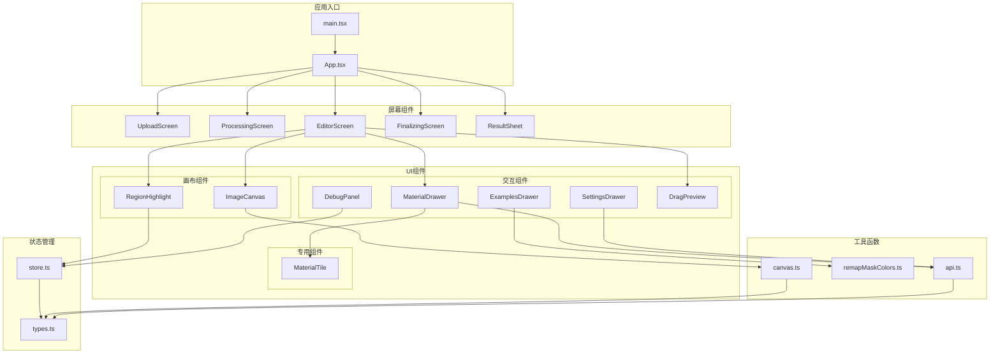
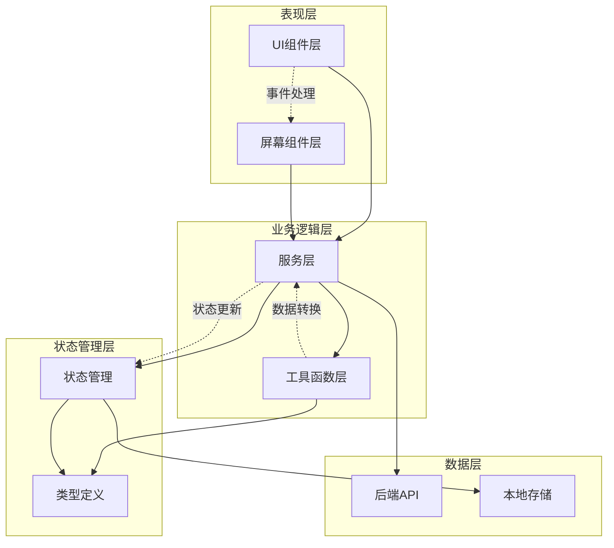
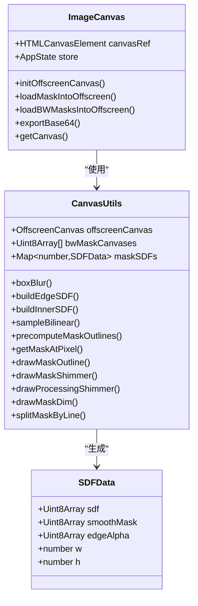
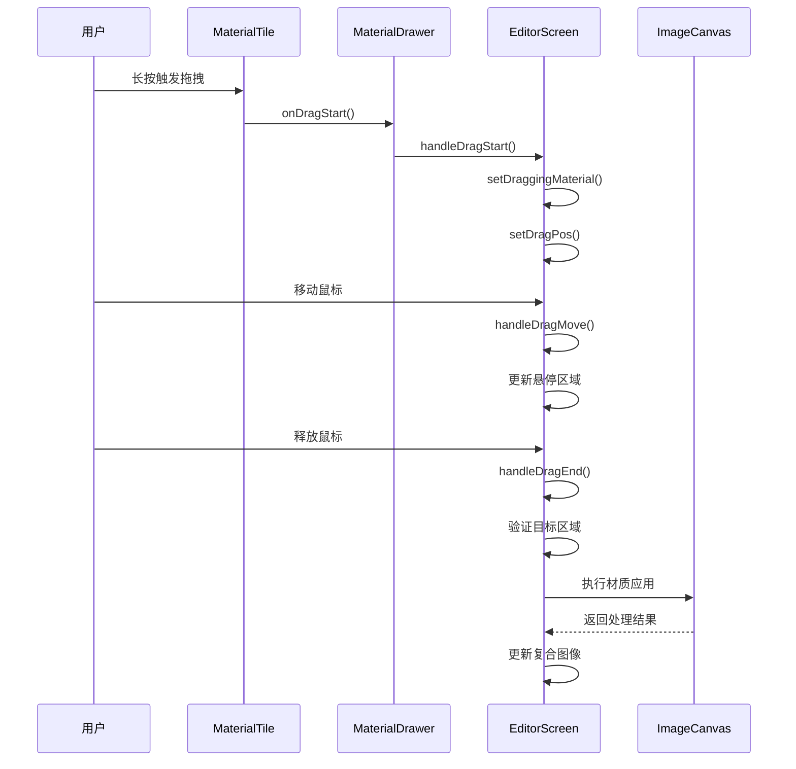
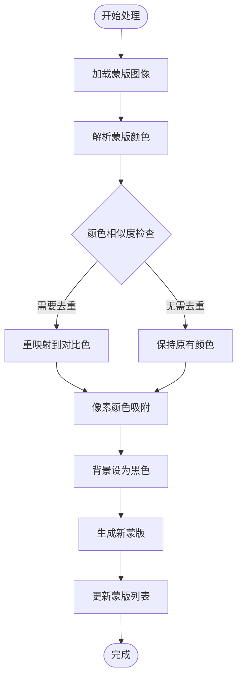
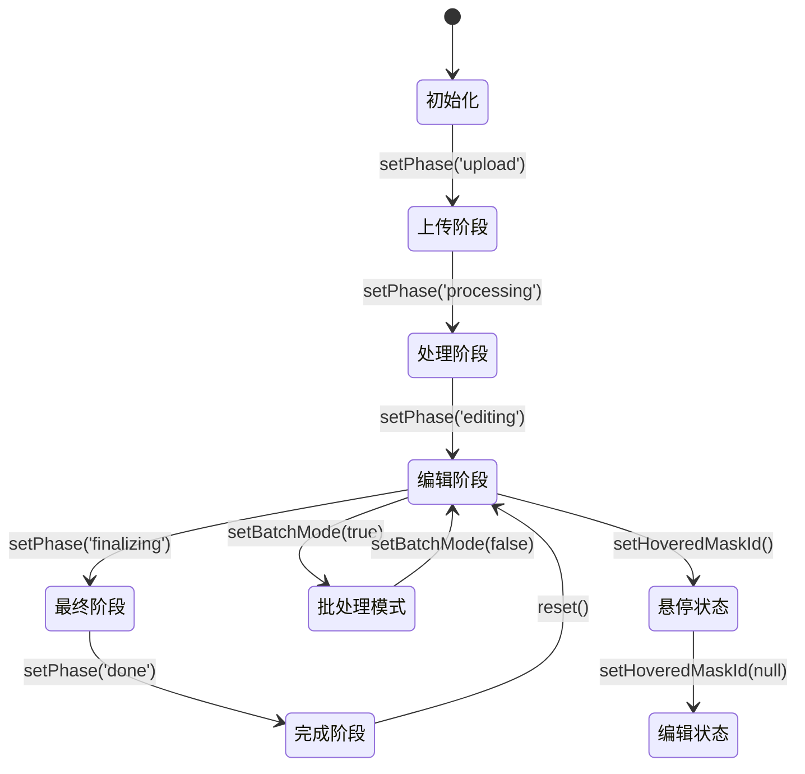
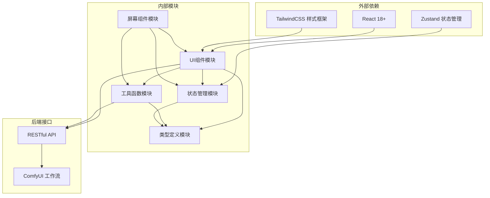

# UI组件库

<cite>
**本文档引用的文件**
- [src/components/ImageCanvas.tsx](file://src/components/ImageCanvas.tsx)
- [src/components/MaterialDrawer.tsx](file://src/components/MaterialDrawer.tsx)
- [src/components/ExamplesDrawer.tsx](file://src/components/ExamplesDrawer.tsx)
- [src/components/SettingsDrawer.tsx](file://src/components/SettingsDrawer.tsx)
- [src/components/DebugPanel.tsx](file://src/components/DebugPanel.tsx)
- [src/components/MaterialTile.tsx](file://src/components/MaterialTile.tsx)
- [src/components/RegionHighlight.tsx](file://src/components/RegionHighlight.tsx)
- [src/components/DragPreview.tsx](file://src/components/DragPreview.tsx)
- [src/utils/canvas.ts](file://src/utils/canvas.ts)
- [src/utils/remapMaskColors.ts](file://src/utils/remapMaskColors.ts)
- [src/utils/api.ts](file://src/utils/api.ts)
- [src/store.ts](file://src/store.ts)
- [src/types.ts](file://src/types.ts)
- [src/screens/EditorScreen.tsx](file://src/screens/EditorScreen.tsx)
- [src/App.tsx](file://src/App.tsx)
- [src/main.tsx](file://src/main.tsx)
</cite>

## 目录
1. [简介](#简介)
2. [项目结构](#项目结构)
3. [核心组件](#核心组件)
4. [架构概览](#架构概览)
5. [详细组件分析](#详细组件分析)
6. [依赖关系分析](#依赖关系分析)
7. [性能考虑](#性能考虑)
8. [故障排除指南](#故障排除指南)
9. [结论](#结论)

## 简介

WallChanger UI 组件库是一个专为墙面材质更换应用设计的现代化 React 组件库。该库提供了完整的用户界面解决方案，包括图像处理、材质选择、区域高亮、拖拽交互等功能。组件库采用模块化设计，支持 Canvas 2D 渲染和蒙版合成，提供流畅的用户体验。

该组件库的核心特色包括：
- **Canvas 2D 渲染引擎**：高效的图像处理和蒙版合成
- **智能材质选择**：支持拖拽交互和材质预览
- **区域高亮系统**：精确的区域选择和视觉反馈
- **调试工具面板**：完整的开发调试功能
- **响应式设计**：适配各种设备和屏幕尺寸

## 项目结构

项目采用清晰的分层架构，主要分为以下几个层次：

**图表来源**
- [src/main.tsx:1-11](file://src/main.tsx#L1-L11)
- [src/App.tsx:1-26](file://src/App.tsx#L1-L26)
- [src/screens/EditorScreen.tsx:1-758](file://src/screens/EditorScreen.tsx#L1-L758)

**章节来源**
- [src/main.tsx:1-11](file://src/main.tsx#L1-L11)
- [src/App.tsx:1-26](file://src/App.tsx#L1-L26)

## 核心组件

### ImageCanvas - 图像画布渲染器

ImageCanvas 是整个组件库的核心画布组件，负责处理图像的 Canvas 2D 渲染和蒙版合成。该组件实现了完整的图像加载、蒙版应用和结果导出功能。

**主要特性：**
- 支持多种图像格式和数据源
- 实时蒙版合成和遮罩处理
- 高效的 Canvas 2D 渲染优化
- Base64 图像导出功能

**技术实现要点：**
- 使用 OffscreenCanvas 进行后台图像处理
- 支持黑白蒙版和彩色蒙版两种模式
- 实现了完整的生命周期管理和内存优化
- 提供了完善的错误处理和边界检查

**章节来源**
- [src/components/ImageCanvas.tsx:1-91](file://src/components/ImageCanvas.tsx#L1-L91)
- [src/utils/canvas.ts:718-787](file://src/utils/canvas.ts#L718-L787)

### MaterialDrawer - 材质抽屉组件

MaterialDrawer 提供了材质库的抽屉式界面，支持材质的浏览、搜索和拖拽操作。该组件实现了复杂的拖拽交互逻辑和材质选择功能。

**核心功能：**
- 材质库的动态加载和显示
- 智能的拖拽交互处理
- 材质预览和高亮效果
- 响应式的抽屉动画

**交互特性：**
- 支持长按触发拖拽
- 实现了基于指针事件的拖拽控制
- 提供了流畅的抽屉展开/收起动画
- 支持触摸设备的优化交互

**章节来源**
- [src/components/MaterialDrawer.tsx:1-136](file://src/components/MaterialDrawer.tsx#L1-L136)
- [src/components/MaterialTile.tsx:1-106](file://src/components/MaterialTile.tsx#L1-L106)

### ExamplesDrawer - 示例抽屉组件

ExamplesDrawer 专门用于管理官方示例图片，提供了示例图片的选择和加载功能。该组件集成了图像处理和蒙版解析功能。

**主要功能：**
- 官方示例图片的展示和选择
- 自动化的图像到 Base64 转换
- 蒙版颜色的自动解析和映射
- 完整的异步加载流程管理

**技术特点：**
- 实现了多任务并发加载
- 提供了完整的错误处理机制
- 支持跨域图像资源的加载
- 集成了蒙版颜色重映射功能

**章节来源**
- [src/components/ExamplesDrawer.tsx:1-207](file://src/components/ExamplesDrawer.tsx#L1-L207)
- [src/utils/remapMaskColors.ts:1-122](file://src/utils/remapMaskColors.ts#L1-L122)

### SettingsDrawer - 设置抽屉组件

SettingsDrawer 提供了系统的配置界面，允许用户调整后端连接参数和调试选项。该组件实现了完整的设置管理和验证功能。

**配置选项：**
- 后端服务器地址配置
- 连接健康检查功能
- 调试模式开关
- 设置的持久化存储

**安全特性：**
- 实时的连接状态验证
- 错误状态的可视化反馈
- 设置变更的即时生效
- 数据的本地存储管理

**章节来源**
- [src/components/SettingsDrawer.tsx:1-113](file://src/components/SettingsDrawer.tsx#L1-L113)

### DebugPanel - 调试面板组件

DebugPanel 提供了完整的调试工具集合，支持图像叠加显示、提示词管理和调试状态控制。该组件是开发过程中的重要辅助工具。

**调试功能：**
- 多种图像叠加模式（清洁图、原始蒙版、精炼蒙版）
- 可编辑的提示词模板系统
- 实时的调试状态监控
- 灵活的面板布局和控制

**用户界面：**
- 紧凑的固定位置布局
- 渐进式的内容展开
- 直观的状态指示器
- 响应式的输入控件

**章节来源**
- [src/components/DebugPanel.tsx:1-91](file://src/components/DebugPanel.tsx#L1-L91)

### MaterialTile - 材质瓦片组件

MaterialTile 是材质抽屉中的基础展示单元，提供了材质的缩略图显示和拖拽交互功能。该组件实现了复杂的指针事件处理和拖拽状态管理。

**交互实现：**
- 长按触发拖拽的智能检测
- 实时的拖拽位置跟踪
- 拖拽状态的精确控制
- 拖拽结束的完整回调

**技术细节：**
- 使用稳定的回调引用避免闭包问题
- 实现了精确的位置计算和边界检查
- 支持多种拖拽模式的切换
- 提供了丰富的视觉反馈效果

**章节来源**
- [src/components/MaterialTile.tsx:1-106](file://src/components/MaterialTile.tsx#L1-L106)

### RegionHighlight - 区域高亮组件

RegionHighlight 提供了精确的区域高亮显示功能，支持悬停高亮和闪烁效果。该组件与 Canvas 渲染系统深度集成。

**高亮模式：**
- 悬停高亮模式（边框和填充）
- 闪烁动画模式（渐变光效）
- 动态的颜色绑定
- 平滑的过渡动画

**视觉效果：**
- 基于蒙版颜色的自适应高亮
- 支持多种动画效果
- 精确的边界对齐
- 透明度的渐变控制

**章节来源**
- [src/components/RegionHighlight.tsx:1-55](file://src/components/RegionHighlight.tsx#L1-L55)

### DragPreview - 拖拽预览组件

DragPreview 提供了拖拽过程中的实时预览功能，显示材质的圆形缩略图跟随鼠标移动。该组件实现了精确的定位和视觉效果。

**预览特性：**
- 圆形边框和阴影效果
- 实时的位置跟随
- 透明度的平滑过渡
- 固定的尺寸规格

**用户体验：**
- 直观的拖拽意图指示
- 流畅的跟随动画
- 适当的视觉层级
- 兼容性的跨设备支持

**章节来源**
- [src/components/DragPreview.tsx:1-33](file://src/components/DragPreview.tsx#L1-L33)

## 架构概览

组件库采用了清晰的分层架构设计，确保了良好的可维护性和扩展性：

**图表来源**
- [src/components/ImageCanvas.tsx:1-91](file://src/components/ImageCanvas.tsx#L1-L91)
- [src/components/MaterialDrawer.tsx:1-136](file://src/components/MaterialDrawer.tsx#L1-L136)
- [src/utils/api.ts:1-197](file://src/utils/api.ts#L1-L197)
- [src/store.ts:1-177](file://src/store.ts#L1-L177)

## 详细组件分析

### Canvas 渲染系统

Canvas 渲染系统是组件库的核心技术基础，实现了高效的图像处理和蒙版合成功能。

**图表来源**
- [src/components/ImageCanvas.tsx:15-91](file://src/components/ImageCanvas.tsx#L15-L91)
- [src/utils/canvas.ts:1-800](file://src/utils/canvas.ts#L1-L800)

**渲染流程详解：**

1. **初始化阶段**：创建离屏 Canvas 并设置渲染上下文
2. **图像加载**：异步加载原始图像并绘制到主画布
3. **蒙版处理**：根据可用的蒙版数据进行相应的处理
4. **合成渲染**：将材质图像与蒙版结合生成最终结果
5. **结果导出**：支持 Base64 格式的图像导出

**性能优化策略：**
- 使用 OffscreenCanvas 进行后台处理
- 实现了蒙版数据的预计算和缓存
- 优化了像素级别的图像处理算法
- 提供了内存使用的监控和管理

**章节来源**
- [src/utils/canvas.ts:1-800](file://src/utils/canvas.ts#L1-L800)
- [src/components/ImageCanvas.tsx:33-80](file://src/components/ImageCanvas.tsx#L33-L80)

### 拖拽交互系统

拖拽交互系统提供了完整的材质拖拽体验，从触发到执行的全过程都有精细的控制。

**图表来源**
- [src/components/MaterialTile.tsx:35-76](file://src/components/MaterialTile.tsx#L35-L76)
- [src/components/MaterialDrawer.tsx:40-82](file://src/components/MaterialDrawer.tsx#L40-L82)
- [src/screens/EditorScreen.tsx:258-345](file://src/screens/EditorScreen.tsx#L258-L345)

**拖拽状态管理：**
- 实现了精确的长按检测机制
- 提供了实时的位置跟踪和更新
- 支持跨组件的状态同步和传递
- 实现了完整的拖拽生命周期管理

**章节来源**
- [src/components/MaterialTile.tsx:1-106](file://src/components/MaterialTile.tsx#L1-L106)
- [src/components/MaterialDrawer.tsx:1-136](file://src/components/MaterialDrawer.tsx#L1-L136)
- [src/screens/EditorScreen.tsx:258-345](file://src/screens/EditorScreen.tsx#L258-L345)

### 蒙版处理系统

蒙版处理系统是图像分割和区域选择的核心功能，提供了从原始蒙版到最终可用数据的完整转换流程。

**图表来源**
- [src/utils/remapMaskColors.ts:67-121](file://src/utils/remapMaskColors.ts#L67-L121)

**处理算法特点：**
- 实现了基于欧几里得距离的颜色匹配
- 提供了自动的颜色去重和优化
- 支持 JPEG 压缩伪影的消除
- 保证了输出蒙版的准确性和一致性

**章节来源**
- [src/utils/remapMaskColors.ts:1-122](file://src/utils/remapMaskColors.ts#L1-L122)

### 状态管理系统

状态管理系统基于 Zustand 实现，提供了全局状态的集中管理和响应式更新。

**图表来源**
- [src/store.ts:63-177](file://src/store.ts#L63-L177)

**状态特性：**
- 支持完整的应用生命周期管理
- 实现了复杂的区域处理状态跟踪
- 提供了批处理模式的特殊状态管理
- 集成了调试模式和配置状态

**章节来源**
- [src/store.ts:1-177](file://src/store.ts#L1-L177)
- [src/types.ts:56-88](file://src/types.ts#L56-L88)

## 依赖关系分析

组件库的依赖关系体现了清晰的分层架构和模块化设计：

**图表来源**
- [package.json](file://package.json)
- [src/components/ImageCanvas.tsx:1-91](file://src/components/ImageCanvas.tsx#L1-L91)
- [src/utils/api.ts:1-197](file://src/utils/api.ts#L1-L197)

**关键依赖特性：**
- **最小化外部依赖**：仅依赖 React 和 Zustand 核心库
- **模块化设计**：每个模块职责明确，耦合度低
- **类型安全**：完整的 TypeScript 类型定义
- **可测试性**：清晰的接口分离便于单元测试

**章节来源**
- [package.json](file://package.json)
- [src/components/ImageCanvas.tsx:1-91](file://src/components/ImageCanvas.tsx#L1-L91)

## 性能考虑

组件库在多个层面实现了性能优化，确保在复杂图像处理场景下的流畅运行：

### Canvas 性能优化

- **离屏渲染**：使用 OffscreenCanvas 进行后台图像处理，避免阻塞主线程
- **像素数据缓存**：预计算和缓存蒙版轮廓数据，减少重复计算
- **增量更新**：只更新发生变化的区域，避免全量重绘
- **内存管理**：及时释放不再使用的 Canvas 和图像数据

### 状态管理优化

- **选择性更新**：Zustand 的细粒度状态更新，只重新渲染受影响的组件
- **状态压缩**：将大型图像数据存储在本地，减少状态对象大小
- **持久化策略**：关键配置使用 localStorage 持久化，避免每次刷新丢失

### 网络请求优化

- **请求合并**：批量处理多个相似的网络请求
- **缓存策略**：合理利用浏览器缓存和应用内缓存
- **超时控制**：为长时间操作设置合理的超时机制

## 故障排除指南

### 常见问题及解决方案

**Canvas 渲染问题**
- **症状**：图像无法正确显示或渲染异常
- **原因**：跨域资源共享(CORS)限制或图像加载失败
- **解决**：检查图像源的 CORS 设置，确保使用正确的图像格式

**拖拽交互问题**
- **症状**：拖拽无法正常触发或位置不准确
- **原因**：指针事件处理冲突或坐标转换错误
- **解决**：检查事件捕获和坐标转换逻辑，确保正确的事件处理链

**蒙版处理错误**
- **症状**：蒙版颜色不正确或区域分割失败
- **原因**：蒙版数据格式不兼容或像素值异常
- **解决**：验证输入蒙版的格式和质量，检查颜色映射算法

**性能问题**
- **症状**：界面卡顿或响应缓慢
- **原因**：过多的 Canvas 操作或状态更新
- **解决**：实施节流和防抖机制，优化渲染循环

**章节来源**
- [src/utils/canvas.ts:718-787](file://src/utils/canvas.ts#L718-L787)
- [src/components/MaterialTile.tsx:35-76](file://src/components/MaterialTile.tsx#L35-L76)

### 调试技巧

**开发工具使用**
- 利用浏览器开发者工具监控 Canvas 性能
- 使用 React DevTools 分析组件渲染情况
- 通过网络面板检查 API 请求和响应

**日志记录**
- 在关键操作点添加详细的日志输出
- 监控状态变化和组件生命周期
- 记录性能指标和错误信息

**测试策略**
- 单元测试覆盖核心算法和工具函数
- 集成测试验证组件间的交互
- 性能测试评估在不同设备上的表现

## 结论

WallChanger UI 组件库展现了现代前端开发的最佳实践，通过精心设计的架构和实现，提供了完整的图像处理和交互体验。组件库的主要优势包括：

**技术创新**：实现了高效的 Canvas 2D 渲染和蒙版合成算法，支持复杂的图像处理需求。

**用户体验**：提供了流畅的拖拽交互、精确的区域高亮和直观的调试工具。

**架构设计**：采用清晰的分层架构和模块化设计，确保了良好的可维护性和扩展性。

**性能优化**：在多个层面实现了性能优化，确保在复杂场景下的流畅运行。

该组件库不仅满足了当前的应用需求，还为未来的功能扩展和技术演进奠定了坚实的基础。通过持续的优化和完善，有望成为类似应用场景的标准解决方案。