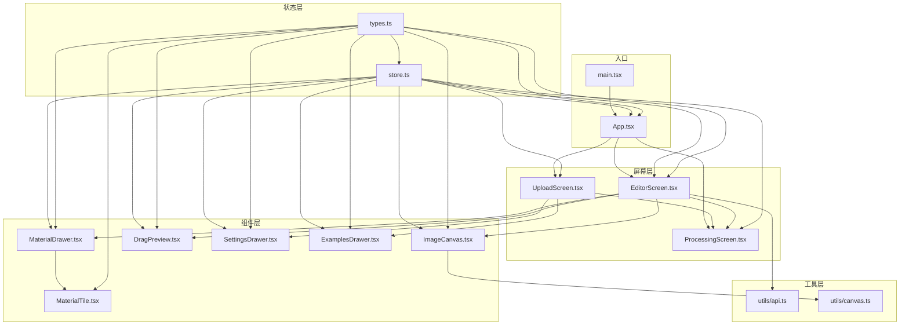
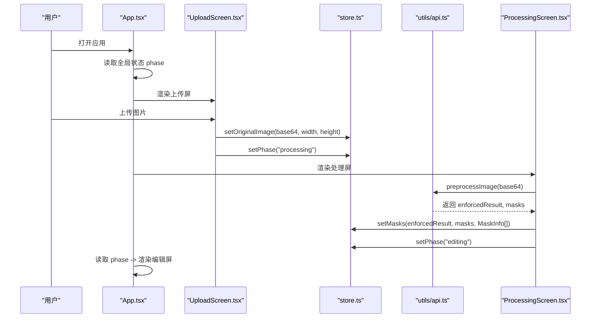
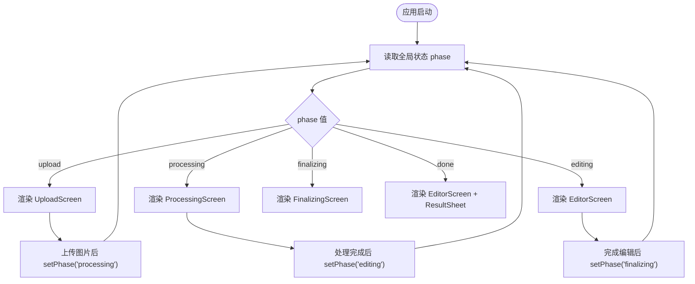
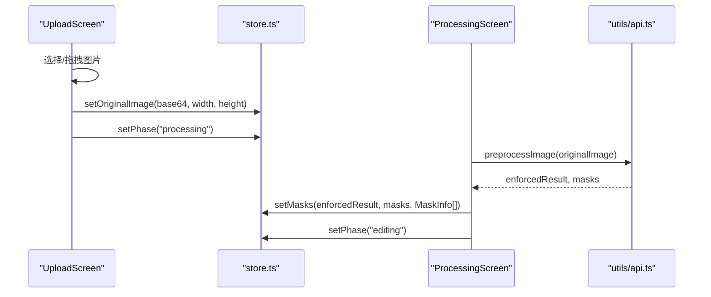
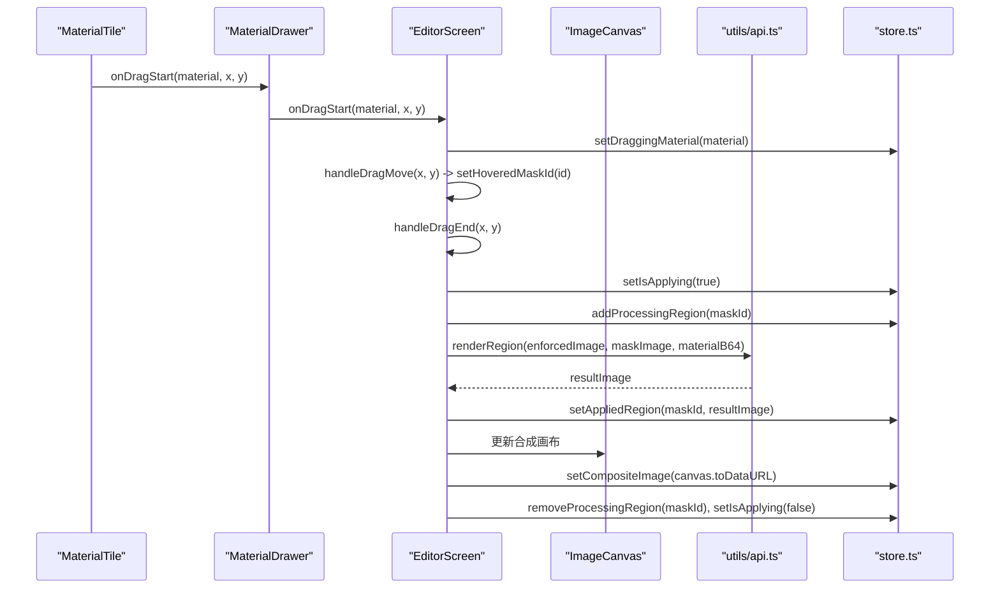
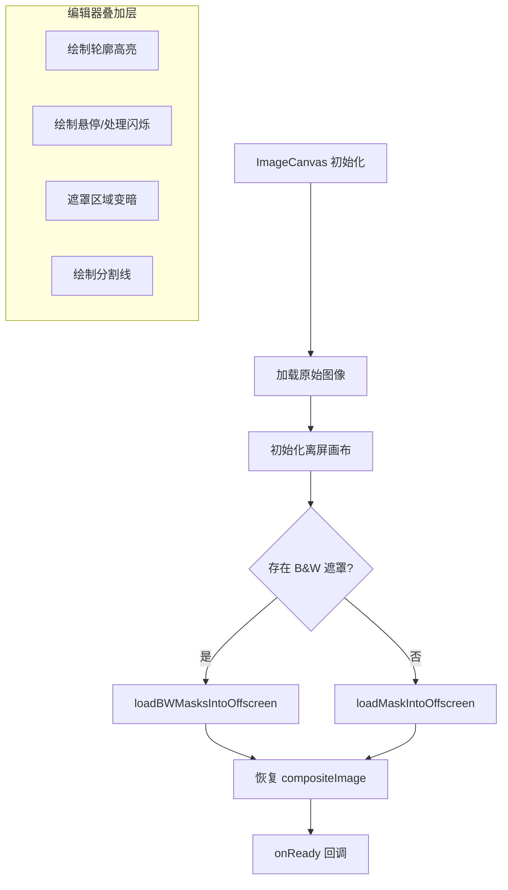
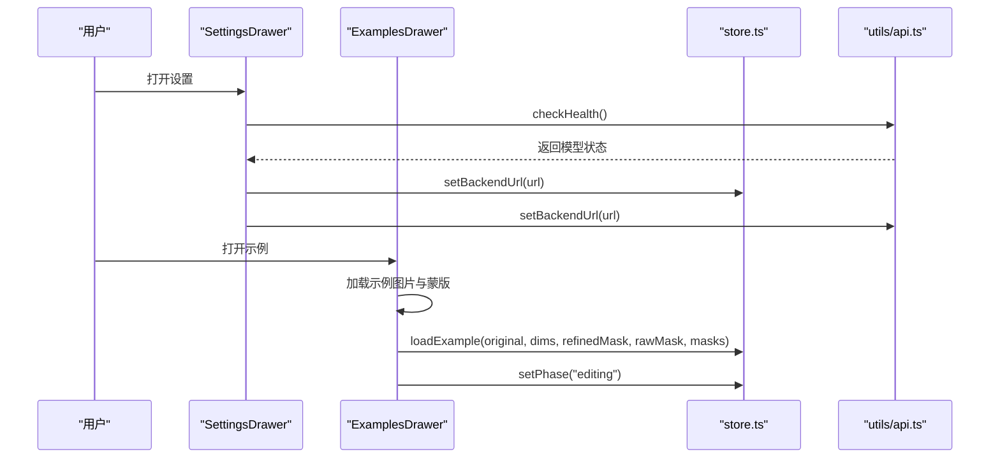
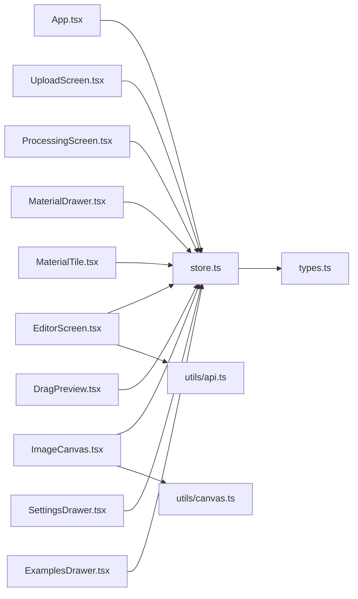

# 组件交互模式

<cite>
**本文档引用的文件**
- [src/App.tsx](file://src/App.tsx)
- [src/store.ts](file://src/store.ts)
- [src/main.tsx](file://src/main.tsx)
- [src/types.ts](file://src/types.ts)
- [src/screes/UploadScreen.tsx](file://src/screens/UploadScreen.tsx)
- [src/screens/ProcessingScreen.tsx](file://src/screens/ProcessingScreen.tsx)
- [src/screens/EditorScreen.tsx](file://src/screens/EditorScreen.tsx)
- [src/components/ImageCanvas.tsx](file://src/components/ImageCanvas.tsx)
- [src/components/MaterialDrawer.tsx](file://src/components/MaterialDrawer.tsx)
- [src/components/MaterialTile.tsx](file://src/components/MaterialTile.tsx)
- [src/components/DragPreview.tsx](file://src/components/DragPreview.tsx)
- [src/components/SettingsDrawer.tsx](file://src/components/SettingsDrawer.tsx)
- [src/components/ExamplesDrawer.tsx](file://src/components/ExamplesDrawer.tsx)
- [src/utils/api.ts](file://src/utils/api.ts)
- [src/utils/canvas.ts](file://src/utils/canvas.ts)
</cite>

## 目录
1. [简介](#简介)
2. [项目结构](#项目结构)
3. [核心组件](#核心组件)
4. [架构总览](#架构总览)
5. [详细组件分析](#详细组件分析)
6. [依赖关系分析](#依赖关系分析)
7. [性能考量](#性能考量)
8. [故障排查指南](#故障排查指南)
9. [结论](#结论)
10. [附录](#附录)

## 简介
本文件围绕 WallChanger 的组件交互模式进行深入技术解析，重点覆盖以下方面：
- 基于 Zustand 的全局状态管理与共享
- 组件间 props 属性传递与回调函数模式
- 事件冒泡与自定义拖拽/指针事件处理
- App.tsx 中的路由切换机制与条件渲染策略
- 不同应用阶段如何通过全局状态控制组件的显示与隐藏
- 组件生命周期管理、内存管理与性能优化策略
- 组件解耦与模块化的最佳实践

## 项目结构
项目采用按功能域分层的组织方式：屏幕级页面组件位于 screens 目录，通用 UI 组件位于 components 目录，工具函数位于 utils 目录；状态管理集中于 store.ts，类型定义集中在 types.ts。

图表来源
- [src/main.tsx:1-11](file://src/main.tsx#L1-L11)
- [src/App.tsx:1-26](file://src/App.tsx#L1-L26)
- [src/store.ts:1-177](file://src/store.ts#L1-L177)
- [src/types.ts:1-88](file://src/types.ts#L1-L88)
- [src/screens/UploadScreen.tsx:1-121](file://src/screens/UploadScreen.tsx#L1-L121)
- [src/screens/ProcessingScreen.tsx:1-120](file://src/screens/ProcessingScreen.tsx#L1-L120)
- [src/screens/EditorScreen.tsx:1-758](file://src/screens/EditorScreen.tsx#L1-L758)
- [src/components/ImageCanvas.tsx:1-91](file://src/components/ImageCanvas.tsx#L1-L91)
- [src/components/MaterialDrawer.tsx:1-136](file://src/components/MaterialDrawer.tsx#L1-L136)
- [src/components/MaterialTile.tsx:1-106](file://src/components/MaterialTile.tsx#L1-L106)
- [src/components/DragPreview.tsx:1-33](file://src/components/DragPreview.tsx#L1-L33)
- [src/components/SettingsDrawer.tsx:1-113](file://src/components/SettingsDrawer.tsx#L1-L113)
- [src/components/ExamplesDrawer.tsx:1-207](file://src/components/ExamplesDrawer.tsx#L1-L207)
- [src/utils/api.ts:1-197](file://src/utils/api.ts#L1-L197)
- [src/utils/canvas.ts:1-903](file://src/utils/canvas.ts#L1-L903)

章节来源
- [src/main.tsx:1-11](file://src/main.tsx#L1-L11)
- [src/App.tsx:1-26](file://src/App.tsx#L1-L26)
- [src/store.ts:1-177](file://src/store.ts#L1-L177)
- [src/types.ts:1-88](file://src/types.ts#L1-L88)

## 核心组件
- 全局状态中心：Zustand store 提供统一的状态存储与更新接口，包含图像数据、处理步骤、遮罩信息、批次模式、调试参数等。
- 应用路由与条件渲染：App.tsx 依据全局状态中的 phase 决定当前展示的屏幕组件。
- 屏幕组件：UploadScreen、ProcessingScreen、EditorScreen 分别负责上传、预处理与编辑阶段的 UI 与交互。
- 画布与遮罩：ImageCanvas 负责渲染基础图像与复合结果；EditorScreen 集成多层叠加画布实现高亮、闪烁、遮罩分割等视觉效果。
- 材质系统：MaterialDrawer 与 MaterialTile 提供材质库拖拽交互；DragPreview 实时预览拖拽效果。
- 设置与示例：SettingsDrawer 管理后端连接；ExamplesDrawer 加载官方示例并注入状态。

章节来源
- [src/store.ts:1-177](file://src/store.ts#L1-L177)
- [src/App.tsx:8-25](file://src/App.tsx#L8-L25)
- [src/screens/UploadScreen.tsx:6-121](file://src/screens/UploadScreen.tsx#L6-L121)
- [src/screens/ProcessingScreen.tsx:22-120](file://src/screens/ProcessingScreen.tsx#L22-L120)
- [src/screens/EditorScreen.tsx:21-758](file://src/screens/EditorScreen.tsx#L21-L758)
- [src/components/ImageCanvas.tsx:15-91](file://src/components/ImageCanvas.tsx#L15-L91)
- [src/components/MaterialDrawer.tsx:15-136](file://src/components/MaterialDrawer.tsx#L15-L136)
- [src/components/MaterialTile.tsx:12-106](file://src/components/MaterialTile.tsx#L12-L106)
- [src/components/DragPreview.tsx:8-33](file://src/components/DragPreview.tsx#L8-L33)
- [src/components/SettingsDrawer.tsx:12-113](file://src/components/SettingsDrawer.tsx#L12-L113)
- [src/components/ExamplesDrawer.tsx:73-207](file://src/components/ExamplesDrawer.tsx#L73-L207)

## 架构总览
WallChanger 采用“状态驱动视图”的单向数据流：全局状态变更触发屏幕组件的条件渲染与子组件的属性更新；屏幕组件通过回调函数更新全局状态，形成闭环。

图表来源
- [src/App.tsx:8-25](file://src/App.tsx#L8-L25)
- [src/screens/UploadScreen.tsx:13-29](file://src/screens/UploadScreen.tsx#L13-L29)
- [src/screens/ProcessingScreen.tsx:34-75](file://src/screens/ProcessingScreen.tsx#L34-L75)
- [src/utils/api.ts:21-37](file://src/utils/api.ts#L21-L37)
- [src/store.ts:68-89](file://src/store.ts#L68-L89)

## 详细组件分析

### 全局状态与路由切换机制
- 状态模型：AppState 定义了 phase、图像数据、遮罩集合、处理步骤、批次模式、调试参数等字段；通过 create 接口导出 useStore。
- 路由切换：App.tsx 仅根据 phase 进行条件渲染，实现“阶段化”的页面切换；每个阶段的进入/离开由对应屏幕组件负责设置 phase。
- 状态持久化：backendUrl、debugPrompts、debugMode 通过 localStorage 持久化，重启后恢复。

图表来源
- [src/App.tsx:8-25](file://src/App.tsx#L8-L25)
- [src/store.ts:63-176](file://src/store.ts#L63-L176)
- [src/screens/UploadScreen.tsx:22-23](file://src/screens/UploadScreen.tsx#L22-L23)
- [src/screens/ProcessingScreen.tsx:62-64](file://src/screens/ProcessingScreen.tsx#L62-L64)
- [src/screens/EditorScreen.tsx:654-659](file://src/screens/EditorScreen.tsx#L654-L659)

章节来源
- [src/types.ts:56-87](file://src/types.ts#L56-L87)
- [src/store.ts:40-61](file://src/store.ts#L40-L61)
- [src/App.tsx:8-25](file://src/App.tsx#L8-L25)

### 上传与预处理流程
- 上传逻辑：UploadScreen 监听拖拽/文件选择事件，读取图片尺寸与 base64，调用 setOriginalImage 并立即切换到 processing 阶段。
- 预处理：ProcessingScreen 在挂载时调用 preprocessImage，接收 enforcedResult 与 masks，生成唯一颜色的 MaskInfo，写入 store 并延时切换到 editing 阶段。
- 错误处理：捕获异常并提示用户返回上传页。

图表来源
- [src/screens/UploadScreen.tsx:13-29](file://src/screens/UploadScreen.tsx#L13-L29)
- [src/screens/ProcessingScreen.tsx:34-75](file://src/screens/ProcessingScreen.tsx#L34-L75)
- [src/utils/api.ts:21-37](file://src/utils/api.ts#L21-L37)
- [src/store.ts:68-89](file://src/store.ts#L68-L89)

章节来源
- [src/screens/UploadScreen.tsx:6-121](file://src/screens/UploadScreen.tsx#L6-L121)
- [src/screens/ProcessingScreen.tsx:22-120](file://src/screens/ProcessingScreen.tsx#L22-L120)
- [src/utils/api.ts:21-37](file://src/utils/api.ts#L21-L37)

### 编辑器与材质拖拽交互
- 拖拽链路：MaterialTile 触发 MaterialDrawer 的 onDragStart/onDragMove/onDragEnd；EditorScreen 将回调透传至 ImageCanvas 与画布叠加层，实现材质拖拽、悬停高亮、遮罩分割与实时合成。
- 状态同步：拖拽过程中通过 setDraggingMaterial、setHoveredMaskId、addProcessingRegion、setAppliedRegion、setCompositeImage 等接口更新全局状态，驱动 UI 反应。
- 性能要点：isApplying 互斥锁确保一次仅执行一个渲染任务；processingRegions 用于批量闪烁动画；compositeImage 作为离屏合成结果缓存，避免重复计算。

图表来源
- [src/components/MaterialTile.tsx:35-89](file://src/components/MaterialTile.tsx#L35-L89)
- [src/components/MaterialDrawer.tsx:15-136](file://src/components/MaterialDrawer.tsx#L15-L136)
- [src/screens/EditorScreen.tsx:258-345](file://src/screens/EditorScreen.tsx#L258-L345)
- [src/components/ImageCanvas.tsx:15-91](file://src/components/ImageCanvas.tsx#L15-L91)
- [src/utils/api.ts:139-154](file://src/utils/api.ts#L139-L154)
- [src/store.ts:107-115](file://src/store.ts#L107-L115)

章节来源
- [src/components/MaterialTile.tsx:12-106](file://src/components/MaterialTile.tsx#L12-L106)
- [src/components/MaterialDrawer.tsx:15-136](file://src/components/MaterialDrawer.tsx#L15-L136)
- [src/screens/EditorScreen.tsx:21-758](file://src/screens/EditorScreen.tsx#L21-L758)
- [src/components/ImageCanvas.tsx:15-91](file://src/components/ImageCanvas.tsx#L15-L91)
- [src/utils/api.ts:139-154](file://src/utils/api.ts#L139-L154)
- [src/store.ts:107-115](file://src/store.ts#L107-L115)

### 画布与遮罩系统
- 初始化：ImageCanvas 在收到原始图像后初始化离屏画布，加载 B&W 遮罩或传统彩色遮罩，并恢复 compositeImage。
- 高亮与闪烁：EditorScreen 通过 canvas 叠加层绘制选中区域轮廓、悬停闪烁、处理中闪烁与遮罩分割线。
- 遮罩命中测试：canvas 工具预先构建 SDF 与命中表，支持像素级命中测试与平滑边缘效果。

图表来源
- [src/components/ImageCanvas.tsx:33-81](file://src/components/ImageCanvas.tsx#L33-L81)
- [src/utils/canvas.ts:718-787](file://src/utils/canvas.ts#L718-L787)
- [src/utils/canvas.ts:346-499](file://src/utils/canvas.ts#L346-L499)
- [src/screens/EditorScreen.tsx:102-255](file://src/screens/EditorScreen.tsx#L102-L255)

章节来源
- [src/components/ImageCanvas.tsx:15-91](file://src/components/ImageCanvas.tsx#L15-L91)
- [src/utils/canvas.ts:188-324](file://src/utils/canvas.ts#L188-L324)
- [src/utils/canvas.ts:346-499](file://src/utils/canvas.ts#L346-L499)
- [src/screens/EditorScreen.tsx:102-255](file://src/screens/EditorScreen.tsx#L102-L255)

### 设置与示例抽屉
- 设置抽屉：维护后端地址与健康检查状态，保存时同步到 store 与全局 API 客户端。
- 示例抽屉：加载官方示例图片与蒙版，解析蒙版颜色生成 MaskInfo，调用 loadExample 注入状态并进入 editing 阶段。

图表来源
- [src/components/SettingsDrawer.tsx:12-113](file://src/components/SettingsDrawer.tsx#L12-L113)
- [src/utils/api.ts:9-13](file://src/utils/api.ts#L9-L13)
- [src/components/ExamplesDrawer.tsx:73-207](file://src/components/ExamplesDrawer.tsx#L73-L207)
- [src/store.ts:150-165](file://src/store.ts#L150-L165)

章节来源
- [src/components/SettingsDrawer.tsx:12-113](file://src/components/SettingsDrawer.tsx#L12-L113)
- [src/components/ExamplesDrawer.tsx:73-207](file://src/components/ExamplesDrawer.tsx#L73-L207)
- [src/store.ts:150-165](file://src/store.ts#L150-L165)

## 依赖关系分析
- 组件耦合度：App.tsx 仅依赖全局状态进行条件渲染，耦合度低；各屏幕组件通过 useStore 读写状态，保持内聚性。
- 数据流向：从 UploadScreen/ExamplesDrawer 写入状态，到 ProcessingScreen/EditorScreen 读取并进一步写回，形成清晰的单向数据流。
- 外部依赖：API 工具封装后端请求；canvas 工具封装离屏画布与遮罩算法，二者均通过全局 URL 配置与状态同步。

图表来源
- [src/App.tsx:1-26](file://src/App.tsx#L1-L26)
- [src/store.ts:1-177](file://src/store.ts#L1-L177)
- [src/screens/UploadScreen.tsx:1-121](file://src/screens/UploadScreen.tsx#L1-L121)
- [src/screens/ProcessingScreen.tsx:1-120](file://src/screens/ProcessingScreen.tsx#L1-L120)
- [src/screens/EditorScreen.tsx:1-758](file://src/screens/EditorScreen.tsx#L1-L758)
- [src/components/ImageCanvas.tsx:1-91](file://src/components/ImageCanvas.tsx#L1-L91)
- [src/components/MaterialDrawer.tsx:1-136](file://src/components/MaterialDrawer.tsx#L1-L136)
- [src/components/MaterialTile.tsx:1-106](file://src/components/MaterialTile.tsx#L1-L106)
- [src/components/DragPreview.tsx:1-33](file://src/components/DragPreview.tsx#L1-L33)
- [src/components/SettingsDrawer.tsx:1-113](file://src/components/SettingsDrawer.tsx#L1-L113)
- [src/components/ExamplesDrawer.tsx:1-207](file://src/components/ExamplesDrawer.tsx#L1-L207)
- [src/utils/api.ts:1-197](file://src/utils/api.ts#L1-L197)
- [src/utils/canvas.ts:1-903](file://src/utils/canvas.ts#L1-L903)
- [src/types.ts:1-88](file://src/types.ts#L1-L88)

章节来源
- [src/App.tsx:1-26](file://src/App.tsx#L1-L26)
- [src/store.ts:1-177](file://src/store.ts#L1-L177)

## 性能考量
- 状态粒度：将 processingRegions、appliedRegions 以 Set/Map 存储，便于快速增删与遍历，降低渲染抖动。
- 合成缓存：compositeImage 作为合成结果缓存，避免重复绘制；ImageCanvas 在 compositeImage 更新时仅增量绘制。
- 动画帧控：使用 requestAnimationFrame 控制闪烁与高亮动画，配合取消逻辑防止内存泄漏。
- 互斥锁：isApplying 防止并发渲染请求；ResizeObserver 管理容器尺寸变化，减少无效重排。
- 图像与遮罩：B&W 遮罩管线优先，离屏画布一次性加载，命中测试与 SDF 预计算降低运行时成本。

章节来源
- [src/store.ts:51-52](file://src/store.ts#L51-L52)
- [src/store.ts:107-115](file://src/store.ts#L107-L115)
- [src/components/ImageCanvas.tsx:20-31](file://src/components/ImageCanvas.tsx#L20-L31)
- [src/screens/EditorScreen.tsx:229-255](file://src/screens/EditorScreen.tsx#L229-L255)
- [src/utils/canvas.ts:188-324](file://src/utils/canvas.ts#L188-L324)

## 故障排查指南
- 后端连接失败：在设置抽屉中测试连接，查看健康检查返回的模型加载状态；确认 backendUrl 正确且跨域允许。
- 预处理失败：检查原始图像格式与尺寸；查看 ProcessingScreen 的错误提示并返回上传页重新尝试。
- 拖拽无效：确认 MaterialDrawer 的 onDragStart/onDragMove/onDragEnd 回调链路完整；检查 setBackendUrl 是否正确设置。
- 遮罩命中异常：确认 loadBWMasksIntoOffscreen 或 loadMaskIntoOffscreen 已正确初始化；检查 precomputeMaskOutlines 是否在 canvasReady 后执行。

章节来源
- [src/components/SettingsDrawer.tsx:18-28](file://src/components/SettingsDrawer.tsx#L18-L28)
- [src/screens/ProcessingScreen.tsx:65-71](file://src/screens/ProcessingScreen.tsx#L65-L71)
- [src/components/MaterialDrawer.tsx:26-33](file://src/components/MaterialDrawer.tsx#L26-L33)
- [src/utils/canvas.ts:188-198](file://src/utils/canvas.ts#L188-L198)

## 结论
WallChanger 的组件交互以 Zustand 全局状态为核心，通过 App.tsx 的条件渲染实现阶段化路由，结合屏幕组件与工具函数形成清晰的数据流与交互链路。材质拖拽、遮罩命中与画布合成等复杂逻辑通过状态与回调解耦，既保证了可维护性，也兼顾了性能与用户体验。建议在后续迭代中继续细化错误边界与日志埋点，完善批处理与撤销/重做能力。

## 附录
- 最佳实践清单
  - 使用 Set/Map 管理可变集合，避免频繁深拷贝
  - 通过互斥锁与节流控制昂贵操作
  - 将 UI 动画与计算分离，使用 requestAnimationFrame
  - 保持回调链路稳定，避免闭包陷阱
  - 对外设 API 的调用统一收敛到工具模块，便于替换与测试