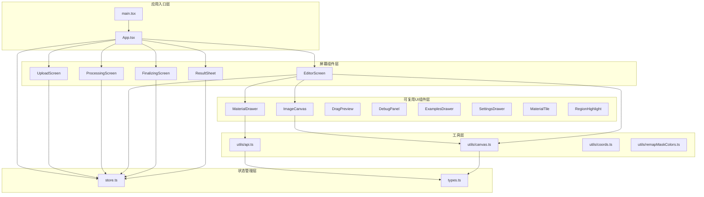
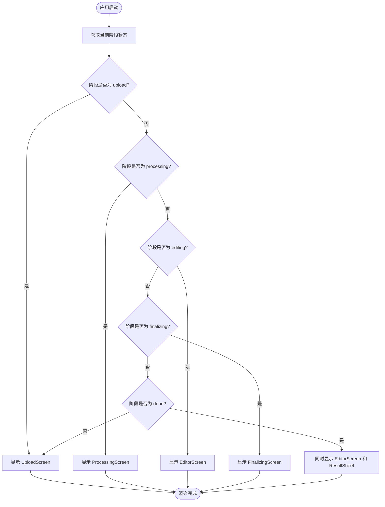
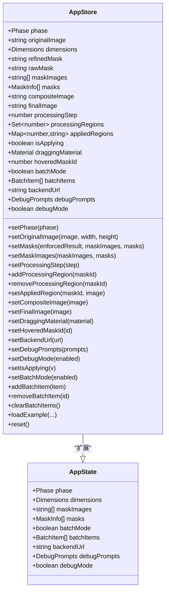
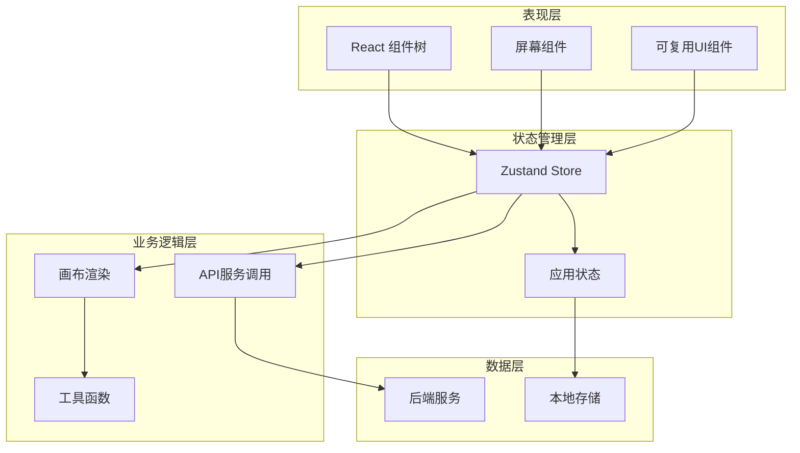
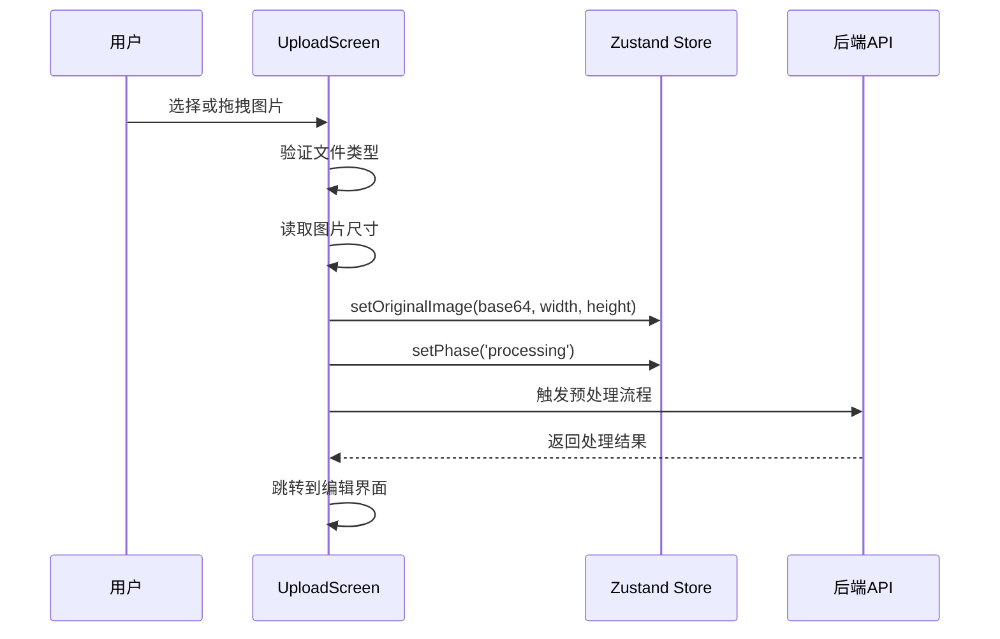
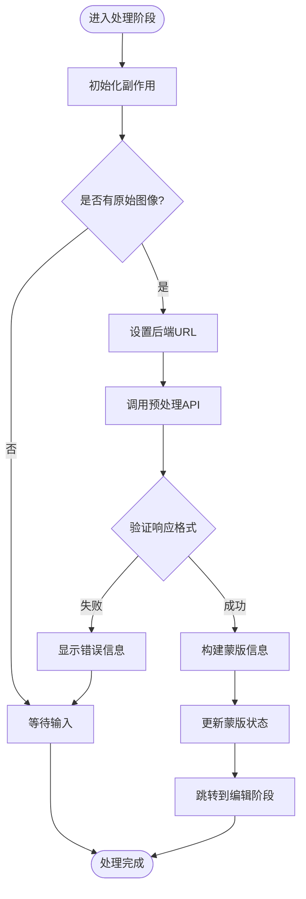
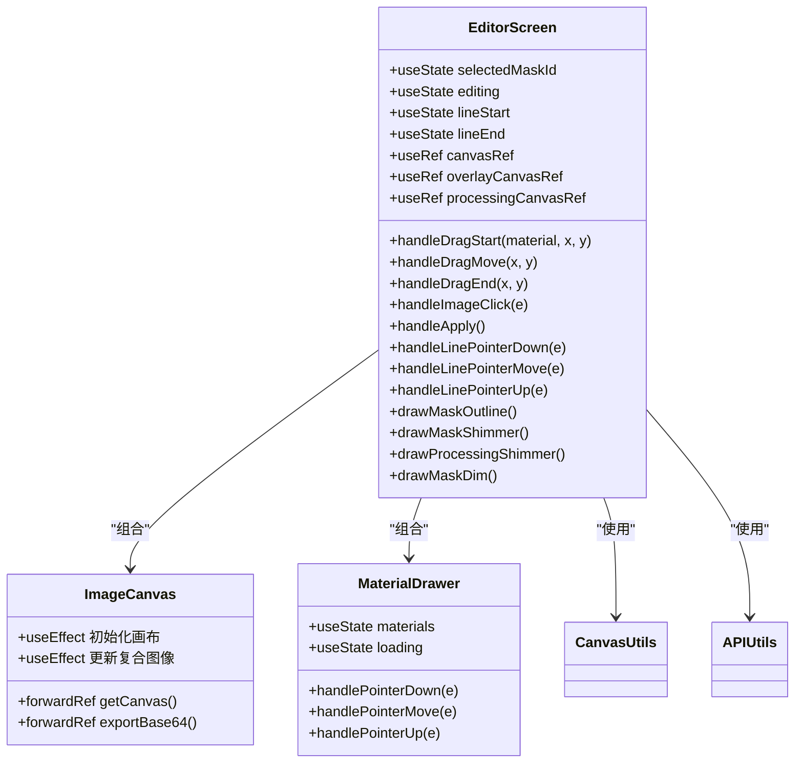
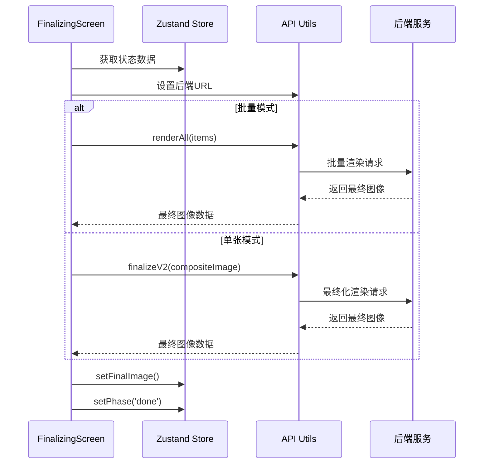
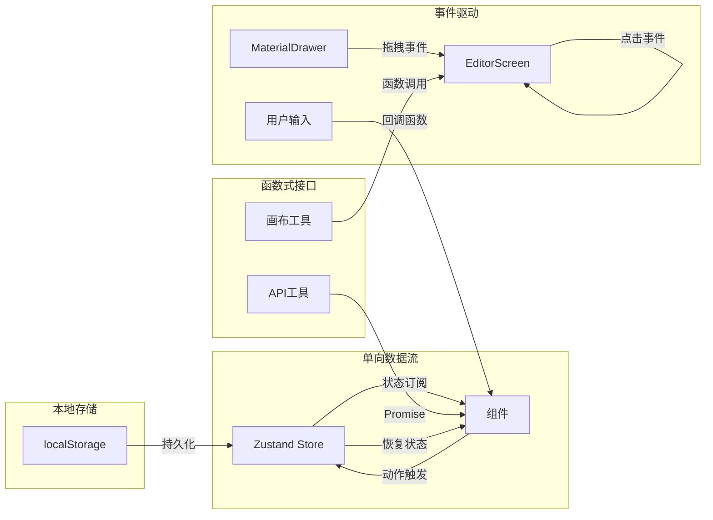

# 组件架构设计

<cite>
**本文档引用的文件**
- [src\App.tsx](file://src\App.tsx)
- [src\main.tsx](file://src\main.tsx)
- [src\store.ts](file://src\store.ts)
- [src\types.ts](file://src\types.ts)
- [src\screens\UploadScreen.tsx](file://src\screens\UploadScreen.tsx)
- [src\screens\ProcessingScreen.tsx](file://src\screens\ProcessingScreen.tsx)
- [src\screens\EditorScreen.tsx](file://src\screens\EditorScreen.tsx)
- [src\screens\FinalizingScreen.tsx](file://src\screens\FinalizingScreen.tsx)
- [src\screens\ResultSheet.tsx](file://src\screens\ResultSheet.tsx)
- [src\components\ImageCanvas.tsx](file://src\components\ImageCanvas.tsx)
- [src\components\MaterialDrawer.tsx](file://src\components\MaterialDrawer.tsx)
- [src\utils\api.ts](file://src\utils\api.ts)
- [src\utils\canvas.ts](file://src\utils\canvas.ts)
</cite>

## 目录
1. [简介](#简介)
2. [项目结构](#项目结构)
3. [核心组件](#核心组件)
4. [架构总览](#架构总览)
5. [详细组件分析](#详细组件分析)
6. [依赖关系分析](#依赖关系分析)
7. [性能考虑](#性能考虑)
8. [故障排除指南](#故障排除指南)
9. [结论](#结论)

## 简介

WallChanger 是一个基于 React 的室内材质替换应用，采用函数组件和 Hooks 设计模式，通过 Zustand 状态管理实现清晰的组件职责分离。该应用实现了从图像上传、AI 自动分割、材质拖拽替换到最终渲染输出的完整工作流。

## 项目结构

项目采用按功能模块组织的目录结构，主要分为以下层次：

**图表来源**
- [src\main.tsx:1-11](file://src\main.tsx#L1-L11)
- [src\App.tsx:1-26](file://src\App.tsx#L1-L26)
- [src\store.ts:1-177](file://src\store.ts#L1-L177)

**章节来源**
- [src\main.tsx:1-11](file://src\main.tsx#L1-L11)
- [src\App.tsx:1-26](file://src\App.tsx#L1-L26)

## 核心组件

### 应用主组件 App.tsx

App.tsx 作为整个应用的根组件，采用条件渲染模式根据应用状态切换不同的屏幕组件：

**图表来源**
- [src\App.tsx:8-25](file://src\App.tsx#L8-L25)

### 状态管理 Store.ts

使用 Zustand 实现集中式状态管理，包含应用的所有状态和操作方法：

**图表来源**
- [src\store.ts:5-28](file://src\store.ts#L5-L28)
- [src\types.ts:57-88](file://src\types.ts#L57-L88)

**章节来源**
- [src\store.ts:1-177](file://src\store.ts#L1-L177)
- [src\types.ts:1-89](file://src\types.ts#L1-L89)

## 架构总览

系统采用分层架构设计，各层职责明确：

**图表来源**
- [src\App.tsx:1-26](file://src\App.tsx#L1-L26)
- [src\store.ts:63-176](file://src\store.ts#L63-L176)

## 详细组件分析

### UploadScreen 上传屏幕

UploadScreen 负责处理用户图像上传和初始配置：

**图表来源**
- [src\screens\UploadScreen.tsx:13-29](file://src\screens\UploadScreen.tsx#L13-L29)
- [src\screens\UploadScreen.tsx:6-7](file://src\screens\UploadScreen.tsx#L6-L7)

**章节来源**
- [src\screens\UploadScreen.tsx:1-121](file://src\screens\UploadScreen.tsx#L1-L121)

### ProcessingScreen 处理屏幕

ProcessingScreen 实现 AI 图像处理和蒙版生成：

**图表来源**
- [src\screens\ProcessingScreen.tsx:34-90](file://src\screens\ProcessingScreen.tsx#L34-L90)

**章节来源**
- [src\screens\ProcessingScreen.tsx:1-135](file://src\screens\ProcessingScreen.tsx#L1-L135)

### EditorScreen 编辑屏幕

EditorScreen 是最复杂的屏幕组件，实现材质拖拽、区域分割和实时渲染：

**图表来源**
- [src\screens\EditorScreen.tsx:21-51](file://src\screens\EditorScreen.tsx#L21-L51)
- [src\components\ImageCanvas.tsx:15-31](file://src\components\ImageCanvas.tsx#L15-L31)
- [src\components\MaterialDrawer.tsx:15-13](file://src\components\MaterialDrawer.tsx#L15-L13)

**章节来源**
- [src\screens\EditorScreen.tsx:1-758](file://src\screens\EditorScreen.tsx#L1-L758)
- [src\components\ImageCanvas.tsx:1-91](file://src\components\ImageCanvas.tsx#L1-L91)
- [src\components\MaterialDrawer.tsx:1-136](file://src\components\MaterialDrawer.tsx#L1-L136)

### FinalizingScreen 最终化屏幕

FinalizingScreen 处理批量渲染和最终图像生成：

**图表来源**
- [src\screens\FinalizingScreen.tsx:19-60](file://src\screens\FinalizingScreen.tsx#L19-L60)

**章节来源**
- [src\screens\FinalizingScreen.tsx:1-82](file://src\screens\FinalizingScreen.tsx#L1-L82)

### ResultSheet 结果展示

ResultSheet 提供最终图像的查看和保存功能：

**章节来源**
- [src\screens\ResultSheet.tsx:1-60](file://src\screens\ResultSheet.tsx#L1-L60)

## 依赖关系分析

### 组件间通信模式

系统采用多种通信模式确保组件间的松耦合：

**图表来源**
- [src\store.ts:63-176](file://src\store.ts#L63-L176)
- [src\utils\api.ts:1-200](file://src\utils\api.ts#L1-L200)

### 状态共享机制

状态管理采用集中式设计，通过 Zustand 提供响应式状态更新：

**章节来源**
- [src\store.ts:1-177](file://src\store.ts#L1-L177)
- [src\types.ts:14-88](file://src\types.ts#L14-L88)

## 性能考虑

### 渲染优化策略

1. **条件渲染**: 使用阶段状态精确控制组件渲染
2. **懒加载**: 图像和材质按需加载
3. **画布缓存**: 使用离屏画布减少重复计算
4. **防抖节流**: 处理高频事件如鼠标移动

### 内存管理

- 及时清理图像URL对象
- 合理使用 Refs 避免不必要的重渲染
- 控制画布尺寸与图像分辨率匹配

## 故障排除指南

### 常见问题及解决方案

1. **后端连接失败**
   - 检查后端服务状态
   - 验证 API 端点可达性
   - 确认跨域配置正确

2. **图像处理超时**
   - 检查网络连接稳定性
   - 验证图像格式支持
   - 监控后端模型加载状态

3. **材质拖拽异常**
   - 确认画布尺寸计算正确
   - 检查坐标转换逻辑
   - 验证蒙版命中检测

**章节来源**
- [src\screens\ProcessingScreen.tsx:80-85](file://src\screens\ProcessingScreen.tsx#L80-L85)
- [src\screens\FinalizingScreen.tsx:40-59](file://src\screens\FinalizingScreen.tsx#L40-L59)

## 结论

WallChanger 的组件架构展现了现代 React 应用的最佳实践：

1. **清晰的职责分离**: 屏幕组件专注于界面逻辑，可复用组件关注通用功能
2. **状态管理简洁**: Zustand 提供轻量级但强大的状态管理
3. **异步处理优雅**: 通过 Promise 和状态管理处理复杂的异步流程
4. **性能优化到位**: 画布渲染、内存管理和渲染优化策略完善

该架构为后续功能扩展提供了良好的基础，特别是在批量处理、多材质支持和高级编辑功能方面具有很大的扩展潜力。