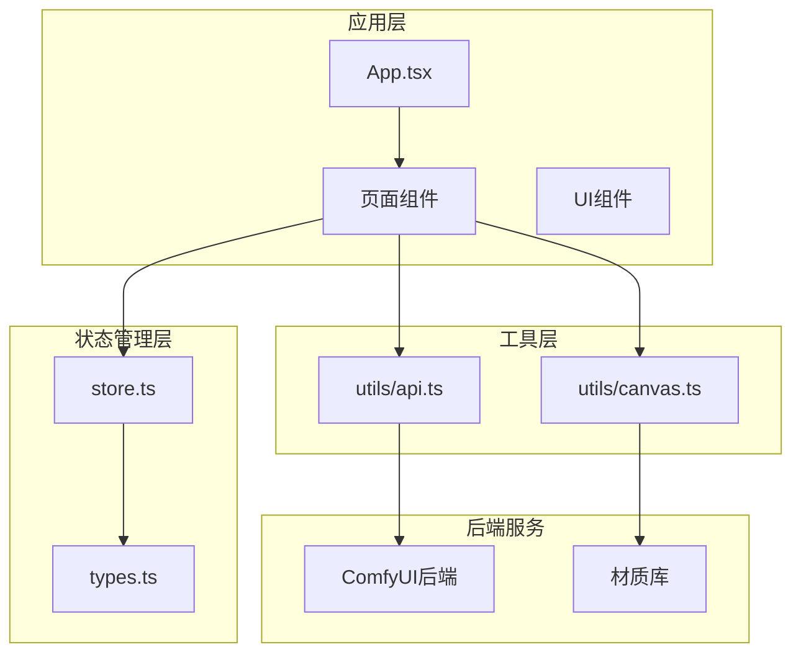
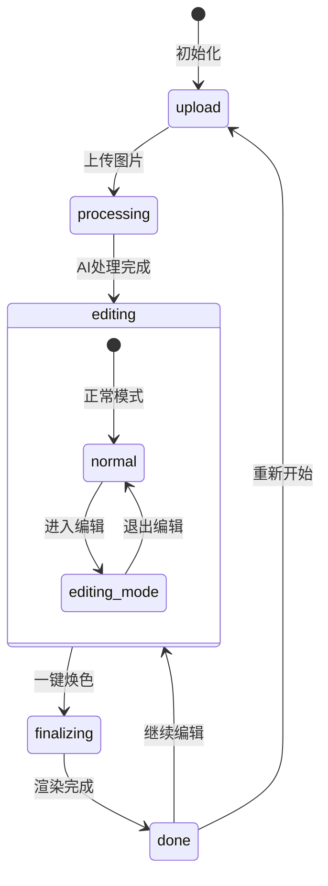
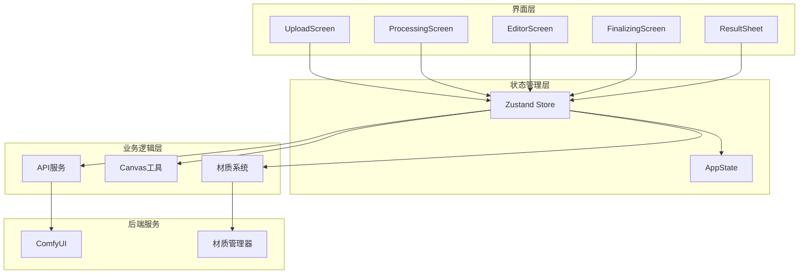
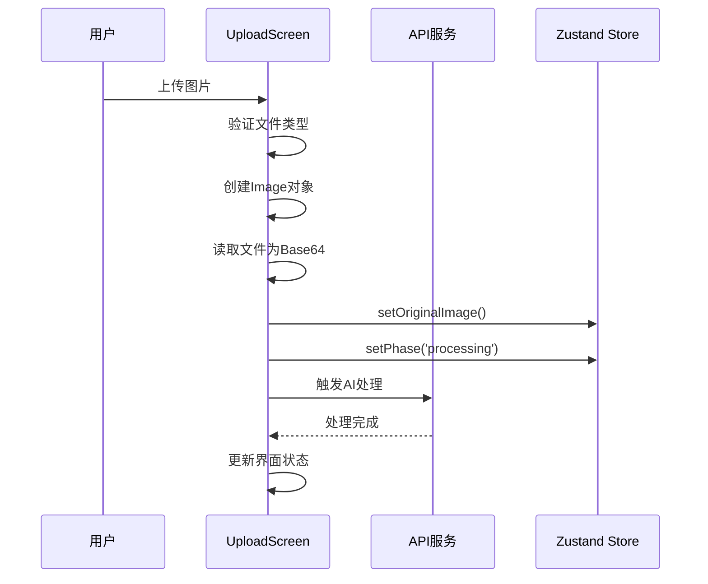
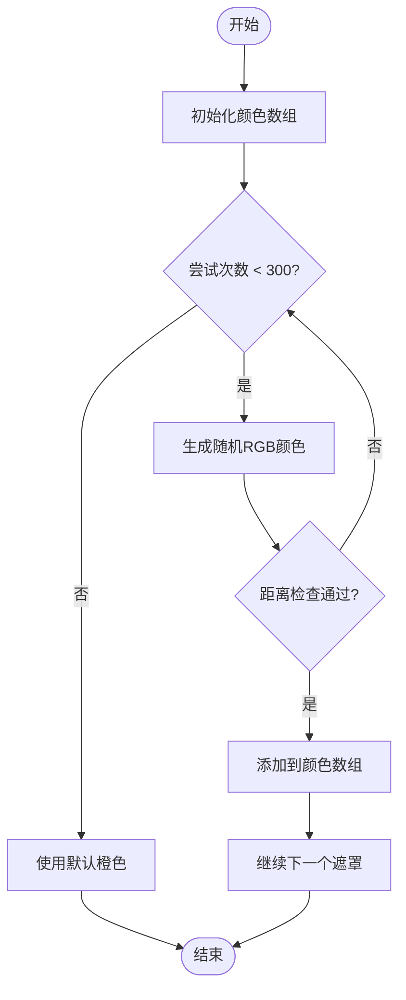
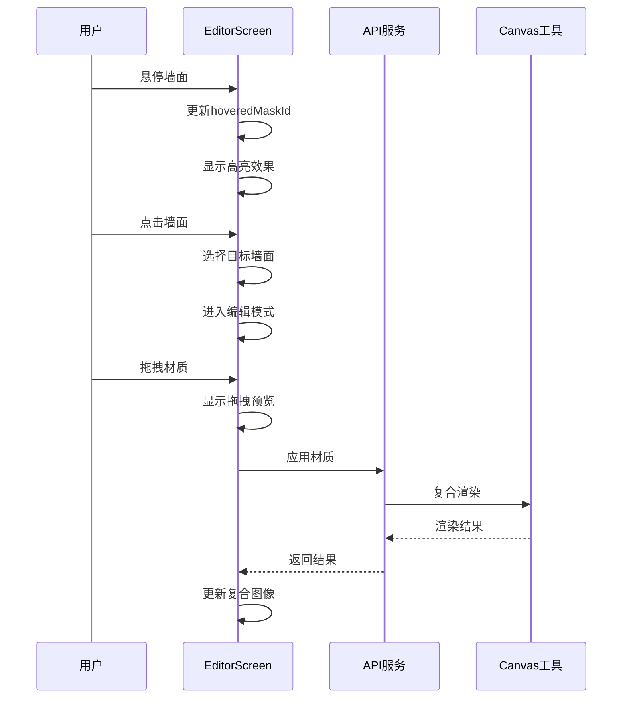
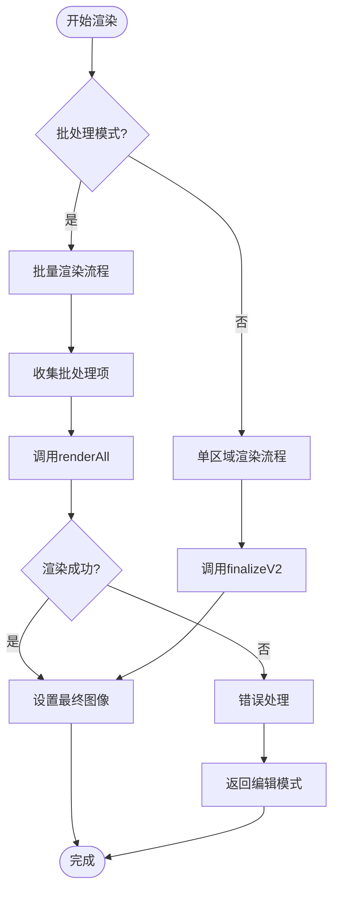
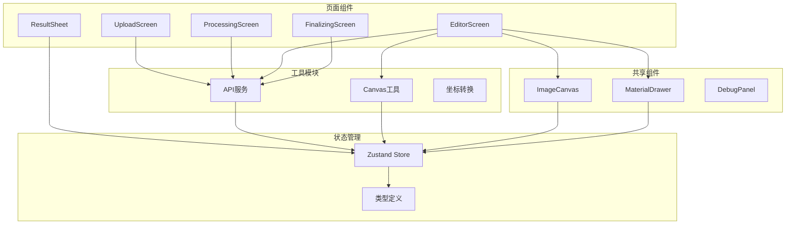
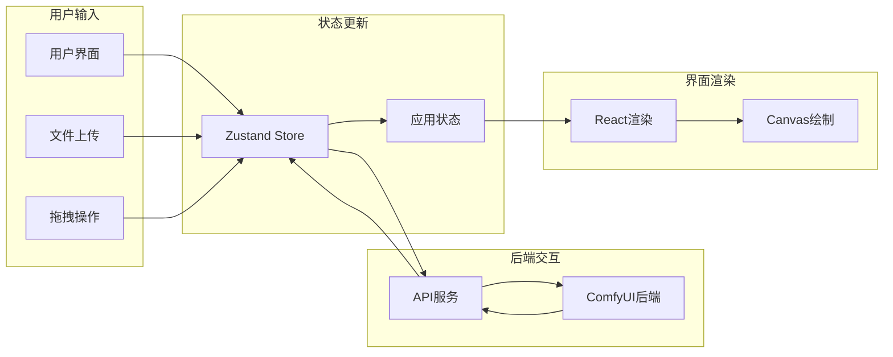

# 页面级组件

<cite>
**本文档引用的文件**
- [UploadScreen.tsx](file://src/screens/UploadScreen.tsx)
- [ProcessingScreen.tsx](file://src/screens/ProcessingScreen.tsx)
- [EditorScreen.tsx](file://src/screens/EditorScreen.tsx)
- [FinalizingScreen.tsx](file://src/screens/FinalizingScreen.tsx)
- [ResultSheet.tsx](file://src/screens/ResultSheet.tsx)
- [store.ts](file://src/store.ts)
- [types.ts](file://src/types.ts)
- [api.ts](file://src/utils/api.ts)
- [canvas.ts](file://src/utils/canvas.ts)
- [ImageCanvas.tsx](file://src/components/ImageCanvas.tsx)
- [MaterialDrawer.tsx](file://src/components/MaterialDrawer.tsx)
- [App.tsx](file://src/App.tsx)
</cite>

## 目录
1. [简介](#简介)
2. [项目结构](#项目结构)
3. [核心组件](#核心组件)
4. [架构概览](#架构概览)
5. [详细组件分析](#详细组件分析)
6. [依赖关系分析](#依赖关系分析)
7. [性能考虑](#性能考虑)
8. [故障排除指南](#故障排除指南)
9. [结论](#结论)

## 简介

WallChanger 是一个基于 React 和 TypeScript 构建的墙面装饰应用，允许用户上传室内照片并通过 AI 技术进行墙面材质替换和渲染。该应用采用五阶段工作流：上传、AI 处理、编辑、最终渲染和结果展示。

应用的核心特色包括：
- 实时 AI 面部识别和墙面分割
- 交互式墙面编辑和材质拖拽
- 高质量的最终渲染输出
- 支持批量处理模式
- 完整的调试和可视化功能

## 项目结构

应用采用模块化设计，主要分为以下几个层次：

**图表来源**
- [App.tsx:1-26](file://src/App.tsx#L1-L26)
- [store.ts:1-177](file://src/store.ts#L1-L177)

**章节来源**
- [App.tsx:1-26](file://src/App.tsx#L1-L26)
- [store.ts:1-177](file://src/store.ts#L1-L177)

## 核心组件

### 状态管理架构

应用使用 Zustand 进行状态管理，实现了完整的五阶段工作流控制：

**图表来源**
- [types.ts:13](file://src/types.ts#L13)
- [store.ts:40-61](file://src/store.ts#L40-L61)

### 全局状态结构

应用的核心状态包括：

- **图像数据**: 原始图像、处理后的图像、遮罩数据
- **处理状态**: 当前处理步骤、进行中的区域集合
- **交互状态**: 拖拽的材质、悬停的遮罩、批处理模式
- **配置信息**: 后端 URL、调试提示词、调试模式

**章节来源**
- [types.ts:56-87](file://src/types.ts#L56-L87)
- [store.ts:40-61](file://src/store.ts#L40-L61)

## 架构概览

应用采用分层架构设计，各层职责明确：

**图表来源**
- [App.tsx:8-25](file://src/App.tsx#L8-L25)
- [store.ts:63-176](file://src/store.ts#L63-L176)

## 详细组件分析

### UploadScreen 组件

UploadScreen 是应用的入口组件，负责文件上传和初始设置。

#### 功能特性

1. **文件上传处理**
   - 支持拖拽上传和点击选择
   - 图片格式验证和尺寸获取
   - Base64 编码和对象 URL 管理

2. **用户界面**
   - 现代化的深色主题设计
   - 设置抽屉和示例图片功能
   - 调试模式开关

3. **状态管理**
   - 将原始图像存储到全局状态
   - 自动切换到处理阶段

#### 核心实现流程

**图表来源**
- [UploadScreen.tsx:13-29](file://src/screens/UploadScreen.tsx#L13-L29)
- [store.ts:68-76](file://src/store.ts#L68-L76)

**章节来源**
- [UploadScreen.tsx:1-121](file://src/screens/UploadScreen.tsx#L1-L121)

### ProcessingScreen 组件

ProcessingScreen 负责调用 AI 服务进行图像处理和遮罩生成。

#### 处理流程

1. **预处理阶段**
   - 调用 `preprocessImage` API
   - 验证响应数据的有效性
   - 生成唯一的遮罩颜色

2. **遮罩处理**
   - 为每个二值化遮罩分配唯一颜色
   - 构建 `MaskInfo` 数组
   - 存储到全局状态

3. **错误处理**
   - 完整的异常捕获机制
   - 用户友好的错误提示
   - 自动回退到上传阶段

#### 颜色生成算法

**图表来源**
- [ProcessingScreen.tsx:7-20](file://src/screens/ProcessingScreen.tsx#L7-L20)

**章节来源**
- [ProcessingScreen.tsx:1-120](file://src/screens/ProcessingScreen.tsx#L1-L120)

### EditorScreen 组件

EditorScreen 是应用的核心交互组件，提供丰富的编辑功能。

#### 主要功能模块

1. **图像显示系统**
   - ImageCanvas 组件管理主画布
   - 多层叠加显示（原图、遮罩、处理效果）
   - 响应式布局适配

2. **遮罩编辑功能**
   - 点击选择特定墙面
   - 线条分割功能
   - 实时预览效果

3. **材质应用系统**
   - 物料拖拽和放置
   - 批量处理模式
   - 实时渲染反馈

#### 交互流程

**图表来源**
- [EditorScreen.tsx:258-345](file://src/screens/EditorScreen.tsx#L258-L345)
- [canvas.ts:831-902](file://src/utils/canvas.ts#L831-L902)

#### 编辑模式详解

EditorScreen 提供两种主要编辑模式：

1. **正常模式**
   - 材质抽屉展开
   - 可视化材质预览
   - 单区域材质应用

2. **编辑模式**
   - 线条分割工具
   - 实时预览分割效果
   - 区域重置功能

**章节来源**
- [EditorScreen.tsx:1-758](file://src/screens/EditorScreen.tsx#L1-L758)

### FinalizingScreen 组件

FinalizingScreen 负责最终的图像渲染和优化。

#### 渲染策略

1. **单区域渲染**
   - 调用 `finalizeV2` API
   - 生成高质量最终图像
   - 错误恢复机制

2. **批量渲染**
   - 调用 `renderAll` API
   - 并行处理多个区域
   - 性能优化计时

#### 性能监控

**图表来源**
- [FinalizingScreen.tsx:18-59](file://src/screens/FinalizingScreen.tsx#L18-L59)

**章节来源**
- [FinalizingScreen.tsx:1-81](file://src/screens/FinalizingScreen.tsx#L1-L81)

### ResultSheet 组件

ResultSheet 提供最终结果的展示和下载功能。

#### 功能特性

1. **结果展示**
   - 全屏显示最终图像
   - 平滑动画过渡
   - 响应式布局

2. **用户操作**
   - 保存图片功能
   - 继续编辑选项
   - 关闭界面功能

3. **状态集成**
   - 与全局状态完全集成
   - 自动显示最新结果
   - 无缝切换界面

**章节来源**
- [ResultSheet.tsx:1-60](file://src/screens/ResultSheet.tsx#L1-L60)

## 依赖关系分析

### 组件间依赖关系

**图表来源**
- [App.tsx:8-25](file://src/App.tsx#L8-L25)
- [EditorScreen.tsx:1-12](file://src/screens/EditorScreen.tsx#L1-L12)

### 数据流分析

应用的数据流遵循单向数据流原则：

**图表来源**
- [store.ts:63-176](file://src/store.ts#L63-L176)
- [api.ts:1-197](file://src/utils/api.ts#L1-L197)

**章节来源**
- [store.ts:1-177](file://src/store.ts#L1-L177)
- [api.ts:1-197](file://src/utils/api.ts#L1-L197)

## 性能考虑

### 渲染优化策略

1. **Canvas 性能优化**
   - 使用离屏 Canvas 减少主线程压力
   - 预计算 SDF 数据避免重复计算
   - 按需更新画布内容

2. **内存管理**
   - 及时释放对象 URL
   - 合理的图像缓存策略
   - 避免内存泄漏

3. **网络请求优化**
   - 批量处理减少请求次数
   - 错误重试机制
   - 超时控制

### 状态管理优化

1. **状态分片**
   - 将大对象拆分为小状态片段
   - 避免不必要的重渲染
   - 使用选择器优化订阅

2. **异步处理**
   - 使用信号对象防止竞态条件
   - 及时清理异步任务
   - 错误边界处理

## 故障排除指南

### 常见问题及解决方案

1. **AI 处理失败**
   - 检查后端服务连接
   - 验证图像格式和大小
   - 查看控制台错误日志

2. **材质应用异常**
   - 确认材质文件存在
   - 检查网络连接
   - 验证材质权限

3. **渲染性能问题**
   - 减少同时处理的区域数量
   - 降低图像分辨率
   - 关闭调试模式

### 调试功能

应用提供了完整的调试支持：

- **调试模式开关**: 控制额外的可视化信息
- **调试面板**: 显示内部状态和性能指标
- **错误报告**: 详细的错误信息和堆栈跟踪

**章节来源**
- [ProcessingScreen.tsx:65-70](file://src/screens/ProcessingScreen.tsx#L65-L70)
- [FinalizingScreen.tsx:39-43](file://src/screens/FinalizingScreen.tsx#L39-L43)

## 结论

WallChanger 页面级组件展现了现代前端应用的最佳实践：

1. **清晰的架构设计**: 分层架构确保了代码的可维护性和可扩展性
2. **完善的错误处理**: 全面的异常捕获和用户友好的错误提示
3. **优秀的用户体验**: 流畅的交互和即时的视觉反馈
4. **高性能实现**: 优化的渲染策略和资源管理

该应用为类似图像处理和 AI 应用提供了优秀的参考实现，特别是在状态管理、组件设计和性能优化方面都具有很高的学习价值。