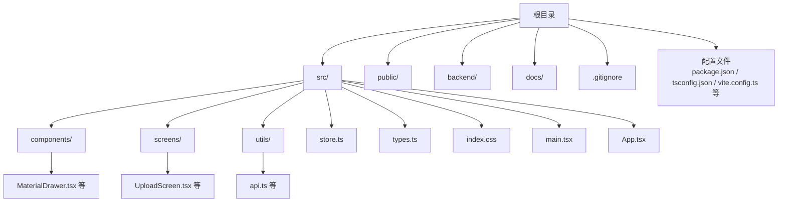
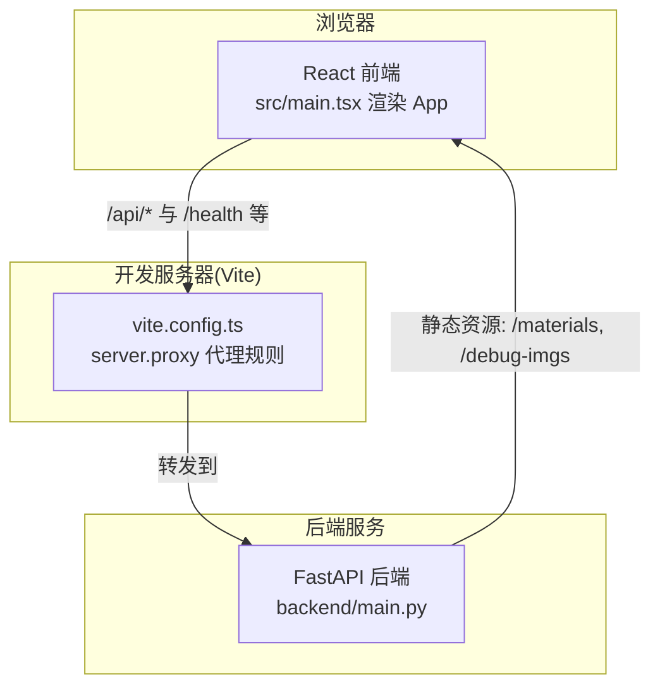
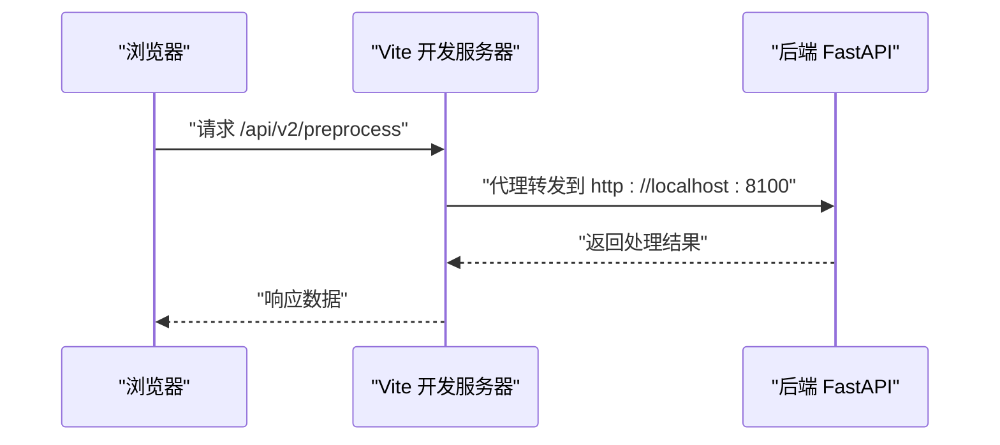
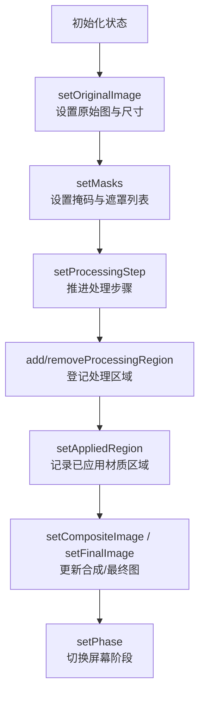
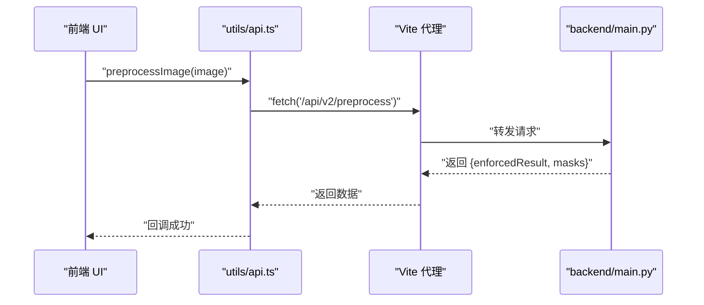
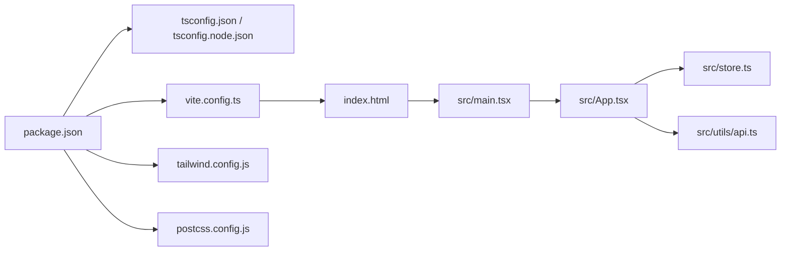

# 项目结构与组织

<cite>
**本文引用的文件**
- [package.json](file://package.json)
- [tsconfig.json](file://tsconfig.json)
- [tsconfig.node.json](file://tsconfig.node.json)
- [vite.config.ts](file://vite.config.ts)
- [tailwind.config.js](file://tailwind.config.js)
- [postcss.config.js](file://postcss.config.js)
- [index.html](file://index.html)
- [src/main.tsx](file://src/main.tsx)
- [src/App.tsx](file://src/App.tsx)
- [src/store.ts](file://src/store.ts)
- [src/types.ts](file://src/types.ts)
- [src/index.css](file://src/index.css)
- [src/utils/api.ts](file://src/utils/api.ts)
- [src/components/MaterialDrawer.tsx](file://src/components/MaterialDrawer.tsx)
- [src/screens/UploadScreen.tsx](file://src/screens/UploadScreen.tsx)
- [backend/main.py](file://backend/main.py)
</cite>

## 目录
1. [引言](#引言)
2. [项目结构](#项目结构)
3. [核心组件](#核心组件)
4. [架构总览](#架构总览)
5. [详细组件分析](#详细组件分析)
6. [依赖分析](#依赖分析)
7. [性能考虑](#性能考虑)
8. [故障排除指南](#故障排除指南)
9. [结论](#结论)
10. [附录](#附录)

## 引言
本文件面向 WallChanger 项目的开发者与维护者，系统性梳理前端工程的目录组织原则、TypeScript 编译配置、Vite 构建与开发服务器配置、CSS 工具链集成，以及 package.json 中的依赖与脚本命令。同时阐明 src/ 下 components/、screens/、utils/ 等子目录的设计理念与职责边界，并解释前后端 API 路由与代理配置之间的关系。

## 项目结构
项目采用“功能域+分层”的混合组织方式：
- 根目录包含构建与配置文件、后端服务、示例资源与文档。
- src/ 为核心前端源码，按功能域划分为 components/（可复用 UI 组件）、screens/（页面级视图）、utils/（工具与 API 封装）、store.ts（状态管理）、types.ts（类型定义）、index.css（样式入口）。
- index.html 提供挂载点，main.tsx 作为入口渲染 App，App.tsx 根据状态切换不同屏幕。
- 配置文件涵盖 TypeScript、Vite、Tailwind CSS 与 PostCSS。

图表来源
- [index.html:1-13](file://index.html#L1-L13)
- [src/main.tsx:1-11](file://src/main.tsx#L1-L11)
- [src/App.tsx:1-26](file://src/App.tsx#L1-L26)
- [src/store.ts:1-177](file://src/store.ts#L1-L177)
- [src/types.ts:1-89](file://src/types.ts#L1-L89)
- [src/index.css:1-38](file://src/index.css#L1-L38)
- [src/utils/api.ts:1-200](file://src/utils/api.ts#L1-L200)
- [src/components/MaterialDrawer.tsx:1-136](file://src/components/MaterialDrawer.tsx#L1-L136)
- [src/screens/UploadScreen.tsx:1-121](file://src/screens/UploadScreen.tsx#L1-L121)

章节来源
- [index.html:1-13](file://index.html#L1-L13)
- [src/main.tsx:1-11](file://src/main.tsx#L1-L11)
- [src/App.tsx:1-26](file://src/App.tsx#L1-L26)

## 核心组件
- 入口与根组件
  - main.tsx 负责挂载根节点与渲染 App。
  - App.tsx 依据全局状态切换不同屏幕，实现多阶段工作流。
- 状态管理
  - store.ts 使用 Zustand 管理应用状态与批处理逻辑，提供动作函数更新各阶段数据。
- 类型系统
  - types.ts 定义遮罩、材质、调试提示、批次项与全局状态接口，统一前后端交互契约。
- 样式体系
  - index.css 引入 Tailwind 指令与自定义动画类，配合 Tailwind 与 PostCSS 配置。
- 工具与 API
  - utils/api.ts 封装后端路由调用，集中处理健康检查、预处理、掩码处理、渲染与收尾等流程。
- 屏幕与组件
  - screens/ 下的 UploadScreen.tsx 等负责用户交互与状态推进。
  - components/ 下的 MaterialDrawer.tsx 等负责可复用 UI 与拖拽交互。

章节来源
- [src/main.tsx:1-11](file://src/main.tsx#L1-L11)
- [src/App.tsx:1-26](file://src/App.tsx#L1-L26)
- [src/store.ts:1-177](file://src/store.ts#L1-L177)
- [src/types.ts:1-89](file://src/types.ts#L1-L89)
- [src/index.css:1-38](file://src/index.css#L1-L38)
- [src/utils/api.ts:1-200](file://src/utils/api.ts#L1-L200)
- [src/components/MaterialDrawer.tsx:1-136](file://src/components/MaterialDrawer.tsx#L1-L136)
- [src/screens/UploadScreen.tsx:1-121](file://src/screens/UploadScreen.tsx#L1-L121)

## 架构总览
前端通过 Vite 提供开发服务器与构建能力，使用 React + TypeScript 实现多阶段编辑流程；通过代理将 /api 与若干后端路由转发至本地后端服务；Tailwind CSS 与 PostCSS 提供样式管线。

图表来源
- [vite.config.ts:1-48](file://vite.config.ts#L1-L48)
- [backend/main.py:1-200](file://backend/main.py#L1-L200)
- [src/utils/api.ts:1-200](file://src/utils/api.ts#L1-L200)

## 详细组件分析

### TypeScript 配置与编译选项
- 主配置 tsconfig.json
  - 目标与模块：ES2020 与 ESNext，启用 bundler 模块解析，避免 emit，JSX 使用 react-jsx。
  - 严格模式：开启严格检查、未使用局部变量与参数、switch 不可遗漏分支。
  - 包含范围：仅包含 src。
  - 参考配置：引用 tsconfig.node.json。
- 节点侧配置 tsconfig.node.json
  - 用于 Vite 配置文件的类型检查，ESNext 模块解析，严格模式。
- 影响
  - 保证前端源码在构建前的类型安全与模块解析一致性。
  - 与 Vite 的打包器集成，减少运行时错误。

章节来源
- [tsconfig.json:1-22](file://tsconfig.json#L1-L22)
- [tsconfig.node.json:1-19](file://tsconfig.node.json#L1-L19)

### Vite 构建与开发服务器配置
- 插件与入口
  - 使用 @vitejs/plugin-react，提升开发体验与热更新效率。
- 开发服务器
  - 默认端口 5173，便于本地联调。
- 代理配置
  - 将 /api、/health、/enhance、/process-masks、/process-upload、/debug-segment、/apply-material、/finalize 等路由转发至后端地址。
  - 通过 changeOrigin 控制跨域行为，确保后端 CORS 设置可被覆盖。
- 生产构建
  - 通过 vite build 输出产物，结合 TypeScript 编译顺序（先 tsc 再 vite build）保障类型检查前置。

图表来源
- [vite.config.ts:1-48](file://vite.config.ts#L1-L48)
- [src/utils/api.ts:21-37](file://src/utils/api.ts#L21-L37)

章节来源
- [vite.config.ts:1-48](file://vite.config.ts#L1-L48)

### CSS 工具链与样式组织
- Tailwind 配置
  - content 覆盖 index.html 与 src/**/*.{js,ts,jsx,tsx}，确保按需生成样式。
- PostCSS 配置
  - 启用 tailwindcss 与 autoprefixer，自动补全与优化 CSS。
- 样式入口
  - index.css 引入 Tailwind 指令与自定义动画类，统一视觉风格。

章节来源
- [tailwind.config.js:1-12](file://tailwind.config.js#L1-L12)
- [postcss.config.js:1-7](file://postcss.config.js#L1-L7)
- [src/index.css:1-38](file://src/index.css#L1-L38)

### 状态管理与全局状态模型
- Store 设计
  - 使用 Zustand 创建状态切片，集中管理当前阶段、图像数据、处理步骤、拖拽状态、批次模式与调试配置。
  - 支持本地存储持久化后端地址、调试提示与调试开关。
- 状态变更
  - 通过动作函数更新原始图、掩码、合成图、最终图与批次项，驱动 UI 与流程推进。

图表来源
- [src/store.ts:63-177](file://src/store.ts#L63-L177)
- [src/types.ts:57-89](file://src/types.ts#L57-L89)

章节来源
- [src/store.ts:1-177](file://src/store.ts#L1-L177)
- [src/types.ts:1-89](file://src/types.ts#L1-L89)

### API 与后端路由集成
- API 封装
  - utils/api.ts 统一封装后端路由调用，包括健康检查、材质列表、图像预处理、掩码处理、渲染与收尾等。
  - 通过 setBackendUrl 动态设置后端地址，支持本地或远程后端。
- 后端路由
  - backend/main.py 提供 /api/*、/health、/enhance、/process-masks、/process-upload、/debug-segment、/apply-material、/finalize 等路由，并挂载材质与调试图片静态目录。

图表来源
- [src/utils/api.ts:21-37](file://src/utils/api.ts#L21-L37)
- [vite.config.ts:10-45](file://vite.config.ts#L10-L45)
- [backend/main.py:1-200](file://backend/main.py#L1-L200)

章节来源
- [src/utils/api.ts:1-200](file://src/utils/api.ts#L1-L200)
- [backend/main.py:1-200](file://backend/main.py#L1-L200)

### 组件与屏幕设计
- UploadScreen
  - 负责图片上传、拖拽交互与示例展示，读取图片尺寸并进入处理阶段。
- MaterialDrawer
  - 展示材质库，支持拖拽交互与抽屉式展开/收起，动态从后端拉取材质列表。
- App 根组件
  - 根据 phase 渲染不同屏幕，实现上传、处理、编辑、收尾与完成态的完整流程。

章节来源
- [src/screens/UploadScreen.tsx:1-121](file://src/screens/UploadScreen.tsx#L1-L121)
- [src/components/MaterialDrawer.tsx:1-136](file://src/components/MaterialDrawer.tsx#L1-L136)
- [src/App.tsx:1-26](file://src/App.tsx#L1-L26)

## 依赖分析
- 依赖与脚本
  - 运行时依赖：react、react-dom、zustand。
  - 开发依赖：@vitejs/plugin-react、typescript、vite、tailwindcss、postcss、autoprefixer。
  - 脚本命令：dev（启动开发服务器）、build（先 tsc 再 vite build）、preview（预览生产构建）。
- 配置文件关系
  - package.json 决定依赖与脚本；tsconfig.json/tsconfig.node.json 管理编译；vite.config.ts 管理开发服务器与代理；tailwind.config.js/postcss.config.js 管理样式管线；index.html 提供入口。

图表来源
- [package.json:1-27](file://package.json#L1-L27)
- [tsconfig.json:1-22](file://tsconfig.json#L1-L22)
- [tsconfig.node.json:1-19](file://tsconfig.node.json#L1-L19)
- [vite.config.ts:1-48](file://vite.config.ts#L1-L48)
- [tailwind.config.js:1-12](file://tailwind.config.js#L1-L12)
- [postcss.config.js:1-7](file://postcss.config.js#L1-L7)
- [index.html:1-13](file://index.html#L1-L13)
- [src/main.tsx:1-11](file://src/main.tsx#L1-L11)
- [src/App.tsx:1-26](file://src/App.tsx#L1-L26)
- [src/store.ts:1-177](file://src/store.ts#L1-L177)
- [src/utils/api.ts:1-200](file://src/utils/api.ts#L1-L200)

章节来源
- [package.json:1-27](file://package.json#L1-L27)

## 性能考虑
- 构建与打包
  - 使用 Vite 的原生 ESM 与按需加载，减少首屏体积与冷启动时间。
  - TypeScript 编译前置，降低运行时类型检查开销。
- 样式优化
  - Tailwind 按需扫描内容，避免生成冗余样式。
  - PostCSS 自动前缀与压缩，提升兼容性与体积表现。
- 网络与代理
  - 代理集中转发后端路由，减少跨域问题与额外中间层。
- 图像与处理
  - 后端对图像尺寸进行约束与对齐，有助于稳定推理与渲染性能。

## 故障排除指南
- 启动失败
  - 确认 Node 版本满足要求，执行 npm install 安装依赖。
  - 检查后端是否启动并监听默认端口，确认代理目标地址正确。
- 跨域与代理
  - 若 /api 调用失败，检查 vite.config.ts 的 proxy 配置与后端 CORS 设置。
- 样式异常
  - 确认 Tailwind content 路径包含实际组件文件，重新构建以生成样式。
- 图像处理
  - 若预处理或掩码处理报错，查看后端日志与网络面板，确认输入图像格式与尺寸符合预期。

章节来源
- [vite.config.ts:1-48](file://vite.config.ts#L1-L48)
- [tailwind.config.js:1-12](file://tailwind.config.js#L1-L12)
- [src/utils/api.ts:1-200](file://src/utils/api.ts#L1-L200)
- [backend/main.py:1-200](file://backend/main.py#L1-L200)

## 结论
本项目通过清晰的目录划分与完善的配置体系，实现了前端开发的高效率与可维护性。TypeScript 与 Vite 的组合提供了良好的开发体验，Tailwind 与 PostCSS 确保了样式的一致性与可扩展性。通过集中化的 API 封装与代理配置，前端与后端的协作更加顺畅，适合在本地快速迭代与部署。

## 附录
- 目录组织原则
  - components/：可复用 UI 组件，关注外观与交互细节。
  - screens/：页面级视图，负责业务流程与状态推进。
  - utils/：工具函数与 API 封装，保持业务无关性。
  - store.ts 与 types.ts：集中定义状态与类型，确保契约一致。
- 配置文件作用
  - package.json：声明依赖与脚本命令。
  - tsconfig.json/tsconfig.node.json：控制编译目标与严格性。
  - vite.config.ts：开发服务器、代理与插件配置。
  - tailwind.config.js/postcss.config.js：样式管线与自动前缀。
  - index.html：应用挂载点与基础 HTML 结构。