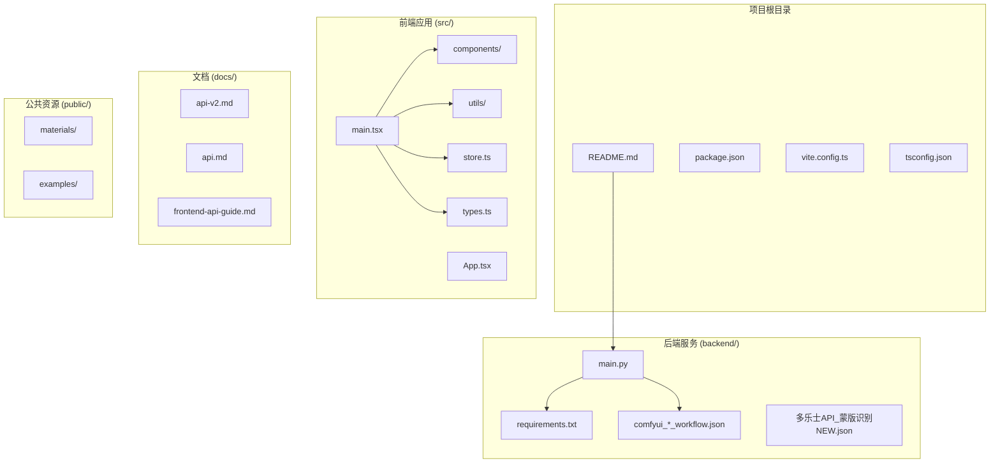
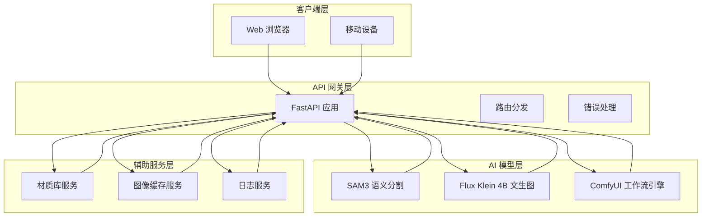
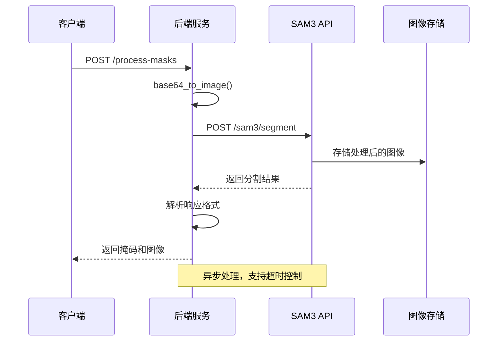
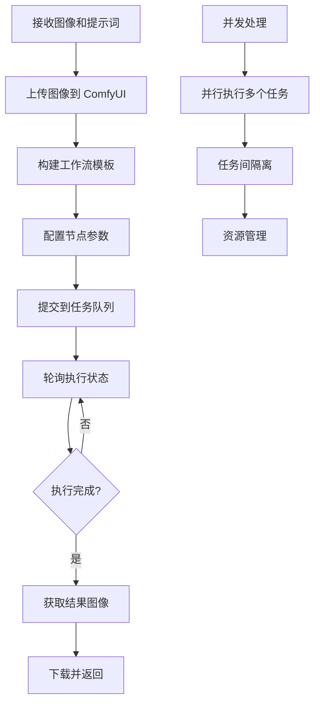
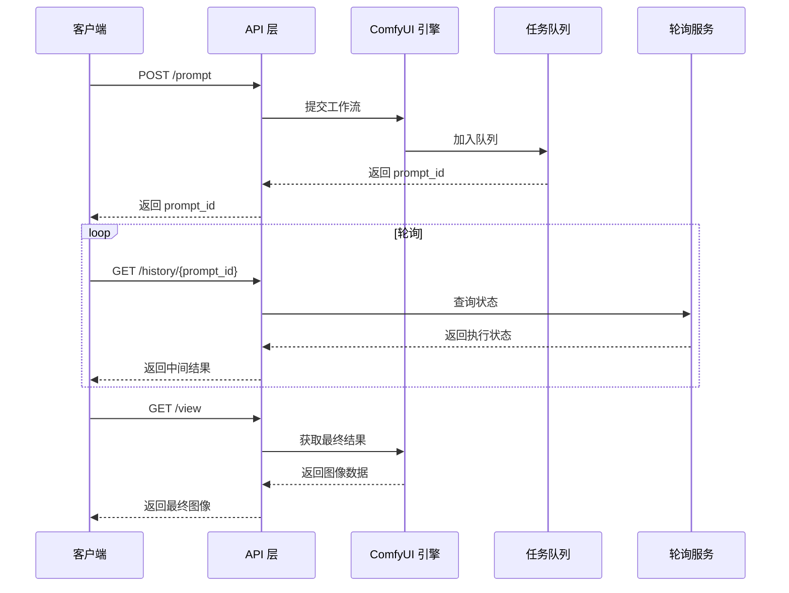
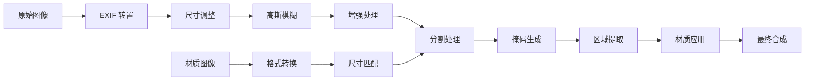
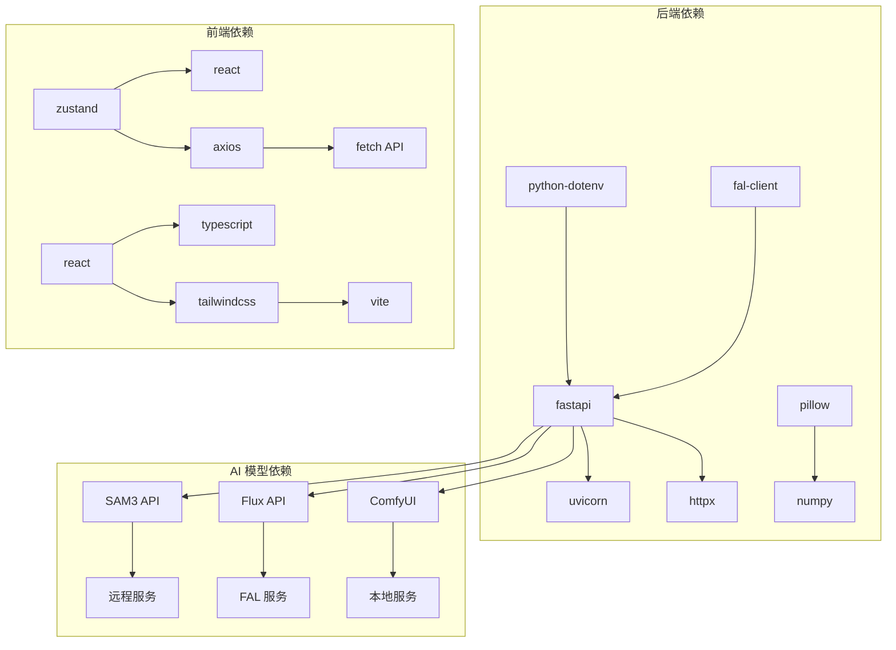

# AI 模型集成

<cite>
**本文档引用的文件**
- [backend/main.py](file://backend/main.py)
- [backend/comfyui_apply_material_workflow.json](file://backend/comfyui_apply_material_workflow.json)
- [backend/comfyui_finalize_workflow.json](file://backend/comfyui_finalize_workflow.json)
- [backend/comfyui_mask_workflow.json](file://backend/comfyui_mask_workflow.json)
- [src/utils/api.ts](file://src/utils/api.ts)
- [src/types.ts](file://src/types.ts)
- [src/store.ts](file://src/store.ts)
- [docs/api-v2.md](file://docs/api-v2.md)
- [docs/api.md](file://docs/api.md)
- [API 调用文档.md](file://API 调用文档.md)
- [README.md](file://README.md)
- [backend/requirements.txt](file://backend/requirements.txt)
</cite>

## 目录
1. [简介](#简介)
2. [项目结构](#项目结构)
3. [核心组件](#核心组件)
4. [架构概览](#架构概览)
5. [详细组件分析](#详细组件分析)
6. [依赖关系分析](#依赖关系分析)
7. [性能考虑](#性能考虑)
8. [故障排除指南](#故障排除指南)
9. [结论](#结论)
10. [附录](#附录)

## 简介

WallChanger 是一个室内材质替换 AI 应用，集成了多种先进的 AI 模型来实现智能的墙面材质替换功能。该项目采用前后端分离的架构，后端使用 Python FastAPI 提供 RESTful API，前端使用 React + TypeScript 构建用户界面。

### 主要特性

- **多模型集成**：结合 SAM3 语义分割模型和 Flux Klein 4B 文生图模型
- **智能分割**：自动识别墙面、地板、天花板等房间区域
- **材质替换**：支持拖拽材质球到对应区域进行材质替换
- **实时预览**：提供材质替换的实时预览功能
- **批量处理**：支持多区域同时处理和渲染

### 技术栈

- **后端**：Python FastAPI + SAM3 + Flux Klein 4B API
- **前端**：React + TypeScript + Vite + Tailwind CSS + Zustand
- **AI 模型**：SAM3 语义分割 + Flux Klein 4B 文生图

## 项目结构

项目采用清晰的分层架构，将后端 API 服务、前端界面和文档资料分离管理。



**图表来源**
- [backend/main.py:1-50](file://backend/main.py#L1-50)
- [src/main.tsx](file://src/main.tsx)
- [docs/api-v2.md:1-20](file://docs/api-v2.md#L1-20)

**章节来源**
- [README.md:1-91](file://README.md#L1-L91)
- [backend/main.py:1-50](file://backend/main.py#L1-50)

## 核心组件

### 后端服务组件

后端服务主要由 FastAPI 应用构成，提供完整的 AI 模型集成和处理管道。

#### 主要模块

1. **模型集成模块**：负责 SAM3 和 Flux 模型的远程 API 调用
2. **ComfyUI 工作流引擎**：管理文生图工作流的异步执行
3. **图像处理模块**：提供图像转换、拼接和后处理功能
4. **API 端点模块**：定义完整的 RESTful API 接口

#### 关键配置

- **SAM3 API 配置**：`SAM3_API` 环境变量，默认指向远程 API 地址
- **ComfyUI 配置**：`COMFYUI_HOST` 环境变量，默认本地 8188 端口
- **材质路径配置**：`MATERIALS_PATH` 环境变量，指向材质库目录

**章节来源**
- [backend/main.py:18-28](file://backend/main.py#L18-28)
- [backend/requirements.txt:1-8](file://backend/requirements.txt#L1-8)

### 前端组件

前端采用现代化的 React 架构，使用 TypeScript 提供类型安全的开发体验。

#### 核心组件

1. **状态管理**：使用 Zustand 管理应用状态
2. **API 通信**：封装 HTTP 请求和响应处理
3. **用户界面**：提供直观的材质替换操作界面
4. **图像处理**：实现实时预览和材质拖拽功能

#### 状态管理

应用状态通过 Zustand 管理，包括图像数据、处理进度、材质选择等。

**章节来源**
- [src/store.ts:1-177](file://src/store.ts#L1-L177)
- [src/types.ts:1-89](file://src/types.ts#L1-L89)

## 架构概览

系统采用微服务架构，将不同的 AI 模型功能模块化，通过 API 网关统一对外提供服务。



**图表来源**
- [backend/main.py:31-42](file://backend/main.py#L31-42)
- [src/utils/api.ts:1-200](file://src/utils/api.ts#L1-L200)

## 详细组件分析

### SAM3 语义分割模型集成

SAM3 语义分割模型负责识别图像中的不同区域，特别是墙面、地板和天花板等房间元素。

#### 请求构建



**图表来源**
- [backend/main.py:325-360](file://backend/main.py#L325-360)
- [backend/main.py:581-613](file://backend/main.py#L581-613)

#### 响应解析

SAM3 API 返回的响应包含以下关键信息：

1. **掩码图像**：Base64 编码的分割掩码
2. **标签映射**：每个检测到的区域的详细信息
3. **颜色信息**：用于区分不同区域的颜色编码

#### 错误处理

- **空掩码处理**：当 SAM3 未检测到任何区域时返回错误
- **超时处理**：设置合理的超时时间避免长时间阻塞
- **格式验证**：验证返回数据的完整性和正确性

**章节来源**
- [backend/main.py:325-360](file://backend/main.py#L325-360)
- [docs/api-v2.md:240-253](file://docs/api-v2.md#L240-253)

### Flux Klein 4B 文生图模型集成

Flux Klein 4B 模型负责图像编辑和材质替换功能，支持基于文本提示词的图像修改。

#### ComfyUI 工作流集成



**图表来源**
- [backend/main.py:79-323](file://backend/main.py#L79-323)
- [backend/main.py:282-323](file://backend/main.py#L282-323)

#### 工作流模板设计

系统提供了三种核心工作流模板：

1. **材质应用工作流** (`comfyui_apply_material_workflow.json`)
2. **最终渲染工作流** (`comfyui_finalize_workflow.json`)
3. **蒙版识别工作流** (`comfyui_mask_workflow.json`)

#### 节点连接和参数配置

每个工作流都包含精心设计的节点连接，确保图像处理的连贯性和一致性。

**章节来源**
- [backend/main.py:110-280](file://backend/main.py#L110-280)
- [backend/comfyui_apply_material_workflow.json:1-432](file://backend/comfyui_apply_material_workflow.json#L1-432)

### ComfyUI 工作流引擎

ComfyUI 提供了强大的图形化工作流引擎，支持复杂的图像处理管道。

#### 异步调用机制



**图表来源**
- [backend/main.py:289-323](file://backend/main.py#L289-323)

#### 任务队列管理

- **队列容量**：支持多个并发任务的管理
- **优先级调度**：根据任务类型和紧急程度进行调度
- **资源监控**：实时监控 GPU 和内存使用情况
- **超时控制**：防止长时间占用系统资源

#### 结果获取策略

1. **渐进式获取**：支持中间结果的实时预览
2. **最终结果**：确保完整图像的准确传输
3. **错误恢复**：处理执行过程中的各种异常情况

**章节来源**
- [backend/main.py:289-323](file://backend/main.py#L289-323)

### 图像处理和合成

系统实现了复杂的图像处理管道，包括图像预处理、区域分割、材质应用和最终合成。

#### 图像预处理



**图表来源**
- [backend/main.py:563-579](file://backend/main.py#L563-579)
- [backend/main.py:650-668](file://backend/main.py#L650-668)

#### 区域合成算法

系统使用高级的图像合成算法，确保材质替换的自然过渡和无缝融合。

**章节来源**
- [backend/main.py:362-402](file://backend/main.py#L362-402)

## 依赖关系分析

项目依赖关系清晰明确，各模块职责分离，便于维护和扩展。



**图表来源**
- [backend/requirements.txt:1-8](file://backend/requirements.txt#L1-8)
- [src/utils/api.ts:1-200](file://src/utils/api.ts#L1-L200)

### 外部依赖

1. **SAM3 API**：提供语义分割功能
2. **FAL API**：提供 Flux 文生图服务
3. **ComfyUI**：提供本地工作流执行环境
4. **图像处理库**：Pillow 和 NumPy 提供图像处理能力

### 内部模块依赖

- **API 层**：依赖图像处理和模型集成模块
- **图像处理**：依赖基础工具函数和数学库
- **前端组件**：依赖状态管理和 API 通信模块

**章节来源**
- [backend/requirements.txt:1-8](file://backend/requirements.txt#L1-8)
- [src/store.ts:1-28](file://src/store.ts#L1-L28)

## 性能考虑

系统在设计时充分考虑了性能优化，特别是在 AI 模型处理和网络通信方面。

### 模型性能优化

1. **异步处理**：所有 AI 模型调用都是异步的，避免阻塞主线程
2. **缓存机制**：中间结果和常用资源进行缓存
3. **批处理**：支持多个区域的并行处理
4. **资源管理**：合理管理 GPU 和内存资源

### 网络性能优化

1. **连接池**：使用连接池减少网络开销
2. **超时控制**：设置合理的超时时间避免长时间等待
3. **错误重试**：实现智能的错误重试机制
4. **压缩传输**：对图像数据进行适当的压缩

### 前端性能优化

1. **状态管理**：使用轻量级的状态管理方案
2. **懒加载**：按需加载组件和资源
3. **虚拟滚动**：处理大量材质和图像的显示
4. **缓存策略**：实现多层次的缓存机制

## 故障排除指南

### 常见问题和解决方案

#### SAM3 模型问题

**问题**：SAM3 API 调用失败
**原因**：
- 网络连接问题
- API 密钥无效
- 图像格式不支持
- 模型未加载完成

**解决方案**：
1. 检查网络连接和 API 地址
2. 验证 API 密钥的有效性
3. 确认图像格式符合要求
4. 等待模型加载完成后再调用

#### ComfyUI 执行问题

**问题**：ComfyUI 任务执行超时
**原因**：
- GPU 内存不足
- 任务过于复杂
- 系统资源紧张
- 工作流配置错误

**解决方案**：
1. 检查 GPU 内存使用情况
2. 简化工作流配置
3. 释放系统资源
4. 优化任务执行顺序

#### 前端连接问题

**问题**：前端无法连接到后端服务
**原因**：
- 后端服务未启动
- 端口被占用
- CORS 配置错误
- 网络配置问题

**解决方案**：
1. 确认后端服务正常运行
2. 检查端口占用情况
3. 验证 CORS 配置
4. 检查网络防火墙设置

### 调试工具和方法

1. **日志系统**：详细的日志记录帮助定位问题
2. **健康检查**：提供系统状态的实时监控
3. **性能监控**：跟踪关键指标的性能表现
4. **错误报告**：标准化的错误信息格式

**章节来源**
- [docs/api.md:46-56](file://docs/api.md#L46-L56)
- [docs/api-v2.md:240-253](file://docs/api-v2.md#L240-253)

## 结论

WallChanger 项目成功地集成了多种先进的 AI 模型，实现了智能化的室内材质替换功能。通过合理的架构设计和优化策略，系统在保证功能完整性的同时，也具备了良好的性能表现和可维护性。

### 主要成就

1. **技术集成**：成功整合 SAM3 和 Flux 模型，实现端到端的 AI 处理流程
2. **用户体验**：提供直观易用的材质替换界面
3. **性能优化**：通过异步处理和缓存机制提升系统响应速度
4. **可扩展性**：模块化的架构设计便于功能扩展和维护

### 未来发展方向

1. **模型优化**：持续改进 AI 模型的准确性和效率
2. **功能扩展**：增加更多材质类型和处理选项
3. **性能提升**：进一步优化系统性能和资源利用率
4. **用户体验**：持续改进界面设计和交互体验

## 附录

### API 调用示例

#### SAM3 分割请求

```json
{
  "image": "base64_encoded_image",
  "prompts": "wall,door,window",
  "confidence": "0.3"
}
```

#### Flux 材质应用请求

```json
{
  "prompt": "use image2 as a reference, repaint all wall in image 1",
  "images": ["base64_enforced_image", "base64_material_image"]
}
```

### 配置文件示例

#### 环境变量配置

```env
FAL_KEY=your_fal_api_key_here
SAM3_API=https://sh-llm-api.tinttex.cn:8443/sam3/segment
COMFYUI_HOST=http://127.0.0.1:8188
MATERIALS_PATH=../public/materials
```

### 开发指南

1. **环境搭建**：按照 README 中的安装步骤进行环境配置
2. **依赖安装**：使用 requirements.txt 安装 Python 依赖
3. **启动服务**：先启动后端服务，再启动前端应用
4. **测试验证**：使用提供的示例图像测试功能完整性

**章节来源**
- [README.md:24-91](file://README.md#L24-L91)
- [API 调用文档.md:1-235](file://API 调用文档.md#L1-L235)