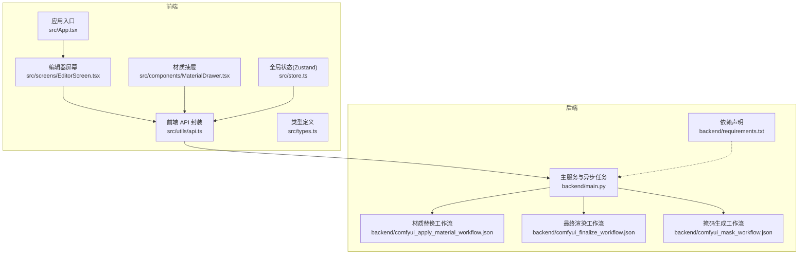
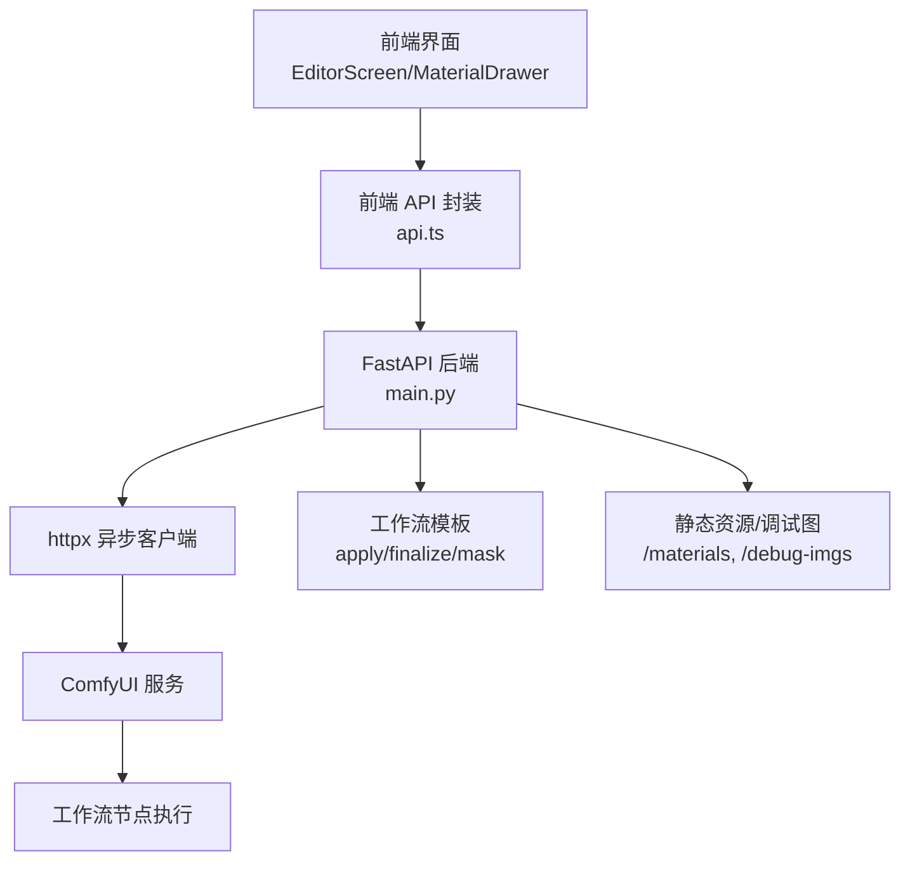
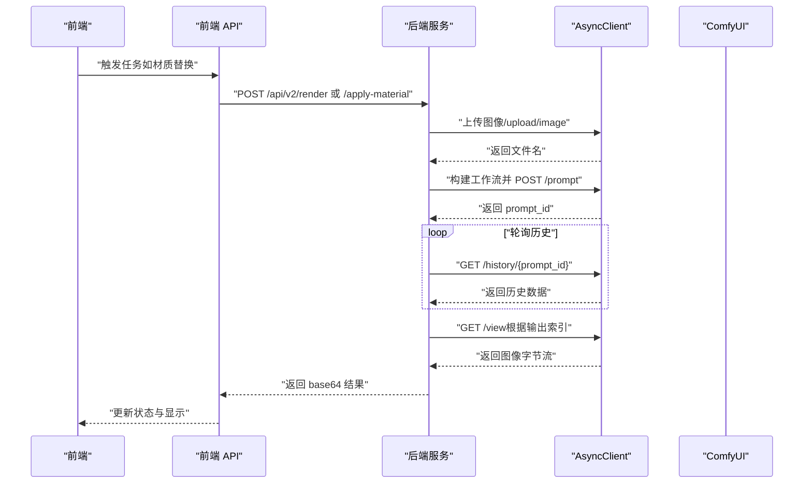
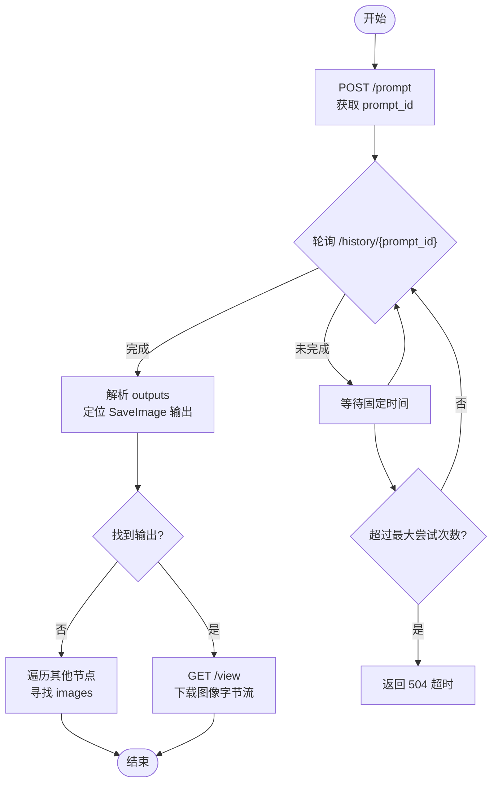
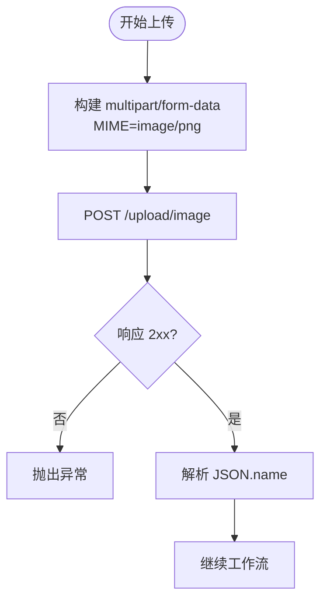
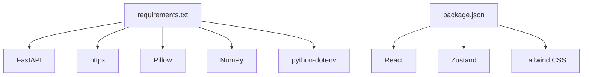

# ComfyUI 异步任务管理

<cite>
**本文档引用的文件**
- [backend/main.py](file://backend/main.py)
- [backend/comfyui_apply_material_workflow.json](file://backend/comfyui_apply_material_workflow.json)
- [backend/comfyui_finalize_workflow.json](file://backend/comfyui_finalize_workflow.json)
- [backend/comfyui_mask_workflow.json](file://backend/comfyui_mask_workflow.json)
- [backend/requirements.txt](file://backend/requirements.txt)
- [src/utils/api.ts](file://src/utils/api.ts)
- [src/types.ts](file://src/types.ts)
- [src/store.ts](file://src/store.ts)
- [src/App.tsx](file://src/App.tsx)
- [src/screens/EditorScreen.tsx](file://src/screens/EditorScreen.tsx)
- [src/components/MaterialDrawer.tsx](file://src/components/MaterialDrawer.tsx)
- [README.md](file://README.md)
</cite>

## 目录
1. [简介](#简介)
2. [项目结构](#项目结构)
3. [核心组件](#核心组件)
4. [架构总览](#架构总览)
5. [详细组件分析](#详细组件分析)
6. [依赖关系分析](#依赖关系分析)
7. [性能考虑](#性能考虑)
8. [故障排除指南](#故障排除指南)
9. [结论](#结论)
10. [附录](#附录)

## 简介
本项目是一个室内材质替换的 AI 应用，采用前后端分离架构：前端使用 React + TypeScript，后端基于 FastAPI 提供服务。系统通过 ComfyUI 异步执行图像处理工作流，结合远程 SAM3 API 实现智能分割，支持材质拖拽替换与最终渲染输出。本文档聚焦于异步任务管理的关键实现，包括 HTTP 客户端使用模式、任务队列与轮询策略、图像上传与响应验证、状态监控与异常恢复、性能监控与并发控制，以及调试与排障方法。

## 项目结构
- 后端（Python FastAPI）
  - 主入口与异步任务逻辑：backend/main.py
  - ComfyUI 工作流模板：backend/comfyui_*.json
  - 依赖声明：backend/requirements.txt
- 前端（React + TypeScript）
  - API 封装：src/utils/api.ts
  - 类型定义：src/types.ts
  - 全局状态（Zustand）：src/store.ts
  - 应用入口与屏幕组件：src/App.tsx、src/screens/EditorScreen.tsx、src/components/MaterialDrawer.tsx
- 文档与说明：README.md

图表来源
- [backend/main.py:1-1250](file://backend/main.py#L1-L1250)
- [src/utils/api.ts:1-197](file://src/utils/api.ts#L1-L197)
- [src/types.ts:1-88](file://src/types.ts#L1-L88)
- [src/store.ts:1-177](file://src/store.ts#L1-L177)
- [src/App.tsx:1-26](file://src/App.tsx#L1-L26)
- [src/screens/EditorScreen.tsx:1-758](file://src/screens/EditorScreen.tsx#L1-L758)
- [src/components/MaterialDrawer.tsx:1-136](file://src/components/MaterialDrawer.tsx#L1-L136)
- [backend/requirements.txt:1-8](file://backend/requirements.txt#L1-L8)
- [backend/comfyui_apply_material_workflow.json:1-432](file://backend/comfyui_apply_material_workflow.json#L1-L432)
- [backend/comfyui_finalize_workflow.json:1-217](file://backend/comfyui_finalize_workflow.json#L1-L217)
- [backend/comfyui_mask_workflow.json:1-800](file://backend/comfyui_mask_workflow.json#L1-L800)

章节来源
- [backend/main.py:1-1250](file://backend/main.py#L1-L1250)
- [src/utils/api.ts:1-197](file://src/utils/api.ts#L1-L197)
- [src/types.ts:1-88](file://src/types.ts#L1-L88)
- [src/store.ts:1-177](file://src/store.ts#L1-L177)
- [src/App.tsx:1-26](file://src/App.tsx#L1-L26)
- [src/screens/EditorScreen.tsx:1-758](file://src/screens/EditorScreen.tsx#L1-L758)
- [src/components/MaterialDrawer.tsx:1-136](file://src/components/MaterialDrawer.tsx#L1-L136)
- [backend/requirements.txt:1-8](file://backend/requirements.txt#L1-L8)
- [backend/comfyui_apply_material_workflow.json:1-432](file://backend/comfyui_apply_material_workflow.json#L1-L432)
- [backend/comfyui_finalize_workflow.json:1-217](file://backend/comfyui_finalize_workflow.json#L1-L217)
- [backend/comfyui_mask_workflow.json:1-800](file://backend/comfyui_mask_workflow.json#L1-L800)

## 核心组件
- 异步 HTTP 客户端与任务编排
  - 使用 httpx.AsyncClient 发起 ComfyUI 任务，包含上传图像、构建工作流、排队、轮询历史、拉取结果等完整流程。
  - 关键点：客户端超时配置、请求体构造、响应校验、错误处理与超时策略。
- 图像上传与格式转换
  - 上传接口使用 multipart/form-data，MIME 类型固定为 image/png；对 RGBA 图像自动转 RGB 以适配 JPEG 输出场景。
- 任务队列与轮询策略
  - prompt ID 由 /prompt 接口返回；通过 /history/{prompt_id} 查询完成状态；轮询间隔与最大尝试次数控制超时。
- 前端 API 封装与状态管理
  - 统一封装后端接口，统一错误处理与日志输出；全局状态管理任务阶段、处理进度与中间结果。
- 工作流模板与节点映射
  - 材质替换、最终渲染、掩码生成等工作流通过 JSON 模板定义，节点 ID 与输出索引用于定位结果。

章节来源
- [backend/main.py:79-323](file://backend/main.py#L79-L323)
- [backend/main.py:325-359](file://backend/main.py#L325-L359)
- [src/utils/api.ts:1-197](file://src/utils/api.ts#L1-L197)
- [src/store.ts:1-177](file://src/store.ts#L1-L177)
- [backend/comfyui_apply_material_workflow.json:1-432](file://backend/comfyui_apply_material_workflow.json#L1-L432)
- [backend/comfyui_finalize_workflow.json:1-217](file://backend/comfyui_finalize_workflow.json#L1-L217)
- [backend/comfyui_mask_workflow.json:1-800](file://backend/comfyui_mask_workflow.json#L1-L800)

## 架构总览
系统采用“前端交互 + 后端编排 + ComfyUI 异步执行”的分层设计。前端负责用户交互与状态展示，后端负责与 ComfyUI 通信、任务调度与结果聚合，ComfyUI 负责具体图像处理节点的执行。

图表来源
- [backend/main.py:1-1250](file://backend/main.py#L1-L1250)
- [src/utils/api.ts:1-197](file://src/utils/api.ts#L1-L197)
- [src/screens/EditorScreen.tsx:1-758](file://src/screens/EditorScreen.tsx#L1-L758)
- [src/components/MaterialDrawer.tsx:1-136](file://src/components/MaterialDrawer.tsx#L1-L136)

## 详细组件分析

### 异步 HTTP 客户端与任务编排
- 客户端生命周期
  - 使用 AsyncClient 创建会话，设置超时时间，确保长任务不会阻塞。
  - 上传图像：multipart/form-data，MIME 固定为 image/png，支持覆盖参数。
  - 构建工作流：将模板中的节点参数替换为实际输入，注入 prompt 与 client_id。
  - 排队与轮询：提交 /prompt 获取 prompt_id；定期轮询 /history/{prompt_id}，直到出现输出或超时。
  - 结果拉取：根据 SaveImage 节点输出索引，调用 /view 获取最终图像字节流。
- 错误处理与超时
  - 对每个网络请求调用 raise_for_status，确保非 2xx 状态立即抛出异常。
  - 轮询循环设置最大尝试次数与固定间隔，避免无限等待；超时返回 504。
  - 对空输出图像进行兜底处理，优先查找任意节点的 images 输出。
- 并发与互斥
  - 前端对单个 ComfyUI 任务设置互斥标志，防止同时提交多个任务导致资源竞争。

图表来源
- [backend/main.py:79-323](file://backend/main.py#L79-L323)
- [src/utils/api.ts:109-137](file://src/utils/api.ts#L109-L137)
- [src/screens/EditorScreen.tsx:276-345](file://src/screens/EditorScreen.tsx#L276-L345)

章节来源
- [backend/main.py:79-323](file://backend/main.py#L79-L323)
- [src/utils/api.ts:109-137](file://src/utils/api.ts#L109-L137)
- [src/screens/EditorScreen.tsx:276-345](file://src/screens/EditorScreen.tsx#L276-L345)

### 任务队列与轮询策略
- prompt ID 生成
  - 通过 /prompt 接口返回的 prompt_id 作为任务标识，用于后续历史查询与结果拉取。
- 历史记录查询
  - /history/{prompt_id} 返回包含各节点输出的对象；前端优先匹配 SaveImage 节点输出，否则遍历所有节点寻找 images。
- 结果轮询策略
  - 固定间隔轮询，最大尝试次数限制，超时返回 504；成功后解析输出并下载 /view。
- 节点索引与输出定位
  - 工作流模板中 SaveImage 节点 ID 为 198，输出 images 数组的第一个元素即为目标图像。

图表来源
- [backend/main.py:282-319](file://backend/main.py#L282-L319)

章节来源
- [backend/main.py:282-319](file://backend/main.py#L282-L319)

### 图像上传流程与响应验证
- 上传接口
  - 目标路径：/upload/image，表单字段：image（文件）、overwrite（布尔）。
  - MIME 类型：image/png。
- 格式转换与兼容性
  - 当输出格式为 JPEG 且输入为 RGBA 时，自动转换为 RGB，避免不兼容。
- 响应验证
  - 读取响应 JSON，提取 name 字段作为后续节点引用的文件名。
  - 对空结果进行异常处理，保证流程健壮性。

图表来源
- [backend/main.py:92-105](file://backend/main.py#L92-L105)

章节来源
- [backend/main.py:92-105](file://backend/main.py#L92-L105)

### 任务状态监控与异常恢复
- 前端状态管理
  - 使用 Zustand 管理处理阶段、正在处理的区域集合、已应用区域映射、是否正在应用等状态。
  - 通过 processingRegions 与 appliedRegions 显示处理进度与结果缓存。
- 后端异常处理
  - 每个网络请求均调用 raise_for_status，确保快速失败。
  - 超时与无输出兜底：超时返回 504，无输出返回 500。
- 恢复机制
  - 前端互斥标志避免重复提交；后端对 SAM3 返回空掩码进行明确报错，便于前端引导重新尝试。

章节来源
- [src/store.ts:1-177](file://src/store.ts#L1-L177)
- [backend/main.py:289-311](file://backend/main.py#L289-L311)
- [backend/main.py:341-349](file://backend/main.py#L341-L349)

### 工作流模板与节点映射
- 材质替换工作流
  - 关键节点：LoadImage、VAEEncode、KSampler、VAEDecode、SaveImage（ID 198）。
  - 输入：主图与材质参考图；输出：SaveImage 节点 images。
- 最终渲染工作流
  - 关键节点：LoadImage、ImageBlur、KSampler、VAEDecode、SaveImage。
  - 输入：合成后的 RGBA 图；输出：最终渲染结果。
- 掩码生成工作流
  - 关键节点：LoadImage、ImageBlur、KSampler、VAEDecode、SaveImage。
  - 输入：原始图或清洗后的图；输出：掩码图。

章节来源
- [backend/comfyui_apply_material_workflow.json:1-432](file://backend/comfyui_apply_material_workflow.json#L1-L432)
- [backend/comfyui_finalize_workflow.json:1-217](file://backend/comfyui_finalize_workflow.json#L1-L217)
- [backend/comfyui_mask_workflow.json:1-800](file://backend/comfyui_mask_workflow.json#L1-L800)

## 依赖关系分析
- 后端依赖
  - FastAPI、httpx、Pillow、NumPy、python-dotenv。
- 前端依赖
  - React、Zustand、Tailwind CSS 等（详见 package.json）。
- 组件耦合
  - 前端 API 封装与后端接口一一对应，降低耦合度。
  - 后端与 ComfyUI 通过 HTTP 协议交互，职责清晰。

图表来源
- [backend/requirements.txt:1-8](file://backend/requirements.txt#L1-L8)
- [README.md:1-91](file://README.md#L1-L91)

章节来源
- [backend/requirements.txt:1-8](file://backend/requirements.txt#L1-L8)
- [README.md:1-91](file://README.md#L1-L91)

## 性能考虑
- 连接与超时
  - AsyncClient 设置合理超时，避免长时间占用连接；对远程 SAM3 API 禁用 SSL 校验（开发环境），生产需启用。
- 轮询策略
  - 固定间隔与最大尝试次数平衡响应速度与稳定性；可根据任务复杂度调整。
- 图像处理
  - 对 RGBA 转换为 RGB 以减少不必要开销；对大图进行缩放以控制分辨率。
- 并发控制
  - 前端互斥标志确保一次仅提交一个任务；后端未显式限流，建议在上游增加队列或速率限制。
- 资源清理
  - 调试图像保存至 /debug-imgs，便于问题排查；建议定期清理临时文件。

章节来源
- [backend/main.py:92](file://backend/main.py#L92)
- [backend/main.py:341](file://backend/main.py#L341)
- [backend/main.py:71-76](file://backend/main.py#L71-L76)

## 故障排除指南
- 常见错误与定位
  - 504 超时：检查轮询间隔与最大尝试次数，确认 ComfyUI 服务可用。
  - 500 无输出：检查 SaveImage 节点是否存在，或回退到其他节点的 images。
  - SAM3 空掩码：返回空掩码时抛出异常，提示无目标检测，建议调整置信度或提示词。
  - CORS 问题：后端已启用允许跨域，若仍失败检查前端请求头与 Origin。
- 调试工具
  - 前端调试面板可切换显示清洗图、原始掩码与细化掩码；后端将中间图保存到 /debug-imgs。
  - 前端 API 封装对错误响应打印详细信息，便于定位。
- 修复建议
  - 增加重试与指数退避策略（可在前端实现）。
  - 对 ComfyUI 任务增加唯一 client_id，便于追踪与去重。
  - 对上传图像进行尺寸与格式校验，避免无效输入。

章节来源
- [backend/main.py:289-311](file://backend/main.py#L289-L311)
- [backend/main.py:341-349](file://backend/main.py#L341-L349)
- [src/utils/api.ts:29-36](file://src/utils/api.ts#L29-L36)
- [src/utils/api.ts:64-68](file://src/utils/api.ts#L64-L68)

## 结论
本系统通过 httpx 异步客户端与 ComfyUI 工作流实现了稳定的异步任务管理，配合前端状态与可视化，提供了良好的用户体验。建议在生产环境中增强超时与重试策略、启用 SSL 校验、引入任务队列与速率限制，并完善日志与监控体系，以进一步提升可靠性与可维护性。

## 附录
- 快速启动与环境要求
  - 后端：安装依赖、配置 .env、启动 uvicorn。
  - 前端：安装依赖、启动开发服务器。
  - 材质库：将图片放入 public/materials。
- 使用流程
  - 上传图片 → 自动处理 → 拖拽材质到区域 → 一键焕色 → 查看结果。

章节来源
- [README.md:24-91](file://README.md#L24-L91)