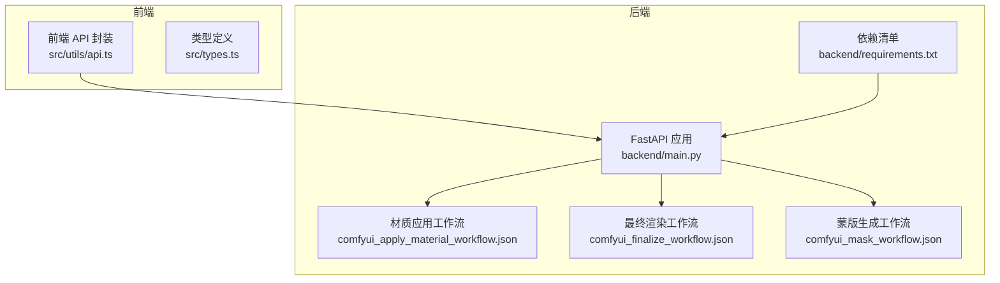
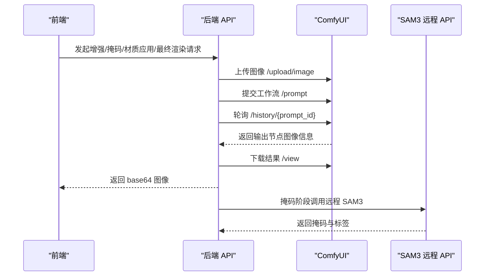
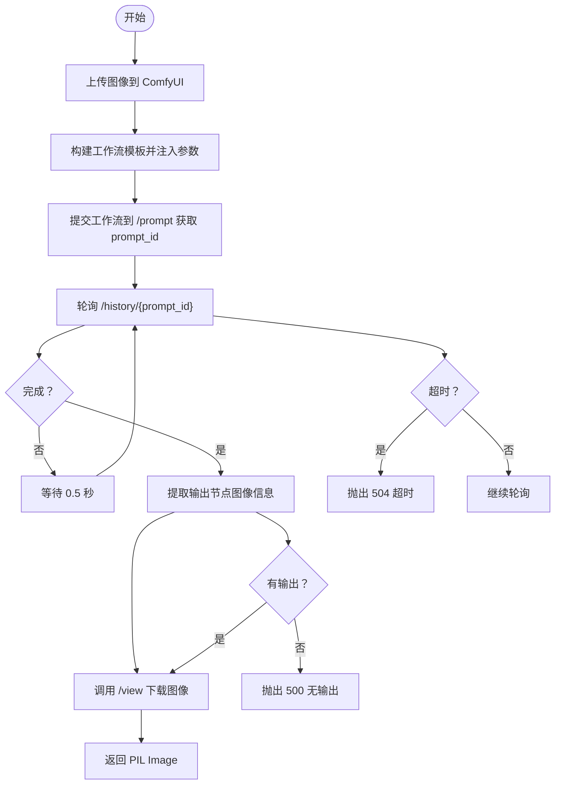
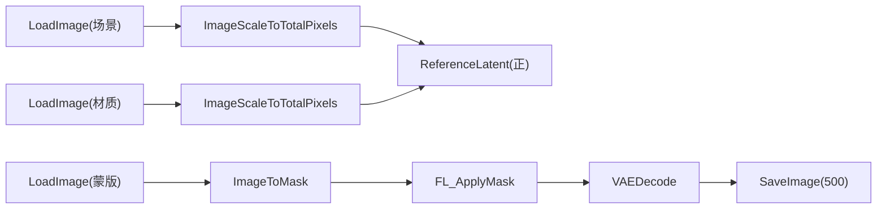
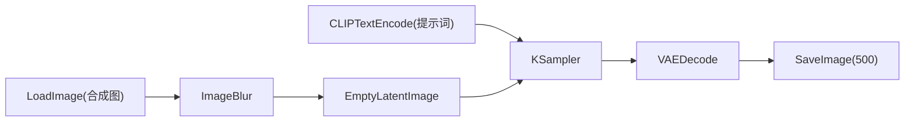
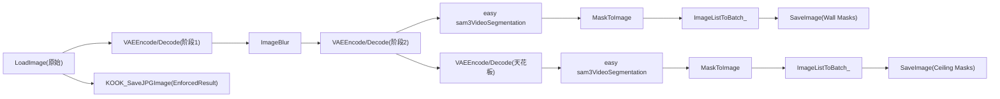
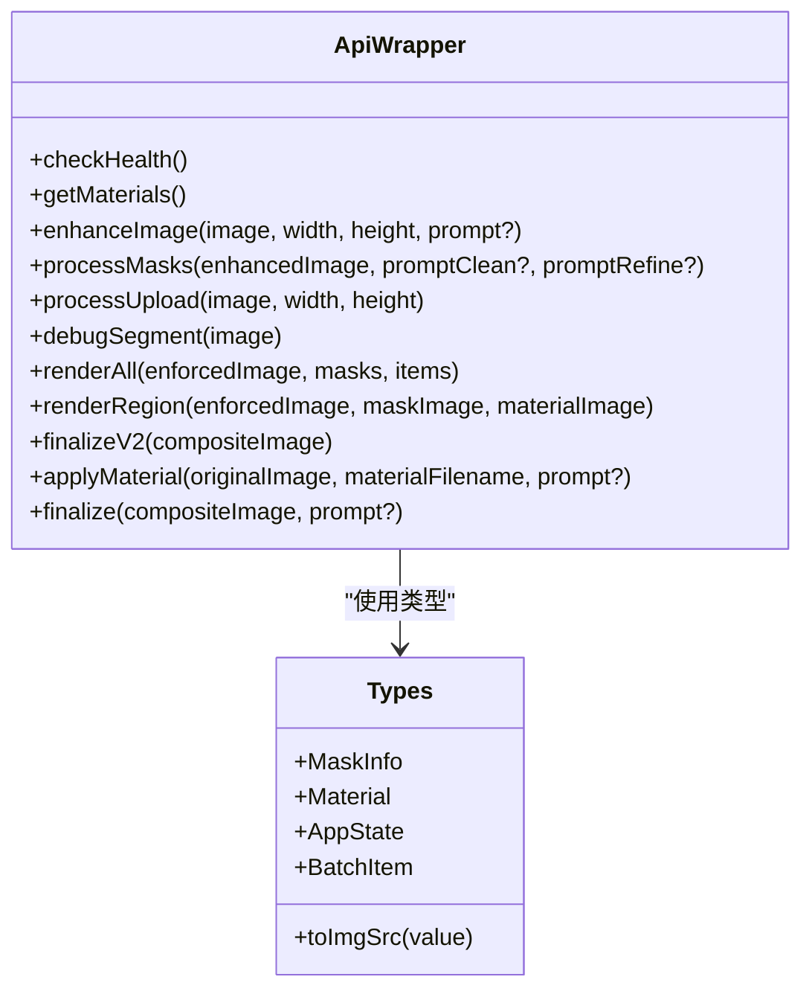
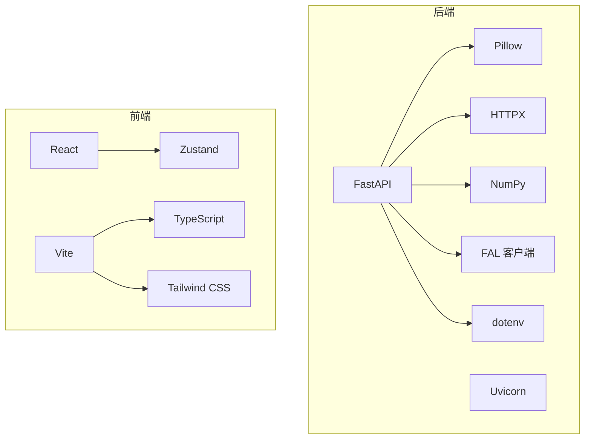

# Flux2 文生图工作流

<cite>
**本文引用的文件**
- [backend/main.py](file://backend/main.py)
- [backend/comfyui_apply_material_workflow.json](file://backend/comfyui_apply_material_workflow.json)
- [backend/comfyui_finalize_workflow.json](file://backend/comfyui_finalize_workflow.json)
- [backend/comfyui_mask_workflow.json](file://backend/comfyui_mask_workflow.json)
- [backend/requirements.txt](file://backend/requirements.txt)
- [src/utils/api.ts](file://src/utils/api.ts)
- [src/types.ts](file://src/types.ts)
- [package.json](file://package.json)
- [README.md](file://README.md)
- [backend/多乐士API_蒙版识别NEW.json](file://backend/多乐士API_蒙版识别NEW.json)
</cite>

## 目录
1. [简介](#简介)
2. [项目结构](#项目结构)
3. [核心组件](#核心组件)
4. [架构总览](#架构总览)
5. [详细组件分析](#详细组件分析)
6. [依赖关系分析](#依赖关系分析)
7. [性能考量](#性能考量)
8. [故障排查指南](#故障排查指南)
9. [结论](#结论)
10. [附录](#附录)

## 简介
本项目是一个室内材质替换的 AI 应用，采用 Flux2 文生图模型与 ComfyUI 工作流集成，结合远程 SAM3 分割服务，实现从上传室内照片到最终渲染的完整管线。系统通过 FastAPI 提供后端接口，React 前端负责交互与状态管理，支持单点材质替换与批量区域渲染，并提供调试与性能优化能力。

## 项目结构
- 后端（Python FastAPI）
  - 主程序：处理图像上传、增强、掩码生成、材质应用、最终渲染与调试接口
  - ComfyUI 工作流模板：材质应用、最终渲染、蒙版生成
  - 依赖：FastAPI、Uvicorn、Pillow、HTTPX、NumPy、FAL 客户端、dotenv
- 前端（React + TypeScript）
  - API 封装：统一调用后端接口，支持计时与错误处理
  - 类型定义：状态、提示词、批处理项等
  - 构建工具：Vite、Tailwind CSS、TypeScript

图表来源
- [backend/main.py](file://backend/main.py)
- [src/utils/api.ts](file://src/utils/api.ts)
- [src/types.ts](file://src/types.ts)
- [backend/requirements.txt](file://backend/requirements.txt)
- [backend/comfyui_apply_material_workflow.json](file://backend/comfyui_apply_material_workflow.json)
- [backend/comfyui_finalize_workflow.json](file://backend/comfyui_finalize_workflow.json)
- [backend/comfyui_mask_workflow.json](file://backend/comfyui_mask_workflow.json)

章节来源
- [README.md](file://README.md)
- [package.json](file://package.json)
- [backend/requirements.txt](file://backend/requirements.txt)

## 核心组件
- 异步调用与队列机制
  - 图像上传：通过 ComfyUI 的 /upload/image 接口上传 PNG 图像，返回文件名
  - 工作流构建：动态拼接工作流模板，注入输入节点（如 LoadImage、ImageScaleToTotalPixels 等）
  - 任务排队：向 /prompt 提交工作流，获取 prompt_id
  - 结果轮询：周期性查询 /history/{prompt_id}，等待完成
  - 输出提取：根据输出节点名称（如 SaveImage、KOOK_SaveJPGImage）下载结果
- 三类工作流
  - 材质应用工作流：基于区域蒙版与材质参考，生成带透明度的区域渲染结果
  - 最终渲染工作流：对合成后的图像进行高质量重洗，提升真实感
  - 蒙版生成工作流：多阶段清洗与分割，输出墙面与天花板的 B/W 蒙版
- 前后端接口
  - 前端通过 src/utils/api.ts 统一调用后端接口，包含健康检查、材质列表、增强、掩码处理、材质应用、最终渲染等
  - 后端提供 v1 与 v2 两套接口，v2 采用更清晰的分阶段流水线与批量渲染能力

章节来源
- [backend/main.py](file://backend/main.py)
- [src/utils/api.ts](file://src/utils/api.ts)
- [src/types.ts](file://src/types.ts)

## 架构总览
整体架构由前端交互层、后端 API 层与 ComfyUI 工作流层组成。前端通过 API 封装调用后端，后端将请求转发至 ComfyUI 并轮询任务状态，最终返回图像结果。

图表来源
- [backend/main.py](file://backend/main.py)
- [src/utils/api.ts](file://src/utils/api.ts)

## 详细组件分析

### 异步调用机制与超时处理
- 图像上传
  - 使用 httpx.AsyncClient 上传 PNG，使用 overwrite=true 覆盖同名文件
  - 返回文件名用于后续节点引用
- 工作流构建
  - 从 JSON 模板加载节点，动态修改输入参数（如 LoadImage 的 image 字段）
  - 对于材质应用工作流，根据蒙版颜色自动切换提示词（墙面/天花板）
- 任务排队与轮询
  - /prompt 返回 prompt_id；随后每 0.5 秒查询 /history/{prompt_id}
  - 轮询上限：材质应用与最终渲染为 1200 次（~10 分钟），掩码工作流为 1200 次（~10 分钟）
- 结果获取
  - 优先从指定输出节点（如 SaveImage、KOOK_SaveJPGImage）提取图像
  - 若未找到，则遍历所有输出节点寻找图像
  - 通过 /view 下载图像字节流并转为 PIL Image
- 错误处理
  - 超时：抛出 504，提示 ComfyUI 超时
  - 无输出：抛出 500，提示无输出图像
  - SAM3：若返回空掩码，抛出 500，提示未检测到片段

图表来源
- [backend/main.py](file://backend/main.py)

章节来源
- [backend/main.py](file://backend/main.py)

### 材质应用工作流（区域洗图）
- 设计目的
  - 基于用户提供的 B/W 蒙版与材质参考，对目标区域进行材质替换
  - 输出带透明度的 RGBA 结果，便于后续合成
- 关键节点与参数
  - LoadImage（场景图）、LoadImage（材质参考）、LoadImage（蒙版）
  - ImageScaleToTotalPixels（按像素总量缩放，避免分辨率过高）
  - ImageToMask（将红色通道转换为遮罩）
  - FL_ApplyMask（应用蒙版，裁剪并保留目标区域）
  - ReferenceLatent（正负条件编码）
  - KSampler/KSamplerSelect（采样器与调度器）
  - VAE 编解码（VAELoader、VAEEncode、VAEDecode）
  - SaveImage（保存结果）
- 动态构建与参数传递
  - 从模板加载节点，设置 LoadImage 的 image 参数为上传文件名
  - 根据蒙版颜色自动切换提示词（墙面/天花板）
- 输出提取
  - 通过 SaveImage 节点（编号 500）提取结果图像

图表来源
- [backend/comfyui_apply_material_workflow.json](file://backend/comfyui_apply_material_workflow.json)

章节来源
- [backend/comfyui_apply_material_workflow.json](file://backend/comfyui_apply_material_workflow.json)
- [backend/main.py](file://backend/main.py)

### 最终渲染工作流（重洗）
- 设计目的
  - 对合成后的图像进行高质量重洗，提升真实感与细节
- 关键节点与参数
  - LoadImage（合成图）
  - ImageBlur（轻微模糊，作为引导）
  - GetImageSize+（获取尺寸）
  - EmptyLatentImage（空潜变量）
  - CLIPTextEncode（提示词：保持原内容、不引入新对象）
  - KSampler（采样器）
  - VAEDecode（解码）
  - SaveImage（保存最终结果）

图表来源
- [backend/comfyui_finalize_workflow.json](file://backend/comfyui_finalize_workflow.json)

章节来源
- [backend/comfyui_finalize_workflow.json](file://backend/comfyui_finalize_workflow.json)
- [backend/main.py](file://backend/main.py)

### 蒙版生成工作流（多阶段清洗与分割）
- 设计目的
  - 通过多阶段清洗与 SAM3 视频分割，输出墙面与天花板的 B/W 蒙版
- 关键节点与参数
  - 多阶段清洗：VAE 编码/解码、模糊、尺寸调整
  - SAM3 视频分割：easy sam3VideoSegmentation
  - 遮罩后处理：MaskToImage、ImageListToBatch_
  - 输出：EnforcedResult（KOOK_SaveJPGImage）、Wall Masks（SaveImage）、Ceiling Masks（SaveImage）
- 动态构建与参数传递
  - 从模板加载节点，设置 LoadImage 的 image 参数为上传文件名
  - 轮询完成后，分别从节点 559（EnforcedResult）、500（Wall Masks）、567（Ceiling Masks）提取图像

图表来源
- [backend/comfyui_mask_workflow.json](file://backend/comfyui_mask_workflow.json)
- [backend/多乐士API_蒙版识别NEW.json](file://backend/多乐士API_蒙版识别NEW.json)

章节来源
- [backend/comfyui_mask_workflow.json](file://backend/comfyui_mask_workflow.json)
- [backend/多乐士API_蒙版识别NEW.json](file://backend/多乐士API_蒙版识别NEW.json)
- [backend/main.py](file://backend/main.py)

### 前后端接口与前端 API 封装
- 前端 API 封装
  - 健康检查、材质列表、增强、掩码处理、材质应用、最终渲染、批量渲染等
  - 支持计时与错误处理，便于调试
- 类型定义
  - MaskInfo、Material、AppState、BatchItem 等
  - toImgSrc 辅助函数，兼容 URL 与 base64
- 构建与依赖
  - React + TypeScript + Vite + Tailwind CSS + Zustand
  - 后端依赖：FastAPI、Uvicorn、Pillow、HTTPX、NumPy、FAL 客户端、dotenv

图表来源
- [src/utils/api.ts](file://src/utils/api.ts)
- [src/types.ts](file://src/types.ts)

章节来源
- [src/utils/api.ts](file://src/utils/api.ts)
- [src/types.ts](file://src/types.ts)
- [package.json](file://package.json)

## 依赖关系分析
- 后端依赖
  - FastAPI：提供 REST API
  - Uvicorn：ASGI 服务器
  - Pillow：图像处理
  - HTTPX：异步 HTTP 客户端
  - NumPy：图像数组操作
  - FAL 客户端：远程推理
  - python-dotenv：环境变量
- 前端依赖
  - React、React DOM、Zustand：状态与 UI
  - Vite、Tailwind CSS、TypeScript：开发与构建

图表来源
- [backend/requirements.txt](file://backend/requirements.txt)
- [package.json](file://package.json)

章节来源
- [backend/requirements.txt](file://backend/requirements.txt)
- [package.json](file://package.json)

## 性能考量
- 分辨率控制
  - 使用 ImageScaleToTotalPixels 控制像素总量，避免过高的分辨率导致显存不足
  - 通过 snap_to_64 将尺寸对齐到 64 的倍数，提升推理效率
- 并发与同步
  - v2 批量渲染采用 asyncio.gather 并行处理不同区域
  - 单区域材质应用为同步调用（ComfyUI 侧串行），避免资源竞争
- 内存管理
  - 合成阶段使用 RGBA 模式，及时释放中间图像
  - 蒙版生成阶段对大图像进行压缩与尺寸调整
- 超时与重试
  - 合理设置轮询间隔与最大轮询次数，避免长时间占用
  - 对 SAM3 远程 API 设置超时，防止阻塞

[本节为通用指导，无需特定文件来源]

## 故障排查指南
- ComfyUI 超时
  - 现象：/history 查询超时，返回 504
  - 排查：检查 ComfyUI 是否正常运行、GPU 显存是否充足、工作流节点配置是否正确
- 无输出图像
  - 现象：输出节点为空，返回 500
  - 排查：确认输出节点名称与模板一致，检查 /view 参数（filename、subfolder、type）
- SAM3 返回空掩码
  - 现象：返回空掩码或未检测到片段
  - 排查：调整置信度阈值、检查输入图像质量、确认远程 API 可达
- 材质应用失败
  - 现象：材质应用工作流执行失败
  - 排查：确认蒙版颜色与提示词匹配、LoadImage 节点引用的文件名正确、VAE/CLIP 模型加载成功

章节来源
- [backend/main.py](file://backend/main.py)

## 结论
本项目通过 FastAPI 与 ComfyUI 的深度集成，实现了从图像上传到最终渲染的完整工作流。三类工作流分别承担蒙版生成、材质应用与最终渲染职责，配合前端 API 封装与类型系统，提供了良好的扩展性与可维护性。通过合理的分辨率控制、并发策略与超时处理，系统在保证质量的同时兼顾了性能与稳定性。

## 附录

### 工作流参数调优指南
- 分辨率与像素总量
  - 使用 ImageScaleToTotalPixels 控制 megapixels，平衡质量与速度
- 采样步数与 CFG
  - 采样步数与 CFG 影响生成质量与速度，建议在材质应用与最终渲染中分别调整
- 提示词设计
  - 材质应用：明确材质风格与参考关系
  - 最终渲染：强调保持原内容与真实感
- 蒙版颜色与提示词映射
  - 根据蒙版颜色自动切换提示词，确保语义一致性

[本节为通用指导，无需特定文件来源]

### 内存管理最佳实践
- 合理设置分辨率与批次大小
- 及时释放中间图像与缓存
- 使用压缩与降采样减少显存占用
- 控制并发数量，避免 GPU 内存溢出

[本节为通用指导，无需特定文件来源]