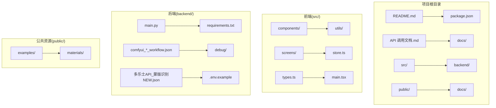
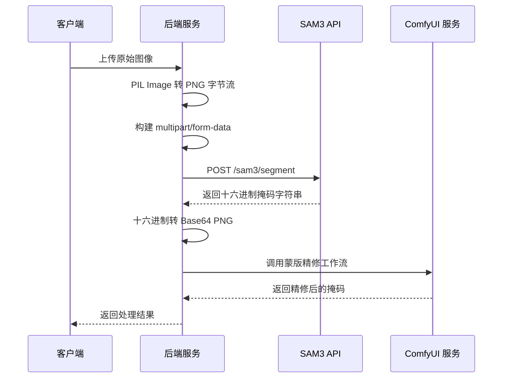
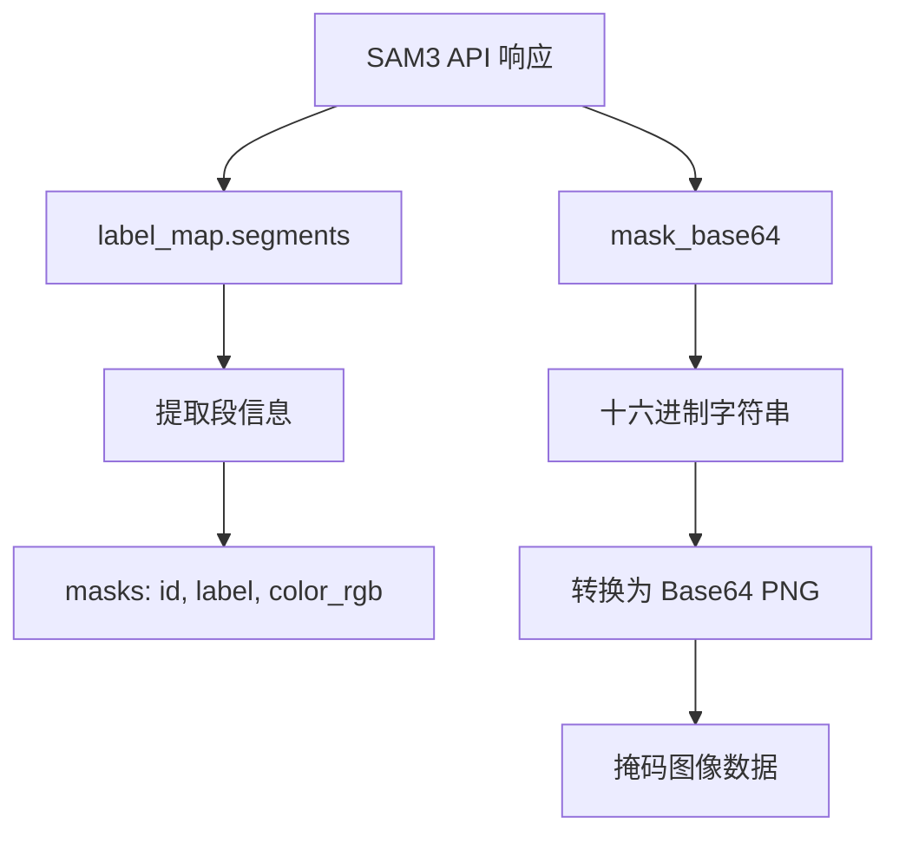
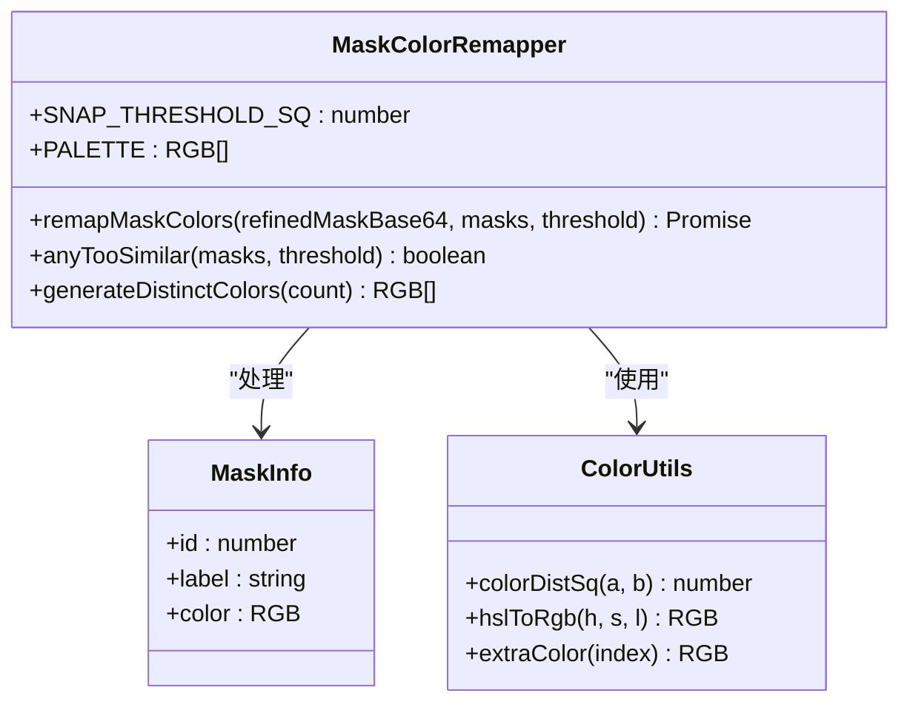
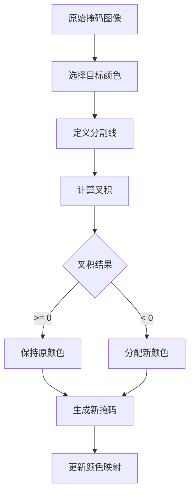
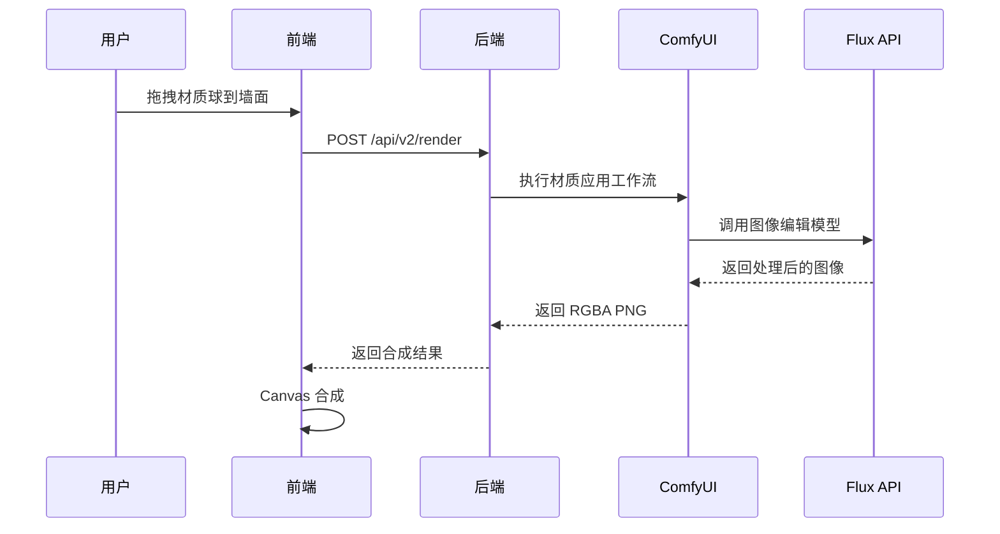
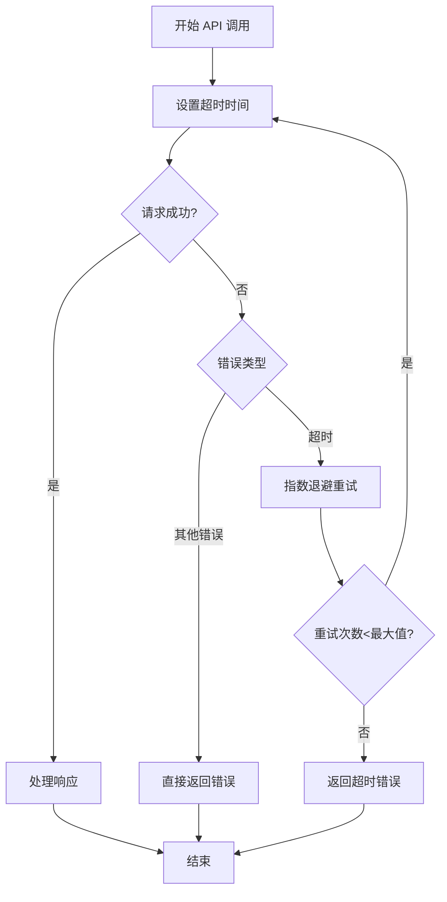
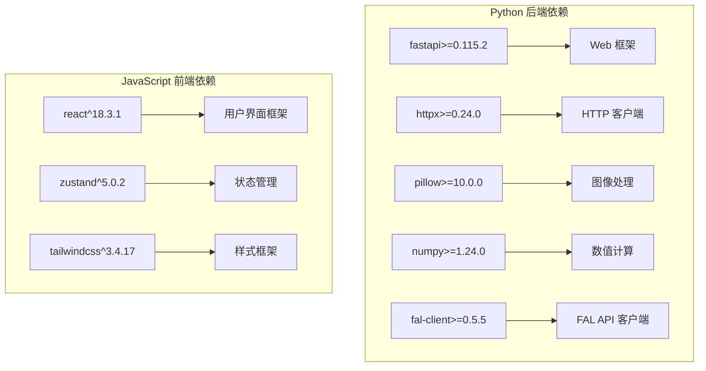
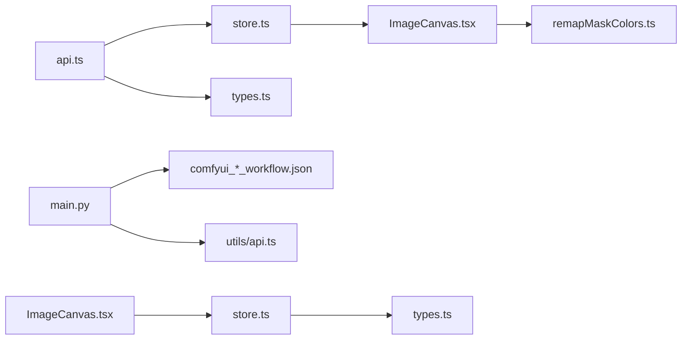
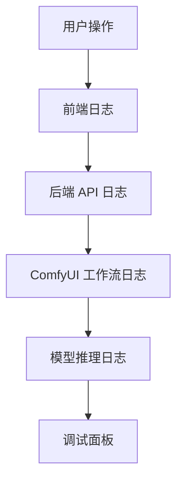

# SAM3 语义分割模型

<cite>
**本文档引用的文件**
- [backend/main.py](file://backend/main.py)
- [backend/comfyui_mask_workflow.json](file://backend/comfyui_mask_workflow.json)
- [backend/comfyui_apply_material_workflow.json](file://backend/comfyui_apply_material_workflow.json)
- [backend/comfyui_finalize_workflow.json](file://backend/comfyui_finalize_workflow.json)
- [backend/requirements.txt](file://backend/requirements.txt)
- [backend/.env.example](file://backend/.env.example)
- [src/utils/api.ts](file://src/utils/api.ts)
- [src/utils/remapMaskColors.ts](file://src/utils/remapMaskColors.ts)
- [src/components/ImageCanvas.tsx](file://src/components/ImageCanvas.tsx)
- [src/store.ts](file://src/store.ts)
- [src/types.ts](file://src/types.ts)
- [docs/api-v2.md](file://docs/api-v2.md)
- [docs/api.md](file://docs/api.md)
- [API 调用文档.md](file://API 调用文档.md)
- [README.md](file://README.md)
</cite>

## 目录
1. [简介](#简介)
2. [项目结构](#项目结构)
3. [核心组件](#核心组件)
4. [架构概览](#架构概览)
5. [详细组件分析](#详细组件分析)
6. [依赖关系分析](#依赖关系分析)
7. [性能考虑](#性能考虑)
8. [故障排除指南](#故障排除指南)
9. [结论](#结论)
10. [附录](#附录)

## 简介

WallChanger 是一个室内材质替换 AI 应用，采用本地运行架构，集成了 SAM3 语义分割模型、Flux Klein 4B API 和 ComfyUI 工作流系统。该应用允许用户上传室内照片，AI 自动识别墙面、地板、天花板等区域，通过拖拽材质球到对应区域进行材质替换，最终一键生成高质量的渲染效果。

该项目的核心创新在于实现了多乐士 API 的特殊处理机制，包括十六进制字符串转换为 Base64 PNG 格式，以及智能的掩码颜色映射和标签格式转换。整个系统采用前后端分离架构，后端使用 FastAPI 提供 RESTful API，前端使用 React + TypeScript 构建用户界面。

## 项目结构

项目采用模块化的目录结构，主要分为以下几个部分：



**图表来源**
- [README.md:1-91](file://README.md#L1-L91)
- [backend/main.py:1-1250](file://backend/main.py#L1-L1250)

**章节来源**
- [README.md:1-91](file://README.md#L1-L91)
- [backend/main.py:1-1250](file://backend/main.py#L1-L1250)

## 核心组件

### SAM3 远程 API 调用系统

SAM3 语义分割模型通过远程 API 提供服务，后端实现了完整的调用流程管理：

1. **图像编码处理**：将 PIL Image 对象转换为 PNG 格式的字节流
2. **请求参数构建**：构建 multipart/form-data 格式的请求体
3. **响应数据解析**：处理 SAM3 返回的十六进制掩码字符串

### 多乐士 API 特殊处理

多乐士 API 返回的掩码数据采用十六进制字符串格式，需要进行特殊的转换处理：

```mermaid
flowchart TD
A[SAM3 返回的十六进制字符串] --> B[bytes.fromhex() 解码]
B --> C[转换为字节数组]
C --> D[base64.b64encode() 编码]
D --> E[Base64 PNG 格式]
E --> F[前端可用的掩码图像]
```

**图表来源**
- [backend/main.py:346-359](file://backend/main.py#L346-L359)

### 掩码颜色映射机制

系统实现了智能的颜色映射和去重机制：

1. **颜色相似度检测**：计算掩码颜色之间的欧几里得距离
2. **自动去重**：当颜色过于相似时，使用预定义的高对比度调色板
3. **像素级映射**：将每个像素点映射到最近的掩码颜色

**章节来源**
- [backend/main.py:325-360](file://backend/main.py#L325-L360)
- [src/utils/remapMaskColors.ts:67-122](file://src/utils/remapMaskColors.ts#L67-L122)

## 架构概览

系统采用三层架构设计，实现了高效的图像处理流水线：

```mermaid
graph TB
subgraph "用户界面层"
A[React 前端] --> B[API 调用封装]
C[状态管理(Zustand)] --> D[Canvas 渲染]
end
subgraph "应用服务层"
E[FastAPI 后端] --> F[图像处理管道]
G[ComfyUI 集成] --> H[Flux API 调用]
end
subgraph "AI 模型层"
I[SAM3 语义分割] --> J[多乐士蒙版识别]
K[Flux Klein 4B] --> L[图像编辑]
end
subgraph "外部服务"
M[远程 SAM3 API] --> N[FAL API Key]
O[ComfyUI 服务] --> P[本地 GPU]
end
A --> E
E --> I
E --> K
E --> O
I --> M
K --> N
O --> P
```

**图表来源**
- [backend/main.py:1-1250](file://backend/main.py#L1-L1250)
- [src/utils/api.ts:1-197](file://src/utils/api.ts#L1-L197)
- [src/store.ts:1-177](file://src/store.ts#L1-L177)

## 详细组件分析

### SAM3 远程 API 调用流程

#### 图像编码和传输



**图表来源**
- [backend/main.py:325-360](file://backend/main.py#L325-L360)
- [backend/main.py:581-612](file://backend/main.py#L581-L612)

#### 请求参数构建机制

后端实现了灵活的请求参数构建系统：

| 参数名称 | 数据类型 | 默认值 | 说明 |
|---------|---------|--------|------|
| image | file | - | PNG 格式的图像文件 |
| prompts | string | "wall" | 以逗号分隔的提示词列表 |
| confidence | float | 0.3 | 置信度阈值 |

#### 响应数据解析



**图表来源**
- [backend/main.py:354-359](file://backend/main.py#L354-L359)

**章节来源**
- [backend/main.py:325-360](file://backend/main.py#L325-L360)
- [backend/main.py:581-612](file://backend/main.py#L581-L612)

### 多乐士 API 特殊处理

#### 十六进制到 Base64 的转换流程

多乐士 API 返回的掩码数据采用十六进制字符串格式，需要进行特殊的转换处理：

```mermaid
flowchart TD
A[十六进制字符串] --> B[验证非空]
B --> |为空| C[抛出 HTTP 500 错误]
B --> |非空| D[bytes.fromhex() 解码]
D --> E[base64.b64encode() 编码]
E --> F[Base64 PNG 格式]
F --> G[前端可用]
```

**图表来源**
- [backend/main.py:346-359](file://backend/main.py#L346-L359)

#### 掩码颜色映射和标签格式转换

系统实现了智能的颜色映射机制，确保不同区域的掩码颜色具有足够的区分度：



**图表来源**
- [src/utils/remapMaskColors.ts:67-122](file://src/utils/remapMaskColors.ts#L67-L122)

**章节来源**
- [src/utils/remapMaskColors.ts:1-122](file://src/utils/remapMaskColors.ts#L1-L122)

### 边界框提取和区域处理

#### 区域细分算法

系统提供了强大的区域细分功能，允许用户将大区域精确分割：



**图表来源**
- [backend/main.py:427-472](file://backend/main.py#L427-L472)

#### 区域合成和渲染



**图表来源**
- [backend/main.py:720-776](file://backend/main.py#L720-L776)

**章节来源**
- [backend/main.py:427-472](file://backend/main.py#L427-L472)
- [backend/main.py:720-776](file://backend/main.py#L720-L776)

### 错误处理和超时机制

#### 错误码说明

| HTTP 状态码 | 错误类型 | 说明 | 处理建议 |
|------------|----------|------|----------|
| 400 | 请求错误 | 参数缺失或格式错误 | 检查请求体格式和必填字段 |
| 422 | 参数校验失败 | JSON 字段校验失败 | 修正参数类型和格式 |
| 500 | 服务器错误 | 模型推理失败或 SAM3 未检测到区域 | 检查模型状态和网络连接 |
| 504 | 网关超时 | ComfyUI 处理超时 | 增加超时时间或优化图像大小 |
| 404 | 资源不存在 | 材质文件未找到 | 确认材质文件路径和存在性 |

#### 超时重试机制

系统实现了多层次的超时和重试机制：



**图表来源**
- [backend/main.py:341-344](file://backend/main.py#L341-L344)

**章节来源**
- [backend/main.py:341-344](file://backend/main.py#L341-L344)
- [docs/api-v2.md:240-274](file://docs/api-v2.md#L240-L274)

## 依赖关系分析

### 外部依赖

项目的主要外部依赖包括：



**图表来源**
- [backend/requirements.txt:1-8](file://backend/requirements.txt#L1-L8)
- [package.json:11-25](file://package.json#L11-L25)

### 内部模块依赖



**图表来源**
- [src/utils/api.ts:1-197](file://src/utils/api.ts#L1-L197)
- [src/store.ts:1-177](file://src/store.ts#L1-L177)
- [src/components/ImageCanvas.tsx:1-91](file://src/components/ImageCanvas.tsx#L1-L91)

**章节来源**
- [backend/requirements.txt:1-8](file://backend/requirements.txt#L1-L8)
- [package.json:11-25](file://package.json#L11-L25)

## 性能考虑

### 图像处理优化

1. **内存管理**：使用 Pillow 的 BytesIO 流避免不必要的磁盘 I/O
2. **批量处理**：支持并行处理多个区域，提高整体效率
3. **缓存策略**：前端实现 Canvas 缓存，避免重复渲染

### 网络通信优化

1. **连接池**：使用 httpx.AsyncClient 管理 HTTP 连接
2. **超时控制**：合理设置超时时间，平衡响应速度和稳定性
3. **错误重试**：实现指数退避重试机制

### 建议的性能优化措施

| 优化方向 | 具体措施 | 预期效果 |
|---------|---------|----------|
| 图像预处理 | 实现自适应缩放，限制最大分辨率 | 减少内存占用和传输时间 |
| 并行处理 | 增加并发任务数，优化任务调度 | 提高多区域处理效率 |
| 缓存机制 | 实现响应缓存，避免重复计算 | 显著提升重复操作速度 |
| 内存管理 | 实现图像数据的及时释放 | 减少内存泄漏风险 |

## 故障排除指南

### 常见问题诊断

#### SAM3 API 连接问题

**症状**：API 调用返回 500 错误或超时
**诊断步骤**：
1. 检查 SAM3_API 环境变量配置
2. 验证网络连接和防火墙设置
3. 确认 API 密钥有效性

**解决方案**：
```bash
# 检查环境变量
echo $SAM3_API
# 验证 API 可访问性
curl -I $SAM3_API
```

#### 掩码处理异常

**症状**：掩码图像显示异常或颜色不正确
**诊断步骤**：
1. 检查十六进制字符串格式
2. 验证 Base64 编码正确性
3. 确认颜色映射算法执行

**解决方案**：
```javascript
// 前端调试代码
console.log('原始掩码:', refinedMaskBase64);
console.log('十六进制长度:', refinedMaskBase64.length);
console.log('Base64 编码:', encodedString);
```

#### ComfyUI 集成问题

**症状**：工作流执行失败或返回空结果
**诊断步骤**：
1. 检查 ComfyUI 服务状态
2. 验证工作流文件完整性
3. 确认模型文件存在且可访问

**解决方案**：
```python
# 后端错误处理
try:
    response = await client.post(workflow_url, json=payload)
    response.raise_for_status()
except httpx.TimeoutException:
    raise HTTPException(504, detail="ComfyUI 处理超时")
except httpx.HTTPStatusError as e:
    raise HTTPException(e.response.status_code, detail=f"ComfyUI 错误: {e.response.text}")
```

### 调试技巧

#### 日志记录

系统实现了多层次的日志记录机制：



#### 性能监控

```javascript
// 前端性能计时
console.time('SAM3 处理');
const result = await call_sam3_remote(image, prompts, confidence);
console.timeEnd('SAM3 处理');

console.time('ComfyUI 处理');
const mask = await call_flux2(prompt, [mask_img]);
console.timeEnd('ComfyUI 处理');
```

**章节来源**
- [backend/main.py:341-344](file://backend/main.py#L341-L344)
- [docs/api-v2.md:240-274](file://docs/api-v2.md#L240-L274)

## 结论

WallChanger 项目成功实现了基于 SAM3 语义分割模型的室内材质替换系统。通过精心设计的架构和优化的处理流程，系统能够高效地处理复杂的图像分割和材质替换任务。

项目的主要优势包括：

1. **技术创新**：实现了多乐士 API 的特殊处理机制，解决了十六进制到 Base64 的转换难题
2. **用户体验**：提供了直观的拖拽式操作界面，支持实时预览和批量处理
3. **技术架构**：采用了现代化的技术栈，具备良好的可扩展性和维护性
4. **性能优化**：实现了多层优化策略，确保了系统的高效运行

未来可以考虑的改进方向：
- 增加更多的材质类型和质量选项
- 实现更智能的区域识别和分割算法
- 优化移动端的用户体验
- 增强系统的自动化程度

## 附录

### API 调用示例

#### 基本 SAM3 调用

```javascript
// 前端调用示例
const response = await fetch(`${backendUrl}/api/v2/segment`, {
  method: 'POST',
  headers: { 'Content-Type': 'application/json' },
  body: JSON.stringify({
    image: base64Image,
    promptEnhance: 'Realistic render',
    promptClean: 'empty room',
    promptRefine: 'Remove all black outlines...'
  })
});

const result = await response.json();
console.log('检测到的区域:', result.masks);
```

#### 区域细分调用

```javascript
// 区域细分示例
const splitResponse = await fetch(`${backendUrl}/api/v2/split-mask`, {
  method: 'POST',
  headers: { 'Content-Type': 'application/json' },
  body: JSON.stringify({
    maskImage: refinedMask,
    targetColor: [255, 0, 0],
    x1: 100, y1: 50,
    x2: 300, y2: 400,
    existingColors: [[255, 0, 0], [0, 255, 0]]
  })
});
```

### 配置参数说明

#### 环境变量配置

| 变量名 | 默认值 | 说明 |
|-------|--------|------|
| SAM3_API | https://sh-llm-api.tinttex.cn:8443/sam3/segment | SAM3 远程 API 地址 |
| COMFYUI_HOST | http://127.0.0.1:8188 | ComfyUI 服务地址 |
| MATERIALS_PATH | ../public/materials | 材质文件存储路径 |

#### 前端配置

```typescript
// 前端状态管理配置
const useStore = create<AppStore>((set, get) => ({
  backendUrl: localStorage.getItem('backendUrl') || '',
  debugPrompts: loadSavedPrompts(),
  debugMode: localStorage.getItem('debugMode') === 'true',
  // 其他配置...
}));
```

### 调试工具

#### 健康检查

```javascript
// 健康检查接口
export async function checkHealth(): Promise<{ status: string; model_loaded: boolean }> {
  const resp = await fetch(`${backendUrl}/health`);
  if (!resp.ok) throw new Error(`Health check failed: ${resp.status}`);
  return resp.json();
}
```

#### 错误处理最佳实践

```typescript
// 统一错误处理
export async function handleApiError(response: Response): Promise<never> {
  const errorText = await response.text();
  let errorMessage = 'API 调用失败';
  
  try {
    const errorJson = JSON.parse(errorText);
    errorMessage = errorJson.detail || errorText;
  } catch {
    errorMessage = errorText;
  }
  
  throw new Error(`[${response.status}] ${errorMessage}`);
}
```

**章节来源**
- [docs/api-v2.md:1-274](file://docs/api-v2.md#L1-L274)
- [docs/api.md:1-309](file://docs/api.md#L1-L309)
- [API 调用文档.md:1-235](file://API 调用文档.md#L1-L235)
- [backend/.env.example:1-4](file://backend/.env.example#L1-L4)