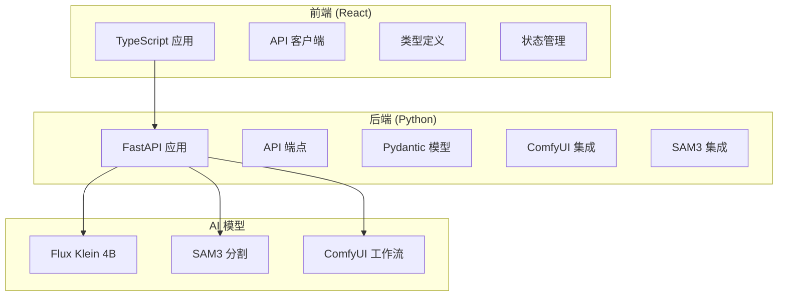
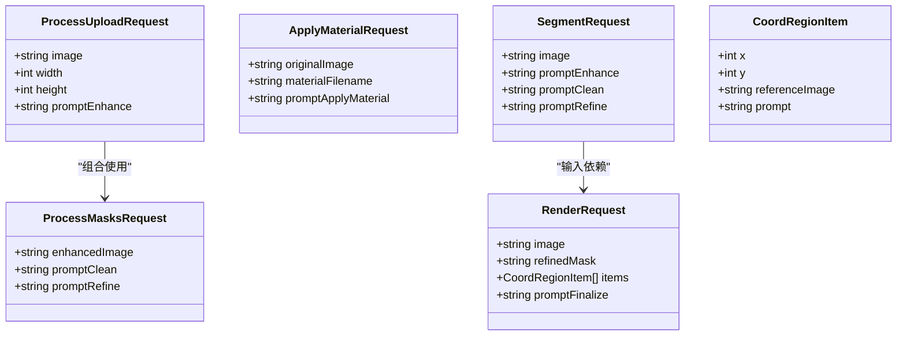
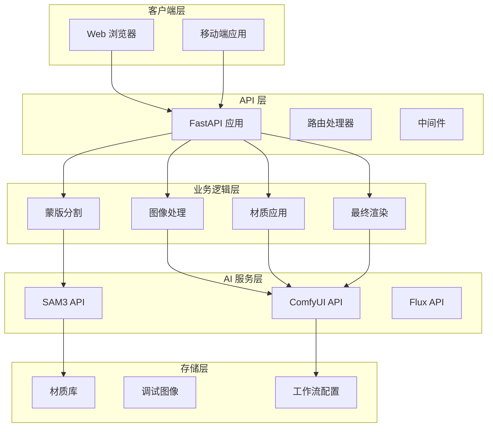
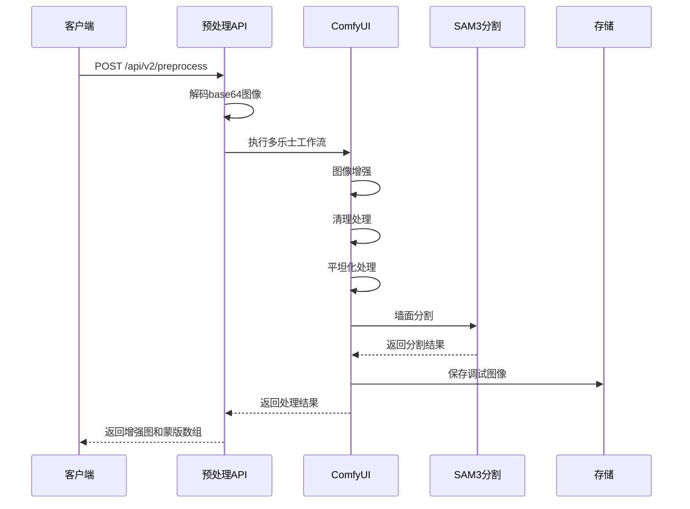
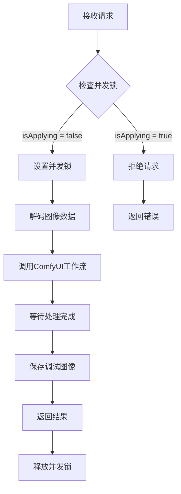
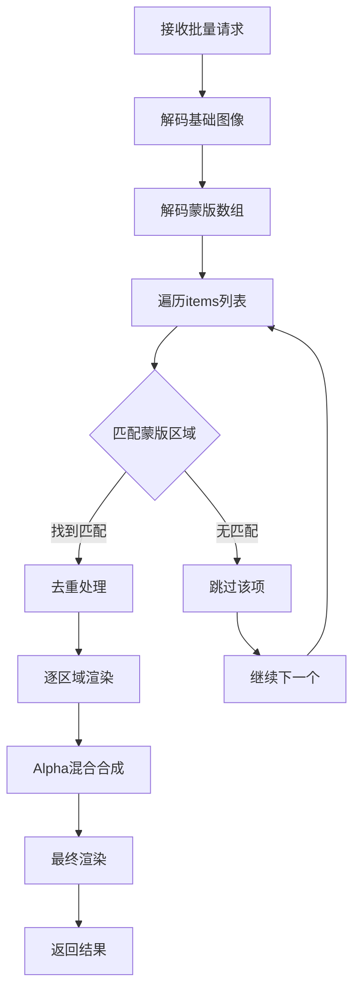
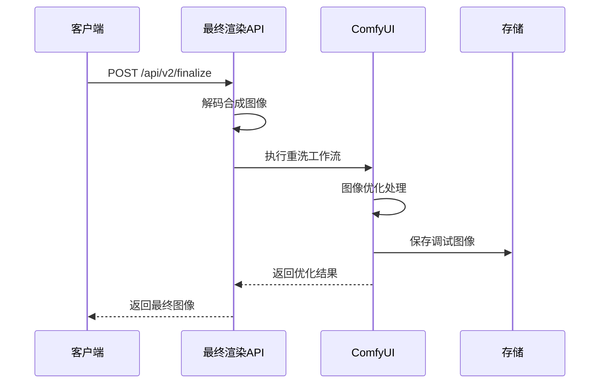
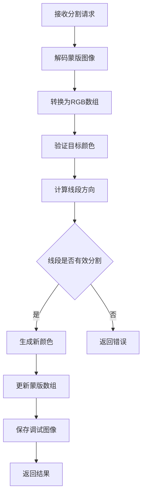
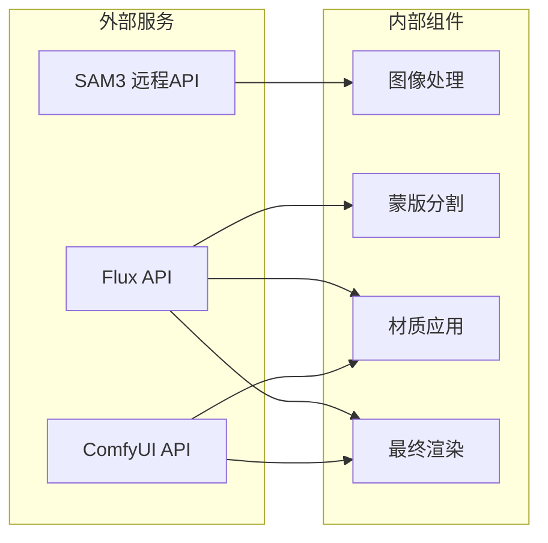
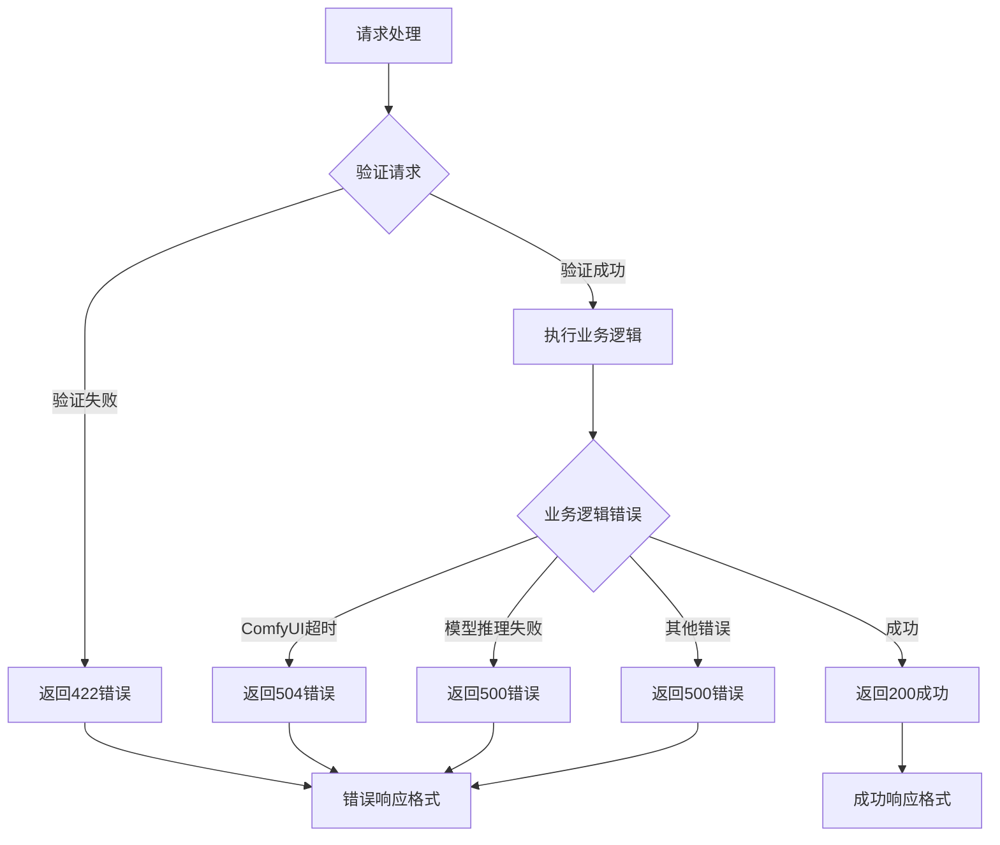

# API 端点设计

<cite>
**本文档引用的文件**
- [backend/main.py](file://backend/main.py)
- [docs/api.md](file://docs/api.md)
- [docs/api-v2.md](file://docs/api-v2.md)
- [docs/frontend-api-guide.md](file://docs/frontend-api-guide.md)
- [src/utils/api.ts](file://src/utils/api.ts)
- [src/types.ts](file://src/types.ts)
- [backend/comfyui_mask_workflow.json](file://backend/comfyui_mask_workflow.json)
- [backend/comfyui_apply_material_workflow.json](file://backend/comfyui_apply_material_workflow.json)
- [backend/comfyui_finalize_workflow.json](file://backend/comfyui_finalize_workflow.json)
</cite>

## 目录
1. [简介](#简介)
2. [项目结构](#项目结构)
3. [核心组件](#核心组件)
4. [架构概览](#架构概览)
5. [详细组件分析](#详细组件分析)
6. [依赖关系分析](#依赖关系分析)
7. [性能考虑](#性能考虑)
8. [故障排除指南](#故障排除指南)
9. [结论](#结论)

## 简介

WallChanger 是一个基于 AI 的室内墙面材质替换应用，采用前后端分离架构。后端使用 Python FastAPI 提供 RESTful API，前端使用 React + TypeScript 构建用户界面。系统集成了多种 AI 模型，包括 SAM3 远程分割 API 和 Flux Klein 4B API，实现了从图像上传到最终渲染的完整工作流程。

## 项目结构

项目采用模块化设计，主要分为以下几个部分：

**图表来源**
- [backend/main.py:1-1250](file://backend/main.py#L1-L1250)
- [src/utils/api.ts:1-197](file://src/utils/api.ts#L1-L197)

**章节来源**
- [backend/main.py:1-1250](file://backend/main.py#L1-L1250)
- [src/utils/api.ts:1-197](file://src/utils/api.ts#L1-L197)

## 核心组件

### API 端点架构

系统提供了两套 API 接口：传统版本和新版本（v2）。

#### 传统版本接口
- `/enhance`: 图像增强处理
- `/process-masks`: 蒙版处理和分割
- `/apply-material`: 材质应用
- `/finalize`: 最终渲染

#### 新版本接口（推荐）
- `/api/v2/preprocess`: 预处理（增强 + 分割）
- `/api/v2/render`: 材质应用（单区域）
- `/api/v2/render-all`: 批量渲染（多区域）
- `/api/v2/finalize`: 最终渲染
- `/api/v2/split-mask`: 蒙版分割

**章节来源**
- [backend/main.py:563-777](file://backend/main.py#L563-L777)
- [backend/main.py:1066-1250](file://backend/main.py#L1066-L1250)

### 数据模型设计

系统使用 Pydantic 定义严格的数据模型，确保请求和响应的一致性：

**图表来源**
- [backend/main.py:477-541](file://backend/main.py#L477-L541)

**章节来源**
- [backend/main.py:477-541](file://backend/main.py#L477-L541)

## 架构概览

系统采用分层架构，清晰分离了业务逻辑、数据处理和外部服务集成：

**图表来源**
- [backend/main.py:31-49](file://backend/main.py#L31-L49)
- [backend/main.py:1066-1250](file://backend/main.py#L1066-L1250)

## 详细组件分析

### 预处理组件（/api/v2/preprocess）

预处理组件是整个工作流的核心，负责图像增强、清理和平坦化处理。

#### 功能流程

**图表来源**
- [backend/main.py:1066-1092](file://backend/main.py#L1066-L1092)
- [backend/main.py:975-1063](file://backend/main.py#L975-L1063)

#### 请求模型

| 字段 | 类型 | 必需 | 默认值 | 说明 |
|------|------|------|--------|------|
| image | string | ✓ | - | 原始图像的 raw base64 编码 |

#### 响应模型

| 字段 | 类型 | 说明 |
|------|------|------|
| enforcedResult | string | 增强后的场景图，base64 PNG |
| masks | string[] | 黑白蒙版图数组，每个元素为 base64 PNG |

**章节来源**
- [backend/main.py:1066-1092](file://backend/main.py#L1066-L1092)
- [docs/api-v2.md:25-74](file://docs/api-v2.md#L25-L74)

### 材质应用组件（/api/v2/render）

材质应用组件负责将特定材质应用到指定的墙面区域。

#### 并发控制机制

**图表来源**
- [backend/main.py:1095-1116](file://backend/main.py#L1095-L1116)

#### 请求模型

| 字段 | 类型 | 必需 | 说明 |
|------|------|------|------|
| enforcedImage | string | ✓ | 预处理返回的 `enforcedResult`，base64 PNG |
| maskImage | string | ✓ | 目标墙面区域的黑白蒙版，base64 PNG |
| materialImage | string | ✓ | 材质贴图，base64 PNG |

#### 响应模型

| 字段 | 类型 | 说明 |
|------|------|------|
| resultImage | string | RGBA PNG 的 base64 编码，只有目标墙面区域包含像素 |

**章节来源**
- [backend/main.py:1095-1116](file://backend/main.py#L1095-L1116)
- [docs/frontend-api-guide.md:320-383](file://docs/frontend-api-guide.md#L320-L383)

### 批量渲染组件（/api/v2/render-all）

批量渲染组件提供了一键焕色功能，支持同时处理多个区域。

#### 处理流程

**图表来源**
- [backend/main.py:1135-1208](file://backend/main.py#L1135-L1208)

#### 请求模型

| 字段 | 类型 | 必需 | 说明 |
|------|------|------|------|
| enforcedImage | string | ✓ | preprocess 返回的 `enforcedResult`，base64 PNG |
| masks | string[] | ✓ | preprocess 返回的 `masks[]` 黑白蒙版数组 |
| items | array | ✓ | 要替换的区域列表 |

#### 响应模型

| 字段 | 类型 | 说明 |
|------|------|------|
| finalImage | string | 最终渲染完成的完整效果图，base64 PNG |

**章节来源**
- [backend/main.py:1135-1208](file://backend/main.py#L1135-L1208)
- [docs/frontend-api-guide.md:435-547](file://docs/frontend-api-guide.md#L435-L547)

### 最终渲染组件（/api/v2/finalize）

最终渲染组件对合成后的图像进行最终优化处理。

#### 处理流程

**图表来源**
- [backend/main.py:1119-1132](file://backend/main.py#L1119-L1132)

#### 请求模型

| 字段 | 类型 | 必需 | 说明 |
|------|------|------|------|
| compositeImage | string | ✓ | canvas 导出的 PNG 合成图，base64 PNG |

#### 响应模型

| 字段 | 类型 | 说明 |
|------|------|------|
| finalImage | string | 最终优化后的 PNG 图片，base64 PNG |

**章节来源**
- [backend/main.py:1119-1132](file://backend/main.py#L1119-L1132)
- [docs/frontend-api-guide.md:386-432](file://docs/frontend-api-guide.md#L386-L432)

### 蒙版分割组件（/api/v2/split-mask）

蒙版分割组件提供手动分割功能，支持将一个区域精确分割为两个子区域。

#### 算法实现

**图表来源**
- [backend/main.py:1211-1249](file://backend/main.py#L1211-L1249)

#### 请求模型

| 字段 | 类型 | 必需 | 说明 |
|------|------|------|------|
| maskImage | string | ✓ | 当前蒙版图的 base64 PNG |
| targetColor | [number, number, number] | ✓ | 要分割的目标区域颜色 [R, G, B] |
| x1, y1 | number | ✓ | 分割线起点坐标 |
| x2, y2 | number | ✓ | 分割线终点坐标 |
| existingColors | [[number, number, number]] | ✓ | 已使用的颜色数组 |

#### 响应模型

| 字段 | 类型 | 说明 |
|------|------|------|
| maskImage | string | 更新后的蒙版图 base64 PNG |
| newColor | [number, number, number] | 新分割出的区域颜色 [R, G, B] |

**章节来源**
- [backend/main.py:1211-1249](file://backend/main.py#L1211-L1249)
- [docs/frontend-api-guide.md:549-607](file://docs/frontend-api-guide.md#L549-L607)

## 依赖关系分析

### 外部服务集成

系统集成了多个外部 AI 服务：

**图表来源**
- [backend/main.py:19-22](file://backend/main.py#L19-L22)
- [backend/main.py:1066-1250](file://backend/main.py#L1066-L1250)

### 错误处理策略

系统采用了统一的错误处理机制：

**图表来源**
- [backend/main.py:8-14](file://backend/main.py#L8-L14)
- [docs/api-v2.md:240-253](file://docs/api-v2.md#L240-L253)

**章节来源**
- [backend/main.py:8-14](file://backend/main.py#L8-L14)
- [docs/api-v2.md:240-253](file://docs/api-v2.md#L240-L253)

## 性能考虑

### 并发控制

系统在关键接口上实现了严格的并发控制：

- `/api/v2/render` 接口是同步处理的，同一时刻只能执行一个任务
- 使用互斥锁 `isApplying` 控制并发访问
- 前端需要等待当前任务完成才能发起新的请求

### 超时配置

- ComfyUI 推理超时：10 分钟
- SAM3 API 调用超时：120 秒
- HTTP 客户端超时：300 秒

### 缓存策略

- 调试图像自动保存到 `backend/debug` 目录
- 处理结果自动保存到调试目录便于问题排查

## 故障排除指南

### 常见错误及解决方案

| 错误类型 | HTTP 状态码 | 原因 | 解决方案 |
|----------|-------------|------|----------|
| 参数校验失败 | 422 | 请求参数格式错误或缺少必需字段 | 检查请求格式，确保所有必需字段都已提供 |
| 服务器内部错误 | 500 | AI 推理失败或服务不可用 | 检查后端日志，确认 AI 服务正常运行 |
| 网关超时 | 504 | ComfyUI 处理超时 | 等待当前任务完成，或检查 GPU 资源 |
| 材质文件不存在 | 404 | 指定的材质文件不存在 | 确认材质文件存在于 `public/materials/` 目录 |

### 调试技巧

1. **启用调试模式**：通过 `debugMode` 参数查看详细的处理过程
2. **检查调试图像**：所有处理步骤都会生成调试图像保存在 `backend/debug` 目录
3. **监控后端日志**：查看详细的错误信息和处理进度

**章节来源**
- [docs/frontend-api-guide.md:1017-1092](file://docs/frontend-api-guide.md#L1017-L1092)

## 结论

WallChanger 的 API 设计体现了现代 Web 应用的最佳实践：

1. **清晰的分层架构**：将业务逻辑、数据处理和外部服务集成清晰分离
2. **严格的类型安全**：使用 Pydantic 确保请求和响应的完整性
3. **完善的错误处理**：统一的错误响应格式和详细的错误信息
4. **并发控制机制**：防止资源竞争和系统过载
5. **可扩展的设计**：支持新功能的添加和现有功能的演进

推荐优先使用 v2 版本的 API 接口，它们提供了更好的用户体验和更清晰的工作流程。传统版本的接口虽然仍受支持，但建议逐步迁移到新的接口体系。