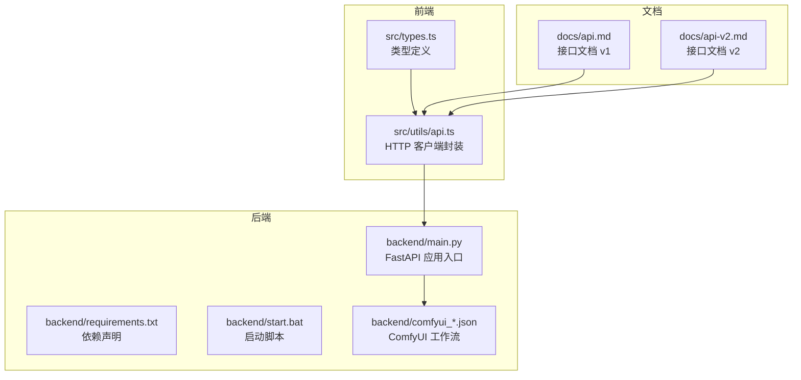
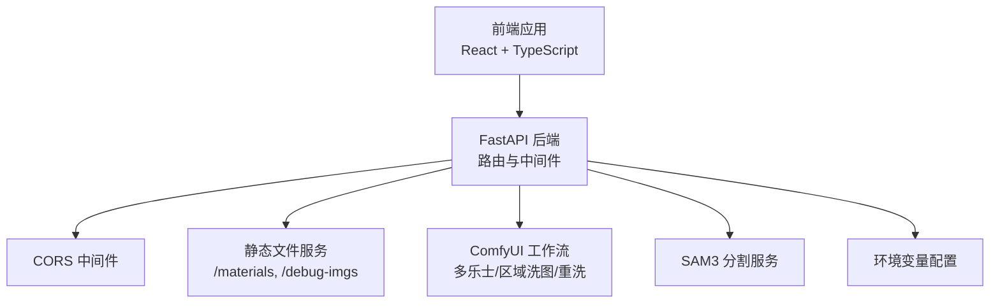
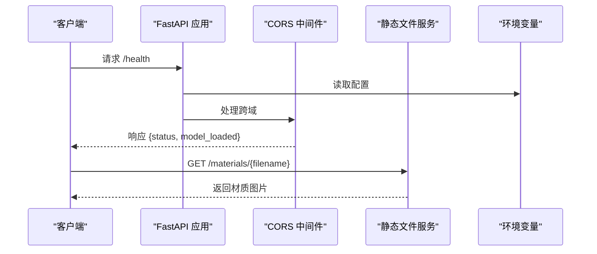
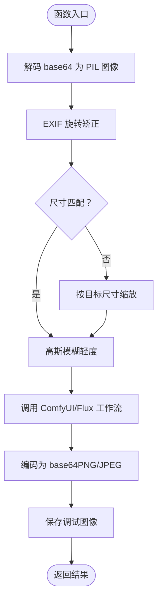
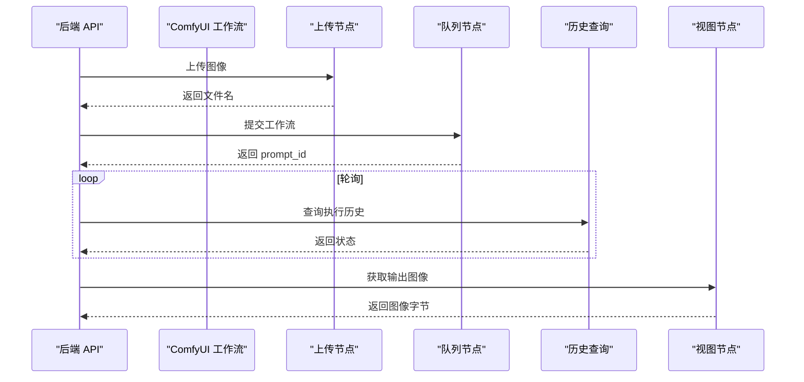
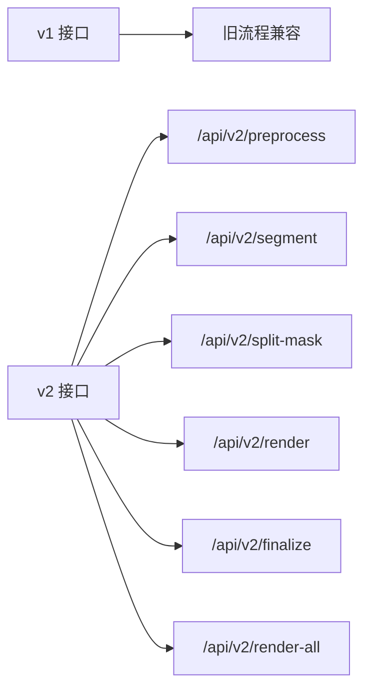
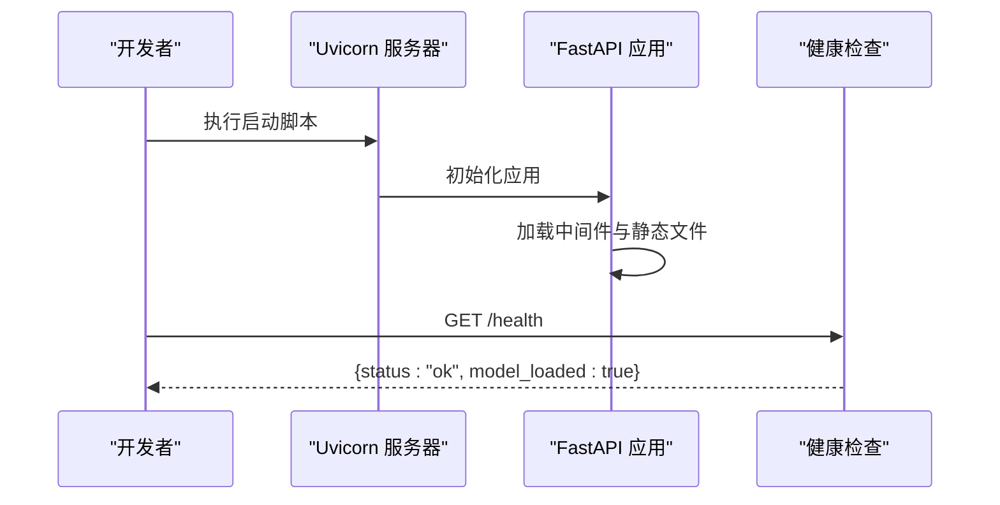
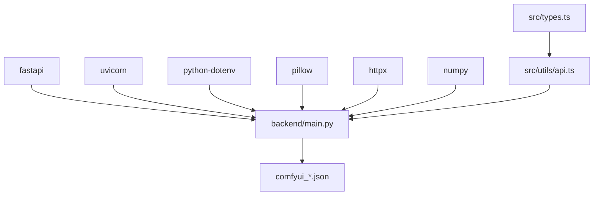

# FastAPI 服务设计

<cite>
**本文档引用的文件**
- [backend/main.py](file://backend/main.py)
- [backend/requirements.txt](file://backend/requirements.txt)
- [backend/start.bat](file://backend/start.bat)
- [backend/comfyui_apply_material_workflow.json](file://backend/comfyui_apply_material_workflow.json)
- [backend/comfyui_finalize_workflow.json](file://backend/comfyui_finalize_workflow.json)
- [backend/comfyui_mask_workflow.json](file://backend/comfyui_mask_workflow.json)
- [docs/api.md](file://docs/api.md)
- [docs/api-v2.md](file://docs/api-v2.md)
- [README.md](file://README.md)
- [src/utils/api.ts](file://src/utils/api.ts)
- [src/types.ts](file://src/types.ts)
</cite>

## 目录
1. [简介](#简介)
2. [项目结构](#项目结构)
3. [核心组件](#核心组件)
4. [架构总览](#架构总览)
5. [详细组件分析](#详细组件分析)
6. [依赖关系分析](#依赖关系分析)
7. [性能考虑](#性能考虑)
8. [故障排除指南](#故障排除指南)
9. [结论](#结论)
10. [附录](#附录)

## 简介
本项目是一个基于 FastAPI 的室内材质替换 AI 应用后端服务，采用模块化设计，集成了图像处理、AI 模型推理与静态资源服务。系统通过多阶段工作流实现从图像上传到最终渲染的完整管线，支持实时预览与批量处理两种模式。后端通过环境变量配置外部服务（ComfyUI、SAM3），并通过 CORS 中间件与静态文件服务为前端提供资源访问能力。

## 项目结构
后端代码集中在 backend 目录，包含主应用入口、依赖声明、启动脚本以及与 ComfyUI 的工作流配置文件。前端位于 src 目录，通过 HTTP 接口与后端交互。

**图表来源**
- [backend/main.py:1-1227](file://backend/main.py#L1-L1227)
- [backend/requirements.txt:1-8](file://backend/requirements.txt#L1-L8)
- [backend/start.bat:1-3](file://backend/start.bat#L1-L3)
- [src/utils/api.ts:1-200](file://src/utils/api.ts#L1-L200)
- [src/types.ts:1-89](file://src/types.ts#L1-L89)
- [docs/api.md:1-309](file://docs/api.md#L1-L309)
- [docs/api-v2.md:1-274](file://docs/api-v2.md#L1-L274)

**章节来源**
- [backend/main.py:1-1227](file://backend/main.py#L1-L1227)
- [backend/requirements.txt:1-8](file://backend/requirements.txt#L1-L8)
- [backend/start.bat:1-3](file://backend/start.bat#L1-L3)
- [README.md:1-91](file://README.md#L1-L91)

## 核心组件
- 应用初始化与中间件链
  - FastAPI 实例创建与 CORS 中间件配置，允许跨域访问，支持任意源、方法与头部。
  - 静态文件服务挂载：/materials（材质图片）、/debug-imgs（调试图片）。
- 环境变量与全局配置
  - 加载 .env 文件，读取 SAM3 API 地址、ComfyUI 主机地址、材质目录路径等。
- 数据模型与请求/响应结构
  - Pydantic 模型定义了各接口的输入输出结构，确保数据一致性与类型安全。
- 路由组织与版本策略
  - v1 与 v2 双版本并行：v1 保留兼容接口，v2 采用 headless 流水线与更清晰的职责分离。
- 异常处理与错误响应
  - 统一的 HTTP 异常抛出与错误响应格式，便于前端处理。
- 启动流程与健康检查
  - Uvicorn 启动脚本，/health 健康检查端点。

**章节来源**
- [backend/main.py:16-48](file://backend/main.py#L16-L48)
- [backend/main.py:477-809](file://backend/main.py#L477-L809)
- [backend/main.py:545-547](file://backend/main.py#L545-L547)
- [backend/start.bat:1-3](file://backend/start.bat#L1-L3)

## 架构总览
系统采用“前端-后端-外部服务”三层架构。前端通过 HTTP 接口调用后端，后端负责图像处理与 AI 推理协调，外部服务（ComfyUI、SAM3）提供具体模型能力。

**图表来源**
- [backend/main.py:31-48](file://backend/main.py#L31-L48)
- [backend/main.py:19-27](file://backend/main.py#L19-L27)
- [backend/main.py:811-947](file://backend/main.py#L811-L947)
- [backend/main.py:325-359](file://backend/main.py#L325-L359)

## 详细组件分析

### 应用初始化与中间件链
- CORS 中间件
  - 允许任意源、凭据、方法与头部，满足开发与跨域调试需求。
- 静态文件服务
  - /materials：挂载材质目录，供前端展示缩略图与下载材质。
  - /debug-imgs：挂载调试目录，供前端调试面板加载中间结果。
- 环境变量加载
  - 通过 python-dotenv 加载 .env，读取外部服务地址与路径配置。

**图表来源**
- [backend/main.py:31-48](file://backend/main.py#L31-L48)
- [backend/main.py:16-16](file://backend/main.py#L16-L16)

**章节来源**
- [backend/main.py:31-48](file://backend/main.py#L31-L48)
- [backend/main.py:16-16](file://backend/main.py#L16-L16)

### 图像处理与算法组件
- 图像编解码工具
  - base64 与 PIL Image 的互转，支持 JPEG 透明度处理。
- 尺寸缩放与对齐
  - snap_to_64：按目标长边缩放并对齐到 64 倍数，适配模型输入规格。
- 蒙版分割算法
  - split_mask_by_line：基于定向线将目标区域分割为两个子区域，避免颜色冲突。
- 区域合成
  - composite_regions：按蒙版颜色将多个区域结果合成至基础图像，边缘羽化。

**图表来源**
- [backend/main.py:56-77](file://backend/main.py#L56-L77)
- [backend/main.py:79-322](file://backend/main.py#L79-L322)
- [backend/main.py:427-471](file://backend/main.py#L427-L471)
- [backend/main.py:362-401](file://backend/main.py#L362-L401)

**章节来源**
- [backend/main.py:56-77](file://backend/main.py#L56-L77)
- [backend/main.py:427-471](file://backend/main.py#L427-L471)
- [backend/main.py:362-401](file://backend/main.py#L362-L401)

### ComfyUI 工作流集成
- 多乐士蒙版识别工作流
  - 输入：原始图像 → 输出：强化场景图、墙面蒙版、天花板蒙版。
- 区域洗图工作流
  - 输入：强化场景图、材质参考图、二值蒙版 → 输出：带 alpha 通道的结果图。
- 重洗工作流
  - 输入：合成后的复合图 → 输出：最终渲染图。

**图表来源**
- [backend/main.py:950-1038](file://backend/main.py#L950-L1038)
- [backend/main.py:811-888](file://backend/main.py#L811-L888)
- [backend/main.py:891-947](file://backend/main.py#L891-L947)

**章节来源**
- [backend/main.py:950-1038](file://backend/main.py#L950-L1038)
- [backend/main.py:811-888](file://backend/main.py#L811-L888)
- [backend/main.py:891-947](file://backend/main.py#L891-L947)

### API 版本管理策略
- v1 与 v2 并行
  - v1：保留旧流程兼容接口（如 /enhance、/process-masks、/apply-material）。
  - v2：采用 headless 流水线，明确职责分离：预处理（segment）→ 区域细分（split-mask）→ 渲染（render）→ 最终渲染（finalize）。
- 路由装饰器最佳实践
  - 使用 @app.post/@app.get 装饰器定义端点，结合 Pydantic 模型进行参数校验与序列化。
  - 对于同步接口（如 v2/render），通过互斥锁避免并发冲突。

**图表来源**
- [docs/api-v2.md:10-21](file://docs/api-v2.md#L10-L21)
- [docs/api.md:16-22](file://docs/api.md#L16-L22)
- [backend/main.py:1041-1185](file://backend/main.py#L1041-L1185)

**章节来源**
- [docs/api-v2.md:10-21](file://docs/api-v2.md#L10-L21)
- [docs/api.md:16-22](file://docs/api.md#L16-L22)
- [backend/main.py:1041-1185](file://backend/main.py#L1041-L1185)

### 错误处理策略与异常类型
- 统一错误响应格式
  - 所有错误返回 JSON：{ "detail": "错误描述" }。
- 常见 HTTP 状态码
  - 404：材质文件未找到。
  - 422：参数校验失败（Pydantic）。
  - 500：模型推理失败或未返回图片。
  - 504：ComfyUI 超时（默认等待上限）。
- 异常抛出与捕获
  - 使用 HTTPException 抛出标准错误，配合 try-catch 与超时轮询处理外部服务异常。

**章节来源**
- [docs/api.md:46-56](file://docs/api.md#L46-L56)
- [docs/api-v2.md:240-253](file://docs/api-v2.md#L240-L253)
- [backend/main.py:654-656](file://backend/main.py#L654-L656)
- [backend/main.py:298-299](file://backend/main.py#L298-L299)
- [backend/main.py:873-874](file://backend/main.py#L873-L874)

### 服务启动流程与健康检查
- 启动命令
  - uvicorn main:app --host 0.0.0.0 --port 8100 --reload。
- 健康检查
  - GET /health 返回服务状态与模型加载状态。

**图表来源**
- [backend/start.bat:1-3](file://backend/start.bat#L1-L3)
- [backend/main.py:545-547](file://backend/main.py#L545-L547)

**章节来源**
- [backend/start.bat:1-3](file://backend/start.bat#L1-L3)
- [backend/main.py:545-547](file://backend/main.py#L545-L547)

## 依赖关系分析
- 外部依赖
  - fastapi、uvicorn：Web 框架与 ASGI 服务器。
  - python-dotenv：环境变量加载。
  - pillow：图像处理。
  - httpx：异步 HTTP 客户端。
  - numpy：数值计算与蒙版处理。
- 内部依赖
  - ComfyUI 工作流 JSON 文件作为模板，动态注入输入与参数。
  - 前端通过 src/utils/api.ts 调用后端接口，类型定义位于 src/types.ts。

**图表来源**
- [backend/requirements.txt:1-8](file://backend/requirements.txt#L1-L8)
- [backend/main.py:13-13](file://backend/main.py#L13-L13)
- [src/utils/api.ts:1-200](file://src/utils/api.ts#L1-L200)
- [src/types.ts:1-89](file://src/types.ts#L1-L89)

**章节来源**
- [backend/requirements.txt:1-8](file://backend/requirements.txt#L1-L8)
- [src/utils/api.ts:1-200](file://src/utils/api.ts#L1-L200)
- [src/types.ts:1-89](file://src/types.ts#L1-L89)

## 性能考虑
- 并发与互斥
  - v2/render 为同步接口，通过互斥锁避免 ComfyUI 并发冲突。
  - v2/render-all 支持按区域并行处理，提升吞吐量。
- 超时与轮询
  - ComfyUI 调用设置较长超时（600 秒），并采用轮询查询历史状态。
- 图像处理优化
  - snap_to_64 对齐到 64 倍数，减少模型输入尺寸波动。
  - 蒙版分割与合成使用 NumPy 向量化操作，提高效率。
- 静态资源缓存
  - /materials 与 /debug-imgs 通过静态文件服务提供，减少后端处理开销。

[本节为通用性能讨论，无需特定文件来源]

## 故障排除指南
- 健康检查失败
  - 检查后端是否正常启动，确认 /health 返回 {status: "ok"}。
- 材质文件未找到
  - 确认 MATERIALS_PATH 指向正确目录，且文件存在。
- ComfyUI 超时
  - 检查 ComfyUI 服务状态与网络连通性，适当增加超时时间。
- 参数校验失败
  - 按接口文档校验请求体字段，确保 base64 格式与必填字段齐全。
- SAM3 返回空掩码
  - 调整置信度参数或更换提示词，确保场景中有可识别区域。

**章节来源**
- [docs/api.md:46-56](file://docs/api.md#L46-L56)
- [docs/api-v2.md:240-253](file://docs/api-v2.md#L240-L253)
- [backend/main.py:654-656](file://backend/main.py#L654-L656)
- [backend/main.py:298-299](file://backend/main.py#L298-L299)

## 结论
本 FastAPI 服务通过清晰的中间件链、静态资源服务与严格的 API 版本策略，构建了稳定高效的图像处理与 AI 推理后端。v2 版本的 headless 流水线显著提升了可维护性与扩展性，配合前端互斥锁与并行渲染，实现了良好的用户体验。建议在生产环境中固定外部服务地址与超时参数，并引入日志与监控以提升可观测性。

[本节为总结性内容，无需特定文件来源]

## 附录
- 环境变量与配置
  - SAM3_API：远程 SAM3 分割服务地址。
  - COMFYUI_HOST：ComfyUI 服务主机地址。
  - MATERIALS_PATH：材质图片目录路径。
- 启动与访问
  - 启动：uvicorn main:app --host 0.0.0.0 --port 8100 --reload。
  - 访问：前端默认端口 5173，后端默认端口 8100。

**章节来源**
- [backend/main.py:19-27](file://backend/main.py#L19-L27)
- [backend/start.bat:1-3](file://backend/start.bat#L1-L3)
- [README.md:70-76](file://README.md#L70-L76)