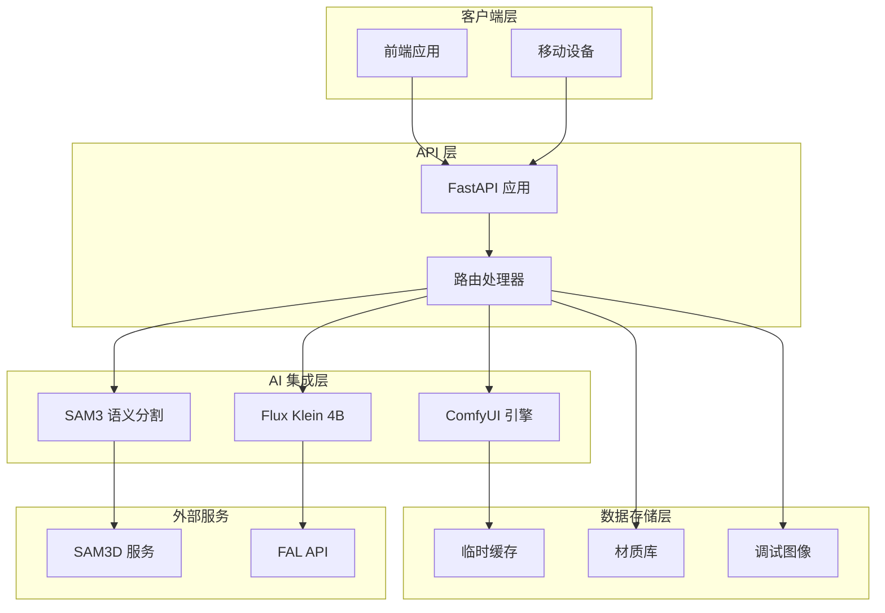
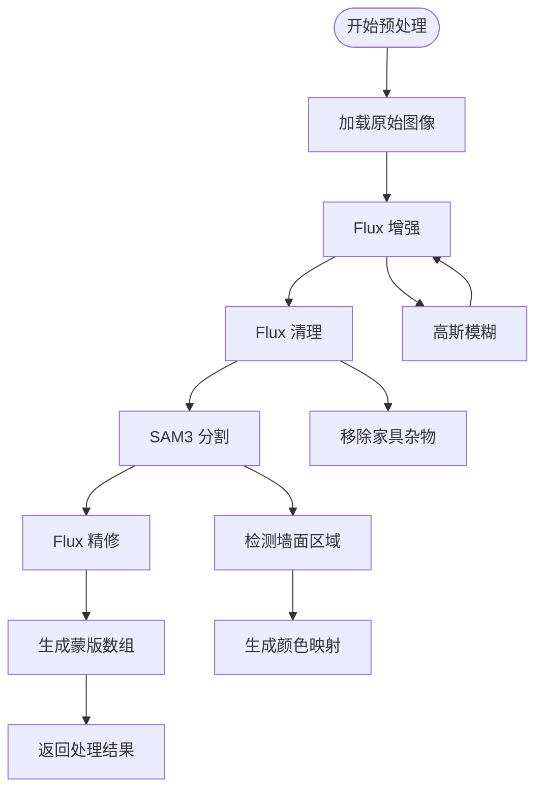
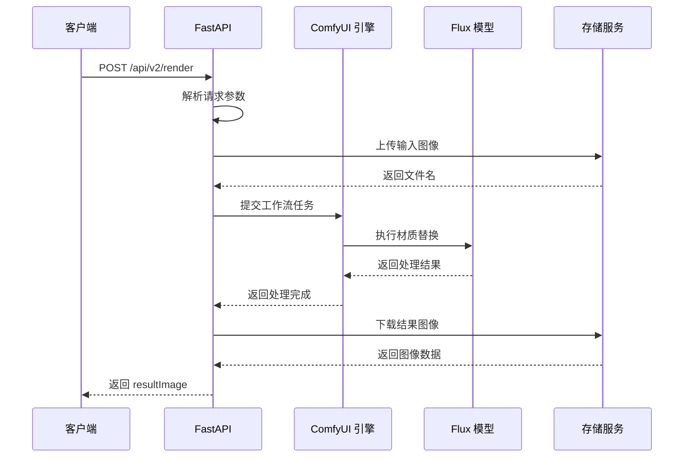
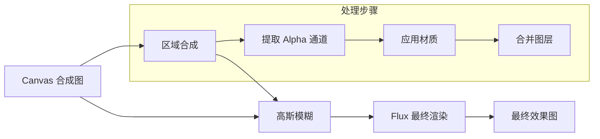
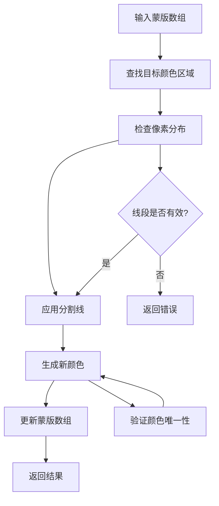

# 后端服务

<cite>
**本文档引用的文件**
- [backend/main.py](file://backend/main.py)
- [backend/requirements.txt](file://backend/requirements.txt)
- [backend/comfyui_apply_material_workflow.json](file://backend/comfyui_apply_material_workflow.json)
- [backend/comfyui_finalize_workflow.json](file://backend/comfyui_finalize_workflow.json)
- [backend/comfyui_mask_workflow.json](file://backend/comfyui_mask_workflow.json)
- [backend/start.bat](file://backend/start.bat)
- [docs/api.md](file://docs/api.md)
- [docs/api-v2.md](file://docs/api-v2.md)
- [docs/frontend-api-guide.md](file://docs/frontend-api-guide.md)
- [README.md](file://README.md)
- [API 调用文档.md](file://API 调用文档.md)
</cite>

## 目录
1. [项目概述](#项目概述)
2. [系统架构](#系统架构)
3. [核心组件](#核心组件)
4. [API 接口详解](#api-接口详解)
5. [AI 模型集成架构](#ai-模型集成架构)
6. [图像处理流程](#图像处理流程)
7. [数据流分析](#数据流分析)
8. [错误处理机制](#错误处理机制)
9. [性能优化策略](#性能优化策略)
10. [安全考虑](#安全考虑)
11. [配置与部署](#配置与部署)
12. [故障排除指南](#故障排除指南)
13. [结论](#结论)

## 项目概述

WallChanger 是一个基于 FastAPI 的室内材质替换 AI 应用后端服务。该系统集成了多种 AI 模型和技术组件，为用户提供从室内照片到最终渲染效果的完整材质替换解决方案。

### 主要特性

- **智能墙面识别**：使用 SAM3 语义分割模型自动识别墙面、地板、天花板等区域
- **材质替换**：基于 Flux Klein 4B 文生图模型实现高质量的材质替换
- **工作流引擎**：集成 ComfyUI 工作流引擎进行复杂的图像处理
- **实时预览**：支持用户逐步预览每面墙的材质效果
- **批量处理**：提供一键焕色功能，支持批量材质替换

### 技术栈

- **后端框架**：FastAPI (Python 3.9+)
- **AI 引擎**：ComfyUI + Flux Klein 4B + SAM3
- **图像处理**：Pillow + NumPy
- **网络通信**：HTTP/HTTPS + WebSocket
- **部署**：Uvicorn ASGI 服务器

## 系统架构



**架构图来源**
- [backend/main.py:31-49](file://backend/main.py#L31-L49)
- [backend/main.py:18-28](file://backend/main.py#L18-L28)

## 核心组件

### FastAPI 应用实例

后端服务基于 FastAPI 构建，提供了高性能的异步 Web 服务。应用实例包含了完整的中间件配置、静态文件服务和 CORS 支持。

**核心配置**：
- CORS 中间件：允许跨域请求
- 静态文件服务：提供材质图片和调试图像访问
- 环境变量配置：支持动态配置各种服务参数

**Section sources**
- [backend/main.py:31-49](file://backend/main.py#L31-L49)
- [backend/main.py:18-28](file://backend/main.py#L18-L28)

### 图像处理组件

系统实现了完整的图像处理管道，包括预处理、分割、材质应用和最终渲染。

**主要处理函数**：
- `base64_to_image()`: Base64 图像解码
- `image_to_base64()`: 图像编码为 Base64
- `composite_regions()`: 区域合成算法
- `generate_unique_color()`: 颜色生成器

**Section sources**
- [backend/main.py:56-69](file://backend/main.py#L56-L69)
- [backend/main.py:362-402](file://backend/main.py#L362-L402)
- [backend/main.py:404-425](file://backend/main.py#L404-L425)

## API 接口详解

### 健康检查接口

**GET /health**
- **功能**：检查后端服务状态
- **响应**：包含服务状态和模型加载状态
- **用途**：前端启动时的服务可用性检查

**响应示例**：
```json
{
  "status": "ok",
  "model_loaded": true
}
```

**Section sources**
- [backend/main.py:545-548](file://backend/main.py#L545-L548)
- [docs/api.md:61-72](file://docs/api.md#L61-L72)

### 材质管理接口

**GET /api/materials**
- **功能**：获取可用材质列表
- **响应**：材质信息数组，包含名称、文件名和访问 URL
- **用途**：前端材质选择界面的数据源

**响应示例**：
```json
[
  {
    "name": "白色乳胶漆",
    "filename": "白色乳胶漆.jpg",
    "url": "/materials/白色乳胶漆.jpg"
  }
]
```

**Section sources**
- [backend/main.py:550-561](file://backend/main.py#L550-L561)
- [docs/api.md:76-91](file://docs/api.md#L76-L91)

### 预处理接口

**POST /api/v2/preprocess**
- **功能**：执行完整的图像预处理流程
- **输入**：原始图片 Base64 编码
- **输出**：增强后的场景图和墙面蒙版数组
- **处理流程**：增强 → 清理 → 分割 → 精修

**请求示例**：
```json
{
  "image": "<raw base64>"
}
```

**响应示例**：
```json
{
  "enforcedResult": "<raw base64 PNG>",
  "masks": ["<raw base64 PNG>", "<raw base64 PNG>"]
}
```

**Section sources**
- [docs/api.md:108-145](file://docs/api.md#L108-L145)
- [docs/frontend-api-guide.md:265-318](file://docs/frontend-api-guide.md#L265-L318)

### 材质应用接口

**POST /api/v2/render**
- **功能**：将指定材质应用到目标墙面区域
- **输入**：增强图、蒙版图、材质参考图
- **输出**：带 Alpha 通道的结果图层
- **特点**：同步接口，支持多次调用但串行执行

**请求示例**：
```json
{
  "enforcedImage": "<raw base64 PNG>",
  "maskImage": "<raw base64 PNG>",
  "materialImage": "<raw base64 PNG>"
}
```

**响应示例**：
```json
{
  "resultImage": "<raw base64 PNG>"
}
```

**Section sources**
- [docs/api.md:148-194](file://docs/api.md#L148-L194)
- [docs/frontend-api-guide.md:320-383](file://docs/frontend-api-guide.md#L320-L383)

### 最终渲染接口

**POST /api/v2/finalize**
- **功能**：对合成后的图像进行最终优化渲染
- **输入**：canvas 合成图
- **输出**：最终渲染效果图
- **特点**：对图像质量进行最终提升

**请求示例**：
```json
{
  "compositeImage": "<raw base64 PNG>"
}
```

**响应示例**：
```json
{
  "finalImage": "<raw base64 PNG>"
}
```

**Section sources**
- [docs/api.md:245-273](file://docs/api.md#L245-L273)
- [docs/frontend-api-guide.md:386-432](file://docs/frontend-api-guide.md#L386-L432)

## AI 模型集成架构

### SAM3 语义分割模型

SAM3 是系统的核心分割引擎，负责从室内照片中自动识别墙面、地板、天花板等区域。

**集成方式**：
- **远程 API 调用**：通过 HTTP 接口与 SAM3D 服务通信
- **参数配置**：支持自定义提示词和置信度阈值
- **输出格式**：返回区域掩码和颜色映射

**配置参数**：
- 提示词：`"wall"` (墙面识别)
- 置信度：默认 0.3
- 模型精度：FP16

**Section sources**
- [backend/main.py:325-359](file://backend/main.py#L325-L359)
- [backend/comfyui_mask_workflow.json:650-739](file://backend/comfyui_mask_workflow.json#L650-L739)

### Flux Klein 4B 文生图模型

Flux Klein 4B 是系统的主要图像编辑引擎，支持高质量的图像到图像变换。

**集成方式**：
- **FAL API 客户端**：通过官方 @fal-ai/client SDK
- **工作流引擎**：集成 ComfyUI 工作流进行复杂处理
- **LoRA 权重**：支持自定义材质风格

**模型特性**：
- **推理步数**：4步快速推理
- **输出格式**：PNG/JPEG/WebP
- **尺寸支持**：自定义分辨率

**Section sources**
- [backend/main.py:79-323](file://backend/main.py#L79-L323)
- [API 调用文档.md:1-235](file://API 调用文档.md#L1-L235)

### ComfyUI 工作流引擎

ComfyUI 提供了强大的图像处理工作流，支持复杂的多步骤处理管道。

**工作流类型**：
- **材质应用工作流** (`comfyui_apply_material_workflow.json`)
- **最终渲染工作流** (`comfyui_finalize_workflow.json`)
- **蒙版生成工作流** (`comfyui_mask_workflow.json`)

**工作流特点**：
- **节点化处理**：通过节点连接实现复杂数据流
- **参数化配置**：支持动态参数调整
- **GPU 加速**：充分利用显卡性能

**Section sources**
- [backend/comfyui_apply_material_workflow.json:1-432](file://backend/comfyui_apply_material_workflow.json#L1-L432)
- [backend/comfyui_finalize_workflow.json:1-217](file://backend/comfyui_finalize_workflow.json#L1-L217)
- [backend/comfyui_mask_workflow.json:1-831](file://backend/comfyui_mask_workflow.json#L1-L831)

## 图像处理流程

### 预处理流水线



**流程图来源**
- [backend/main.py:682-717](file://backend/main.py#L682-L717)
- [backend/main.py:79-323](file://backend/main.py#L79-L323)

### 材质应用流程



**流程图来源**
- [backend/main.py:754-775](file://backend/main.py#L754-L775)
- [backend/main.py:79-323](file://backend/main.py#L79-L323)

### 最终渲染流程



**流程图来源**
- [backend/main.py:670-677](file://backend/main.py#L670-L677)
- [backend/main.py:362-402](file://backend/main.py#L362-L402)

## 数据流分析

### 图像数据流

系统采用 Base64 编码的图像数据传输方式，确保了跨平台兼容性和数据完整性。

**数据格式规范**：
- **编码方式**：Base64 RAW 格式（不含 data URI 前缀）
- **支持格式**：PNG、JPEG、WebP
- **尺寸限制**：最大 16384×16384 像素
- **内存管理**：自动清理临时文件

**数据流路径**：
1. 客户端上传原始图像
2. 后端解码 Base64 数据
3. 图像预处理和增强
4. AI 模型推理处理
5. 结果图像编码返回

**Section sources**
- [docs/api.md:25-51](file://docs/api.md#L25-L51)
- [docs/frontend-api-guide.md:609-678](file://docs/frontend-api-guide.md#L609-L678)

### 颜色映射机制

系统使用独特的颜色映射机制来管理多区域材质替换。

**颜色生成算法**：
- **距离阈值**：最小欧几里得距离 80
- **数值范围**：28-228 的 RGB 值
- **尝试次数**：最多 300 次随机尝试
- **回退策略**：使用橙色 [255, 128, 0]

**区域分割算法**：


**流程图来源**
- [backend/main.py:427-472](file://backend/main.py#L427-L472)
- [backend/main.py:404-425](file://backend/main.py#L404-L425)

## 错误处理机制

### HTTP 状态码规范

系统遵循标准的 HTTP 状态码规范，提供清晰的错误信息。

**状态码分类**：
- **2xx 成功**：请求处理成功
- **4xx 客户端错误**：参数验证失败、资源不存在
- **5xx 服务器错误**：AI 推理失败、服务异常

**错误响应格式**：
```json
{
  "detail": "错误描述信息"
}
```

**Section sources**
- [docs/api.md:46-56](file://docs/api.md#L46-L56)
- [docs/frontend-api-guide.md:1017-1035](file://docs/frontend-api-guide.md#L1017-L1035)

### 异常处理策略

系统实现了多层次的异常处理机制：

**模型加载异常**：
- SAM3 API 连接失败
- Flux 模型初始化异常
- ComfyUI 工作流加载错误

**图像处理异常**：
- Base64 解码失败
- 图像格式不支持
- 内存不足错误

**网络通信异常**：
- API 调用超时
- 服务器无响应
- 网络连接中断

**Section sources**
- [backend/main.py:325-359](file://backend/main.py#L325-L359)
- [backend/main.py:79-323](file://backend/main.py#L79-L323)

## 性能优化策略

### 并发控制

系统采用了严格的并发控制策略，确保 AI 推理任务的稳定执行。

**互斥锁机制**：
- `isApplying` 状态标志
- 前端调用排队
- 后端任务串行执行

**性能监控**：
- 推理时间统计
- GPU 使用率监控
- 内存使用情况跟踪

**Section sources**
- [docs/frontend-api-guide.md:751-807](file://docs/frontend-api-guide.md#L751-L807)
- [docs/api.md:42-45](file://docs/api.md#L42-L45)

### 缓存策略

系统实现了多级缓存机制来提升响应速度。

**静态资源缓存**：
- 材质图片缓存
- 调试图像缓存
- 工作流模板缓存

**计算结果缓存**：
- 中间处理结果
- 预处理缓存
- 推理结果缓存

**Section sources**
- [backend/main.py:41-49](file://backend/main.py#L41-L49)
- [backend/main.py:79-323](file://backend/main.py#L79-L323)

### 资源管理

**内存优化**：
- 及时释放临时图像数据
- 控制批处理大小
- 优化 NumPy 数组操作

**GPU 优化**：
- 显存使用监控
- 推理步数优化
- 批量处理策略

## 安全考虑

### 认证与授权

**API 密钥管理**：
- FAL API Key 环境变量配置
- 服务端密钥存储
- 客户端密钥代理

**CORS 配置**：
- 允许跨域请求
- 严格的安全头设置
- 预检请求处理

**Section sources**
- [README.md:33-39](file://README.md#L33-L39)
- [backend/main.py:33-39](file://backend/main.py#L33-L39)

### 数据安全

**图像数据保护**：
- Base64 编码传输
- 临时文件清理
- 内存中数据处理

**隐私保护**：
- 用户上传数据处理
- 日志记录最小化
- 数据删除机制

**Section sources**
- [docs/api.md:39-40](file://docs/api.md#L39-L40)
- [docs/frontend-api-guide.md:1071-1092](file://docs/frontend-api-guide.md#L1071-L1092)

## 配置与部署

### 环境配置

系统支持灵活的环境配置，通过环境变量控制各种行为。

**核心配置项**：
- `FAL_KEY`: FAL API 认证密钥
- `SAM3_API`: SAM3 分割服务地址
- `COMFYUI_HOST`: ComfyUI 服务地址
- `MATERIALS_PATH`: 材质文件目录

**部署配置**：
- Docker 容器化部署
- Kubernetes 集群部署
- 云服务托管

**Section sources**
- [README.md:24-40](file://README.md#L24-L40)
- [backend/start.bat:1-3](file://backend/start.bat#L1-L3)

### 依赖管理

**Python 依赖**：
- FastAPI: Web 框架
- Uvicorn: ASGI 服务器
- Pillow: 图像处理
- NumPy: 数值计算
- HTTPX: 异步 HTTP 客户端

**AI 模型依赖**：
- Flux Klein 4B 模型权重
- SAM3 模型文件
- ComfyUI 工作流模板

**Section sources**
- [backend/requirements.txt:1-8](file://backend/requirements.txt#L1-L8)
- [README.md:12-16](file://README.md#L12-L16)

## 故障排除指南

### 常见问题诊断

**服务启动问题**：
- 检查端口占用情况
- 验证 Python 环境版本
- 确认依赖包安装完成

**AI 模型问题**：
- 验证 GPU 显存充足
- 检查模型文件完整性
- 确认 API 密钥有效

**网络连接问题**：
- 测试 API 服务连通性
- 检查防火墙设置
- 验证代理配置

**Section sources**
- [docs/frontend-api-guide.md:1071-1092](file://docs/frontend-api-guide.md#L1071-L1092)
- [README.md:51-69](file://README.md#L51-L69)

### 性能调优

**GPU 性能优化**：
- 调整推理步数
- 优化批处理大小
- 监控显存使用

**网络性能优化**：
- CDN 加速静态资源
- 压缩图像传输
- 连接池复用

**内存优化**：
- 及时清理临时文件
- 优化数据结构
- 减少内存复制

### 日志监控

系统提供了详细的日志记录机制，便于问题诊断和性能监控。

**日志级别**：
- 调试日志：详细的操作流程
- 信息日志：关键事件记录
- 错误日志：异常和错误信息

**监控指标**：
- 响应时间统计
- 错误率监控
- 资源使用情况

## 结论

WallChanger 后端服务是一个高度集成的 AI 图像处理系统，成功地将多种先进的 AI 技术整合到一个统一的平台中。通过合理的架构设计、完善的错误处理机制和优化的性能策略，该系统能够为用户提供稳定可靠的室内材质替换服务。

### 技术优势

- **模块化设计**：清晰的组件分离和接口定义
- **高性能实现**：充分利用 GPU 和异步处理能力
- **可扩展性**：支持多种 AI 模型和工作流配置
- **易维护性**：标准化的代码结构和文档

### 发展方向

未来可以考虑的方向包括：
- 更多 AI 模型的支持
- 分布式部署架构
- 实时协作功能
- 更丰富的材质库

该系统的成功实施为类似的 AI 图像处理应用提供了宝贵的参考经验。