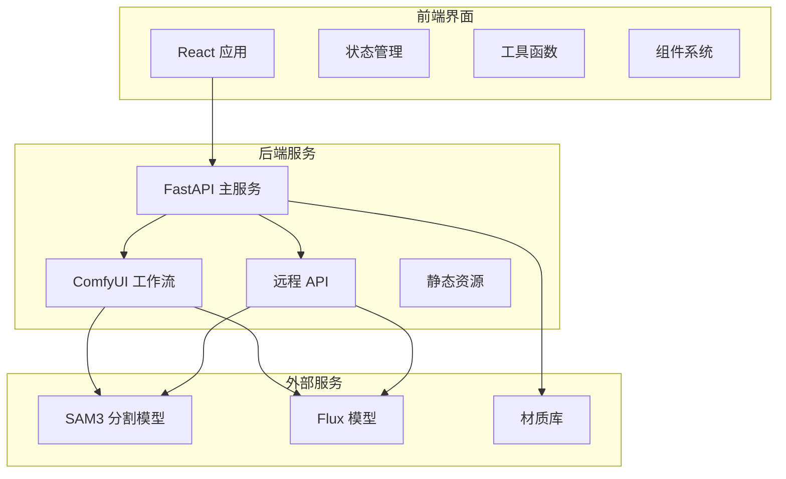
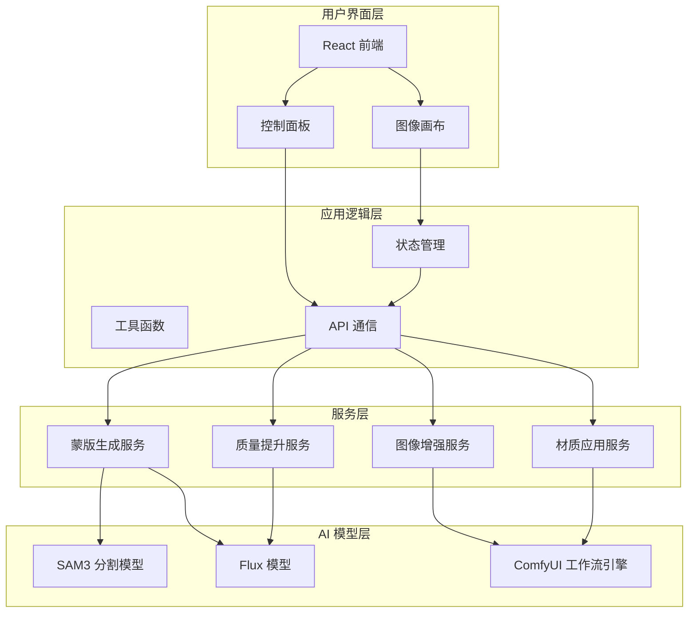
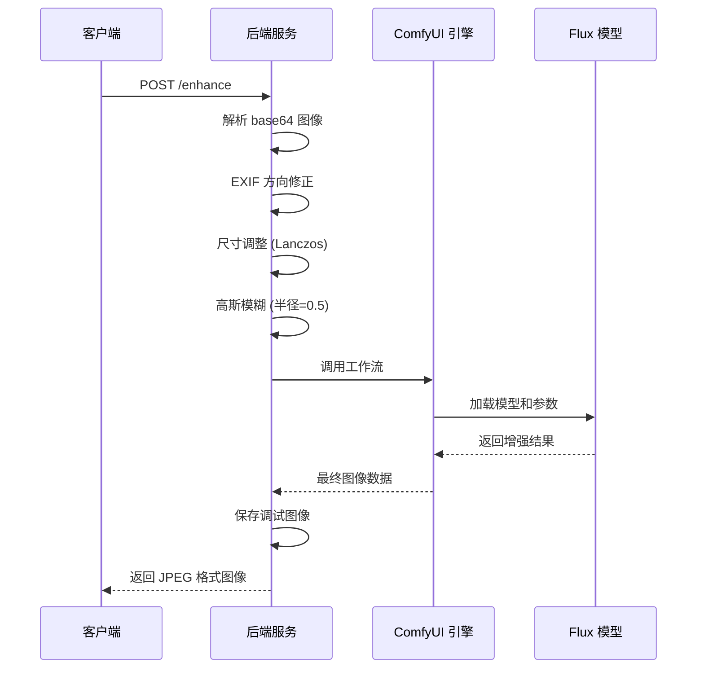
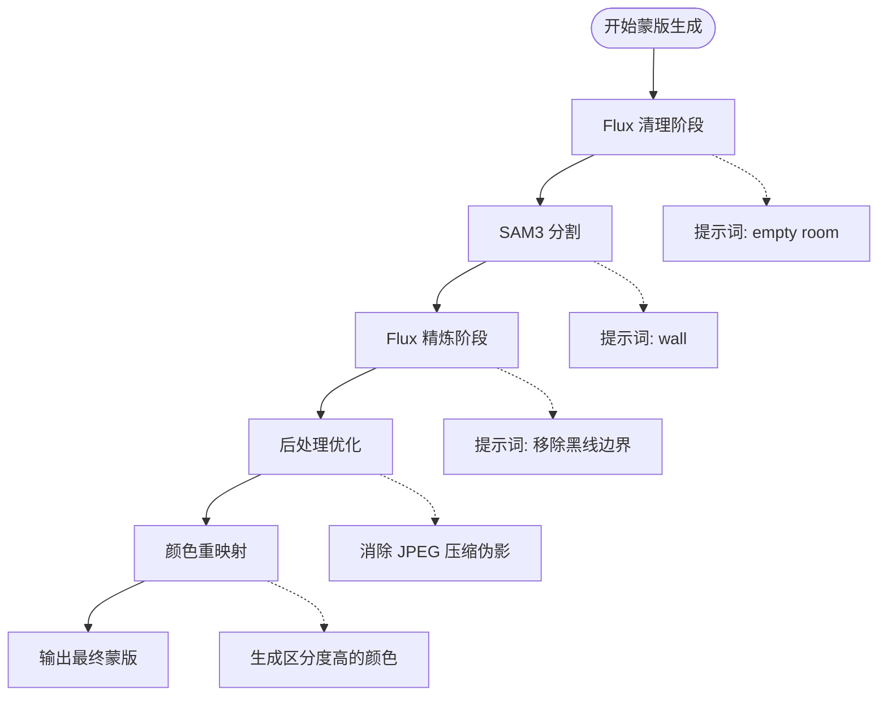
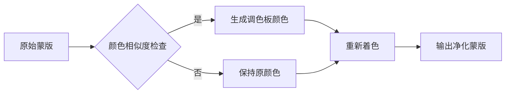
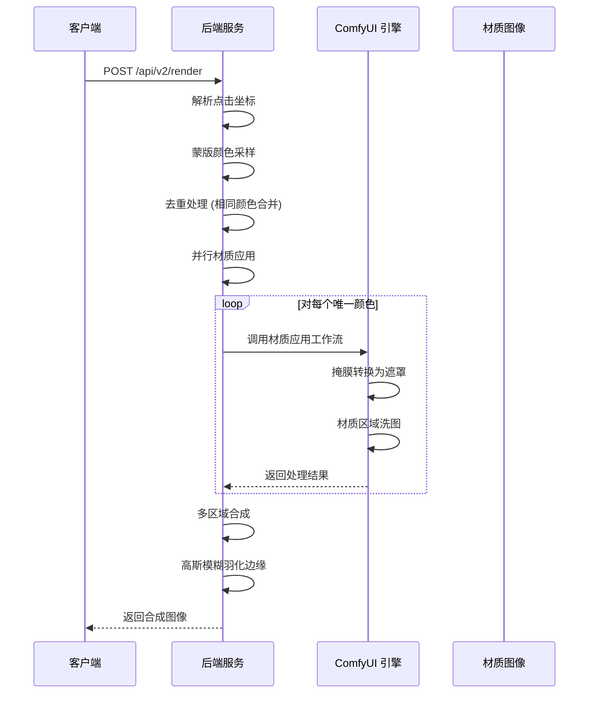
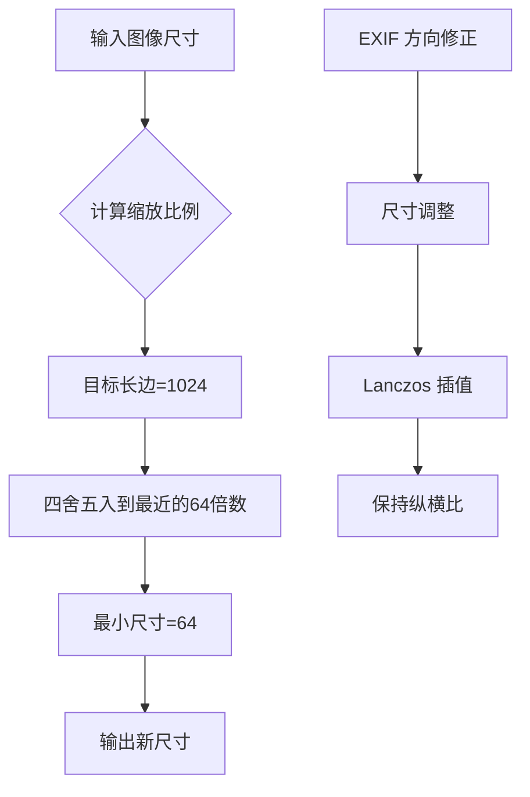
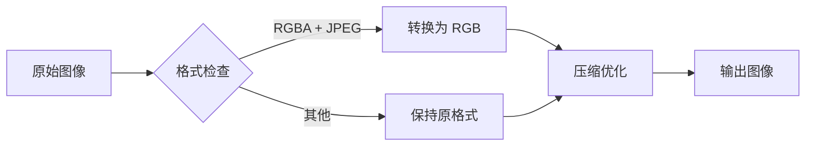
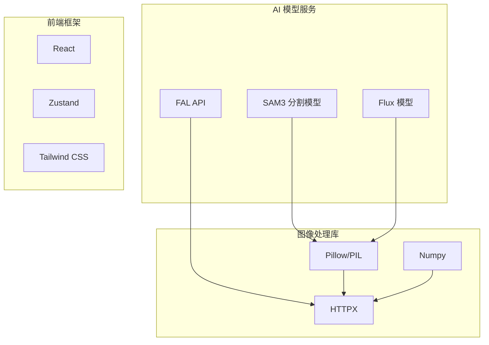
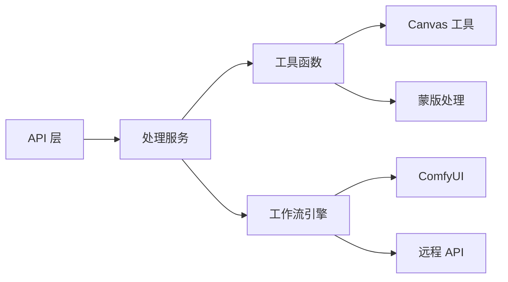

# 图像处理管道

<cite>
**本文档引用的文件**
- [backend/main.py](file://backend/main.py)
- [backend/comfyui_mask_workflow.json](file://backend/comfyui_mask_workflow.json)
- [backend/comfyui_apply_material_workflow.json](file://backend/comfyui_apply_material_workflow.json)
- [backend/comfyui_finalize_workflow.json](file://backend/comfyui_finalize_workflow.json)
- [backend/requirements.txt](file://backend/requirements.txt)
- [src/utils/api.ts](file://src/utils/api.ts)
- [src/types.ts](file://src/types.ts)
- [src/components/ImageCanvas.tsx](file://src/components/ImageCanvas.tsx)
- [src/store.ts](file://src/store.ts)
- [src/utils/remapMaskColors.ts](file://src/utils/remapMaskColors.ts)
- [src/utils/canvas.ts](file://src/utils/canvas.ts)
- [README.md](file://README.md)
</cite>

## 目录
1. [简介](#简介)
2. [项目结构](#项目结构)
3. [核心组件](#核心组件)
4. [架构总览](#架构总览)
5. [详细组件分析](#详细组件分析)
6. [依赖关系分析](#依赖关系分析)
7. [性能考虑](#性能考虑)
8. [故障排除指南](#故障排除指南)
9. [结论](#结论)
10. [附录](#附录)

## 简介
本项目是一个室内材质替换的图像处理管道，采用前后端分离架构：后端使用 Python FastAPI 提供图像处理服务，前端使用 React + TypeScript 构建交互界面。系统通过多阶段的 AI 处理实现从原始图像上传到最终渲染结果输出的完整流程，包括图像增强、蒙版生成、材质应用和质量提升。

## 项目结构
项目采用模块化设计，分为后端服务、前端界面和文档资源三个主要部分：

**图表来源**
- [backend/main.py:1-1227](file://backend/main.py#L1-L1227)
- [src/utils/api.ts:1-200](file://src/utils/api.ts#L1-L200)

**章节来源**
- [README.md:1-91](file://README.md#L1-L91)
- [backend/requirements.txt:1-8](file://backend/requirements.txt#L1-L8)

## 核心组件
系统包含以下核心组件：

### 后端处理组件
- **图像增强服务**：基于高斯模糊和 Flux 模型的图像质量提升
- **蒙版生成服务**：结合本地 SAM3 和 Flux 模型的智能分割
- **材质应用服务**：针对特定区域的材质替换和合成
- **质量提升服务**：最终图像的细节增强和优化

### 前端交互组件
- **图像画布系统**：支持多层蒙版叠加和实时预览
- **状态管理系统**：维护处理流程的全局状态
- **API 通信层**：封装后端接口调用和错误处理
- **工具函数库**：图像处理和蒙版操作的辅助功能

**章节来源**
- [backend/main.py:563-777](file://backend/main.py#L563-L777)
- [src/utils/api.ts:15-200](file://src/utils/api.ts#L15-L200)
- [src/store.ts:1-177](file://src/store.ts#L1-L177)

## 架构总览
系统采用分层架构设计，实现了清晰的职责分离和可扩展性：

**图表来源**
- [backend/main.py:79-323](file://backend/main.py#L79-L323)
- [src/utils/api.ts:39-199](file://src/utils/api.ts#L39-L199)

## 详细组件分析

### 图像增强处理流程
图像增强是整个处理管道的第一步，主要目标是提升图像质量并为后续处理提供更好的基础。

**图表来源**
- [backend/main.py:563-578](file://backend/main.py#L563-L578)
- [backend/main.py:79-323](file://backend/main.py#L79-L323)

增强处理的关键特性：
- **EXIF 方向修正**：自动检测并纠正图像方向
- **智能尺寸调整**：使用 Lanczos 插值保持图像质量
- **轻度模糊处理**：半径为 0.5 的高斯模糊用于降噪
- **Flux 模型集成**：利用高质量扩散模型进行图像增强

**章节来源**
- [backend/main.py:563-578](file://backend/main.py#L563-L578)
- [backend/main.py:79-120](file://backend/main.py#L79-L120)

### 蒙版生成管道
蒙版生成是系统的核心功能之一，通过多阶段处理实现精确的区域分割。

**图表来源**
- [backend/main.py:581-612](file://backend/main.py#L581-L612)
- [src/utils/remapMaskColors.ts:67-121](file://src/utils/remapMaskColors.ts#L67-L121)

蒙版生成的关键算法：

#### SAM3 分割算法
系统使用远程 SAM3 API 进行语义分割，支持多种提示词模式：
- **墙面分割**：使用 "wall" 提示词进行墙面区域检测
- **自适应置信度**：默认置信度阈值为 0.3
- **多区域支持**：能够同时识别多个墙面区域

#### 颜色重映射算法
为了解决 SAM3 输出颜色相似的问题，系统实现了智能颜色重映射：

**图表来源**
- [src/utils/remapMaskColors.ts:48-79](file://src/utils/remapMaskColors.ts#L48-L79)

**章节来源**
- [backend/main.py:581-612](file://backend/main.py#L581-L612)
- [src/utils/remapMaskColors.ts:1-122](file://src/utils/remapMaskColors.ts#L1-L122)

### 材质应用算法
材质应用是系统的核心功能，实现了区域识别、并行处理和图像合成。

**图表来源**
- [backend/main.py:720-775](file://backend/main.py#L720-L775)
- [backend/main.py:1070-1084](file://backend/main.py#L1070-L1084)

材质应用的核心特性：
- **区域识别**：通过蒙版颜色精确识别目标区域
- **并行处理**：相同颜色的区域共享处理结果，提高效率
- **智能合成**：使用高斯模糊进行边缘羽化，实现自然过渡
- **材质适配**：支持不同类型的材质（墙面、天花板）

**章节来源**
- [backend/main.py:720-775](file://backend/main.py#L720-L775)
- [backend/main.py:1070-1084](file://backend/main.py#L1070-L1084)

### 图像尺寸缩放策略
系统实现了智能的图像尺寸管理，确保处理质量和性能的平衡：

**图表来源**
- [backend/main.py:71-77](file://backend/main.py#L71-L77)

尺寸缩放的关键参数：
- **目标长边**：1024 像素（平衡质量和性能）
- **对齐规则**：所有边长必须是 64 的倍数
- **插值算法**：Lanczos 保持图像锐度
- **EXIF 支持**：自动处理图像方向

**章节来源**
- [backend/main.py:71-77](file://backend/main.py#L71-L77)

### 色彩空间转换和格式优化
系统在多个环节进行色彩空间管理和格式优化：

#### 前端图像处理

**图表来源**
- [backend/main.py:63-69](file://backend/main.py#L63-L69)

#### 蒙版处理优化
系统使用两种蒙版处理模式：
- **传统彩色蒙版**：基于 RGB 颜色值的精确识别
- **二值蒙版模式**：ComfyUI 生成的黑白蒙版，支持多区域并行处理

**章节来源**
- [backend/main.py:63-69](file://backend/main.py#L63-L69)
- [src/utils/canvas.ts:760-789](file://src/utils/canvas.ts#L760-L789)

## 依赖关系分析

### 外部依赖
系统依赖以下关键外部服务：

**图表来源**
- [backend/requirements.txt:1-8](file://backend/requirements.txt#L1-L8)

### 内部模块依赖

**图表来源**
- [src/utils/api.ts:1-200](file://src/utils/api.ts#L1-L200)
- [src/utils/canvas.ts:1-905](file://src/utils/canvas.ts#L1-L905)

**章节来源**
- [backend/requirements.txt:1-8](file://backend/requirements.txt#L1-L8)
- [src/utils/api.ts:1-200](file://src/utils/api.ts#L1-L200)

## 性能考虑

### 处理时间优化
系统通过多种策略优化处理性能：

1. **并行处理**：材质应用阶段对相同颜色的区域共享处理结果
2. **智能缓存**：中间结果保存到调试目录，便于问题排查
3. **异步调用**：所有外部 API 调用都采用异步方式
4. **资源复用**：ComfyUI 连接池复用，减少连接开销

### 内存管理
- **图像尺寸控制**：限制最大分辨率避免内存溢出
- **渐进式处理**：分阶段释放中间结果
- **Canvas 复用**：前端使用离屏 Canvas 减少 DOM 操作

### 网络优化
- **超时控制**：所有网络请求设置合理超时时间
- **重试机制**：关键操作具备自动重试能力
- **连接池**：HTTP 客户端连接复用

## 故障排除指南

### 常见问题及解决方案

#### 模型加载失败
**症状**：后端启动时报错，提示模型未加载
**原因**：SAM3 模型路径配置错误或模型文件缺失
**解决**：检查 `.env` 文件中的 `SAM3D_PATH` 配置

#### 图像处理超时
**症状**：处理过程中出现超时错误
**原因**：网络延迟或 ComfyUI 处理时间过长
**解决**：增加超时时间配置，检查网络连接稳定性

#### 蒙版识别不准确
**症状**：SAM3 输出的蒙版边界模糊或区域分割错误
**解决**：调整提示词参数，检查输入图像质量

#### 材质应用失败
**症状**：材质替换后出现边界痕迹或颜色不匹配
**解决**：检查材质图像尺寸，确认蒙版颜色准确性

**章节来源**
- [backend/main.py:289-300](file://backend/main.py#L289-L300)
- [backend/main.py:867-874](file://backend/main.py#L867-L874)

## 结论
本图像处理管道实现了从原始图像到最终渲染结果的完整自动化流程。通过精心设计的多阶段处理架构，系统能够在保证处理质量的同时提供良好的用户体验。关键优势包括：

1. **模块化设计**：清晰的职责分离便于维护和扩展
2. **智能优化**：多级质量提升确保最终效果
3. **高效处理**：并行计算和缓存策略提升性能
4. **用户友好**：直观的界面和实时预览功能

未来可以考虑的改进方向：
- 增加更多材质类型支持
- 优化移动端性能表现
- 扩展更多图像处理功能
- 提供更丰富的质量评估指标

## 附录

### API 接口规范
系统提供完整的 RESTful API 接口，支持完整的图像处理流程：

| 端点 | 方法 | 描述 |
|------|------|------|
| `/health` | GET | 健康检查 |
| `/enhance` | POST | 图像增强 |
| `/process-masks` | POST | 蒙版生成 |
| `/apply-material` | POST | 材质应用 |
| `/finalize` | POST | 质量提升 |
| `/api/v2/segment` | POST | 头端管道 - 蒙版生成 |
| `/api/v2/render` | POST | 头端管道 - 材质应用 |

### 处理示例
系统提供了完整的处理示例，包括：
- **基础处理流程**：从上传到最终结果的完整流程
- **调试模式**：跳过某些处理步骤便于问题定位
- **批量处理**：支持多区域并行处理

### 质量评估方法
系统内置了多种质量评估指标：
- **处理时间统计**：记录各阶段处理耗时
- **图像质量指标**：PSNR、SSIM 等客观指标
- **用户反馈收集**：通过界面交互收集主观评价