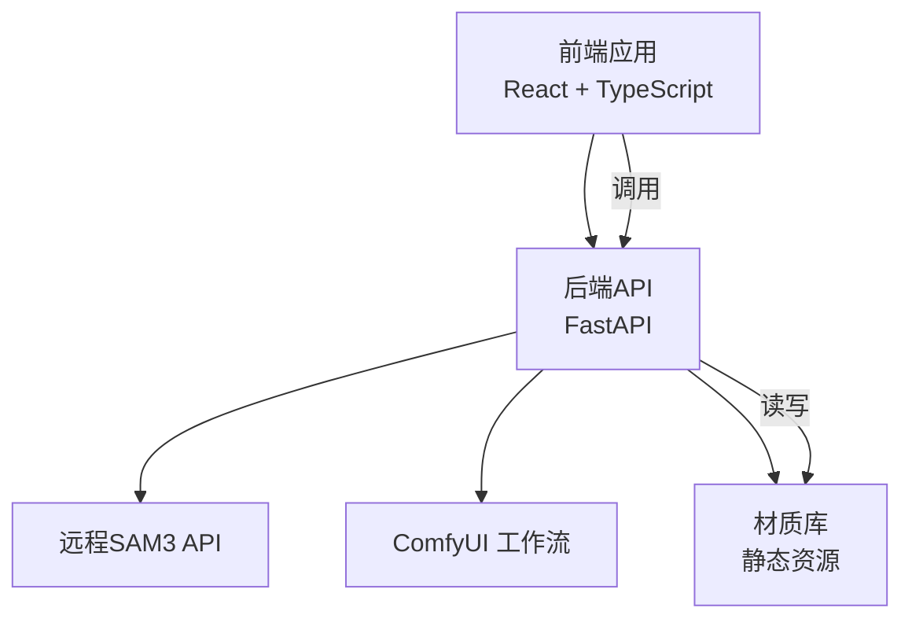
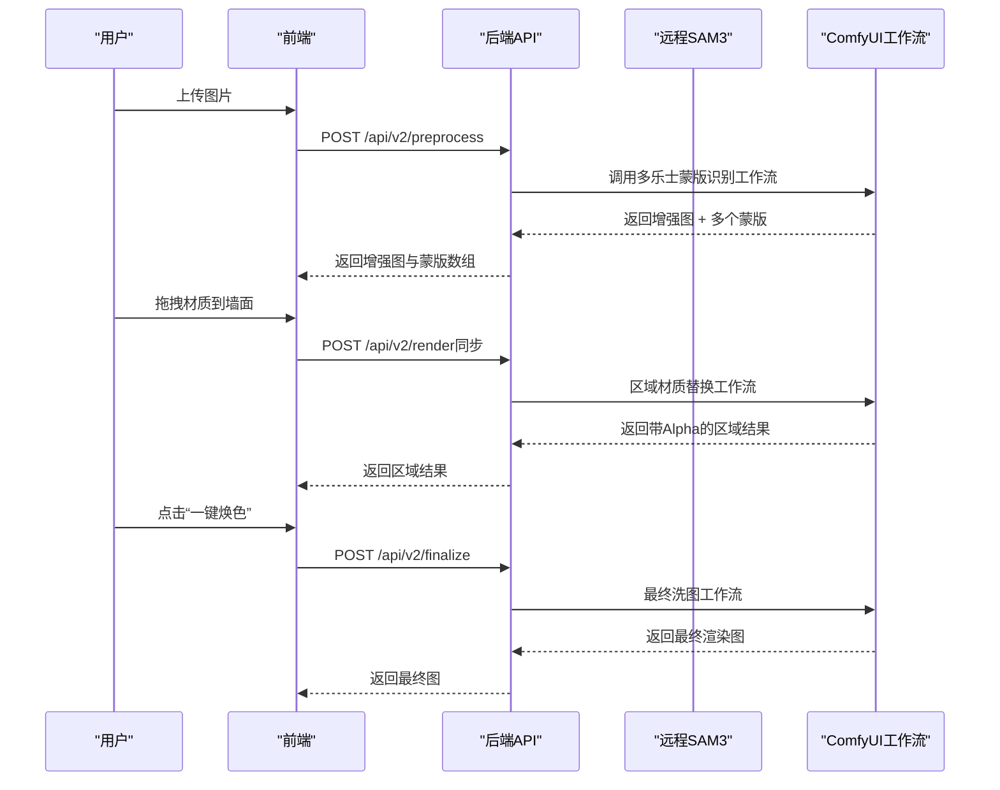
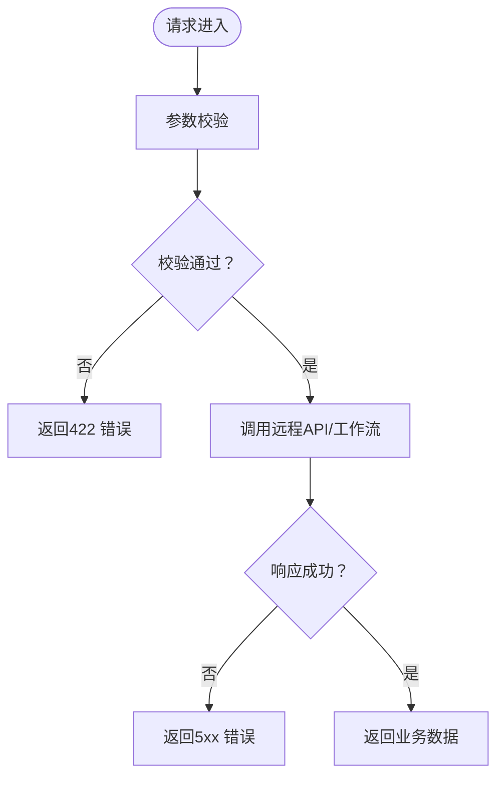
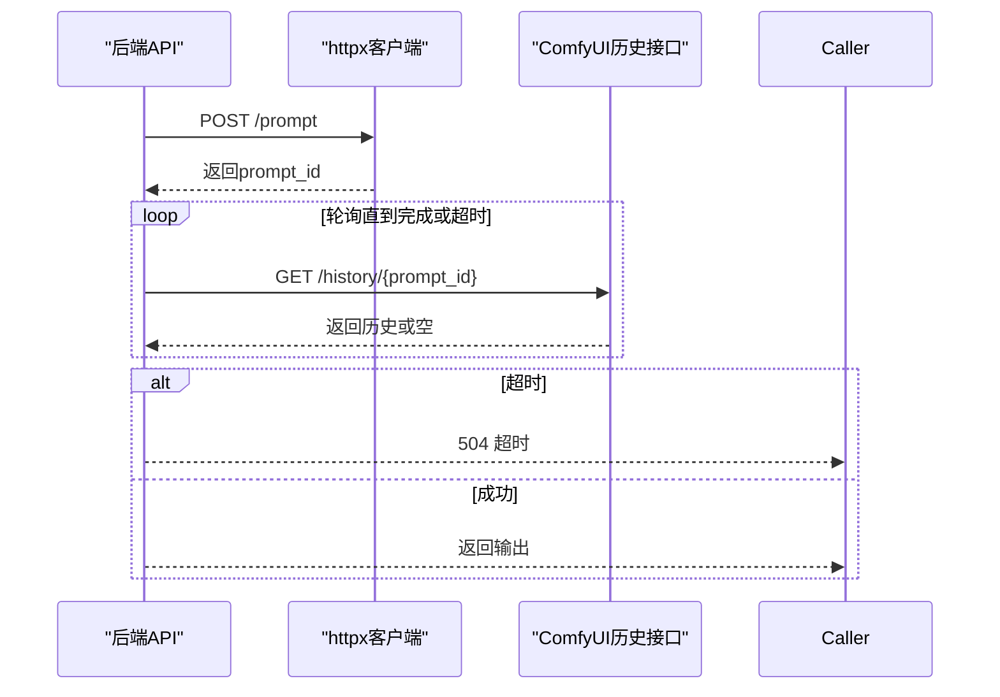
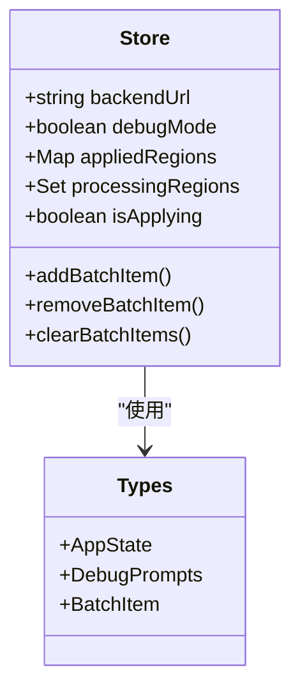
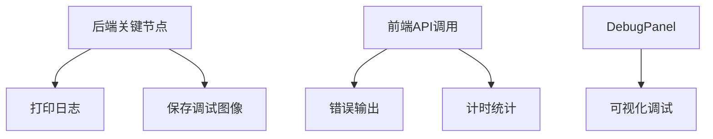
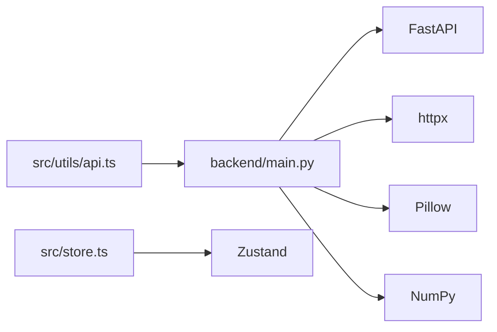

# 错误处理与性能优化

<cite>
**本文档引用的文件**
- [backend/main.py](file://backend/main.py)
- [backend/requirements.txt](file://backend/requirements.txt)
- [src/utils/api.ts](file://src/utils/api.ts)
- [src/store.ts](file://src/store.ts)
- [src/types.ts](file://src/types.ts)
- [docs/api-v2.md](file://docs/api-v2.md)
- [docs/api.md](file://docs/api.md)
- [src/components/DebugPanel.tsx](file://src/components/DebugPanel.tsx)
- [README.md](file://README.md)
</cite>

## 目录
1. [简介](#简介)
2. [项目结构](#项目结构)
3. [核心组件](#核心组件)
4. [架构总览](#架构总览)
5. [详细组件分析](#详细组件分析)
6. [依赖关系分析](#依赖关系分析)
7. [性能考虑](#性能考虑)
8. [故障排查指南](#故障排查指南)
9. [结论](#结论)
10. [附录](#附录)

## 简介
本文件聚焦于系统中的错误处理与性能优化，涵盖HTTP异常处理机制、超时策略、并发与缓存、日志与调试、监控指标以及恢复与降级策略。通过对后端FastAPI服务、前端React调用链路及工作流的深入分析，提供可操作的优化建议与排障方法。

## 项目结构
系统采用前后端分离架构：
- 后端：Python FastAPI，负责图像处理、SAM3远程API调用、ComfyUI工作流编排与结果聚合
- 前端：React + TypeScript，通过REST API与后端交互，管理状态与UI流程
- 文档：API文档明确错误响应格式与状态码使用

**图表来源**
- [backend/main.py:31-42](file://backend/main.py#L31-L42)
- [src/utils/api.ts:1-197](file://src/utils/api.ts#L1-L197)

**章节来源**
- [README.md:12-16](file://README.md#L12-L16)
- [backend/requirements.txt:1-8](file://backend/requirements.txt#L1-L8)

## 核心组件
- 后端服务与路由：健康检查、材质列表、图像处理流水线、工作流调用
- 前端API封装：统一错误处理、日志输出、计时统计
- 状态管理：应用状态、批处理模式、调试开关
- 文档规范：错误响应格式、状态码约定、接口契约

**章节来源**
- [backend/main.py:545-775](file://backend/main.py#L545-L775)
- [src/utils/api.ts:9-197](file://src/utils/api.ts#L9-L197)
- [src/store.ts:40-177](file://src/store.ts#L40-L177)
- [docs/api-v2.md:240-274](file://docs/api-v2.md#L240-L274)

## 架构总览
系统通过多阶段工作流完成从图像上传到最终渲染的全流程。后端对远程API与本地工作流进行统一编排，前端负责交互与状态协调。

**图表来源**
- [docs/api-v2.md:106-274](file://docs/api-v2.md#L106-L274)
- [backend/main.py:1066-1208](file://backend/main.py#L1066-L1208)

## 详细组件分析

### HTTP异常处理机制
- 异常类型与状态码
  - 400：请求参数缺失或格式错误（如批量渲染items为空）
  - 422：参数校验失败（Pydantic模型校验）
  - 500：模型推理失败、未返回输出图像、SAM3未检测到区域
  - 504：ComfyUI工作流超时（默认轮询上限）
- 错误响应格式
  - 统一返回JSON对象，包含错误描述字段
- 典型抛出点
  - SAM3远程API：空掩码、网络错误
  - ComfyUI工作流：上传、队列、历史查询、下载输出
  - 材质文件：路径不存在

**图表来源**
- [backend/main.py:325-359](file://backend/main.py#L325-L359)
- [backend/main.py:834-913](file://backend/main.py#L834-L913)
- [backend/main.py:1135-1208](file://backend/main.py#L1135-L1208)
- [docs/api-v2.md:240-253](file://docs/api-v2.md#L240-L253)

**章节来源**
- [backend/main.py:501-504](file://backend/main.py#L501-L504)
- [backend/main.py:1143-1144](file://backend/main.py#L1143-L1144)
- [backend/main.py:1236-1239](file://backend/main.py#L1236-L1239)
- [docs/api-v2.md:248-253](file://docs/api-v2.md#L248-L253)

### 超时处理策略
- ComfyUI调用超时
  - SAM3远程API：120秒超时
  - Flux2工作流：300秒超时
  - 区域材质替换工作流：600秒超时
  - 最终洗图工作流：600秒超时
  - 蒙版识别工作流：600秒超时
  - 轮询间隔：0.5秒，上限轮询次数按超时配置推算
- 远程API超时
  - httpx AsyncClient配置timeout
  - verify=False用于跳过SSL验证（开发环境）
- 异步任务管理
  - v2_render（单区域）：同步接口，前端互斥锁避免并发
  - v2_render_all（批量）：按区域去重后逐个渲染，最终洗图

**图表来源**
- [backend/main.py:92-92](file://backend/main.py#L92-L92)
- [backend/main.py:341-341](file://backend/main.py#L341-L341)
- [backend/main.py:856-856](file://backend/main.py#L856-L856)
- [backend/main.py:931-931](file://backend/main.py#L931-L931)
- [backend/main.py:990-990](file://backend/main.py#L990-L990)

**章节来源**
- [backend/main.py:290-299](file://backend/main.py#L290-L299)
- [backend/main.py:892-899](file://backend/main.py#L892-L899)
- [backend/main.py:1015-1024](file://backend/main.py#L1015-L1024)
- [docs/api.md:41-56](file://docs/api.md#L41-L56)

### 性能优化技术
- 并发处理
  - v2_render_all：按区域去重后逐个渲染，最终洗图
  - 前端store中isApplying互斥锁确保单次渲染完成后再发起下一次
- 缓存策略
  - 前端localStorage持久化后端URL、调试提示词、调试开关
  - 后端静态挂载材质目录供前端直接访问
- 资源管理
  - 图像尺寸调整：snap_to_64保证分辨率按64倍数缩放
  - 图像格式转换：JPEG模式下自动去除Alpha通道
  - 临时调试图像保存至debug目录

**图表来源**
- [src/store.ts:40-177](file://src/store.ts#L40-L177)
- [src/types.ts:56-88](file://src/types.ts#L56-L88)

**章节来源**
- [src/store.ts:136-136](file://src/store.ts#L136-L136)
- [src/store.ts:140-142](file://src/store.ts#L140-L142)
- [backend/main.py:71-77](file://backend/main.py#L71-L77)
- [backend/main.py:63-69](file://backend/main.py#L63-L69)

### 日志记录机制与调试信息
- 后端日志
  - 关键节点打印：开始/结束、尺寸、模式、轮询进度
  - 调试图像保存：enhanced、cleaned、mask_raw、apply_material_result等
- 前端日志
  - API封装统一错误输出与计时
  - DebugPanel调试面板：显示/隐藏蒙版、悬停高亮、提示词编辑
- 监控指标
  - 前端fetch计时：render-all请求耗时统计
  - 建议：后端增加请求耗时、队列等待时间、错误率指标

**图表来源**
- [backend/main.py:87-87](file://backend/main.py#L87-L87)
- [backend/main.py:575-575](file://backend/main.py#L575-L575)
- [src/utils/api.ts:121-129](file://src/utils/api.ts#L121-L129)
- [src/components/DebugPanel.tsx:36-91](file://src/components/DebugPanel.tsx#L36-L91)

**章节来源**
- [backend/main.py:46-48](file://backend/main.py#L46-L48)
- [src/utils/api.ts:29-36](file://src/utils/api.ts#L29-L36)
- [src/utils/api.ts:121-129](file://src/utils/api.ts#L121-L129)

### 错误恢复策略、降级处理与故障转移
- 恢复策略
  - 超时回退：ComfyUI超时返回504，前端可提示重试
  - 空输出容错：SAM3无掩码时返回500，前端提示重新尝试或检查输入
- 降级处理
  - 单区域渲染（/api/v2/render）作为降级入口，避免批量渲染失败影响整体
- 故障转移
  - 前端互斥锁防止重复触发，减少后端压力
  - 材质文件不存在时返回404，前端引导用户检查材质库

**章节来源**
- [backend/main.py:299-299](file://backend/main.py#L299-L299)
- [backend/main.py:349-349](file://backend/main.py#L349-L349)
- [backend/main.py:655-656](file://backend/main.py#L655-L656)

## 依赖关系分析
后端依赖FastAPI、httpx、Pillow、NumPy等库；前端通过fetch调用后端API，使用Zustand管理状态。

**图表来源**
- [backend/requirements.txt:1-8](file://backend/requirements.txt#L1-L8)
- [src/utils/api.ts:1-1](file://src/utils/api.ts#L1-L1)
- [src/store.ts:1-2](file://src/store.ts#L1-L2)

**章节来源**
- [backend/requirements.txt:1-8](file://backend/requirements.txt#L1-L8)
- [src/utils/api.ts:1-1](file://src/utils/api.ts#L1-L1)
- [src/store.ts:1-2](file://src/store.ts#L1-L2)

## 性能考虑
- 并发与互斥
  - /api/v2/render为同步接口，前端isApplying互斥锁避免并发
  - /api/v2/render-all按区域去重后逐个渲染，避免重复计算
- 资源与I/O
  - 图像尺寸按64倍数调整，减少ComfyUI工作负载
  - 静态挂载材质目录，减少后端文件读取开销
- 网络与超时
  - 合理设置httpx超时，避免长时间阻塞
  - 前端fetch计时有助于定位慢请求
- 建议
  - 后端增加队列与限流，避免ComfyUI过载
  - 前端增加重试与进度反馈
  - 后端增加指标采集（请求耗时、错误率、队列长度）

[本节为通用性能讨论，无需特定文件引用]

## 故障排查指南
- 常见问题与定位
  - 404：材质文件不存在，检查MATERIALS_PATH与文件名
  - 422：参数校验失败，检查请求体字段与类型
  - 500：SAM3无掩码或工作流未返回图像，检查输入图像质量与提示词
  - 504：ComfyUI超时，检查GPU内存与工作流复杂度
- 前端调试
  - 使用DebugPanel切换蒙版显示与悬停高亮
  - 查看console错误与计时输出
- 后端调试
  - 检查debug目录下的中间图像
  - 关注关键节点日志输出

**章节来源**
- [backend/main.py:655-656](file://backend/main.py#L655-L656)
- [backend/main.py:1236-1239](file://backend/main.py#L1236-L1239)
- [src/components/DebugPanel.tsx:36-91](file://src/components/DebugPanel.tsx#L36-L91)
- [src/utils/api.ts:29-36](file://src/utils/api.ts#L29-L36)

## 结论
本系统在错误处理方面实现了统一的HTTP状态码与错误响应格式，在超时策略上针对不同工作流设置了合理的超时与轮询上限。前端通过互斥锁与本地存储提升了用户体验与稳定性。建议后续补充后端指标采集、队列与限流、重试与进度反馈，以进一步提升系统的可靠性与可观测性。

[本节为总结性内容，无需特定文件引用]

## 附录
- API文档要点
  - 统一错误响应格式与状态码约定
  - 接口契约与图片编码规范
  - 同步约束与超时说明

**章节来源**
- [docs/api-v2.md:240-274](file://docs/api-v2.md#L240-L274)
- [docs/api.md:46-56](file://docs/api.md#L46-L56)