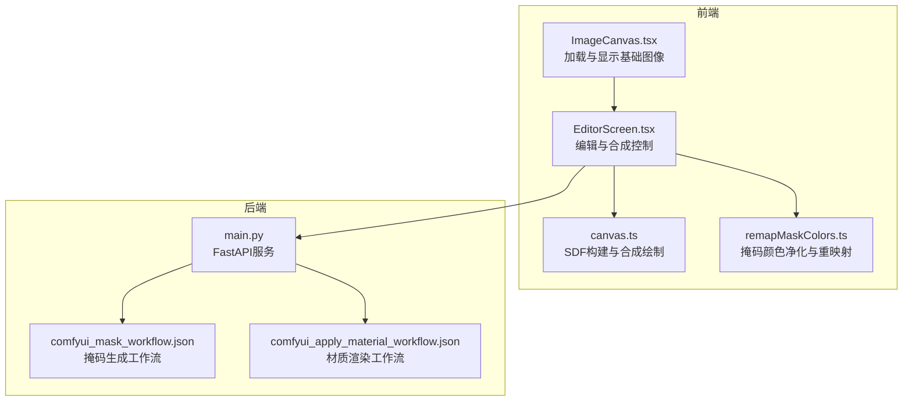
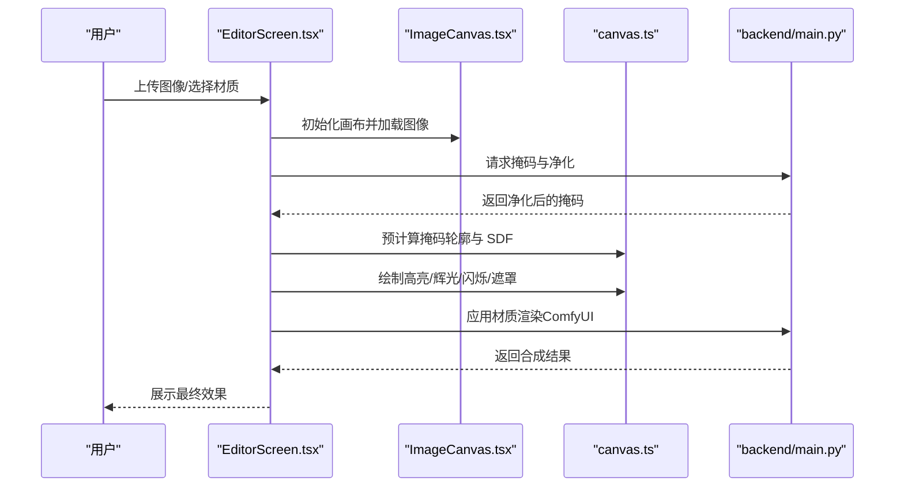
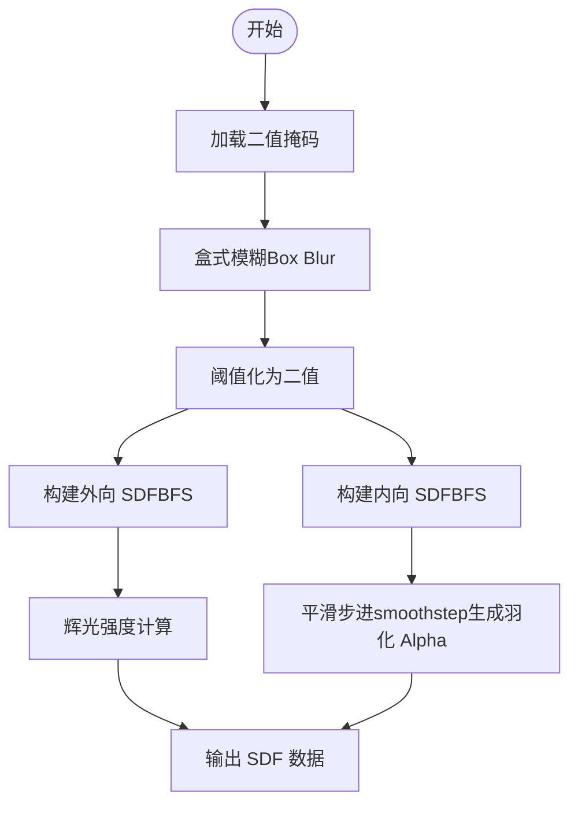
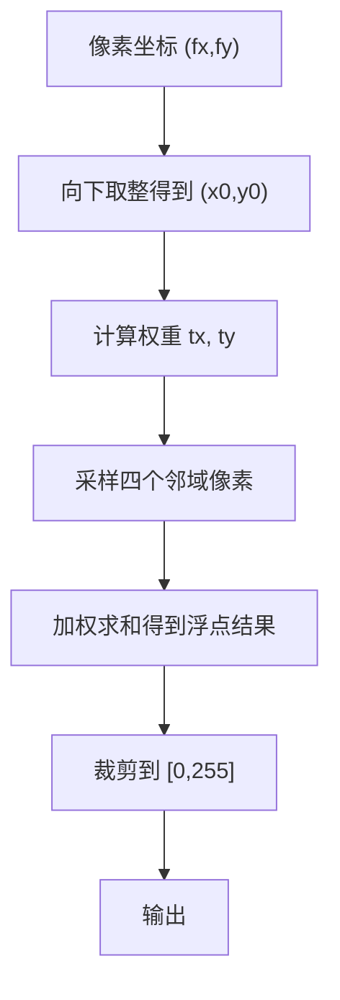
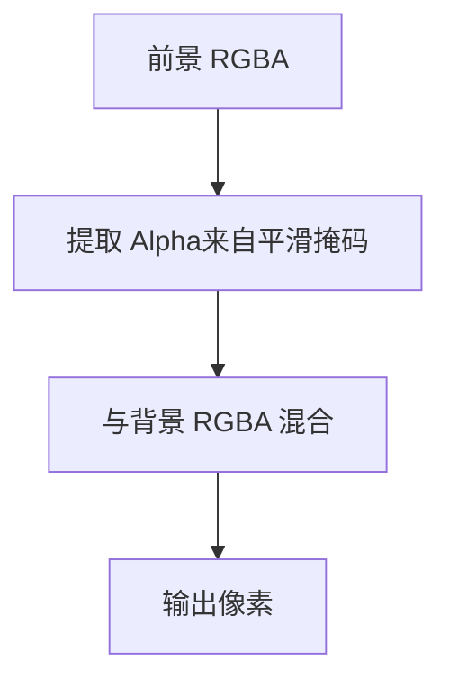
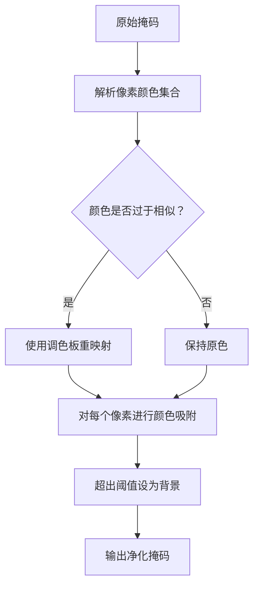
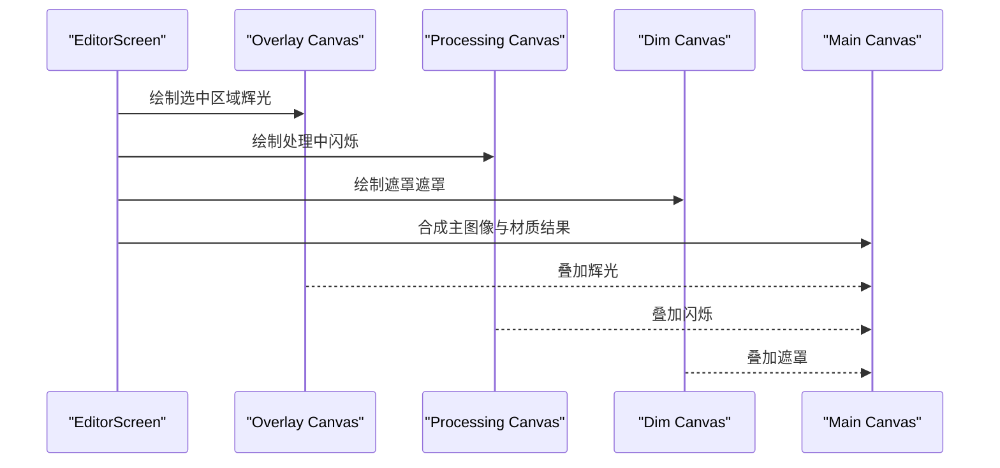
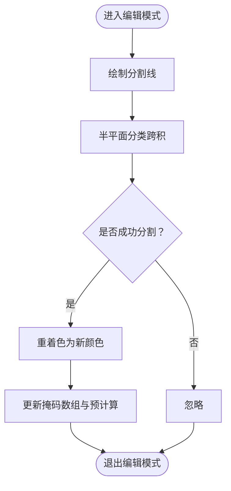
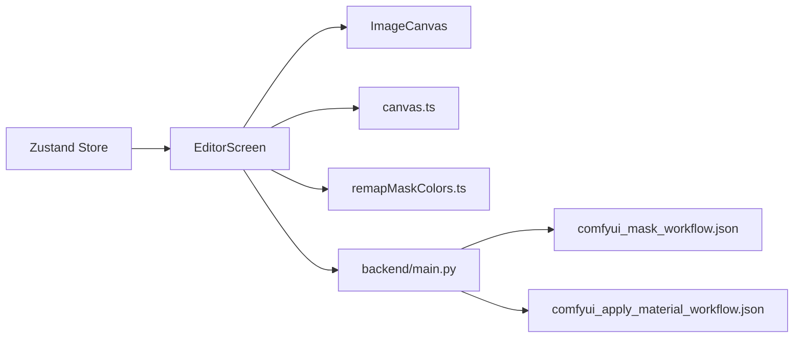

# Canvas 合成算法

<cite>
**本文档引用的文件**
- [src/utils/canvas.ts](file://src/utils/canvas.ts)
- [src/components/ImageCanvas.tsx](file://src/components/ImageCanvas.tsx)
- [src/utils/remapMaskColors.ts](file://src/utils/remapMaskColors.ts)
- [backend/main.py](file://backend/main.py)
- [src/screens/EditorScreen.tsx](file://src/screens/EditorScreen.tsx)
- [src/types.ts](file://src/types.ts)
- [src/store.ts](file://src/store.ts)
- [backend/comfyui_apply_material_workflow.json](file://backend/comfyui_apply_material_workflow.json)
- [backend/comfyui_mask_workflow.json](file://backend/comfyui_mask_workflow.json)
</cite>

## 目录
1. [简介](#简介)
2. [项目结构](#项目结构)
3. [核心组件](#核心组件)
4. [架构总览](#架构总览)
5. [详细组件分析](#详细组件分析)
6. [依赖关系分析](#依赖关系分析)
7. [性能考虑](#性能考虑)
8. [故障排除指南](#故障排除指南)
9. [结论](#结论)
10. [附录](#附录)

## 简介
本文件系统性阐述 Canvas 合成算法的技术细节，涵盖图像叠加合成原理、像素级混合、透明度处理与色彩空间转换；深入解析 SDF（有向距离场）构建算法（外向距离场与内向距离场）、抗锯齿处理技术（双线性采样、盒式模糊与边缘羽化），并提供性能优化策略（离屏渲染、内存池管理与异步处理）。文档同时给出算法流程图、数学公式与实际应用场景示例，帮助读者快速理解与应用。

## 项目结构
该项目采用前后端分离架构：
- 前端使用 React + TypeScript + Zustand，负责用户交互、Canvas 渲染与合成效果展示
- 后端使用 Python FastAPI，负责图像处理、掩码生成与材质渲染（通过 ComfyUI 工作流）

图表来源
- [src/components/ImageCanvas.tsx:1-91](file://src/components/ImageCanvas.tsx#L1-L91)
- [src/screens/EditorScreen.tsx:1-758](file://src/screens/EditorScreen.tsx#L1-L758)
- [src/utils/canvas.ts:1-905](file://src/utils/canvas.ts#L1-L905)
- [src/utils/remapMaskColors.ts:1-122](file://src/utils/remapMaskColors.ts#L1-L122)
- [backend/main.py:1-1227](file://backend/main.py#L1-L1227)
- [backend/comfyui_mask_workflow.json:1-831](file://backend/comfyui_mask_workflow.json#L1-L831)
- [backend/comfyui_apply_material_workflow.json:1-432](file://backend/comfyui_apply_material_workflow.json#L1-L432)

章节来源
- [src/components/ImageCanvas.tsx:1-91](file://src/components/ImageCanvas.tsx#L1-L91)
- [src/screens/EditorScreen.tsx:1-758](file://src/screens/EditorScreen.tsx#L1-L758)
- [src/utils/canvas.ts:1-905](file://src/utils/canvas.ts#L1-L905)
- [src/utils/remapMaskColors.ts:1-122](file://src/utils/remapMaskColors.ts#L1-L122)
- [backend/main.py:1-1227](file://backend/main.py#L1-L1227)
- [backend/comfyui_mask_workflow.json:1-831](file://backend/comfyui_mask_workflow.json#L1-L831)
- [backend/comfyui_apply_material_workflow.json:1-432](file://backend/comfyui_apply_material_workflow.json#L1-L432)

## 核心组件
- 掩码与 SDF 构建：基于二值掩码构建外向 SDF（用于发光）与内向 SDF（用于羽化），并结合盒式模糊实现抗锯齿填充
- 双线性采样：在任意缩放比例下保持平滑过渡，避免像素阶梯效应
- 透明度与混合：使用预计算的平滑掩码作为 Alpha，实现柔和边缘与自然融合
- 离屏渲染：在独立 Canvas 上进行合成与动画，减少主线程阻塞
- 异步处理：前端与后端均采用异步模式，提升响应性与吞吐量

章节来源
- [src/utils/canvas.ts:1-905](file://src/utils/canvas.ts#L1-L905)
- [src/screens/EditorScreen.tsx:1-758](file://src/screens/EditorScreen.tsx#L1-L758)

## 架构总览
整体流程分为三阶段：
1) 掩码生成与净化：后端生成粗略掩码，前端净化颜色并生成 B&W 掩码
2) SDF 预计算：前端对每个掩码区域预计算外向与内向 SDF，以及平滑掩码
3) 合成与渲染：根据用户操作实时绘制高亮、辉光、闪烁与遮罩效果，并在编辑模式下进行区域分割

图表来源
- [src/screens/EditorScreen.tsx:1-758](file://src/screens/EditorScreen.tsx#L1-L758)
- [src/components/ImageCanvas.tsx:1-91](file://src/components/ImageCanvas.tsx#L1-L91)
- [src/utils/canvas.ts:1-905](file://src/utils/canvas.ts#L1-L905)
- [backend/main.py:1-1227](file://backend/main.py#L1-L1227)

## 详细组件分析

### SDF（有向距离场）构建算法
SDF 是一种以像素到最近边界距离为值的场，常用于边缘羽化、辉光与阴影效果。该实现包含两类 SDF：
- 外向 SDF（outward SDF）：从边缘向外扩展，用于辉光效果
- 内向 SDF（inner SDF）：从内部向边界扩展，用于羽化边缘

图表来源
- [src/utils/canvas.ts:28-174](file://src/utils/canvas.ts#L28-L174)

算法要点
- 盒式模糊：对二值掩码进行水平与垂直方向的滑动窗口平均，得到 0..255 的中间值，实现抗锯齿填充
- BFS 构建 SDF：从边缘像素出发，逐层向外/向内扩展，记录距离上限
- 平滑步进：将内向 SDF 映射到 0..1 区间，使用 smoothstep 函数获得更柔和的边缘过渡

章节来源
- [src/utils/canvas.ts:28-174](file://src/utils/canvas.ts#L28-L174)

### 双线性采样与抗锯齿
双线性采样在任意缩放比例下对 SDF 进行插值，避免像素阶梯效应，保证辉光与闪烁在不同分辨率下保持平滑。

图表来源
- [src/utils/canvas.ts:60-78](file://src/utils/canvas.ts#L60-L78)

章节来源
- [src/utils/canvas.ts:60-78](file://src/utils/canvas.ts#L60-L78)

### 透明度处理与像素级混合
- 平滑掩码 Alpha：使用双线性采样的平滑掩码作为前景 Alpha，实现柔和边缘
- 颜色混合：将前景颜色与背景颜色按 Alpha 进行混合，得到最终像素值
- 辉光与闪烁：通过 SDF 计算辉光强度与波纹函数，叠加到目标颜色上

图表来源
- [src/utils/canvas.ts:346-447](file://src/utils/canvas.ts#L346-L447)

章节来源
- [src/utils/canvas.ts:346-447](file://src/utils/canvas.ts#L346-L447)

### 掩码颜色净化与重映射
为消除 JPEG 压缩伪影与颜色漂移，对掩码进行颜色净化与重映射：
- 对每个像素计算与已知掩码颜色的距离，若小于阈值则“吸附”到最近颜色
- 若与所有颜色距离都大于阈值，则设为背景（纯黑）
- 当掩码颜色过于相似时，使用最大化区分度的调色板重新映射

图表来源
- [src/utils/remapMaskColors.ts:67-121](file://src/utils/remapMaskColors.ts#L67-L121)

章节来源
- [src/utils/remapMaskColors.ts:67-121](file://src/utils/remapMaskColors.ts#L67-L121)

### 离屏渲染与合成管线
- 离屏 Canvas：将辉光、闪烁、遮罩等效果绘制到独立 Canvas，再与主图像合成
- 合成顺序：遮罩效果（辉光/闪烁/遮罩）→ 主图像 → 材质渲染结果
- 动画帧：使用 requestAnimationFrame 循环更新闪烁与辉光动画

图表来源
- [src/screens/EditorScreen.tsx:116-255](file://src/screens/EditorScreen.tsx#L116-L255)
- [src/utils/canvas.ts:346-499](file://src/utils/canvas.ts#L346-L499)

章节来源
- [src/screens/EditorScreen.tsx:116-255](file://src/screens/EditorScreen.tsx#L116-L255)
- [src/utils/canvas.ts:346-499](file://src/utils/canvas.ts#L346-L499)

### 区域分割与编辑模式
- 编辑模式：用户通过拖拽控制点绘制分割线，将一个掩码区域分割为两个子区域
- 分割算法：基于半平面分类，将位于线一侧的像素重新着色为新颜色
- 快照与恢复：首次分割前保存原始掩码快照，支持一键恢复

图表来源
- [src/utils/canvas.ts:536-683](file://src/utils/canvas.ts#L536-L683)
- [src/screens/EditorScreen.tsx:432-480](file://src/screens/EditorScreen.tsx#L432-L480)

章节来源
- [src/utils/canvas.ts:536-683](file://src/utils/canvas.ts#L536-L683)
- [src/screens/EditorScreen.tsx:432-480](file://src/screens/EditorScreen.tsx#L432-L480)

## 依赖关系分析
- 前端依赖
  - Zustand 状态管理：集中管理图像、掩码、处理状态与批处理队列
  - React 组件：ImageCanvas、EditorScreen、MaterialDrawer 等
  - Canvas API：离屏渲染、图像数据读写与像素级混合
- 后端依赖
  - FastAPI：提供 REST 接口，调用 ComfyUI 工作流
  - PIL：图像处理（缩放、模糊、滤镜）
  - httpx：异步 HTTP 客户端，与 ComfyUI 通信

图表来源
- [src/store.ts:1-177](file://src/store.ts#L1-L177)
- [src/screens/EditorScreen.tsx:1-758](file://src/screens/EditorScreen.tsx#L1-L758)
- [src/components/ImageCanvas.tsx:1-91](file://src/components/ImageCanvas.tsx#L1-L91)
- [src/utils/canvas.ts:1-905](file://src/utils/canvas.ts#L1-L905)
- [src/utils/remapMaskColors.ts:1-122](file://src/utils/remapMaskColors.ts#L1-L122)
- [backend/main.py:1-1227](file://backend/main.py#L1-L1227)
- [backend/comfyui_mask_workflow.json:1-831](file://backend/comfyui_mask_workflow.json#L1-L831)
- [backend/comfyui_apply_material_workflow.json:1-432](file://backend/comfyui_apply_material_workflow.json#L1-L432)

章节来源
- [src/store.ts:1-177](file://src/store.ts#L1-L177)
- [backend/main.py:1-1227](file://backend/main.py#L1-L1227)

## 性能考虑
- 离屏渲染
  - 将辉光、闪烁、遮罩等效果绘制到独立 Canvas，避免重复遍历主图像
  - 使用 willReadFrequently 提示浏览器优化 getImageData 访问
- 内存池管理
  - 复用 Int32Array、Uint8Array 与 Float32Array，避免频繁分配
  - BFS 队列与访问标记数组在单次计算中复用
- 异步处理
  - 前端：requestAnimationFrame 控制动画帧，避免阻塞主线程
  - 后端：异步 HTTP 客户端与任务并发，缩短等待时间
- 算法优化
  - 盒式模糊采用分离式卷积核，降低复杂度
  - 双线性采样仅在需要时进行，避免不必要的插值
  - 阈值化与平滑步进在 CPU 上完成，减少 GPU 传输

章节来源
- [src/utils/canvas.ts:1-905](file://src/utils/canvas.ts#L1-L905)
- [backend/main.py:1-1227](file://backend/main.py#L1-L1227)

## 故障排除指南
- 掩码颜色过近导致混淆
  - 现象：多个掩码颜色相近，视觉上难以区分
  - 处理：启用颜色重映射，使用最大化区分度调色板
  - 参考：[src/utils/remapMaskColors.ts:67-121](file://src/utils/remapMaskColors.ts#L67-L121)
- 分割线未生效
  - 现象：绘制分割线后区域未被分割
  - 处理：确认线段确实跨越掩码区域，检查半平面分类逻辑
  - 参考：[src/utils/canvas.ts:536-683](file://src/utils/canvas.ts#L536-L683)
- 辉光或闪烁不平滑
  - 现象：在高倍缩放下出现阶梯状边缘
  - 处理：确保使用双线性采样与盒式模糊，检查缩放比例与采样坐标
  - 参考：[src/utils/canvas.ts:60-78](file://src/utils/canvas.ts#L60-L78), [src/utils/canvas.ts:28-58](file://src/utils/canvas.ts#L28-L58)
- 后端超时
  - 现象：ComfyUI 任务长时间无响应
  - 处理：检查网络连接、ComfyUI 服务状态与节点配置
  - 参考：[backend/main.py:289-311](file://backend/main.py#L289-L311)

章节来源
- [src/utils/remapMaskColors.ts:67-121](file://src/utils/remapMaskColors.ts#L67-L121)
- [src/utils/canvas.ts:536-683](file://src/utils/canvas.ts#L536-L683)
- [src/utils/canvas.ts:60-78](file://src/utils/canvas.ts#L60-L78)
- [backend/main.py:289-311](file://backend/main.py#L289-L311)

## 结论
本项目通过 SDF 构建、双线性采样与盒式模糊实现了高质量的抗锯齿与边缘羽化；借助离屏渲染与异步处理，兼顾了交互流畅性与渲染质量。前端与后端协同工作，形成从掩码生成到材质渲染的完整管线，适用于室内材质替换等场景。

## 附录
- 数学公式
  - 盒式模糊（分离式卷积）：对行与列分别进行滑动窗口平均
  - 双线性插值：$ f(x,y) = \sum_{i=0}^{1}\sum_{j=0}^{1} f(x_i, y_j) \cdot w_i(x) \cdot w_j(y) $
  - 平滑步进：$ f(t) = t^2(3 - 2t) $，用于内向 SDF 的边缘羽化
  - 半平面分类：$ dx \cdot (y - y_1) - dy \cdot (x - x_1) $，判断点在直线哪一侧

- 实际应用场景
  - 墙面/地面/天花板区域的材质替换与预览
  - 编辑模式下的区域分割与多材质批处理
  - 高亮选区、辉光提示与处理中的闪烁反馈