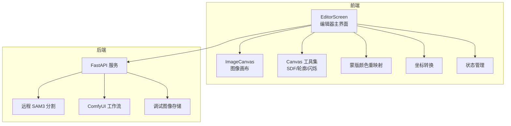
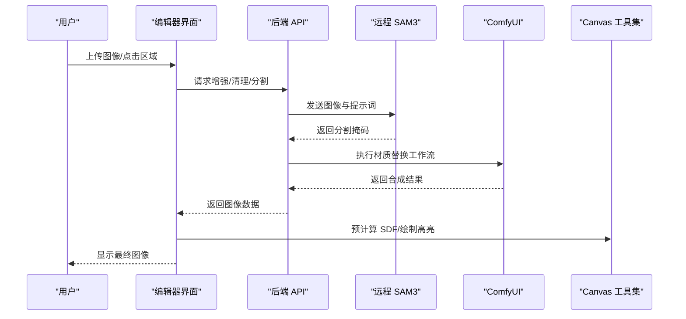
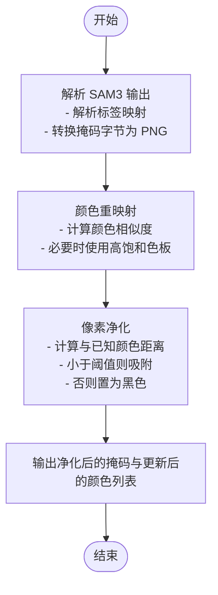
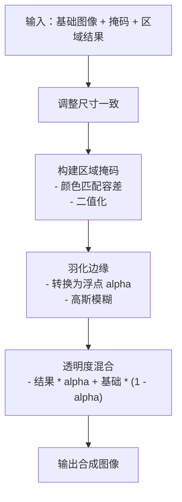
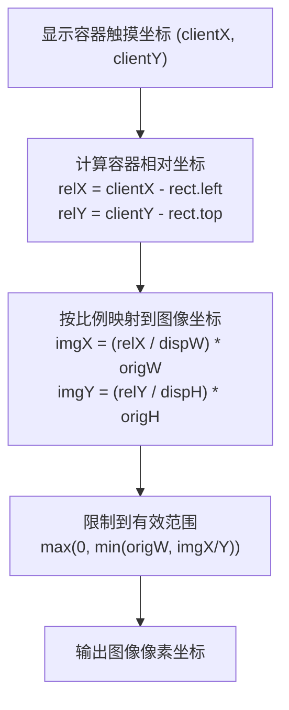
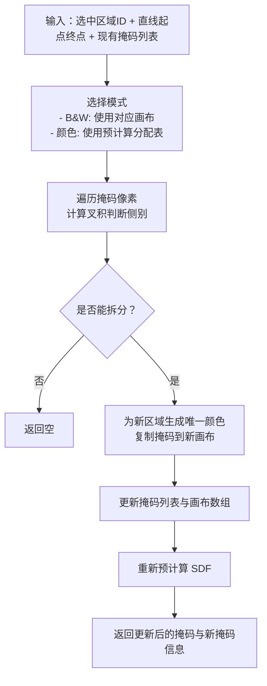
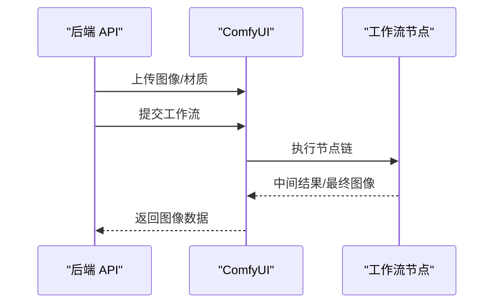
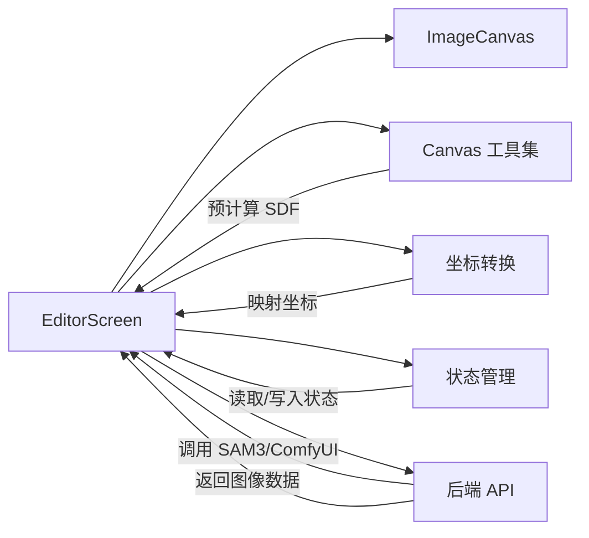

# 图像处理算法

<cite>
**本文档引用的文件**
- [backend/main.py](file://backend/main.py)
- [backend/comfyui_mask_workflow.json](file://backend/comfyui_mask_workflow.json)
- [backend/comfyui_apply_material_workflow.json](file://backend/comfyui_apply_material_workflow.json)
- [src/utils/remapMaskColors.ts](file://src/utils/remapMaskColors.ts)
- [src/utils/canvas.ts](file://src/utils/canvas.ts)
- [src/utils/coords.ts](file://src/utils/coords.ts)
- [src/components/ImageCanvas.tsx](file://src/components/ImageCanvas.tsx)
- [src/screens/EditorScreen.tsx](file://src/screens/EditorScreen.tsx)
- [src/store.ts](file://src/store.ts)
- [src/types.ts](file://src/types.ts)
</cite>

## 目录
1. [简介](#简介)
2. [项目结构](#项目结构)
3. [核心组件](#核心组件)
4. [架构总览](#架构总览)
5. [详细组件分析](#详细组件分析)
6. [依赖关系分析](#依赖关系分析)
7. [性能考虑](#性能考虑)
8. [故障排除指南](#故障排除指南)
9. [结论](#结论)
10. [附录](#附录)

## 简介
本项目是一个基于 Web 的图像处理应用，专注于墙面材质渲染与编辑。系统通过远程 SAM3 模型进行语义分割，生成高质量的蒙版；随后使用 ComfyUI 工作流进行材质替换与合成；前端提供交互式编辑体验，支持蒙版高亮、闪烁效果、区域拆分等高级功能。本文档深入解析蒙版生成算法、Canvas 合成算法、坐标转换系统，并提供性能优化与参数调优建议。

## 项目结构
项目采用前后端分离架构：
- 后端：FastAPI 提供图像处理 API，集成远程 SAM3 分割与 ComfyUI 工作流执行。
- 前端：React + TypeScript 构建，使用 Zustand 状态管理，Canvas 实现高性能渲染与交互。

**图表来源**
- [backend/main.py:31-80](file://backend/main.py#L31-L80)
- [src/screens/EditorScreen.tsx:1-120](file://src/screens/EditorScreen.tsx#L1-L120)
- [src/components/ImageCanvas.tsx:1-91](file://src/components/ImageCanvas.tsx#L1-L91)

**章节来源**
- [backend/main.py:31-80](file://backend/main.py#L31-L80)
- [src/screens/EditorScreen.tsx:1-120](file://src/screens/EditorScreen.tsx#L1-L120)

## 核心组件
- 蒙版生成与颜色重映射：后端调用远程 SAM3 获取分割结果，前端对掩码进行颜色净化与去重，确保边界清晰且视觉区分度高。
- Canvas 合成与渲染：前端使用离屏 Canvas 预计算 SDF，实现发光、闪烁、遮罩高亮等特效；支持多区域合成与透明度混合。
- 坐标转换系统：将触摸/鼠标坐标从显示空间映射到原始图像像素坐标，保证交互精度。
- 异步处理与工作流：后端通过异步 HTTP 客户端与 ComfyUI 通信，前端使用 Promise 和动画帧实现流畅渲染。

**章节来源**
- [src/utils/remapMaskColors.ts:67-122](file://src/utils/remapMaskColors.ts#L67-L122)
- [src/utils/canvas.ts:188-324](file://src/utils/canvas.ts#L188-L324)
- [src/utils/coords.ts:5-24](file://src/utils/coords.ts#L5-L24)
- [backend/main.py:325-360](file://backend/main.py#L325-L360)

## 架构总览
系统分为三层：前端交互层、前端渲染层、后端处理层。

**图表来源**
- [backend/main.py:563-613](file://backend/main.py#L563-L613)
- [backend/main.py:682-717](file://backend/main.py#L682-L717)
- [src/utils/canvas.ts:188-324](file://src/utils/canvas.ts#L188-L324)

## 详细组件分析

### 蒙版生成与颜色重映射算法
该算法由后端远程调用 SAM3 并在前端进行颜色净化组成，目标是消除 JPEG 压缩伪影，生成干净的边界与高对比度颜色。

- SAM3 输出解析
  - 接收图像与提示词，返回分割段列表与掩码图像字节串。
  - 将十六进制掩码字节转换为 Base64 PNG，便于前端处理。
- 颜色重映射与净化
  - 若检测到颜色过于相似，使用预设高饱和色板进行去重。
  - 对每个像素计算与已知掩码颜色的距离，若小于阈值则“吸附”到目标颜色；否则置为纯黑背景。
  - 使用 ImageData 直接修改像素，提升处理效率。

**图表来源**
- [backend/main.py:325-360](file://backend/main.py#L325-L360)
- [src/utils/remapMaskColors.ts:67-122](file://src/utils/remapMaskColors.ts#L67-L122)

**章节来源**
- [backend/main.py:325-360](file://backend/main.py#L325-L360)
- [src/utils/remapMaskColors.ts:67-122](file://src/utils/remapMaskColors.ts#L67-L122)

### Canvas 合成与渲染算法
Canvas 合成算法负责将多个区域的材质结果与基础图像进行透明度混合与边缘羽化，形成最终画面。

- 预计算 SDF（符号距离场）
  - 从二值掩码构建外向 SDF（用于发光）与内向 SDF（用于边缘羽化）。
  - 使用可分离盒式模糊生成平滑填充与抗锯齿边缘。
- 边缘羽化与透明度混合
  - 将布尔掩码转换为浮点 alpha，进行高斯模糊得到羽化边缘。
  - 使用混合公式：out = result * alpha + base * (1 - alpha)，实现自然过渡。
- 交互效果
  - 高亮：基于 SDF 的平滑发光效果。
  - 闪烁：基于正弦波的柔和波纹，配合平滑填充 alpha。
  - 遮罩高亮：仅保留选中区域，其余部分半透明遮罩。

**图表来源**
- [backend/main.py:362-402](file://backend/main.py#L362-L402)
- [src/utils/canvas.ts:28-58](file://src/utils/canvas.ts#L28-L58)
- [src/utils/canvas.ts:326-393](file://src/utils/canvas.ts#L326-L393)

**章节来源**
- [backend/main.py:362-402](file://backend/main.py#L362-L402)
- [src/utils/canvas.ts:28-58](file://src/utils/canvas.ts#L28-L58)
- [src/utils/canvas.ts:326-393](file://src/utils/canvas.ts#L326-L393)

### 坐标转换系统
坐标转换系统将用户在显示容器中的触摸/鼠标坐标精确映射到原始图像的像素坐标，确保点击与拖拽的准确性。

- 输入：触摸坐标、显示容器尺寸、原始图像尺寸。
- 步骤：
  - 计算显示容器相对偏移。
  - 将相对坐标按比例映射到原始图像坐标。
  - 限制坐标在有效范围内。
- 用途：点击选择区域、拖拽材质、线性编辑器定位。

**图表来源**
- [src/utils/coords.ts:5-24](file://src/utils/coords.ts#L5-L24)

**章节来源**
- [src/utils/coords.ts:5-24](file://src/utils/coords.ts#L5-L24)
- [src/screens/EditorScreen.tsx:213-226](file://src/screens/EditorScreen.tsx#L213-L226)

### 区域拆分与蒙版管理
系统支持通过直线将一个区域拆分为两个子区域，便于精细化编辑。

- 算法思路
  - 在掩码图像上定义一条有向线，根据叉积判断像素属于哪一侧。
  - 为新区域分配唯一颜色，生成新的掩码图像。
  - 更新掩码列表并重新预计算 SDF。
- B&W 模式与颜色模式
  - B&W 模式：每个区域对应一个独立的二值画布，适合 ComfyUI 管线。
  - 颜色模式：使用颜色近邻匹配，兼容旧管线。

**图表来源**
- [src/utils/canvas.ts:536-683](file://src/utils/canvas.ts#L536-L683)

**章节来源**
- [src/utils/canvas.ts:536-683](file://src/utils/canvas.ts#L536-L683)

### ComfyUI 工作流集成
后端通过 HTTP 客户端与 ComfyUI 通信，执行图像处理与材质替换任务。

- 分割工作流
  - 加载图像 → 缩放到指定像素总量 → SAM3 视频分割 → 掩码转图像 → 保存中间结果。
- 材质替换工作流
  - 加载基础图像与材质图 → 缩放材质 → 应用掩码 → 采样器生成 → 拼接与输出。

**图表来源**
- [backend/main.py:89-322](file://backend/main.py#L89-L322)
- [backend/comfyui_mask_workflow.json:660-739](file://backend/comfyui_mask_workflow.json#L660-L739)
- [backend/comfyui_apply_material_workflow.json:55-86](file://backend/comfyui_apply_material_workflow.json#L55-L86)

**章节来源**
- [backend/main.py:89-322](file://backend/main.py#L89-L322)
- [backend/comfyui_mask_workflow.json:660-739](file://backend/comfyui_mask_workflow.json#L660-L739)
- [backend/comfyui_apply_material_workflow.json:55-86](file://backend/comfyui_apply_material_workflow.json#L55-L86)

## 依赖关系分析

**图表来源**
- [src/screens/EditorScreen.tsx:1-120](file://src/screens/EditorScreen.tsx#L1-L120)
- [src/components/ImageCanvas.tsx:1-91](file://src/components/ImageCanvas.tsx#L1-L91)
- [src/store.ts:63-177](file://src/store.ts#L63-L177)

**章节来源**
- [src/screens/EditorScreen.tsx:1-120](file://src/screens/EditorScreen.tsx#L1-L120)
- [src/components/ImageCanvas.tsx:1-91](file://src/components/ImageCanvas.tsx#L1-L91)
- [src/store.ts:63-177](file://src/store.ts#L63-L177)

## 性能考虑
- 图像缓存与离屏渲染
  - 使用离屏 Canvas 存储掩码与预计算 SDF，避免重复计算。
  - 通过 willReadFrequently 优化上下文读取性能。
- 内存管理
  - 及时释放临时画布与图像对象，避免内存泄漏。
  - 在加载新图像时重置 B&W 掩码数组。
- 异步处理
  - 后端使用异步 HTTP 客户端与 ComfyUI 通信，避免阻塞。
  - 前端使用 requestAnimationFrame 渲染闪烁与高亮，减少主线程压力。
- 算法优化
  - 使用可分离盒式模糊实现高效边缘羽化。
  - 预计算命中分配表，快速定位像素所属掩码区域。
  - 颜色吸附阈值与去重策略降低视觉冲突。

[本节为通用性能指导，不直接分析具体文件]

## 故障排除指南
- SAM3 未返回掩码
  - 检查提示词与图像质量；确认远程 API 可访问。
  - 后端会抛出异常，前端应捕获并提示用户重试。
- ComfyUI 超时
  - 后端设置超时时间，超过限制会返回 504；检查工作流节点配置与资源占用。
- 掩码颜色过近导致误判
  - 前端启用颜色去重策略，使用高饱和色板；必要时手动调整阈值。
- Canvas 渲染卡顿
  - 确认离屏 Canvas 已初始化；检查预计算 SDF 是否完成。
  - 减少同时绘制的区域数量或降低模糊半径。

**章节来源**
- [backend/main.py:341-359](file://backend/main.py#L341-L359)
- [backend/main.py:289-312](file://backend/main.py#L289-L312)
- [src/utils/remapMaskColors.ts:72-80](file://src/utils/remapMaskColors.ts#L72-L80)

## 结论
本项目通过远程 SAM3 与 ComfyUI 的协同，实现了高质量的图像分割与材质替换；前端利用 Canvas 的高性能渲染能力，提供了流畅的交互体验。蒙版颜色重映射与 SDF 预计算是系统的关键优化点，确保了视觉质量与运行效率的平衡。后续可在工作流节点参数调优、前端动画帧率控制与后端并发处理方面进一步优化。

[本节为总结性内容，不直接分析具体文件]

## 附录

### 参数调优指南
- SAM3 分割
  - 提示词：根据场景调整，如“wall”、“floor”、“ceiling”。
  - 置信度阈值：影响分割边界精细度，过高可能导致漏检，过低可能产生噪声。
- 掩码净化
  - 吸附阈值：典型值约 1600（平方距离），用于消除压缩伪影。
  - 去重阈值：颜色相似度阈值，建议 60 以上以保证区分度。
- Canvas 渲染
  - 羽化半径：FEATHER_W 控制边缘羽化宽度，影响合成自然度。
  - 模糊半径：BLUR_RADIUS 控制平滑填充锐利度。
  - 发光半径：MAX_GLOW_DIST 控制发光扩散范围。

**章节来源**
- [src/utils/remapMaskColors.ts:8-80](file://src/utils/remapMaskColors.ts#L8-L80)
- [src/utils/canvas.ts:24-26](file://src/utils/canvas.ts#L24-L26)
- [src/utils/canvas.ts:28-58](file://src/utils/canvas.ts#L28-L58)