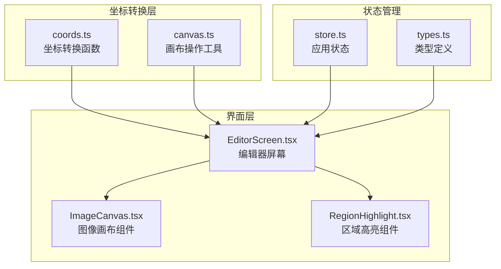
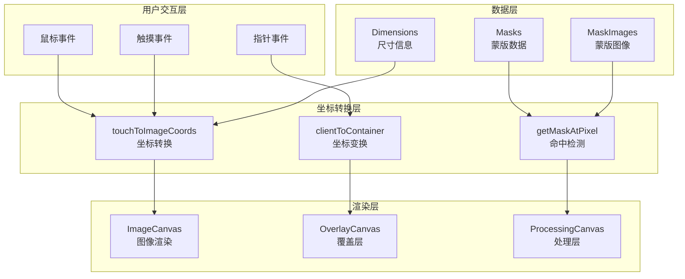
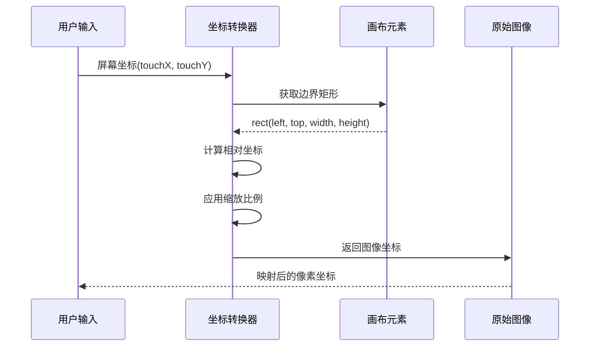
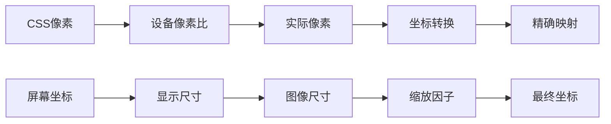
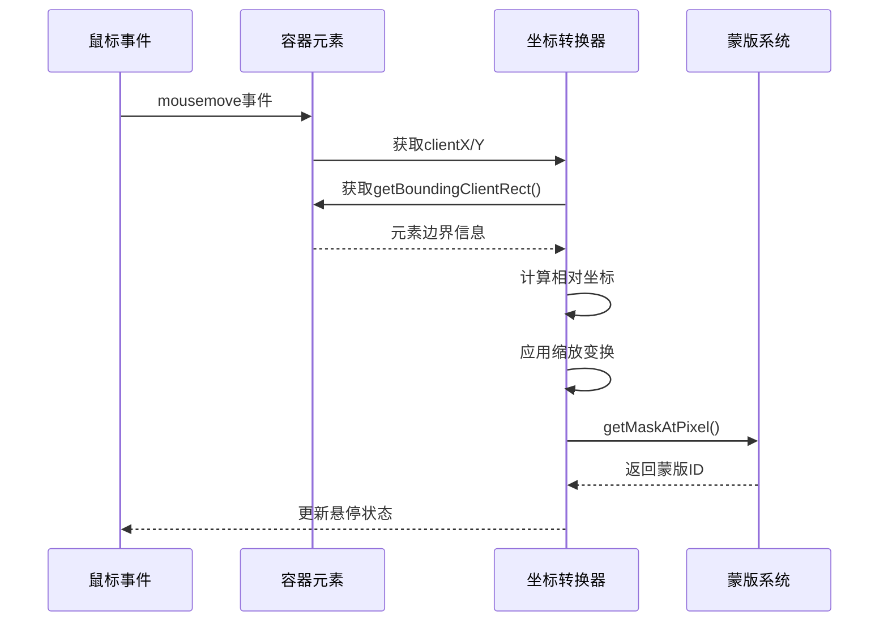
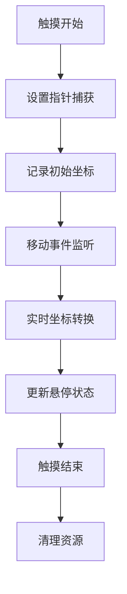
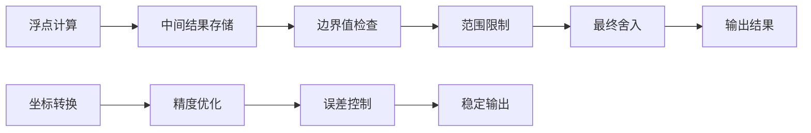
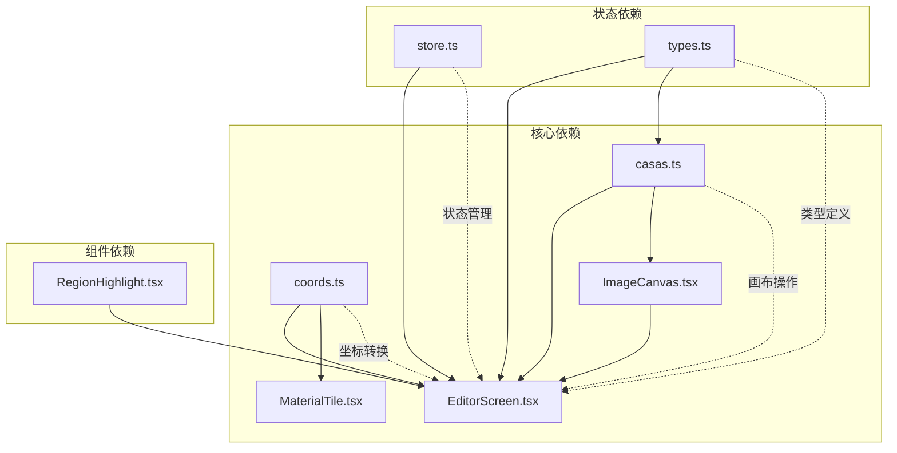
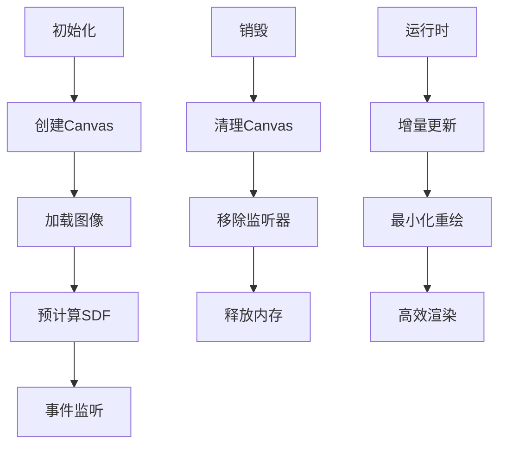
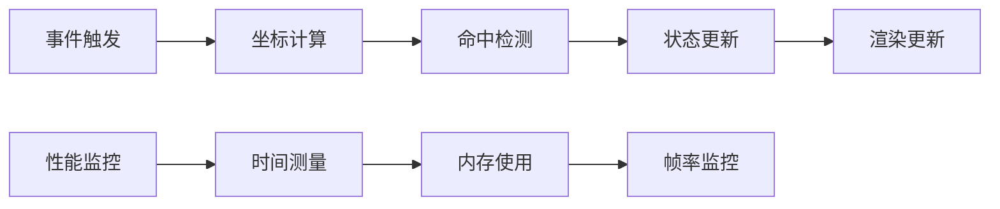

# 坐标转换系统

<cite>
**本文档引用的文件**
- [coords.ts](file://src/utils/coords.ts)
- [canvas.ts](file://src/utils/canvas.ts)
- [ImageCanvas.tsx](file://src/components/ImageCanvas.tsx)
- [EditorScreen.tsx](file://src/screens/EditorScreen.tsx)
- [store.ts](file://src/store.ts)
- [types.ts](file://src/types.ts)
- [RegionHighlight.tsx](file://src/components/RegionHighlight.tsx)
</cite>

## 目录
1. [简介](#简介)
2. [项目结构](#项目结构)
3. [核心组件](#核心组件)
4. [架构概览](#架构概览)
5. [详细组件分析](#详细组件分析)
6. [依赖关系分析](#依赖关系分析)
7. [性能考虑](#性能考虑)
8. [故障排除指南](#故障排除指南)
9. [结论](#结论)

## 简介

坐标转换系统是WallChanger项目中的关键基础设施，负责在屏幕坐标与图像坐标之间进行精确转换。该系统处理了复杂的坐标映射、缩放变换、偏移校正和分辨率适配，确保用户交互能够准确地映射到原始图像的像素坐标上。

系统的核心功能包括：
- 屏幕坐标到图像坐标的双向转换
- 设备像素比处理和视口变换
- 裁剪区域计算和边界条件处理
- 鼠标事件和触摸事件的坐标转换
- 多种坐标系之间的精确映射

## 项目结构

坐标转换系统主要分布在以下模块中：



**图表来源**
- [coords.ts:1-24](file://src/utils/coords.ts#L1-L24)
- [canvas.ts:1-905](file://src/utils/canvas.ts#L1-L905)
- [EditorScreen.tsx:1-758](file://src/screens/EditorScreen.tsx#L1-L758)

**章节来源**
- [coords.ts:1-24](file://src/utils/coords.ts#L1-L24)
- [canvas.ts:1-905](file://src/utils/canvas.ts#L1-L905)
- [EditorScreen.tsx:1-758](file://src/screens/EditorScreen.tsx#L1-L758)

## 核心组件

### 坐标转换函数

坐标转换系统的核心是`touchToImageCoords`函数，它实现了屏幕坐标到图像坐标的精确映射：

```mermaid
flowchart TD
A[输入: 屏幕坐标(touchX, touchY)] --> B[获取元素边界矩形]
B --> C[计算显示宽度和高度]
C --> D[计算相对坐标(relX, relY)]
D --> E[应用缩放比例]
E --> F[计算图像坐标(imageX, imageY)]
F --> G[边界检查和限制]
G --> H[输出: 图像坐标]
```

**图表来源**
- [coords.ts:5-23](file://src/utils/coords.ts#L5-L23)

### 画布坐标系统

画布坐标系统提供了完整的坐标变换能力，包括：

- **缩放变换**: 通过比例因子实现等比缩放
- **偏移校正**: 处理容器偏移和定位差异
- **分辨率适配**: 支持不同分辨率下的坐标映射
- **边界处理**: 确保坐标在有效范围内

**章节来源**
- [coords.ts:1-24](file://src/utils/coords.ts#L1-L24)
- [canvas.ts:1-905](file://src/utils/canvas.ts#L1-L905)

## 架构概览

坐标转换系统采用分层架构设计，确保各组件职责清晰且相互独立：



**图表来源**
- [EditorScreen.tsx:213-226](file://src/screens/EditorScreen.tsx#L213-L226)
- [EditorScreen.tsx:365-368](file://src/screens/EditorScreen.tsx#L365-L368)
- [EditorScreen.tsx:432-480](file://src/screens/EditorScreen.tsx#L432-L480)

## 详细组件分析

### 坐标转换算法

#### 基础坐标转换

坐标转换算法基于简单的线性映射原理：



**图表来源**
- [coords.ts:5-23](file://src/utils/coords.ts#L5-L23)
- [EditorScreen.tsx:213-226](file://src/screens/EditorScreen.tsx#L213-L226)

#### 设备像素比处理

系统正确处理了设备像素比的影响，确保在高DPI显示器上的精确显示：



**图表来源**
- [EditorScreen.tsx:86-99](file://src/screens/EditorScreen.tsx#L86-L99)
- [ImageCanvas.tsx:38-41](file://src/components/ImageCanvas.tsx#L38-L41)

#### 视口变换和裁剪

视口变换确保内容在容器内正确显示和裁剪：

**章节来源**
- [coords.ts:1-24](file://src/utils/coords.ts#L1-L24)
- [EditorScreen.tsx:83-99](file://src/screens/EditorScreen.tsx#L83-L99)
- [ImageCanvas.tsx:33-71](file://src/components/ImageCanvas.tsx#L33-L71)

### 鼠标事件坐标转换

#### 鼠标移动事件处理

鼠标事件坐标转换是系统中最复杂的部分之一：



**图表来源**
- [EditorScreen.tsx:213-226](file://src/screens/EditorScreen.tsx#L213-L226)
- [canvas.ts:331-339](file://src/utils/canvas.ts#L331-L339)

#### 材料拖拽坐标转换

材料拖拽功能需要实时跟踪坐标变化：

**章节来源**
- [EditorScreen.tsx:258-274](file://src/screens/EditorScreen.tsx#L258-L274)
- [EditorScreen.tsx:276-345](file://src/screens/EditorScreen.tsx#L276-L345)

### 触摸事件处理

#### 多指缩放支持

系统支持触摸事件，但当前版本主要使用指针事件API：



**图表来源**
- [MaterialTile.tsx:38-89](file://src/components/MaterialTile.tsx#L38-L89)

### 精度优化技术

#### 浮点数处理

系统采用了多种精度优化策略：

1. **边界检查**: 使用`Math.max`和`Math.min`确保坐标在有效范围内
2. **舍入控制**: 在需要时使用`Math.round`进行精确舍入
3. **数值稳定性**: 避免重复计算，使用中间变量存储结果

#### 舍入误差控制



**图表来源**
- [coords.ts:22](file://src/utils/coords.ts#L22)
- [EditorScreen.tsx:295](file://src/screens/EditorScreen.tsx#L295)

**章节来源**
- [coords.ts:1-24](file://src/utils/coords.ts#L1-L24)
- [EditorScreen.tsx:295](file://src/screens/EditorScreen.tsx#L295)

## 依赖关系分析

坐标转换系统各组件之间的依赖关系如下：



**图表来源**
- [coords.ts:1-24](file://src/utils/coords.ts#L1-L24)
- [canvas.ts:1-905](file://src/utils/canvas.ts#L1-L905)
- [EditorScreen.tsx:1-758](file://src/screens/EditorScreen.tsx#L1-L758)

**章节来源**
- [store.ts:1-177](file://src/store.ts#L1-L177)
- [types.ts:1-89](file://src/types.ts#L1-L89)

## 性能考虑

### 坐标转换性能优化

系统在性能方面采用了多项优化策略：

1. **缓存机制**: 使用`ResizeObserver`监听容器尺寸变化，避免频繁计算
2. **事件节流**: 在高频事件中使用防抖和节流技术
3. **内存管理**: 及时清理事件监听器和Canvas上下文
4. **批量更新**: 将多个状态更新合并为单次更新

### 内存使用优化



**图表来源**
- [ImageCanvas.tsx:33-71](file://src/components/ImageCanvas.tsx#L33-L71)
- [EditorScreen.tsx:228-255](file://src/screens/EditorScreen.tsx#L228-L255)

## 故障排除指南

### 常见坐标转换问题

#### 坐标偏移问题

**症状**: 点击位置与实际目标不匹配

**解决方案**:
1. 检查容器的CSS定位和边距
2. 确认`getBoundingClientRect()`返回的坐标是否正确
3. 验证缩放比例计算的准确性

#### 分辨率适配问题

**症状**: 在高DPI显示器上坐标不准确

**解决方案**:
1. 确保Canvas的`width`和`height`属性正确设置
2. 检查CSS像素与设备像素的转换
3. 验证`devicePixelRatio`的处理

#### 边界条件处理

**症状**: 坐标超出图像边界导致异常

**解决方案**:
1. 实施严格的边界检查逻辑
2. 使用`Math.max`和`Math.min`限制坐标范围
3. 添加边界警告和日志记录

**章节来源**
- [coords.ts:22](file://src/utils/coords.ts#L22)
- [EditorScreen.tsx:213-226](file://src/screens/EditorScreen.tsx#L213-L226)

### 调试技巧

#### 坐标可视化调试

系统提供了多种调试工具来帮助开发者理解坐标转换过程：

1. **悬停高亮**: 显示当前悬停区域的边界
2. **坐标显示**: 在调试面板中显示实时坐标信息
3. **蒙版可视化**: 展示蒙版的精确边界和区域

#### 性能监控



**图表来源**
- [EditorScreen.tsx:611-631](file://src/screens/EditorScreen.tsx#L611-L631)

## 结论

坐标转换系统在WallChanger项目中扮演着至关重要的角色，它确保了用户交互的精确性和系统的稳定性。通过精心设计的算法和优化策略，系统能够在各种设备和分辨率下提供一致的用户体验。

### 主要成就

1. **精确的坐标映射**: 实现了从屏幕坐标到图像坐标的精确转换
2. **多平台兼容**: 支持桌面、移动和高DPI设备
3. **性能优化**: 采用了多种优化策略确保流畅的用户体验
4. **错误处理**: 完善的边界检查和异常处理机制

### 未来改进方向

1. **手势识别增强**: 扩展触摸事件处理，支持更复杂的手势
2. **性能进一步优化**: 实施更高级的渲染优化技术
3. **精度提升**: 探索更高精度的坐标转换算法
4. **可扩展性增强**: 设计更灵活的坐标转换框架

该系统为类似的应用程序提供了优秀的参考实现，展示了如何在复杂的图形处理场景中实现精确的坐标转换。