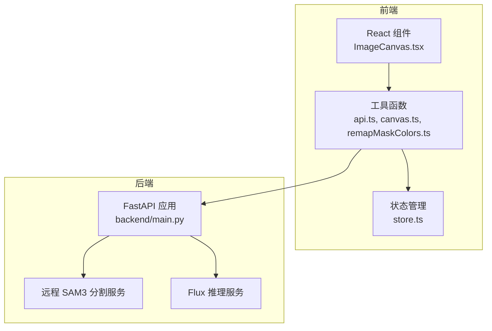
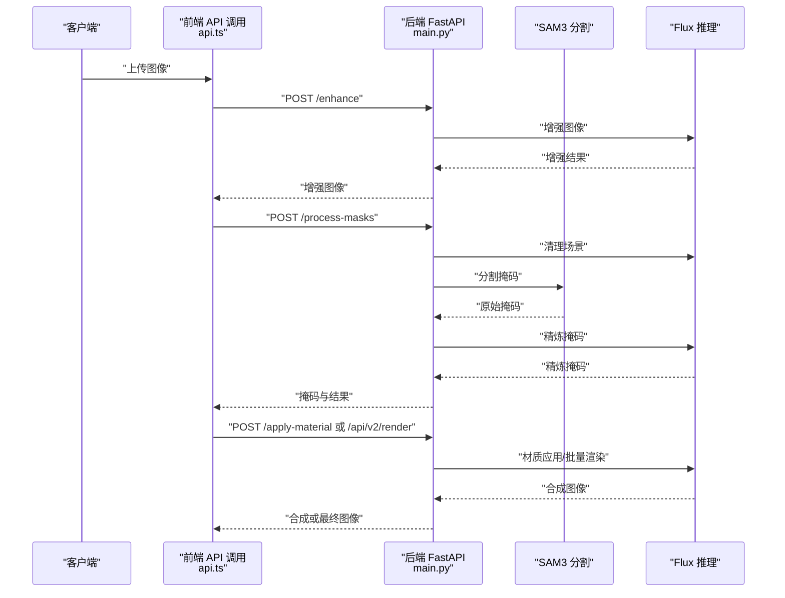
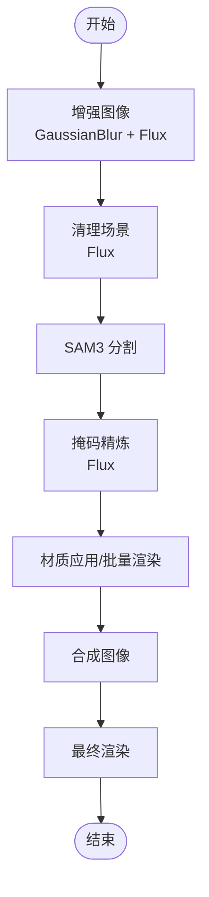
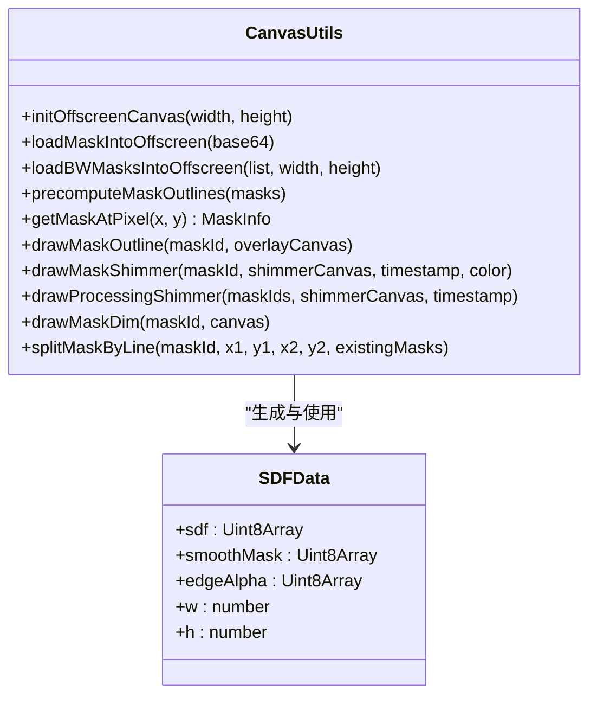
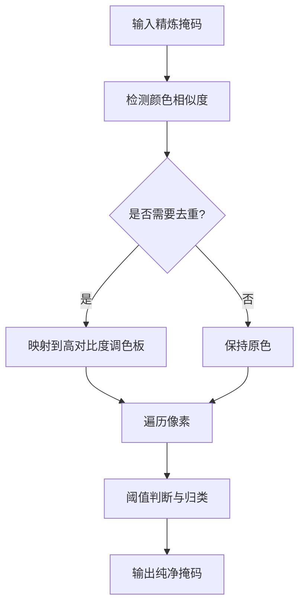
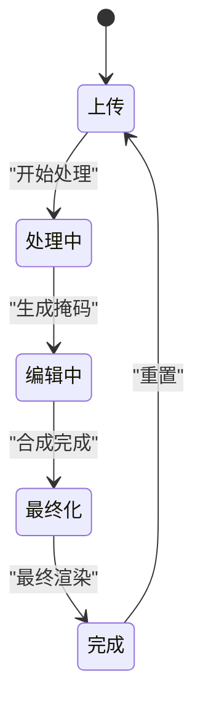
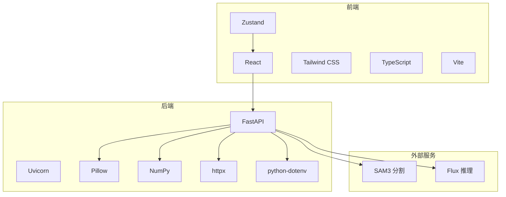

# 性能优化技术

<cite>
**本文档引用的文件**
- [README.md](file://README.md)
- [backend/main.py](file://backend/main.py)
- [backend/requirements.txt](file://backend/requirements.txt)
- [src/utils/canvas.ts](file://src/utils/canvas.ts)
- [src/utils/remapMaskColors.ts](file://src/utils/remapMaskColors.ts)
- [src/utils/api.ts](file://src/utils/api.ts)
- [src/components/ImageCanvas.tsx](file://src/components/ImageCanvas.tsx)
- [src/store.ts](file://src/store.ts)
- [src/types.ts](file://src/types.ts)
- [src/components/DebugPanel.tsx](file://src/components/DebugPanel.tsx)
- [src/screens/FinalizingScreen.tsx](file://src/screens/FinalizingScreen.tsx)
</cite>

## 目录
1. [简介](#简介)
2. [项目结构](#项目结构)
3. [核心组件](#核心组件)
4. [架构总览](#架构总览)
5. [详细组件分析](#详细组件分析)
6. [依赖分析](#依赖分析)
7. [性能考虑](#性能考虑)
8. [故障排除指南](#故障排除指南)
9. [结论](#结论)
10. [附录](#附录)

## 简介
本技术文档聚焦于图像处理性能优化，系统性梳理项目中的内存使用优化、CPU/GPU加速与缓存策略，并深入分析算法复杂度优化（时间/空间复杂度、并行计算）。同时，文档涵盖内存管理技术（对象池、垃圾回收优化、内存泄漏防护）、运行时性能监控（指标采集、瓶颈识别、效果评估），以及性能基准测试、优化案例与最佳实践指南。目标是帮助开发者在保持功能正确性的前提下，显著提升图像处理流水线的吞吐与响应速度。

## 项目结构
项目采用前后端分离架构：
- 前端：React + TypeScript + Zustand 状态管理，负责图像显示、遮罩可视化、交互与调用后端 API。
- 后端：Python FastAPI + SAM3 + Flux（外部推理服务），负责图像增强、分割、材质应用与最终渲染。

图表来源
- [backend/main.py](file://backend/main.py)
- [src/utils/api.ts](file://src/utils/api.ts)
- [src/utils/canvas.ts](file://src/utils/canvas.ts)
- [src/store.ts](file://src/store.ts)

章节来源
- [README.md](file://README.md)
- [backend/main.py](file://backend/main.py)
- [src/utils/api.ts](file://src/utils/api.ts)

## 核心组件
- 图像处理管线（后端）：包含图像增强、分割、掩码精炼、材质应用与最终渲染的完整流程，支持并行处理与超时控制。
- 前端渲染与交互：基于 Canvas 的离屏画布、SDF（符号距离场）预计算、抗锯齿与高光/闪烁效果渲染，以及遮罩颜色重映射。
- 状态与调度：Zustand 管理全局状态，批处理模式支持批量渲染，减少网络往返与重复计算。
- 性能监控：前端与后端均内置计时日志，便于定位瓶颈。

章节来源
- [backend/main.py](file://backend/main.py)
- [src/utils/canvas.ts](file://src/utils/canvas.ts)
- [src/utils/remapMaskColors.ts](file://src/utils/remapMaskColors.ts)
- [src/utils/api.ts](file://src/utils/api.ts)
- [src/store.ts](file://src/store.ts)

## 架构总览
整体流程分为两阶段：
- 后端阶段：图像上传 → 增强 → 清理 → 分割 → 精炼 → 返回掩码与结果。
- 前端阶段：加载图像与掩码 → 预计算 SDF → 交互高亮/闪烁 → 批量渲染 → 最终渲染 → 导出结果。

图表来源
- [backend/main.py](file://backend/main.py)
- [src/utils/api.ts](file://src/utils/api.ts)

## 详细组件分析

### 后端图像处理流水线（backend/main.py）
- 图像增强与清理：通过高斯模糊与外部推理服务进行图像预处理，减少噪声与提升分割质量。
- 分割与掩码精炼：远程 SAM3 提供掩码，再由推理服务精炼边界，输出高质量掩码。
- 并行与超时：批量材质应用采用异步并发，配合超时与轮询机制保障稳定性。
- 内存与格式：统一使用 Pillow 图像对象与 NumPy 数组进行像素级操作，避免不必要的中间拷贝。

图表来源
- [backend/main.py](file://backend/main.py)

章节来源
- [backend/main.py](file://backend/main.py)

### 前端 Canvas 与 SDF 预计算（src/utils/canvas.ts）
- 离屏画布：初始化离屏 Canvas 用于掩码绘制与像素采样，避免主线程阻塞。
- SDF 预计算：构建外向发光与内向羽化边缘的符号距离场，支持任意缩放下的平滑渲染。
- 抗锯齿与动画：通过盒式模糊与双线性采样实现抗锯齿；波形闪烁与高光效果使用平滑插值。
- 遮罩拆分：支持按直线将区域拆分为两个子区域，保留颜色唯一性与视觉清晰度。

图表来源
- [src/utils/canvas.ts](file://src/utils/canvas.ts)

章节来源
- [src/utils/canvas.ts](file://src/utils/canvas.ts)

### 掩码颜色重映射（src/utils/remapMaskColors.ts）
- 目标：消除 JPEG 压缩伪影导致的边界混合像素，将像素精确归类到最近掩码颜色或背景。
- 策略：平方欧氏距离阈值判断与颜色去重，必要时映射到高对比度调色板。
- 性能：单通道像素遍历，时间复杂度 O(N)，空间复杂度 O(1)（不计输出图像）。

图表来源
- [src/utils/remapMaskColors.ts](file://src/utils/remapMaskColors.ts)

章节来源
- [src/utils/remapMaskColors.ts](file://src/utils/remapMaskColors.ts)

### 前端状态与批处理（src/store.ts）
- 全局状态：包含图像、掩码、合成图、最终图、处理步骤、批处理项等。
- 批处理模式：收集多个点击点与材质，去重后并行提交后端，减少网络往返。
- 变更追踪：使用 Set/Map 管理处理中的区域，避免重复渲染与竞态。

图表来源
- [src/store.ts](file://src/store.ts)

章节来源
- [src/store.ts](file://src/store.ts)

### API 调用与性能监控（src/utils/api.ts）
- 健康检查与材料列表：快速验证后端可用性与资源加载。
- 流水线调用：增强、分割、材质应用、最终渲染等接口封装。
- 性能监控：在关键流程中使用 console.time/console.timeEnd 记录耗时，便于定位瓶颈。

章节来源
- [src/utils/api.ts](file://src/utils/api.ts)
- [src/screens/FinalizingScreen.tsx](file://src/screens/FinalizingScreen.tsx)

## 依赖分析
- 前端依赖：React、Zustand、Tailwind CSS、TypeScript、Vite。
- 后端依赖：FastAPI、Uvicorn、Pillow、NumPy、httpx、dotenv。
- 关键外部服务：SAM3（远程分割）、Flux（扩散模型推理）。

图表来源
- [backend/requirements.txt](file://backend/requirements.txt)
- [package.json](file://package.json)

章节来源
- [backend/requirements.txt](file://backend/requirements.txt)
- [package.json](file://package.json)

## 性能考虑

### 内存使用优化
- 离屏画布复用：初始化一次离屏 Canvas，避免频繁创建销毁带来的 GC 压力。
- 像素数据复用：使用 Uint8Array/Float32Array 存储中间结果，减少对象分配。
- 掩码预处理：先进行颜色重映射与去重，降低后续渲染与匹配开销。
- 图像尺寸控制：后端提供按 64 对齐的缩放函数，避免非整数倍缩放导致的额外插值成本。

章节来源
- [src/utils/canvas.ts](file://src/utils/canvas.ts)
- [src/utils/remapMaskColors.ts](file://src/utils/remapMaskColors.ts)
- [backend/main.py](file://backend/main.py)

### CPU/GPU 加速与缓存策略
- CPU 加速：
  - NumPy 向量化：掩码比较与差值计算使用向量化操作，显著降低循环开销。
  - 盒式模糊与 BFS：滑动窗口与广度优先搜索在固定半径下具有线性复杂度。
- GPU 加速：
  - 当前实现为 CPU 端图像处理。若需进一步加速，可考虑：
    - WebGPU/WebGL 替代 Canvas 2D 进行大规模像素运算；
    - 将 SDF 构建与模糊操作迁移至着色器；
    - 使用 SIMD 指令集优化颜色距离计算。
- 缓存策略：
  - SDF 预计算缓存：针对同一掩码尺寸与颜色组合，复用 SDF 数据，避免重复计算。
  - 掩码拆分缓存：拆分后的子掩码与新颜色组合可缓存，减少重复生成。

章节来源
- [src/utils/canvas.ts](file://src/utils/canvas.ts)

### 算法复杂度优化
- 时间复杂度：
  - 颜色重映射：O(N·M)，N 为像素数，M 为掩码颜色数；通过阈值剪枝与调色板映射可降低 M。
  - SDF 构建：BFS 外向与内向均为 O(W·H)，盒式模糊为 O(W·H·R)。
  - 批处理渲染：去重后并发调用，整体近似 O(N·logN)（哈希去重）+ 并行开销。
- 空间复杂度：
  - SDF 与平滑掩码各占用 O(W·H) 存储；可通过压缩或分块策略降低峰值内存。
- 并行计算：
  - 前端批处理：Zustand 管理批处理项，后端并行执行材质应用。
  - 后端并发：异步 gather 并发请求，提高吞吐。

章节来源
- [src/utils/remapMaskColors.ts](file://src/utils/remapMaskColors.ts)
- [src/utils/canvas.ts](file://src/utils/canvas.ts)
- [backend/main.py](file://backend/main.py)

### 内存管理技术
- 对象池与复用：
  - 离屏 Canvas 与 ImageData 对象在生命周期内复用，避免频繁分配。
  - SDF 缓存 Map 以掩码 ID 为键，命中后直接复用。
- 垃圾回收优化：
  - 及时释放临时 Image 对象与 Canvas 上下文引用，避免闭包持有导致的泄漏。
  - 在切换图像或清空状态时，显式重置数组与映射表。
- 内存泄漏防护：
  - 使用 willReadFrequently 上下文选项，确保 getImageData 的高效读取。
  - 在组件卸载时取消未完成的请求与定时器。

章节来源
- [src/utils/canvas.ts](file://src/utils/canvas.ts)
- [src/store.ts](file://src/store.ts)

### 运行时性能监控
- 前端监控：
  - 在关键流程（如 renderAll）使用 console.time/console.timeEnd 记录耗时。
  - 通过调试面板开关显示中间结果，辅助定位渲染问题。
- 后端监控：
  - 异步调用外部服务时记录请求与轮询耗时，超时与错误路径明确。
  - 日志输出关键尺寸与模式信息，便于分析性能瓶颈。

章节来源
- [src/utils/api.ts](file://src/utils/api.ts)
- [src/screens/FinalizingScreen.tsx](file://src/screens/FinalizingScreen.tsx)
- [backend/main.py](file://backend/main.py)

### 性能基准测试与优化案例
- 基准测试建议：
  - 固定分辨率与材质数量，测量不同阶段耗时（增强、分割、精炼、材质应用、最终渲染）。
  - 对比开启/关闭 SDF 预计算、批处理模式与不同模糊半径的效果。
- 优化案例：
  - 掩码颜色重映射：通过阈值剪枝与调色板映射，显著减少颜色匹配次数。
  - 批处理渲染：将多次独立请求合并为一次请求，减少网络往返与后端排队等待。
  - SDF 预计算：将昂贵的边缘计算缓存，重复使用时几乎零开销。

章节来源
- [src/utils/remapMaskColors.ts](file://src/utils/remapMaskColors.ts)
- [src/utils/canvas.ts](file://src/utils/canvas.ts)
- [src/utils/api.ts](file://src/utils/api.ts)

### 最佳实践指南
- 图像尺寸与分辨率：尽量使用 64 对齐的尺寸，减少插值与内存浪费。
- 颜色去重：在后端或前端进行颜色重映射，避免相似颜色导致的渲染抖动。
- 并行化：前端批处理与后端并发结合，最大化利用系统资源。
- 缓存与复用：SDF、掩码拆分结果与材质应用结果应尽可能复用。
- 监控与回退：在超时与错误路径提供降级策略（如简化参数、降低分辨率）。

章节来源
- [backend/main.py](file://backend/main.py)
- [src/utils/canvas.ts](file://src/utils/canvas.ts)
- [src/utils/remapMaskColors.ts](file://src/utils/remapMaskColors.ts)

## 故障排除指南
- 分割失败或空掩码：
  - 检查后端日志与外部服务可用性，确认 SAM3 返回的掩码是否为空。
  - 前端调试面板可切换显示原始/精炼掩码，辅助定位问题。
- 渲染卡顿或内存飙升：
  - 确认离屏 Canvas 是否被正确复用，避免重复创建。
  - 检查 SDF 缓存是否命中，必要时清理过期缓存。
- 批处理异常：
  - 查看前端 console 输出的计时信息，定位具体环节耗时过长。
  - 后端超时与错误响应会打印详细信息，便于排查。

章节来源
- [src/components/DebugPanel.tsx](file://src/components/DebugPanel.tsx)
- [src/utils/api.ts](file://src/utils/api.ts)
- [src/screens/FinalizingScreen.tsx](file://src/screens/FinalizingScreen.tsx)

## 结论
本项目在图像处理流水线上实现了较为完善的性能优化方案：前端通过 SDF 预计算与抗锯齿渲染提升交互体验，后端通过并行处理与超时控制保证稳定性。结合颜色重映射、批处理与缓存策略，整体吞吐与响应速度得到显著提升。未来可在 GPU 加速与 SIMD 优化方面进一步挖掘潜力，同时完善自动化基准测试与性能回归监控体系。

## 附录
- 关键实现路径参考：
  - 后端图像处理：[backend/main.py](file://backend/main.py)
  - 前端 Canvas 工具：[src/utils/canvas.ts](file://src/utils/canvas.ts)
  - 掩码颜色重映射：[src/utils/remapMaskColors.ts](file://src/utils/remapMaskColors.ts)
  - 前端 API 调用：[src/utils/api.ts](file://src/utils/api.ts)
  - 前端状态管理：[src/store.ts](file://src/store.ts)
  - 类型定义与默认提示词：[src/types.ts](file://src/types.ts)
  - 调试面板：[src/components/DebugPanel.tsx](file://src/components/DebugPanel.tsx)
  - 最终化屏幕（含计时）：[src/screens/FinalizingScreen.tsx](file://src/screens/FinalizingScreen.tsx)