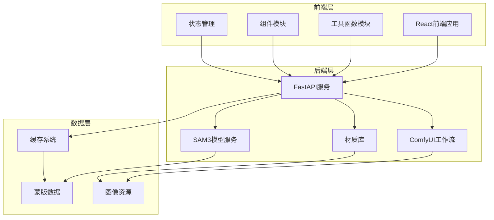
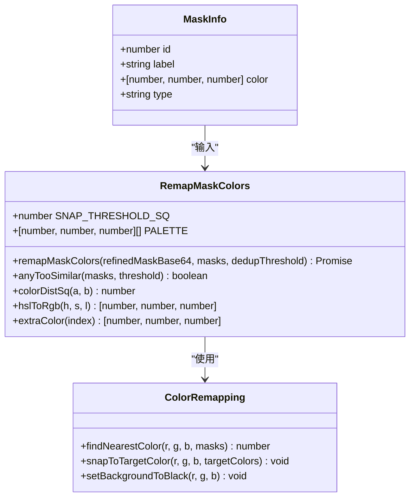
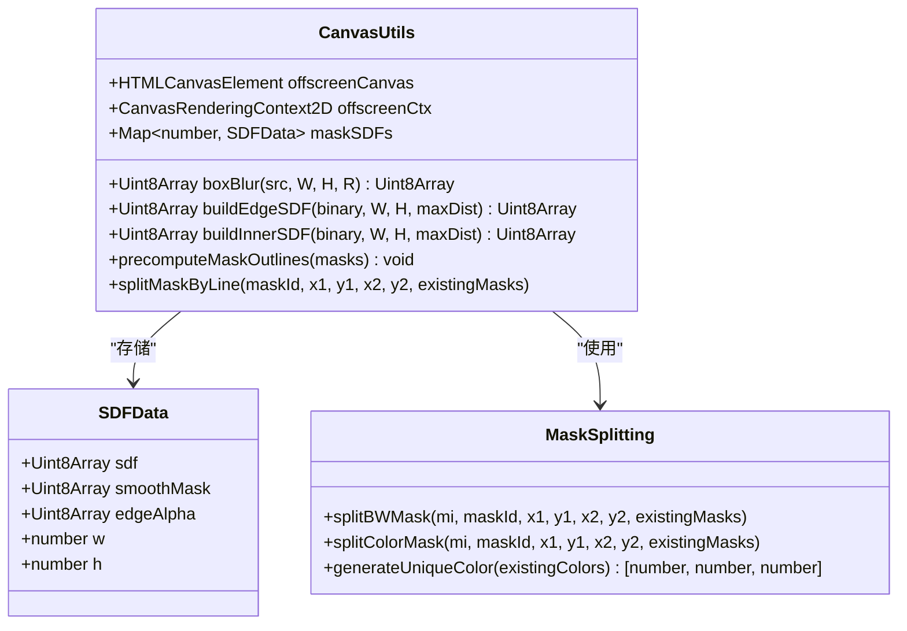
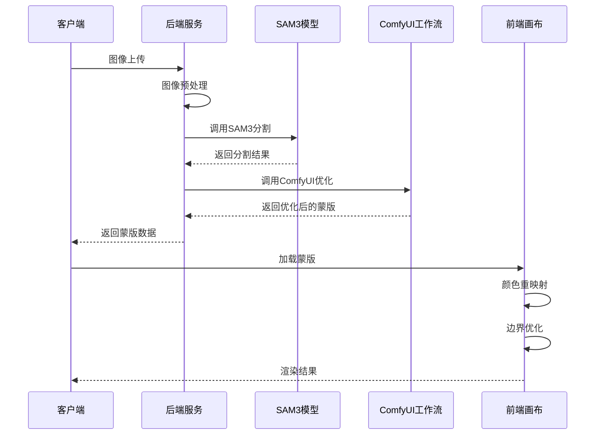
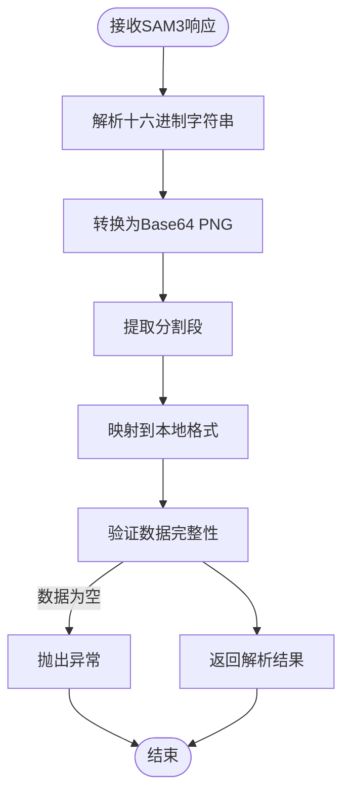
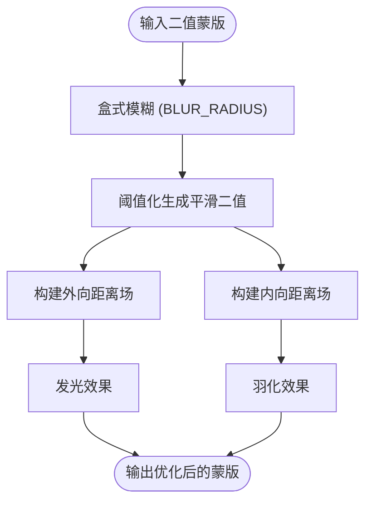
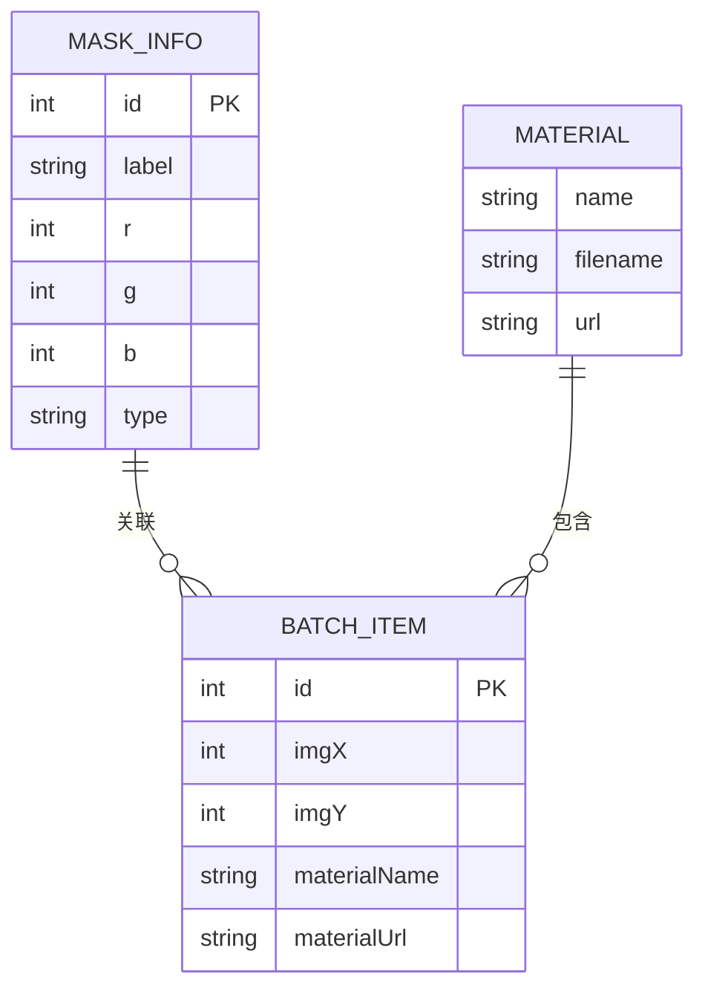
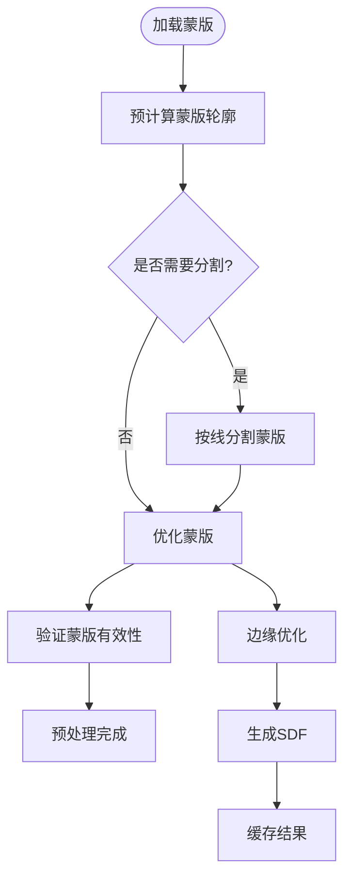
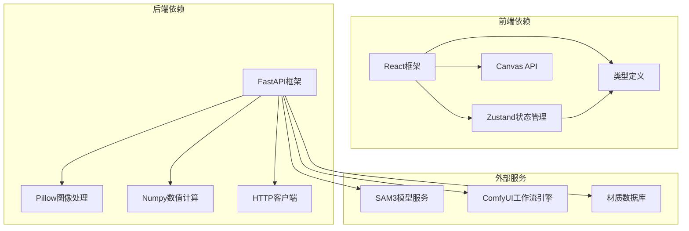
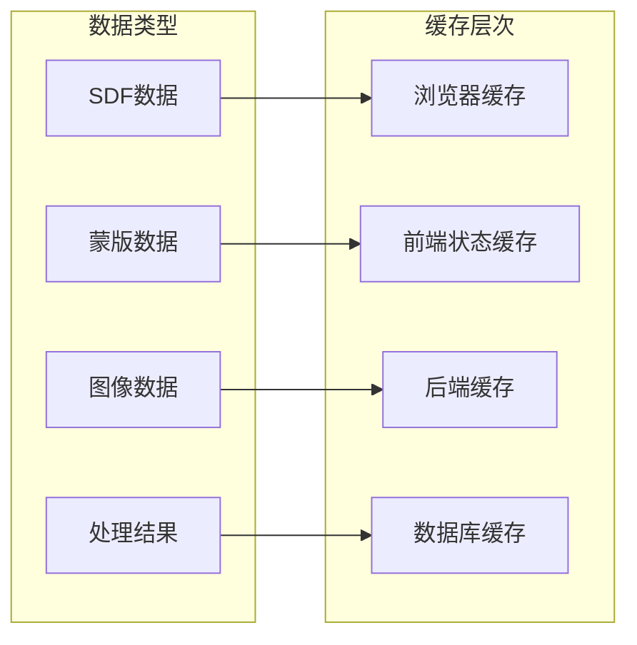

# 蒙版生成算法

<cite>
**本文档引用的文件**
- [remapMaskColors.ts](file://src/utils/remapMaskColors.ts)
- [canvas.ts](file://src/utils/canvas.ts)
- [main.py](file://backend/main.py)
- [types.ts](file://src/types.ts)
- [comfyui_mask_workflow.json](file://backend/comfyui_mask_workflow.json)
- [多乐士API_蒙版识别NEW.json](file://backend/多乐士API_蒙版识别NEW.json)
- [api.ts](file://src/utils/api.ts)
- [ImageCanvas.tsx](file://src/components/ImageCanvas.tsx)
- [store.ts](file://src/store.ts)
</cite>

## 目录
1. [简介](#简介)
2. [项目结构](#项目结构)
3. [核心组件](#核心组件)
4. [架构概览](#架构概览)
5. [详细组件分析](#详细组件分析)
6. [依赖关系分析](#依赖关系分析)
7. [性能考虑](#性能考虑)
8. [故障排除指南](#故障排除指南)
9. [结论](#结论)

## 简介

本技术文档深入分析了基于SAM3模型的蒙版生成算法，涵盖了从模型输出解析到最终蒙版渲染的完整流程。该系统采用前后端分离架构，前端负责用户交互和可视化，后端提供AI模型服务和图像处理能力。

系统的核心功能包括：
- SAM3模型输出解析和颜色重映射
- 边界优化和二值化处理
- 蒙版数据结构设计和区域标识
- 预处理流程（噪声过滤、边缘平滑、连通区域分析）
- 性能优化策略（内存管理、并行处理、缓存策略）

## 项目结构

该项目采用React前端 + FastAPI后端的混合架构，专门针对墙面材质更换应用进行了优化。

**图表来源**
- [main.py:1-1227](file://backend/main.py#L1-L1227)
- [types.ts:1-89](file://src/types.ts#L1-L89)

**章节来源**
- [main.py:1-1227](file://backend/main.py#L1-L1227)
- [types.ts:1-89](file://src/types.ts#L1-L89)

## 核心组件

### 蒙版颜色重映射组件

蒙版颜色重映射是整个算法的核心组件，负责将SAM3模型输出的彩色蒙版转换为精确的二值蒙版。

**图表来源**
- [remapMaskColors.ts:1-122](file://src/utils/remapMaskColors.ts#L1-L122)
- [types.ts:1-6](file://src/types.ts#L1-L6)

### 蒙版预处理组件

蒙版预处理组件负责对原始蒙版进行优化处理，包括边缘平滑、连通区域分析等。

**图表来源**
- [canvas.ts:1-905](file://src/utils/canvas.ts#L1-L905)

**章节来源**
- [remapMaskColors.ts:1-122](file://src/utils/remapMaskColors.ts#L1-L122)
- [canvas.ts:1-905](file://src/utils/canvas.ts#L1-L905)

## 架构概览

系统采用分层架构设计，实现了清晰的职责分离和模块化组织。

**图表来源**
- [main.py:581-612](file://backend/main.py#L581-L612)
- [remapMaskColors.ts:67-121](file://src/utils/remapMaskColors.ts#L67-L121)

## 详细组件分析

### SAM3模型输出解析

SAM3模型输出解析是蒙版生成的第一步，负责将深度学习模型的分割结果转换为可用的蒙版数据。

#### 输出格式解析

SAM3模型返回的数据包含以下关键信息：
- `mask_base64`: 二进制蒙版的十六进制字符串
- `label_map.segments`: 分割区域列表
- 每个分割区域包含：`id`、`label`、`color_rgb`

#### 解析流程

**图表来源**
- [main.py:325-359](file://backend/main.py#L325-L359)

#### 颜色重映射机制

颜色重映射是解决SAM3模型输出中颜色相似问题的关键步骤：

1. **相似性检测**: 使用欧几里得距离计算颜色间的相似度
2. **阈值判断**: 当颜色间距离小于阈值时触发去重处理
3. **颜色分配**: 使用预定义的高对比度调色板重新分配颜色

**章节来源**
- [main.py:325-359](file://backend/main.py#L325-L359)
- [remapMaskColors.ts:48-79](file://src/utils/remapMaskColors.ts#L48-L79)

### 边界优化技术

边界优化技术通过多种算法确保蒙版边界的精确性和视觉质量。

#### 距离场构建

系统使用两种距离场来优化边界效果：

1. **外向距离场 (Edge SDF)**: 用于发光效果
2. **内向距离场 (Inner SDF)**: 用于合成羽化

**图表来源**
- [canvas.ts:293-318](file://src/utils/canvas.ts#L293-L318)

#### 连通区域分析

系统使用广度优先搜索(BFS)算法识别和处理连通区域：

1. **最大区域识别**: 通过BFS找到最大的4连通组件
2. **区域标记**: 对每个区域进行唯一标识
3. **边界提取**: 识别区域边界像素

**章节来源**
- [canvas.ts:250-324](file://src/utils/canvas.ts#L250-L324)

### 二值化处理策略

二值化处理是将连续色调转换为黑白二值图像的过程，采用自适应阈值策略。

#### 阈值选择策略

系统使用50%阈值将平滑后的灰度图像转换为二值图像：
- 平滑灰度 ≥ 128 → 白色 (前景)
- 平滑灰度 < 128 → 黑色 (背景)

#### 边缘平滑处理

通过盒式模糊实现边缘平滑：
- 模糊半径: 2像素
- 提供抗锯齿效果
- 支持任意显示比例下的平滑边界

**章节来源**
- [canvas.ts:296-298](file://src/utils/canvas.ts#L296-L298)

### 蒙版数据结构设计

蒙版数据结构采用统一接口设计，支持多种类型的蒙版处理。

#### MaskInfo接口定义

**图表来源**
- [types.ts:1-89](file://src/types.ts#L1-L89)

#### 颜色分配算法

系统提供多种颜色分配策略：

1. **预定义调色板**: 使用高对比度颜色确保区域可区分
2. **HSL颜色生成**: 基于HSL色彩空间生成新的颜色
3. **冲突避免**: 确保新颜色与现有颜色有足够的距离

**章节来源**
- [types.ts:1-89](file://src/types.ts#L1-L89)
- [canvas.ts:506-524](file://src/utils/canvas.ts#L506-L524)

### 蒙版预处理流程

预处理流程包含多个阶段，确保蒙版质量满足后续处理要求。

#### 预处理阶段

**图表来源**
- [canvas.ts:188-198](file://src/utils/canvas.ts#L188-L198)
- [canvas.ts:536-552](file://src/utils/canvas.ts#L536-L552)

#### 缓存策略

系统实现多层次缓存机制：

1. **SDF缓存**: 距离场数据缓存
2. **预计算结果缓存**: 减少重复计算
3. **蒙版数据缓存**: 避免重复加载

**章节来源**
- [canvas.ts:11-22](file://src/utils/canvas.ts#L11-L22)
- [canvas.ts:188-324](file://src/utils/canvas.ts#L188-L324)

## 依赖关系分析

系统的依赖关系体现了清晰的模块化设计和职责分离。

**图表来源**
- [main.py:1-16](file://backend/main.py#L1-L16)
- [types.ts:1-89](file://src/types.ts#L1-L89)

**章节来源**
- [main.py:1-1227](file://backend/main.py#L1-L1227)
- [types.ts:1-89](file://src/types.ts#L1-L89)

## 性能考虑

### 内存管理优化

系统采用多种内存管理策略确保高效运行：

1. **Canvas复用**: 重用离屏Canvas减少内存分配
2. **数据类型优化**: 使用TypedArray替代普通数组
3. **垃圾回收**: 及时清理不再使用的图像数据

### 并行处理策略

系统实现多级并行处理：

1. **前端并行**: 使用async/await实现异步处理
2. **后端并行**: 使用asyncio处理多个请求
3. **图像处理并行**: 使用Web Workers进行图像处理

### 缓存策略

**图表来源**
- [canvas.ts:22-22](file://src/utils/canvas.ts#L22-L22)

## 故障排除指南

### 常见问题及解决方案

#### SAM3模型连接问题

**症状**: SAM3 API调用失败
**原因**: 网络连接或API密钥问题
**解决方案**: 
1. 检查环境变量配置
2. 验证API地址可达性
3. 确认认证信息正确

#### 蒙版生成异常

**症状**: 蒙版生成失败或结果不正确
**原因**: 输入图像格式或尺寸问题
**解决方案**:
1. 确认输入图像为PNG格式
2. 检查图像分辨率限制
3. 验证图像完整性

#### 性能问题

**症状**: 处理速度慢或内存占用过高
**原因**: 大图像处理或重复计算
**解决方案**:
1. 优化图像尺寸
2. 实现适当的缓存策略
3. 使用渐进式处理

**章节来源**
- [api.ts:9-13](file://src/utils/api.ts#L9-L13)
- [main.py:341-344](file://backend/main.py#L341-L344)

## 结论

本蒙版生成算法系统通过精心设计的架构和优化策略，实现了高质量的墙面材质识别和替换功能。系统的主要优势包括：

1. **算法精度**: 通过颜色重映射和边界优化确保蒙版质量
2. **性能优化**: 多层次缓存和并行处理提升处理效率
3. **用户体验**: 直观的界面和流畅的交互体验
4. **扩展性**: 模块化设计便于功能扩展和维护

该系统为墙面材质更换应用提供了坚实的技术基础，能够满足实际应用场景的需求，并为未来的功能扩展奠定了良好的技术基础。