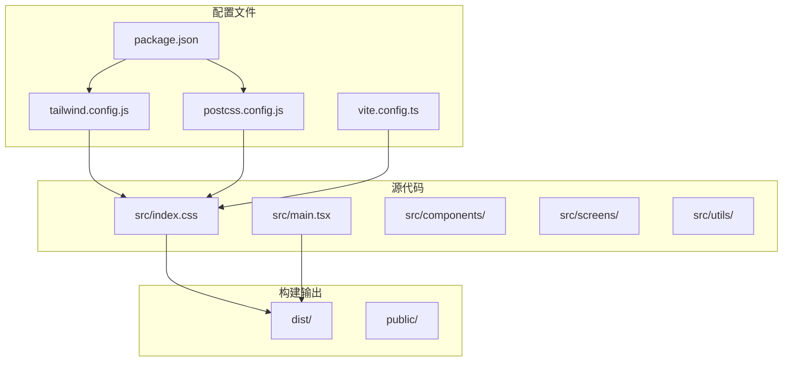
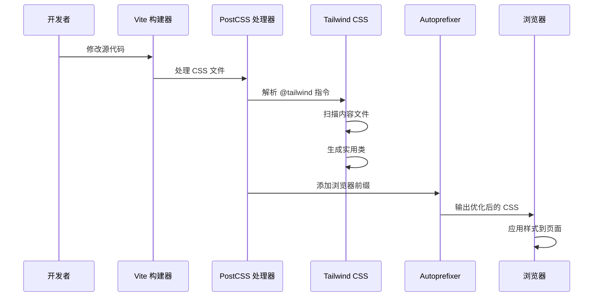
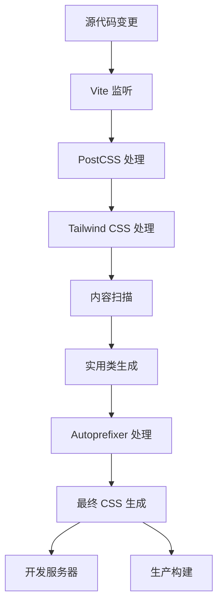
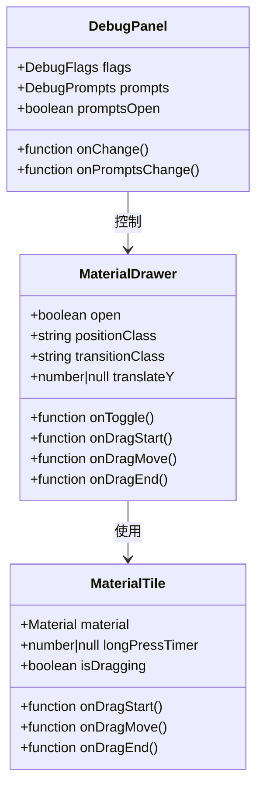

# Tailwind CSS 与 PostCSS 配置

<cite>
**本文档引用的文件**
- [tailwind.config.js](file://tailwind.config.js)
- [postcss.config.js](file://postcss.config.js)
- [package.json](file://package.json)
- [src/index.css](file://src/index.css)
- [vite.config.ts](file://vite.config.ts)
- [src/main.tsx](file://src/main.tsx)
- [src/components/MaterialDrawer.tsx](file://src/components/MaterialDrawer.tsx)
- [src/components/DebugPanel.tsx](file://src/components/DebugPanel.tsx)
- [src/components/MaterialTile.tsx](file://src/components/MaterialTile.tsx)
- [src/types.ts](file://src/types.ts)
</cite>

## 目录
1. [简介](#简介)
2. [项目结构](#项目结构)
3. [核心组件](#核心组件)
4. [架构概览](#架构概览)
5. [详细组件分析](#详细组件分析)
6. [依赖关系分析](#依赖关系分析)
7. [性能考虑](#性能考虑)
8. [故障排除指南](#故障排除指南)
9. [结论](#结论)

## 简介

本文件为 WallChanger 项目的 Tailwind CSS 和 PostCSS 配置技术文档。该项目是一个基于 React 和 Vite 的墙面材质更换应用，采用现代化的前端构建工具链。文档将深入分析 Tailwind CSS 的配置选项、PostCSS 的作用机制、样式编译流程以及自定义样式覆盖策略。

## 项目结构

该项目采用标准的现代前端项目结构，包含以下关键配置文件：



**图表来源**
- [tailwind.config.js:1-12](file://tailwind.config.js#L1-L12)
- [postcss.config.js:1-7](file://postcss.config.js#L1-L7)
- [package.json:1-27](file://package.json#L1-L27)

**章节来源**
- [tailwind.config.js:1-12](file://tailwind.config.js#L1-L12)
- [postcss.config.js:1-7](file://postcss.config.js#L1-L7)
- [package.json:1-27](file://package.json#L1-L27)

## 核心组件

### Tailwind CSS 配置分析

当前项目使用了 Tailwind CSS 的默认配置，主要特点包括：

- **内容扫描路径**: 配置了 HTML 和 TypeScript 源文件的扫描范围
- **主题扩展**: 当前为空扩展，允许后续自定义
- **插件系统**: 未启用任何插件

### PostCSS 配置分析

PostCSS 配置包含了两个核心插件：

- **Tailwind CSS 插件**: 处理 `@tailwind` 指令
- **Autoprefixer 插件**: 自动添加浏览器前缀

### 样式入口文件

主样式文件采用标准的 Tailwind 指令结构，并包含自定义动画效果：

- `@tailwind base`: 基础样式重置
- `@tailwind components`: 组件样式
- `@tailwind utilities`: 实用类样式

**章节来源**
- [tailwind.config.js:1-12](file://tailwind.config.js#L1-L12)
- [postcss.config.js:1-7](file://postcss.config.js#L1-L7)
- [src/index.css:1-38](file://src/index.css#L1-L38)

## 架构概览

项目采用 Vite 作为构建工具，结合 Tailwind CSS 和 PostCSS 实现现代化的样式处理：



**图表来源**
- [vite.config.ts:1-48](file://vite.config.ts#L1-L48)
- [postcss.config.js:1-7](file://postcss.config.js#L1-L7)
- [tailwind.config.js:1-12](file://tailwind.config.js#L1-L12)

## 详细组件分析

### Tailwind CSS 配置详解

#### 内容路径配置
```mermaid
flowchart TD
A[内容扫描配置] --> B[index.html]
A --> C[src/**/*.{js,ts,jsx,tsx}]
B --> D[HTML 模板文件]
C --> E[TypeScript 源文件]
C --> F[JavaScript 源文件]
C --> G[JSX 源文件]
C --> H[TX 源文件]
D --> I[静态内容检测]
E --> I
F --> I
G --> I
H --> I
```

**图表来源**
- [tailwind.config.js:3-6](file://tailwind.config.js#L3-L6)

#### 主题定制扩展
当前配置中的主题扩展部分为空，为未来的自定义留出空间。建议的扩展方向包括：
- 颜色系统的自定义扩展
- 字体族的配置
- 断点的重新定义
- 间距和尺寸的扩展

#### 插件系统
插件数组当前为空，支持未来集成：
- Tailwind UI 组件库
- 自定义开发工具插件
- 第三方 Tailwind 扩展

**章节来源**
- [tailwind.config.js:1-12](file://tailwind.config.js#L1-L12)

### PostCSS 配置深度分析

#### 插件链路分析
```mermaid
graph LR
A[原始 CSS] --> B[Tailwind CSS 插件]
B --> C[Autoprefixer 插件]
C --> D[优化后的 CSS]
B --> E[@tailwind 指令解析]
B --> F[实用类生成]
B --> G[内容扫描]
C --> H[浏览器兼容性处理]
C --> I[前缀自动添加]
```

**图表来源**
- [postcss.config.js:1-7](file://postcss.config.js#L1-L7)

#### 自动前缀功能
Autoprefixer 根据目标浏览器列表自动添加必要的 CSS 前缀，确保跨浏览器兼容性。

**章节来源**
- [postcss.config.js:1-7](file://postcss.config.js#L1-L7)

### 样式编译流程

#### 构建时处理流程


**图表来源**
- [vite.config.ts:1-48](file://vite.config.ts#L1-L48)
- [postcss.config.js:1-7](file://postcss.config.js#L1-L7)

**章节来源**
- [vite.config.ts:1-48](file://vite.config.ts#L1-L48)

### 自定义样式覆盖分析

#### 组件级样式实现
项目中的组件广泛使用 Tailwind 实用类进行样式控制：



**图表来源**
- [src/components/MaterialDrawer.tsx:1-136](file://src/components/MaterialDrawer.tsx#L1-L136)
- [src/components/DebugPanel.tsx:1-91](file://src/components/DebugPanel.tsx#L1-L91)
- [src/components/MaterialTile.tsx:1-106](file://src/components/MaterialTile.tsx#L1-L106)

#### 样式类使用模式
组件中大量使用了 Tailwind 的响应式前缀和状态类：

- **响应式类**: `md:`, `lg:` 等断点前缀
- **交互状态类**: `hover:`, `active:`, `focus:` 等状态前缀
- **布局类**: `grid`, `flex`, `space-between` 等布局控制
- **视觉效果类**: `rounded`, `shadow`, `opacity` 等视觉修饰

**章节来源**
- [src/components/MaterialDrawer.tsx:84-106](file://src/components/MaterialDrawer.tsx#L84-L106)
- [src/components/DebugPanel.tsx:36-91](file://src/components/DebugPanel.tsx#L36-L91)
- [src/components/MaterialTile.tsx:91-106](file://src/components/MaterialTile.tsx#L91-L106)

### 主题系统实现

#### 颜色系统分析
项目采用深色主题设计，主要颜色变量包括：
- **背景色**: `bg-gray-900/40` - 半透明深灰色背景
- **边框色**: `border-white/[0.08]` - 低透明度白色边框
- **文本色**: `text-gray-400` - 中等亮度灰色文本
- **强调色**: `bg-gradient-to-r from-blue-500 to-cyan-500` - 渐变蓝色强调色

#### 动画系统
项目实现了自定义动画效果：
- **Shimmer 动画**: 用于加载状态的渐变闪烁效果
- **Slide-up 动画**: 用于界面滑入的平滑过渡效果

**章节来源**
- [src/index.css:5-37](file://src/index.css#L5-L37)
- [src/components/MaterialDrawer.tsx:84-106](file://src/components/MaterialDrawer.tsx#L84-L106)

## 依赖关系分析

### 开发依赖关系
```mermaid
graph TB
subgraph "核心依赖"
A[tailwindcss ^3.4.17]
B[postcss ^8.4.49]
C[autoprefixer ^10.4.20]
D[vite ^6.0.3]
end
subgraph "运行时依赖"
E[react ^18.3.1]
F[react-dom ^18.3.1]
G[zustand ^5.0.2]
end
subgraph "类型定义"
H[@types/react ^18.3.12]
I[@types/react-dom ^18.3.1]
end
A --> B
B --> C
D --> A
D --> B
E --> F
```

**图表来源**
- [package.json:11-25](file://package.json#L11-L25)

### 构建工具链集成
项目使用 Vite 作为主要构建工具，与 Tailwind CSS 和 PostCSS 无缝集成：

- **Vite 插件**: React 插件提供热重载和 JSX 支持
- **PostCSS 集成**: 通过 Vite 的 CSS 处理管道自动应用
- **开发服务器**: 提供实时预览和热更新功能

**章节来源**
- [package.json:1-27](file://package.json#L1-L27)
- [vite.config.ts:1-48](file://vite.config.ts#L1-L48)

## 性能考虑

### 构建性能优化
1. **内容扫描优化**: 精确配置内容路径，避免不必要的文件扫描
2. **插件选择**: 仅启用必要的插件，减少构建时间
3. **缓存策略**: 利用 Vite 的内置缓存机制

### 运行时性能优化
1. **CSS 体积控制**: 通过内容驱动的实用类生成，避免未使用的样式
2. **动画优化**: 使用硬件加速的 CSS 属性（如 transform）
3. **组件样式**: 将样式逻辑内联到组件中，便于 Tree Shaking

### 最佳实践建议
1. **样式组织**: 将通用样式提取到共享组件中
2. **颜色管理**: 使用语义化的颜色命名约定
3. **响应式设计**: 优先使用移动优先的设计方法

## 故障排除指南

### 常见问题及解决方案

#### Tailwind 类不生效
**症状**: 使用 Tailwind 类但样式未应用
**原因**: 内容扫描路径配置不正确或类名拼写错误
**解决方法**:
1. 检查 `tailwind.config.js` 中的内容路径配置
2. 确认类名拼写正确
3. 验证 CSS 文件是否被正确导入

#### 构建失败
**症状**: 构建过程中出现错误
**原因**: 依赖版本冲突或配置错误
**解决方法**:
1. 更新依赖包到兼容版本
2. 检查 PostCSS 配置语法
3. 验证 Vite 配置文件

#### 样式冲突
**症状**: 自定义样式与 Tailwind 样式冲突
**原因**: CSS 优先级问题或样式覆盖不当
**解决方法**:
1. 使用 `!important` 临时解决冲突
2. 调整 Tailwind 配置中的优先级设置
3. 重构样式结构避免冲突

**章节来源**
- [tailwind.config.js:1-12](file://tailwind.config.js#L1-L12)
- [postcss.config.js:1-7](file://postcss.config.js#L1-L7)

## 结论

本项目成功集成了 Tailwind CSS 和 PostCSS，建立了现代化的样式处理体系。通过合理的配置和最佳实践，实现了高效的样式开发和优化的运行时性能。

### 主要成就
1. **简洁配置**: 使用默认配置减少了维护成本
2. **高效构建**: Vite + PostCSS 的组合提供了快速的开发体验
3. **现代设计**: 深色主题和流畅动画提升了用户体验

### 改进建议
1. **主题定制**: 在 `theme.extend` 中添加颜色和字体配置
2. **插件集成**: 考虑添加 Tailwind UI 或其他实用插件
3. **性能监控**: 添加 CSS 体积分析工具
4. **测试策略**: 建立样式变更的自动化测试流程

该配置为后续的功能扩展和性能优化奠定了良好的基础，适合在大型项目中继续发展和完善。