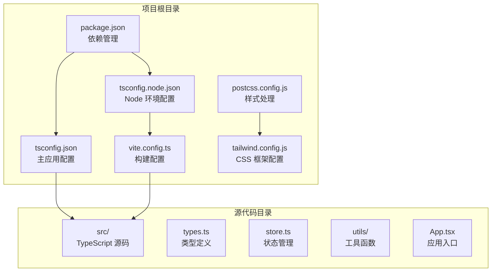
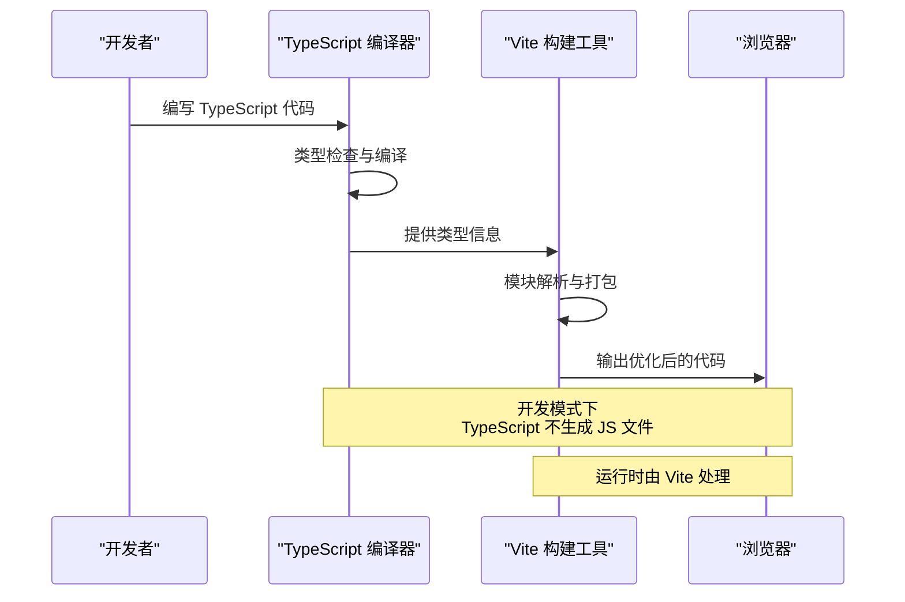
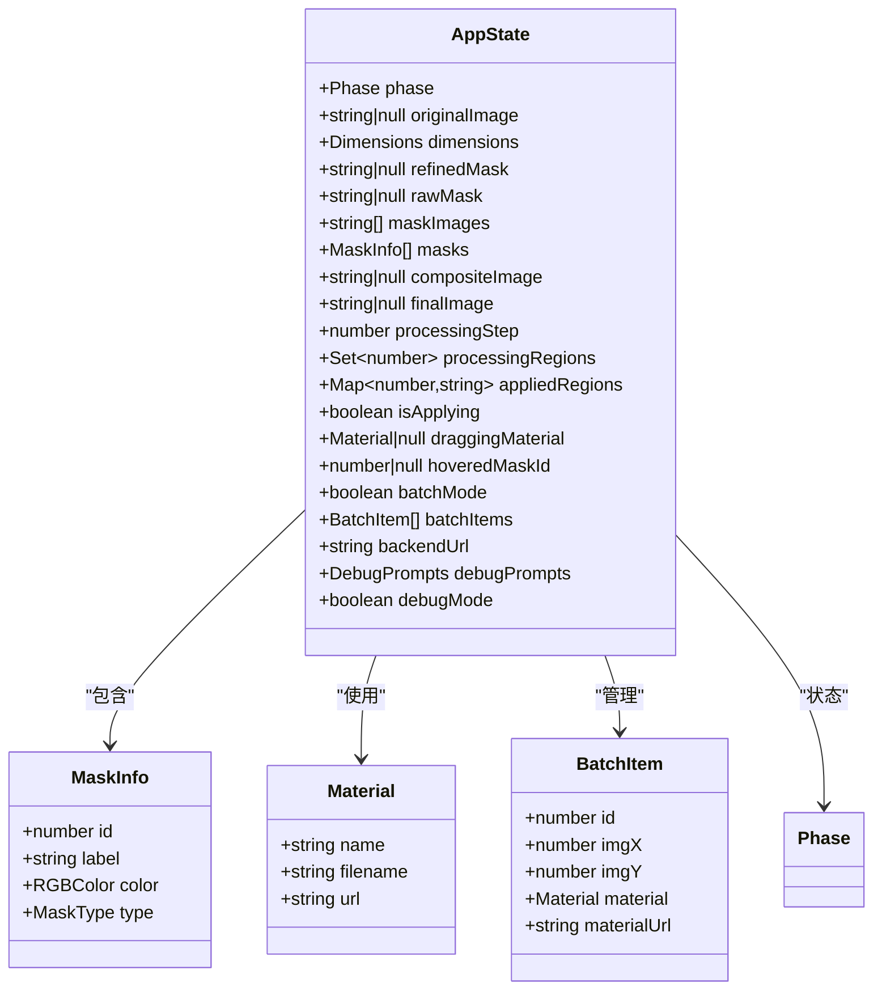
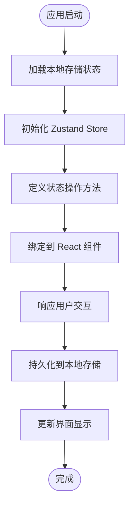
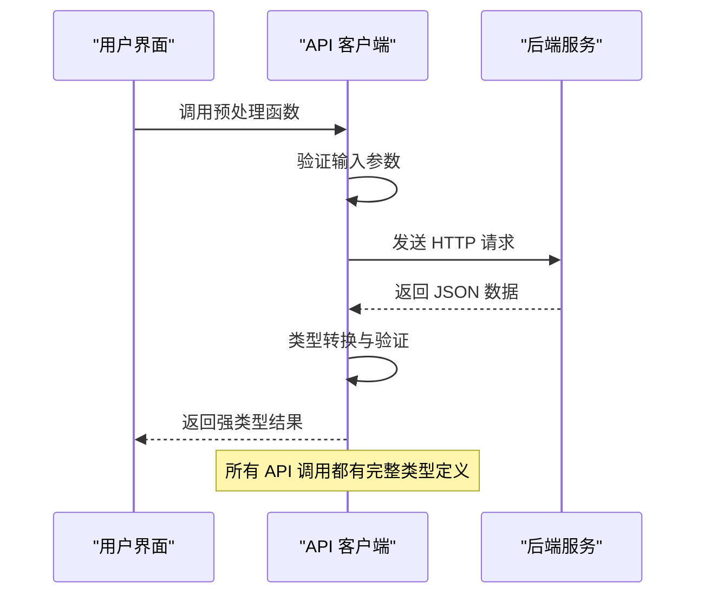
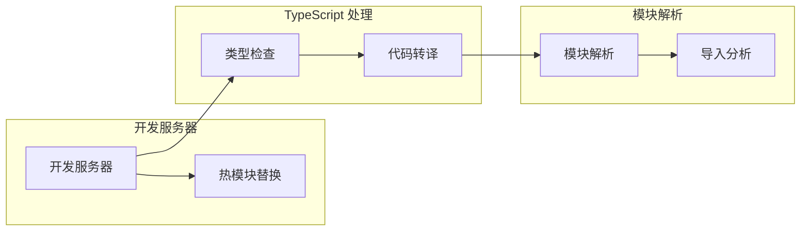
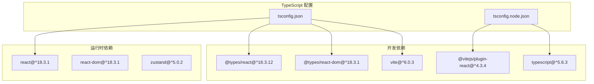

# TypeScript 配置

<cite>
**本文档引用的文件**
- [tsconfig.json](file://tsconfig.json)
- [tsconfig.node.json](file://tsconfig.node.json)
- [package.json](file://package.json)
- [vite.config.ts](file://vite.config.ts)
- [postcss.config.js](file://postcss.config.js)
- [tailwind.config.js](file://tailwind.config.js)
- [src/types.ts](file://src/types.ts)
- [src/store.ts](file://src/store.ts)
- [src/utils/api.ts](file://src/utils/api.ts)
- [src/App.tsx](file://src/App.tsx)
</cite>

## 目录
1. [简介](#简介)
2. [项目结构](#项目结构)
3. [核心组件](#核心组件)
4. [架构概览](#架构概览)
5. [详细组件分析](#详细组件分析)
6. [依赖关系分析](#依赖关系分析)
7. [性能考虑](#性能考虑)
8. [故障排除指南](#故障排除指南)
9. [结论](#结论)

## 简介

本项目采用现代 TypeScript 配置方案，结合 Vite 构建工具实现高效的前端开发体验。配置重点包括严格的类型检查、现代化的编译目标、ESNext 模块系统以及与 React 生态系统的深度集成。本文档将深入分析 tsconfig.json 和 tsconfig.node.json 的配置选项，解释编译器特性，并提供最佳实践指导。

## 项目结构

项目采用标准的前端项目布局，TypeScript 配置文件位于项目根目录，与构建配置文件协同工作：

**图表来源**
- [tsconfig.json:1-22](file://tsconfig.json#L1-L22)
- [tsconfig.node.json:1-19](file://tsconfig.node.json#L1-L19)
- [package.json:1-27](file://package.json#L1-L27)

**章节来源**
- [tsconfig.json:1-22](file://tsconfig.json#L1-L22)
- [tsconfig.node.json:1-19](file://tsconfig.node.json#L1-L19)
- [package.json:1-27](file://package.json#L1-L27)

## 核心组件

### 主 TypeScript 配置 (tsconfig.json)

主配置文件针对浏览器环境进行了专门优化，采用了以下关键设置：

**编译目标与库支持**
- 目标版本：ES2020，确保现代 JavaScript 特性的支持
- 库包含：ES2020、DOM、DOM.Iterable，提供完整的 Web API 类型支持

**模块系统与解析策略**
- 模块格式：ESNext，利用现代打包器的 Tree Shaking 能力
- 模块解析：bundler，与 Vite 等现代打包器完美兼容
- JSON 模块解析：启用，支持直接导入 .json 文件

**严格类型检查**
- 启用严格模式，提供最强的类型安全保障
- 禁用未使用本地变量和参数检查
- 启用 switch 语句的无遗漏检查

**编译输出控制**
- noEmit: true，仅进行类型检查，不生成 JavaScript 文件
- JSX 处理：react-jsx，专门为 React 18+ 设计的 JSX 转换

**章节来源**
- [tsconfig.json:2-18](file://tsconfig.json#L2-L18)

### Node 环境配置 (tsconfig.node.json)

独立的 Node 环境配置专注于构建工具的类型检查：

**目标与模块检测**
- 目标版本：ES2022，支持较新的 Node.js 特性
- 模块检测：force，强制将所有文件视为模块

**配置特点**
- 专门用于检查 Vite 配置文件
- 继承严格模式和其他安全设置
- 支持 TypeScript 扩展名导入

**章节来源**
- [tsconfig.node.json:2-16](file://tsconfig.node.json#L2-L16)

## 架构概览

TypeScript 配置与构建工具的集成架构如下：

**图表来源**
- [tsconfig.json:11](file://tsconfig.json#L11)
- [vite.config.ts:1-48](file://vite.config.ts#L1-L48)

## 详细组件分析

### 类型定义系统

项目建立了完善的类型定义体系，支持复杂的业务逻辑：

**图表来源**
- [src/types.ts:1-89](file://src/types.ts#L1-L89)

**类型系统特点**：
- 使用接口定义复杂的数据结构
- 通过联合类型实现枚举式的状态管理
- 利用泛型支持动态数据处理
- 完整的可选属性和默认值处理

**章节来源**
- [src/types.ts:1-89](file://src/types.ts#L1-L89)

### 状态管理集成

Zustand 状态管理与 TypeScript 的深度集成：

**图表来源**
- [src/store.ts:1-177](file://src/store.ts#L1-L177)

**状态管理模式**：
- 使用 TypeScript 接口定义 Store 结构
- 通过泛型约束确保类型安全
- 实现完整的状态持久化机制
- 支持批量操作和事务性更新

**章节来源**
- [src/store.ts:1-177](file://src/store.ts#L1-L177)

### API 服务层

HTTP 客户端与 TypeScript 的类型安全集成：

**图表来源**
- [src/utils/api.ts:1-200](file://src/utils/api.ts#L1-L200)

**API 设计原则**：
- 每个 API 函数都有明确的输入输出类型
- 错误处理包含详细的类型信息
- 支持异步操作的类型推断
- 完整的 Promise 类型定义

**章节来源**
- [src/utils/api.ts:1-200](file://src/utils/api.ts#L1-L200)

### 构建配置集成

Vite 与 TypeScript 的协同工作机制：

**图表来源**
- [vite.config.ts:1-48](file://vite.config.ts#L1-L48)
- [package.json:6-10](file://package.json#L6-L10)

**构建特性**：
- 开发模式下的即时反馈
- 生产环境的代码优化
- 内置的代理配置支持
- 插件生态系统的集成

**章节来源**
- [vite.config.ts:1-48](file://vite.config.ts#L1-L48)
- [package.json:6-10](file://package.json#L6-L10)

## 依赖关系分析

TypeScript 配置与项目依赖的相互作用：

**图表来源**
- [package.json:11-25](file://package.json#L11-L25)

**依赖管理策略**：
- 明确区分运行时和开发时依赖
- TypeScript 版本与相关工具链的兼容性
- React 生态系统的类型定义同步
- 构建工具链的版本锁定

**章节来源**
- [package.json:11-25](file://package.json#L11-L25)

## 性能考虑

### 编译性能优化

**模块解析优化**
- 使用 bundler 解析策略减少解析开销
- ESNext 模块格式支持更好的 Tree Shaking
- 禁用不必要的库检查提升编译速度

**类型检查优化**
- isolatedModules 配置允许单文件类型检查
- skipLibCheck 跳过第三方库的类型检查
- noEmit 配置在开发模式下避免重复编译

### 运行时性能

**构建优化**
- Vite 的原生 ESM 支持
- 开发服务器的快速启动
- 热模块替换减少页面刷新

**内存管理**
- TypeScript 编译器的内存使用控制
- React 组件的生命周期优化
- Zustand 状态管理的高效更新

## 故障排除指南

### 常见配置问题

**类型检查错误**
- 确保所有模块都正确声明类型
- 检查接口定义的一致性
- 验证泛型参数的正确使用

**模块解析失败**
- 检查 tsconfig.json 中的 include 路径
- 验证模块解析策略的配置
- 确认文件扩展名的正确性

**构建错误**
- 检查 Vite 配置文件的语法
- 验证插件的兼容性
- 确认环境变量的正确设置

### 调试技巧

**开发工具使用**
- 利用 VS Code 的 TypeScript 诊断功能
- 使用 tsserver 进行实时类型检查
- 配置 ESLint 进行额外的代码质量检查

**性能监控**
- 监控构建时间的变化
- 分析包大小的组成
- 优化模块导入路径

**章节来源**
- [tsconfig.json:14-17](file://tsconfig.json#L14-L17)
- [tsconfig.node.json:12-15](file://tsconfig.node.json#L12-L15)

## 结论

本项目的 TypeScript 配置展现了现代前端开发的最佳实践。通过精心设计的编译选项、严格的类型检查和高效的构建流程，实现了高质量的开发体验和可靠的运行时性能。

**关键优势**：
- 严格的类型系统确保代码质量
- 现代化的编译目标支持最新特性
- 与 Vite 生态系统的无缝集成
- 完善的开发工具链支持

**未来改进建议**：
- 考虑添加自定义的 ESLint 规则
- 实施更细粒度的模块拆分
- 添加单元测试和集成测试框架
- 优化生产环境的代码分割策略