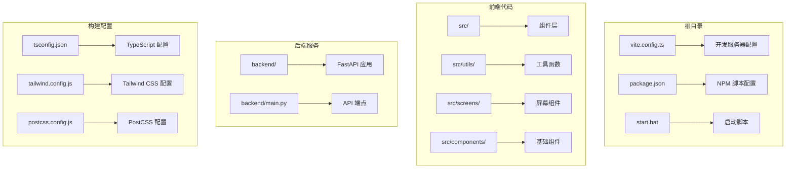
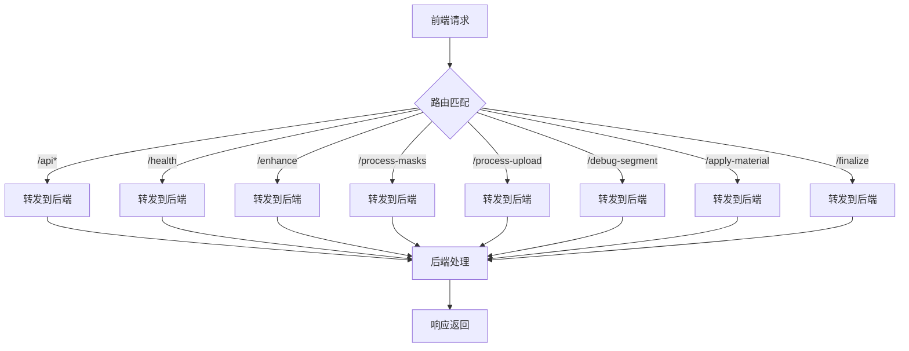
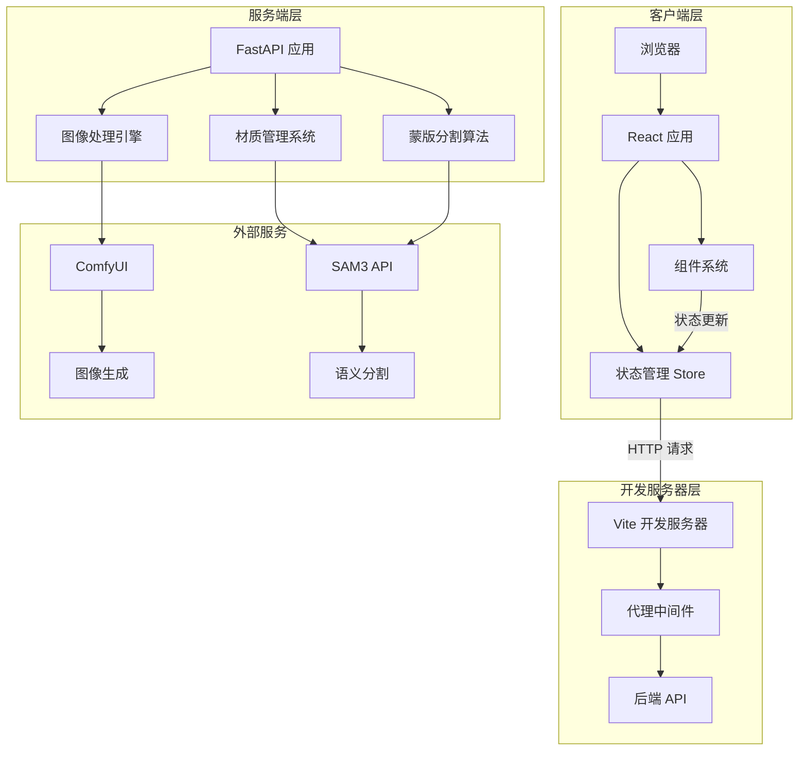
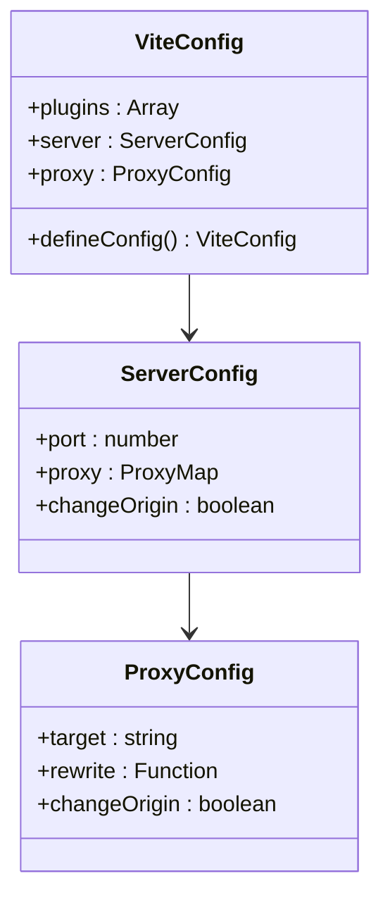
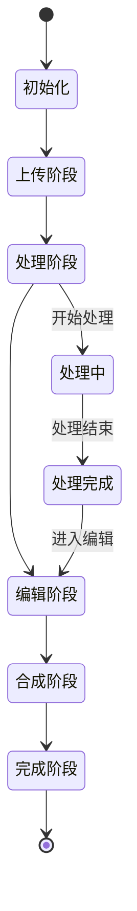
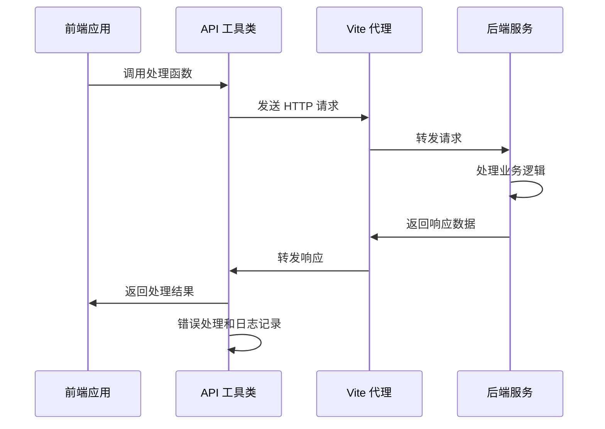
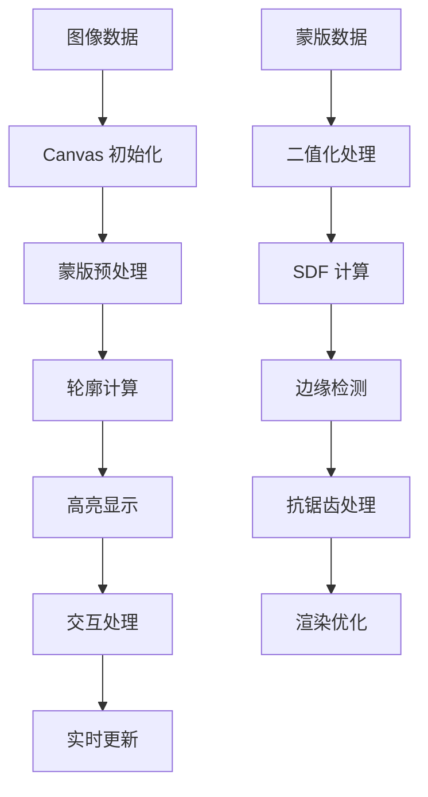
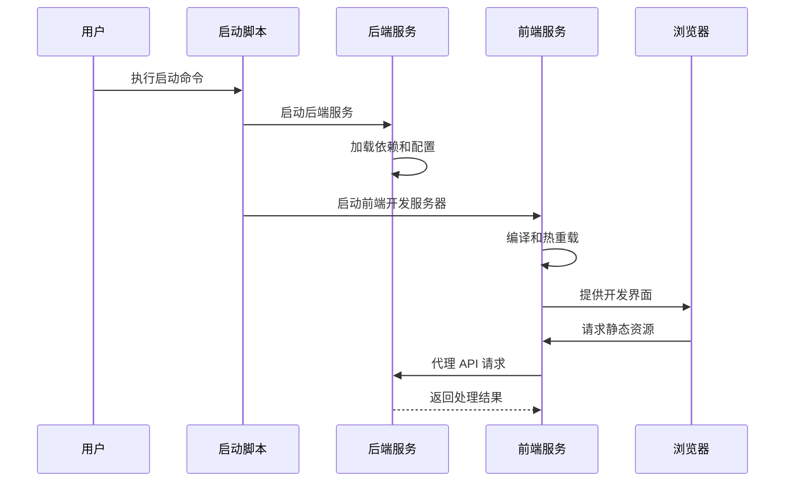

# Vite 开发配置

<cite>
**本文档引用的文件**
- [vite.config.ts](file://vite.config.ts)
- [package.json](file://package.json)
- [backend/main.py](file://backend/main.py)
- [src/utils/api.ts](file://src/utils/api.ts)
- [src/store.ts](file://src/store.ts)
- [src/components/EditorScreen.tsx](file://src/screens/EditorScreen.tsx)
- [src/components/MaterialDrawer.tsx](file://src/components/MaterialDrawer.tsx)
- [src/utils/canvas.ts](file://src/utils/canvas.ts)
- [start.bat](file://start.bat)
- [tsconfig.json](file://tsconfig.json)
- [tailwind.config.js](file://tailwind.config.js)
- [postcss.config.js](file://postcss.config.js)
</cite>

## 目录
1. [简介](#简介)
2. [项目结构](#项目结构)
3. [核心组件](#核心组件)
4. [架构概览](#架构概览)
5. [详细组件分析](#详细组件分析)
6. [依赖关系分析](#依赖关系分析)
7. [性能考虑](#性能考虑)
8. [故障排除指南](#故障排除指南)
9. [结论](#结论)

## 简介

这是一个基于 Vite 的现代前端开发配置项目，专门用于墙面装饰应用的开发。该项目采用前后端分离架构，前端使用 React + TypeScript + Vite 构建，后端使用 Python FastAPI 提供服务端 API。

本项目的核心目标是通过 Vite 开发服务器实现高效的前端开发体验，包括热重载、代理转发、构建优化等功能。配置文件详细定义了开发服务器的各项参数，确保前后端开发环境的无缝集成。

## 项目结构

项目采用模块化的文件组织方式，主要分为以下几个部分：



**图表来源**
- [vite.config.ts:1-48](file://vite.config.ts#L1-L48)
- [package.json:1-27](file://package.json#L1-L27)
- [backend/main.py:1-1227](file://backend/main.py#L1-L1227)

**章节来源**
- [vite.config.ts:1-48](file://vite.config.ts#L1-L48)
- [package.json:1-27](file://package.json#L1-L27)

## 核心组件

### Vite 开发服务器配置

Vite 开发服务器配置文件定义了完整的开发环境设置，包括端口配置、代理规则和插件集成。

#### 主要配置项

| 配置项 | 值 | 说明 |
|--------|-----|------|
| 服务器端口 | 5173 | 开发服务器监听端口 |
| 插件支持 | React 插件 | 支持 JSX 和 TypeScript 编译 |
| 后端地址 | http://localhost:8100 | 后端服务地址 |

#### 代理配置详解

代理配置实现了前端请求到后端 API 的智能转发，支持多路由映射：



**图表来源**
- [vite.config.ts:10-45](file://vite.config.ts#L10-L45)

**章节来源**
- [vite.config.ts:1-48](file://vite.config.ts#L1-L48)

### 前后端 API 接口

前端通过统一的 API 工具类与后端进行通信，支持多种图像处理和材质应用功能。

#### API 功能分类

| 功能类别 | 路由前缀 | 主要方法 | 用途 |
|----------|----------|----------|------|
| 健康检查 | /health | checkHealth() | 服务状态监控 |
| 材质管理 | /api/materials | getMaterials() | 材质库获取 |
| 图像增强 | /enhance | enhanceImage() | 图像质量提升 |
| 蒙版处理 | /process-masks | processMasks() | 区域分割处理 |
| 上传处理 | /process-upload | processUpload() | 统一处理流程 |
| 调试模式 | /debug-segment | debugSegment() | 开发调试功能 |
| 材质应用 | /apply-material | applyMaterial() | 材质贴图应用 |
| 最终合成 | /finalize | finalize() | 最终图像合成 |

**章节来源**
- [src/utils/api.ts:1-200](file://src/utils/api.ts#L1-L200)
- [backend/main.py:545-678](file://backend/main.py#L545-L678)

## 架构概览

项目采用前后端分离的微服务架构，通过 Vite 开发服务器实现本地开发环境的统一管理。



**图表来源**
- [vite.config.ts:8-46](file://vite.config.ts#L8-L46)
- [backend/main.py:31-39](file://backend/main.py#L31-L39)

## 详细组件分析

### 开发服务器配置组件

#### 服务器配置分析

开发服务器配置采用了现代化的开发环境设置，确保开发效率和用户体验。



**图表来源**
- [vite.config.ts:6-47](file://vite.config.ts#L6-L47)

#### 代理规则设计

代理配置遵循 RESTful API 设计原则，支持多种路由模式：

| 路由模式 | 匹配规则 | 目标地址 | 功能说明 |
|----------|----------|----------|----------|
| 前缀匹配 | /api* | http://localhost:8100 | V2 API 路由 |
| 精确匹配 | /health | http://localhost:8100 | 健康检查 |
| 精确匹配 | /enhance | http://localhost:8100 | 图像增强 |
| 精确匹配 | /process-masks | http://localhost:8100 | 蒙版处理 |
| 精确匹配 | /process-upload | http://localhost:8100 | 上传处理 |
| 精确匹配 | /debug-segment | http://localhost:8100 | 调试模式 |
| 精确匹配 | /apply-material | http://localhost:8100 | 材质应用 |
| 精确匹配 | /finalize | http://localhost:8100 | 最终合成 |

**章节来源**
- [vite.config.ts:8-46](file://vite.config.ts#L8-L46)

### 前端状态管理组件

#### Zustand 状态管理

项目使用 Zustand 实现轻量级的状态管理，支持复杂的异步操作和数据流控制。



**图表来源**
- [src/store.ts:40-61](file://src/store.ts#L40-L61)

#### 状态数据结构

| 状态属性 | 类型 | 默认值 | 说明 |
|----------|------|--------|------|
| phase | Phase | 'upload' | 当前处理阶段 |
| originalImage | string | null | 原始图像数据 |
| refinedMask | string | null | 精细化蒙版 |
| rawMask | string | null | 原始蒙版数据 |
| masks | MaskInfo[] | [] | 蒙版信息列表 |
| compositeImage | string | null | 合成后的图像 |
| finalImage | string | null | 最终结果图像 |
| processingRegions | Set<number> | new Set() | 处理中的区域集合 |
| isApplying | boolean | false | 材质应用状态锁 |

**章节来源**
- [src/store.ts:1-177](file://src/store.ts#L1-L177)

### API 通信组件

#### HTTP 请求流程

前端通过统一的 API 工具类与后端进行通信，实现了完整的错误处理和状态管理。



**图表来源**
- [src/utils/api.ts:9-200](file://src/utils/api.ts#L9-L200)

#### 错误处理机制

API 工具类实现了完善的错误处理机制，确保用户友好的错误提示和调试信息。

| 错误类型 | 处理方式 | 用户反馈 |
|----------|----------|----------|
| 网络错误 | 捕获异常并抛出 | 显示网络连接失败 |
| 服务器错误 | 检查响应状态码 | 显示具体错误信息 |
| 超时错误 | 设置超时时间并重试 | 提示请求超时 |
| 数据解析错误 | JSON 解析失败处理 | 显示数据格式错误 |

**章节来源**
- [src/utils/api.ts:21-200](file://src/utils/api.ts#L21-L200)

### 图像处理组件

#### Canvas 渲染系统

项目实现了高性能的 Canvas 渲染系统，支持复杂的图像处理和实时预览功能。



**图表来源**
- [src/utils/canvas.ts:188-200](file://src/utils/canvas.ts#L188-L200)

**章节来源**
- [src/utils/canvas.ts:1-200](file://src/utils/canvas.ts#L1-L200)

## 依赖关系分析

### 技术栈依赖

项目采用现代化的前端技术栈，各组件之间具有清晰的职责划分和依赖关系。

```mermaid
graph TB
subgraph "构建工具链"
A[Vite 6.0.3] --> B[TypeScript 5.6.3]
A --> C[React 插件]
D[Tailwind CSS] --> E[PostCSS]
F[Autoprefixer] --> E
end
subgraph "运行时依赖"
G[React 18.3.1] --> H[React DOM 18.3.1]
I[Zustand 5.0.2] --> J[状态管理]
end
subgraph "开发依赖"
K[@types/react] --> G
L[@types/react-dom] --> H
M[TypeScript] --> B
end
subgraph "后端集成"
N[FastAPI] --> O[Python 3.x]
P[Uvicorn] --> N
end
```

**图表来源**
- [package.json:11-25](file://package.json#L11-L25)

### 启动流程依赖

项目提供了完整的启动脚本，确保前后端服务的协调启动。



**图表来源**
- [start.bat:25-31](file://start.bat#L25-L31)

**章节来源**
- [package.json:1-27](file://package.json#L1-L27)
- [start.bat:1-35](file://start.bat#L1-L35)

## 性能考虑

### 开发服务器优化

Vite 开发服务器在配置中已经实现了多项性能优化措施：

#### 端口配置优化
- 使用 5173 端口避免与其他开发工具冲突
- 支持自定义端口配置适应不同开发环境

#### 代理性能优化
- 批量代理规则减少配置复杂度
- changeOrigin 设置确保正确的 CORS 处理
- 支持通配符路由简化 API 路由管理

### 前端性能优化

#### 构建配置优化
- TypeScript 配置启用严格模式提高代码质量
- 模块解析使用 bundler 提升打包效率
- 禁用 emit 选项减少编译开销

#### 组件性能优化
- Zustand 状态管理减少不必要的重渲染
- Canvas 渲染系统优化图像处理性能
- 二值化蒙版处理提升交互响应速度

### 后端性能考虑

#### API 设计优化
- 分层 API 结构支持渐进式功能扩展
- 异步处理机制支持并发请求
- 缓存策略减少重复计算开销

**章节来源**
- [tsconfig.json:1-22](file://tsconfig.json#L1-L22)
- [tailwind.config.js:1-12](file://tailwind.config.js#L1-L12)

## 故障排除指南

### 常见问题及解决方案

#### 开发服务器无法启动

**问题症状**: Vite 开发服务器启动失败或端口被占用

**可能原因**:
- 端口 5173 已被其他进程占用
- 依赖包安装不完整
- Node.js 版本不兼容

**解决步骤**:
1. 检查端口占用情况：`netstat -ano | findstr :5173`
2. 修改端口配置：在 `vite.config.ts` 中调整 `port` 值
3. 重新安装依赖：执行 `npm ci` 或删除 `node_modules` 后重新安装
4. 检查 Node.js 版本：确保使用推荐版本

#### API 请求失败

**问题症状**: 前端无法连接到后端 API 或收到跨域错误

**可能原因**:
- 后端服务未启动
- 代理配置错误
- CORS 设置问题

**解决步骤**:
1. 确认后端服务状态：访问 `http://localhost:8100/health`
2. 检查代理配置：验证 `vite.config.ts` 中的代理规则
3. 检查 CORS 设置：确认后端已正确配置 CORS 中间件
4. 查看浏览器开发者工具：检查网络请求和错误信息

#### 图像处理性能问题

**问题症状**: 图像处理缓慢或界面卡顿

**可能原因**:
- Canvas 渲染性能不足
- 蒙版数据过大
- 并发处理过多

**优化方案**:
1. 减少同时处理的图像数量
2. 优化 Canvas 渲染算法
3. 实施适当的缓存策略
4. 考虑分批处理大型图像

### 调试技巧

#### 开发者工具使用

**浏览器调试**:
- 使用 React DevTools 检查组件状态
- 利用 Performance 面板分析渲染性能
- 通过 Network 面板监控 API 请求

**后端调试**:
- 启用 FastAPI 调试模式
- 使用 uvicorn 的 --reload 参数自动重启
- 检查后端日志输出

#### 日志和监控

**前端日志**:
- 在 API 调用前后添加日志输出
- 监控状态变化和组件渲染次数
- 记录用户交互行为

**后端日志**:
- 记录请求处理时间和错误信息
- 监控资源使用情况
- 实施适当的日志轮转策略

**章节来源**
- [src/utils/api.ts:9-200](file://src/utils/api.ts#L9-L200)
- [backend/main.py:33-39](file://backend/main.py#L33-L39)

## 结论

本项目展示了现代前端开发的最佳实践，通过精心设计的 Vite 开发配置实现了高效的开发体验。配置文件不仅定义了基本的开发服务器设置，还实现了智能的代理转发机制，确保前后端开发环境的无缝集成。

项目的架构设计体现了模块化和可扩展性的原则，前端使用 React + TypeScript + Vite 构建，后端采用 FastAPI 提供服务，两者通过清晰的 API 接口进行通信。状态管理采用 Zustand 实现轻量级的数据流控制，Canvas 渲染系统提供了高性能的图像处理能力。

通过合理的性能优化和完善的错误处理机制，项目为开发者提供了稳定可靠的开发环境。同时，详细的故障排除指南和调试技巧确保了开发过程中的问题能够快速定位和解决。

未来可以考虑进一步优化的方向包括：实施更精细的缓存策略、增强错误恢复机制、优化大型图像处理性能等。这些改进将进一步提升开发效率和用户体验。