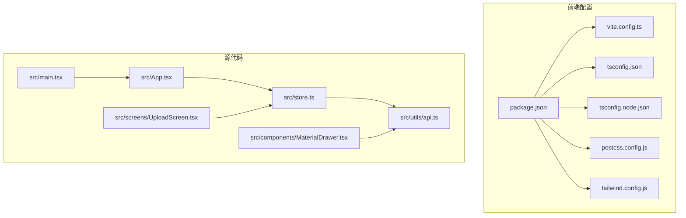
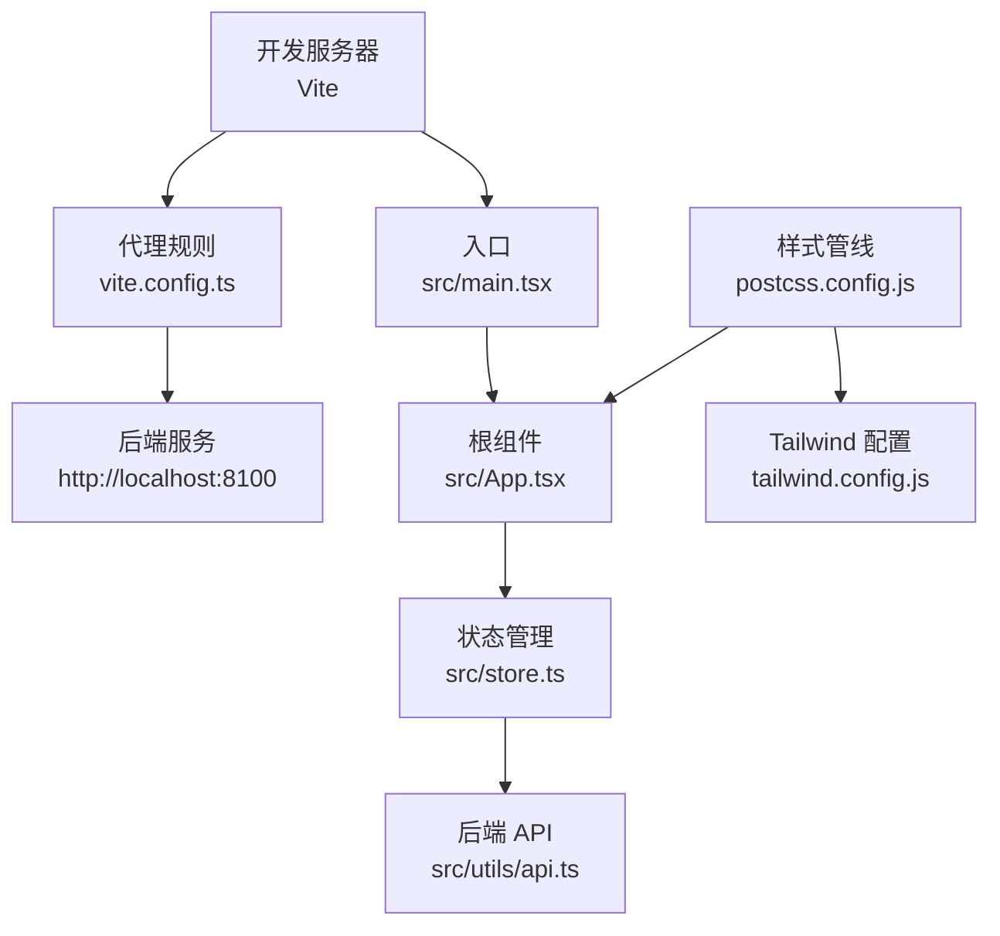
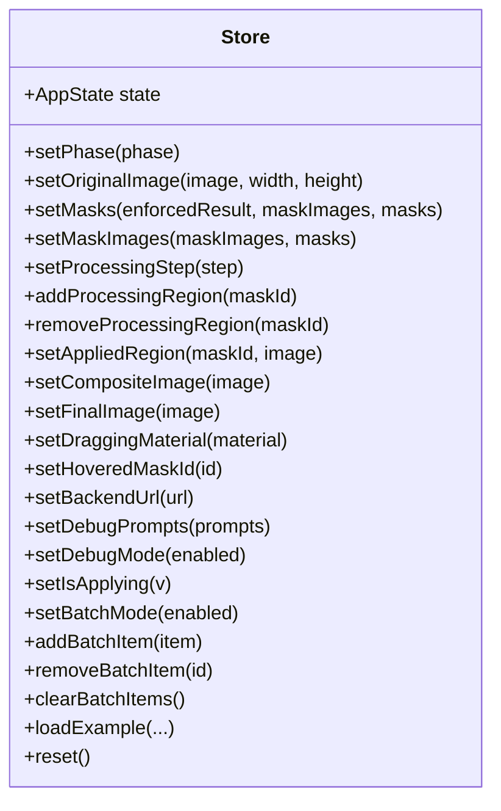
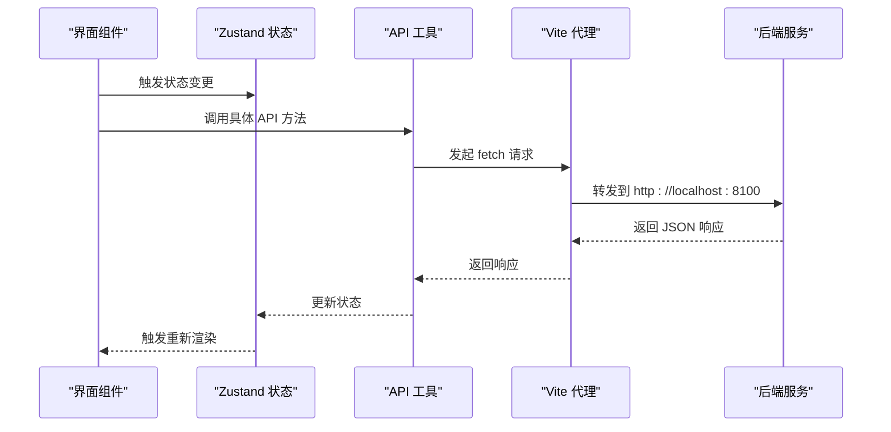
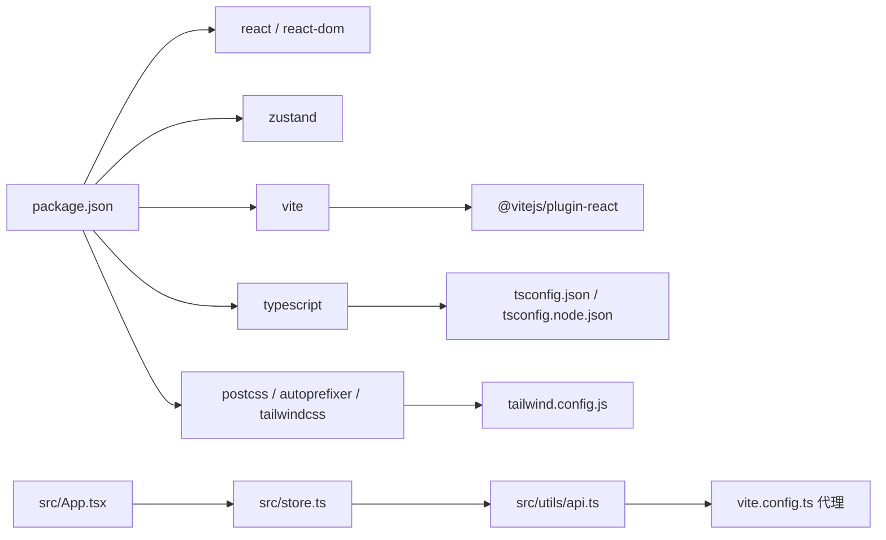

# 包管理与依赖

<cite>
**本文引用的文件**
- [package.json](file://package.json)
- [vite.config.ts](file://vite.config.ts)
- [tsconfig.json](file://tsconfig.json)
- [tsconfig.node.json](file://tsconfig.node.json)
- [postcss.config.js](file://postcss.config.js)
- [tailwind.config.js](file://tailwind.config.js)
- [src/main.tsx](file://src/main.tsx)
- [src/App.tsx](file://src/App.tsx)
- [src/store.ts](file://src/store.ts)
- [src/utils/api.ts](file://src/utils/api.ts)
- [src/components/MaterialDrawer.tsx](file://src/components/MaterialDrawer.tsx)
- [src/screens/UploadScreen.tsx](file://src/screens/UploadScreen.tsx)
- [README.md](file://README.md)
- [docs/frontend-api-guide.md](file://docs/frontend-api-guide.md)
- [backend/requirements.txt](file://backend/requirements.txt)
</cite>

## 目录
1. [引言](#引言)
2. [项目结构](#项目结构)
3. [核心组件](#核心组件)
4. [架构总览](#架构总览)
5. [详细组件分析](#详细组件分析)
6. [依赖关系分析](#依赖关系分析)
7. [性能考量](#性能考量)
8. [故障排查指南](#故障排查指南)
9. [结论](#结论)
10. [附录](#附录)

## 引言
本文件围绕前端项目的包管理与依赖配置展开，系统梳理 package.json 中的依赖分类（生产依赖、开发依赖）、脚本命令、以及前端核心依赖（React、React DOM、Zustand、Tailwind CSS 等）的作用与版本要求。同时结合 Vite、TypeScript、PostCSS 等工具链的配置与使用，给出依赖更新策略、版本兼容性管理与安全审计建议，帮助团队高效维护与演进前端工程。

## 项目结构
前端工程采用模块化组织，核心入口位于 src 目录，构建与开发工具由 Vite 提供，样式由 Tailwind CSS 驱动，状态管理使用 Zustand，类型系统通过 TypeScript 管理。关键配置文件包括 package.json、vite.config.ts、tsconfig.json、tsconfig.node.json、postcss.config.js、tailwind.config.js。

**图表来源**
- [package.json:1-27](file://package.json#L1-L27)
- [vite.config.ts:1-48](file://vite.config.ts#L1-L48)
- [tsconfig.json:1-22](file://tsconfig.json#L1-L22)
- [tsconfig.node.json:1-19](file://tsconfig.node.json#L1-L19)
- [postcss.config.js:1-7](file://postcss.config.js#L1-L7)
- [tailwind.config.js:1-12](file://tailwind.config.js#L1-L12)
- [src/main.tsx:1-11](file://src/main.tsx#L1-L11)
- [src/App.tsx:1-26](file://src/App.tsx#L1-L26)
- [src/store.ts:1-177](file://src/store.ts#L1-L177)
- [src/utils/api.ts:1-197](file://src/utils/api.ts#L1-L197)
- [src/components/MaterialDrawer.tsx:1-136](file://src/components/MaterialDrawer.tsx#L1-L136)
- [src/screens/UploadScreen.tsx:1-121](file://src/screens/UploadScreen.tsx#L1-L121)

**章节来源**
- [package.json:1-27](file://package.json#L1-L27)
- [vite.config.ts:1-48](file://vite.config.ts#L1-L48)
- [tsconfig.json:1-22](file://tsconfig.json#L1-L22)
- [tsconfig.node.json:1-19](file://tsconfig.node.json#L1-L19)
- [postcss.config.js:1-7](file://postcss.config.js#L1-L7)
- [tailwind.config.js:1-12](file://tailwind.config.js#L1-L12)

## 核心组件
- 生产依赖（运行期必需）
  - react、react-dom：前端框架与渲染引擎，版本范围 ^18.3.1，确保与 TypeScript JSX 环境兼容。
  - zustand：轻量状态管理库，用于全局状态与副作用逻辑。
- 开发依赖（构建与开发期必需）
  - @types/react、@types/react-dom：React 类型声明，保障类型安全。
  - @vitejs/plugin-react：Vite 的 React 插件，提供快速热更新与按需编译。
  - postcss、autoprefixer、tailwindcss：样式管线与工具链，支持原子化样式与自动前缀。
  - typescript：类型系统与编译器。
  - vite：开发服务器与打包工具。
- 脚本命令
  - dev：启动 Vite 开发服务器。
  - build：先执行 TypeScript 编译，再执行 Vite 构建。
  - preview：预览构建产物。

上述依赖与脚本在 package.json 中集中定义，保证了开发体验与构建一致性。

**章节来源**
- [package.json:6-25](file://package.json#L6-L25)

## 架构总览
前端工程围绕“入口 -> 组件树 -> 状态管理 -> API 调用”的主干流程运转。Vite 提供开发服务器与代理能力，TypeScript 提供类型约束，Tailwind CSS 提供样式基础，Zustand 管理全局状态，React 负责视图渲染。

**图表来源**
- [vite.config.ts:4-46](file://vite.config.ts#L4-L46)
- [src/main.tsx:1-11](file://src/main.tsx#L1-L11)
- [src/App.tsx:1-26](file://src/App.tsx#L1-L26)
- [src/store.ts:1-177](file://src/store.ts#L1-L177)
- [src/utils/api.ts:1-197](file://src/utils/api.ts#L1-L197)
- [postcss.config.js:1-7](file://postcss.config.js#L1-L7)
- [tailwind.config.js:1-12](file://tailwind.config.js#L1-L12)

## 详细组件分析

### 依赖分类与作用
- 生产依赖
  - react、react-dom：提供组件模型与 DOM 渲染能力，版本 ^18.3.1 与 TypeScript JSX 环境兼容。
  - zustand：提供轻量状态容器，封装全局状态与副作用逻辑，减少样板代码。
- 开发依赖
  - @types/react、@types/react-dom：提供 React 类型定义，提升开发体验与类型安全。
  - @vitejs/plugin-react：启用 React 快速刷新与按需编译，加速开发迭代。
  - postcss、autoprefixer、tailwindcss：构建样式管线，自动添加浏览器前缀并支持原子化类名。
  - typescript：统一的类型系统与编译器，配合 tsconfig.json 实现严格模式与模块解析。
  - vite：开发服务器、代理与打包工具，支撑 dev/build/preview 生命周期。

**章节来源**
- [package.json:11-25](file://package.json#L11-L25)

### TypeScript 配置与使用
- tsconfig.json
  - 目标与模块：ES2020 与 ESNext，配合 bundler 模块解析。
  - JSX：react-jsx，适配 React 组件。
  - 严格模式：开启严格检查与未使用变量/参数警告。
  - 引用：通过 references 指向 tsconfig.node.json。
- tsconfig.node.json
  - 专用于 Vite 配置文件的类型检查，采用 ESNext 与 bundler 解析，确保 vite.config.ts 的类型安全。

这些配置确保了前端代码在开发与构建阶段的一致性与安全性。

**章节来源**
- [tsconfig.json:1-22](file://tsconfig.json#L1-L22)
- [tsconfig.node.json:1-19](file://tsconfig.node.json#L1-L19)

### Vite 配置与代理
- 代理目标：http://localhost:8100（后端服务地址）。
- 代理路由：
  - /api：v2 API 路由。
  - /health、/enhance、/process-masks、/process-upload、/debug-segment、/apply-material、/finalize：传统或工具路由。
- 代理行为：changeOrigin 为 true，便于跨域转发与后端鉴权。

该配置使前端开发时可直接调用后端接口，无需额外 CORS 设置。

**章节来源**
- [vite.config.ts:4-46](file://vite.config.ts#L4-L46)

### PostCSS 与 Tailwind CSS
- postcss.config.js：启用 tailwindcss 与 autoprefixer 插件，自动注入 Tailwind 指令并添加浏览器前缀。
- tailwind.config.js：content 指向 HTML 与 src 下的 TSX 文件，确保仅生成实际使用的样式；theme 与 plugins 保持默认。

两者协同工作，提供高效的原子化样式开发体验。

**章节来源**
- [postcss.config.js:1-7](file://postcss.config.js#L1-L7)
- [tailwind.config.js:1-12](file://tailwind.config.js#L1-L12)

### Zustand 状态管理
- store.ts 使用 create 创建状态容器，包含：
  - 全局状态字段（如 phase、originalImage、dimensions、masks、batchItems 等）。
  - 行为方法（如 setPhase、setOriginalImage、setMasks、addBatchItem、removeBatchItem、clearBatchItems、loadExample、reset 等）。
  - 本地存储集成（backendUrl、debugPrompts、debugMode）。
- 组件通过 useStore 访问状态与方法，实现松耦合的数据流。

**图表来源**
- [src/store.ts:1-177](file://src/store.ts#L1-L177)

**章节来源**
- [src/store.ts:1-177](file://src/store.ts#L1-L177)

### API 调用与后端对接
- src/utils/api.ts 封装了与后端的交互，包括健康检查、材质列表、预处理、增强、蒙版处理、渲染、最终优化等接口。
- 通过 setBackendUrl 动态设置后端地址，配合 Vite 代理在开发环境进行转发。
- 文档化的接口规范与并发控制建议，确保前端与后端协作稳定。

**图表来源**
- [src/utils/api.ts:1-197](file://src/utils/api.ts#L1-L197)
- [vite.config.ts:4-46](file://vite.config.ts#L4-L46)

**章节来源**
- [src/utils/api.ts:1-197](file://src/utils/api.ts#L1-L197)
- [docs/frontend-api-guide.md:1-120](file://docs/frontend-api-guide.md#L1-L120)

### 组件与样式使用
- MaterialDrawer、UploadScreen 等组件广泛使用 Tailwind CSS 类名，体现原子化样式的简洁与可维护性。
- 组件通过 React Hooks 与 Zustand 状态交互，形成清晰的单向数据流。

**章节来源**
- [src/components/MaterialDrawer.tsx:1-136](file://src/components/MaterialDrawer.tsx#L1-L136)
- [src/screens/UploadScreen.tsx:1-121](file://src/screens/UploadScreen.tsx#L1-L121)

## 依赖关系分析
- 低耦合高内聚：组件通过 store 与 API 间接依赖，避免直接耦合后端细节。
- 明确的职责边界：Vite 负责开发与构建，TypeScript 负责类型约束，Tailwind CSS 负责样式，Zustand 负责状态，React 负责视图。
- 代理与网络：Vite 代理将前端请求转发至后端，简化开发环境下的跨域问题。

**图表来源**
- [package.json:11-25](file://package.json#L11-L25)
- [vite.config.ts:1-48](file://vite.config.ts#L1-L48)
- [tsconfig.json:1-22](file://tsconfig.json#L1-L22)
- [tsconfig.node.json:1-19](file://tsconfig.node.json#L1-L19)
- [postcss.config.js:1-7](file://postcss.config.js#L1-L7)
- [tailwind.config.js:1-12](file://tailwind.config.js#L1-L12)
- [src/App.tsx:1-26](file://src/App.tsx#L1-L26)
- [src/store.ts:1-177](file://src/store.ts#L1-L177)
- [src/utils/api.ts:1-197](file://src/utils/api.ts#L1-L197)

**章节来源**
- [package.json:11-25](file://package.json#L11-L25)
- [vite.config.ts:1-48](file://vite.config.ts#L1-L48)
- [tsconfig.json:1-22](file://tsconfig.json#L1-L22)
- [tsconfig.node.json:1-19](file://tsconfig.node.json#L1-L19)
- [postcss.config.js:1-7](file://postcss.config.js#L1-L7)
- [tailwind.config.js:1-12](file://tailwind.config.js#L1-L12)
- [src/App.tsx:1-26](file://src/App.tsx#L1-L26)
- [src/store.ts:1-177](file://src/store.ts#L1-L177)
- [src/utils/api.ts:1-197](file://src/utils/api.ts#L1-L197)

## 性能考量
- 构建与开发效率
  - Vite 的快速冷启动与热更新显著缩短开发等待时间。
  - TypeScript 的严格模式与 noUnused* 检查有助于早期发现潜在问题。
- 样式体积
  - Tailwind content 范围明确，避免生成未使用样式，降低产物体积。
  - Autoprefixer 自动添加必要前缀，兼顾兼容性与体积。
- 状态与渲染
  - Zustand 的细粒度状态更新减少不必要的重渲染。
  - 组件按需加载与懒加载策略可进一步优化首屏性能。

[本节为通用指导，不直接分析具体文件，故无“章节来源”]

## 故障排查指南
- 启动失败
  - 检查 Node.js 版本是否满足要求（README 指明 Node.js 18+）。
  - 确认 package.json 中依赖安装完成（npm install）。
- 代理无效
  - 确认 vite.config.ts 中代理目标地址与后端实际监听地址一致。
  - 检查 /health 接口是否可达，以验证后端服务状态。
- 样式异常
  - 确认 tailwind.config.js 的 content 路径包含当前组件文件。
  - 检查 postcss.config.js 是否正确启用 tailwindcss 与 autoprefixer。
- 类型错误
  - 检查 tsconfig.json 与 tsconfig.node.json 的 compilerOptions 是否符合当前工具链版本。
  - 确保 @types/react 与 @types/react-dom 版本与 React 主版本匹配。

**章节来源**
- [README.md:17-23](file://README.md#L17-L23)
- [vite.config.ts:4-46](file://vite.config.ts#L4-L46)
- [tailwind.config.js:1-12](file://tailwind.config.js#L1-L12)
- [postcss.config.js:1-7](file://postcss.config.js#L1-L7)
- [tsconfig.json:1-22](file://tsconfig.json#L1-L22)
- [tsconfig.node.json:1-19](file://tsconfig.node.json#L1-L19)

## 结论
本项目通过清晰的依赖分类、完善的工具链配置与合理的架构设计，实现了高效、可维护的前端工程。生产依赖聚焦于 React 生态与状态管理，开发依赖覆盖构建、类型与样式管线。配合 Vite 代理与 Tailwind CSS，开发体验与产物质量得到双重保障。建议持续关注依赖版本更新与安全审计，确保长期稳定性。

[本节为总结性内容，不直接分析具体文件，故无“章节来源”]

## 附录

### 依赖更新策略
- 生产依赖
  - 采用语义化版本范围（^），优先小版本与补丁升级，避免破坏性变更。
  - 升级前执行端到端测试，确保与后端接口与 UI 流程兼容。
- 开发依赖
  - 优先升级 Vite、TypeScript、Tailwind CSS 等核心工具链，保持生态一致性。
  - 逐步验证插件与配置（如 @vitejs/plugin-react、postcss 插件）的兼容性。
- 版本锁定
  - 使用 package-lock.json 固定依赖树，避免 CI 环境差异。

[本节为通用指导，不直接分析具体文件，故无“章节来源”]

### 版本兼容性管理
- React 与 React DOM：保持主版本一致，避免 JSX 与类型不匹配。
- TypeScript：与 React 类型声明版本匹配，确保 JSX 与模块解析策略一致。
- Vite：与 @vitejs/plugin-react 版本匹配，避免热更新与编译异常。
- Tailwind CSS：与 postcss、autoprefixer 版本兼容，确保 content 范围与生成样式一致。

[本节为通用指导，不直接分析具体文件，故无“章节来源”]

### 安全审计建议
- 定期扫描依赖漏洞（如 npm audit 或 Snyk），优先修复高危与严重级别问题。
- 关注第三方包的活跃度与维护状态，避免使用已弃坑或存在安全风险的包。
- 在 CI 中加入安全扫描步骤，确保新引入的依赖不会带来安全风险。

[本节为通用指导，不直接分析具体文件，故无“章节来源”]