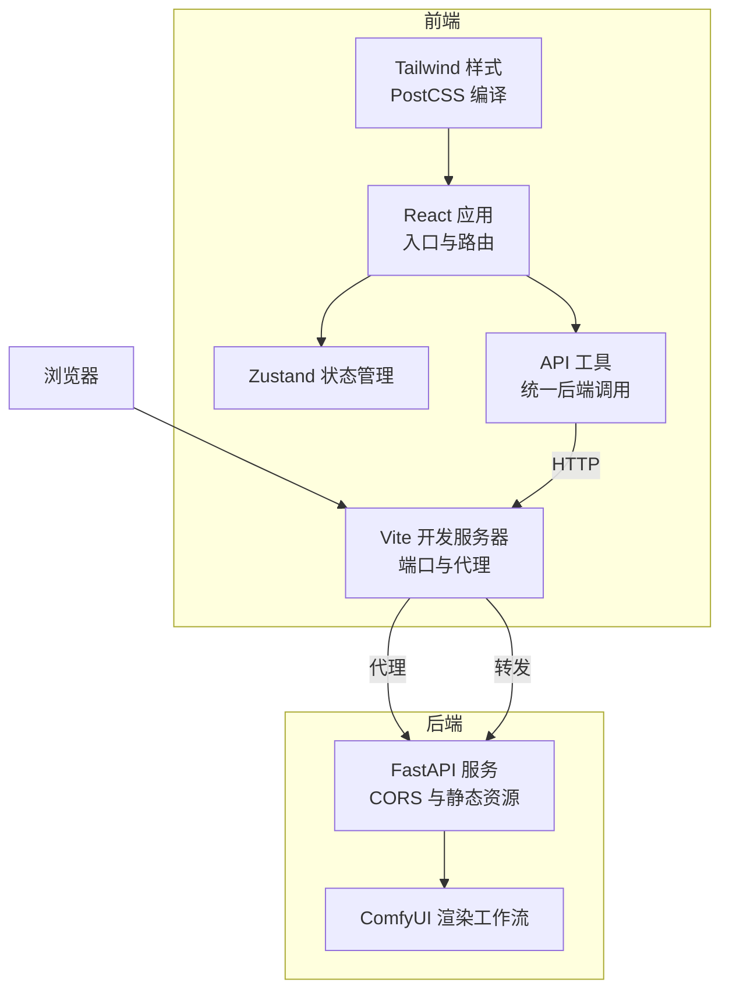
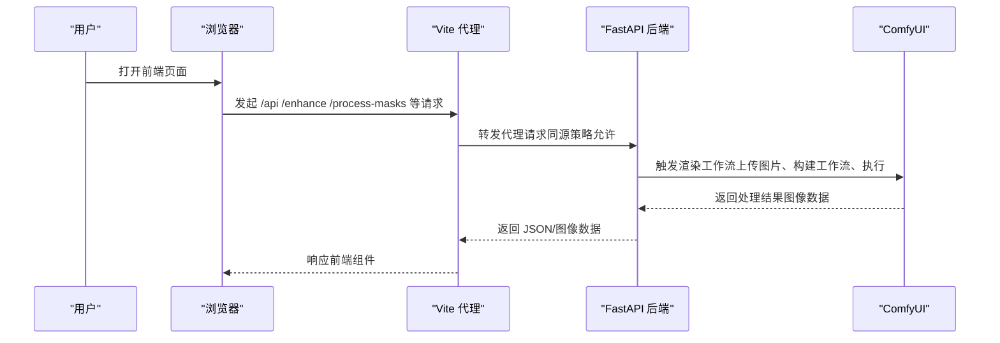
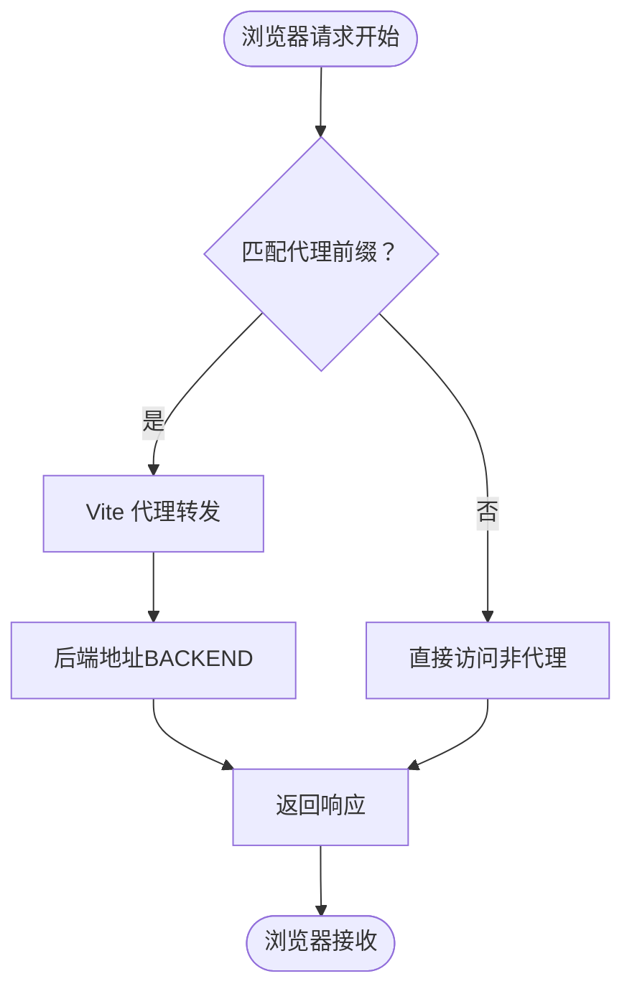
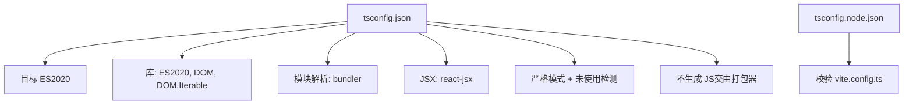
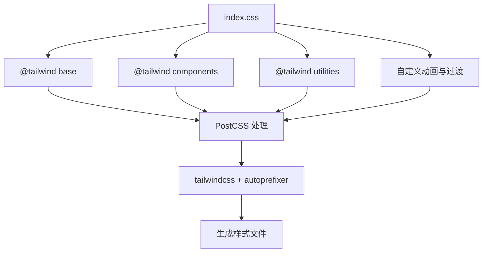
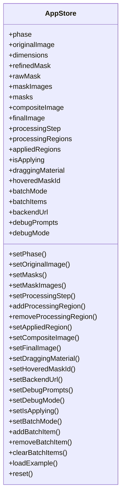
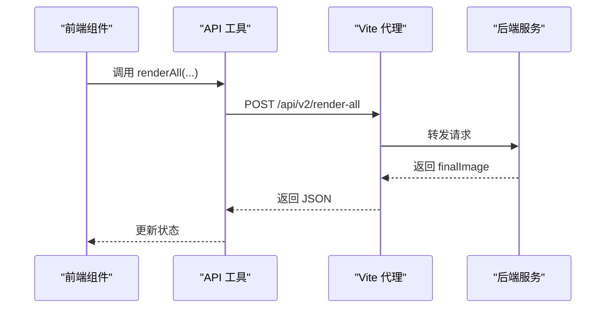
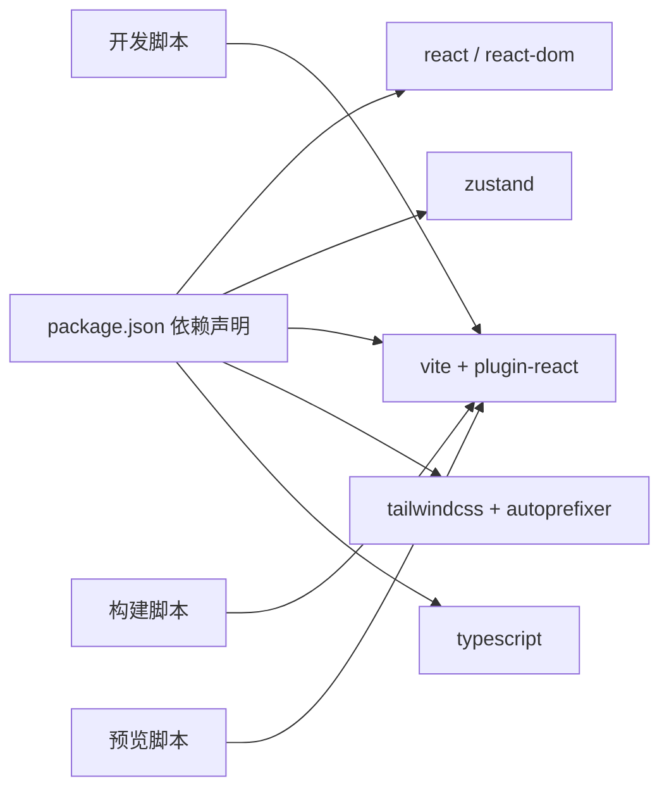

# 开发工具与配置

<cite>
**本文引用的文件**
- [vite.config.ts](file://vite.config.ts)
- [tsconfig.json](file://tsconfig.json)
- [tsconfig.node.json](file://tsconfig.node.json)
- [tailwind.config.js](file://tailwind.config.js)
- [postcss.config.js](file://postcss.config.js)
- [package.json](file://package.json)
- [src/index.css](file://src/index.css)
- [src/main.tsx](file://src/main.tsx)
- [src/App.tsx](file://src/App.tsx)
- [src/store.ts](file://src/store.ts)
- [src/utils/api.ts](file://src/utils/api.ts)
- [src/types.ts](file://src/types.ts)
- [backend/main.py](file://backend/main.py)
- [start.bat](file://start.bat)
- [backend/start.bat](file://backend/start.bat)
- [README.md](file://README.md)
</cite>

## 目录
1. [简介](#简介)
2. [项目结构](#项目结构)
3. [核心组件](#核心组件)
4. [架构总览](#架构总览)
5. [详细组件分析](#详细组件分析)
6. [依赖关系分析](#依赖关系分析)
7. [性能考虑](#性能考虑)
8. [故障排查指南](#故障排查指南)
9. [结论](#结论)
10. [附录](#附录)

## 简介
本文件面向 WallChanger 项目的前端开发与配置，系统性梳理并文档化以下方面：
- Vite 开发服务器配置：端口、代理规则、跨域与热重载机制
- TypeScript 编译配置：目标版本、模块解析、严格模式与类型检查策略
- Tailwind CSS 与 PostCSS 配置：内容扫描、插件链与样式编译流程
- 开发调试技巧：网络请求代理、日志与计时、断点与性能分析
- 构建与部署：构建脚本、打包产物与一键启动流程
- CI/CD 最佳实践：脚本化启动、前后端分离与健康检查

## 项目结构
前端采用 React + TypeScript + Vite + Tailwind CSS 技术栈，使用 Zustand 管理全局状态；后端为 Python FastAPI 服务，提供图像处理与渲染接口。开发时通过 Vite 代理将前端请求转发至后端。

图表来源
- [vite.config.ts:1-48](file://vite.config.ts#L1-L48)
- [src/main.tsx:1-11](file://src/main.tsx#L1-L11)
- [src/App.tsx:1-26](file://src/App.tsx#L1-L26)
- [src/store.ts:1-177](file://src/store.ts#L1-L177)
- [src/utils/api.ts:1-200](file://src/utils/api.ts#L1-L200)
- [backend/main.py:1-200](file://backend/main.py#L1-L200)

章节来源
- [README.md:1-91](file://README.md#L1-L91)
- [package.json:1-27](file://package.json#L1-L27)

## 核心组件
- Vite 开发服务器：定义开发端口与多条 API 代理规则，实现前端对后端的无缝联调
- TypeScript 编译器：严格模式、模块解析策略与 noEmit 策略，确保类型安全与构建效率
- Tailwind CSS：内容扫描路径与默认主题扩展，结合 PostCSS 自动前缀与按需生成
- Zustand 状态：集中管理图像、蒙版、批次渲染与调试参数，并持久化部分用户偏好
- API 工具：封装后端接口调用，统一错误处理与日志输出，支持 v2 接口与传统路由

章节来源
- [vite.config.ts:1-48](file://vite.config.ts#L1-L48)
- [tsconfig.json:1-22](file://tsconfig.json#L1-L22)
- [tsconfig.node.json:1-19](file://tsconfig.node.json#L1-L19)
- [tailwind.config.js:1-12](file://tailwind.config.js#L1-L12)
- [postcss.config.js:1-7](file://postcss.config.js#L1-L7)
- [src/store.ts:1-177](file://src/store.ts#L1-L177)
- [src/utils/api.ts:1-200](file://src/utils/api.ts#L1-L200)

## 架构总览
下图展示前端与后端交互的关键路径：浏览器通过 Vite 代理访问后端 API，后端再调用 ComfyUI 执行渲染工作流。

图表来源
- [vite.config.ts:8-46](file://vite.config.ts#L8-L46)
- [backend/main.py:1-200](file://backend/main.py#L1-L200)
- [src/utils/api.ts:1-200](file://src/utils/api.ts#L1-L200)

## 详细组件分析

### Vite 开发服务器配置
- 端口与热重载：开发端口固定，浏览器访问 localhost:5173；Vite 提供快速热更新能力
- 代理规则：将 /api、/health、/enhance、/process-masks、/process-upload、/debug-segment、/apply-material、/finalize 等路径转发至后端地址
- 变更源：开启 changeOrigin，避免 CORS 限制导致的跨域问题
- 适用场景：本地联调、移动端通过本机 IP 访问前端时，代理同样生效

图表来源
- [vite.config.ts:8-46](file://vite.config.ts#L8-L46)

章节来源
- [vite.config.ts:1-48](file://vite.config.ts#L1-L48)
- [README.md:70-76](file://README.md#L70-L76)

### TypeScript 配置
- 编译目标与库：目标 ES2020，库包含 DOM/DOM.Iterable，适配现代浏览器与 React 生态
- 模块解析：bundler 解析，利于打包器按需处理模块
- 类与 JSX：类字段使用 define，JSX 采用 react-jsx，保持与 React 插件一致
- 严格模式：启用严格模式与未使用检测，减少潜在错误
- 独立编译：noEmit 由打包器负责 emit，提升构建速度
- 参考配置：tsconfig.node.json 用于 Vite 配置文件的类型检查

图表来源
- [tsconfig.json:1-22](file://tsconfig.json#L1-L22)
- [tsconfig.node.json:1-19](file://tsconfig.node.json#L1-L19)

章节来源
- [tsconfig.json:1-22](file://tsconfig.json#L1-L22)
- [tsconfig.node.json:1-19](file://tsconfig.node.json#L1-L19)

### Tailwind CSS 与 PostCSS 配置
- 内容扫描：扫描 HTML 与 src 下所有 JS/TS/JSX/TSX 文件，确保按需生成样式
- 主题扩展：当前为空扩展，便于后续自定义主题变量或组件
- 插件链：启用 tailwindcss 与 autoprefixer，自动补全浏览器前缀
- 样式入口：在 index.css 中引入三段基础、组件与工具类，并自定义动画与过渡

图表来源
- [tailwind.config.js:1-12](file://tailwind.config.js#L1-L12)
- [postcss.config.js:1-7](file://postcss.config.js#L1-L7)
- [src/index.css:1-38](file://src/index.css#L1-L38)

章节来源
- [tailwind.config.js:1-12](file://tailwind.config.js#L1-L12)
- [postcss.config.js:1-7](file://postcss.config.js#L1-L7)
- [src/index.css:1-38](file://src/index.css#L1-L38)

### Zustand 状态管理
- 全局状态：包含图像、蒙版、批次项、调试参数与当前阶段
- 行为方法：提供切换阶段、设置图像与尺寸、管理处理步骤、记录已应用区域、批量操作与调试开关
- 数据持久化：后端地址、调试提示词与调试模式存储于本地存储，刷新后保留
- 重置逻辑：支持重置到初始状态，同时保留用户偏好

图表来源
- [src/store.ts:1-177](file://src/store.ts#L1-L177)
- [src/types.ts:1-89](file://src/types.ts#L1-L89)

章节来源
- [src/store.ts:1-177](file://src/store.ts#L1-L177)
- [src/types.ts:1-89](file://src/types.ts#L1-L89)

### API 工具与后端集成
- 统一后端地址：通过 setBackendUrl 设置，所有接口基于该地址拼接
- 接口覆盖：健康检查、材质列表、预处理、增强、蒙版处理、上传处理、调试分割、材质应用、最终合成、v2 渲染与批量渲染
- 错误处理：对非 OK 响应抛出错误，打印状态码与响应体，便于定位问题
- 性能观测：批量渲染接口内含计时日志，便于评估网络与后端耗时

图表来源
- [src/utils/api.ts:109-139](file://src/utils/api.ts#L109-L139)
- [vite.config.ts:12-15](file://vite.config.ts#L12-L15)
- [backend/main.py:1-200](file://backend/main.py#L1-L200)

章节来源
- [src/utils/api.ts:1-200](file://src/utils/api.ts#L1-L200)
- [backend/main.py:1-200](file://backend/main.py#L1-L200)

### 构建与部署脚本
- 开发脚本：npm run dev 启动 Vite 开发服务器
- 构建脚本：先 tsc 校验类型，再 vite build 产出静态资源
- 预览脚本：vite preview 本地预览生产包
- 一键启动：Windows 批处理脚本自动启动后端与前端，便于快速联调

章节来源
- [package.json:6-10](file://package.json#L6-L10)
- [start.bat:1-36](file://start.bat#L1-L36)
- [backend/start.bat:1-3](file://backend/start.bat#L1-L3)

## 依赖关系分析
- 前端依赖：React、React DOM、Zustand、Vite、@vitejs/plugin-react、Tailwind CSS、Autoprefixer、TypeScript
- 开发依赖：上述 + Vite
- 运行时：浏览器运行 React 应用，Vite 提供开发与构建能力

图表来源
- [package.json:11-25](file://package.json#L11-L25)
- [package.json:6-10](file://package.json#L6-L10)

章节来源
- [package.json:1-27](file://package.json#L1-L27)

## 性能考虑
- 代理与网络：合理设置代理前缀，避免不必要的跨域与额外跳转
- 样式体积：Tailwind 按需扫描，仅生成实际使用的类，减少 CSS 体积
- 类型检查：严格模式与未使用检测有助于早期发现冗余与潜在问题
- 构建优化：noEmit 由打包器处理，避免重复编译；生产构建时注意压缩与缓存策略
- 调试计时：批量渲染接口内置计时日志，便于定位瓶颈

## 故障排查指南
- 后端未启动：确认后端服务监听 8100 端口，CORS 已允许
- 代理失败：检查 Vite 代理前缀是否与后端接口一致，changeOrigin 是否开启
- 图像加载异常：确认后端静态资源挂载路径与前端访问 URL
- 批量渲染超时：查看控制台计时日志，评估网络与后端处理耗时
- 环境变量：后端依赖 .env 配置，确保 API Key 与模型路径正确

章节来源
- [backend/main.py:33-39](file://backend/main.py#L33-L39)
- [vite.config.ts:10-44](file://vite.config.ts#L10-L44)
- [src/utils/api.ts:124-131](file://src/utils/api.ts#L124-L131)

## 结论
本项目在前端侧采用现代化工具链，通过 Vite 代理实现前后端联调，借助 TypeScript 保障类型安全，Tailwind CSS 与 PostCSS 实现高效样式开发。配合 Zustand 管理复杂状态与 API 工具封装后端接口，形成清晰的开发与调试体系。建议在 CI/CD 中沿用现有脚本与构建流程，确保一致性与可维护性。

## 附录
- 启动流程：使用一键启动脚本同时启动后端与前端，便于联调与演示
- 访问方式：本地访问前端地址，移动端通过本机 IP 访问前端，代理自动生效

章节来源
- [start.bat:25-31](file://start.bat#L25-L31)
- [README.md:70-76](file://README.md#L70-L76)