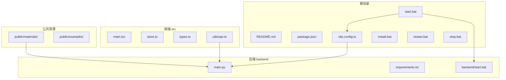
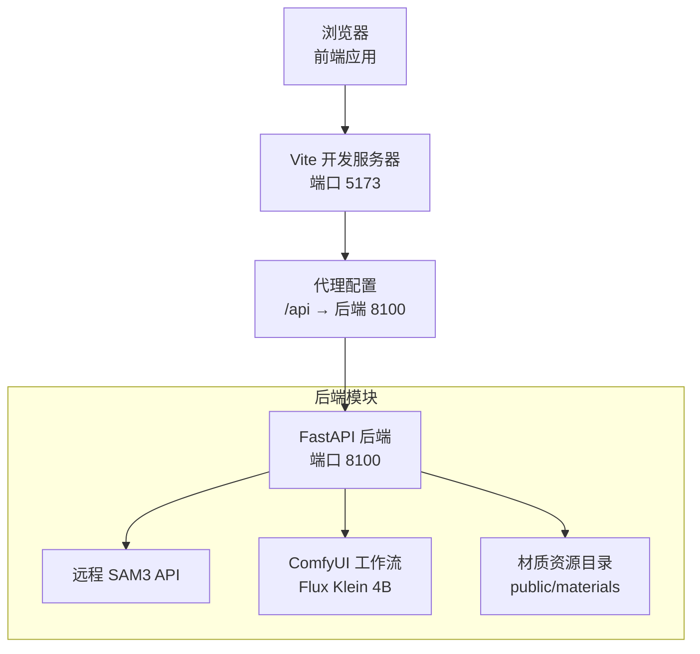
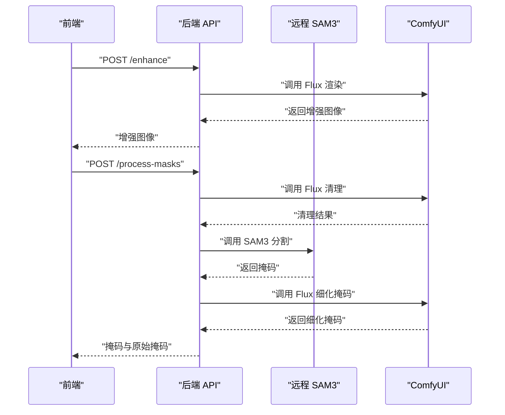
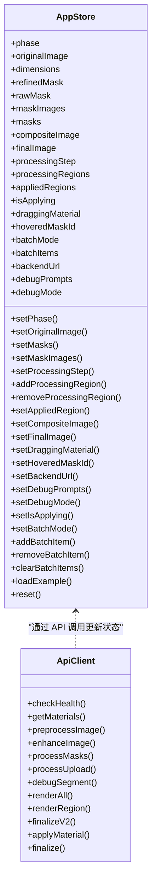
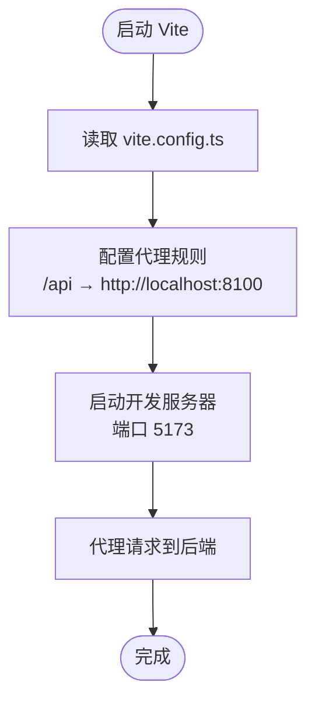
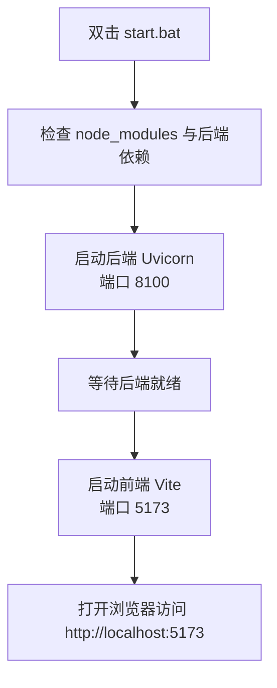
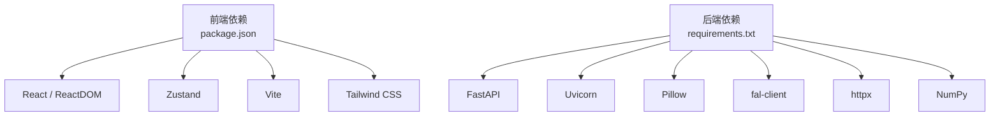

# 快速开始

<cite>
**本文引用的文件**
- [README.md](file://README.md)
- [package.json](file://package.json)
- [backend/requirements.txt](file://backend/requirements.txt)
- [install.bat](file://install.bat)
- [start.bat](file://start.bat)
- [restart.bat](file://restart.bat)
- [stop.bat](file://stop.bat)
- [backend/start.bat](file://backend/start.bat)
- [backend/main.py](file://backend/main.py)
- [vite.config.ts](file://vite.config.ts)
- [src/utils/api.ts](file://src/utils/api.ts)
- [src/store.ts](file://src/store.ts)
- [src/types.ts](file://src/types.ts)
- [src/main.tsx](file://src/main.tsx)
</cite>

## 目录
1. [简介](#简介)
2. [项目结构](#项目结构)
3. [核心组件](#核心组件)
4. [架构总览](#架构总览)
5. [详细组件分析](#详细组件分析)
6. [依赖关系分析](#依赖关系分析)
7. [性能考虑](#性能考虑)
8. [故障排除指南](#故障排除指南)
9. [结论](#结论)
10. [附录](#附录)

## 简介
WallChanger 是一个室内材质替换的 AI 应用，支持本地运行。通过上传室内照片，AI 自动识别墙面、地板、天花板等区域，用户可拖拽材质球到对应区域进行材质替换，并一键生成最终渲染效果。

- 技术栈：后端 Python FastAPI + SAM3 + Flux Klein 4B API；前端 React + TypeScript + Vite + Tailwind CSS + Zustand
- 环境要求：Python 3.9+、Node.js 18+、本地已部署 SAM3（路径见环境变量）、FAL API Key
- 启动方式：一键启动或分别启动后端与前端

**章节来源**
- [README.md:1-91](file://README.md#L1-L91)

## 项目结构
项目采用前后端分离架构，根目录包含前端源码、构建配置与启动脚本，backend 目录包含后端服务与依赖，public 目录存放材质资源与示例。

**图表来源**
- [README.md:1-91](file://README.md#L1-L91)
- [package.json:1-27](file://package.json#L1-L27)
- [vite.config.ts:1-48](file://vite.config.ts#L1-L48)
- [backend/main.py:1-800](file://backend/main.py#L1-L800)

**章节来源**
- [README.md:1-91](file://README.md#L1-L91)
- [package.json:1-27](file://package.json#L1-L27)
- [vite.config.ts:1-48](file://vite.config.ts#L1-L48)
- [backend/main.py:1-800](file://backend/main.py#L1-L800)

## 核心组件
- 后端服务（FastAPI）：提供健康检查、增强图像、处理掩码、应用材质、最终合成等接口；集成远程 SAM3 API 与 ComfyUI 工作流调用
- 前端应用（React + Zustand）：负责用户交互、状态管理、与后端 API 通信、代理转发请求至后端
- 构建与开发服务器（Vite）：本地开发服务器监听 5173 端口，代理转发 /api 与部分工具路由到后端 8100 端口
- 启动脚本：一键安装与启动，分别启动后端与前端，提供重启与停止脚本

**章节来源**
- [backend/main.py:545-776](file://backend/main.py#L545-L776)
- [src/utils/api.ts:1-200](file://src/utils/api.ts#L1-L200)
- [vite.config.ts:4-47](file://vite.config.ts#L4-L47)
- [install.bat:1-63](file://install.bat#L1-L63)
- [start.bat:1-36](file://start.bat#L1-L36)

## 架构总览
系统采用前后端分离模式：前端通过 Vite 代理访问后端 API；后端负责图像处理与模型推理，使用远程 SAM3 API 进行分割，使用 ComfyUI 执行 Flux Klein 渲染工作流。

**图表来源**
- [vite.config.ts:4-47](file://vite.config.ts#L4-L47)
- [backend/main.py:18-48](file://backend/main.py#L18-L48)
- [README.md:17-22](file://README.md#L17-L22)

**章节来源**
- [vite.config.ts:4-47](file://vite.config.ts#L4-L47)
- [backend/main.py:18-48](file://backend/main.py#L18-L48)
- [README.md:17-22](file://README.md#L17-L22)

## 详细组件分析

### 后端服务（FastAPI）
- 关键功能
  - 健康检查：返回后端状态与模型加载状态
  - 图像增强：对输入图像进行轻微模糊后调用 Flux 渲染，用于预览
  - 掩码处理：先清理场景，再调用远程 SAM3 获取掩码，最后细化掩码
  - 材质应用：将材质纹理作为参考，对目标区域进行重绘
  - 最终合成：对合成后的图像进行最终渲染
  - V2 管线：提供 headless 管线，支持批量渲染与区域合成
- 环境变量
  - SAM3_API：远程 SAM3 服务地址
  - COMFYUI_HOST：ComfyUI 服务地址
  - MATERIALS_PATH：材质图片目录（相对路径）
- 静态资源
  - 挂载 /materials 与 /debug-imgs，供前端展示材质缩略图与调试图片

**图表来源**
- [backend/main.py:563-612](file://backend/main.py#L563-L612)
- [backend/main.py:325-359](file://backend/main.py#L325-L359)
- [backend/main.py:79-322](file://backend/main.py#L79-L322)

**章节来源**
- [backend/main.py:545-776](file://backend/main.py#L545-L776)
- [backend/main.py:18-48](file://backend/main.py#L18-L48)

### 前端应用（React + Zustand）
- 状态管理
  - 使用 Zustand 管理应用状态（原图、掩码、合成图、最终图、批次模式等）
  - 支持调试模式与提示词持久化
- API 通信
  - 通过 src/utils/api.ts 封装后端接口调用
  - 支持设置后端地址，便于移动端或局域网访问
- 类型定义
  - src/types.ts 定义了掩码信息、材质、阶段、调试提示词等类型

**图表来源**
- [src/store.ts:1-177](file://src/store.ts#L1-L177)
- [src/utils/api.ts:1-200](file://src/utils/api.ts#L1-L200)
- [src/types.ts:1-89](file://src/types.ts#L1-L89)

**章节来源**
- [src/store.ts:1-177](file://src/store.ts#L1-L177)
- [src/utils/api.ts:1-200](file://src/utils/api.ts#L1-L200)
- [src/types.ts:1-89](file://src/types.ts#L1-L89)

### 构建与开发服务器（Vite 代理）
- 本地开发服务器默认端口 5173
- 代理规则将 /api 与部分工具路由转发到后端 8100 端口
- 便于前端直接调用后端接口，避免跨域问题

**图表来源**
- [vite.config.ts:4-47](file://vite.config.ts#L4-L47)

**章节来源**
- [vite.config.ts:4-47](file://vite.config.ts#L4-L47)

### 启动脚本与生命周期
- install.bat：检测 Node.js 与 Python，安装前端与后端依赖
- start.bat：启动后端（Uvicorn）与前端（Vite），并提示新窗口已启动
- restart.bat：先停止再启动
- stop.bat：结束占用 8100 与 5173 端口的进程

**图表来源**
- [start.bat:1-36](file://start.bat#L1-L36)
- [install.bat:1-63](file://install.bat#L1-L63)

**章节来源**
- [install.bat:1-63](file://install.bat#L1-L63)
- [start.bat:1-36](file://start.bat#L1-L36)
- [restart.bat:1-5](file://restart.bat#L1-L5)
- [stop.bat:1-6](file://stop.bat#L1-L6)

## 依赖关系分析
- 前端依赖：React、React DOM、Zustand、Vite、Tailwind CSS、TypeScript 等
- 后端依赖：FastAPI、Uvicorn、python-dotenv、Pillow、fal-client、httpx、NumPy
- 启动脚本依赖：Windows 批处理命令与本地 Python 环境

**图表来源**
- [package.json:1-27](file://package.json#L1-L27)
- [backend/requirements.txt:1-8](file://backend/requirements.txt#L1-L8)

**章节来源**
- [package.json:1-27](file://package.json#L1-L27)
- [backend/requirements.txt:1-8](file://backend/requirements.txt#L1-L8)

## 性能考虑
- 首次启动后端会加载 SAM3 模型，耗时约 10-30 秒
- 图像处理涉及多步 AI 推理，整体耗时约 1 分钟
- 建议使用 512×512 尺寸的材质图片以获得最佳效果
- 手机端访问需确保与电脑在同一 WiFi，并正确配置后端地址

**章节来源**
- [README.md:86-91](file://README.md#L86-L91)

## 故障排除指南
- 环境未满足
  - 确认已安装 Node.js 18+ 与 Python 3.9+，并在 install.bat 中正确指向 Python 可执行文件
- 后端依赖缺失
  - 若启动时提示后端依赖未安装，请先运行 install.bat
- 端口冲突
  - 如 8100 或 5173 端口被占用，先执行 stop.bat 停止相关进程
- 后端地址不可达
  - 在前端设置中填写电脑本机 IP（例如 http://192.168.1.x:8100），确保手机与电脑在同一网络
- SAM3 或 ComfyUI 不可用
  - 确认远程 SAM3 API 地址与 ComfyUI 主机地址配置正确
- 材质图片未显示
  - 确保材质图片位于 public/materials/ 目录且为 512×512 的 jpg/png/webp

**章节来源**
- [install.bat:10-34](file://install.bat#L10-L34)
- [start.bat:10-23](file://start.bat#L10-L23)
- [stop.bat:1-6](file://stop.bat#L1-L6)
- [README.md:70-76](file://README.md#L70-L76)
- [backend/main.py:18-27](file://backend/main.py#L18-L27)

## 结论
通过本快速开始指南，您可以在本地快速搭建并运行 WallChanger 项目。建议优先使用一键启动方式，若遇到问题可按故障排除指南逐一排查。首次运行可能需要较长时间加载模型与生成结果，请耐心等待。

## 附录

### 环境要求与安装步骤
- 环境要求
  - Python 3.9+
  - Node.js 18+
  - 本地已部署 SAM3（路径见环境变量）
  - FAL API Key
- 安装步骤
  - 后端依赖：在 backend 目录下安装 Python 依赖
  - 前端依赖：在根目录安装 npm 依赖
  - 材质库：将 512×512 的材质图片放入 public/materials/
- 启动方式
  - 一键启动：双击 start.bat
  - 分别启动：终端 1 启动后端，终端 2 启动前端

**章节来源**
- [README.md:17-50](file://README.md#L17-L50)
- [install.bat:37-56](file://install.bat#L37-L56)
- [start.bat:25-31](file://start.bat#L25-L31)