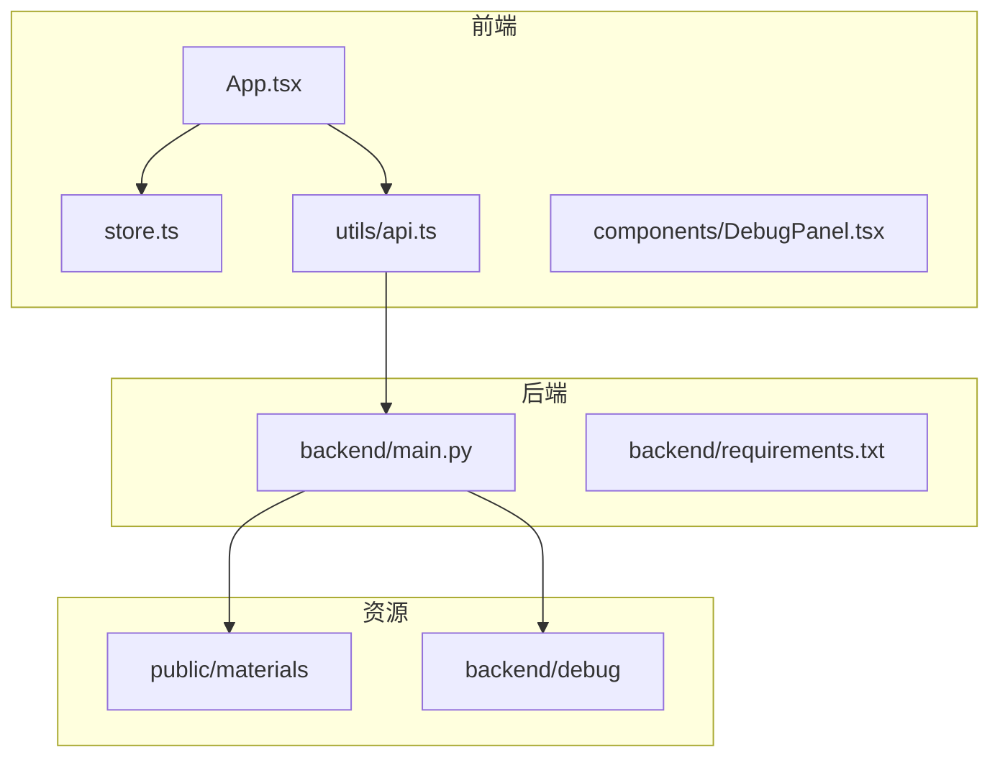
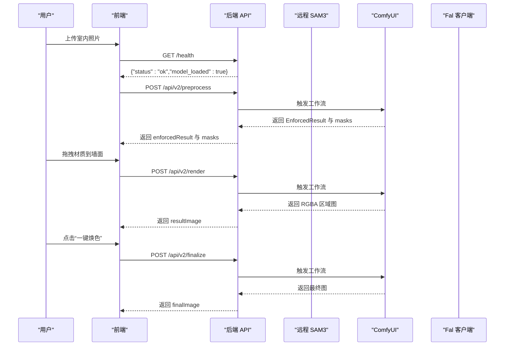
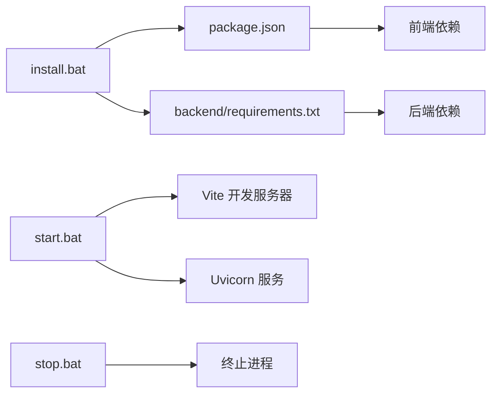
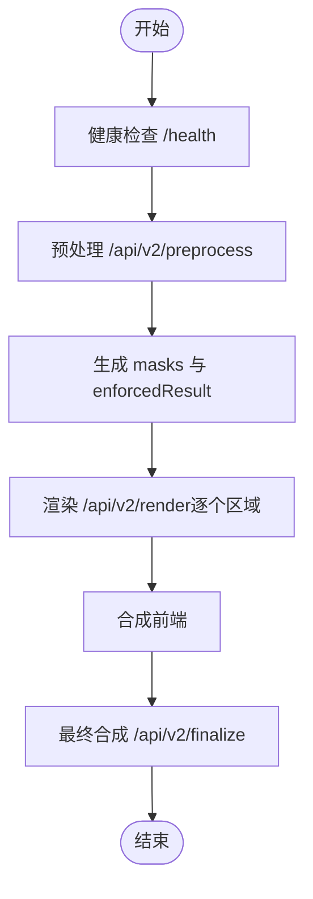

# 故障排除

<cite>
**本文引用的文件**
- [README.md](file://README.md)
- [package.json](file://package.json)
- [backend/main.py](file://backend/main.py)
- [backend/requirements.txt](file://backend/requirements.txt)
- [src/components/DebugPanel.tsx](file://src/components/DebugPanel.tsx)
- [src/utils/api.ts](file://src/utils/api.ts)
- [src/types.ts](file://src/types.ts)
- [src/store.ts](file://src/store.ts)
- [src/App.tsx](file://src/App.tsx)
- [start.bat](file://start.bat)
- [install.bat](file://install.bat)
- [stop.bat](file://stop.bat)
- [docs/api-v2.md](file://docs/api-v2.md)
- [docs/api.md](file://docs/api.md)
- [API 调用文档.md](file://API 调用文档.md)
- [backend/comfyui_apply_material_workflow.json](file://backend/comfyui_apply_material_workflow.json)
</cite>

## 目录
1. [简介](#简介)
2. [项目结构](#项目结构)
3. [核心组件](#核心组件)
4. [架构总览](#架构总览)
5. [详细组件分析](#详细组件分析)
6. [依赖关系分析](#依赖关系分析)
7. [性能考量](#性能考量)
8. [故障排除指南](#故障排除指南)
9. [结论](#结论)
10. [附录](#附录)

## 简介
本指南面向使用 WallChanger 的用户与集成开发者，聚焦于常见问题的诊断与解决，覆盖环境配置、依赖安装、AI 模型加载、网络连接、调试面板使用、系统兼容性、错误代码参考与日志分析技巧，并提供社区支持资源与最佳实践。

## 项目结构
WallChanger 采用前后端分离架构：
- 前端：React + TypeScript + Vite + Zustand，负责用户交互、状态管理与调用后端 API。
- 后端：Python FastAPI，负责图像处理、SAM3 分割、Flux Klein 4B API 调用、ComfyUI 工作流编排与静态资源托管。
- 资源：public/materials 作为材质库，backend/debug 用于调试图像输出。

**图表来源**
- [src/App.tsx:1-26](file://src/App.tsx#L1-L26)
- [src/store.ts:1-177](file://src/store.ts#L1-L177)
- [src/utils/api.ts:1-200](file://src/utils/api.ts#L1-L200)
- [backend/main.py:1-1227](file://backend/main.py#L1-L1227)
- [backend/requirements.txt:1-8](file://backend/requirements.txt#L1-L8)

**章节来源**
- [README.md:1-91](file://README.md#L1-L91)
- [package.json:1-27](file://package.json#L1-L27)

## 核心组件
- 前端状态与 UI
  - Zustand 状态管理：维护图像、蒙版、材质应用进度、批量模式、调试提示词与后端地址等。
  - 调试面板：切换显示清理图、原始/精修蒙版、悬停高亮/填充等可视化选项，支持动态修改调试提示词。
  - API 封装：统一调用后端接口，包含健康检查、材质列表、预处理、渲染、最终合成等。
- 后端服务
  - FastAPI 提供健康检查、材质列表、图像增强、蒙版处理、材质应用、最终渲染等接口。
  - 静态资源挂载：/materials 与 /debug-imgs，便于前端展示材质与调试图像。
  - 模型与外部服务：远程 SAM3 API、ComfyUI、Fal 客户端（Flux Klein 4B）。

**章节来源**
- [src/store.ts:1-177](file://src/store.ts#L1-L177)
- [src/components/DebugPanel.tsx:1-91](file://src/components/DebugPanel.tsx#L1-L91)
- [src/utils/api.ts:1-200](file://src/utils/api.ts#L1-L200)
- [backend/main.py:1-1227](file://backend/main.py#L1-L1227)

## 架构总览

**图表来源**
- [docs/api-v2.md:1-274](file://docs/api-v2.md#L1-L274)
- [docs/api.md:1-309](file://docs/api.md#L1-L309)
- [backend/main.py:1-1227](file://backend/main.py#L1-L1227)

## 详细组件分析

### 调试面板与可视化
- 功能要点
  - 可视化开关：显示清理图、原始/精修蒙版、悬停高亮/填充。
  - 提示词编辑：支持修改增强、清理、精修、应用材质、最终渲染的提示词，并可恢复默认。
  - 与后端联动：通过 /debug-imgs 挂载路径加载后端生成的调试图像。
- 使用建议
  - 在“原始/精修蒙版”开启时，结合后端日志观察 SAM3 与 Flux refine 的输出。
  - 修改提示词后，重新触发对应步骤以验证效果。

**章节来源**
- [src/components/DebugPanel.tsx:1-91](file://src/components/DebugPanel.tsx#L1-L91)
- [backend/main.py:44-49](file://backend/main.py#L44-L49)

### API 调用封装与错误处理
- 关键接口
  - 健康检查：GET /health
  - 材质列表：GET /api/materials
  - 预处理：POST /api/v2/preprocess
  - 渲染：POST /api/v2/render（别名 /api/v2/apply-material）
  - 最终合成：POST /api/v2/finalize
- 错误处理
  - 统一返回 JSON 错误体：{"detail":"错误描述"}
  - 常见状态码：422（参数校验失败）、504（ComfyUI 超时）、500（未返回图片）

**章节来源**
- [src/utils/api.ts:1-200](file://src/utils/api.ts#L1-L200)
- [docs/api.md:46-56](file://docs/api.md#L46-L56)

### 状态管理与流程控制
- 状态模型
  - 阶段：upload、processing、editing、finalizing、done
  - 关键状态：原始图、尺寸、精修/原始蒙版、蒙版列表、合成图、最终图、正在应用标记、批处理模式等
- 流程互斥
  - /api/v2/render 为同步接口，前端通过 isApplying 互斥锁避免并发调用。

**章节来源**
- [src/types.ts:1-89](file://src/types.ts#L1-L89)
- [src/store.ts:1-177](file://src/store.ts#L1-L177)
- [docs/api.md:41-44](file://docs/api.md#L41-L44)

### 后端工作流与模型加载
- 模型与外部服务
  - SAM3：远程 API，首次加载后常驻可用。
  - ComfyUI：通过 /prompt、/history、/view 等接口轮询任务结果。
  - Fal 客户端：Flux Klein 4B API，用于图像编辑与渲染。
- 关键路径
  - 预处理：增强 → 清理 → SAM3 分割 → 精修蒙版
  - 渲染：按区域蒙版 + 材质参考图 → 生成 RGBA 区域图 → 合成 → 最终渲染

**章节来源**
- [backend/main.py:1-1227](file://backend/main.py#L1-L1227)
- [docs/api-v2.md:25-274](file://docs/api-v2.md#L25-L274)

## 依赖关系分析
- 前端依赖
  - React、ReactDOM、Zustand、TailwindCSS、Vite、TypeScript 等。
- 后端依赖
  - FastAPI、Uvicorn、python-dotenv、Pillow、httpx、numpy、fal-client 等。
- 启动脚本
  - install.bat：检测 Node.js 与 Python，安装前端与后端依赖。
  - start.bat：启动后端（FastAPI）与前端（Vite）。
  - stop.bat：终止占用 8100/5173 端口的进程。

**图表来源**
- [package.json:1-27](file://package.json#L1-L27)
- [backend/requirements.txt:1-8](file://backend/requirements.txt#L1-L8)
- [install.bat:1-63](file://install.bat#L1-L63)
- [start.bat:1-36](file://start.bat#L1-L36)
- [stop.bat:1-6](file://stop.bat#L1-L6)

**章节来源**
- [package.json:1-27](file://package.json#L1-L27)
- [backend/requirements.txt:1-8](file://backend/requirements.txt#L1-L8)
- [install.bat:1-63](file://install.bat#L1-L63)
- [start.bat:1-36](file://start.bat#L1-L36)
- [stop.bat:1-6](file://stop.bat#L1-L6)

## 性能考量
- 模型推理耗时
  - 单次生图约 20–40 秒；步骤1包含 4 次生图，总计约 2–3 分钟；步骤2按区域并行，耗时≈单次生图时间+最终洗图时间。
- 资源与网络
  - SAM3 为远程 API，网络延迟与稳定性影响整体时延。
  - ComfyUI 任务轮询，超时阈值为 10 分钟（504）。
- 建议
  - 保证稳定的网络与足够的 GPU/CPU 资源。
  - 合理设置提示词，减少不必要的复杂度。

[本节为通用指导，无需特定文件引用]

## 故障排除指南

### 一、环境配置问题
- 症状
  - 启动后端或前端报错，无法访问页面。
- 排查步骤
  - 检查 Node.js 与 Python 版本是否满足要求。
  - 确认依赖安装完成（前端与后端）。
  - 确认端口未被占用，必要时使用 stop.bat 停止服务。
- 解决方案
  - 使用 install.bat 完整安装依赖。
  - 使用 start.bat 启动，或分别启动后端与前端。
  - 如需更换 Python 环境，请在 start.bat 中调整 Python 路径。

**章节来源**
- [README.md:17-22](file://README.md#L17-L22)
- [install.bat:1-63](file://install.bat#L1-L63)
- [start.bat:1-36](file://start.bat#L1-L36)
- [stop.bat:1-6](file://stop.bat#L1-L6)

### 二、依赖安装问题
- 症状
  - npm install 或 pip install 失败。
- 排查步骤
  - 检查网络代理与镜像源。
  - 确认 Node.js 与 Python 已正确安装。
- 解决方案
  - 在 install.bat 中选择合适的镜像源或代理。
  - 确保 requirements.txt 与 package.json 的版本兼容。

**章节来源**
- [backend/requirements.txt:1-8](file://backend/requirements.txt#L1-L8)
- [package.json:1-27](file://package.json#L1-L27)
- [install.bat:37-56](file://install.bat#L37-L56)

### 三、AI 模型加载与网络连接问题
- 症状
  - 健康检查失败、SAM3 无响应、ComfyUI 超时（504）、最终无输出图（500）。
- 排查步骤
  - 使用 GET /health 检查后端状态。
  - 查看后端日志，关注 SAM3 与 ComfyUI 的请求与响应。
  - 确认 Fal API Key 配置正确且网络可达。
- 解决方案
  - 修正 .env 配置（FAL_KEY、SAM3D_PATH、MATERIALS_PATH）。
  - 检查防火墙与代理，确保对外部 API 的访问畅通。
  - 若为本地 ComfyUI，确认其服务端口与主机地址配置正确。

**章节来源**
- [docs/api.md:61-72](file://docs/api.md#L61-L72)
- [docs/api.md:52-56](file://docs/api.md#L52-L56)
- [README.md:33-39](file://README.md#L33-L39)
- [backend/main.py:18-28](file://backend/main.py#L18-L28)

### 四、调试面板使用与日志分析
- 日志查看
  - 后端将调试图像保存至 backend/debug，前端通过 /debug-imgs 加载。
  - 前端可在调试面板中开启“显示清理图/原始/精修蒙版/悬停高亮/填充”，辅助定位问题。
- 性能分析
  - 使用前端 fetch 计时（renderAll 中的 console.time）定位网络耗时。
  - 观察 ComfyUI 任务轮询耗时，必要时优化提示词与输入尺寸。
- 错误定位技巧
  - 逐步回退：先确认健康检查与材质列表，再进行图像处理。
  - 修改提示词：在调试面板中临时调整，快速验证效果。
  - 检查提示词与输入格式：确保 base64 不带 data URI 前缀。

**章节来源**
- [src/components/DebugPanel.tsx:1-91](file://src/components/DebugPanel.tsx#L1-L91)
- [backend/main.py:44-49](file://backend/main.py#L44-L49)
- [src/utils/api.ts:109-139](file://src/utils/api.ts#L109-L139)
- [docs/api.md:25-50](file://docs/api.md#L25-L50)

### 五、系统兼容性问题
- 操作系统
  - Windows：使用提供的 .bat 脚本启动与停止服务。
  - Linux/macOS：可参考 .bat 脚本逻辑，自行编写 shell 启动脚本。
- 浏览器版本
  - 确保现代浏览器支持 ES6+ 语法与 Canvas API。
- 硬件配置
  - GPU：建议具备一定显存以加速 ComfyUI 与模型推理。
  - CPU/内存：充足内存有助于处理高分辨率图像与多区域渲染。

[本节为通用指导，无需特定文件引用]

### 六、错误代码参考
- 常见 HTTP 状态码
  - 400：请求参数缺失或格式错误
  - 422：JSON 字段校验失败（Pydantic）
  - 500：模型推理失败 / SAM3 未检测到区域
  - 504：ComfyUI 超时（默认等待上限 10 分钟）
- 错误响应格式
  - {"detail":"错误描述"}

**章节来源**
- [docs/api.md:46-56](file://docs/api.md#L46-L56)
- [docs/api-v2.md:240-247](file://docs/api-v2.md#L240-L247)

### 七、日志分析技巧
- 后端日志
  - 关注 SAM3 与 ComfyUI 的请求与响应，定位超时与空结果。
  - 检查 /debug-imgs 输出的中间图（增强、清理、原始/精修蒙版）。
- 前端日志
  - 使用 console.time/console.timeEnd 定位网络耗时。
  - 在 API 封装中打印请求与响应摘要，便于排查参数问题。

**章节来源**
- [backend/main.py:563-647](file://backend/main.py#L563-L647)
- [src/utils/api.ts:109-139](file://src/utils/api.ts#L109-L139)

### 八、社区支持资源
- 文档与规范
  - V2 API 文档：涵盖预处理、渲染、最终合成的完整流程与参数说明。
  - 后端接口文档：包含工具接口与错误格式说明。
  - FLUX.2 Klein 4B API 调用文档：Fal 客户端使用与认证配置。
- 参考文件
  - docs/api-v2.md、docs/api.md、API 调用文档.md

**章节来源**
- [docs/api-v2.md:1-274](file://docs/api-v2.md#L1-L274)
- [docs/api.md:1-309](file://docs/api.md#L1-L309)
- [API 调用文档.md:1-235](file://API 调用文档.md#L1-L235)

## 结论
通过本指南，您可以在环境配置、依赖安装、AI 模型与网络连接、调试面板使用、系统兼容性等方面快速定位并解决问题。建议优先使用健康检查与调试面板，配合日志与计时工具，逐步缩小问题范围，最终高效完成材质替换与渲染流程。

[本节为总结，无需特定文件引用]

## 附录

### A. 关键流程与节点关系（代码级）

**图表来源**
- [docs/api-v2.md:106-274](file://docs/api-v2.md#L106-L274)
- [docs/api.md:106-309](file://docs/api.md#L106-L309)

### B. ComfyUI 工作流关键节点
- 节点作用
  - LoadImage/SaveImage：加载与保存图像。
  - VAEEncode/VAEDecode：VAE 编码与解码。
  - KSampler/KSamplerSelect：采样器与调度器。
  - CLIPTextEncode/CLIPLoader：文本编码与 CLIP 加载。
  - ReferenceLatent：参考潜空间。
  - PreviewImage/SaveImage：预览与保存输出。
- 建议
  - 确认节点参数与权重文件路径正确，避免推理失败。

**章节来源**
- [backend/comfyui_apply_material_workflow.json:1-432](file://backend/comfyui_apply_material_workflow.json#L1-L432)