# 材质管理系统

<cite>
**本文档引用的文件**
- [MaterialDrawer.tsx](file://src/components/MaterialDrawer.tsx)
- [MaterialTile.tsx](file://src/components/MaterialTile.tsx)
- [DragPreview.tsx](file://src/components/DragPreview.tsx)
- [EditorScreen.tsx](file://src/screens/EditorScreen.tsx)
- [api.ts](file://src/utils/api.ts)
- [store.ts](file://src/store.ts)
- [types.ts](file://src/types.ts)
- [canvas.ts](file://src/utils/canvas.ts)
- [main.py](file://backend/main.py)
- [frontend-api-guide.md](file://docs/frontend-api-guide.md)
</cite>

## 目录
1. [简介](#简介)
2. [项目结构](#项目结构)
3. [核心组件](#核心组件)
4. [架构概览](#架构概览)
5. [详细组件分析](#详细组件分析)
6. [依赖关系分析](#依赖关系分析)
7. [性能考虑](#性能考虑)
8. [故障排除指南](#故障排除指南)
9. [结论](#结论)
10. [附录](#附录)

## 简介

材质管理系统是一个基于 React 和 TypeScript 构建的前端应用，结合后端 FastAPI 服务，为用户提供墙面材质替换和可视化编辑功能。该系统支持多种材质格式，提供直观的拖拽交互体验，并集成了复杂的蒙版处理和渲染管道。

系统的核心功能包括：
- 材质库管理：支持多种图片格式的材质文件
- 拖拽交互：流畅的材质拖放和放置操作
- 实时预览：材质应用过程中的实时效果展示
- 批量处理：支持多材质同时应用的批量模式
- 蒙版分割：智能的墙面区域分割和编辑功能

## 项目结构

该项目采用模块化的前端架构，主要分为以下几个核心部分：

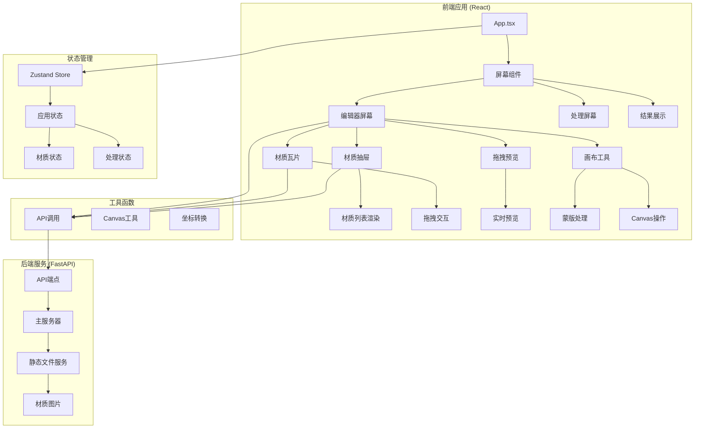

**图表来源**
- [App.tsx:1-26](file://src/App.tsx#L1-L26)
- [MaterialDrawer.tsx:1-136](file://src/components/MaterialDrawer.tsx#L1-L136)
- [EditorScreen.tsx:1-758](file://src/screens/EditorScreen.tsx#L1-L758)

**章节来源**
- [App.tsx:1-26](file://src/App.tsx#L1-L26)
- [MaterialDrawer.tsx:1-136](file://src/components/MaterialDrawer.tsx#L1-L136)
- [EditorScreen.tsx:1-758](file://src/screens/EditorScreen.tsx#L1-L758)

## 核心组件

### 材质数据模型

系统使用统一的材质数据结构来表示所有材质信息：

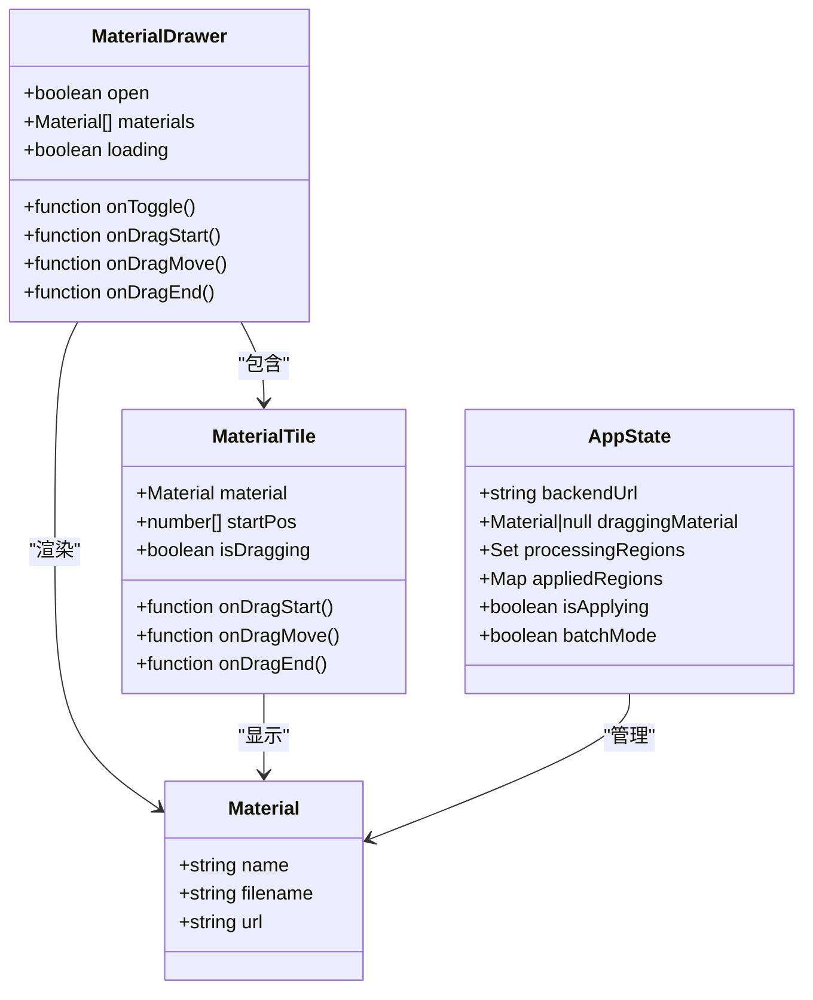

**图表来源**
- [types.ts:8-12](file://src/types.ts#L8-L12)
- [MaterialDrawer.tsx:7-13](file://src/components/MaterialDrawer.tsx#L7-L13)
- [MaterialTile.tsx:5-10](file://src/components/MaterialTile.tsx#L5-L10)
- [store.ts:57-88](file://src/store.ts#L57-L88)

### 状态管理架构

应用使用 Zustand 进行状态管理，实现了集中式的全局状态控制：

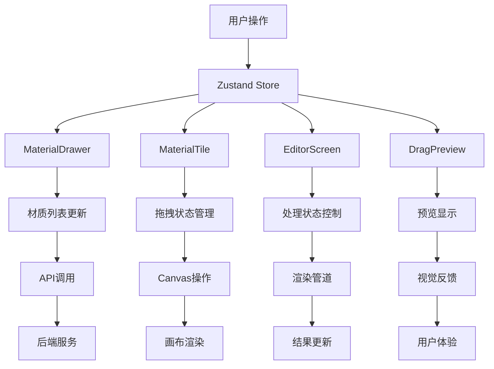

**图表来源**
- [store.ts:63-177](file://src/store.ts#L63-L177)
- [MaterialDrawer.tsx:15-33](file://src/components/MaterialDrawer.tsx#L15-L33)
- [EditorScreen.tsx:21-51](file://src/screens/EditorScreen.tsx#L21-L51)

**章节来源**
- [types.ts:8-12](file://src/types.ts#L8-L12)
- [store.ts:63-177](file://src/store.ts#L63-L177)

## 架构概览

### 系统架构图

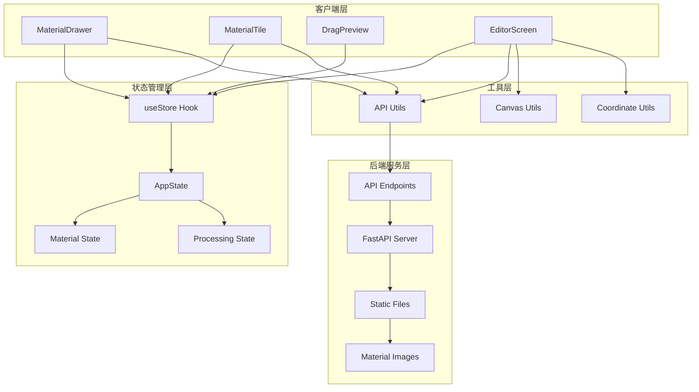

**图表来源**
- [MaterialDrawer.tsx:1-136](file://src/components/MaterialDrawer.tsx#L1-L136)
- [MaterialTile.tsx:1-106](file://src/components/MaterialTile.tsx#L1-L106)
- [EditorScreen.tsx:1-758](file://src/screens/EditorScreen.tsx#L1-L758)
- [api.ts:1-200](file://src/utils/api.ts#L1-L200)
- [main.py:1-200](file://backend/main.py#L1-L200)

### 数据流架构

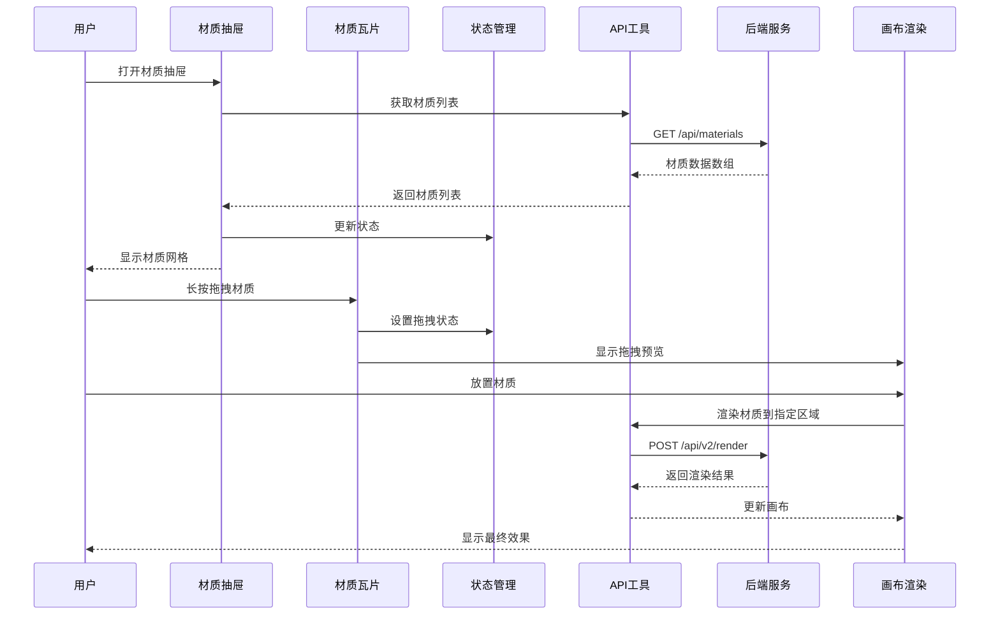

**图表来源**
- [MaterialDrawer.tsx:26-33](file://src/components/MaterialDrawer.tsx#L26-L33)
- [MaterialTile.tsx:35-76](file://src/components/MaterialTile.tsx#L35-L76)
- [EditorScreen.tsx:258-345](file://src/screens/EditorScreen.tsx#L258-L345)
- [api.ts:141-157](file://src/utils/api.ts#L141-L157)

## 详细组件分析

### 材质抽屉组件 (MaterialDrawer)

材质抽屉是用户访问材质库的主要界面，实现了完整的材质浏览和交互功能。

#### 组件架构

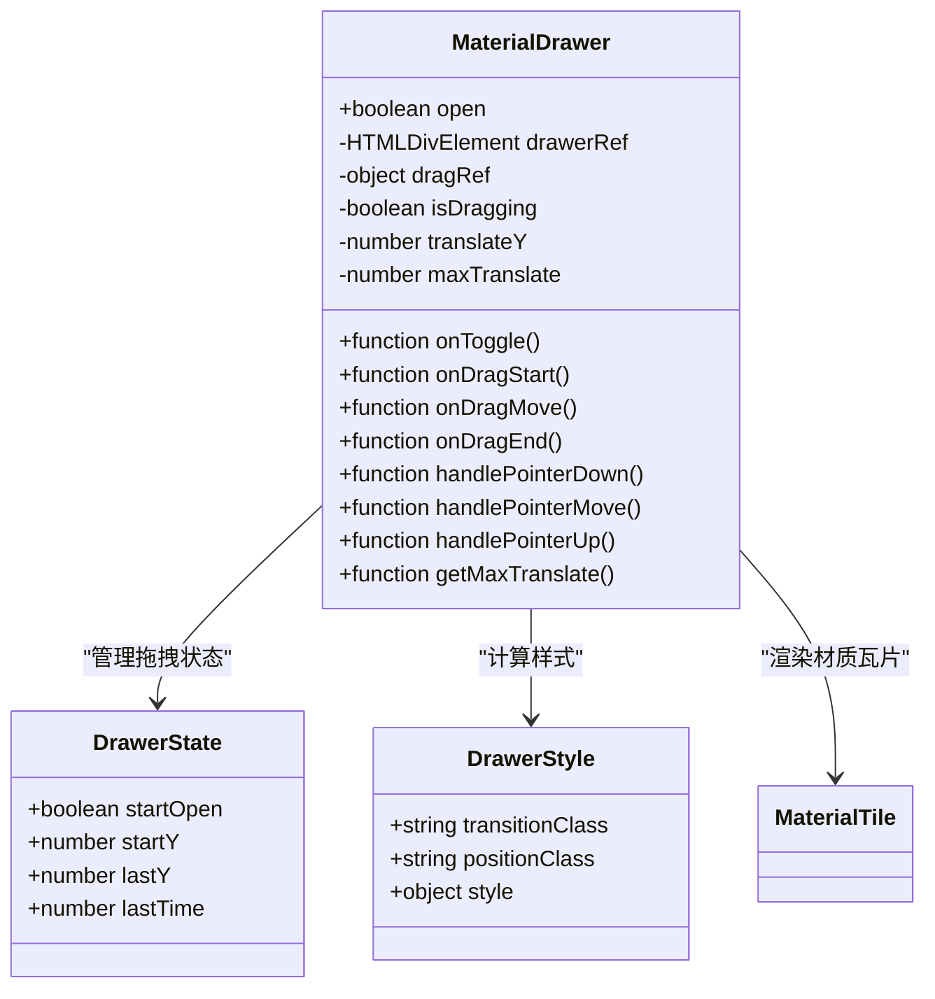

**图表来源**
- [MaterialDrawer.tsx:15-136](file://src/components/MaterialDrawer.tsx#L15-L136)

#### 拖拽交互实现

材质抽屉支持手势拖拽，提供了流畅的用户体验：

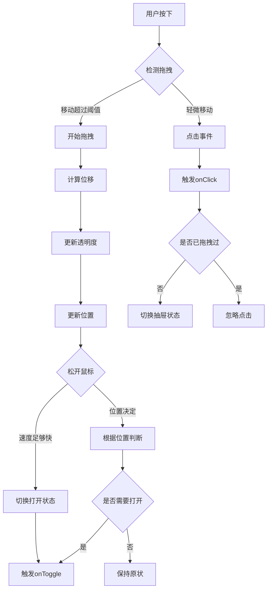

**图表来源**
- [MaterialDrawer.tsx:40-82](file://src/components/MaterialDrawer.tsx#L40-L82)

#### 材质列表渲染

抽屉内部使用网格布局展示材质，支持响应式设计：

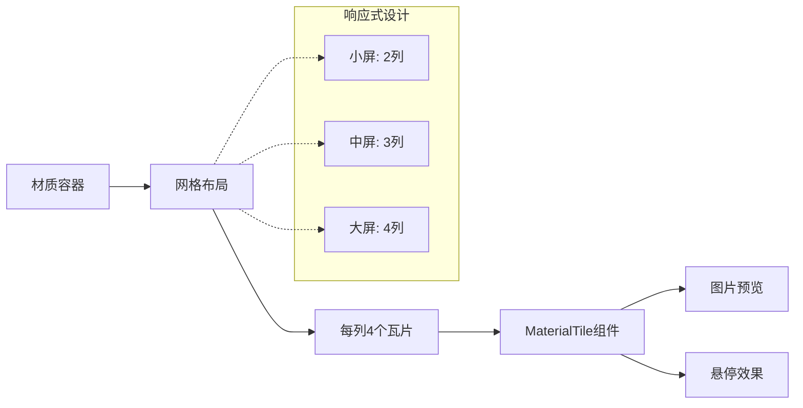

**图表来源**
- [MaterialDrawer.tsx:109-132](file://src/components/MaterialDrawer.tsx#L109-L132)

**章节来源**
- [MaterialDrawer.tsx:15-136](file://src/components/MaterialDrawer.tsx#L15-L136)

### 材质瓦片组件 (MaterialTile)

材质瓦片是材质抽屉中的单个材质项，提供了完整的拖拽交互功能。

#### 拖拽交互机制

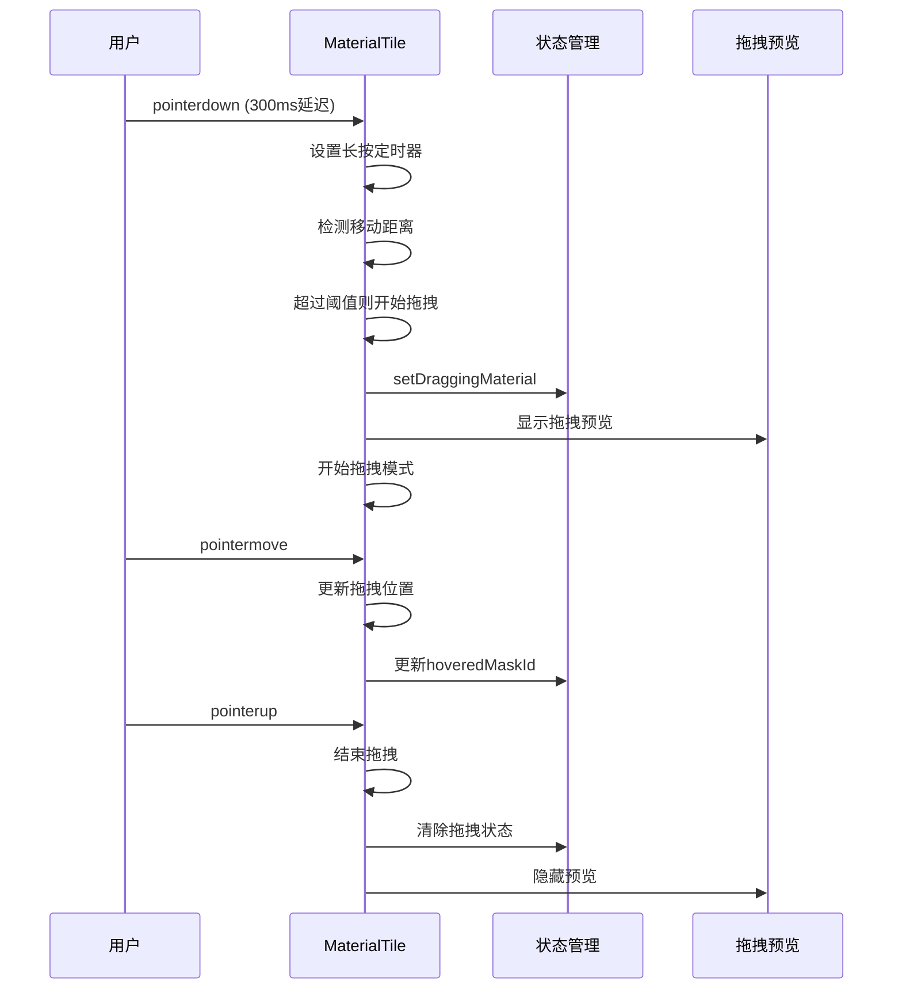

**图表来源**
- [MaterialTile.tsx:35-76](file://src/components/MaterialTile.tsx#L35-L76)
- [DragPreview.tsx:8-32](file://src/components/DragPreview.tsx#L8-L32)

#### 加载优化机制

材质瓦片采用了多种优化策略来提升性能：

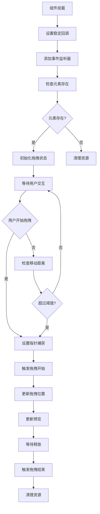

**图表来源**
- [MaterialTile.tsx:27-89](file://src/components/MaterialTile.tsx#L27-L89)

**章节来源**
- [MaterialTile.tsx:12-106](file://src/components/MaterialTile.tsx#L12-L106)
- [DragPreview.tsx:8-32](file://src/components/DragPreview.tsx#L8-L32)

### 编辑器屏幕 (EditorScreen)

编辑器屏幕是整个应用的核心交互界面，集成了材质拖拽、蒙版处理和实时渲染功能。

#### 材质拖拽处理流程

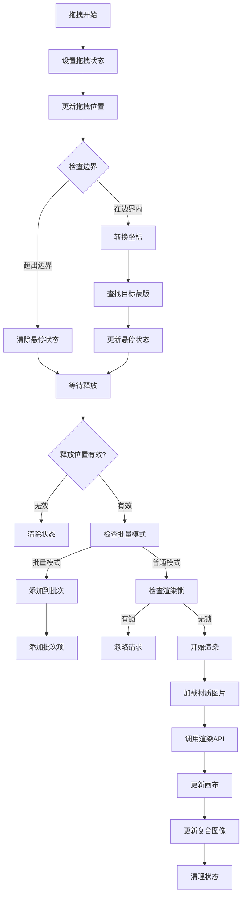

**图表来源**
- [EditorScreen.tsx:258-345](file://src/screens/EditorScreen.tsx#L258-L345)

#### 批量处理模式

系统支持批量材质应用模式，提供高效的多材质处理能力：

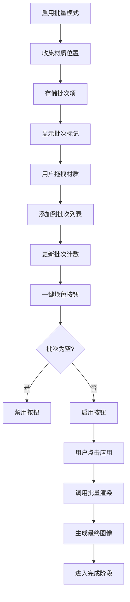

**图表来源**
- [EditorScreen.tsx:292-297](file://src/screens/EditorScreen.tsx#L292-L297)
- [EditorScreen.tsx:654-668](file://src/screens/EditorScreen.tsx#L654-L668)

**章节来源**
- [EditorScreen.tsx:258-345](file://src/screens/EditorScreen.tsx#L258-L345)

## 依赖关系分析

### 前端依赖关系

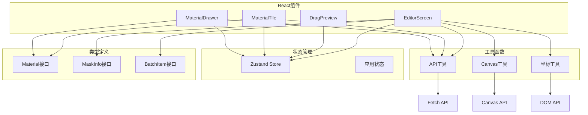

**图表来源**
- [MaterialDrawer.tsx:1-5](file://src/components/MaterialDrawer.tsx#L1-L5)
- [MaterialTile.tsx:1-3](file://src/components/MaterialTile.tsx#L1-L3)
- [EditorScreen.tsx:1-11](file://src/screens/EditorScreen.tsx#L1-L11)
- [store.ts:1-3](file://src/store.ts#L1-L3)
- [types.ts:1-12](file://src/types.ts#L1-L12)

### 后端依赖关系

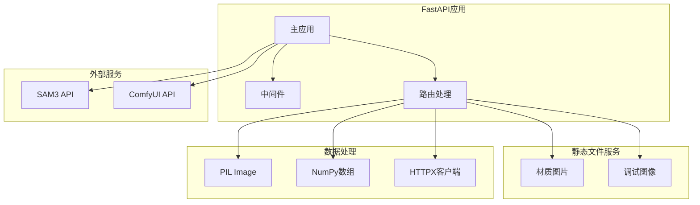

**图表来源**
- [main.py:1-200](file://backend/main.py#L1-L200)

**章节来源**
- [api.ts:1-200](file://src/utils/api.ts#L1-L200)
- [main.py:1-200](file://backend/main.py#L1-L200)

## 性能考虑

### 图像加载优化

系统采用了多层优化策略来确保材质加载的高效性：

1. **懒加载机制**：材质抽屉仅在打开时加载材质列表
2. **缓存策略**：浏览器自动缓存已加载的材质图片
3. **尺寸适配**：根据屏幕密度调整图片质量
4. **预加载优化**：拖拽开始前的预处理逻辑

### 渲染性能优化

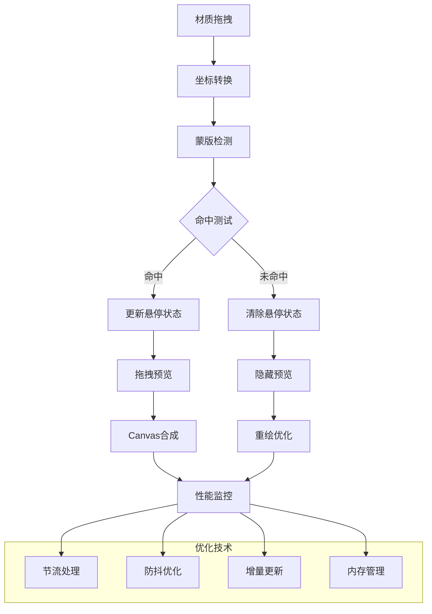

### 内存管理策略

系统通过以下方式管理内存使用：

1. **事件监听器清理**：组件卸载时自动移除事件监听
2. **定时器清理**：避免内存泄漏的定时器管理
3. **图像资源管理**：及时释放不再使用的图像资源
4. **状态清理**：批量模式下的状态重置机制

## 故障排除指南

### 常见问题及解决方案

#### 材质无法加载

**问题描述**：材质抽屉显示空白或加载失败

**可能原因**：
1. 后端服务未启动
2. 材质文件路径错误
3. CORS跨域问题
4. 网络连接异常

**解决步骤**：
1. 检查后端服务状态
2. 验证材质文件存在性
3. 检查浏览器控制台错误
4. 确认网络连接正常

#### 拖拽功能异常

**问题描述**：材质拖拽无响应或行为异常

**可能原因**：
1. 指针事件处理冲突
2. 拖拽状态管理错误
3. 画布坐标转换问题
4. 浏览器兼容性问题

**解决步骤**：
1. 检查事件监听器注册
2. 验证拖拽状态同步
3. 确认坐标转换准确性
4. 测试不同浏览器兼容性

#### 渲染性能问题

**问题描述**：材质应用时画面卡顿或延迟

**可能原因**：
1. 图像尺寸过大
2. Canvas绘制复杂度过高
3. 内存使用过多
4. 网络请求阻塞

**解决步骤**：
1. 优化图像尺寸和格式
2. 减少Canvas绘制复杂度
3. 实施内存使用监控
4. 优化网络请求策略

**章节来源**
- [MaterialDrawer.tsx:26-33](file://src/components/MaterialDrawer.tsx#L26-L33)
- [MaterialTile.tsx:27-89](file://src/components/MaterialTile.tsx#L27-L89)
- [EditorScreen.tsx:276-345](file://src/screens/EditorScreen.tsx#L276-L345)

## 结论

材质管理系统通过精心设计的架构和优化策略，成功实现了高性能的材质浏览和应用功能。系统的主要优势包括：

1. **用户体验优秀**：流畅的拖拽交互和实时预览
2. **性能表现优异**：多层优化确保快速响应
3. **扩展性强**：模块化设计便于功能扩展
4. **稳定性高**：完善的错误处理和状态管理

未来可以考虑的功能增强包括：
- 材质搜索和分类功能
- 材质收藏和管理
- 更丰富的材质编辑工具
- 多用户协作功能

## 附录

### 材质文件格式要求

根据后端文档，系统支持以下材质文件格式：

| 格式 | 支持情况 | 备注 |
|------|----------|------|
| JPG | ✅ 支持 | 推荐使用高质量图片 |
| JPEG | ✅ 支持 | 与JPG相同 |
| PNG | ✅ 支持 | 无损压缩格式 |
| WEBP | ✅ 支持 | 现代压缩格式 |

### 材质库维护最佳实践

1. **文件命名规范**：使用清晰易懂的文件名
2. **文件大小控制**：建议不超过2MB以保证加载速度
3. **格式选择**：优先使用PNG或WEBP获得更好的压缩效果
4. **备份策略**：定期备份材质文件以防丢失
5. **版本管理**：对重要材质建立版本记录

### API接口规范

系统提供以下关键API接口：

1. **获取材质列表**：`GET /api/materials`
2. **获取材质图片**：`GET /materials/{filename}`
3. **渲染材质**：`POST /api/v2/render`
4. **批量渲染**：`POST /api/v2/render-all`

这些接口确保了前后端的高效通信和数据传输。

**章节来源**
- [frontend-api-guide.md:192-224](file://docs/frontend-api-guide.md#L192-L224)
- [api.ts:15-19](file://src/utils/api.ts#L15-L19)
- [api.ts:141-157](file://src/utils/api.ts#L141-L157)
- [api.ts:109-139](file://src/utils/api.ts#L109-L139)