# 上传界面组件

<cite>
**本文档引用的文件**
- [UploadScreen.tsx](file://src/screens/UploadScreen.tsx)
- [DragPreview.tsx](file://src/components/DragPreview.tsx)
- [ExamplesDrawer.tsx](file://src/components/ExamplesDrawer.tsx)
- [SettingsDrawer.tsx](file://src/components/SettingsDrawer.tsx)
- [api.ts](file://src/utils/api.ts)
- [store.ts](file://src/store.ts)
- [types.ts](file://src/types.ts)
- [canvas.ts](file://src/utils/canvas.ts)
- [remapMaskColors.ts](file://src/utils/remapMaskColors.ts)
- [EditorScreen.tsx](file://src/screens/EditorScreen.tsx)
- [ProcessingScreen.tsx](file://src/screens/ProcessingScreen.tsx)
- [FinalizingScreen.tsx](file://src/screens/FinalizingScreen.tsx)
- [frontend-api-guide.md](file://docs/frontend-api-guide.md)
</cite>

## 目录
1. [简介](#简介)
2. [项目结构](#项目结构)
3. [核心组件](#核心组件)
4. [架构概览](#架构概览)
5. [详细组件分析](#详细组件分析)
6. [依赖关系分析](#依赖关系分析)
7. [性能考虑](#性能考虑)
8. [故障排除指南](#故障排除指南)
9. [结论](#结论)
10. [附录](#附录)

## 简介

上传界面组件（UploadScreen）是 WallChanger 应用的核心入口点，负责处理用户上传的室内照片并启动完整的图像处理流程。该组件实现了现代化的拖拽上传功能、文件验证机制、EXIF 旋转修正和预览生成功能，为用户提供直观的上传体验。

该组件采用 React Hooks 架构，集成了 Zustand 状态管理，提供了完整的文件上传生命周期管理。从文件选择到预处理完成，整个流程都经过精心设计，确保用户体验的流畅性和可靠性。

## 项目结构

UploadScreen 组件位于应用的屏幕层，与其它核心屏幕组件协同工作，形成完整的用户界面流程：

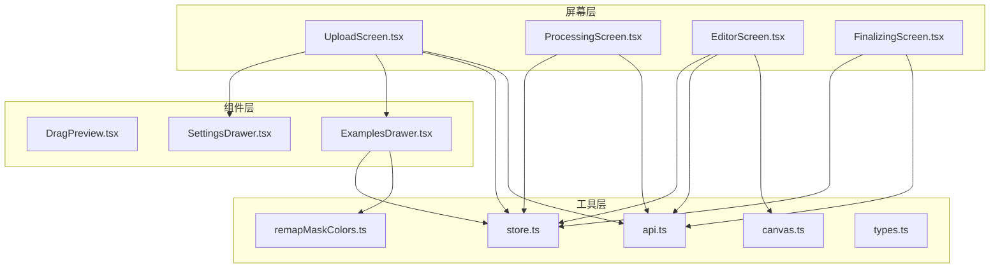

**图表来源**
- [UploadScreen.tsx:1-121](file://src/screens/UploadScreen.tsx#L1-L121)
- [api.ts:1-197](file://src/utils/api.ts#L1-L197)
- [store.ts:1-177](file://src/store.ts#L1-L177)

**章节来源**
- [UploadScreen.tsx:1-121](file://src/screens/UploadScreen.tsx#L1-L121)
- [store.ts:1-177](file://src/store.ts#L1-L177)

## 核心组件

### UploadScreen 主要职责

UploadScreen 组件承担着以下核心功能：

1. **文件上传处理**：支持点击选择和拖拽上传两种方式
2. **文件验证**：确保只接受图像文件类型
3. **图像预处理**：提取图像尺寸信息，准备后续处理
4. **状态管理**：协调应用状态转换和数据传递
5. **用户界面**：提供直观的上传区域和交互反馈

### 关键状态管理

组件使用 Zustand 状态管理库来维护应用状态：

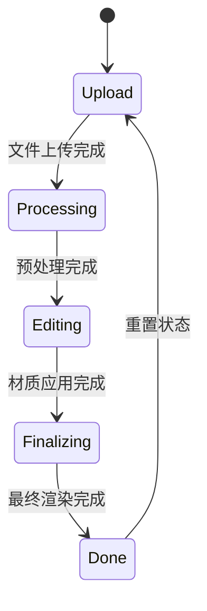

**图表来源**
- [store.ts:40-61](file://src/store.ts#L40-L61)
- [types.ts:13](file://src/types.ts#L13)

**章节来源**
- [UploadScreen.tsx:6-121](file://src/screens/UploadScreen.tsx#L6-L121)
- [store.ts:63-177](file://src/store.ts#L63-L177)

## 架构概览

UploadScreen 组件采用分层架构设计，各层职责明确：

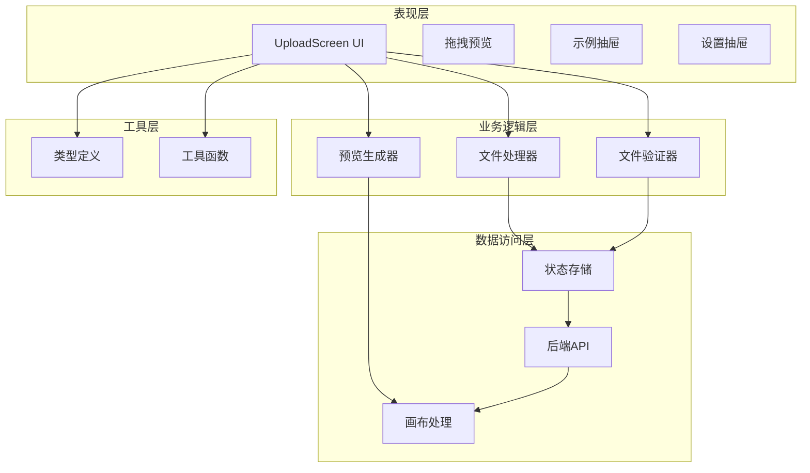

**图表来源**
- [UploadScreen.tsx:13-41](file://src/screens/UploadScreen.tsx#L13-L41)
- [api.ts:21-37](file://src/utils/api.ts#L21-L37)
- [store.ts:68-76](file://src/store.ts#L68-L76)

## 详细组件分析

### 文件上传处理流程

UploadScreen 实现了完整的文件上传处理流程，包括拖拽和点击两种方式：

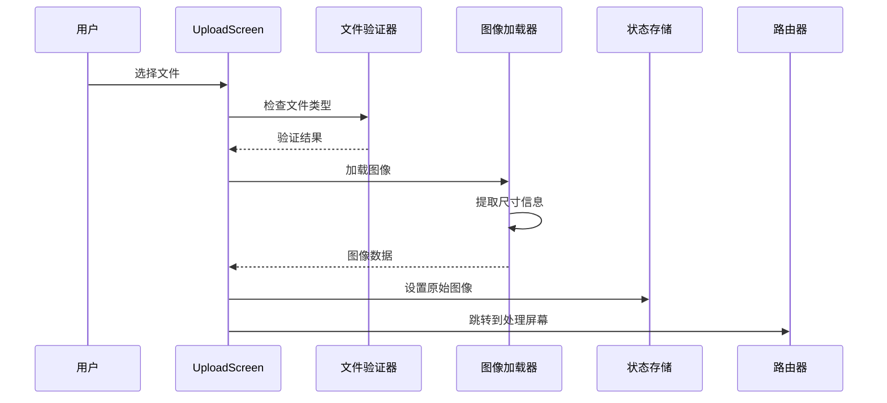

**图表来源**
- [UploadScreen.tsx:13-29](file://src/screens/UploadScreen.tsx#L13-L29)
- [store.ts:68-76](file://src/store.ts#L68-L76)

#### 文件验证机制

组件实现了严格的文件类型验证：

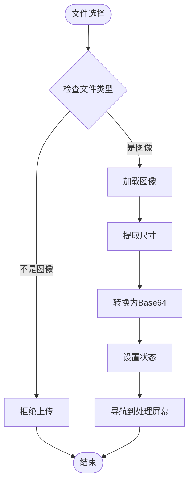

**图表来源**
- [UploadScreen.tsx:13-29](file://src/screens/UploadScreen.tsx#L13-L29)

**章节来源**
- [UploadScreen.tsx:13-41](file://src/screens/UploadScreen.tsx#L13-L41)

### 拖拽上传功能

拖拽上传功能提供了直观的用户交互体验：

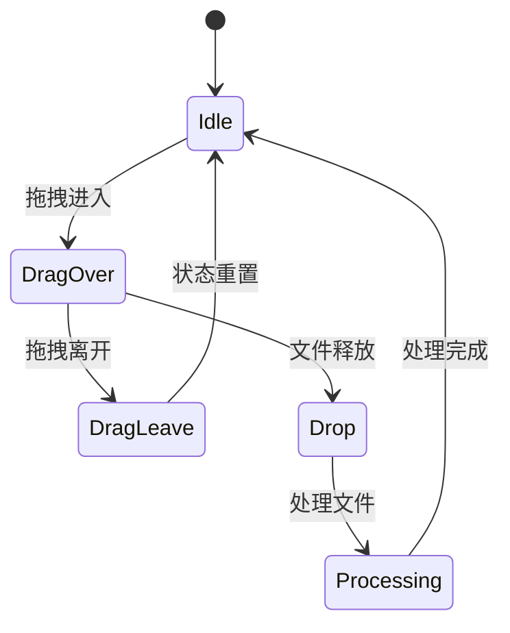

**图表来源**
- [UploadScreen.tsx:31-36](file://src/screens/UploadScreen.tsx#L31-L36)
- [UploadScreen.tsx:77-79](file://src/screens/UploadScreen.tsx#L77-L79)

#### 拖拽预览组件

DragPreview 组件提供了拖拽过程中的视觉反馈：

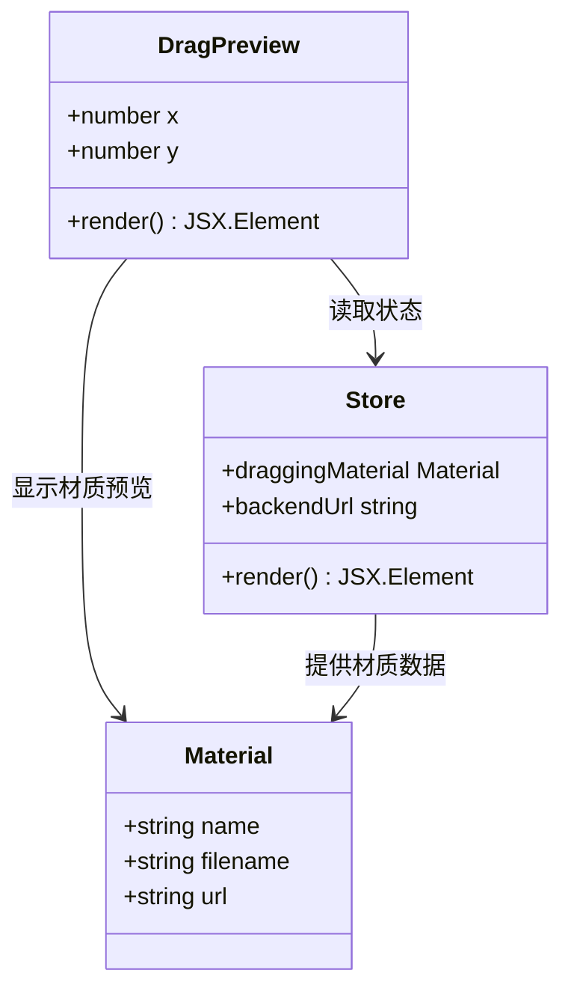

**图表来源**
- [DragPreview.tsx:3-28](file://src/components/DragPreview.tsx#L3-L28)
- [store.ts:54](file://src/store.ts#L54)

**章节来源**
- [DragPreview.tsx:8-32](file://src/components/DragPreview.tsx#L8-L32)

### 示例和设置功能

组件集成了示例抽屉和设置抽屉，提供额外的功能选项：

#### 示例抽屉功能

ExamplesDrawer 组件提供了官方示例的快速访问：

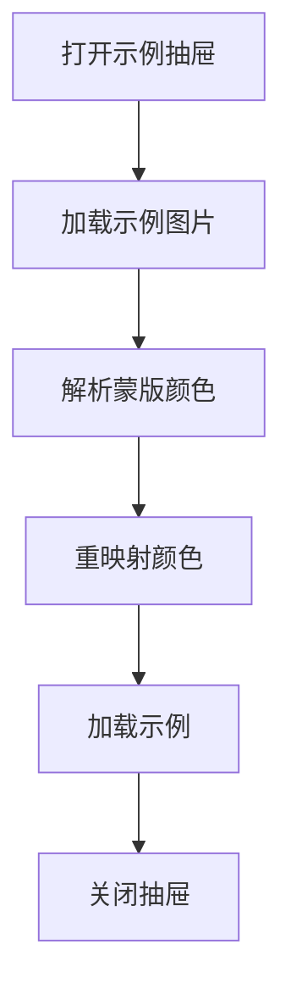

**图表来源**
- [ExamplesDrawer.tsx:131-148](file://src/components/ExamplesDrawer.tsx#L131-L148)
- [remapMaskColors.ts:67-121](file://src/utils/remapMaskColors.ts#L67-L121)

#### 设置抽屉功能

SettingsDrawer 组件提供了后端连接配置：

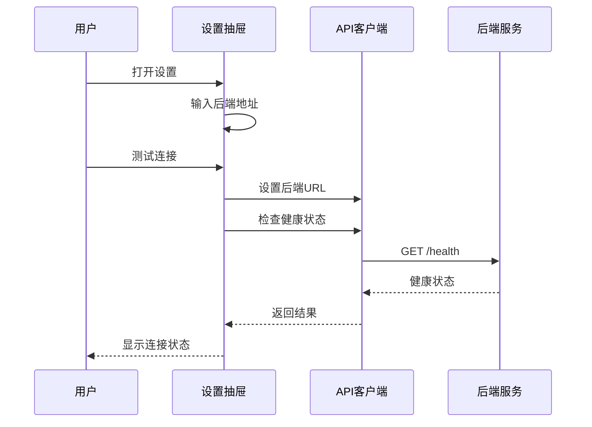

**图表来源**
- [SettingsDrawer.tsx:18-28](file://src/components/SettingsDrawer.tsx#L18-L28)
- [api.ts:9-13](file://src/utils/api.ts#L9-L13)

**章节来源**
- [ExamplesDrawer.tsx:73-207](file://src/components/ExamplesDrawer.tsx#L73-L207)
- [SettingsDrawer.tsx:12-113](file://src/components/SettingsDrawer.tsx#L12-L113)

### 状态管理和数据流

UploadScreen 与全局状态管理系统紧密集成：

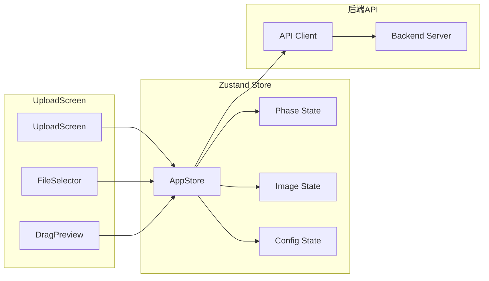

**图表来源**
- [store.ts:63-177](file://src/store.ts#L63-L177)
- [types.ts:56-87](file://src/types.ts#L56-L87)

#### 状态转换流程

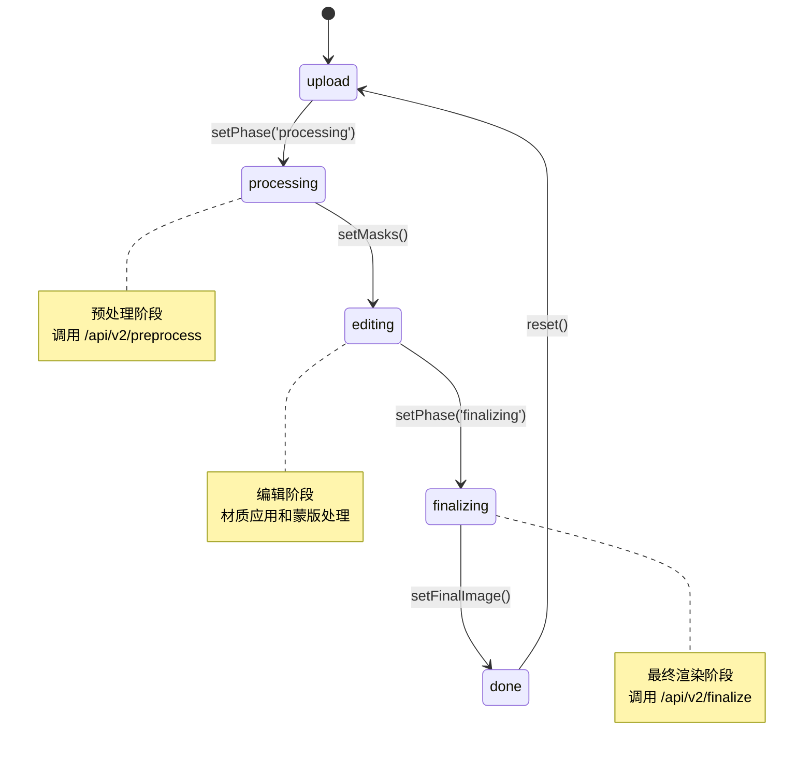

**图表来源**
- [store.ts:66](file://src/store.ts#L66)
- [store.ts:78-89](file://src/store.ts#L78-L89)
- [store.ts:167-176](file://src/store.ts#L167-L176)

**章节来源**
- [store.ts:63-177](file://src/store.ts#L63-L177)
- [types.ts:13](file://src/types.ts#L13)

## 依赖关系分析

### 组件间依赖关系

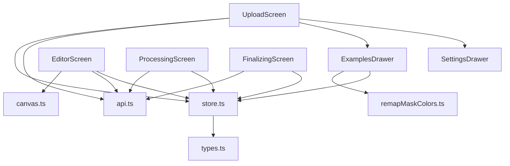

**图表来源**
- [UploadScreen.tsx:2-5](file://src/screens/UploadScreen.tsx#L2-L5)
- [ExamplesDrawer.tsx:2-4](file://src/components/ExamplesDrawer.tsx#L2-L4)
- [EditorScreen.tsx:2-11](file://src/screens/EditorScreen.tsx#L2-L11)

### 外部依赖分析

组件依赖的关键外部库和服务：

| 依赖类型 | 名称 | 版本 | 用途 |
|---------|------|------|------|
| 前端框架 | React | 18+ | UI 组件构建 |
| 状态管理 | Zustand | 仓库 | 全局状态管理 |
| 图像处理 | Canvas API | 浏览器 | 图像预处理和渲染 |
| 网络请求 | Fetch API | 浏览器内置 | 后端通信 |
| 样式框架 | Tailwind CSS | 3+ | 响应式样式 |

**章节来源**
- [package.json](file://package.json)
- [UploadScreen.tsx:1-121](file://src/screens/UploadScreen.tsx#L1-L121)

## 性能考虑

### 文件上传性能优化

UploadScreen 实现了多项性能优化措施：

1. **异步文件处理**：使用 Promise 和 async/await 避免阻塞主线程
2. **内存管理**：及时释放 Blob URL 和图像对象
3. **状态更新优化**：批量状态更新减少不必要的重渲染
4. **条件渲染**：根据状态动态渲染组件，减少 DOM 操作

### 图像处理性能

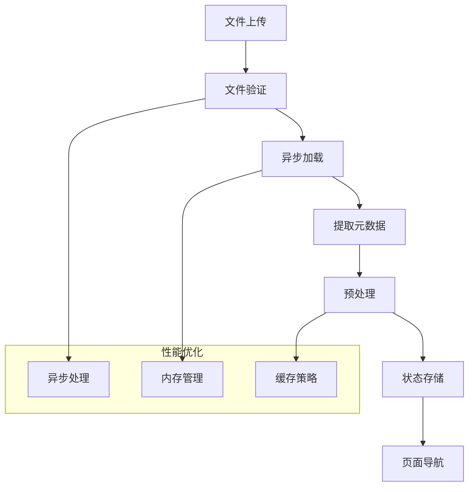

**图表来源**
- [UploadScreen.tsx:13-29](file://src/screens/UploadScreen.tsx#L13-L29)

### 并发控制

系统实现了严格的并发控制机制：

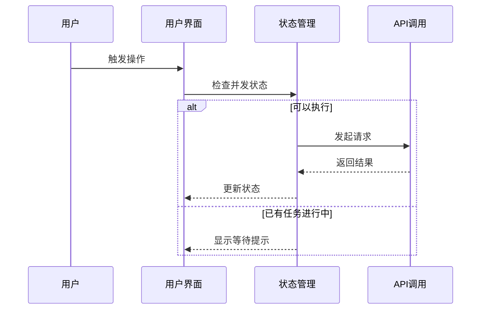

**图表来源**
- [EditorScreen.tsx:300-345](file://src/screens/EditorScreen.tsx#L300-L345)
- [store.ts:136](file://src/store.ts#L136)

## 故障排除指南

### 常见问题和解决方案

#### 文件上传失败

**问题症状**：
- 文件无法上传
- 控制台出现错误信息
- 页面无响应

**可能原因**：
1. 文件类型不被支持
2. 文件大小超出限制
3. 网络连接问题
4. 后端服务不可用

**解决步骤**：
1. 检查文件类型是否为图像格式
2. 确认文件大小符合要求
3. 验证网络连接状态
4. 检查后端服务健康状态

#### 拖拽功能异常

**问题症状**：
- 拖拽区域无响应
- 拖拽预览不显示
- 拖拽事件未触发

**解决步骤**：
1. 检查浏览器兼容性
2. 验证拖拽事件监听器
3. 确认 CSS 样式正确应用
4. 检查文件类型验证逻辑

#### 状态管理问题

**问题症状**：
- 界面状态不更新
- 页面跳转异常
- 数据丢失

**解决步骤**：
1. 检查 Zustand store 配置
2. 验证状态更新函数
3. 确认组件订阅状态
4. 检查状态重置逻辑

**章节来源**
- [UploadScreen.tsx:31-41](file://src/screens/UploadScreen.tsx#L31-L41)
- [ProcessingScreen.tsx:65-70](file://src/screens/ProcessingScreen.tsx#L65-L70)

### 错误处理机制

组件实现了多层次的错误处理：

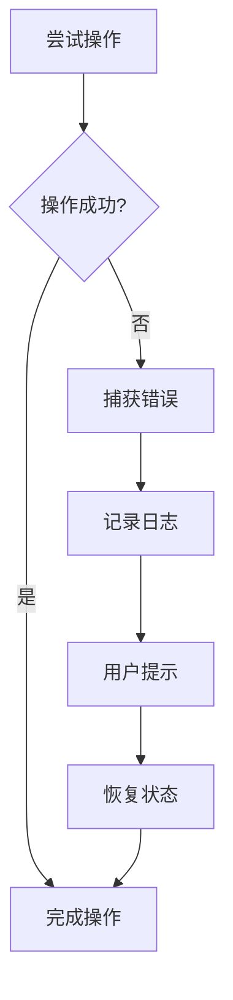

**图表来源**
- [ProcessingScreen.tsx:65-70](file://src/screens/ProcessingScreen.tsx#L65-L70)
- [UploadScreen.tsx:31-36](file://src/screens/UploadScreen.tsx#L31-L36)

## 结论

UploadScreen 组件作为 WallChanger 应用的入口点，展现了现代前端开发的最佳实践。该组件成功地整合了多种技术特性：

1. **用户友好性**：提供了直观的拖拽上传和点击上传两种方式
2. **健壮性**：实现了完善的文件验证和错误处理机制
3. **性能优化**：采用了异步处理和内存管理等优化策略
4. **可维护性**：清晰的代码结构和模块化设计

通过与其他屏幕组件的协作，UploadScreen 为用户提供了完整的图像上传和处理体验。其设计充分考虑了用户体验、性能和可维护性的平衡，是一个高质量的前端组件实现。

## 附录

### API 接口规范

根据前端 API 指南，上传界面相关的 API 接口包括：

| 接口名称 | 方法 | 路径 | 描述 |
|---------|------|------|------|
| 健康检查 | GET | /health | 检查后端服务状态 |
| 预处理 | POST | /api/v2/preprocess | 图像预处理和墙面分割 |
| 材质应用 | POST | /api/v2/render | 材质应用到指定区域 |
| 最终渲染 | POST | /api/v2/finalize | 最终图像优化处理 |

### 文件类型支持

系统支持的图像格式：
- JPG/JPEG
- PNG  
- WebP
- GIF

### 安全考虑

1. **文件类型验证**：仅接受图像文件类型
2. **大小限制**：防止大文件占用过多资源
3. **跨域处理**：正确设置 CORS 头部
4. **输入验证**：对用户输入进行严格验证