# 图像画布组件

<cite>
**本文档引用的文件**
- [ImageCanvas.tsx](file://src/components/ImageCanvas.tsx)
- [canvas.ts](file://src/utils/canvas.ts)
- [remapMaskColors.ts](file://src/utils/remapMaskColors.ts)
- [types.ts](file://src/types.ts)
- [store.ts](file://src/store.ts)
- [EditorScreen.tsx](file://src/screens/EditorScreen.tsx)
- [api.ts](file://src/utils/api.ts)
</cite>

## 目录
1. [简介](#简介)
2. [项目结构](#项目结构)
3. [核心组件](#核心组件)
4. [架构概览](#架构概览)
5. [详细组件分析](#详细组件分析)
6. [依赖关系分析](#依赖关系分析)
7. [性能考虑](#性能考虑)
8. [故障排除指南](#故障排除指南)
9. [结论](#结论)
10. [附录](#附录)

## 简介

图像画布组件（ImageCanvas）是 WallChanger 应用程序中的核心渲染组件，负责在浏览器中高效地显示和操作图像内容。该组件实现了完整的 Canvas 2D 渲染流水线，包括画布初始化、图像绘制、蒙版加载和合成显示等功能。

本组件采用现代 React 架构设计，结合离屏 Canvas 技术和高性能的蒙版合成算法，为用户提供流畅的实时预览体验。组件支持多种蒙版模式：黑白蒙版管道、传统颜色蒙版重映射，以及复杂的离屏 Canvas 处理机制。

## 项目结构

项目采用模块化架构，主要文件组织如下：

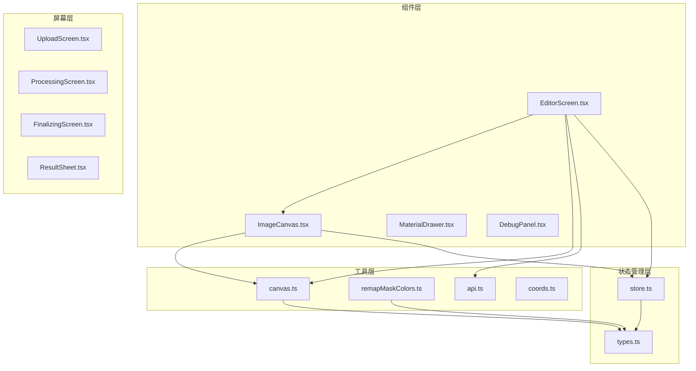

**图表来源**
- [ImageCanvas.tsx:1-91](file://src/components/ImageCanvas.tsx#L1-L91)
- [canvas.ts:1-905](file://src/utils/canvas.ts#L1-L905)
- [store.ts:1-177](file://src/store.ts#L1-L177)

**章节来源**
- [ImageCanvas.tsx:1-91](file://src/components/ImageCanvas.tsx#L1-L91)
- [store.ts:1-177](file://src/store.ts#L1-L177)

## 核心组件

### ImageCanvas 组件

ImageCanvas 是一个高性能的 React 组件，专门用于处理图像渲染和蒙版合成。该组件提供了以下关键功能：

- **画布初始化**：根据图像尺寸动态创建和配置 Canvas 元素
- **图像绘制**：支持跨域图像加载和缩放绘制
- **蒙版加载**：支持黑白蒙版和传统颜色蒙版两种模式
- **实时预览**：通过离屏 Canvas 实现高效的蒙版合成
- **导出功能**：支持将当前画布内容导出为 Base64 编码

### Canvas 工具库

Canvas 工具库提供了完整的蒙版处理和渲染功能：

- **离屏 Canvas 管理**：统一管理主画布和离屏画布实例
- **蒙版 SDF 构建**：实现距离场算法，支持发光效果和边缘羽化
- **蒙版分割算法**：基于直线分割实现蒙版区域的动态分割
- **实时渲染效果**：提供轮廓高亮、闪烁效果和遮罩效果

**章节来源**
- [ImageCanvas.tsx:15-91](file://src/components/ImageCanvas.tsx#L15-L91)
- [canvas.ts:720-799](file://src/utils/canvas.ts#L720-L799)

## 架构概览

图像画布组件采用分层架构设计，确保了良好的模块分离和可维护性：

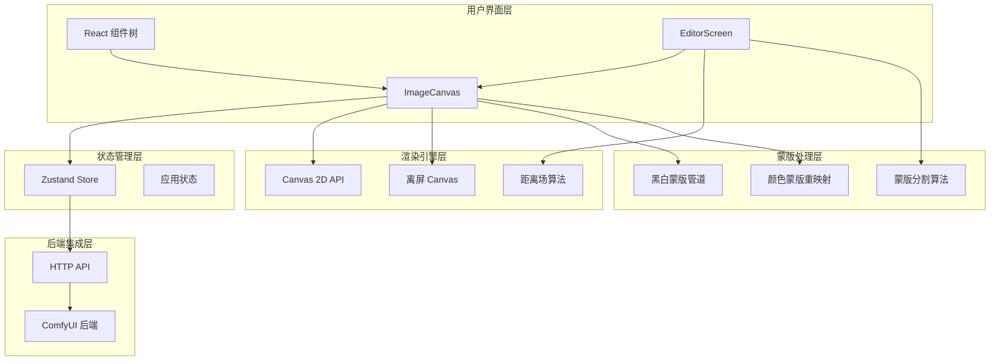

**图表来源**
- [EditorScreen.tsx:1-758](file://src/screens/EditorScreen.tsx#L1-L758)
- [canvas.ts:182-324](file://src/utils/canvas.ts#L182-L324)

## 详细组件分析

### ImageCanvas 组件架构

ImageCanvas 组件采用了函数式组件与 Hook 的组合模式，实现了高效的响应式渲染：

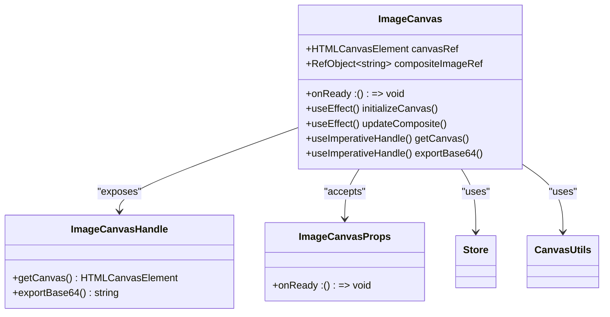

**图表来源**
- [ImageCanvas.tsx:6-13](file://src/components/ImageCanvas.tsx#L6-L13)
- [ImageCanvas.tsx:25-31](file://src/components/ImageCanvas.tsx#L25-L31)

#### 画布初始化流程

组件的画布初始化过程遵循严格的顺序控制：

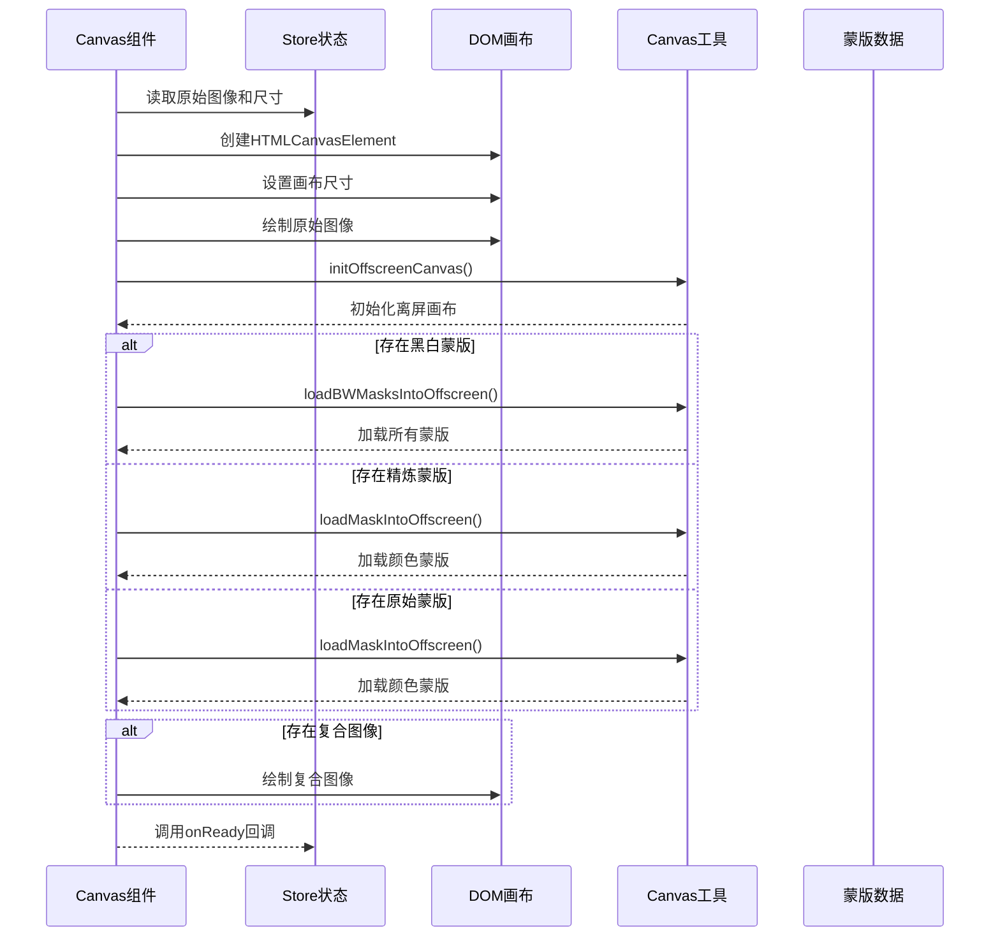

**图表来源**
- [ImageCanvas.tsx:33-71](file://src/components/ImageCanvas.tsx#L33-L71)
- [canvas.ts:720-742](file://src/utils/canvas.ts#L720-L742)

**章节来源**
- [ImageCanvas.tsx:33-71](file://src/components/ImageCanvas.tsx#L33-L71)

### 蒙版合成算法详解

#### 黑白蒙版管道

黑白蒙版管道是组件的核心特性之一，它提供了更精确和高效的蒙版处理能力：

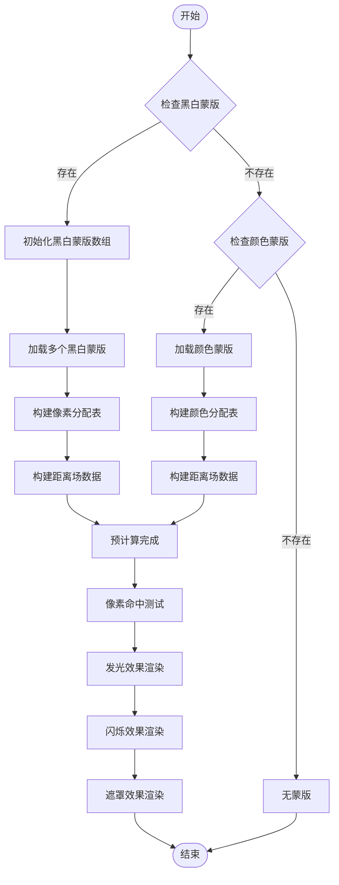

**图表来源**
- [canvas.ts:200-324](file://src/utils/canvas.ts#L200-L324)
- [canvas.ts:760-789](file://src/utils/canvas.ts#L760-L789)

#### 距离场算法实现

组件实现了完整的距离场（SDF）算法，支持多种渲染效果：

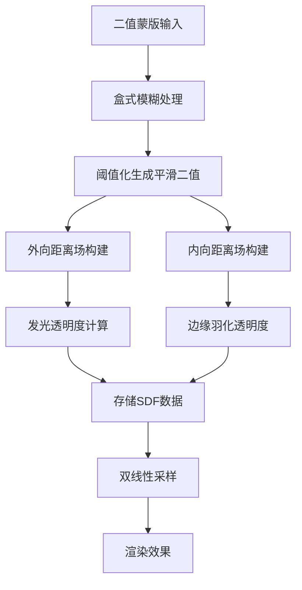

**图表来源**
- [canvas.ts:81-174](file://src/utils/canvas.ts#L81-L174)
- [canvas.ts:293-318](file://src/utils/canvas.ts#L293-L318)

**章节来源**
- [canvas.ts:81-174](file://src/utils/canvas.ts#L81-L174)
- [canvas.ts:200-324](file://src/utils/canvas.ts#L200-L324)

### 实时预览功能

#### 复合图像动态更新

组件实现了高效的复合图像动态更新机制：

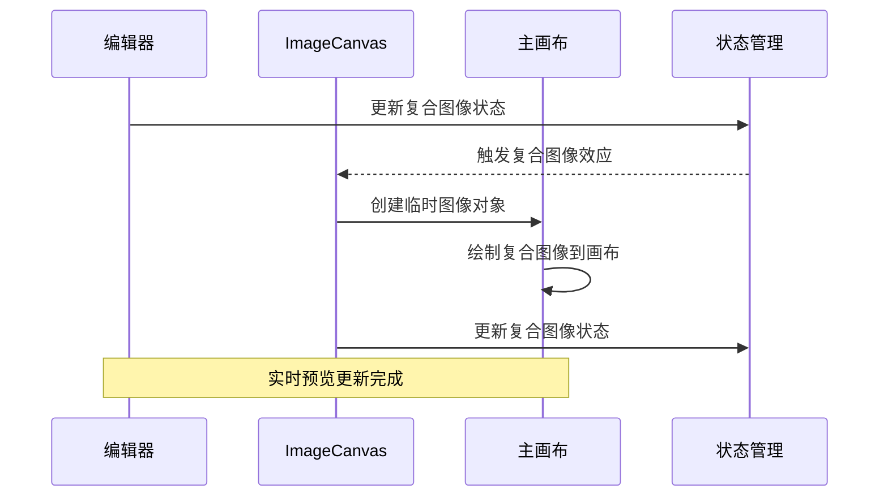

**图表来源**
- [ImageCanvas.tsx:73-80](file://src/components/ImageCanvas.tsx#L73-L80)

#### Canvas 状态管理

组件通过精心设计的状态管理确保了渲染的一致性和性能：

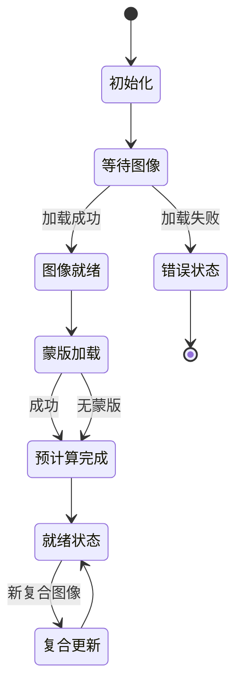

**图表来源**
- [ImageCanvas.tsx:33-71](file://src/components/ImageCanvas.tsx#L33-L71)

**章节来源**
- [ImageCanvas.tsx:73-80](file://src/components/ImageCanvas.tsx#L73-L80)

### 蒙版分割算法

#### 直线分割实现

组件支持基于直线的蒙版分割功能，实现了精确的区域划分：

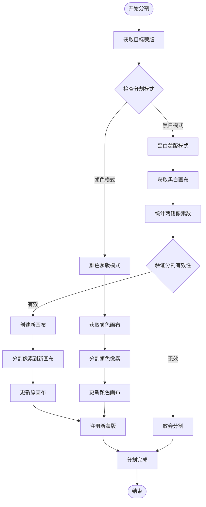

**图表来源**
- [canvas.ts:536-626](file://src/utils/canvas.ts#L536-L626)

**章节来源**
- [canvas.ts:536-626](file://src/utils/canvas.ts#L536-L626)

## 依赖关系分析

### 组件间依赖关系

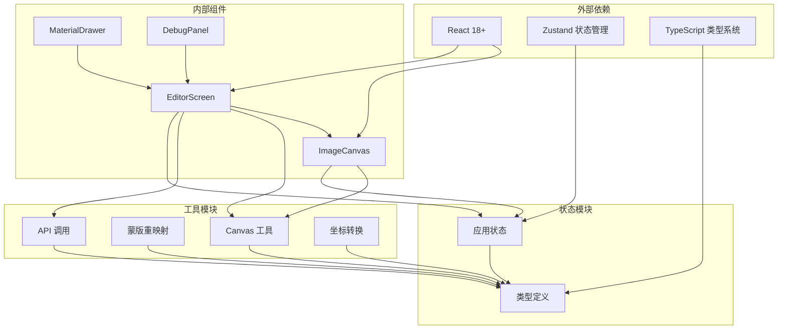

**图表来源**
- [ImageCanvas.tsx:1-5](file://src/components/ImageCanvas.tsx#L1-L5)
- [EditorScreen.tsx:1-12](file://src/screens/EditorScreen.tsx#L1-L12)

### 数据流分析

组件的数据流遵循单向数据流原则，确保了状态的一致性和可预测性：

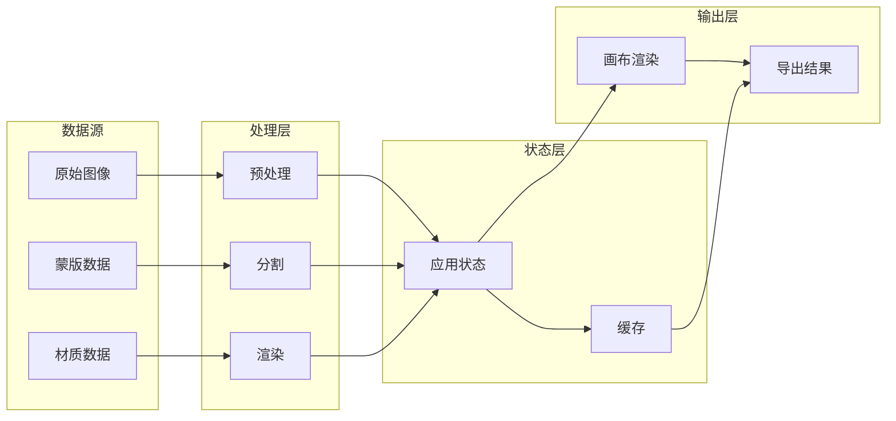

**图表来源**
- [store.ts:63-177](file://src/store.ts#L63-L177)
- [api.ts:141-157](file://src/utils/api.ts#L141-L157)

**章节来源**
- [store.ts:63-177](file://src/store.ts#L63-L177)
- [api.ts:141-157](file://src/utils/api.ts#L141-L157)

## 性能考虑

### 渲染性能优化

组件在多个层面实现了性能优化：

1. **离屏 Canvas 技术**：避免主线程阻塞，提高渲染效率
2. **像素级缓存**：预计算距离场数据，减少重复计算
3. **增量更新**：只更新变化的部分，避免全量重绘
4. **内存管理**：及时释放不再使用的图像数据和画布资源

### 内存管理策略

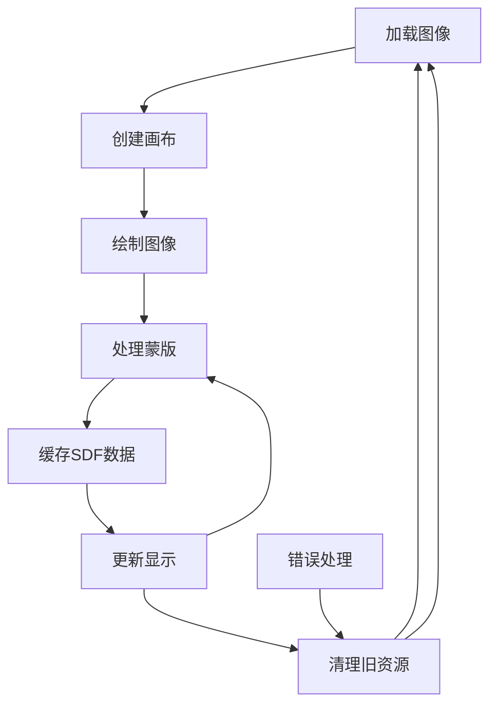

**图表来源**
- [canvas.ts:200-324](file://src/utils/canvas.ts#L200-L324)

### 最佳实践建议

1. **合理使用离屏 Canvas**：仅在需要复杂处理时使用
2. **及时清理资源**：组件卸载时释放所有画布和图像资源
3. **避免频繁重绘**：通过状态管理避免不必要的渲染
4. **优化蒙版数据**：使用合适的蒙版分辨率和格式

## 故障排除指南

### 常见问题及解决方案

#### 跨域图像加载失败

**问题描述**：图像无法正确加载，出现跨域错误

**解决方案**：
1. 确保服务器设置了正确的 CORS 头部
2. 使用 `crossOrigin='anonymous'` 属性
3. 检查图像 URL 格式是否正确

#### 蒙版渲染异常

**问题描述**：蒙版显示不正确或效果异常

**排查步骤**：
1. 验证蒙版数据格式和编码
2. 检查蒙版尺寸与图像尺寸是否匹配
3. 确认预计算步骤是否正确执行

#### 性能问题

**问题描述**：渲染速度慢或卡顿

**优化建议**：
1. 减少蒙版数量和复杂度
2. 使用适当的图像分辨率
3. 避免频繁的状态更新

**章节来源**
- [ImageCanvas.tsx:69-70](file://src/components/ImageCanvas.tsx#L69-L70)
- [canvas.ts:731-742](file://src/utils/canvas.ts#L731-L742)

## 结论

图像画布组件是一个高度优化的 Canvas 2D 渲染解决方案，它成功地将复杂的蒙版处理、实时预览和高性能渲染集成为一体。组件的设计充分考虑了现代 Web 应用的需求，提供了：

- **强大的蒙版处理能力**：支持黑白蒙版和颜色蒙版两种模式
- **高效的渲染性能**：通过离屏 Canvas 和预计算技术实现流畅的用户体验
- **灵活的扩展性**：模块化的架构设计便于功能扩展和维护
- **完善的错误处理**：健壮的错误处理机制确保系统的稳定性

该组件为 WallChanger 应用提供了坚实的技术基础，能够满足复杂的图像处理和实时预览需求。

## 附录

### API 接口参考

#### ImageCanvas 组件接口

| 属性名 | 类型 | 必需 | 描述 |
|--------|------|------|------|
| onReady | () => void | 是 | 画布初始化完成后的回调函数 |

| 方法名 | 参数 | 返回值 | 描述 |
|--------|------|--------|------|
| getCanvas | - | HTMLCanvasElement \| null | 获取底层 Canvas 元素 |
| exportBase64 | - | string \| null | 导出当前画布为 Base64 编码 |

#### Canvas 工具函数

| 函数名 | 参数 | 返回值 | 描述 |
|--------|------|--------|------|
| initOffscreenCanvas | width: number, height: number | void | 初始化离屏 Canvas |
| loadMaskIntoOffscreen | maskBase64: string | Promise<void> | 加载颜色蒙版到离屏 Canvas |
| loadBWMasksIntoOffscreen | maskBase64List: string[], width: number, height: number | Promise<void> | 加载多个黑白蒙版 |
| precomputeMaskOutlines | masks: MaskInfo[] | void | 预计算蒙版轮廓数据 |
| getMaskAtPixel | imageX: number, imageY: number | MaskInfo \| null | 获取指定像素的蒙版信息 |
| drawMaskOutline | maskId: number \| null, overlayCanvas: HTMLCanvasElement | void | 绘制蒙版轮廓高亮 |
| drawMaskShimmer | maskId: number \| null, shimmerCanvas: HTMLCanvasElement, timestamp: number, color: [number, number, number] | void | 绘制蒙版闪烁效果 |
| drawProcessingShimmer | maskIds: number[], shimmerCanvas: HTMLCanvasElement, timestamp: number | void | 绘制处理中闪烁效果 |
| drawMaskDim | maskId: number, canvas: HTMLCanvasElement | void | 绘制蒙版遮罩效果 |
| splitMaskByLine | maskId: number, x1: number, y1: number, x2: number, y2: number, existingMasks: MaskInfo[] | { updatedMaskBase64: string; newMaskBase64: string; newMask: MaskInfo } \| null | 按直线分割蒙版 |

### 使用示例

#### 基本用法

```typescript
// 在组件中使用 ImageCanvas
const canvasRef = useRef<ImageCanvasHandle>(null);

return (
  <div>
    <ImageCanvas 
      ref={canvasRef} 
      onReady={() => console.log('画布已准备就绪')}
    />
  </div>
);
```

#### 获取画布引用

```typescript
// 获取底层 Canvas 元素
const canvas = canvasRef.current?.getCanvas();
if (canvas) {
  const ctx = canvas.getContext('2d');
  // 进行自定义绘制
}
```

#### 导出图像

```typescript
// 导出当前画布为 Base64
const base64 = canvasRef.current?.exportBase64();
if (base64) {
  // 使用导出的图像数据
}
```