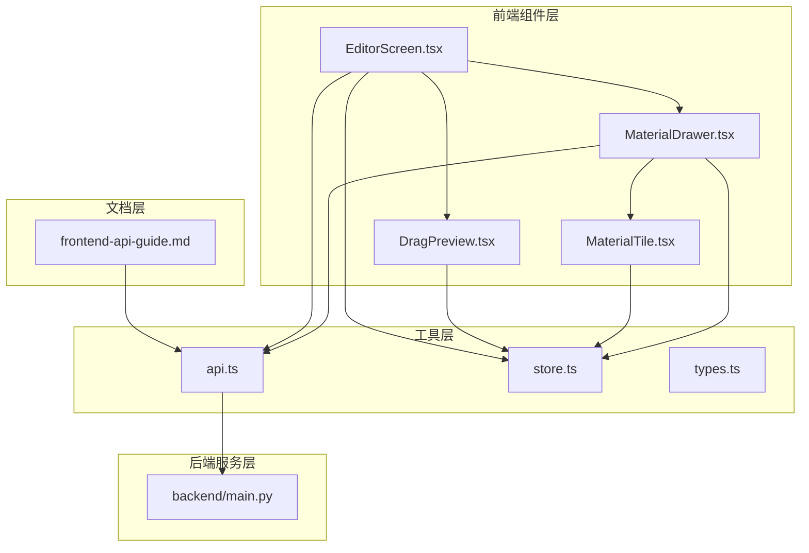
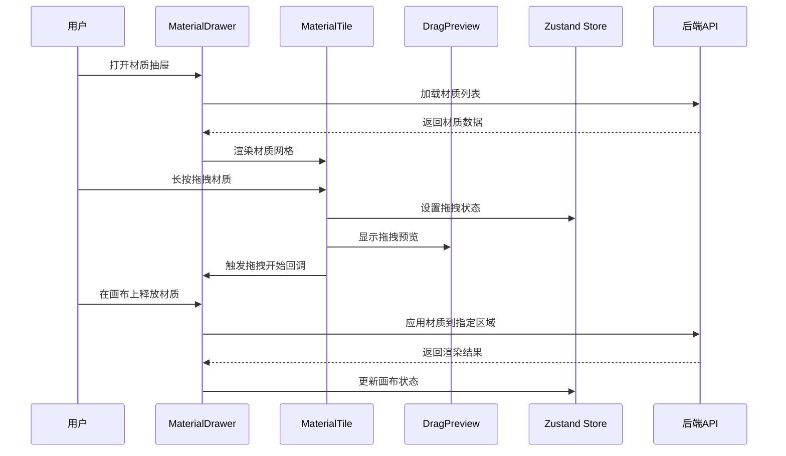
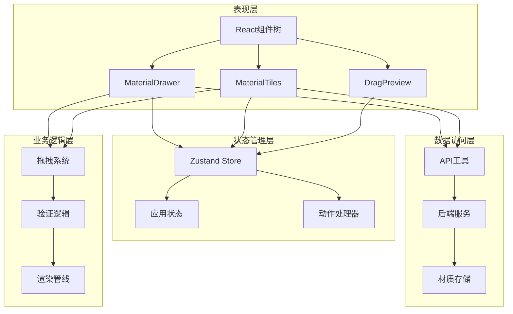
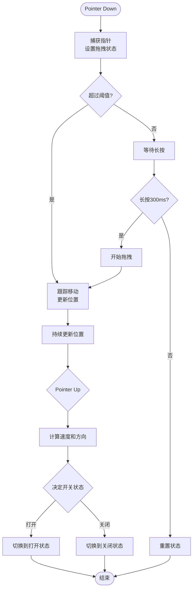
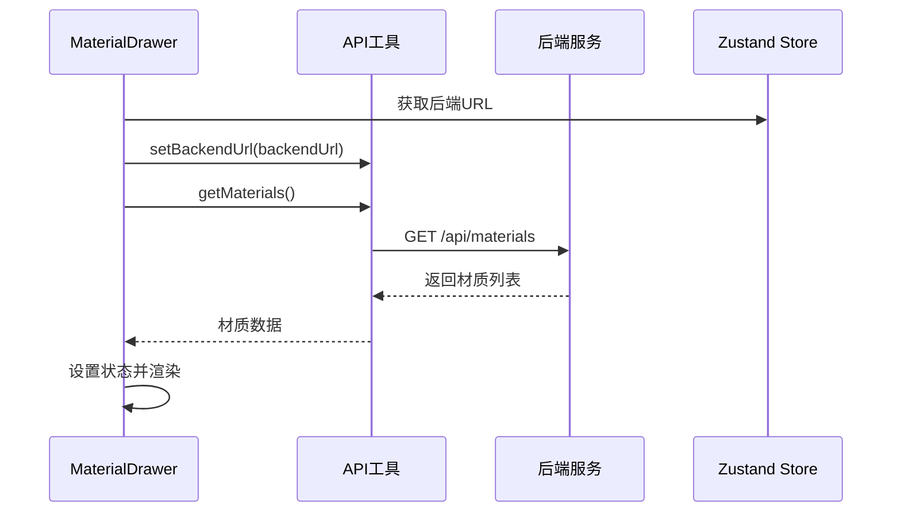
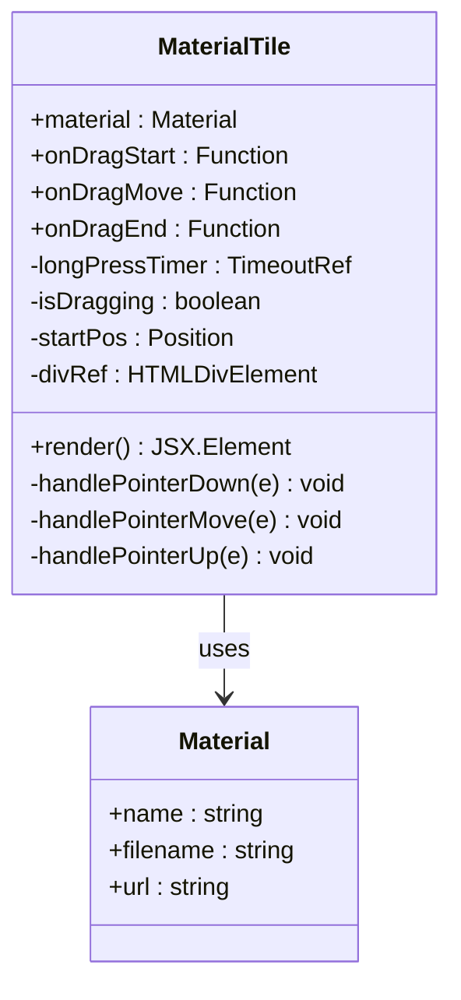
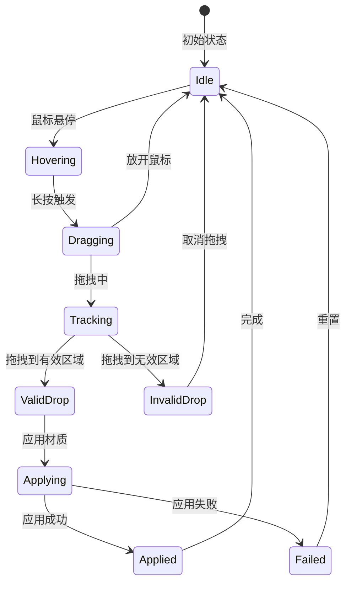
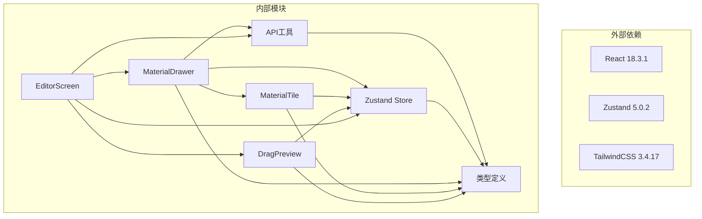

# 材质抽屉组件

<cite>
**本文档引用的文件**
- [MaterialDrawer.tsx](file://src/components/MaterialDrawer.tsx)
- [MaterialTile.tsx](file://src/components/MaterialTile.tsx)
- [DragPreview.tsx](file://src/components/DragPreview.tsx)
- [EditorScreen.tsx](file://src/screens/EditorScreen.tsx)
- [api.ts](file://src/utils/api.ts)
- [store.ts](file://src/store.ts)
- [types.ts](file://src/types.ts)
- [main.py](file://backend/main.py)
- [frontend-api-guide.md](file://docs/frontend-api-guide.md)
</cite>

## 目录
1. [简介](#简介)
2. [项目结构](#项目结构)
3. [核心组件](#核心组件)
4. [架构概览](#架构概览)
5. [详细组件分析](#详细组件分析)
6. [依赖关系分析](#依赖关系分析)
7. [性能考虑](#性能考虑)
8. [故障排除指南](#故障排除指南)
9. [结论](#结论)

## 简介

材质抽屉组件是 WallChanger 应用程序中的核心交互组件，负责提供材质库的浏览、搜索和拖拽应用功能。该组件实现了完整的材质选择工作流，从材质库加载到最终应用到画布的全过程。

该组件采用现代化的 React Hooks 架构，结合 TypeScript 提供类型安全的开发体验。通过拖拽交互系统，用户可以直观地将材质应用到墙体区域，同时提供了丰富的视觉反馈和状态管理机制。

## 项目结构

项目采用模块化的组件架构，主要文件组织如下：

**图表来源**
- [MaterialDrawer.tsx:1-136](file://src/components/MaterialDrawer.tsx#L1-L136)
- [MaterialTile.tsx:1-106](file://src/components/MaterialTile.tsx#L1-L106)
- [EditorScreen.tsx:1-758](file://src/screens/EditorScreen.tsx#L1-L758)

**章节来源**
- [MaterialDrawer.tsx:1-136](file://src/components/MaterialDrawer.tsx#L1-L136)
- [MaterialTile.tsx:1-106](file://src/components/MaterialTile.tsx#L1-L106)
- [EditorScreen.tsx:1-758](file://src/screens/EditorScreen.tsx#L1-L758)

## 核心组件

材质抽屉组件由多个相互协作的组件构成，每个组件都有明确的职责分工：

### 主要组件职责

1. **MaterialDrawer**: 主容器组件，负责材质抽屉的整体布局、拖拽手势处理和材质列表渲染
2. **MaterialTile**: 单个材质项组件，实现材质图片的加载、长按拖拽和点击交互
3. **DragPreview**: 拖拽预览组件，提供拖拽过程中的视觉反馈
4. **EditorScreen**: 编辑器屏幕组件，协调整个材质应用流程

### 组件间通信

**图表来源**
- [MaterialDrawer.tsx:15-136](file://src/components/MaterialDrawer.tsx#L15-L136)
- [MaterialTile.tsx:12-106](file://src/components/MaterialTile.tsx#L12-L106)
- [DragPreview.tsx:8-33](file://src/components/DragPreview.tsx#L8-L33)
- [EditorScreen.tsx:258-345](file://src/screens/EditorScreen.tsx#L258-L345)

**章节来源**
- [MaterialDrawer.tsx:15-136](file://src/components/MaterialDrawer.tsx#L15-L136)
- [MaterialTile.tsx:12-106](file://src/components/MaterialTile.tsx#L12-L106)
- [DragPreview.tsx:8-33](file://src/components/DragPreview.tsx#L8-L33)
- [EditorScreen.tsx:258-345](file://src/screens/EditorScreen.tsx#L258-L345)

## 架构概览

材质抽屉组件采用了分层架构设计，确保了良好的代码组织和可维护性：

**图表来源**
- [store.ts:63-177](file://src/store.ts#L63-L177)
- [api.ts:15-200](file://src/utils/api.ts#L15-L200)
- [MaterialDrawer.tsx:15-136](file://src/components/MaterialDrawer.tsx#L15-L136)

### 状态管理模式

组件使用 Zustand 状态管理库实现全局状态控制：

- **应用状态**: 包含当前图像、蒙版、处理步骤等核心数据
- **拖拽状态**: 管理材质拖拽过程中的临时状态
- **配置状态**: 存储后端URL、调试设置等配置信息

**章节来源**
- [store.ts:40-89](file://src/store.ts#L40-L89)
- [store.ts:63-177](file://src/store.ts#L63-L177)

## 详细组件分析

### MaterialDrawer 组件分析

MaterialDrawer 是材质抽屉的核心容器组件，实现了完整的拖拽交互和材质展示功能。

#### 核心功能特性

1. **动态高度计算**: 根据屏幕尺寸动态计算最大拖拽距离
2. **惯性滑动算法**: 实现流畅的抽屉开关体验
3. **材质网格渲染**: 支持响应式网格布局
4. **加载状态管理**: 提供加载指示器和错误处理

#### 拖拽手势处理

**图表来源**
- [MaterialDrawer.tsx:40-82](file://src/components/MaterialDrawer.tsx#L40-L82)

#### 材质加载机制

组件通过 API 工具从后端加载材质信息：

**图表来源**
- [MaterialDrawer.tsx:26-33](file://src/components/MaterialDrawer.tsx#L26-L33)
- [api.ts:15-19](file://src/utils/api.ts#L15-L19)

**章节来源**
- [MaterialDrawer.tsx:15-136](file://src/components/MaterialDrawer.tsx#L15-L136)
- [api.ts:15-19](file://src/utils/api.ts#L15-L19)

### MaterialTile 组件分析

MaterialTile 实现了单个材质项的完整交互逻辑，包括长按拖拽和点击处理。

#### 长按拖拽实现

组件使用原生 Pointer Events API 实现精确的拖拽控制：

1. **长按检测**: 300ms 长按触发拖拽模式
2. **拖拽阈值**: 超过 10px 移动距离才确认拖拽
3. **指针捕获**: 使用 `setPointerCapture` 确保拖拽事件的连续性
4. **稳定回调**: 通过 useRef 避免闭包陷阱

#### 材质图片加载

**图表来源**
- [MaterialTile.tsx:5-25](file://src/components/MaterialTile.tsx#L5-L25)
- [types.ts:8-12](file://src/types.ts#L8-L12)

**章节来源**
- [MaterialTile.tsx:12-106](file://src/components/MaterialTile.tsx#L12-L106)
- [types.ts:8-12](file://src/types.ts#L8-L12)

### DragPreview 组件分析

DragPreview 提供拖拽过程中的视觉反馈，增强了用户体验。

#### 预览渲染机制

组件根据拖拽位置实时更新预览元素的位置和透明度：

1. **固定尺寸**: 72x72px 的圆形预览框
2. **边框效果**: 白色边框和阴影增强立体感
3. **透明度控制**: 90% 透明度确保不影响画布预览
4. **实时跟随**: 基于鼠标位置的精确跟随

**章节来源**
- [DragPreview.tsx:8-33](file://src/components/DragPreview.tsx#L8-L33)

### 拖拽交互系统

拖拽交互系统是材质抽屉的核心功能，实现了从材质选择到应用的完整流程。

#### 交互流程

#### 状态管理

拖拽过程涉及多个状态的转换，组件通过 Zustand 状态管理确保状态一致性：

- **draggingMaterial**: 当前拖拽的材质对象
- **hoveredMaskId**: 悬停的蒙版ID
- **isApplying**: 应用过程中的互斥锁

**章节来源**
- [EditorScreen.tsx:258-345](file://src/screens/EditorScreen.tsx#L258-L345)
- [store.ts:54-56](file://src/store.ts#L54-L56)

## 依赖关系分析

材质抽屉组件的依赖关系清晰明确，遵循单一职责原则：

**图表来源**
- [package.json:11-25](file://package.json#L11-L25)
- [MaterialDrawer.tsx:1-5](file://src/components/MaterialDrawer.tsx#L1-L5)
- [MaterialTile.tsx:1-3](file://src/components/MaterialTile.tsx#L1-L3)

### 关键依赖说明

1. **React**: 提供组件化开发框架和 Hooks API
2. **Zustand**: 轻量级状态管理解决方案
3. **TailwindCSS**: 实用优先的CSS框架
4. **TypeScript**: 提供类型安全保障

**章节来源**
- [package.json:11-25](file://package.json#L11-L25)
- [MaterialDrawer.tsx:1-5](file://src/components/MaterialDrawer.tsx#L1-L5)

## 性能考虑

材质抽屉组件在设计时充分考虑了性能优化：

### 渲染优化

1. **虚拟滚动**: 材质网格使用 CSS Grid 实现高效渲染
2. **懒加载**: 材质图片使用 `crossOrigin="anonymous"` 支持缓存
3. **状态最小化**: 仅在必要时重新渲染组件

### 内存管理

1. **事件监听器清理**: 组件卸载时自动移除事件监听器
2. **定时器清理**: 长按定时器在组件卸载时自动清理
3. **引用优化**: 使用 useRef 避免不必要的重渲染

### 网络优化

1. **后端URL缓存**: 使用 localStorage 缓存后端URL配置
2. **图片缓存**: 材质图片支持浏览器缓存机制
3. **请求去重**: 避免重复的材质列表请求

## 故障排除指南

### 常见问题及解决方案

#### 材质无法加载

**症状**: 材质抽屉显示"暂无材质"

**可能原因**:
1. 后端服务未启动
2. 材质文件夹为空
3. CORS 配置错误

**解决步骤**:
1. 检查后端服务状态
2. 确认 `public/materials` 目录包含材质文件
3. 验证 CORS 配置

#### 拖拽功能异常

**症状**: 长按无法触发拖拽或拖拽位置不准确

**可能原因**:
1. Pointer Events 不支持
2. 事件监听器冲突
3. 坐标计算错误

**解决步骤**:
1. 检查浏览器兼容性
2. 确认没有其他元素拦截指针事件
3. 验证坐标转换逻辑

#### 应用材质失败

**症状**: 拖拽到画布后材质未应用

**可能原因**:
1. 后端API不可用
2. 材质文件损坏
3. 蒙版数据缺失

**解决步骤**:
1. 检查后端服务健康状态
2. 验证材质文件完整性
3. 确认蒙版数据存在

**章节来源**
- [MaterialDrawer.tsx:114-119](file://src/components/MaterialDrawer.tsx#L114-L119)
- [EditorScreen.tsx:338-344](file://src/screens/EditorScreen.tsx#L338-L344)

## 结论

材质抽屉组件是一个设计精良、功能完整的交互组件，实现了以下关键特性：

### 技术优势

1. **现代化架构**: 采用 React Hooks 和 TypeScript 提供类型安全
2. **流畅交互**: 原生 Pointer Events API 实现精确的拖拽控制
3. **状态管理**: Zustand 简化了复杂的状态管理逻辑
4. **性能优化**: 多层次的性能优化确保流畅的用户体验

### 功能完整性

1. **完整的材质工作流**: 从加载到应用的全流程支持
2. **丰富的视觉反馈**: 拖拽预览和状态指示
3. **错误处理**: 完善的错误处理和用户提示机制
4. **可扩展性**: 清晰的架构设计便于功能扩展

### 最佳实践

该组件体现了现代前端开发的最佳实践，包括：
- 单一职责原则的组件设计
- 响应式和无障碍友好的界面
- 类型安全的开发体验
- 性能优先的实现策略

通过深入分析这个组件，开发者可以学习到如何构建高质量、高性能的 React 组件，并将其应用到类似的图像编辑和素材管理系统中。