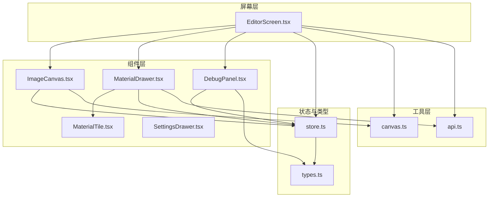
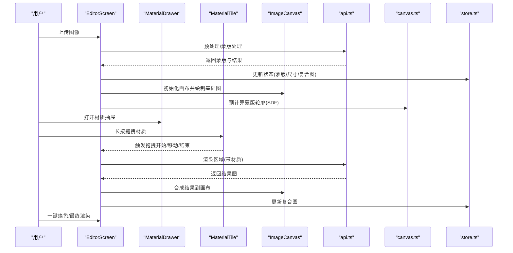
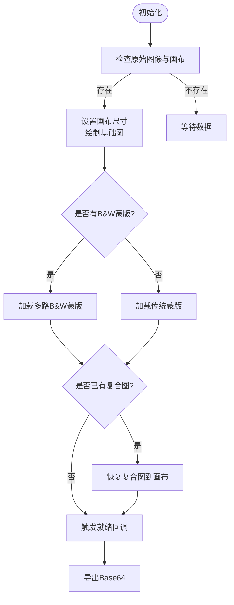
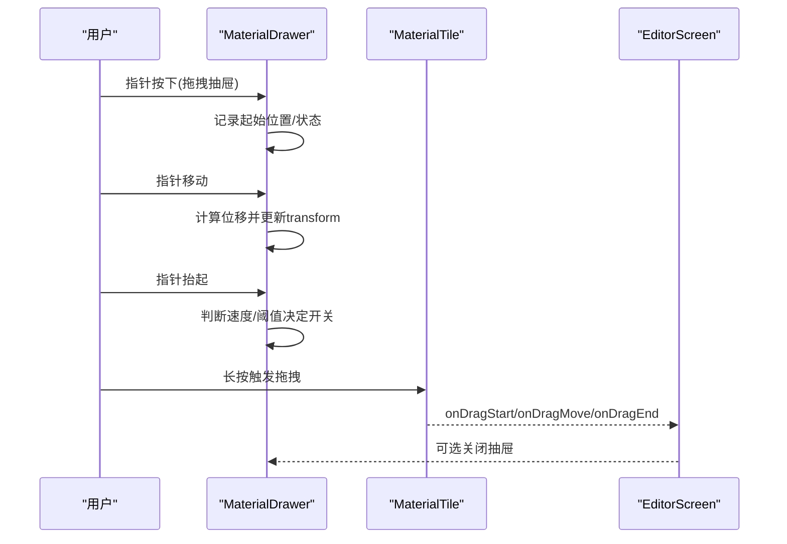
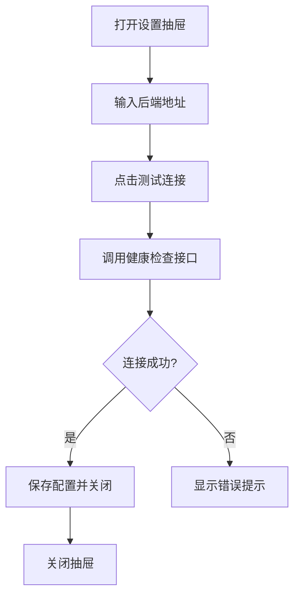
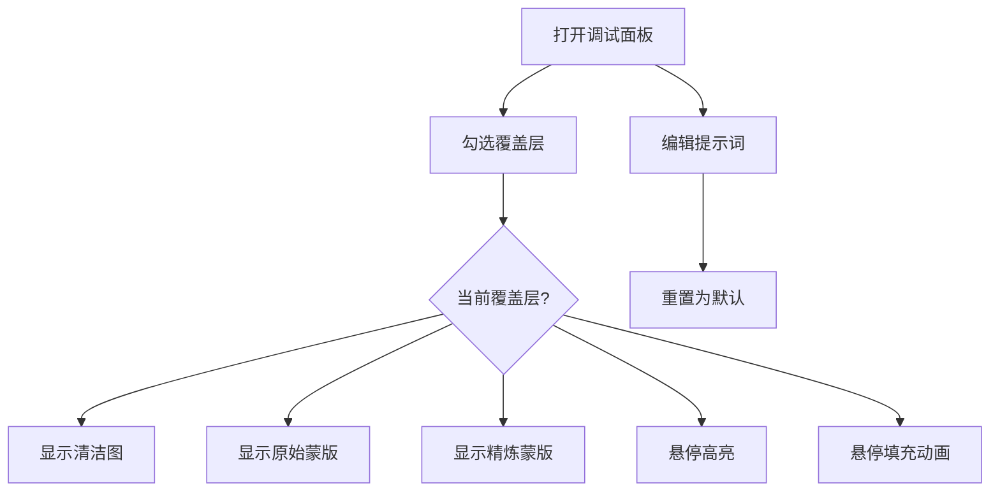
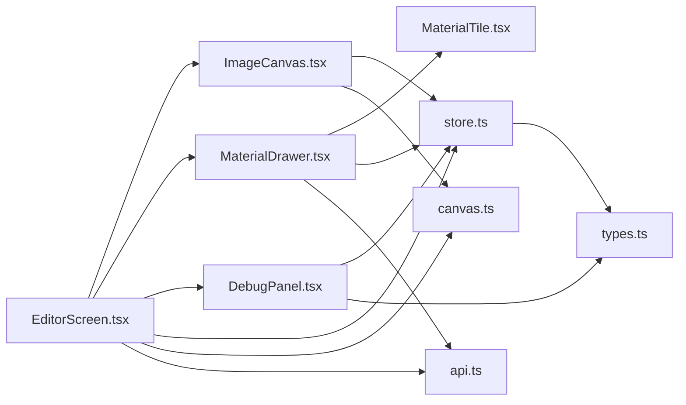

# 核心组件

<cite>
**本文引用的文件**
- [ImageCanvas.tsx](file://src/components/ImageCanvas.tsx)
- [MaterialDrawer.tsx](file://src/components/MaterialDrawer.tsx)
- [MaterialTile.tsx](file://src/components/MaterialTile.tsx)
- [SettingsDrawer.tsx](file://src/components/SettingsDrawer.tsx)
- [DebugPanel.tsx](file://src/components/DebugPanel.tsx)
- [canvas.ts](file://src/utils/canvas.ts)
- [EditorScreen.tsx](file://src/screens/EditorScreen.tsx)
- [store.ts](file://src/store.ts)
- [types.ts](file://src/types.ts)
- [api.ts](file://src/utils/api.ts)
</cite>

## 目录
1. [简介](#简介)
2. [项目结构](#项目结构)
3. [核心组件](#核心组件)
4. [架构总览](#架构总览)
5. [详细组件分析](#详细组件分析)
6. [依赖关系分析](#依赖关系分析)
7. [性能考量](#性能考量)
8. [故障排查指南](#故障排查指南)
9. [结论](#结论)
10. [附录](#附录)

## 简介
本文件面向 WallChanger 的核心 UI 组件，围绕以下目标展开：
- 图像画布组件（ImageCanvas）：Canvas 2D 渲染实现、蒙版合成算法与实时预览
- 材质抽屉组件（MaterialDrawer）：拖拽交互、材质管理与材质球渲染机制
- 设置抽屉组件（SettingsDrawer）：配置管理、调试模式与系统设置
- 调试面板组件（DebugPanel）：日志记录、性能监控与问题诊断

文档将提供组件 API、属性配置、事件处理与样式定制的完整指南，并通过可视化图表帮助理解数据流与控制流。

## 项目结构
核心组件位于 src/components，配合工具模块 src/utils、状态管理 src/store、类型定义 src/types，以及屏幕容器 src/screens/EditorScreen.tsx。

**图表来源**
- [EditorScreen.tsx:1-758](file://src/screens/EditorScreen.tsx#L1-L758)
- [ImageCanvas.tsx:1-91](file://src/components/ImageCanvas.tsx#L1-L91)
- [MaterialDrawer.tsx:1-136](file://src/components/MaterialDrawer.tsx#L1-L136)
- [MaterialTile.tsx:1-106](file://src/components/MaterialTile.tsx#L1-L106)
- [SettingsDrawer.tsx:1-113](file://src/components/SettingsDrawer.tsx#L1-L113)
- [DebugPanel.tsx:1-91](file://src/components/DebugPanel.tsx#L1-L91)
- [canvas.ts:1-905](file://src/utils/canvas.ts#L1-L905)
- [api.ts:1-200](file://src/utils/api.ts#L1-L200)
- [store.ts:1-177](file://src/store.ts#L1-L177)
- [types.ts:1-89](file://src/types.ts#L1-L89)

**章节来源**
- [EditorScreen.tsx:1-758](file://src/screens/EditorScreen.tsx#L1-L758)
- [store.ts:1-177](file://src/store.ts#L1-L177)
- [types.ts:1-89](file://src/types.ts#L1-L89)

## 核心组件
- ImageCanvas：负责基础图像绘制、蒙版加载与复合图像渲染；提供导出能力与就绪回调。
- MaterialDrawer：材质库抽屉，支持手势拖拽、材质网格展示与拖拽事件分发。
- MaterialTile：单个材质球，实现长按触发拖拽、指针事件捕获与跨浏览器兼容。
- SettingsDrawer：系统设置抽屉，管理后端地址、健康检查与保存逻辑。
- DebugPanel：调试面板，控制覆盖层显示、提示词编辑与默认值重置。

**章节来源**
- [ImageCanvas.tsx:1-91](file://src/components/ImageCanvas.tsx#L1-L91)
- [MaterialDrawer.tsx:1-136](file://src/components/MaterialDrawer.tsx#L1-L136)
- [MaterialTile.tsx:1-106](file://src/components/MaterialTile.tsx#L1-L106)
- [SettingsDrawer.tsx:1-113](file://src/components/SettingsDrawer.tsx#L1-L113)
- [DebugPanel.tsx:1-91](file://src/components/DebugPanel.tsx#L1-L91)

## 架构总览
整体流程：用户上传图像 → 预处理与蒙版生成 → 编辑阶段选择区域 → 拖拽材质到目标区域 → 后端渲染并合成到画布 → 最终渲染输出。

**图表来源**
- [EditorScreen.tsx:257-345](file://src/screens/EditorScreen.tsx#L257-L345)
- [MaterialTile.tsx:35-89](file://src/components/MaterialTile.tsx#L35-L89)
- [ImageCanvas.tsx:33-80](file://src/components/ImageCanvas.tsx#L33-L80)
- [canvas.ts:182-324](file://src/utils/canvas.ts#L182-L324)
- [api.ts:141-157](file://src/utils/api.ts#L141-L157)
- [store.ts:68-115](file://src/store.ts#L68-L115)

## 详细组件分析

### ImageCanvas 组件
- 职责
  - 初始化主画布并绘制原始图像
  - 加载蒙版（支持二值蒙版与传统彩色蒙版）
  - 在存在复合图时恢复其到画布顶部
  - 提供导出 Base64 的能力
- 关键实现要点
  - 使用 offscreen Canvas 存储蒙版，避免主线程阻塞
  - 支持多路 B&W 蒙版管线（每个墙体一个二值蒙版）
  - 通过 useImperativeHandle 暴漏句柄方法
- 数据流
  - 输入：originalImage、refinedMask/rawMask、maskImages、compositeImage、dimensions
  - 输出：onReady 回调、导出 Base64
- 性能特性
  - 使用 willReadFrequently 上下文优化像素读取
  - 异步加载与预计算，避免阻塞主线程

**图表来源**
- [ImageCanvas.tsx:33-80](file://src/components/ImageCanvas.tsx#L33-L80)
- [canvas.ts:720-789](file://src/utils/canvas.ts#L720-L789)

**章节来源**
- [ImageCanvas.tsx:1-91](file://src/components/ImageCanvas.tsx#L1-L91)
- [canvas.ts:720-789](file://src/utils/canvas.ts#L720-L789)

### MaterialDrawer 组件
- 职责
  - 展示材质库网格，支持手势拖拽抽屉
  - 从后端拉取材质列表
  - 将拖拽事件转发给父级（EditorScreen）
- 交互设计
  - 手势：按下记录初始状态，移动时计算位移，松开时根据速度或位置决定开关
  - 拖拽：长按触发，指针事件捕获，拖动过程中更新悬停区域
- 状态与存储
  - 通过 useStore 获取 backendUrl 并设置到 API 模块
  - 材质列表与加载状态本地维护

**图表来源**
- [MaterialDrawer.tsx:40-82](file://src/components/MaterialDrawer.tsx#L40-L82)
- [MaterialTile.tsx:35-89](file://src/components/MaterialTile.tsx#L35-L89)
- [EditorScreen.tsx:257-345](file://src/screens/EditorScreen.tsx#L257-L345)

**章节来源**
- [MaterialDrawer.tsx:1-136](file://src/components/MaterialDrawer.tsx#L1-L136)
- [MaterialTile.tsx:1-106](file://src/components/MaterialTile.tsx#L1-L106)
- [EditorScreen.tsx:257-345](file://src/screens/EditorScreen.tsx#L257-L345)

### SettingsDrawer 组件
- 职责
  - 管理后端地址输入与保存
  - 健康检查（连接性与模型加载状态）
  - 与全局 store 同步配置
- 行为
  - 测试连接时切换状态并调用后端健康接口
  - 保存时写入本地存储并同步到 API 模块

**图表来源**
- [SettingsDrawer.tsx:18-34](file://src/components/SettingsDrawer.tsx#L18-L34)
- [api.ts:9-13](file://src/utils/api.ts#L9-L13)
- [store.ts:121-124](file://src/store.ts#L121-L124)

**章节来源**
- [SettingsDrawer.tsx:1-113](file://src/components/SettingsDrawer.tsx#L1-L113)
- [api.ts:1-200](file://src/utils/api.ts#L1-L200)
- [store.ts:1-177](file://src/store.ts#L1-L177)

### DebugPanel 组件
- 职责
  - 控制覆盖层显示（清洁图、原始蒙版、精炼蒙版、悬停高亮/填充）
  - 编辑调试提示词（增强、清理、精炼、应用材质、最终渲染）
  - 默认提示词重置
- 交互
  - 复选框切换覆盖层
  - 文本域编辑提示词，支持折叠/展开

**图表来源**
- [DebugPanel.tsx:36-89](file://src/components/DebugPanel.tsx#L36-L89)
- [EditorScreen.tsx:544-561](file://src/screens/EditorScreen.tsx#L544-L561)

**章节来源**
- [DebugPanel.tsx:1-91](file://src/components/DebugPanel.tsx#L1-L91)
- [EditorScreen.tsx:544-561](file://src/screens/EditorScreen.tsx#L544-L561)

## 依赖关系分析

**图表来源**
- [EditorScreen.tsx:1-758](file://src/screens/EditorScreen.tsx#L1-L758)
- [ImageCanvas.tsx:1-91](file://src/components/ImageCanvas.tsx#L1-L91)
- [MaterialDrawer.tsx:1-136](file://src/components/MaterialDrawer.tsx#L1-L136)
- [MaterialTile.tsx:1-106](file://src/components/MaterialTile.tsx#L1-L106)
- [DebugPanel.tsx:1-91](file://src/components/DebugPanel.tsx#L1-L91)
- [canvas.ts:1-905](file://src/utils/canvas.ts#L1-L905)
- [api.ts:1-200](file://src/utils/api.ts#L1-L200)
- [store.ts:1-177](file://src/store.ts#L1-L177)
- [types.ts:1-89](file://src/types.ts#L1-L89)

**章节来源**
- [EditorScreen.tsx:1-758](file://src/screens/EditorScreen.tsx#L1-L758)
- [store.ts:1-177](file://src/store.ts#L1-L177)
- [types.ts:1-89](file://src/types.ts#L1-L89)

## 性能考量
- Canvas 2D 优化
  - 使用 willReadFrequently 上下文提升 getImageData 性能
  - 分离 offscreen Canvas 存储蒙版，避免主线程阻塞
  - 预计算 SDF 与命中表，减少运行时开销
- 渲染管线
  - 仅在需要时绘制覆盖层与动画，及时清理画布
  - 使用 requestAnimationFrame 驱动闪烁动画，避免高频重绘
- 网络与状态
  - 健康检查与材质加载异步进行，避免阻塞 UI
  - 使用本地存储缓存后端地址与调试提示词，减少重复请求

[本节为通用指导，无需特定文件来源]

## 故障排查指南
- 连接后端失败
  - 检查 SettingsDrawer 中的后端地址是否正确
  - 使用“测试连接”按钮查看状态变化
  - 确认后端服务已启动且健康检查接口可用
- 材质无法加载
  - 确认后端 /materials 接口返回有效数据
  - 检查跨域与 CORS 配置
- 蒙版不匹配或渲染异常
  - 确认蒙版颜色或二值蒙版与后端输出一致
  - 使用 DebugPanel 显示原始/精炼蒙版辅助定位
- 拖拽无效
  - 确保 MaterialTile 的长按触发阈值与指针事件捕获正常
  - 检查 EditorScreen 的 hover 区域计算与 getMaskAtPixel 结果

**章节来源**
- [SettingsDrawer.tsx:18-34](file://src/components/SettingsDrawer.tsx#L18-L34)
- [api.ts:9-19](file://src/utils/api.ts#L9-L19)
- [canvas.ts:182-324](file://src/utils/canvas.ts#L182-L324)
- [MaterialTile.tsx:35-89](file://src/components/MaterialTile.tsx#L35-L89)
- [EditorScreen.tsx:209-226](file://src/screens/EditorScreen.tsx#L209-L226)

## 结论
本文档系统梳理了 WallChanger 的核心 UI 组件，重点阐述了：
- ImageCanvas 的 Canvas 2D 渲染与蒙版合成算法
- MaterialDrawer 的拖拽交互与材质管理
- SettingsDrawer 的配置与健康检查
- DebugPanel 的覆盖层与提示词管理

通过可视化图表与源码级引用，读者可以快速理解组件职责、数据流与关键实现细节，并据此进行扩展与优化。

[本节为总结性内容，无需特定文件来源]

## 附录

### 组件 API 与属性配置

- ImageCanvas
  - 属性
    - onReady: 就绪回调
  - 方法（通过 ref）
    - getCanvas(): 返回 HTMLCanvasElement
    - exportBase64(): 返回 PNG Base64 字符串
  - 依赖状态
    - originalImage、refinedMask、rawMask、maskImages、compositeImage、dimensions

- MaterialDrawer
  - 属性
    - open: 是否打开
    - onToggle: 切换抽屉
    - onDragStart: 开始拖拽
    - onDragMove: 拖拽中
    - onDragEnd: 结束拖拽（Promise<boolean>）
  - 内部状态
    - loading: 材质加载状态
    - translateY: 当前抽屉位移
  - 依赖
    - backendUrl（来自 store）

- MaterialTile
  - 属性
    - material: 材质对象
    - onDragStart/onDragMove/onDragEnd: 拖拽事件回调
  - 交互
    - 长按触发拖拽，指针事件捕获

- SettingsDrawer
  - 属性
    - open: 是否打开
    - onClose: 关闭回调
  - 内部状态
    - url: 后端地址
    - status: 连接状态
    - modelLoaded: 模型加载状态
  - 功能
    - 测试连接
    - 保存配置

- DebugPanel
  - 属性
    - flags: 覆盖层开关
    - onChange: 修改覆盖层
    - prompts: 调试提示词
    - onPromptsChange: 修改提示词
  - 功能
    - 覆盖层切换
    - 提示词编辑与重置

**章节来源**
- [ImageCanvas.tsx:6-31](file://src/components/ImageCanvas.tsx#L6-L31)
- [MaterialDrawer.tsx:7-13](file://src/components/MaterialDrawer.tsx#L7-L13)
- [MaterialTile.tsx:5-10](file://src/components/MaterialTile.tsx#L5-L10)
- [SettingsDrawer.tsx:5-8](file://src/components/SettingsDrawer.tsx#L5-L8)
- [DebugPanel.tsx:13-18](file://src/components/DebugPanel.tsx#L13-L18)

### 事件处理与样式定制

- 事件处理
  - 拖拽：MaterialTile 使用原生 pointer 事件，长按 300ms 触发拖拽
  - 抽屉：MaterialDrawer 使用 pointer 事件与速度/阈值判断
  - 悬停：EditorScreen 使用 mousemove/mouseleave 进行区域检测
  - 点击：EditorScreen 支持点击选择区域与外部点击取消

- 样式定制
  - 使用 Tailwind 类名控制布局与外观
  - 抽屉与面板采用 backdrop-blur 与半透明背景
  - Canvas 层叠顺序通过 z-index 控制，确保覆盖层正确叠加

**章节来源**
- [MaterialTile.tsx:35-89](file://src/components/MaterialTile.tsx#L35-L89)
- [MaterialDrawer.tsx:40-82](file://src/components/MaterialDrawer.tsx#L40-L82)
- [EditorScreen.tsx:209-226](file://src/screens/EditorScreen.tsx#L209-L226)
- [EditorScreen.tsx:484-757](file://src/screens/EditorScreen.tsx#L484-L757)