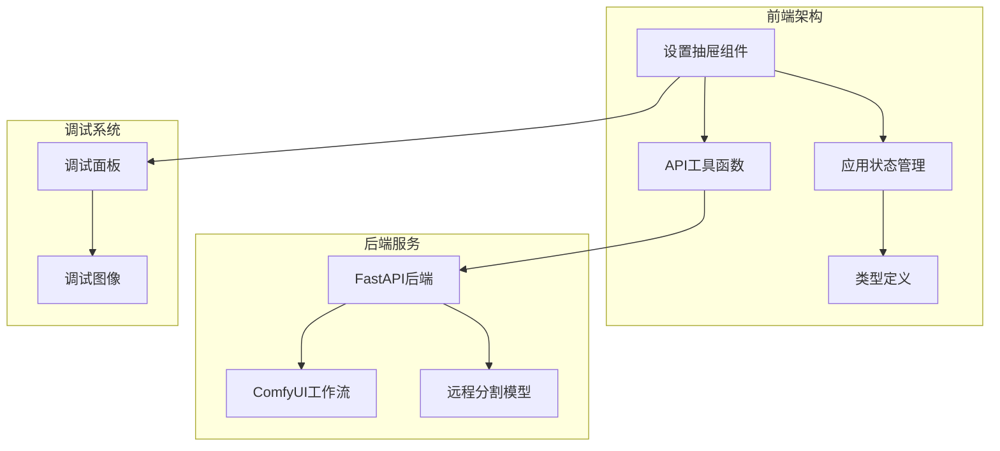
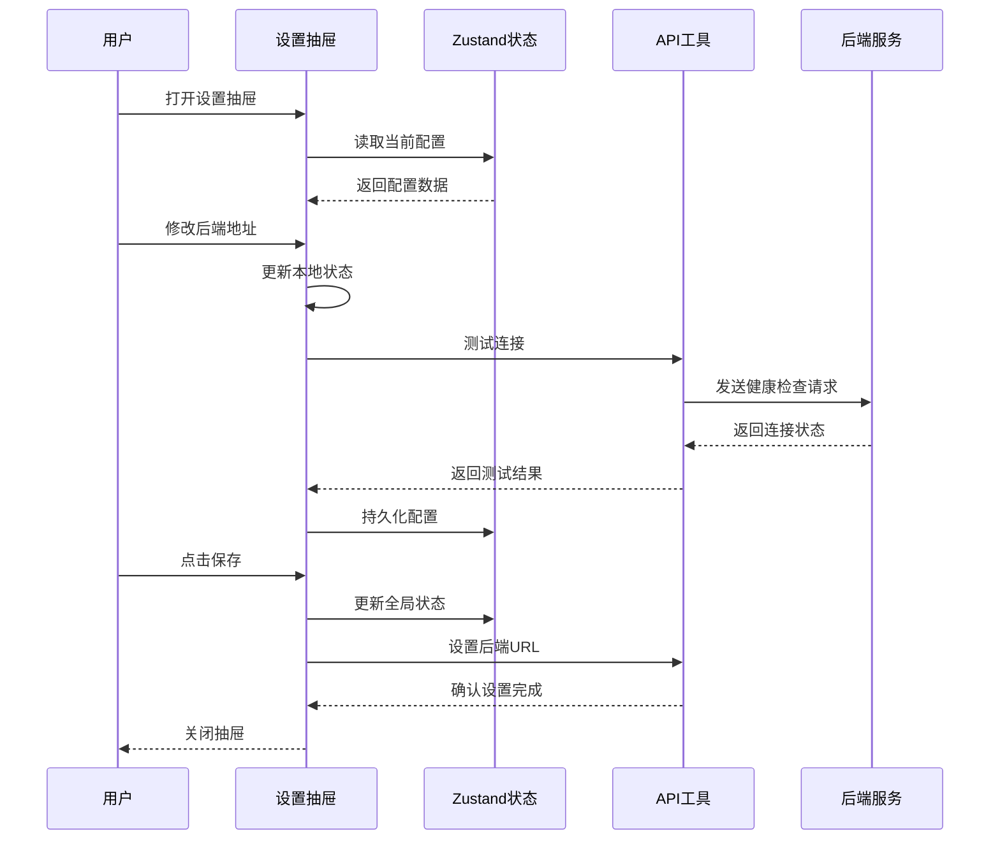
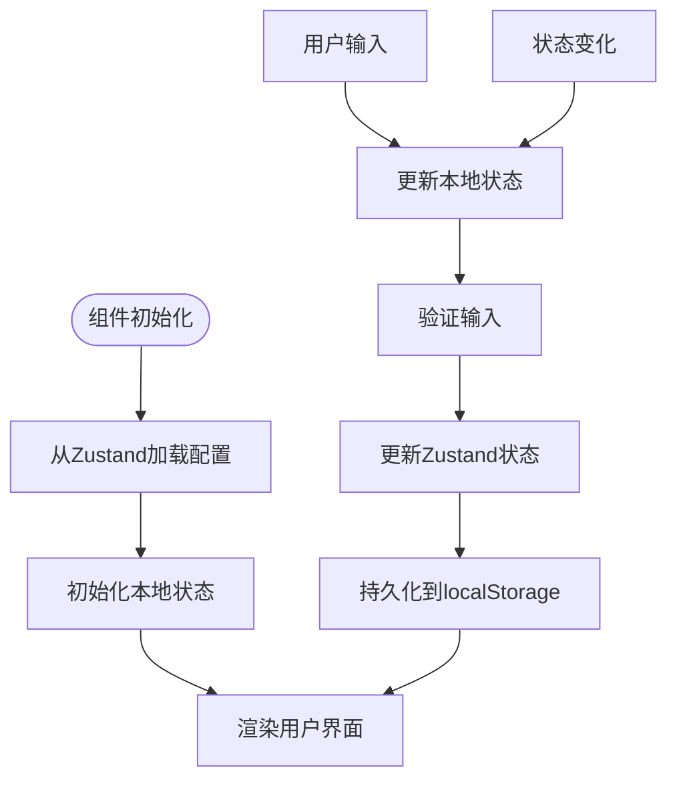
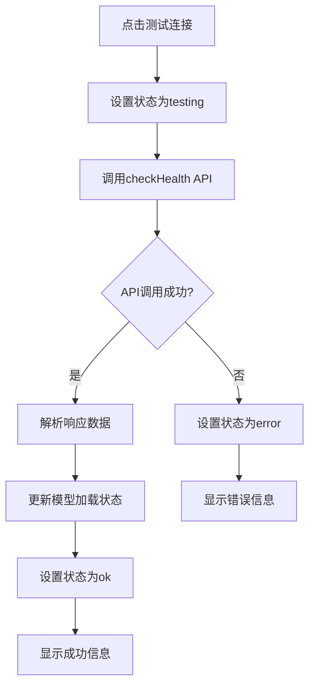
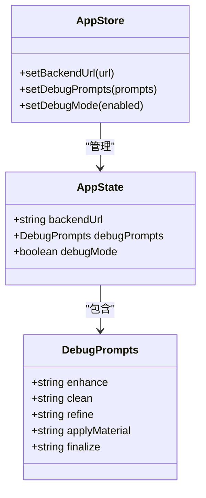
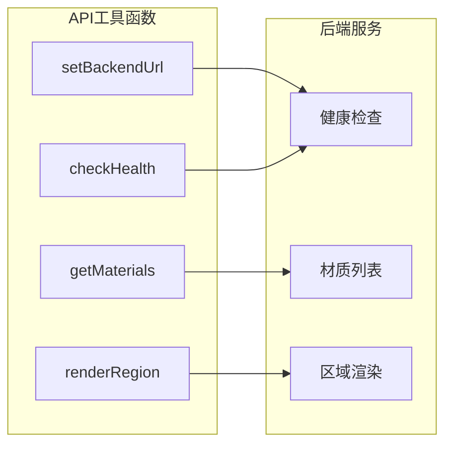
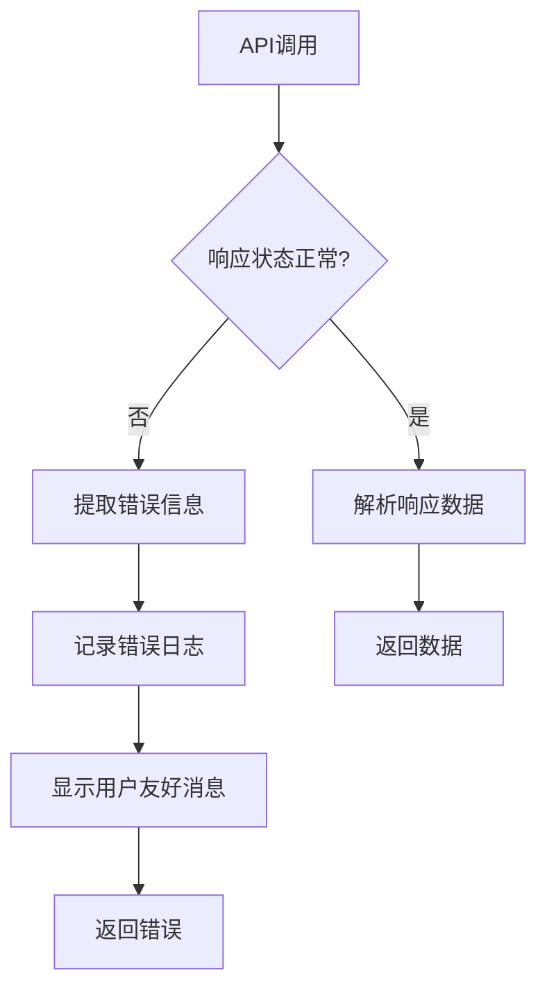
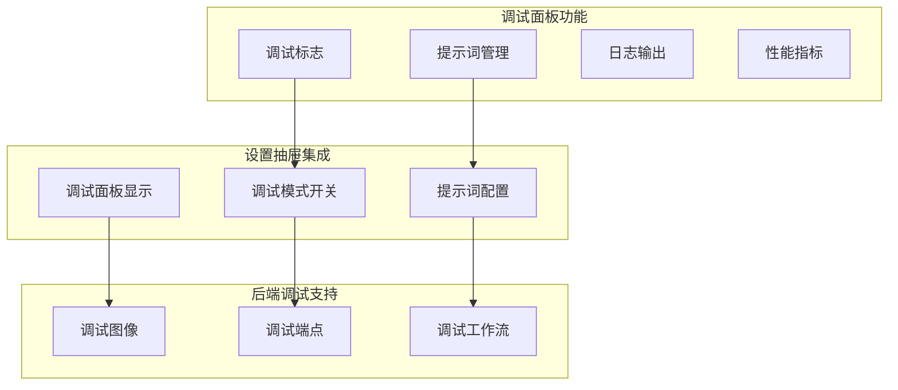
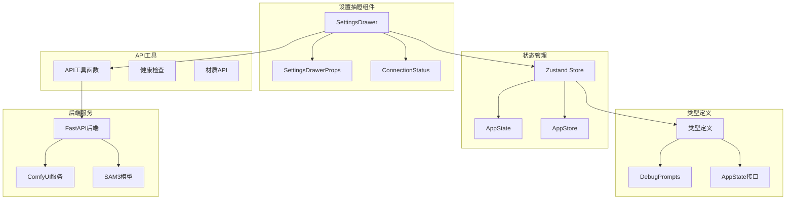
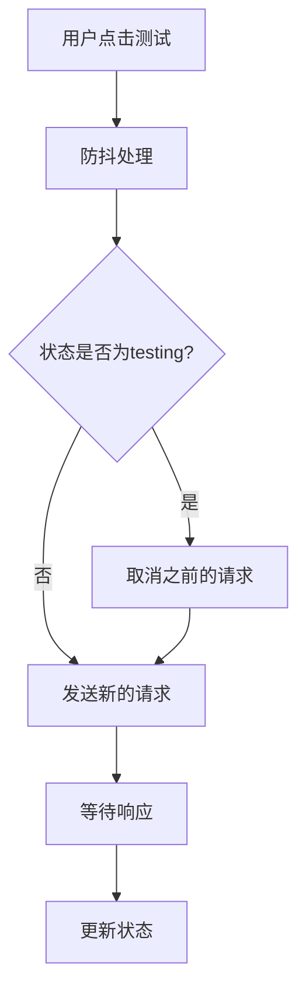

# 设置抽屉组件

<cite>
**本文档引用的文件**
- [SettingsDrawer.tsx](file://src/components/SettingsDrawer.tsx)
- [store.ts](file://src/store.ts)
- [types.ts](file://src/types.ts)
- [api.ts](file://src/utils/api.ts)
- [main.py](file://backend/main.py)
- [DebugPanel.tsx](file://src/components/DebugPanel.tsx)
- [EditorScreen.tsx](file://src/screens/EditorScreen.tsx)
- [UploadScreen.tsx](file://src/screens/UploadScreen.tsx)
</cite>

## 目录
1. [简介](#简介)
2. [项目结构](#项目结构)
3. [核心组件](#核心组件)
4. [架构概览](#架构概览)
5. [详细组件分析](#详细组件分析)
6. [依赖关系分析](#依赖关系分析)
7. [性能考虑](#性能考虑)
8. [故障排除指南](#故障排除指南)
9. [结论](#结论)
10. [附录](#附录)

## 简介

设置抽屉组件（SettingsDrawer）是WallChanger应用中的关键配置管理界面，负责管理系统的核心配置参数。该组件提供了后端连接设置、提示词配置和调试模式开关的统一管理界面，实现了完整的配置生命周期管理，包括数据绑定、验证规则和持久化机制。

WallChanger是一个基于AI的室内墙面材质更换应用，通过前端React组件与后端FastAPI服务进行交互，实现从图像上传到材质应用的完整工作流程。设置抽屉组件作为应用配置的核心入口，为用户提供了直观的配置管理体验。

## 项目结构

WallChanger项目采用模块化的前端架构，设置抽屉组件位于src/components目录下，与应用状态管理、类型定义和API工具函数紧密协作。

**图表来源**
- [SettingsDrawer.tsx:1-113](file://src/components/SettingsDrawer.tsx#L1-L113)
- [store.ts:1-177](file://src/store.ts#L1-L177)
- [types.ts:1-89](file://src/types.ts#L1-L89)

**章节来源**
- [SettingsDrawer.tsx:1-113](file://src/components/SettingsDrawer.tsx#L1-L113)
- [store.ts:1-177](file://src/store.ts#L1-L177)
- [types.ts:1-89](file://src/types.ts#L1-L89)

## 核心组件

设置抽屉组件由多个核心部分组成，每个部分都承担着特定的配置管理职责：

### 组件架构
- **状态管理**：集成Zustand全局状态管理，实现配置数据的持久化存储
- **数据绑定**：双向数据绑定机制，确保UI与状态的实时同步
- **验证机制**：连接状态验证，提供即时反馈
- **持久化存储**：localStorage集成，确保配置的跨会话持久化

### 配置管理范围
- **后端连接设置**：动态配置后端API地址，支持本地和远程部署
- **提示词配置**：管理调试模式下的提示词模板
- **调试模式开关**：控制调试功能的启用状态
- **连接状态监控**：实时监控后端连接健康状况

**章节来源**
- [SettingsDrawer.tsx:12-34](file://src/components/SettingsDrawer.tsx#L12-L34)
- [store.ts:121-134](file://src/store.ts#L121-L134)
- [types.ts:57-88](file://src/types.ts#L57-L88)

## 架构概览

设置抽屉组件在整个应用架构中扮演着配置管理中心的角色，通过清晰的分层设计实现了配置管理的解耦和可维护性。

**图表来源**
- [SettingsDrawer.tsx:18-34](file://src/components/SettingsDrawer.tsx#L18-L34)
- [api.ts:5-13](file://src/utils/api.ts#L5-L13)
- [store.ts:121-124](file://src/store.ts#L121-L124)

## 详细组件分析

### 设置抽屉组件实现

设置抽屉组件采用了现代化的React Hooks模式，结合Zustand状态管理和localStorage持久化机制，实现了完整的配置管理功能。

#### 数据绑定机制

组件使用useState Hook管理本地状态，结合useStore Hook访问全局状态，实现了双向数据绑定：

**图表来源**
- [SettingsDrawer.tsx:13-16](file://src/components/SettingsDrawer.tsx#L13-L16)
- [store.ts:121-124](file://src/store.ts#L121-L124)

#### 连接状态管理

组件实现了四状态连接检测机制，为用户提供清晰的连接状态反馈：

| 状态 | 描述 | UI表现 |
|------|------|--------|
| idle | 初始状态 | 显示空闲状态 |
| testing | 连接测试中 | 显示加载动画 |
| ok | 连接成功 | 显示成功信息和模型状态 |
| error | 连接失败 | 显示错误信息 |

#### 验证规则实现

连接验证通过异步健康检查实现，确保后端服务的可用性和模型加载状态：

**图表来源**
- [SettingsDrawer.tsx:18-28](file://src/components/SettingsDrawer.tsx#L18-L28)
- [api.ts:9-13](file://src/utils/api.ts#L9-L13)

**章节来源**
- [SettingsDrawer.tsx:12-113](file://src/components/SettingsDrawer.tsx#L12-L113)

### 状态管理集成

设置抽屉组件与Zustand状态管理系统的深度集成，实现了配置的持久化存储和跨组件共享。

#### 全局状态结构

应用状态包含以下配置相关字段：

**图表来源**
- [types.ts:57-88](file://src/types.ts#L57-L88)
- [types.ts:16-22](file://src/types.ts#L16-L22)
- [store.ts:5-28](file://src/store.ts#L5-L28)

#### 持久化策略

状态持久化通过localStorage实现，确保用户配置在页面刷新后仍然有效：

| 配置项 | 存储键 | 默认值 | 类型 |
|--------|--------|--------|------|
| 后端URL | backendUrl | 空字符串 | string |
| 调试提示词 | debugPrompts | 默认提示词 | DebugPrompts |
| 调试模式 | debugMode | false | boolean |

**章节来源**
- [store.ts:30-61](file://src/store.ts#L30-L61)
- [store.ts:121-134](file://src/store.ts#L121-L134)

### API集成实现

设置抽屉组件通过API工具函数与后端服务进行通信，实现了连接测试和配置更新功能。

#### API工具函数

**图表来源**
- [api.ts:5-7](file://src/utils/api.ts#L5-L7)
- [api.ts:9-13](file://src/utils/api.ts#L9-L13)
- [api.ts:15-19](file://src/utils/api.ts#L15-L19)

#### 错误处理机制

API调用实现了完善的错误处理机制，确保用户能够获得清晰的错误反馈：

**图表来源**
- [api.ts:29-33](file://src/utils/api.ts#L29-L33)
- [api.ts:123-137](file://src/utils/api.ts#L123-L137)

**章节来源**
- [api.ts:1-200](file://src/utils/api.ts#L1-L200)

### 调试面板集成

设置抽屉组件与调试面板的集成实现了完整的调试功能体系，包括日志记录、性能监控和问题诊断。

#### 调试功能架构

**图表来源**
- [DebugPanel.tsx:5-18](file://src/components/DebugPanel.tsx#L5-L18)
- [EditorScreen.tsx:603-608](file://src/screens/EditorScreen.tsx#L603-L608)

#### 日志记录机制

后端服务实现了详细的日志记录机制，为调试和问题诊断提供支持：

| 日志类别 | 记录时机 | 输出位置 |
|----------|----------|----------|
| 请求处理 | API请求接收 | 控制台 |
| 图像处理 | 图像转换过程 | 控制台 |
| 工作流执行 | ComfyUI任务调度 | 控制台 |
| 错误信息 | 异常捕获 | 控制台 |

**章节来源**
- [DebugPanel.tsx:1-91](file://src/components/DebugPanel.tsx#L1-L91)
- [EditorScreen.tsx:603-631](file://src/screens/EditorScreen.tsx#L603-L631)

## 依赖关系分析

设置抽屉组件与应用其他模块存在紧密的依赖关系，形成了清晰的分层架构。

**图表来源**
- [SettingsDrawer.tsx:1-8](file://src/components/SettingsDrawer.tsx#L1-L8)
- [store.ts:1-28](file://src/store.ts#L1-L28)
- [types.ts:1-89](file://src/types.ts#L1-L89)

### 组件耦合度分析

设置抽屉组件与其他组件的耦合度适中，既保证了功能的完整性，又保持了良好的模块独立性：

| 组件 | 耦合程度 | 说明 |
|------|----------|------|
| Zustand状态管理 | 低 | 通过Hook接口访问，解耦良好 |
| API工具函数 | 中等 | 仅依赖必要的API函数，避免过度耦合 |
| 类型定义 | 低 | 通过接口定义，类型安全且解耦 |
| 后端服务 | 高 | 必需的外部依赖，但通过API层隔离 |

**章节来源**
- [store.ts:1-177](file://src/store.ts#L1-L177)
- [api.ts:1-200](file://src/utils/api.ts#L1-L200)

## 性能考虑

设置抽屉组件在设计时充分考虑了性能优化，特别是在连接测试和状态管理方面。

### 连接测试优化

连接测试实现了防抖机制，避免频繁的API调用：

### 内存管理

组件实现了适当的内存管理策略：

- **状态清理**：组件卸载时自动清理事件监听器
- **资源释放**：及时释放图像URL对象
- **缓存控制**：避免不必要的重复计算

### 渲染优化

UI渲染采用了React的最佳实践：

- **条件渲染**：根据状态动态渲染不同的UI元素
- **CSS类名动态生成**：减少不必要的DOM操作
- **事件委托**：优化事件处理性能

## 故障排除指南

设置抽屉组件可能遇到的各种问题及其解决方案：

### 连接问题诊断

| 问题症状 | 可能原因 | 解决方案 |
|----------|----------|----------|
| 连接测试失败 | 后端服务未启动 | 检查后端服务状态 |
| CORS错误 | 跨域配置问题 | 配置CORS中间件 |
| 超时错误 | 网络延迟 | 增加超时时间设置 |
| 模型加载失败 | SAM3服务不可用 | 检查远程API状态 |

### 配置持久化问题

| 问题症状 | 可能原因 | 解决方案 |
|----------|----------|----------|
| 配置丢失 | localStorage权限问题 | 检查浏览器隐私设置 |
| 配置不生效 | 状态同步问题 | 刷新页面重新加载状态 |
| 数据格式错误 | JSON解析异常 | 清除localStorage数据 |

### 调试功能问题

| 问题症状 | 可能原因 | 解决方案 |
|----------|----------|----------|
| 调试面板不显示 | 调试模式未开启 | 在设置中启用调试模式 |
| 提示词无效 | API端点错误 | 检查后端版本兼容性 |
| 性能监控无数据 | 日志级别设置过高 | 调整日志输出级别 |

**章节来源**
- [SettingsDrawer.tsx:18-28](file://src/components/SettingsDrawer.tsx#L18-L28)
- [api.ts:29-33](file://src/utils/api.ts#L29-L33)

## 结论

设置抽屉组件作为WallChanger应用的核心配置管理界面，成功实现了以下目标：

1. **完整的配置管理**：提供了后端连接、提示词和调试模式的统一管理界面
2. **良好的用户体验**：直观的UI设计和即时的状态反馈
3. **可靠的持久化机制**：localStorage集成确保配置的跨会话持久化
4. **健壮的错误处理**：完善的错误捕获和用户友好的错误提示
5. **清晰的架构设计**：模块化设计便于维护和扩展

该组件为整个应用提供了稳定的基础配置能力，为后续的功能扩展奠定了坚实的技术基础。

## 附录

### 配置API参考

| 接口名称 | 方法 | URL | 功能描述 |
|----------|------|-----|----------|
| setBackendUrl | GET | /health | 健康检查 |
| checkHealth | GET | /health | 获取服务状态 |
| getMaterials | GET | /api/materials | 获取材质列表 |
| renderRegion | POST | /api/v2/render | 区域渲染 |
| renderAll | POST | /api/v2/render-all | 批量渲染 |

### 默认配置值

| 配置项 | 默认值 | 说明 |
|--------|--------|------|
| 后端URL | 空字符串 | 用于存储后端服务地址 |
| 调试模式 | false | 控制调试功能开关 |
| 提示词增强 | "Realistic render" | 图像增强提示词 |
| 提示词清理 | "empty room" | 场景清理提示词 |
| 提示词精炼 | 详细提示词 | 蒙版精炼提示词 |

### 扩展指南

要为设置抽屉组件添加新的配置项，需要遵循以下步骤：

1. **定义类型**：在类型定义文件中添加新的配置接口
2. **更新状态**：在状态管理中添加相应的状态字段
3. **实现逻辑**：在组件中添加对应的UI元素和处理逻辑
4. **持久化**：确保新配置项能够正确持久化
5. **验证**：添加必要的验证规则和错误处理