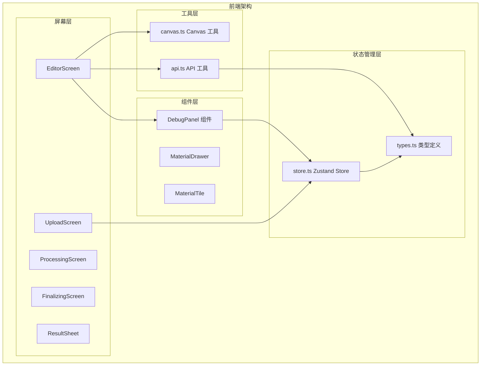
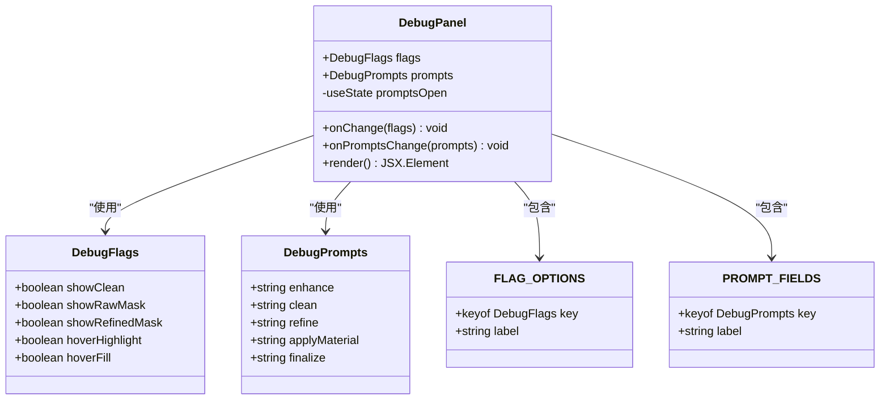
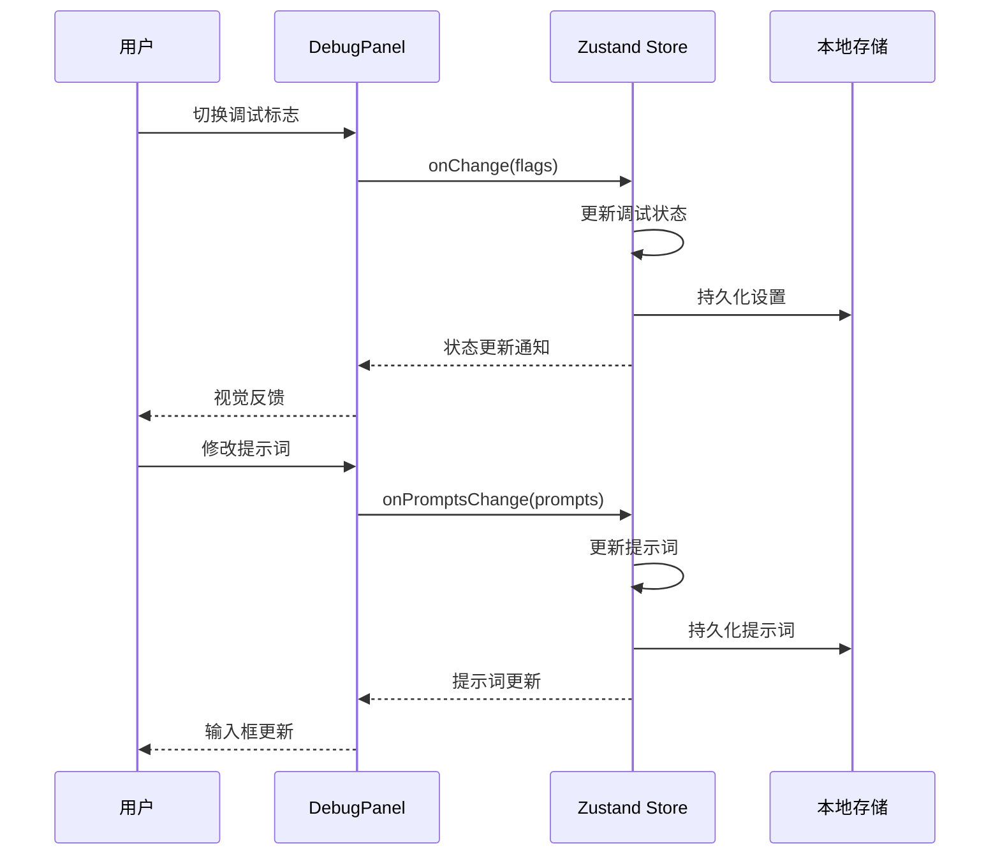
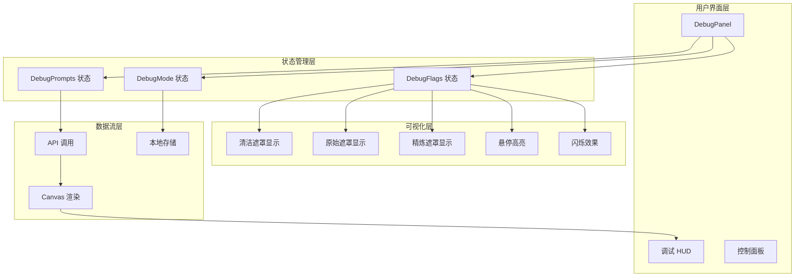
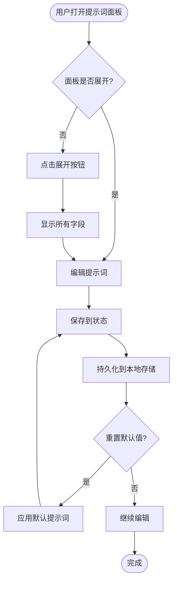
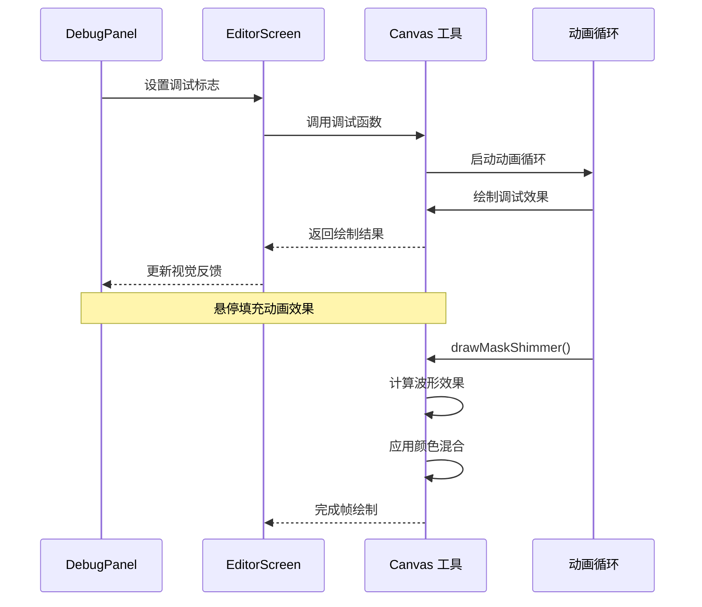
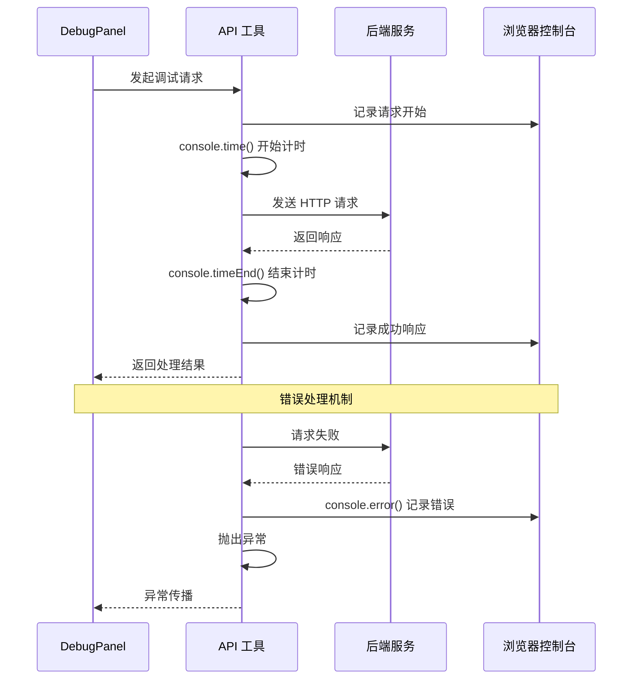
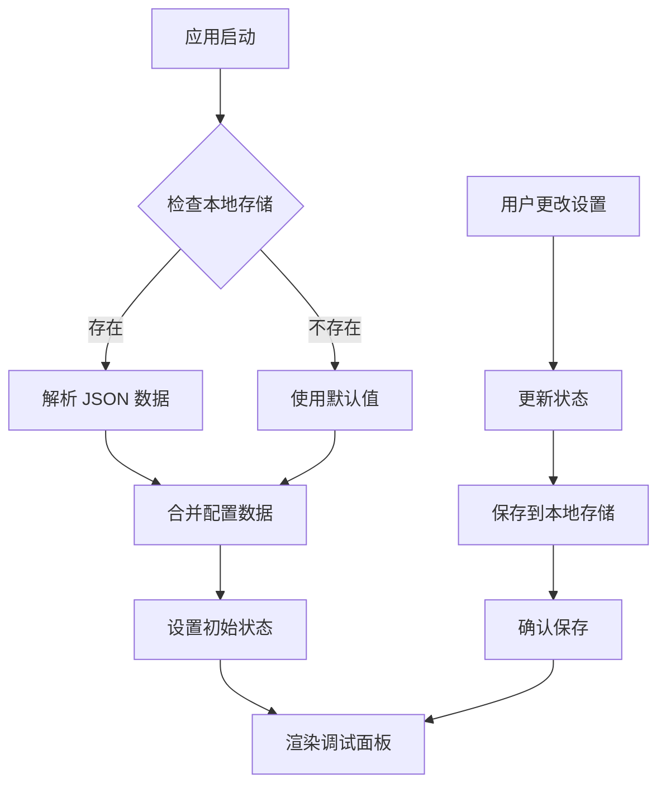
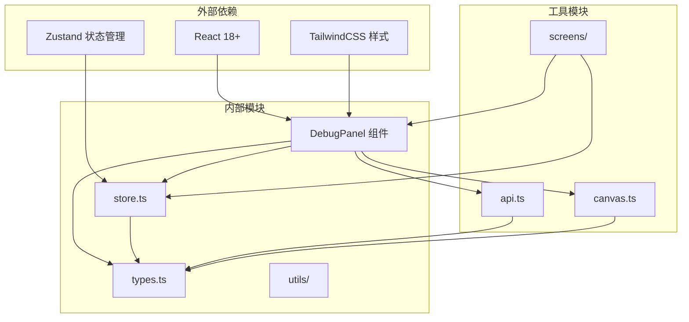
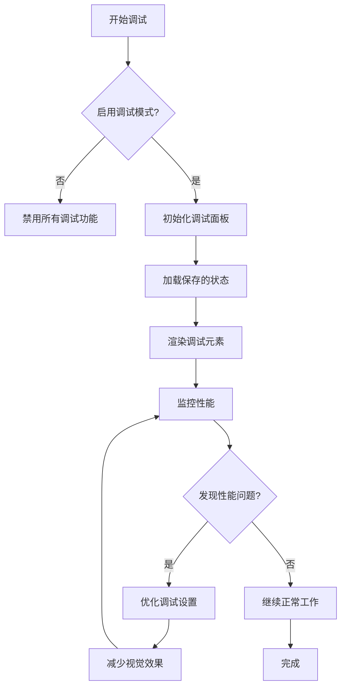

# 调试面板组件

<cite>
**本文档引用的文件**
- [DebugPanel.tsx](file://src/components/DebugPanel.tsx)
- [store.ts](file://src/store.ts)
- [types.ts](file://src/types.ts)
- [api.ts](file://src/utils/api.ts)
- [EditorScreen.tsx](file://src/screens/EditorScreen.tsx)
- [UploadScreen.tsx](file://src/screens/UploadScreen.tsx)
- [canvas.ts](file://src/utils/canvas.ts)
- [.gitignore](file://.gitignore)
</cite>

## 目录
1. [简介](#简介)
2. [项目结构](#项目结构)
3. [核心组件](#核心组件)
4. [架构概览](#架构概览)
5. [详细组件分析](#详细组件分析)
6. [依赖关系分析](#依赖关系分析)
7. [性能考虑](#性能考虑)
8. [故障排除指南](#故障排除指南)
9. [结论](#结论)

## 简介

调试面板组件（DebugPanel）是 WallChanger 应用程序中的一个关键调试工具，为开发者和高级用户提供实时的图像处理流程可视化和参数调整能力。该组件实现了多层次的调试功能，包括：

- **实时状态可视化**：显示当前处理步骤、遮罩状态和区域选择
- **参数动态调整**：允许用户修改各种处理阶段的提示词
- **视觉调试工具**：提供遮罩高亮、动画效果和状态指示
- **性能监控**：集成网络请求计时和错误追踪
- **持久化配置**：支持本地存储调试设置

该组件采用响应式设计，通过绝对定位悬浮在编辑界面顶部，提供非侵入式的调试体验。

## 项目结构

调试面板组件位于前端代码结构的组件层中，与状态管理、API 工具和屏幕组件形成清晰的分层架构：

**图表来源**
- [DebugPanel.tsx:1-91](file://src/components/DebugPanel.tsx#L1-L91)
- [store.ts:1-177](file://src/store.ts#L1-L177)
- [EditorScreen.tsx:1-200](file://src/screens/EditorScreen.tsx#L1-L200)

**章节来源**
- [DebugPanel.tsx:1-91](file://src/components/DebugPanel.tsx#L1-L91)
- [store.ts:1-177](file://src/store.ts#L1-L177)
- [types.ts:1-88](file://src/types.ts#L1-L88)

## 核心组件

### DebugPanel 组件架构

DebugPanel 是一个高度模块化的 React 组件，采用函数式组件设计，集成了状态管理和用户交互：

**图表来源**
- [DebugPanel.tsx:5-34](file://src/components/DebugPanel.tsx#L5-L34)

### 状态管理系统

调试面板与全局状态管理紧密集成，通过 Zustand 实现高效的状态同步：

**图表来源**
- [store.ts:126-134](file://src/store.ts#L126-L134)
- [DebugPanel.tsx:45-55](file://src/components/DebugPanel.tsx#L45-L55)

**章节来源**
- [DebugPanel.tsx:36-91](file://src/components/DebugPanel.tsx#L36-L91)
- [store.ts:63-177](file://src/store.ts#L63-L177)

## 架构概览

调试面板组件在整个应用程序架构中扮演着关键的调试中枢角色，连接着用户界面、状态管理和后台服务：

**图表来源**
- [EditorScreen.tsx:63-66](file://src/screens/EditorScreen.tsx#L63-L66)
- [EditorScreen.tsx:543-631](file://src/screens/EditorScreen.tsx#L543-L631)

## 详细组件分析

### 调试标志系统

调试面板的核心功能是通过五个可切换的调试标志来控制不同的可视化效果：

| 调试标志 | 功能描述 | 视觉效果 | 性能影响 |
|---------|----------|----------|----------|
| showClean | 显示清洁后的遮罩 | 半透明绿色覆盖层 | 中等 |
| showRawMask | 显示原始遮罩 | 红色轮廓线 | 低 |
| showRefinedMask | 显示精炼遮罩 | 蓝色轮廓线 | 低 |
| hoverHighlight | 悬停高亮效果 | 颜色高亮框 | 低 |
| hoverFill | 悬停填充动画 | 彩色闪烁效果 | 高 |

### 提示词管理系统

调试面板提供了五个关键处理阶段的提示词配置：

**图表来源**
- [DebugPanel.tsx:59-87](file://src/components/DebugPanel.tsx#L59-L87)

### Canvas 调试工具

调试面板与 Canvas 工具有着深度集成，提供了多种视觉调试效果：

**图表来源**
- [EditorScreen.tsx:129-153](file://src/screens/EditorScreen.tsx#L129-L153)
- [canvas.ts:400-447](file://src/utils/canvas.ts#L400-L447)

**章节来源**
- [DebugPanel.tsx:20-34](file://src/components/DebugPanel.tsx#L20-L34)
- [EditorScreen.tsx:63-66](file://src/screens/EditorScreen.tsx#L63-L66)
- [canvas.ts:400-492](file://src/utils/canvas.ts#L400-L492)

### API 集成与监控

调试面板与后端 API 的集成包含了完整的请求监控和错误处理机制：

**图表来源**
- [api.ts:109-137](file://src/utils/api.ts#L109-L137)
- [api.ts:88-104](file://src/utils/api.ts#L88-L104)

**章节来源**
- [api.ts:1-197](file://src/utils/api.ts#L1-L197)

### 状态持久化机制

调试面板的状态通过本地存储实现持久化，确保用户设置在页面刷新后仍然有效：

**图表来源**
- [store.ts:32-38](file://src/store.ts#L32-L38)
- [store.ts:126-134](file://src/store.ts#L126-L134)

**章节来源**
- [store.ts:30-61](file://src/store.ts#L30-L61)
- [store.ts:126-134](file://src/store.ts#L126-L134)

## 依赖关系分析

调试面板组件的依赖关系展现了清晰的单向数据流和模块化设计：

**图表来源**
- [DebugPanel.tsx:1-3](file://src/components/DebugPanel.tsx#L1-L3)
- [store.ts:1-3](file://src/store.ts#L1-L3)

**章节来源**
- [DebugPanel.tsx:1-4](file://src/components/DebugPanel.tsx#L1-L4)
- [store.ts:1-3](file://src/store.ts#L1-L3)

## 性能考虑

调试面板组件在设计时充分考虑了性能优化，采用了多种策略来确保流畅的用户体验：

### 渲染优化策略

1. **条件渲染**：仅在需要时渲染调试元素，避免不必要的 DOM 操作
2. **Canvas 动画**：使用 requestAnimationFrame 实现高效的动画渲染
3. **状态最小化**：通过精确的状态更新减少重渲染次数

### 内存管理

1. **资源清理**：动画循环在组件卸载时自动清理
2. **缓存机制**：预计算的遮罩数据在组件生命周期内复用
3. **垃圾回收**：及时释放临时对象和大尺寸数据

### 网络性能

1. **请求计时**：使用 console.time/console.timeEnd 精确测量 API 响应时间
2. **错误快速反馈**：网络错误时立即中断流程并提供用户反馈
3. **资源复用**：避免重复的网络请求和数据处理

## 故障排除指南

### 常见问题诊断

| 问题症状 | 可能原因 | 解决方案 |
|----------|----------|----------|
| 调试面板不显示 | 调试模式未启用 | 在上传界面勾选 Debug 复选框 |
| 遮罩显示异常 | Canvas 初始化失败 | 检查浏览器控制台错误信息 |
| 提示词无法保存 | 本地存储权限问题 | 检查浏览器隐私设置 |
| 动画效果卡顿 | CPU 占用过高 | 关闭其他调试选项，降低动画复杂度 |

### 调试模式切换

**图表来源**
- [UploadScreen.tsx:50-56](file://src/screens/UploadScreen.tsx#L50-L56)
- [store.ts:131-134](file://src/store.ts#L131-L134)

### 日志记录与监控

调试面板集成了多层次的日志记录系统：

1. **API 调用日志**：记录所有后端请求的详细信息
2. **性能指标**：跟踪关键操作的执行时间
3. **错误追踪**：捕获并报告运行时异常
4. **状态变更**：监控调试状态的每次变化

**章节来源**
- [api.ts:31-32](file://src/utils/api.ts#L31-L32)
- [api.ts:65-67](file://src/utils/api.ts#L65-L67)
- [api.ts:132-134](file://src/utils/api.ts#L132-L134)

## 结论

调试面板组件（DebugPanel）作为 WallChanger 应用程序的核心调试工具，展现了现代前端开发的最佳实践。该组件通过精心设计的架构实现了以下目标：

### 技术成就

1. **模块化设计**：清晰的组件分离和职责划分
2. **性能优化**：高效的渲染策略和内存管理
3. **用户体验**：直观的交互设计和即时反馈
4. **可维护性**：良好的代码组织和文档结构

### 功能特性

- **多维度调试**：从视觉到性能的全方位调试能力
- **实时监控**：即时的状态反馈和性能指标
- **灵活配置**：可定制的调试参数和显示选项
- **持久化支持**：智能的配置保存和恢复机制

### 未来发展

该组件为未来的功能扩展奠定了坚实基础，可以轻松集成更多调试工具、性能监控和用户反馈机制。其模块化的设计使得新功能的添加不会影响现有系统的稳定性。

通过调试面板组件，开发者能够深入理解图像处理流程的每个环节，快速定位和解决问题，显著提升开发效率和产品质量。