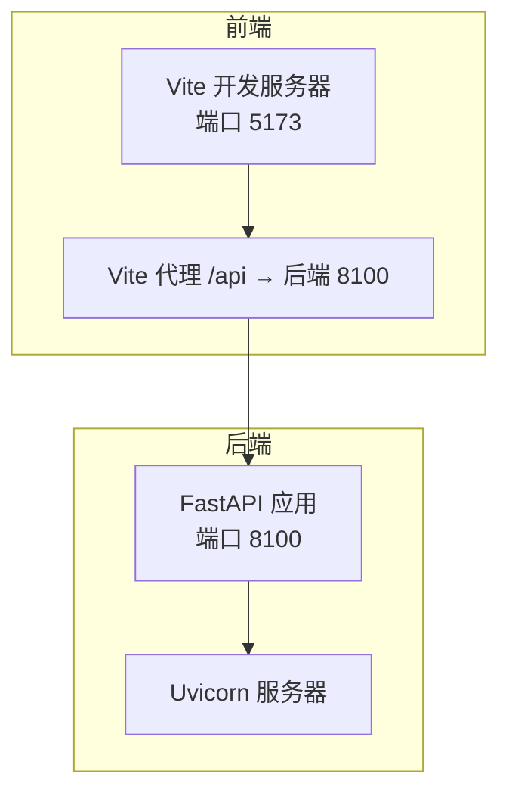
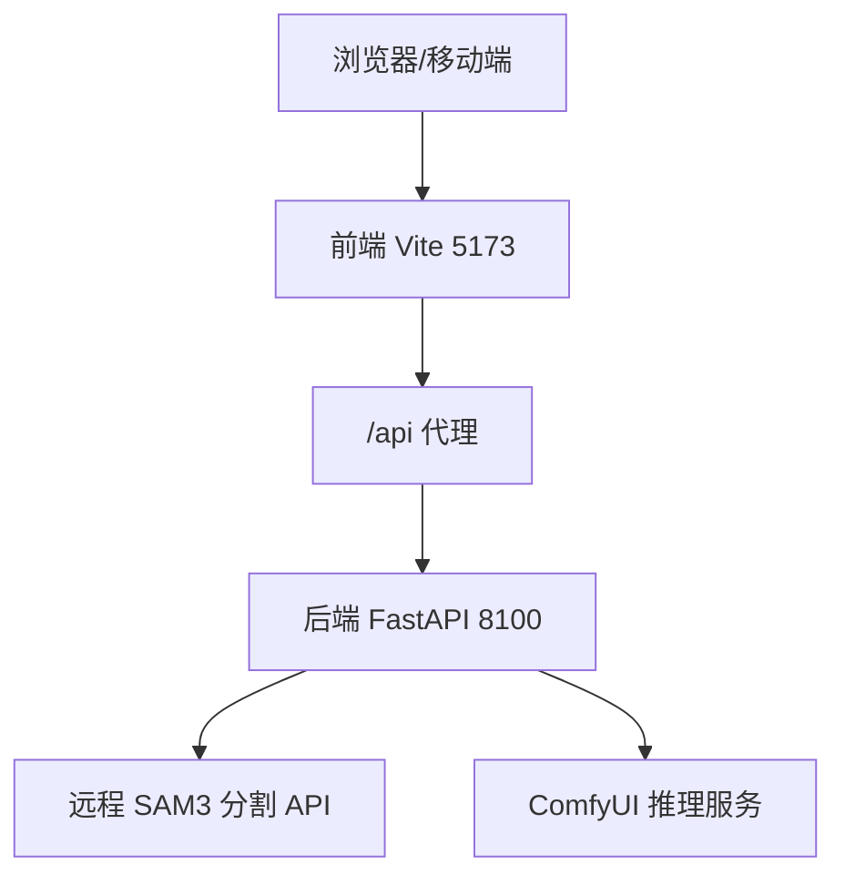
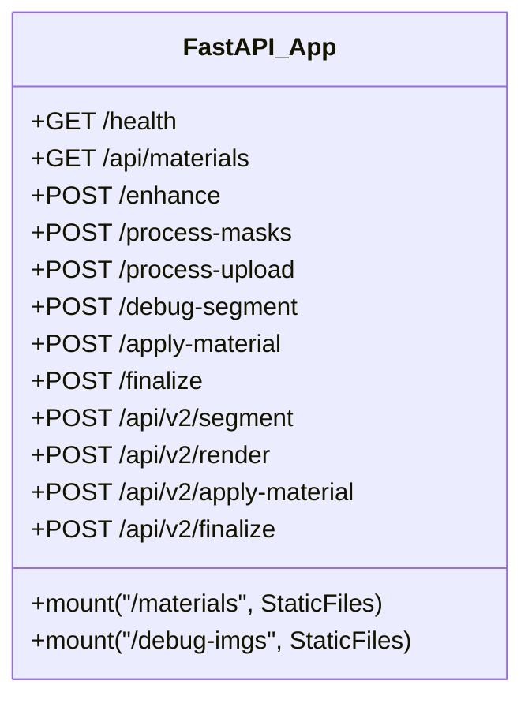
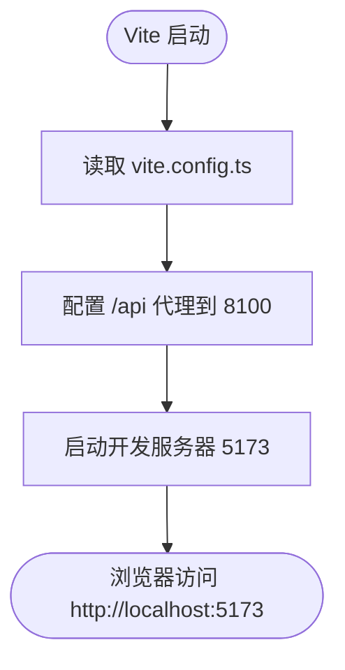
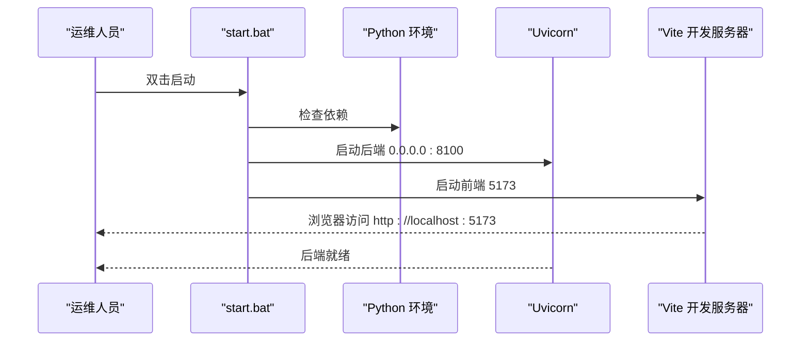
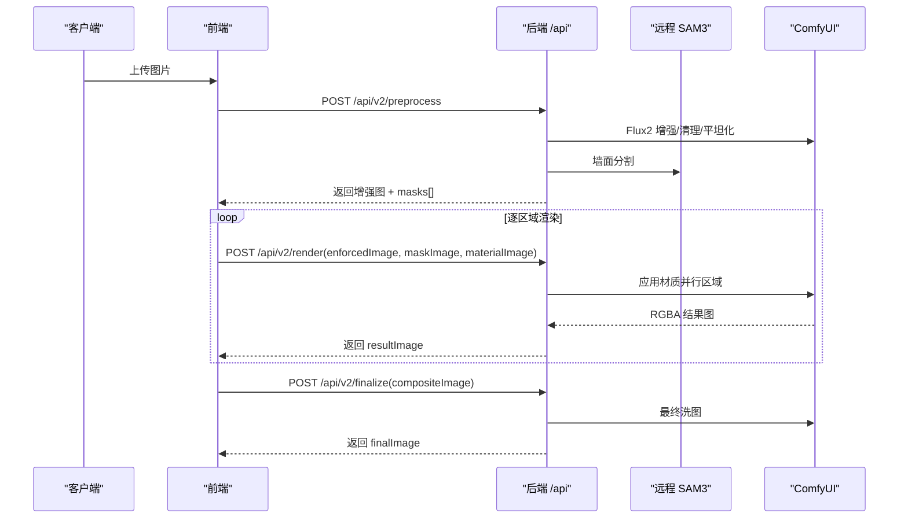
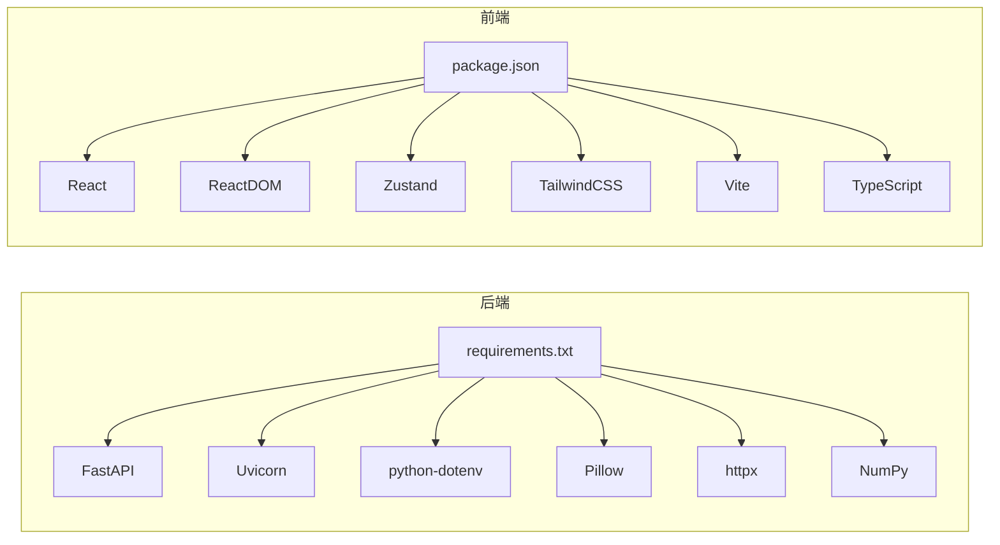

# 部署与运维

<cite>
**本文引用的文件**
- [README.md](file://README.md)
- [package.json](file://package.json)
- [install.bat](file://install.bat)
- [start.bat](file://start.bat)
- [stop.bat](file://stop.bat)
- [restart.bat](file://restart.bat)
- [backend/main.py](file://backend/main.py)
- [backend/requirements.txt](file://backend/requirements.txt)
- [backend/start.bat](file://backend/start.bat)
- [docs/api.md](file://docs/api.md)
- [docs/api-v2.md](file://docs/api-v2.md)
- [docs/frontend-api-guide.md](file://docs/frontend-api-guide.md)
- [vite.config.ts](file://vite.config.ts)
- [tsconfig.json](file://tsconfig.json)
- [tailwind.config.js](file://tailwind.config.js)
</cite>

## 目录
1. [简介](#简介)
2. [项目结构](#项目结构)
3. [核心组件](#核心组件)
4. [架构总览](#架构总览)
5. [详细组件分析](#详细组件分析)
6. [依赖分析](#依赖分析)
7. [性能考虑](#性能考虑)
8. [故障排除指南](#故障排除指南)
9. [结论](#结论)
10. [附录](#附录)

## 简介
本指南面向生产环境部署与运维，覆盖环境准备、依赖安装、配置文件设置、启动脚本使用、性能监控、日志管理、故障排除、备份恢复与系统维护最佳实践。项目采用前后端分离架构：前端使用 React + Vite + Tailwind CSS，后端使用 Python FastAPI，AI 推理链路通过 ComfyUI 与远程 SAM3 API 实现。

## 项目结构
- 前端
  - 构建工具：Vite
  - 框架与样式：React + TypeScript + Tailwind CSS
  - 开发服务器端口：5173
  - 代理后端地址：http://localhost:8100
- 后端
  - Web 框架：FastAPI
  - 服务端口：8100
  - 依赖管理：pip（requirements.txt）
  - 启动方式：uvicorn
- 脚本
  - install.bat：安装前端与后端依赖
  - start.bat：一键启动前后端服务
  - stop.bat：停止前后端服务
  - restart.bat：先停止再启动

图表来源
- [vite.config.ts:1-48](file://vite.config.ts#L1-L48)
- [backend/main.py:31-39](file://backend/main.py#L31-L39)

章节来源
- [README.md:12-91](file://README.md#L12-L91)
- [vite.config.ts:1-48](file://vite.config.ts#L1-L48)
- [backend/main.py:31-39](file://backend/main.py#L31-L39)

## 核心组件
- 后端服务（FastAPI）
  - 提供健康检查、材质列表、图像处理与渲染接口
  - 通过静态文件挂载提供材质图片与调试图片
- 前端开发服务器（Vite）
  - 通过代理将 /api 请求转发至后端
- 启动脚本
  - install.bat：安装 Node 与 Python 依赖
  - start.bat：启动后端（uvicorn）与前端（npm run dev）
  - stop.bat/restart.bat：进程管理

章节来源
- [backend/main.py:545-561](file://backend/main.py#L545-L561)
- [backend/main.py:41-48](file://backend/main.py#L41-L48)
- [install.bat:1-63](file://install.bat#L1-L63)
- [start.bat:1-36](file://start.bat#L1-L36)
- [stop.bat:1-6](file://stop.bat#L1-L6)
- [restart.bat:1-5](file://restart.bat#L1-L5)

## 架构总览
后端负责图像增强、清理、分割与最终渲染；前端负责用户交互与调用后端接口。Vite 代理确保跨域与本地联调便利。

图表来源
- [docs/api.md:3-6](file://docs/api.md#L3-L6)
- [docs/api-v2.md:3-7](file://docs/api-v2.md#L3-L7)
- [vite.config.ts:10-45](file://vite.config.ts#L10-L45)

## 详细组件分析

### 后端服务（FastAPI）
- 关键点
  - CORS 中间件允许任意来源访问
  - 挂载静态目录：/materials（材质图片）、/debug-imgs（调试图片）
  - 环境变量驱动的配置：SAM3 API、ComfyUI 主机、材质目录
  - 提供健康检查、材质列表、图像处理与渲染接口
- 性能与可靠性
  - 推理链路依赖外部服务（SAM3、ComfyUI），超时与错误处理在接口层集中处理
  - 同步接口限制并发，避免资源争用

图表来源
- [backend/main.py:31-39](file://backend/main.py#L31-L39)
- [backend/main.py:41-48](file://backend/main.py#L41-L48)
- [backend/main.py:545-776](file://backend/main.py#L545-L776)

章节来源
- [backend/main.py:18-28](file://backend/main.py#L18-L28)
- [backend/main.py:31-39](file://backend/main.py#L31-L39)
- [backend/main.py:41-48](file://backend/main.py#L41-L48)
- [backend/main.py:545-776](file://backend/main.py#L545-L776)

### 前端开发服务器（Vite）
- 关键点
  - 代理规则将 /api 与部分历史接口转发至后端
  - 本地开发端口 5173
- 生产建议
  - 构建产物部署于 Nginx/Apache，代理静态资源与 API 至后端

图表来源
- [vite.config.ts:1-48](file://vite.config.ts#L1-L48)

章节来源
- [vite.config.ts:1-48](file://vite.config.ts#L1-L48)

### 启动脚本工作原理
- install.bat
  - 检测 Node.js 与 Python
  - npm install（前端）
  - pip install -r backend/requirements.txt（后端）
- start.bat
  - 检查 node_modules 与后端依赖
  - 后端：uvicorn 启动 FastAPI（0.0.0.0:8100）
  - 前端：npm run dev（5173）
- stop.bat/restart.bat
  - 通过 netstat 查找端口进程并终止

图表来源
- [start.bat:1-36](file://start.bat#L1-L36)
- [install.bat:1-63](file://install.bat#L1-L63)

章节来源
- [install.bat:1-63](file://install.bat#L1-L63)
- [start.bat:1-36](file://start.bat#L1-L36)
- [stop.bat:1-6](file://stop.bat#L1-L6)
- [restart.bat:1-5](file://restart.bat#L1-L5)

### API 流程与调用序列
- 完整流程（V2）
  - 预处理：/api/v2/preprocess → 返回增强图与蒙版
  - 材质应用：/api/v2/render（逐区域，同步）
  - 最终渲染：/api/v2/finalize
- 并发控制
  - /api/v2/render 为同步接口，前端需互斥锁防止并发

图表来源
- [docs/api-v2.md:13-309](file://docs/api-v2.md#L13-L309)
- [docs/frontend-api-guide.md:47-131](file://docs/frontend-api-guide.md#L47-L131)

章节来源
- [docs/api-v2.md:13-309](file://docs/api-v2.md#L13-L309)
- [docs/frontend-api-guide.md:47-131](file://docs/frontend-api-guide.md#L47-L131)

## 依赖分析
- 后端依赖（requirements.txt）
  - FastAPI、Uvicorn、python-dotenv、Pillow、httpx、NumPy
- 前端依赖（package.json）
  - React、ReactDOM、Zustand、TailwindCSS、Vite、TypeScript

图表来源
- [backend/requirements.txt:1-8](file://backend/requirements.txt#L1-L8)
- [package.json:1-27](file://package.json#L1-L27)

章节来源
- [backend/requirements.txt:1-8](file://backend/requirements.txt#L1-L8)
- [package.json:1-27](file://package.json#L1-L27)

## 性能考虑
- 后端性能
  - 推理链路包含多次图像生成与外部 API 调用，整体延迟较高
  - /api/v2/render 为同步接口，需前端互斥控制
- 前端性能
  - Canvas 叠加与合成需注意大图尺寸与层数
- 监控建议
  - CPU/内存：后端 uvicorn 进程资源占用
  - 响应时间：后端各接口耗时（预处理、渲染、最终洗图）
  - 外部依赖：SAM3 与 ComfyUI 的可用性与延迟

章节来源
- [docs/frontend-api-guide.md:751-771](file://docs/frontend-api-guide.md#L751-L771)
- [docs/api-v2.md:268-274](file://docs/api-v2.md#L268-L274)

## 故障排除指南
- 无法启动
  - 检查 install.bat 是否成功安装依赖
  - 确认 Python 与 Node.js 版本满足要求
- 后端未监听 8100
  - 使用 stop.bat 停止残留进程，再 start.bat 重启
  - 检查防火墙与端口占用
- 前端无法访问后端
  - 确认 Vite 代理配置正确
  - 检查 CORS 设置
- 推理失败或超时
  - 检查 SAM3 与 ComfyUI 可达性与负载
  - 观察后端日志定位具体节点错误
- 并发问题
  - /api/v2/render 为同步接口，前端需互斥锁控制

章节来源
- [install.bat:1-63](file://install.bat#L1-L63)
- [start.bat:1-36](file://start.bat#L1-L36)
- [stop.bat:1-6](file://stop.bat#L1-L6)
- [vite.config.ts:10-45](file://vite.config.ts#L10-L45)
- [backend/main.py:31-39](file://backend/main.py#L31-L39)
- [docs/frontend-api-guide.md:751-771](file://docs/frontend-api-guide.md#L751-L771)

## 结论
本指南提供了从环境准备到生产部署、运维监控与故障排除的完整路径。建议在生产环境中使用反向代理统一入口、完善日志与监控告警，并对推理链路进行容量规划与弹性伸缩。

## 附录

### 生产环境部署清单
- 系统要求
  - Python 3.9+、Node.js 18+
  - 本地已部署 SAM3（按 README 指定路径）
  - FAL API Key（用于 Flux 推理）
- 依赖安装
  - 后端：pip install -r backend/requirements.txt
  - 前端：npm install
- 配置文件
  - 后端 .env（参考 .env.example，设置 FAL_KEY、SAM3D_PATH、MATERIALS_PATH）
- 启动与访问
  - 后端：uvicorn main:app --host 0.0.0.0 --port 8100
  - 前端：npm run dev（本地开发）
  - 访问：http://localhost:5173（电脑），手机需在同一局域网并使用本机 IP

章节来源
- [README.md:17-91](file://README.md#L17-L91)
- [backend/requirements.txt:1-8](file://backend/requirements.txt#L1-L8)
- [package.json:6-10](file://package.json#L6-L10)

### 日志管理策略
- 后端日志
  - uvicorn 标准输出与错误输出
  - 调试图片保存在 backend/debug（/debug-imgs 暴露）
- 前端日志
  - 浏览器控制台与网络面板
- AI 模型日志
  - SAM3 与 ComfyUI 的服务端日志（由各自服务管理）

章节来源
- [backend/main.py:46-48](file://backend/main.py#L46-L48)
- [backend/main.py:575-576](file://backend/main.py#L575-L576)
- [backend/main.py:601-602](file://backend/main.py#L601-L602)
- [backend/main.py:665-666](file://backend/main.py#L665-L666)
- [backend/main.py:773-774](file://backend/main.py#L773-L774)

### 性能监控指标建议
- 后端
  - CPU 使用率、内存占用、并发连接数
  - 接口 P95/P99 延迟（预处理、渲染、最终洗图）
- 外部依赖
  - SAM3 与 ComfyUI 的可用性与平均响应时间
- 前端
  - 页面首屏时间、Canvas 渲染帧率

章节来源
- [docs/api-v2.md:268-274](file://docs/api-v2.md#L268-L274)
- [docs/frontend-api-guide.md:751-771](file://docs/frontend-api-guide.md#L751-L771)

### 备份与恢复
- 备份对象
  - 材质图片目录（MATERIALS_PATH）
  - 用户生成的调试图片（backend/debug）
- 恢复流程
  - 恢复目录结构与权限
  - 重新启动服务验证

章节来源
- [backend/main.py:24-28](file://backend/main.py#L24-L28)
- [backend/main.py:46-48](file://backend/main.py#L46-L48)

### 系统维护最佳实践
- 定期升级依赖（pip 与 npm）
- 限制日志大小并轮转
- 使用反向代理统一入口与 HTTPS
- 对外暴露接口进行限流与鉴权（生产环境）

章节来源
- [backend/requirements.txt:1-8](file://backend/requirements.txt#L1-L8)
- [package.json:1-27](file://package.json#L1-L27)
- [vite.config.ts:1-48](file://vite.config.ts#L1-L48)