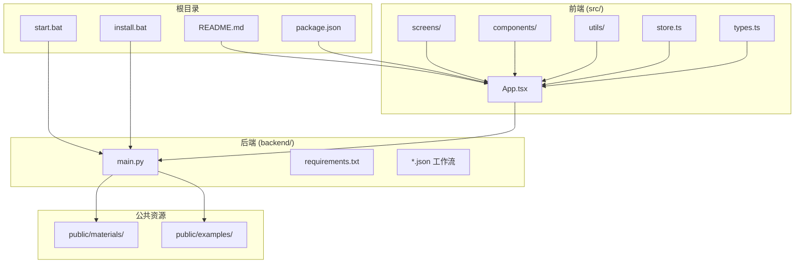
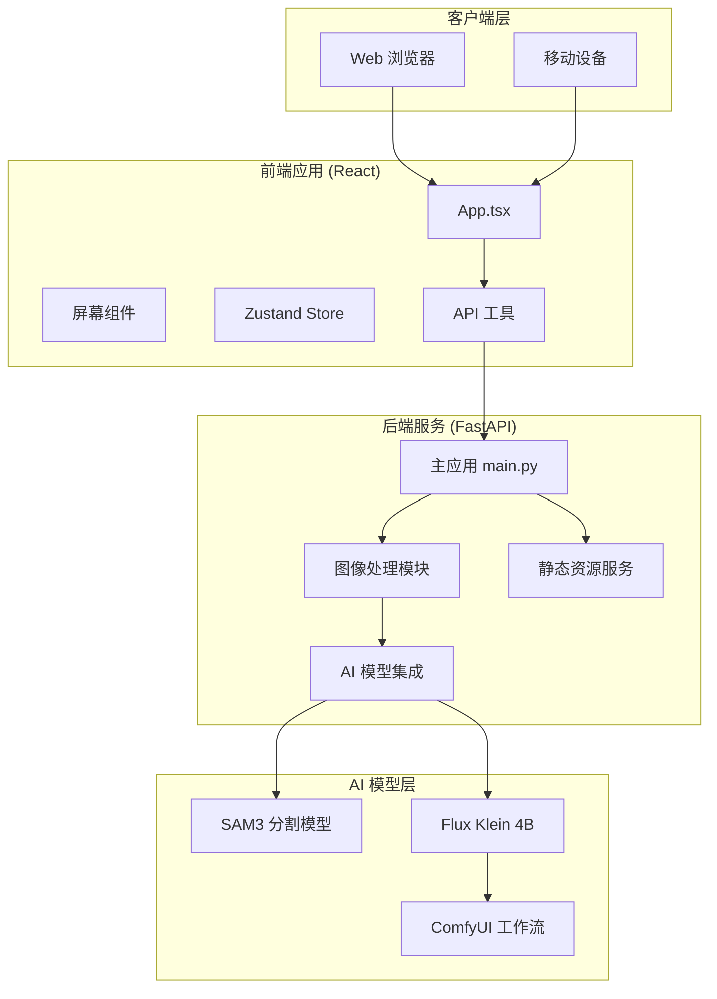
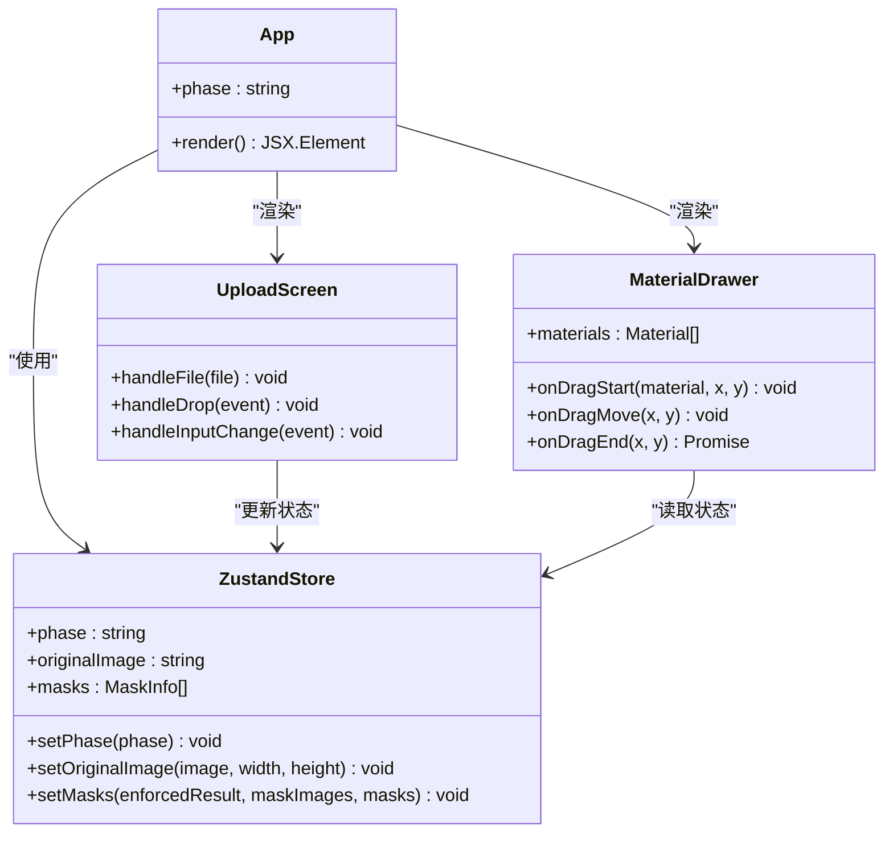
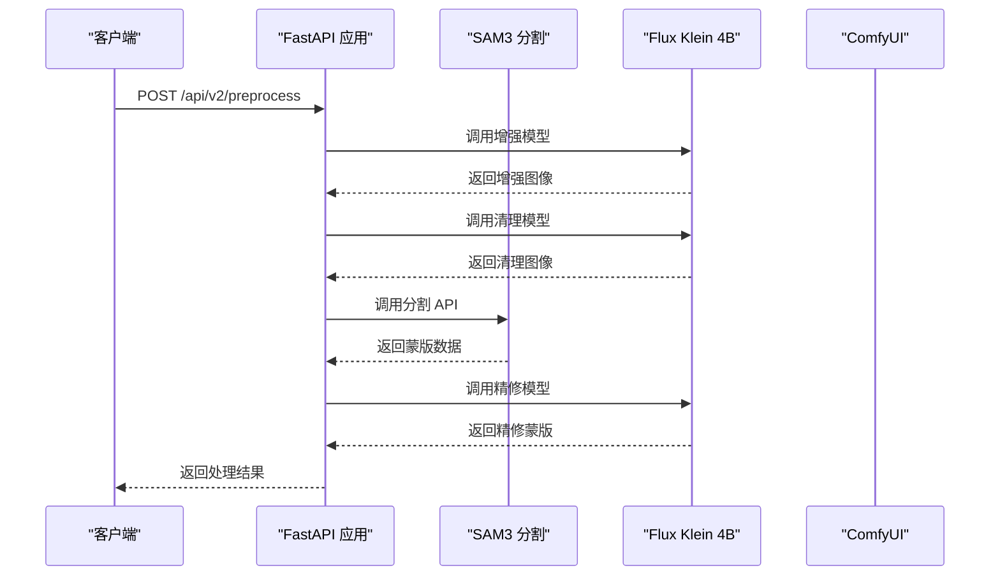
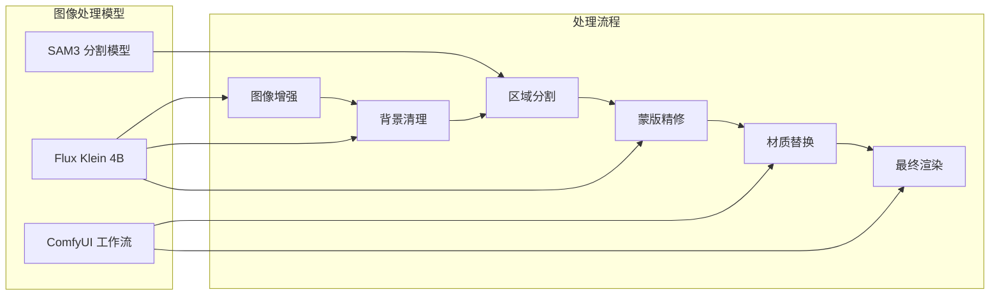
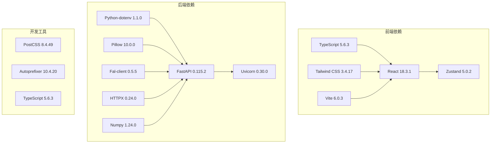

# 项目概述

<cite>
**本文档引用的文件**
- [README.md](file://README.md)
- [package.json](file://package.json)
- [backend/main.py](file://backend/main.py)
- [backend/requirements.txt](file://backend/requirements.txt)
- [src/App.tsx](file://src/App.tsx)
- [src/store.ts](file://src/store.ts)
- [src/types.ts](file://src/types.ts)
- [src/utils/api.ts](file://src/utils/api.ts)
- [src/screens/UploadScreen.tsx](file://src/screens/UploadScreen.tsx)
- [src/components/MaterialDrawer.tsx](file://src/components/MaterialDrawer.tsx)
- [docs/api.md](file://docs/api.md)
- [docs/api-v2.md](file://docs/api-v2.md)
- [start.bat](file://start.bat)
- [install.bat](file://install.bat)
</cite>

## 目录
1. [简介](#简介)
2. [项目结构](#项目结构)
3. [核心组件](#核心组件)
4. [架构总览](#架构总览)
5. [详细组件分析](#详细组件分析)
6. [依赖关系分析](#依赖关系分析)
7. [性能考虑](#性能考虑)
8. [故障排除指南](#故障排除指南)
9. [结论](#结论)
10. [附录](#附录)

## 简介

WallChanger 是一款基于人工智能的室内墙面材质自动更换应用。它允许用户上传室内照片，通过 AI 自动识别墙面、地板、天花板等区域，并通过拖拽材质球进行实时替换，最终一键生成逼真的渲染效果。

该项目采用全栈分离架构设计，后端基于 Python FastAPI + SAM3 + Flux Klein 4B，前端采用 React + TypeScript + Vite + Tailwind CSS + Zustand，实现了从图像上传到材质替换再到最终渲染的完整工作流。

### 核心价值主张
- **智能化识别**：利用 SAM3 实现精准的墙面区域分割
- **实时交互**：支持拖拽材质球进行即时替换
- **高质量渲染**：基于 Flux Klein 4B 实现真实感渲染
- **易用性强**：简洁直观的用户界面，支持移动端访问

## 项目结构

项目采用前后端分离的目录组织方式，主要分为以下模块：



**图表来源**
- [README.md:1-91](file://README.md#L1-L91)
- [package.json:1-27](file://package.json#L1-L27)
- [backend/main.py:1-1227](file://backend/main.py#L1-L1227)

**章节来源**
- [README.md:1-91](file://README.md#L1-L91)
- [package.json:1-27](file://package.json#L1-L27)

## 核心组件

### 前端核心组件

前端采用 React + TypeScript 构建，使用 Zustand 状态管理，主要组件包括：

- **应用入口**：App.tsx - 根组件，根据应用状态切换不同屏幕
- **状态管理**：store.ts - 使用 Zustand 管理全局状态，包括图像数据、处理进度、材质拖拽状态等
- **类型定义**：types.ts - 定义应用中使用的数据类型和接口
- **API 工具**：utils/api.ts - 封装后端 API 调用，提供统一的接口

### 后端核心组件

后端基于 FastAPI 构建，提供完整的图像处理和材质替换服务：

- **主应用**：main.py - 定义所有 API 端点，包括图像增强、蒙版分割、材质应用、最终渲染等
- **依赖管理**：requirements.txt - 定义 Python 依赖包
- **工作流配置**：多个 JSON 文件定义 ComfyUI 工作流

**章节来源**
- [src/App.tsx:1-26](file://src/App.tsx#L1-L26)
- [src/store.ts:1-177](file://src/store.ts#L1-L177)
- [src/types.ts:1-89](file://src/types.ts#L1-L89)
- [src/utils/api.ts:1-200](file://src/utils/api.ts#L1-L200)
- [backend/main.py:1-1227](file://backend/main.py#L1-L1227)
- [backend/requirements.txt:1-8](file://backend/requirements.txt#L1-L8)

## 架构总览

项目采用典型的前后端分离架构，通过 RESTful API 进行通信：



**图表来源**
- [src/App.tsx:1-26](file://src/App.tsx#L1-L26)
- [src/utils/api.ts:1-200](file://src/utils/api.ts#L1-L200)
- [backend/main.py:1-1227](file://backend/main.py#L1-L1227)

### 数据流架构

系统的核心数据流包括三个主要阶段：

1. **图像预处理阶段**：上传图像 → 增强处理 → 清理背景 → 区域分割 → 精修蒙版
2. **材质替换阶段**：用户拖拽材质 → 识别目标区域 → 并行生成材质替换 → 合成结果
3. **最终渲染阶段**：合成图像 → 最终洗图 → 输出高质量渲染结果

**章节来源**
- [docs/api.md:292-309](file://docs/api.md#L292-L309)
- [docs/api-v2.md:11-21](file://docs/api-v2.md#L11-L21)

## 详细组件分析

### 前端应用架构

前端采用模块化设计，主要组件职责明确：



**图表来源**
- [src/App.tsx:1-26](file://src/App.tsx#L1-L26)
- [src/store.ts:1-177](file://src/store.ts#L1-L177)
- [src/screens/UploadScreen.tsx:1-121](file://src/screens/UploadScreen.tsx#L1-L121)
- [src/components/MaterialDrawer.tsx:1-136](file://src/components/MaterialDrawer.tsx#L1-L136)

#### 状态管理机制

应用使用 Zustand 实现轻量级状态管理，核心状态包括：

- **应用阶段**：upload、processing、editing、finalizing、done
- **图像数据**：原始图像、增强图像、蒙版图像、合成图像、最终图像
- **处理进度**：当前处理步骤、正在处理的区域集合
- **用户交互**：拖拽的材质、悬停的区域、批量模式状态

**章节来源**
- [src/store.ts:40-61](file://src/store.ts#L40-L61)
- [src/types.ts:57-89](file://src/types.ts#L57-L89)

### 后端 API 架构

后端提供完整的图像处理 API，采用模块化设计：



**图表来源**
- [backend/main.py:682-717](file://backend/main.py#L682-L717)
- [docs/api.md:108-145](file://docs/api.md#L108-L145)

#### 核心 API 端点

后端提供以下主要 API 端点：

- **健康检查**：`GET /health` - 检查服务状态
- **材质管理**：`GET /api/materials` - 获取材质列表
- **图像预处理**：`POST /api/v2/preprocess` - 增强和分割图像
- **材质应用**：`POST /api/v2/render` - 应用材质到指定区域
- **最终渲染**：`POST /api/v2/finalize` - 生成最终渲染结果

**章节来源**
- [backend/main.py:545-548](file://backend/main.py#L545-L548)
- [backend/main.py:550-561](file://backend/main.py#L550-L561)
- [backend/main.py:615-622](file://backend/main.py#L615-L622)
- [backend/main.py:720-775](file://backend/main.py#L720-L775)

### AI 模型集成

系统集成了多种 AI 模型来实现不同的功能：



**图表来源**
- [backend/main.py:79-323](file://backend/main.py#L79-L323)
- [backend/main.py:325-360](file://backend/main.py#L325-L360)

#### 模型调用策略

- **SAM3 远程 API**：通过 HTTP 调用远程分割服务，返回区域掩码
- **Flux Klein 4B**：调用 ComfyUI 工作流，实现图像增强、清理、精修和材质替换
- **本地缓存**：材质图片存储在本地，通过静态文件服务提供访问

**章节来源**
- [backend/main.py:18-22](file://backend/main.py#L18-L22)
- [backend/main.py:79-323](file://backend/main.py#L79-L323)

## 依赖关系分析

项目依赖关系清晰，前后端分离良好：



**图表来源**
- [package.json:11-25](file://package.json#L11-L25)
- [backend/requirements.txt:1-8](file://backend/requirements.txt#L1-L8)

### 环境配置

系统要求和环境配置：

- **Python 3.9+**：后端运行环境
- **Node.js 18+**：前端开发环境
- **SAM3 本地部署**：需要在本地路径部署 SAM3D
- **FAL API Key**：用于访问 Flux 模型
- **材质图片**：512×512 像素的 JPG/PNG/WebP 格式

**章节来源**
- [README.md:17-23](file://README.md#L17-L23)
- [README.md:47-49](file://README.md#L47-L49)

## 性能考虑

### 前端性能优化

- **状态管理**：使用 Zustand 减少不必要的重新渲染
- **图片处理**：采用 Canvas 进行本地图片处理，避免重复网络传输
- **懒加载**：材质库按需加载，减少初始加载时间
- **拖拽优化**：使用 Pointer Events 和 CSS3D 加速拖拽体验

### 后端性能优化

- **异步处理**：所有 AI 调用采用异步模式，提高并发处理能力
- **缓存策略**：材质图片本地缓存，静态资源 CDN 加速
- **错误处理**：完善的超时和错误处理机制
- **资源管理**：合理控制内存使用，及时释放临时文件

### 网络性能

- **API 设计**：RESTful 接口设计，减少协议开销
- **数据压缩**：Base64 编码传输，减少数据体积
- **连接复用**：HTTP/1.1 Keep-Alive 连接复用

## 故障排除指南

### 常见问题及解决方案

#### 后端启动问题
- **问题**：Python 依赖安装失败
- **解决**：确保 Python 3.9+ 版本正确安装，使用 `install.bat` 自动安装依赖

#### 前端启动问题
- **问题**：npm 依赖安装失败
- **解决**：检查网络连接，确保 npm registry 可用，或使用国内镜像源

#### AI 模型问题
- **问题**：SAM3 API 调用失败
- **解决**：检查 SAM3D 是否正确部署，确认 API 地址配置正确

#### 材质加载问题
- **问题**：材质图片无法显示
- **解决**：确保材质图片位于 `public/materials/` 目录，格式为 JPG/PNG/WebP，尺寸为 512×512

**章节来源**
- [install.bat:1-63](file://install.bat#L1-L63)
- [start.bat:1-36](file://start.bat#L1-L36)

### 调试模式

应用提供调试模式，可以通过设置 `debugMode` 来启用：

- **调试提示词**：可自定义各个处理阶段的提示词
- **中间结果**：查看图像增强、蒙版分割、精修等中间结果
- **性能监控**：记录各阶段处理时间和资源消耗

**章节来源**
- [src/store.ts:32-38](file://src/store.ts#L32-L38)
- [src/types.ts:16-30](file://src/types.ts#L16-L30)

## 结论

WallChanger 项目成功实现了基于 AI 的室内墙面材质自动更换功能。通过合理的全栈架构设计，项目在功能完整性、用户体验和技术实现方面都达到了较高水平。

### 主要优势

1. **技术先进性**：集成了 SAM3 和 Flux Klein 4B 等前沿 AI 模型
2. **用户体验**：直观的拖拽交互和实时预览
3. **架构合理性**：前后端分离，模块化设计便于维护和扩展
4. **性能优化**：异步处理和缓存策略确保良好的响应性能

### 发展前景

该项目为室内设计和装修行业提供了创新的技术解决方案，具有良好的市场应用前景。未来可以考虑的功能扩展包括：

- 支持更多材质类型的识别和替换
- 增加材质库的智能推荐功能
- 提供移动端原生应用
- 集成 AR 实时预览功能

## 附录

### 快速开始指南

1. **环境准备**
   - 安装 Python 3.9+ 和 Node.js 18+
   - 配置 SAM3D 本地部署
   - 准备 FAL API Key

2. **安装依赖**
   ```bash
   # 安装脚本
   install.bat
   ```

3. **启动应用**
   ```bash
   # 一键启动
   start.bat
   
   # 分别启动
   cd backend && python main.py
   npm run dev
   ```

4. **访问应用**
   - 电脑访问：http://localhost:5173
   - 移动端访问：http://[电脑IP]:5173

### API 使用示例

系统提供完整的 API 文档，支持多种调用方式：

- **V2 API**：推荐使用，支持更灵活的区域细分和材质替换
- **传统 API**：兼容旧版本，逐步迁移中
- **批量处理**：支持多区域并行处理，提高效率

**章节来源**
- [README.md:24-91](file://README.md#L24-L91)
- [docs/api.md:1-309](file://docs/api.md#L1-L309)
- [docs/api-v2.md:1-274](file://docs/api-v2.md#L1-L274)